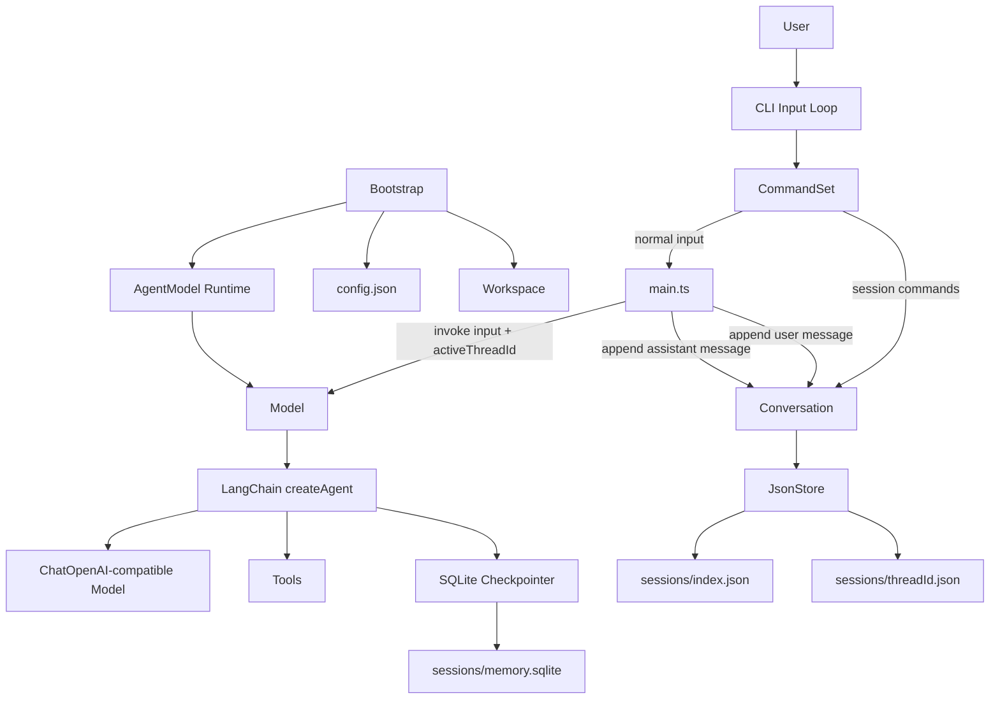
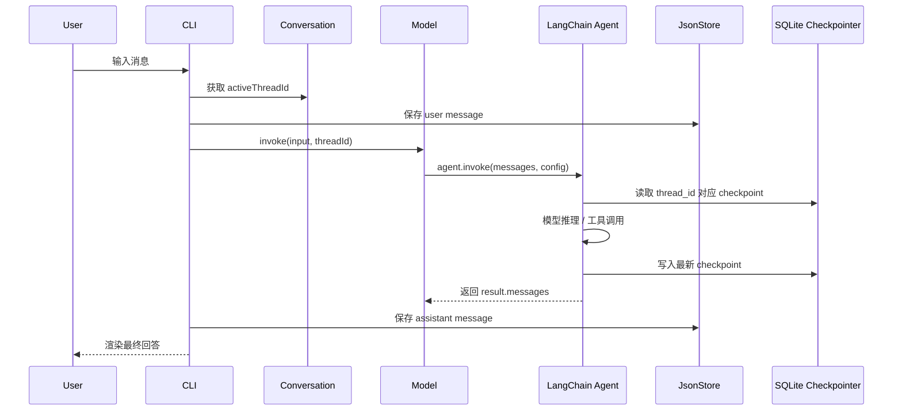

# mini-agent-langchain

`mini-agent-langchain` 是一个基于 LangChain.js / LangGraph 的命令行 Agent 原型。它的目标不是做一个简单的聊天壳，而是逐步沉淀出一套可扩展的本地 Agent 运行时：支持多会话、短期记忆、可读历史记录、工具系统，以及未来的云端同步。

当前项目重点已经成型在两块：

- **记忆系统**：用 SQLite checkpointer 给 AI 保存上下文，用 JSON 给程序保存可展示会话历史。
- **CLI 会话系统**：支持创建、查看、切换 thread，让同一个会话 id 同时驱动用户历史和 AI checkpoint。

## 功能概览

- 基于 `langchain` 的 `createAgent` 创建 Agent。
- 基于 `@langchain/openai` 接入 OpenAI-compatible chat model。
- 基于 `@langchain/langgraph-checkpoint-sqlite` 持久化 AI 短期记忆。
- 基于 JSON 文件保存用户可见的会话索引和消息记录。
- 支持 CLI 会话命令：
  - `/thread`
  - `/threads`
  - `/thread-new [title]`
  - `/thread-use <id>`
  - `/help`
- 预留工具系统目录，后续可接入 `read_file`、`list_files`、`search_files` 等 LangChain tools。

## 架构图



## 记忆系统设计

项目中有两种“记忆”，职责不同。

```txt
SQLite Checkpointer
  给 AI 用
  保存 LangGraph Agent state
  根据 thread_id 恢复模型上下文

JsonStore
  给程序和用户界面用
  保存会话列表和可读历史消息
  支持 /threads 和 /thread-use
```

### 存储布局

运行后会在用户目录下创建：

```txt
~/.mini-agent/
  config.json
  logs/
  sessions/
    index.json
    <threadId>.json
    memory.sqlite
  workSpaceRoot/
```

其中：

- `sessions/index.json`：会话索引，保存 `threadId`、标题、创建时间、更新时间。
- `sessions/<threadId>.json`：单个会话的用户可见消息历史。
- `sessions/memory.sqlite`：LangGraph SQLite checkpointer，用来恢复 AI 上下文。

### 会话切换如何恢复 AI 记忆

切换会话时，程序从 `JsonStore` 读取会话 id：

```txt
/thread-use <id>
  -> Conversation.switchConversation(id)
  -> activeThreadId = id
```

下一次用户输入时：

```txt
main.ts
  -> model.invoke(input, conversation.getActiveThreadId())
  -> Memory.getConfig(threadId)
  -> { configurable: { thread_id: threadId } }
  -> SQLite checkpointer 根据 thread_id 恢复上下文
```

所以同一个 `threadId` 同时连接两层存储：

```txt
JsonStore/<threadId>.json
  用户可见历史

SQLite checkpointer thread_id=<threadId>
  AI 内部上下文
```

## 核心运行流程



## 模块说明

```txt
src/main.ts
  CLI 主循环，连接命令系统、会话系统和模型调用。

src/bootstrap/
  启动初始化，包括用户配置、工作目录、Agent runtime。

src/config/
  读取和写入 ~/.mini-agent/config.json。

src/workspace/
  管理 ~/.mini-agent、sessions、logs、workspaceRoot 等目录。

src/cli/
  命令解析、会话命令、终端视图渲染。

src/Memory/
  Conversation：当前会话控制器。
  JsonStore：会话索引和可读历史存储。
  SqliteStore：LangGraph SQLite checkpointer。
  Memory：checkpointer 门面。

src/model/
  AgentModel：Agent runtime 管理。
  Model：LangChain Agent 封装。
  prompts/：系统提示词。
  tools/：工具系统预留目录。
```

## 工具系统规划

当前 `src/model/tools` 还是轻量骨架，推荐下一步按 LangChainJS 官方工具机制接入。

计划结构：

```txt
src/model/tools/
  index.ts
  common/
    IO_tool.ts
    Search_tool.ts
    Shell_tool.ts
```

推荐第一批工具：

```txt
read_file
  读取文本文件

list_files
  列出目录内容

search_files
  在工作区内搜索文本
```

工具接入 `Model.ts` 的方式：

```ts
this.CurrentAgent = createAgent({
  model: this.CurrentModel,
  tools: Tools.getTools(),
  checkpointer: this.CurrentMemory.getCheckpointer(),
});
```

关于 LangChainJS 工具的官方机制，可查看：

[docs/langchainjs-tools-guide.md](./docs/langchainjs-tools-guide.md)

## 安装

```bash
npm install
```

Windows 上如果安装 `better-sqlite3` 失败，需要安装 Visual Studio Build Tools，并勾选 C++ 构建工具链。

## 配置

首次运行时，程序会引导填写：

- 模型提供商
- 模型名称
- API Key
- Base URL
- 工作目录

也可以参考 `.env.example` 和 `~/.mini-agent/config.json` 手动配置。

## 开发运行

```bash
npm run dev
```

或：

```bash
npm run chatx
```

## 构建

```bash
npm run build
```

## 类型检查

```bash
npm run typecheck
```

## 完整检查

```bash
npm run check
```

## CLI 命令

```txt
/thread
  查看当前会话

/threads
  查看所有会话

/thread-new [title]
  新建会话并切换过去

/thread-use <id>
  切换到已有会话

/help
  显示帮助
```

## 设计原则

### 会话 id 属于业务层

会话 id 由 `JsonStore` 的 `index.json` 持久化管理，而不是由 SQLite checkpointer 生成。

```txt
JsonStore
  threadId 的来源

SQLite Checkpointer
  threadId 的消费者
```

这样未来上云时，可以把 `JsonStore` 替换或扩展为：

```txt
CloudThreadStore
HybridThreadStore
```

而 SQLite checkpointer 仍然只根据同一个 `threadId` 恢复 AI 上下文。

### JsonStore 只保存用户可见历史

工具调用结果默认不写入 JSON 历史。原因是工具结果属于 Agent 内部过程，最终 assistant 输出已经基于工具结果生成。

```txt
JsonStore
  user / assistant 可见消息

SQLite Checkpointer
  HumanMessage / AIMessage / ToolMessage / checkpoint state
```

如果未来需要调试或审计工具调用，可以再开启 `tool` 消息记录。

## 后续路线

- 完成 `Tools` 静态工具集合。
- 接入 `read_file` 和 `list_files`。
- 新增 `/history` 命令，展示当前会话 JSON 历史。
- 新增 `/thread-delete <id>`。
- 抽象 `ThreadStore` / `MessageStore` 接口，为云同步做准备。
- 加入工具权限模型。
- 支持 MCP 或第三方工具包。

