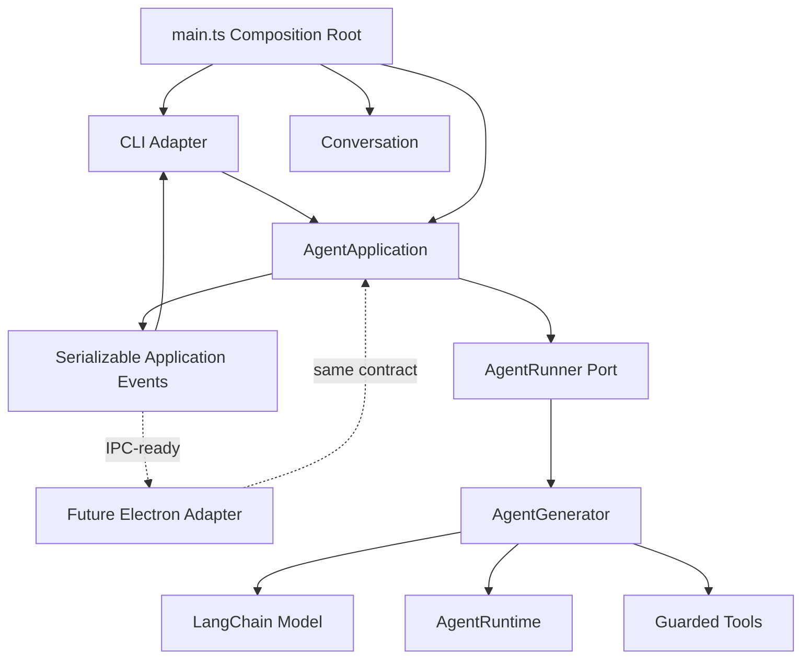
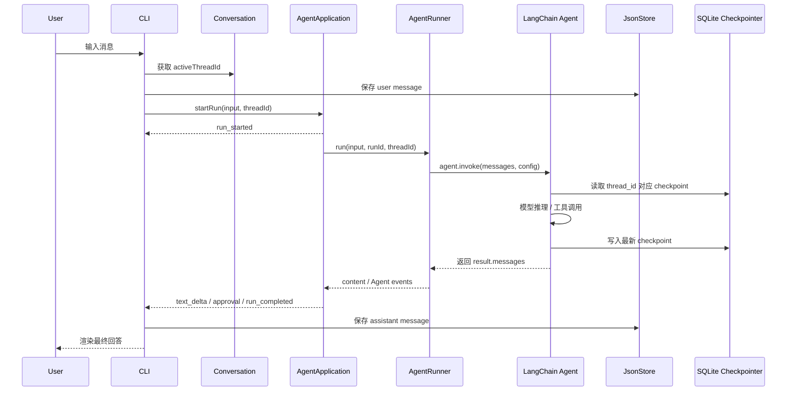

# mini-agent-langchain

`mini-agent-langchain` 是一个基于 LangChain.js / LangGraph 的命令行 Agent 原型。它的目标不是做一个简单的聊天壳，而是逐步沉淀出一套可扩展的本地 Agent 运行时：支持多会话、短期记忆、可读历史记录、工具系统，以及未来的云端同步。

当前项目重点已经成型在三块：

- **记忆系统**：用 SQLite checkpointer 给 AI 保存上下文，用 JSON 给程序保存可展示会话历史。
- **CLI 会话系统**：支持创建、查看、切换 thread，让同一个会话 id 同时驱动用户历史和 AI checkpoint。
- **安全执行系统**：文件工具受真实工作区边界、审批策略、原子写入和运行预算保护。

## 功能概览

- 基于 `langchain` 的 `createAgent` 创建 Agent。
- 基于 `@langchain/openai` 接入 OpenAI-compatible chat model。
- 基于 `@langchain/langgraph-checkpoint-sqlite` 持久化 AI 短期记忆。
- 基于 JSON 文件保存用户可见的会话索引和消息记录。
- 支持 CLI 会话命令：
  - `/thread`
  - `/threads`
  - `/thread-new [title]`
  - `/thread-use <id>`
  - `/help`
- 支持 `/paste` 多行输入，单独输入 `.end` 提交。
- 内置 `read_file`、`list_files`、`search_text`、`write_file` 和 `edit_file`。
- 写入和编辑默认需要终端确认，可选择仅允许一次或当前会话允许。
- 支持主 Agent 向只读文本子 Agent 委派任务。
- 支持复杂只读任务的结构化计划、DAG 验证、确定性串行调度和结果评审。
- 简单任务保留 direct mode，不强制进入多 Agent 编排。
- 支持最大轮次、工具调用预算、委派深度、运行超时和 Ctrl+C 取消。

## 架构图



`AgentApplication` 和 `ThreadApplication` 是界面无关的用例层。CLI 不直接调用模型、Agent 内部事件或 JSON 存储；它只操作应用用例并渲染可 JSON 序列化的事件与快照。未来接入 Electron 时，可以保留应用层和 Agent 运行时，只新增 IPC adapter 与 renderer。

## 记忆系统设计

项目中有两种“记忆”，职责不同。

```txt
SQLite Checkpointer
  给 AI 用
  保存 LangGraph Agent state
  根据 thread_id 恢复模型上下文

JsonStore
  给程序和用户界面用
  保存会话列表和可读历史消息
  支持 /threads 和 /thread-use
```

### 存储布局

运行后会在用户目录下创建：

```txt
~/.mini-agent/
  config.json
  logs/
  sessions/
    index.json
    <threadId>.json
    memory.sqlite
  workSpaceRoot/
```

其中：

- `sessions/index.json`：会话索引，保存 `threadId`、标题、创建时间、更新时间。
- `sessions/<threadId>.json`：单个会话的用户可见消息历史。
- `sessions/memory.sqlite`：LangGraph SQLite checkpointer，用来恢复 AI 上下文。

### 会话切换如何恢复 AI 记忆

切换会话时，程序从 `JsonStore` 读取会话 id：

```txt
/thread-use <id>
  -> Conversation.switchConversation(id)
  -> activeThreadId = id
```

下一次用户输入时：

```txt
main.ts
  -> model.invoke(input, conversation.getActiveThreadId())
  -> Memory.getConfig(threadId)
  -> { configurable: { thread_id: threadId } }
  -> SQLite checkpointer 根据 thread_id 恢复上下文
```

所以同一个 `threadId` 同时连接两层存储：

```txt
JsonStore/<threadId>.json
  用户可见历史

SQLite checkpointer thread_id=<threadId>
  AI 内部上下文
```

## 核心运行流程



## 模块说明

```txt
src/main.ts
  仅作为组合根，装配 CLI、应用层、会话和 Agent runner。

src/application/
  AgentApplication：启动、等待、取消 run，以及协调工具授权。
  ThreadApplication：创建、切换、删除会话并协调消息持久化。
  contracts：可序列化的应用事件和请求。
  ports：界面无关的 AgentRunner、ThreadStore 和 MessageStore 端口。

src/bootstrap/
  启动初始化，包括用户配置、工作目录、Agent runtime。

src/config/
  读取和写入 ~/.mini-agent/config.json。

src/workspace/
  管理 ~/.mini-agent、sessions、logs、workspaceRoot 等目录。

src/cli/
  单一 stdin 会话、命令解析、应用适配器和终端事件渲染。

src/Memory/
  Conversation：旧版兼容会话门面，新入口不再直接依赖。
  JsonStore：ThreadStore / MessageStore 的本地 JSON 实现。
  SqliteStore：LangGraph SQLite checkpointer。
  Memory：checkpointer 门面。

src/model/
  AgentModel：Agent runtime 管理。
  Model：LangChain Agent 封装。
  prompts/：系统提示词。

src/Agent/
  主 Agent、子 Agent、事件、执行上下文和运行预算。
  orchestration/：结构化计划、DAG 验证、任务调度、结果评审与答案汇总。

src/tools/
  文件工具、路径边界、原子写入和工具注册。

src/security/
  工具权限策略、审批决策和安全工具包装。
```

## 工具与安全系统

当前工具集合：

```txt
read_file
  读取文本文件

list_files
  列出目录内容

search_text
  在工作区内搜索文本

write_file / edit_file
  创建、覆盖或精确修改文本文件
```

读取工具默认允许；写入工具默认询问；未注册工具默认拒绝。所有文件路径都会先进行词法边界检查，再解析真实路径，拒绝通过符号链接或 Junction 越过工作区。文件写入使用同目录临时文件和原子替换，降低中途失败导致文件损坏的风险。

默认运行限制：

```txt
maxTurns             8
maxToolCalls         20
timeoutMs            120000
maxDelegationDepth   1
```

结构化编排第一阶段限制：

```txt
maxPlanTasks         6
maxPlanDepth         4
maxTaskAttempts      2
planned sideEffect   none
```

计划任务目前串行执行且仅允许无副作用的内置子 Agent；写入任务继续走 direct mode 和现有人工审批。后续阶段将在资源锁和失败传播基础上开启安全并行。

关于 LangChainJS 工具的官方机制，可查看：

[docs/langchainjs-tools-guide.md](./docs/langchainjs-tools-guide.md)

## 安装

```bash
npm install
```

Windows 上如果安装 `better-sqlite3` 失败，需要安装 Visual Studio Build Tools，并勾选 C++ 构建工具链。

## 配置

首次运行时，程序会引导填写：

- 模型提供商
- 模型名称
- API Key
- Base URL
- 工作目录

也可以参考 `.env.example` 和 `~/.mini-agent/config.json` 手动配置。

## 开发运行

```bash
npm run dev
```

或：

```bash
npm run chatx
```

## 构建

```bash
npm run build
```

## 类型检查

```bash
npm run typecheck
```

## 完整检查

```bash
npm run check
```

## CLI 命令

```txt
/thread
  查看当前会话

/threads
  查看所有会话

/thread-new [title]
  新建会话并切换过去

/thread-use <id>
  切换到已有会话

/help
  显示帮助

/paste
  进入多行输入模式，单独输入 .end 提交
```

## 设计原则

### 会话 id 属于业务层

会话 id 由 `JsonStore` 的 `index.json` 持久化管理，而不是由 SQLite checkpointer 生成。

```txt
JsonStore
  threadId 的来源

SQLite Checkpointer
  threadId 的消费者
```

这样未来上云时，可以把 `JsonStore` 替换或扩展为：

```txt
CloudThreadStore
HybridThreadStore
```

而 SQLite checkpointer 仍然只根据同一个 `threadId` 恢复 AI 上下文。

### JsonStore 只保存用户可见历史

工具调用结果默认不写入 JSON 历史。原因是工具结果属于 Agent 内部过程，最终 assistant 输出已经基于工具结果生成。

```txt
JsonStore
  user / assistant 可见消息

SQLite Checkpointer
  HumanMessage / AIMessage / ToolMessage / checkpoint state
```

如果未来需要调试或审计工具调用，可以再开启 `tool` 消息记录。

## 后续路线

- 新增 Electron IPC adapter；renderer 只消费 `ApplicationEvent`，不导入 Agent、模型或文件系统模块。
- 为应用事件和 DTO 增加协议版本，形成稳定的 IPC compatibility contract。
- 将内存中的运行快照扩展为可选持久化运行日志、token 与费用统计。
- 新增 `/history` 命令，展示当前会话 JSON 历史。
- 新增 `/thread-delete <id>`。
- 删除会话时同步清理 SQLite checkpoint。
- 抽象 `ThreadStore` / `MessageStore` 接口，为云同步做准备。
- 增加结构化运行日志、token 和费用统计。
- 支持 MCP 或第三方工具包。
