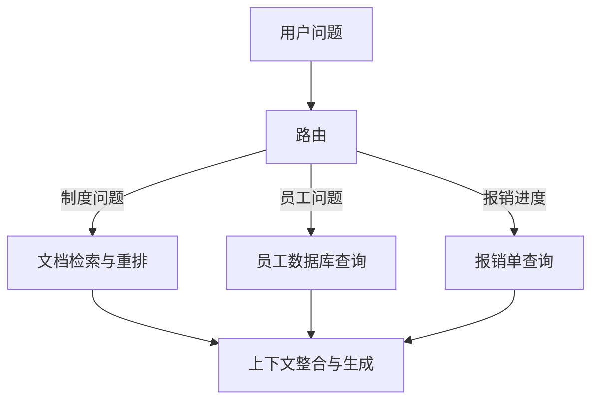

# 03 模块化 RAG：路由与多数据源

## 1. 为什么需要模块化？

当知识助手既要查制度，又要查员工、报销单和计算金额时，一条统一的文档检索流程不能覆盖所有问题。

模块化 RAG 把这些处理能力拆成可替换、可复用和可组合的模块。它不要求先实现高级 RAG 的所有优化。

**高级 RAG 关注怎么查得更好；模块化 RAG 关注这些能力如何组织。**

## 2. 模块不只包括数据源

| 模块 | 输入 | 输出 |
| --- | --- | --- |
| 查询改写 | 原问题 | 检索查询 |
| 路由 | 问题与任务信息 | 目标模块及参数 |
| 文档检索 | 查询 | 文档片段 |
| 员工查询 | 员工 ID | 姓名、职级等记录 |
| 报销单查询 | 报销单 ID | 状态、金额、城市、晚数 |
| 重排 | 问题与候选片段 | 排序后的片段 |
| 上下文整合 | 多来源证据 | 生成所需上下文 |
| 生成 | 原问题与上下文 | 回答 |

统一输出格式有助于复用，但输入应符合业务语义。员工模块需要明确 ID，制度检索适合自然语言，不必强行用同一种字符串解释所有请求。

## 3. 路由怎样组织流程？



路由可以来自明确规则，也可以由模型分类。下面只展示模型路由的结果结构：

```python
from typing import Literal
from pydantic import BaseModel, Field

class Route(BaseModel):
    target: Literal["policy", "employee", "claim", "clarify"]
    record_id: str | None = Field(description="用户明确给出的ID；没有则为null")
```

`clarify` 用于缺少必要信息的情况。模型选择目标以后，还应校验参数，再执行对应模块，而不是直接把自由文本当成任意数据库命令。

## 4. 结构化数据为什么不必向量化？

问“R001 的状态”时，已有明确主键，直接查数据库通常更符合任务。下面的 `connection` 是已建立的数据库连接，`claim_id` 是经校验的报销单 ID：

```python
row = connection.execute(
    "SELECT status FROM claims WHERE claim_id = ?",
    (claim_id,),
).fetchone()
```

这里采用 SQLite 的参数占位方式。数据库接口不同，占位符也可能不同。查询结果可以转换为 `Document`，保留记录 ID 和来源，再与文档检索结果一起整理。

LangChain 官方也说明已有 SQL、CRM 等知识源可以直接查询或作为工具使用，不要求全部重新建立向量库。[Retrieval 文档](https://docs.langchain.com/oss/python/langchain/retrieval)

## 5. 它与 Agentic RAG 的边界在哪里？

假设问题是“R001 的住宿金额是否超标”，需要：

```text
查R001 → 获取员工ID和城市 → 查职级 → 查额度 → 计算
```

如果开发者预先写好这条流程，它可以是模块化工作流。若由智能体观察第一步结果，动态决定还要查哪些信息、是否换一种检索方式，就进一步涉及 Agentic RAG。

使用 LLM 做一次路由，并不等于已经具备完整的自主规划和反馈循环。关键要看运行时究竟有哪些决策交给模型。

## 6. 判断是否真正模块化

设想要换一个重排模型：能否只替换该模块，并让原有制度问答继续工作？新增订单数据源时，能否复用上下文整合与生成？

这比“代码拆成几个文件”更能体现模块化价值。模块可以串联、分支、并行或循环，路由只是组合方式之一。

思考：如果两个模块对同一个金额使用不同单位，统一成 `Document` 就足够了吗？还需要明确金额单位、时间与适用条件等数据语义。

下一篇：[04 图 RAG](04_图RAG_关系检索与证据路径.md)。
