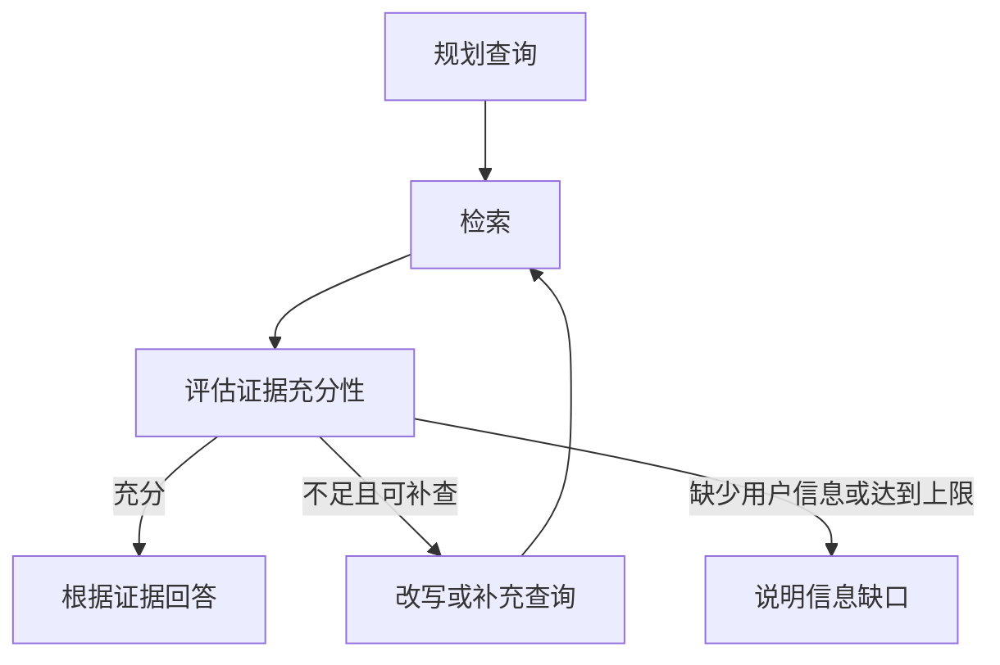

# 06 LangGraph：评估、改写与有限循环

## 1. 为什么要显式画出流程？

基础 Agent 能决定是否继续调用工具，但有时需要明确规定：检索后必须评估、证据不足最多重试几次、停止时怎样说明缺口。

LangGraph 让这些要求成为可观察的节点与分支。官方已有包含检索、资料评估、查询改写和生成的 [自定义 RAG Agent 教程](https://docs.langchain.com/oss/python/langgraph/agentic-rag)。本课提炼其设计思路，并强调证据充分性与有限循环。

## 2. 区分“相关”与“充分”

“住宿额度按职级执行”与问题有关，却不足以回答具体金额。评估器应检查能否回答原问题，包括职级、城市、年份、数值等必要条件，而不仅是是否出现相关词语。



模型参与下一轮查询和证据判断；允许哪些动作、最多多少轮、失败时去哪里，则由开发者定义。

## 3. 状态需要保存什么？

```python
from typing import TypedDict
from langchain_core.documents import Document

class RAGState(TypedDict):
    question: str
    query: str
    documents: list[Document]
    attempts: int
    sufficient: bool
    missing_info: str
    answer: str
```

`question` 保存用户原始目标，`query` 保存当前检索表达，不能反复改写后丢失原问题。`documents` 可以保留多轮互补证据，`attempts` 记录检索次数。

LangGraph 节点返回局部状态更新。如果没有专门的 reducer，字段通常被新值替换。因此多轮证据要显式合并，不能不小心用第二轮额度表覆盖第一轮员工职级信息。[Graph API](https://docs.langchain.com/oss/python/langgraph/graph-api)

## 4. 节点如何分工？

| 节点 | 主要职责 | 不应混淆的事情 |
| --- | --- | --- |
| 规划 | 确定下一轮查询或要求用户补充 | 不猜测缺失事实 |
| 检索 | 调用检索器并更新证据与次数 | 不同时偷偷改变原问题 |
| 评估 | 判断是否充分并说明缺口 | 相关不等于充分 |
| 改写 | 针对缺口形成更合适的查询 | 不重复无效搜索 |
| 生成 | 基于证据作答 | 不添加未被支持的结论 |
| 停止 | 说明已有信息和缺失内容 | 不把失败当成完整回答 |

评估可通过结构化输出返回 `sufficient` 和 `missing_info`。结构化 schema 让程序能处理分支，但判断内容仍可能出错。

## 5. Python 中怎样表达分支？

以下片段展示连线方式。`retrieve`、`grade`、`rewrite`、`generate`、`stop` 表示按上表职责实现的节点函数，不是框架自动提供的业务功能。

```python
from langgraph.graph import StateGraph, START, END

def after_grade(state):
    if state["sufficient"]:
        return "generate"
    if state["attempts"] >= 3:
        return "stop"
    return "rewrite"

builder = StateGraph(RAGState)
for name, node in [
    ("retrieve", retrieve), ("grade", grade), ("rewrite", rewrite),
    ("generate", generate), ("stop", stop),
]:
    builder.add_node(name, node)

builder.add_edge(START, "retrieve")
builder.add_edge("retrieve", "grade")
builder.add_conditional_edges("grade", after_grade, ["generate", "stop", "rewrite"])
builder.add_edge("rewrite", "retrieve")
builder.add_edge("generate", END)
builder.add_edge("stop", END)
```

这是预设的纠错循环骨架。若要允许智能体自主决定是否检索、选哪个工具，还应加入相应规划节点。仅仅把流程放到 LangGraph 中，不足以证明系统具有自主性。

## 6. 多轮检索应保留什么？

第一轮找到职级，第二轮找到额度，这两类证据必须一起进入最终上下文。合并时依据稳定片段 ID 去重，同时保留版本信息，避免把不同年份误当重复资料。

若多轮查询反复返回同样片段，应检查查询是否有新线索。再多搜一次不一定能解决缺少员工 ID 这类只能由用户补充的问题。

## 7. 设计停止条件

检索三轮是业务预算，图的 `recursion_limit` 是执行保护，模型请求超时又是第三类约束。一次检索轮次会经过多个图节点，三者不能直接相等。[图执行限制](https://docs.langchain.com/oss/python/langgraph/errors/GRAPH_RECURSION_LIMIT)

停止时应说明例如“已找到上海额度表，但缺少员工职级”，而不是随意选取一个金额。评估器本身需要验证，复杂循环也可能只是增加延迟。

思考：在没有新证据时继续改写，是检索策略问题，还是原始知识库缺少答案？应先定位缺口来源。

下一篇：[07 多智能体 RAG](07_多智能体RAG_主管与专家.md)。
