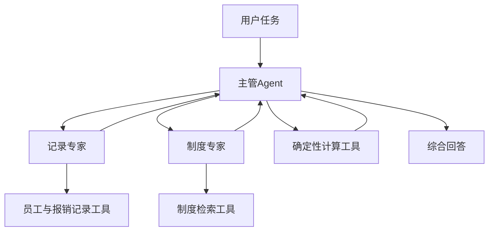

# 07 多智能体 RAG：主管与专家

## 1. 为什么从一个 Agent 拆成多个？

单个 Agent 可以完成检索、查询和生成。但任务复杂后，不同子任务可能需要不同工具、上下文和判断标准。

多智能体 RAG 将职责分给专门 Agent。例如制度专家只研究规则，记录专家只查业务数据，主管负责提出子任务和整合结果。

它增加的是角色分工和协作结构，不自动提高准确性。对于简单问答，多个 Agent 可能只是增加调用与沟通成本。

## 2. 主管与专家如何连接？



每个专家都可以拥有自己的模型与工具循环。主管调用专家时，应提供完成子任务所需的信息，而不假设专家自动共享全部上下文。

LangChain 官方提供 [Subagents 模式](https://docs.langchain.com/oss/python/langchain/multi-agent/subagents)，其中可以将子智能体包装为主管可调用的工具。

## 3. 子智能体作为工具的接口

下面的 `policy_agent` 表示已创建的制度专家：

```python
from langchain.tools import tool

@tool
def ask_policy_expert(task: str) -> str:
    """向制度专家查询规则；任务需包含已知职级、出差城市和年份。"""
    result = policy_agent.invoke(
        {"messages": [{"role": "user", "content": task}]},
        config={"recursion_limit": 16},
    )
    return result["messages"][-1].text
```

主管再将该函数与其他专家工具放入自己的 `tools` 列表。这里的每次调用创建一条子任务消息；是否持久化、共享状态或延续历史，需要另行设计。

只返回专家最终文本比较简单，但可能丢失来源。对证据要求较高的场景，可约定结构化结果，例如“结论、来源ID、缺口、计算输入”，并校验这些字段。

## 4. 用报销任务理解依赖关系

假设要求“检查 R001 的住宿总额是否超出合计额度，并说明状态”。合理任务分解是：

| 步骤 | 负责人 | 需要取得的信息 |
| --- | --- | --- |
| 查报销单 | 记录专家 | 员工 E001、上海、两晚、1100 元、审批中 |
| 查职级 | 记录专家 | E001 为 P6 |
| 查现行额度 | 制度专家 | P6 到上海每晚 600 元 |
| 比较总额 | 计算工具 | 合计上限为 1200 元 |
| 说明结论和限制 | 主管 | 合计未超出，但审批中，且缺少逐晚明细 |

合计 1100 元不超过 1200 元，不能证明每晚都不超过 600 元；也不能证明材料齐全或审批必然通过。正确的任务边界要贯穿专家与主管之间的信息传递。

## 5. 哪些任务能并行？

已经知道员工与出差城市时，部分独立资料可以并行查询。但如果制度专家需要记录专家查出的职级，就有先后依赖。

多 Agent 是职责结构，并行是执行方式。不能因为用了多个 Agent，就无条件同时启动全部专家。

同理，确定性的加减乘除通常直接使用函数，不需要再创建一个“计算智能体”。是否使用 Agent 取决于任务是否需要判断与决策。

## 6. 协作常见失败

- 主管没把已知职级传给制度专家，导致专家无法判断适用额度。
- 专家把来源压缩掉，主管只能引用一个没有依据的摘要。
- 多个专家引用不同年份制度，主管没有检查冲突。
- 专家遇到缺失数据却补造结论，主管又把它视为事实。
- 主管重复委派同一任务，增加用量却没有新信息。

这些问题需要明确输入输出、保留来源、处理冲突和限制调用。子 Agent 的步数限制也不是整个系统的统一成本预算，需要统计嵌套调用。

## 7. 什么时候值得采用？

当工具与上下文差异较大、子任务可独立评估、角色分工确实改善质量或维护时，多智能体更有价值。若一个 Agent 已能可靠完成短任务，增加专家之前应先做同问题的成本与效果对照。

思考：制度专家返回“额度为600元”但未说明城市，主管是否应该直接使用？应先要求补充适用条件与来源。

下一篇：[08 RAG 评估与工程化](08_RAG评估与工程化.md)。
