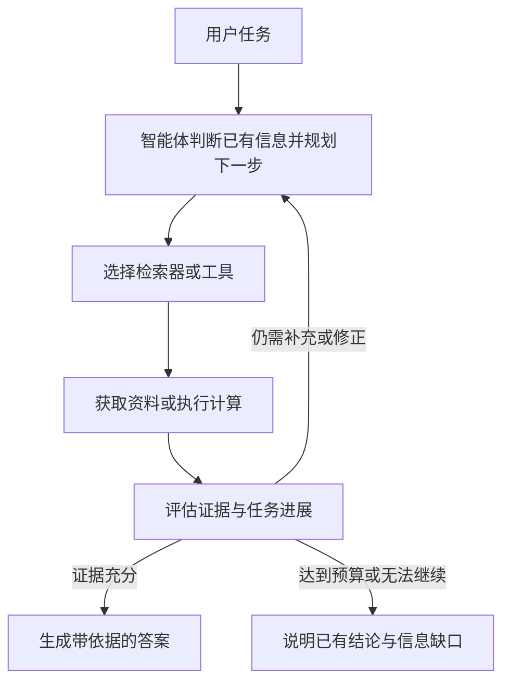

# RAG 范式演进知识总结

> 基于《10_Agentic_RAG_Survey_2025_中文翻译.md》第 2、3、5、10 节，以及学习讨论整理。本文按能力的发展脉络梳理演进，不将五种范式视为严格按年份出现、依次替代的产品版本。示例均为帮助理解而构造。

## 1. 演进主线：从查资料到自主组织证据

RAG（Retrieval-Augmented Generation，检索增强生成）通过检索外部知识，为大语言模型提供回答所需的上下文。基本过程是：

```text
用户问题 → 检索外部知识 → 整理为上下文 → 模型生成回答
```

它缓解了模型仅依赖预训练知识时的信息缺失、知识过时等问题。随着任务变复杂，系统需要进一步解决检索不准、证据不全、数据源多样、关系理解和动态决策等问题。

| 范式 | 发展的主要动机 | 核心变化 | 记忆关键词 |
| --- | --- | --- | --- |
| 朴素 RAG（Naïve RAG） | 让模型使用外部资料 | 建立基础的检索与生成流水线 | 查到就用 |
| 高级 RAG（Advanced RAG） | 改善检索和上下文质量 | 优化检索前、检索中、检索后的处理 | 查准、筛好、补齐 |
| 模块化 RAG（Modular RAG） | 适配多种任务和数据源 | 将能力拆成可替换、可复用、可组合的模块 | 组织与组合能力 |
| 图 RAG（Graph RAG） | 理解分散知识之间的关系 | 利用实体、关系、层次和图路径组织与检索知识 | 连接知识关系 |
| 智能体式 RAG（Agentic RAG） | 根据任务进展调整行动 | 引入智能体，动态规划、检索、评估和修正 | 自主控制流程 |

原文的叙述顺序是：朴素 RAG → 高级 RAG → 模块化 RAG → 图 RAG → Agentic RAG。这是一条理解能力扩展的线索；具体系统可以同时具备其中多种特征。

## 2. 朴素 RAG：先把检索与生成接起来

### 2.1 典型流程

```text
数据准备：文档 → 切块 → 建立索引

问题处理：用户问题 → 检索 Top-K 片段 → 拼入提示词 → 模型回答
```

如果使用向量检索，建立索引时会把文本片段向量化，查询时也将问题转为向量，再按相似度返回候选片段。Top-K 表示排名最靠前的 K 条结果。

### 2.2 “朴素”在哪里？

“朴素”主要指流程简单，通常直接使用原始问题检索，再把检索结果交给模型，缺少精细的中间处理。

| 环节 | 典型基础做法 | 容易遇到的问题 |
| --- | --- | --- |
| 文档处理 | 按固定长度切块 | 适用条件与结论被切开 |
| 查询处理 | 原问题直接检索 | 问题模糊，与文档表达不一致 |
| 结果选择 | 直接使用前 K 条 | 主题相似，但未包含答案 |
| 上下文构造 | 直接拼接片段 | 混入重复、无关或矛盾的信息 |
| 信息补充 | 使用本轮结果回答 | 缺乏继续补齐证据的步骤 |

例如，用户问“出差住宿最多报销多少”，系统只查到“按员工职级标准执行”，便直接用这段资料回答，流程里没有继续查职级额度表的步骤。

### 2.3 一个需要修正的理解

原文第 2.3.1 节以 TF-IDF、BM25 等关键词检索描述朴素 RAG，但不能据此把“朴素 RAG”限定为关键词检索。另一篇 RAG 综述明确将切块、向量化和向量相似度检索纳入朴素 RAG 的基础流程。[补充依据：RAG 综述第 II-A 节](https://arxiv.org/html/2312.10997v5#S2.SS1)

**判断是否朴素，主要看处理流程，而不是是否使用向量数据库。**

## 3. 高级 RAG：针对基础流程的薄弱环节做优化

高级 RAG 关注检索质量与上下文质量。原文重点列出稠密向量检索、上下文重排和迭代式多跳检索；结合补充综述，可以按检索前、检索时、检索后理解这些改进。[补充依据：RAG 综述第 II-B 节](https://arxiv.org/html/2312.10997v5#S2.SS2)

### 3.1 如何做到“查得更准确”？

| 环节 | 可采用的改进 | 作用 |
| --- | --- | --- |
| 检索前：资料准备 | 优化切块，保留上下文，添加日期、版本等元数据 | 减少证据被切散，帮助限定适用范围 |
| 检索前：问题处理 | 改写、扩展或拆分查询 | 让检索目标更明确，覆盖不同表达 |
| 检索时：召回 | 使用合适的语义检索，按需结合关键词检索 | 提高关键资料进入候选集的机会 |
| 检索后：筛选 | 重排、过滤、去重和上下文压缩 | 减少无关内容，突出有用证据 |
| 信息不足时 | 根据中间结果继续检索 | 补齐一次检索无法覆盖的信息 |

混合检索等技术可以出现在多个范式中，不能仅凭某一项技术给系统划定互斥类别。

### 3.2 向量检索、重排、多跳检索分别做什么？

- **向量检索：找到语义相关的候选资料。** 例如，让“住酒店能报多少钱”有机会匹配到“差旅住宿费用标准”。
- **重排：从候选资料中优先选出更能回答问题的内容。** 例如，在住宿标准、交通费标准和旧版制度之间，优先保留适用的住宿规定。
- **多跳检索：利用已找到的信息继续查。** 例如，先查到“额度取决于职级”，再查询对应职级的额度表。

重排只能处理已召回的候选资料。关键文档根本没有被召回时，仅调整排序无法补救，需要改进查询、索引或召回策略。

### 3.3 与朴素 RAG 的对照

```text
朴素 RAG：
问题 → 检索 → 拼接结果 → 回答

高级 RAG 的一种设计：
问题 → 明确查询 → 检索 → 重排与过滤 → 检查证据是否齐全
                                           ├─ 齐全 → 整理上下文 → 回答
                                           └─ 缺失 → 补充检索 → 再整理
```

高级 RAG 是一组优化思路，不要求每个系统同时具备全部能力。预设的多步流程也能实现补充检索；存在循环并不自动意味着它属于 Agentic RAG。

## 4. 模块化 RAG：让处理能力可以替换、复用和组合

### 4.1 模块化了什么？

可以把它理解为：将 RAG 中的检索工具和处理能力拆成模块，再按任务选择和组合。

模块包括文档检索、数据库查询、外部 API、查询改写、路由、重排、上下文压缩、计算和生成等。模块化并不要求先实现高级 RAG 的全部能力。

例如，一个企业知识助手可以这样组织：

```text
用户问题 → 路由模块
             ├─ 制度问题 → 文档检索 → 重排
             ├─ 报销进度 → 业务数据库查询
             └─ 报销总额 → 业务数据库查询 → 计算
           → 上下文整合 → 生成答案
```

### 4.2 与高级 RAG 的区别

| 比较维度 | 高级 RAG | 模块化 RAG |
| --- | --- | --- |
| 主要关注 | 检索和上下文的质量 | 能力的组织与组合 |
| 典型问题 | 怎样减少漏检、错选和无关上下文？ | 怎样替换检索器、接入数据源、复用流程？ |
| 改进示例 | 增加重排，优化切块 | 把重排独立成模块，使不同流程可以复用 |
| 两者关系 | 可用于模块内部 | 可以组合高级 RAG 的能力 |

**“把多个检索能力和数据来源分模块路由”抓住了典型实现，但范围还可以扩大到整个 RAG 流程。** 路由只是组合方式之一，模块也能串联、并行或循环调用。

单纯把代码拆到不同文件中，并不能充分体现模块化 RAG。关键是能力是否有清晰的输入输出，能够独立替换、复用和重新组合。

## 5. 图 RAG：把知识之间的关系纳入检索

文档片段可能分别包含答案的一部分，却没有直接呈现这些信息如何关联。Graph RAG 引入图结构，利用节点、关系、层次和路径组织证据。

以报销为例，可以把关系表达为：

```text
员工 A → 所属职级 → P6
P6 → 适用标准 → 差旅标准 B
差旅标准 B → 包含条款 → 某地区住宿限额
```

系统可以沿关系检索适用条款，并结合原始文档提供完整上下文。图 RAG 主要扩展的是知识表示与关系检索能力，适合需要跨实体、跨文档关联的问题。

代价是图数据的构建、维护和集成复杂性；结果也依赖实体、关系及其来源的质量。引入图结构并不能保证答案一定正确。

**Graph RAG 与模块化 RAG 可以结合：图检索器可以成为模块化系统中的一个检索模块。**

## 6. Agentic RAG：由智能体动态决定下一步

当任务路径不能完全预先确定时，需要系统根据已经获得的信息调整行动。Agentic RAG 引入显式的控制层，让智能体参与决定何时检索、使用什么工具、是否补充证据及何时停止。

原文将相关能力归纳为反思、规划、工具使用和多智能体协作。Agentic RAG 可以只有一个智能体，多智能体是可选架构。



在报销任务中，智能体可能先查制度，发现需要职级，再查员工资料；如果制度版本冲突，则继续查生效日期，然后综合证据回答。

### 与模块化 RAG 的关键区别

- **模块化**解决有哪些能力、怎样组合，控制方式可以由预设规则确定。
- **智能体式**进一步引入根据任务状态动态作出决策的能力。

两者可以同时存在：智能体使用模块化工具库，并根据检索结果动态决定调用顺序。原文第 5.6 节还介绍了同时结合图知识库、文档检索和智能体控制的系统。

更强的自主性也带来额外成本，包括多次模型调用、工具调用、循环和协调。原文第 10 节强调需要明确停止条件、约束工具使用，并评估整个处理过程。

## 7. 五种范式的关系与常见误解

这些范式强调的维度不同：朴素 RAG 提供基础流程，高级 RAG 优化质量，模块化 RAG 组织能力，Graph RAG 表达关系，Agentic RAG 控制行动。因此，同一个系统可以使用模块化架构，以高级检索作为基础，接入图检索，再由智能体编排。

| 常见理解 | 更准确的表述 |
| --- | --- |
| 朴素 RAG 就是关键词搜索 | 朴素主要指基础流水线，也能采用向量检索 |
| 向量化之后就成了高级 RAG | 向量化只是技术手段，高级 RAG 强调进一步优化流程 |
| 文本向量化就是向量量化 | 向量化是生成语义向量；量化通常指降低数值表示精度 |
| RAG 查到的一定是实时数据 | 时效性取决于数据源、索引更新和查询方式 |
| 模块化 RAG 只是多个数据源路由 | 还包括查询处理、重排、压缩、工具和生成等能力的组合 |
| Graph RAG 是 Agentic RAG 的必经阶段 | 图知识表示与智能体控制可以分别采用，也可以结合 |
| 多跳检索或循环就是 Agentic RAG | 还要看是否引入智能体的动态决策，预设流程也能多步检索 |
| Agentic RAG 必须有多个智能体 | 单智能体也可以管理检索与工具调用 |
| 越复杂的范式效果一定越好 | 效果取决于数据、任务、设计和评估，复杂度也会增加成本 |

## 8. 从演进中提炼的实践认识

依据原文第 10 节，可以按实际瓶颈逐步增加能力：

1. 先让基础 RAG 在目标问题上形成可评估的基线。
2. 如果漏检、错选较多，先改善资料质量、索引、查询和重排。
3. 如果任务与数据源增多，用模块化方式组织能力和复用流程。
4. 如果难点在实体关系与多跳关联，考虑图结构的价值。
5. 如果下一步依赖中间结果、需要灵活调整策略，再评估智能体控制是否值得引入。

这是一种按问题改进系统的思路，不是必须逐级完成的实施顺序。原文明确指出，Agentic RAG 并非普遍替代方案；可靠的检索和高质量索引仍是基础，智能体无法弥补持续糟糕的检索。

评估时应同时关注答案质量、证据是否充分，以及延迟、调用次数和计算成本。增加一个模块或智能体之后，应确认它是否改善了目标任务。

## 9. 来源与阅读定位

- [主要来源：10_Agentic_RAG_Survey_2025_中文翻译.md](../RAG/10_Agentic_RAG_Survey_2025_中文翻译.md)：第 2.3 节介绍五种范式，第 2.4～2.5 节讨论传统 RAG 的局限与智能体转变，第 3 节介绍智能体能力，第 5 节讨论架构，第 10 节提供实践指导。
- [补充来源：Retrieval-Augmented Generation for Large Language Models: A Survey](https://arxiv.org/html/2312.10997v5)：第 II-A、II-B 节用于澄清朴素 RAG 也可使用向量检索，以及高级 RAG 的检索前后优化。
- 本文的报销示例、对照流程和记忆关键词为学习性归纳，不是原文实验结果。主文档文件名含“2025”，但文首标注所译版本为 2026 年 4 月 1 日的 v4；本文沿用文件名定位来源，不据此推断各范式诞生年份。
