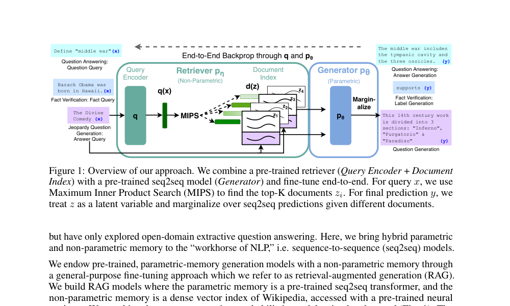
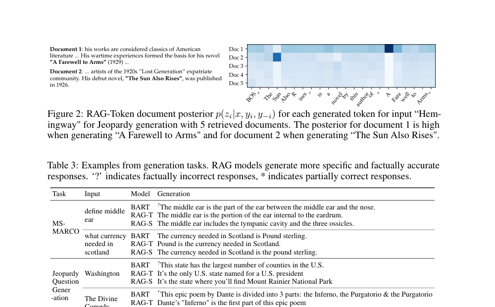
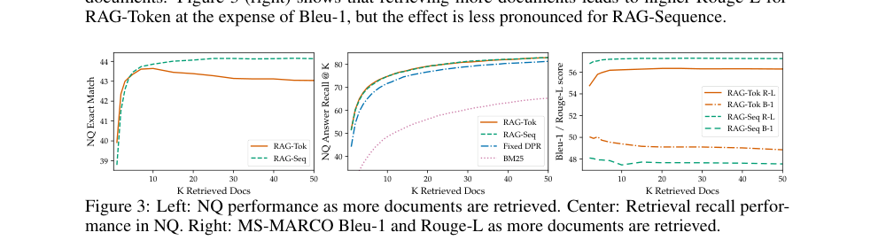
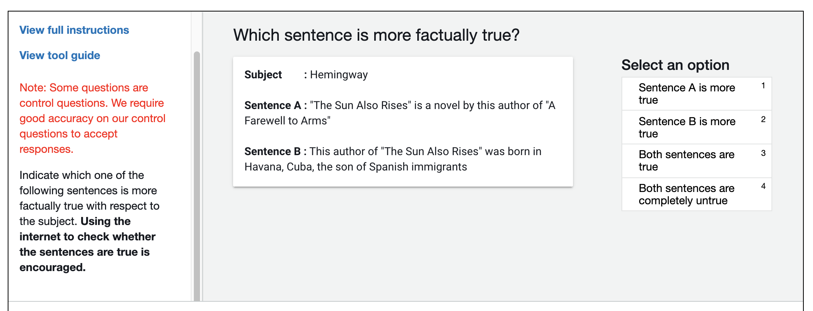

# 用于知识密集型自然语言处理任务的检索增强生成

**（Retrieval-Augmented Generation for Knowledge-Intensive NLP Tasks）**

> 本文为 Lewis 等人 2020 年论文《Retrieval-Augmented Generation for Knowledge-Intensive NLP Tasks》（arXiv:2005.11401v4）的中文精确翻译。

**作者**：Patrick Lewis†‡, Ethan Perez⋆, Aleksandra Piktus†, Fabio Petroni†, Vladimir Karpukhin†, Naman Goyal†, Heinrich Küttler†, Mike Lewis†, Wen-tau Yih†, Tim Rocktäschel†‡, Sebastian Riedel†‡, Douwe Kiela†

**单位**：†Facebook AI Research；‡伦敦大学学院（University College London）；⋆纽约大学（New York University）

**联系方式**：plewis@fb.com

---

> **阅读说明**：原论文译文保持不变；本文新增的辅助内容统一以“解读”“提示”或“速查”标出。阅读时可以先看这些内容建立整体框架，再回到原文和公式核对细节。

### 阅读路线图（新增解读）

这篇论文要解决的核心矛盾是：**语言模型擅长生成，但很难可靠地保存、更新和说明事实知识；搜索系统擅长找到资料，却不会直接组织成自然语言答案。** RAG 把两者接成一个可共同训练的概率模型。

可以先记住一条主线：

1. 把输入问题编码成一个向量；
2. 从维基百科向量索引中找出 top-K 个相关段落；
3. 让 BART 分别参考这些段落生成答案；
4. 综合“段落有多相关”和“基于该段落生成答案的概率”，得到最终输出；
5. 用最终答案的误差同时改进生成器和查询编码器。

本文的技术重点不是简单地“先搜索、再把结果塞给模型”，而是把**检索到哪个文档**建模为一个潜变量，并在多个候选文档上进行概率加权。

---

## 摘要

大型预训练语言模型已被证明能够在参数中存储事实性知识，并在下游自然语言处理任务上经过微调后取得最先进的成果。然而，它们访问和精确操纵知识的能力仍然有限，因此在知识密集型任务上，其性能落后于针对特定任务设计的架构。此外，为其决策提供出处（provenance）以及更新其世界知识，仍是悬而未决的研究问题。迄今为止，具备对显式非参数化记忆的可微分访问机制的预训练模型，仅被研究用于抽取式下游任务。我们探索了一种通用的微调方法，用于**检索增强生成（Retrieval-Augmented Generation，RAG）**——即结合预训练的参数化记忆与非参数化记忆来进行语言生成的模型。我们提出的 RAG 模型中，参数化记忆是一个预训练的 seq2seq 模型，非参数化记忆是一个维基百科的稠密向量索引，并通过预训练的神经检索器来访问。我们比较了两种 RAG 公式：一种在整个生成序列中条件于相同的检索段落，另一种可以为每个 token 使用不同的段落。我们在广泛的知识密集型自然语言处理任务上微调并评估了我们的模型，并在三个开放域问答任务上创造了最先进的成绩，超越了参数化 seq2seq 模型以及特定任务的"检索-抽取"架构。对于语言生成任务，我们发现 RAG 模型生成的文本比最先进的纯参数化 seq2seq 基线更加具体、更加多样、更具事实性。

> **摘要解读**
>
> - **参数化记忆**：知识隐含在模型权重里。例如，BART 可能凭训练记住“《永别了，武器》的作者是海明威”，但我们无法定位这条知识存在哪个参数中。
> - **非参数化记忆**：知识以可检索的原始文本存在，例如维基百科段落及其向量索引。它不靠重新训练模型来写入新事实。
> - **出处（provenance）**：模型作答时参考了哪些文档。检索结果可以作为答案依据，但“检索到了某段文字”并不自动等于答案被严格证明。
> - **本文贡献**：RAG 把检索器与生成器放进一个统一框架，并提出 RAG-Sequence 与 RAG-Token 两种对文档进行概率汇总的方式。

---

## 1 引言

预训练神经语言模型已被证明能够从数据中学到大量深入的知识 [47]。它们无需访问任何外部记忆即可做到这一点，即作为一种参数化的隐式知识库 [51, 52]。虽然这一进展令人振奋，但此类模型确实存在缺点：它们无法轻易扩展或修改其记忆，无法直接为其预测提供解释，并且可能产生"幻觉"（hallucination）[38]。将参数化记忆与非参数化（即基于检索的）记忆相结合的混合模型 [20, 26, 48] 可以解决其中一些问题，因为知识可以被直接修改和扩展，而且访问到的知识可以被检查和解释。REALM [20] 和 ORQA [31] 是最近提出的两个模型，它们将掩码语言模型 [8] 与可微分检索器相结合，已经展现出令人鼓舞的结果，但仅探索了开放域抽取式问答。在本文中，我们将混合的参数化和非参数化记忆引入"NLP 的主力"——即序列到序列（sequence-to-sequence，seq2seq）模型。我们通过一种通用的微调方法，为预训练的、参数化记忆的生成模型赋予非参数化记忆，我们将这种方法称为**检索增强生成（RAG）**。我们构建的 RAG 模型中，参数化记忆是一个预训练的 seq2seq transformer，非参数化记忆是一个维基百科的稠密向量索引，并通过预训练的神经检索器来访问。我们将这些组件组合在一个端到端训练的概率模型中（图 1）。检索器（**稠密段落检索器（Dense Passage Retriever，DPR）**[26]，下称 DPR）提供以输入为条件的潜在文档，然后 seq2seq 模型（BART [32]）再以这些潜在文档连同输入为条件来生成输出。我们通过 top-K 近似对潜在文档进行边缘化，既可以按输出整体进行（假设同一文档负责所有 token），也可以按 token 进行（不同文档负责不同 token）。与 T5 [51] 或 BART 类似，RAG 可以在任何 seq2seq 任务上进行微调，从而同时学习生成器和检索器。

此前已有大量工作提出了用非参数化记忆来丰富系统的架构，这些架构从零开始针对特定任务进行训练，例如记忆网络 [64, 55]、栈增强网络 [25] 和记忆层 [30]。相比之下，我们探索的设定是：参数化和非参数化记忆组件都经过预训练，并预先载入了大量知识。关键在于，通过使用预训练的访问机制，无需额外训练即可具备访问知识的能力。

> **解读｜为什么“两个组件都预训练”很重要？**
>
> 这里的工程思想是“组装两个已经会工作的模块”：DPR 已经学会按语义找段落，BART 已经学会理解并生成文本。下游任务只需微调，而不是从零训练搜索与语言能力。这也是 RAG 能作为通用架构迁移到问答、生成和分类任务的原因。

我们的结果凸显了将参数化与非参数化记忆与生成相结合对于**知识密集型任务**——即人类在无法访问外部知识源的情况下难以合理完成的任务——的益处。我们的 RAG 模型在开放的 Natural Questions [29]、WebQuestions [3] 和 CuratedTrec [2] 上取得了最先进的结果，并在 TriviaQA [24] 上大幅超越了近期使用专门预训练目标的方法。尽管这些是抽取式任务，我们发现不受约束的生成优于以往的抽取式方法。对于知识密集型生成，我们在 MS-MARCO [1] 和 Jeopardy 问题生成上进行了实验，发现我们的模型生成的回答比 BART 基线更具事实性、更具体、更多样。对于 FEVER [56] 事实核查，我们取得的成果与使用强检索监督的最先进流水线模型相差在 4.3% 以内。最后，我们证明了非参数化记忆可以被替换，从而在世界变化时更新模型的知识。¹

> **术语提示｜抽取式与生成式**
>
> - **抽取式问答**只能从已有段落中截取一段连续文本作为答案；如果正确答案没有原样出现，它通常无法回答。
> - **生成式问答**逐 token 生成答案，可以综合、改写或补全证据，因此更灵活；代价是也更可能生成证据没有支持的内容。
> - 论文把“生成能力”与“外部证据”结合起来，正是在争取这两者之间的平衡。

> ¹ 运行 RAG 实验的代码已作为 HuggingFace Transformers 库 [66] 的一部分开源，可在 <https://github.com/huggingface/transformers/blob/master/examples/rag/> 找到。RAG 模型的交互式演示可在 <https://huggingface.co/rag/> 找到。

---

## 2 方法

我们探索 RAG 模型，它们使用输入序列 x 检索文本文档 z，并将其作为生成目标序列 y 时的额外上下文。如图 1 所示，我们的模型利用两个组件：(i) 一个检索器 p_η(z|x)，参数为 η，在给定查询 x 时返回文本段落上的（经 top-K 截断的）分布；(ii) 一个生成器 p_θ(y_i|x, z, y_{1:i−1})，参数为 θ，基于前 i−1 个 token y_{1:i−1} 的上下文、原始输入 x 以及检索到的段落 z 来生成当前 token。

> **符号速查**
>
> - `x`：模型的输入，例如一个问题或一条待核查的主张。
> - `z`：检索到的某个文档段落。
> - `y`：完整目标输出；`y_i` 是第 `i` 个输出 token。
> - `y_{1:i−1}`：已经生成的前缀。模型是自回归生成的，即每一步都依赖此前输出。
> - `p_η(z|x)`：检索器认为文档 `z` 与输入 `x` 相关的概率。
> - `p_θ(y_i|x,z,y_{1:i−1})`：生成器参考输入、文档和已生成前缀后，生成下一个 token 的概率。
> - `η` 与 `θ`：分别代表检索器和生成器的参数，不是具体数值。

为了端到端地训练检索器和生成器，我们将检索到的文档视为潜变量。我们提出两种模型，它们以不同的方式对潜在文档进行边缘化，从而产生生成文本的分布。在一种方法 **RAG-Sequence** 中，模型使用同一个文档来预测每个目标 token。第二种方法 **RAG-Token** 可以基于不同的文档预测每个目标 token。在下文中，我们正式介绍这两种模型，然后描述 p_η 和 p_θ 组件，以及训练和解码过程。

> **解读｜潜变量与边缘化**
>
> 训练数据通常只给出“问题—答案”，并不告诉模型答案应当依据哪篇文档，因此文档 `z` 是**未被直接标注的隐藏选择**，也就是潜变量。边缘化的直观含义是：不强行认定某一篇文档绝对正确，而是让 top-K 文档都参与，并按各自概率加权求和。这样，最终答案正确时，对生成有帮助的文档会获得更强的学习信号。

### 2.1 模型

**RAG-Sequence 模型**：RAG-Sequence 模型使用同一个检索到的文档来生成完整序列。从技术上讲，它将检索到的文档视为单个潜变量，通过 top-K 近似对该潜变量进行边缘化，从而得到 seq2seq 概率 p(y|x)。具体而言，使用检索器检索 top K 个文档，生成器为每个文档产生输出序列概率，然后对其进行边缘化：

p_RAG-Sequence(y|x) ≈ Σ_{z∈top-k(p(·|x))} p_η(z|x) · p_θ(y|x, z) = Σ_{z∈top-k(p(·|x))} p_η(z|x) · ∏_{i=1}^{N} p_θ(y_i|x, z, y_{1:i−1})

**RAG-Token 模型**：在 RAG-Token 模型中，我们可以为每个目标 token 抽取不同的潜在文档，并相应地进行边缘化。这使得生成器在产生答案时能够从多个文档中选择内容。具体而言，使用检索器检索 top K 个文档，然后生成器为每个文档产生下一个输出 token 的分布，再进行边缘化，并对下一个输出 token 重复此过程。正式地，我们定义：

p_RAG-Token(y|x) ≈ ∏_{i=1}^{N} Σ_{z∈top-k(p(·|x))} p_η(z|x) · p_θ(y_i|x, z, y_{1:i−1})

> **公式解读｜两种 RAG 的差别只在求和位置**
>
> - **RAG-Sequence**：先计算“在某一篇文档条件下，整段输出出现的概率”，再在文档之间求和。可理解为先选一位主要资料来源，再由它负责整段回答。
> - **RAG-Token**：生成每个 token 时，先在多篇文档之间求和，再把各 token 的概率连乘。可理解为写作过程中可以逐词切换资料来源。
> - 数学上，RAG-Sequence 是“`Σ` 在 `∏` 外”，RAG-Token 是“`Σ` 在 `∏` 内”。求和与乘积不能随意交换，因此它们定义了不同的输出概率分布。
> - 这里并不是每一步重新进行一次向量检索；top-K 候选通常由输入 `x` 确定。变化的是不同候选文档对当前 token 的概率贡献。

最后，我们指出，RAG 可用于序列分类任务，方法是将目标类别视为长度为 1 的目标序列，在这种情况下 RAG-Sequence 与 RAG-Token 是等价的。

> **解读｜为什么分类时二者等价？**
>
> 若输出只有一个标签 token，则乘积中只有一项；“整段只用一篇文档”和“每个 token 可用不同文档”不再有区别。这也是后文 FEVER 只需报告一种 RAG 结果的原因。

### 2.2 检索器：DPR

检索组件 p_η(z|x) 基于 DPR [26]。DPR 采用双编码器（bi-encoder）架构：

p_η(z|x) ∝ exp( d(z)ᵀ · q(x) )

d(z) = BERT_d(z)，q(x) = BERT_q(x)

其中 d(z) 是由 BERT_BASE 文档编码器 [8] 产生的文档稠密表示，q(x) 是由同样基于 BERT_BASE 的查询编码器产生的查询表示。计算 top-k(p_η(·|x))，即先验概率 p_η(z|x) 最高的 k 个文档 z 的列表，是一个**最大内积搜索（Maximum Inner Product Search，MIPS）**问题，可以在亚线性时间内近似求解 [23]。我们使用 DPR 的预训练双编码器来初始化我们的检索器并构建文档索引。该检索器被训练用于检索包含 TriviaQA [24] 问题和 Natural Questions [29] 答案的文档。我们将文档索引称为**非参数化记忆**。

> **解读｜DPR、双编码器与 MIPS**
>
> - **稠密表示**是一个固定长度的连续向量。语义相近的查询和段落经过训练后会有较大的向量内积，即 `d(z)ᵀq(x)`。
> - **双编码器**分别编码查询和文档。优点是全部文档向量可以离线预计算；在线只需编码一次查询，然后做最近邻搜索。
> - 这不同于**交叉编码器**：交叉编码器把查询和每篇文档一起送入模型，通常判断更细致，但无法低成本地扫描 2100 万段落。
> - `∝ exp(...)` 表示先把内积分数指数化，再归一化成概率。实际只保留 top-K，是因为不可能对全部文档逐一计算生成概率。
> - **MIPS**解决的是“在海量向量中快速找内积最大的若干个”；所谓亚线性和近似，意味着无需遍历整个库，但也不保证每次都找到理论上的绝对最优结果。

### 2.3 生成器：BART

生成器组件 p_θ(y_i|x, z, y_{1:i−1}) 可以使用任何编码器-解码器来建模。我们使用 BART-large [32]，一个具有 4 亿（400M）参数的预训练 seq2seq transformer [58]。为了在使用 BART 生成时将输入 x 与检索到的内容 z 结合起来，我们简单地将二者拼接。BART 使用去噪目标以及各种不同的加噪函数进行预训练。它在各种生成任务上取得了最先进的结果，并优于规模相当的 T5 模型 [32]。此后我们将 BART 生成器的参数 θ 称为**参数化记忆**。

> **解读｜BART 在这里做什么？**
>
> BART 是“读入一段文本，再生成另一段文本”的编码器—解码器模型。RAG 对每个候选文档构造类似“问题 + 文档”的输入，让 BART 输出答案。称它为参数化记忆，是因为预训练期间学到的语言规律和事实都压缩在权重中；即使检索结果不完整，它有时仍能靠这些权重补全答案。

### 2.4 训练

我们联合训练检索器和生成器组件，而无需对"应该检索哪个文档"进行任何直接监督。给定微调训练语料的输入/输出对 (x_j, y_j)，我们使用 Adam [28] 通过随机梯度下降最小化每个目标的负边际对数似然 Σ_j −log p(y_j|x_j)。在训练期间更新文档编码器 BERT_d 成本高昂，因为它需要像 REALM 在预训练期间所做的那样周期性更新文档索引 [20]。我们发现这一步骤对于获得强性能并非必要，因此保持文档编码器（和索引）固定，仅微调查询编码器 BERT_q 和 BART 生成器。

> **训练解读｜没有证据标签，检索器怎么学？**
>
> 对一个训练样本，若某篇候选文档使生成器更容易产生正确答案，那么这条路径会给整体似然更大贡献。反向传播会同时推动：生成器更会利用这篇文档，查询编码器也更倾向于下次检索到它。这就是**弱监督/潜变量训练**。不过梯度只能影响已经进入 top-K 的候选；如果有用文档从未被初始检索器召回，生成目标就很难把它“救回来”。
>
> 固定文档编码器是一个重要工程折中。若 `BERT_d` 改变，2100 万个文档的向量都可能过期，需要反复重建索引；只更新查询编码器则能保持索引稳定。

### 2.5 解码

在测试时，RAG-Sequence 和 RAG-Token 需要不同的方式来近似 arg max_y p(y|x)。

**RAG-Token**：RAG-Token 模型可以看作一个标准的自回归 seq2seq 生成器，其转移概率为：

p′_θ(y_i|x, y_{1:i−1}) = Σ_{z∈top-k(p(·|x))} p_η(z_i|x) · p_θ(y_i|x, z_i, y_{1:i−1})

为了解码，我们可以将 p′_θ(y_i|x, y_{1:i−1}) 代入标准的束搜索（beam）解码器。

**RAG-Sequence**：对于 RAG-Sequence，似然 p(y|x) 不会分解为常规的逐 token 似然，因此我们无法用单次束搜索求解。相反，我们对每个文档 z 运行束搜索，使用 p_θ(y_i|x, z, y_{1:i−1}) 对每个假设评分。这会得到一组假设 Y，其中一些假设可能没有出现在所有文档的束中。为了估计假设 y 的概率，我们对 y 未出现在束中的每个文档 z 运行一次额外的前向传播，将生成器概率与 p_η(z|x) 相乘，然后在各束上求和概率以得到边缘概率。我们将这种解码过程称为**"彻底解码"（Thorough Decoding）**。对于较长的输出序列，|Y| 可能变得很大，需要大量前向传播。为了更高效的解码，我们可以进一步近似 p_θ(y|x, z_i) ≈ 0，其中 y 是在从 x、z_i 进行束搜索期间未被生成的。一旦候选集 Y 生成完毕，这就避免了运行额外前向传播的需要。我们将这种解码过程称为**"快速解码"（Fast Decoding）**。

> **解码解读｜训练时会算概率，不代表测试时容易找到最佳文本**
>
> - **束搜索（beam search）**不会穷举所有句子，而是在每一步只保留若干个高分前缀，因此本身就是近似搜索。
> - RAG-Token 已经得到一个统一的“下一个 token 分布”，可直接套用普通束搜索。
> - RAG-Sequence 要比较的是“每篇文档对整条候选序列的支持”，候选又来自不同文档的束，因此还要跨文档重新汇总分数。
> - **彻底解码**对缺失的“候选—文档”组合补算分数，更接近完整边缘概率但成本高；**快速解码**把未出现在某文档束中的候选概率当作 0，以速度换取近似。

---

## 3 实验

我们在广泛的知识密集型任务上对 RAG 进行实验。对于所有实验，我们使用单一的维基百科转储（dump）作为我们的非参数化知识源。遵循 Lee 等人 [31] 和 Karpukhin 等人 [26] 的做法，我们使用 2018 年 12 月的转储。每篇维基百科文章被分割成互不重叠的 100 词块，共计 2100 万（21M）个文档。我们使用文档编码器为每个文档计算嵌入，并使用 FAISS [23] 构建一个单一的 MIPS 索引，采用**分层可导航小世界（Hierarchical Navigable Small World）**近似以实现快速检索 [37]。在训练期间，我们为每个查询检索 top k 个文档。我们考虑训练时 k ∈ {5, 10}，并使用开发集数据设置测试时的 k。下面讨论每个任务的实验细节。

> **实验设置解读**
>
> - **转储（dump）**是某一时点的维基百科快照，意味着模型能检索到的显式知识有明确时间边界。
> - 论文把文章切成 100 词的**段落块（passage/chunk）**。块太长会混入无关内容并增加生成成本；块太短则可能切断完整证据。这是检索系统中的典型粒度权衡。
> - **FAISS**是向量相似度搜索工具；**HNSW**用多层近邻图快速逼近最近邻。它们负责“怎样高效找到候选”，而 DPR 的编码器负责“什么样的候选在语义上相关”。
> - `k` 越大，找到证据的机会通常越高，但生成器需要处理更多“问题—段落”组合，时间和显存开销也会上升，并且会引入更多噪声。

### 3.1 开放域问答

开放域问答（QA）是一个重要的现实世界应用，也是知识密集型任务的常见测试平台 [20]。我们将问题和答案视为输入-输出文本对 (x, y)，并通过直接最小化答案的负对数似然来训练 RAG。我们将 RAG 与流行的抽取式 QA 范式 [5, 7, 31, 26] 进行比较，后者从检索到的文档中抽取答案片段，主要依赖非参数化知识。我们还与"闭卷 QA"（Closed-Book QA）方法 [52] 进行比较，这些方法像 RAG 一样生成答案，但不利用检索，而是纯粹依赖参数化知识。我们考虑四个流行的开放域 QA 数据集：Natural Questions (NQ) [29]、TriviaQA (TQA) [24]、WebQuestions (WQ) [3] 和 CuratedTrec (CT) [2]。由于 CT 和 WQ 规模较小，我们遵循 DPR [26] 的做法，用我们的 NQ RAG 模型初始化 CT 和 WQ 模型。我们使用与先前工作 [31, 26] 相同的训练/开发/测试划分，并报告精确匹配（Exact Match，EM）分数。对于 TQA，为了与 T5 [52] 比较，我们还在 TQA Wiki 测试集上进行了评估。

> **术语提示｜开放域、闭卷与 EM**
>
> - **开放域**表示答案可能来自一个很大的语料库，而不是题目预先附带的一小段阅读材料。
> - **闭卷**不是数据集不公开，而是作答时模型不能查询外部文本，只能依靠参数权重。
> - **精确匹配（EM）**通常在规范化答案后判断预测是否与参考答案完全一致。它清楚、严格，但会把某些语义正确而措辞不同的答案判错，因此更适合短答案问答。

### 3.2 生成式问答

RAG 模型可以超越简单的抽取式 QA，以自由形式、生成式的文本生成来回答问题。为了在知识密集型设定下测试 RAG 的自然语言生成（NLG）能力，我们使用 MSMARCO NLG 任务 v2.1 [43]。该任务由问题、每个问题从搜索引擎检索到的十个黄金段落，以及从检索到的段落中标注的完整句子答案组成。我们不使用所提供的段落，只使用问题和答案，从而将 MSMARCO 视为开放域生成式 QA 任务。MSMARCO 中有一些问题在无法访问黄金段落的情况下无法以匹配参考答案的方式回答，例如"加利福尼亚州火山（Volcano, CA）的天气如何？"，因此不使用黄金段落时性能会较低。我们还注意到，有些 MSMARCO 问题仅凭维基百科无法回答。在这种情况下，RAG 可以依赖参数化知识来生成合理的回答。

> **解读｜“黄金段落”不是普通的 top-K**
>
> 黄金段落是数据集已知含有回答依据的参考上下文，相当于把检索难题提前解决。本文刻意不把它交给 RAG，所以 RAG 的分数同时受“能否检索到资料”和“能否据此生成”两方面影响。与使用黄金段落的系统比较时，必须注意输入条件并不相同。

### 3.3 Jeopardy 问题生成

为了在非 QA 设定下评估 RAG 的生成能力，我们研究开放域问题生成。我们不是使用标准开放域 QA 任务中的问题（这些通常由简短、简单的问题组成），而是提出更具挑战性的生成 Jeopardy 问题的任务。Jeopardy 是一种不同寻常的格式，它要求根据关于某个实体的事实来猜测该实体。例如，"世界杯"（The World Cup）是问题"1986 年，墨西哥成为第一个两次主办这项国际体育赛事的国家"的答案。由于 Jeopardy 问题是精确的事实性陈述，以答案实体为条件生成 Jeopardy 问题构成了一项具有挑战性的知识密集型生成任务。

我们使用 SearchQA [10] 的划分，包含 10 万训练、1.4 万开发、2.7 万测试示例。由于这是一个新任务，我们训练了一个 BART 模型用于比较。遵循 [67] 的做法，我们使用经过 SQuAD 微调的 Q-BLEU-1 指标 [42] 进行评估。Q-BLEU 是 BLEU 的一种变体，对匹配实体的权重更高，并且在问题生成上与人类判断的相关性高于标准指标。我们还进行了两项人工评估，一项评估生成的事实性，另一项评估具体性。我们将**事实性**定义为陈述是否能够被可信的外部来源所佐证，将**具体性**定义为输入和输出之间高度的相互依赖 [33]。我们遵循最佳实践，使用成对比较评估 [34]。评估者会看到一个答案和两个生成的问题，一个来自 BART，一个来自 RAG。然后要求他们从四个选项中选择一个——问题 A 更好、问题 B 更好、两者都好、或两者都不好。

> **指标解读｜自动分数为何还要配人工评估？**
>
> BLEU/Q-BLEU 主要衡量生成文本与参考文本的 n-gram 重合，而同一个 Jeopardy 答案可以对应许多完全不同但都正确的问题。低重合不必然表示事实错误，高重合也不保证陈述真实。因此作者另外让人判断**事实是否可验证**以及**问题是否真正指向给定实体**。

### 3.4 事实核查

FEVER [56] 要求对自然语言主张是否被维基百科支持或反驳，或者是否有足够的信息来做出判断进行分类。该任务要求从维基百科中检索与主张相关的证据，然后对这些证据进行推理，以判断该主张是真实的、虚假的，还是仅凭维基百科无法验证的。FEVER 是一个检索问题，耦合着一个具有挑战性的蕴含推理任务。它还提供了一个合适的测试平台，用于探索 RAG 模型处理分类而非生成的能力。我们将 FEVER 类别标签（支持 supports、反驳 refutes、信息不足 not enough info）映射到单个输出 token，并直接用主张-类别对进行训练。关键在于，与大多数其他 FEVER 方法不同，我们不对检索到的证据使用监督。在许多现实世界应用中，检索监督信号不可用，而不需要此类监督的模型将适用于更广泛的任务。我们探索两种变体：标准的三分类任务（支持/反驳/信息不足）和 Thorne 与 Vlachos [57] 研究的二分类（支持/反驳）任务。在两种情况下我们都报告标签准确率。

> **解读｜FEVER 同时考两件事**
>
> 系统先要找到相关证据，再要判断证据与主张之间是支持、矛盾还是无法判断。最终标签错了，可能是“没找到”也可能是“没推理对”。本文只用最终标签训练，没有告诉检索器哪一句是证据，所以这是对端到端弱监督能力的检验，而不是纯粹的文本蕴含分类。

---

## 4 结果

### 4.1 开放域问答

表 1 展示了 RAG 以及最先进模型的结果。在全部四个开放域 QA 任务上，RAG 都创造了新的最先进成绩（仅在与 T5 可比较的 TQA 划分上）。RAG 结合了"闭卷"（仅参数化）方法的生成灵活性和"开卷"基于检索方法的性能。与 REALM 和 T5+SSM 不同，RAG 无需昂贵的、专门的"显著片段掩码"（salient span masking）预训练 [20] 即可获得强劲结果。值得注意的是，RAG 的检索器使用 DPR 的检索器初始化，而后者在 Natural Questions 和 TriviaQA 上使用了检索监督。RAG 与 DPR QA 系统相比表现良好，后者使用基于 BERT 的"交叉编码器"（cross-encoder）对文档重排序，并配有一个抽取式阅读器。RAG 表明，无论是重排序器还是抽取式阅读器，对于达到最先进性能都不是必需的。

即使在可能抽取答案的情况下，生成答案也有若干优势。包含答案线索但不逐字包含答案的文档，仍然可以为生成正确答案做出贡献，而这在标准抽取式方法中是不可能的，从而实现了对文档更有效的边缘化。此外，即使正确答案不在任何检索到的文档中，RAG 也能生成正确的答案，在 NQ 上此类情况达到 11.8% 的准确率，而抽取式模型在此类情况下得分将为 0%。

> **结果解读｜11.8% 说明了什么，又不说明什么？**
>
> 它说明生成器的参数化知识可以弥补检索缺口：即便 top-K 段落没有逐字答案，模型仍可能推断或记忆出答案。但这既是优势也是风险——同一种能力在模型记错时就会变成幻觉。因此，“答案不在文档中仍答对”不能推出模型始终忠于证据。

### 4.2 生成式问答

如表 2 所示，RAG-Sequence 在 Open MS-MARCO NLG 上比 BART 高出 2.6 个 Bleu 分和 2.6 个 Rouge-L 分。RAG 接近最先进的模型性能，考虑到以下因素，这一点令人印象深刻：(i) 那些模型访问了包含生成参考答案所需特定信息的黄金段落；(ii) 许多问题在没有黄金段落的情况下无法回答；(iii) 并非所有问题都能仅凭维基百科回答。表 3 展示了我们模型生成的一些答案。定性来看，我们发现 RAG 模型的幻觉更少，生成事实正确文本的频率高于 BART。随后我们还表明 RAG 的生成比 BART 更多样（见 §4.5）。

> **术语提示｜BLEU 与 ROUGE-L**
>
> - **BLEU**偏重预测与参考答案之间的局部 n-gram 精确匹配；这里的 Bleu-1 主要关注 unigram（单词）重合。
> - **ROUGE-L**基于最长公共子序列，更能反映较长片段在内容和顺序上的覆盖。
> - 两者都是“与参考文本有多像”，并不直接验证事实。论文关于“事实性更强”的结论还依赖人工评估和示例分析。

### 4.3 Jeopardy 问题生成

表 2 显示，在 Jeopardy 问题生成上，RAG-Token 的表现优于 RAG-Sequence，两种模型在 Q-BLEU-1 上都优于 BART。表 4 展示了人工评估结果，涉及 BART 和 RAG-Token 的 452 对生成。评估者指出，BART 比 RAG 更具事实性的情况仅占 7.1%，而 RAG 更具事实性的情况占 42.7%，两者都具有事实性的情况另有 17%，这清楚地证明了 RAG 在该任务上相对于最先进生成模型的有效性。评估者还发现 RAG 的生成在具体性上大幅领先。表 3 展示了每个模型的典型生成。

Jeopardy 问题通常包含两条独立的信息，而 RAG-Token 可能表现最佳，因为它能生成结合多个文档内容的回答。图 2 展示了一个例子。在生成"Sun"时，文档 2 的后验概率很高，它提到了"The Sun Also Rises"（《太阳照常升起》）。类似地，当生成"A Farewell to Arms"（《永别了，武器》）时，文档 1 主导了后验。有趣的是，在每本书的第一个 token 生成之后，文档后验变得平坦。这一观察表明生成器可以在不依赖特定文档的情况下补全书名。换句话说，模型的参数化知识足以补全书名。我们通过给 BART-only 基线输入部分解码结果"The Sun"来验证这一假设。BART 补全了生成 "The Sun Also Rises" is a novel by this author of "The Sun Also Rises"，表明书名"The Sun Also Rises"存储在 BART 的参数中。类似地，BART 会将部分解码 "The Sun Also Rises" is a novel by this author of "A 补全为 "The Sun Also Rises" is a novel by this author of "A Farewell to Arms"。这个例子展示了参数化和非参数化记忆如何协同工作——非参数化组件帮助引导生成，引出存储在参数化记忆中的特定知识。

> **解读｜“文档后验”与检索先验不是一回事**
>
> 检索器先根据问题给出 `p(z|x)`，这是还未观察答案时的**先验**。当某个输出 token 已知或正在被评价时，还可结合生成器对该 token 的支持度，推断“此处更可能依赖哪篇文档”，形成文档**后验**。图 2 展示的是这种事后归因：检索器负责把相关书目带入候选，BART 的参数知识负责沿着书名开头继续补全。

### 4.4 事实核查

表 2 展示了我们在 FEVER 上的结果。对于三分类，RAG 的得分与最先进模型相差在 4.3% 以内，这些模型是复杂的流水线系统，具有特定领域的架构和大量工程，并使用中间检索监督进行训练，而 RAG 不需要这些。对于二分类，我们与 Thorne 和 Vlachos [57] 进行比较，他们训练 RoBERTa [35] 在给定黄金证据句子的情况下将主张分类为真或假。RAG 达到了与该模型相差 2.7% 以内的准确率，尽管只被提供了主张，并自行检索证据。

我们还分析了 RAG 检索到的文档是否与 FEVER 中标注为黄金证据的文档相对应。我们计算了 RAG 检索到的 top k 文档与黄金证据标注之间的文章标题重叠。我们发现，在 71% 的情况下，排名第一的检索文档来自黄金文章；在 90% 的情况下，前 10 篇检索文章中存在黄金文章。

> **结果解读｜召回率决定了生成器的上限之一**
>
> top-1 的 71% 表示第一篇就命中黄金文章；top-10 的 90% 表示扩大候选后大多数样本能“见到”正确文章。余下约 10% 的样本中，若所需事实也不在参数化记忆里，下游推理再强也缺乏正确依据。注意这里比较的是**文章标题重叠**，不是证据句精确命中，也不是最终标签准确率。

### 4.5 额外结果

**生成多样性**：第 4.3 节表明，对于 Jeopardy 问题生成，RAG 模型比 BART 更具事实性和具体性。遵循近期关于促进多样性解码的工作 [33, 59, 39]，我们还通过计算不同模型生成的去重 n-gram 与总 n-gram 的比率来研究生成多样性。表 5 表明，RAG-Sequence 的生成比 RAG-Token 更多样，且两者都显著比 BART 更多样，而无需任何促进多样性的解码。

**检索消融**：RAG 的一个关键特征是学习为任务检索相关信息。为了评估检索机制的有效性，我们进行了消融实验，在训练期间冻结检索器。如表 6 所示，学习到的检索在所有任务上都改善了结果。

> **术语提示｜消融实验**
>
> 消融实验不是再提出一个更强模型，而是有意移除或固定某个组件，观察性能怎样变化。这里比较“可针对下游任务更新的查询编码器”和“完全冻结的检索器”，用来判断端到端学习检索是否真的贡献了性能。

我们将 RAG 的稠密检索器与基于词重叠的 BM25 检索器 [53] 进行比较。这里，我们用固定的 BM25 系统替换 RAG 的检索器，并在计算 p(z|x) 时使用 BM25 检索分数作为 logits。表 6 展示了结果。对于 FEVER，BM25 表现最佳，可能是因为 FEVER 主张高度以实体为中心，因此非常适合基于词重叠的检索。可微分检索在所有其他任务上都改善了结果，尤其是在开放域 QA 上，它至关重要。

> **解读｜稀疏检索并不天然落后**
>
> **BM25**主要利用查询词与文档词的精确重合及词频统计，适合实体名、专有名词高度重合的任务；**DPR**学习语义向量，擅长处理问题与答案段落措辞不同的情况。FEVER 上 BM25 更好说明检索器选择应由数据特征决定，而不是看到“神经/稠密”就默认更强。`logits` 是归一化成概率之前的原始分数。

**索引热替换（hot-swapping）**：像 RAG 这样的非参数化记忆模型的一个优势是，知识可以在测试时轻松更新。像 T5 或 BART 这样的纯参数化模型需要进一步训练才能在世界变化时更新其行为。为了证明这一点，我们使用 DrQA [5] 的 2016 年 12 月维基百科转储构建索引，并将使用该索引的 RAG 输出与主要结果中的较新索引（2018 年 12 月）进行比较。我们准备了一份 82 位在这些日期之间发生更替的世界领导人的列表，并使用模板"Who is {position}?"（例如"Who is the President of Peru?"）用每个索引查询我们的 NQ RAG 模型。对于 2016 年的世界领导人，RAG 使用 2016 年索引正确回答 70%；对于 2018 年的世界领导人，使用 2018 年索引正确回答 68%。使用不匹配的索引时准确率较低（使用 2018 年索引回答 2016 年领导人为 12%，使用 2016 年索引回答 2018 年领导人为 4%）。这表明我们可以通过简单地替换其非参数化记忆来更新 RAG 的世界知识。

> **解读｜热替换更新的是“可访问证据”，不是模型全部知识**
>
> 更换索引后无需重新训练，输出会明显随新资料变化，这证明非参数化记忆具有可更新性。但 BART 权重中仍保留旧知识，模型也可能忽略或误读新文档；所以热替换不是把模型内部知识彻底改写，更不是保证所有答案自动变新。它只是让最新证据可以即时进入生成过程。

**检索更多文档的影响**：模型使用 5 或 10 个检索到的潜在文档进行训练，我们没有观察到它们之间的性能有显著差异。我们可以在测试时灵活调整检索文档的数量，这会影响性能和运行时间。图 3（左）表明，在测试时检索更多文档会单调地改善 RAG-Sequence 的开放域 QA 结果，但 RAG-Token 的性能在检索 10 个文档时达到峰值。图 3（右）表明，检索更多文档会以牺牲 Bleu-1 为代价为 RAG-Token 带来更高的 Rouge-L，但对 RAG-Sequence 的影响不太明显。

> **解读｜top-K 不是越大越好**
>
> 增大 K 一方面提高证据召回，另一方面会增加噪声和计算量。RAG-Sequence 能让每篇文档独立支持整段候选，因而在该 QA 实验中继续受益；RAG-Token 每一步都混合各文档分布，候选过多时噪声可能稀释有效证据。最佳 K 是模型、任务、索引和延迟预算共同决定的超参数。

---

## 5 相关工作

### 单任务检索（Single-Task Retrieval）

先前的工作表明，在孤立考虑时，检索能提升各种 NLP 任务的性能。这些任务包括开放域问答 [5, 29]、事实核查 [56]、事实补全 [48]、长文本问答 [12]、维基百科文章生成 [36]、对话 [41, 65, 9, 13]、翻译 [17] 和语言建模 [19, 27]。我们的工作统一了以往在单个任务中融入检索的成功经验，表明单一的基于检索的架构能够在多个任务上取得强劲性能。

### NLP 的通用架构（General-Purpose Architectures for NLP）

先前关于 NLP 任务通用架构的工作在不使用检索的情况下取得了巨大成功。单一的预训练语言模型在微调后 [49, 8] 已被证明能在 GLUE 基准 [60, 61] 中的各种分类任务上取得强劲性能。GPT-2 [50] 随后表明，单一的自左向右预训练语言模型可以在判别式和生成式任务上都取得强劲性能。为进一步改进，BART [32] 和 T5 [51, 52] 提出了单一的预训练编码器-解码器模型，利用双向注意力在判别式和生成式任务上取得更强性能。我们的工作旨在通过学习检索模块来增强预训练的生成式语言模型，从而用单一、统一的架构扩展可能任务的空间。

### 学习式检索（Learned Retrieval）

在信息检索领域，关于学习检索文档有大量工作，近期更多地使用与我们类似的预训练神经语言模型 [44, 26]。一些工作优化检索模块以辅助特定的下游任务，如问答，使用搜索 [46]、强化学习 [6, 63, 62] 或与我们工作类似的潜变量方法 [31, 20]。这些成功利用了不同的基于检索的架构和优化技术，在单个任务上取得强劲性能，而我们表明单一的基于检索的架构可以在各种任务上微调以取得强劲性能。

### 基于记忆的架构（Memory-based Architectures）

我们的文档索引可以看作一个大型外部记忆，供神经网络关注，类似于记忆网络 [64, 55]。同期工作 [14] 学习检索输入中每个实体的训练嵌入，而不是像我们的工作那样检索原始文本。其他工作通过关注事实嵌入来改进对话模型生成事实性文本的能力 [15, 13]。我们记忆的一个关键特征是它由原始文本而非分布式表示构成，这使得记忆既能 (i) 人类可读，为我们的模型提供某种形式的可解释性；又能 (ii) 人类可写，使我们能够通过编辑文档索引来动态更新模型的记忆。这种方法也已被用于知识密集型对话，其中生成器直接以检索到的文本为条件，尽管这些文本是通过 TF-IDF 而非端到端学习的检索获得的 [9]。

### 检索-编辑方法（Retrieve-and-Edit approaches）

我们的方法与检索-编辑风格的方法有一些相似之处，后者为给定输入检索一个相似的训练输入-输出对，然后对其进行编辑以提供最终输出。这些方法已在多个领域取得成功，包括机器翻译 [18, 22] 和语义解析 [21]。我们的方法确实有若干不同之处，包括较少强调对检索项进行轻度编辑，而是强调聚合多个检索内容片段，以及学习潜在检索，并且检索证据文档而非相关的训练对。话虽如此，RAG 技术在这些设定下可能表现良好，并可能代表有前景的未来工作。

> **相关工作脉络解读**
>
> 可以把本节的路线归纳为三层：传统检索系统解决“找什么”；预训练 seq2seq 解决“怎样统一理解与生成”；记忆网络和潜变量检索探索“怎样让神经模型访问外部信息”。RAG 的位置正是把这三条线合并：用预训练稠密检索找原始证据，用预训练生成模型写答案，再通过最终任务目标联合微调。

---

## 6 讨论

在这项工作中，我们提出了能够访问参数化和非参数化记忆的混合生成模型。我们表明我们的 RAG 模型在开放域 QA 上取得了最先进的结果。我们发现人们更偏好 RAG 的生成而非纯参数化的 BART，认为 RAG 更具事实性和具体性。我们对学习到的检索组件进行了彻底调查，验证了其有效性，并说明了检索索引如何被热替换以更新模型而无需任何重新训练。在未来工作中，研究这两个组件是否可以从零开始联合预训练（使用类似于 BART 的去噪目标或其他某种目标）可能会很有成效。我们的工作开辟了新的研究方向，探讨参数化和非参数化记忆如何相互作用以及如何最有效地结合它们，并展示了将其应用于各种 NLP 任务的前景。

> **全篇结论解读**
>
> 这篇论文最重要的贡献是一个可迁移的建模范式：**把外部文档当成潜变量，让检索概率与生成概率共同决定答案。** 实验显示它能以较少的模型参数获得强问答表现，也能改善事实性和具体性。
>
> 同时应保留三点边界：第一，top-K 截断和近似搜索可能漏掉证据；第二，生成器仍可能使用参数记忆而偏离文档；第三，可检查检索结果只提供了可解释性的入口，并不等于完整、忠实的因果解释。

---

## 更广泛的影响（Broader Impact）

这项工作相比先前工作提供了若干积极的社会效益：它更牢固地立足于真实的事实性知识（在本例中为维基百科），使其"幻觉"更少，生成更具事实性，并提供更多控制和可解释性。RAG 可以应用于多种对社会有直接益处的场景，例如为其配备医学索引并向其提出该主题的开放域问题，或帮助人们更有效地完成工作。

伴随这些优势而来的还有潜在的弊端：维基百科或任何潜在的外部知识源，很可能永远不会完全事实且完全没有偏见。由于 RAG 可以被用作语言模型，与 GPT-2 [50] 类似的担忧在这里同样适用，尽管可以说程度较轻，包括它可能被用于在新闻或社交媒体上生成滥用、虚假或误导性内容；冒充他人；或自动化生产垃圾邮件/钓鱼内容 [54]。先进的语言模型还可能导致未来几十年中各种工作的自动化 [16]。为了减轻这些风险，可以采用 AI 系统来对抗误导性内容和自动化垃圾邮件/钓鱼。

> **解读｜有检索不等于可信**
>
> 风险可能来自三层：知识库本身含错漏或偏见；检索器选到了不相关、过时或片面的段落；生成器对正确段落作了错误归纳。因而实际系统还需要来源治理、时间与权限控制、证据展示、答案与证据的一致性检查，以及在证据不足时拒答。医学等高风险场景尤其不能仅凭“接入了专业索引”就视为安全。

---

## 致谢

作者感谢审稿人对本文提出的深思熟虑且富有建设性的反馈，以及 HuggingFace 在开源运行 RAG 模型的代码方面提供的帮助。作者还感谢 Kyunghyun Cho 和 Sewon Min 富有成效的讨论和建议。EP 感谢 NSF 研究生研究奖学金（Graduate Research Fellowship）的支持。PL 由 FAIR 博士项目支持。

---

## 核心术语速查（新增解读）

| 术语 | 在本文中的通俗含义 |
|------|------------------|
| seq2seq | 把一个输入序列转换成一个输出序列；这里是把“问题 + 文档”转换成答案 |
| token | 模型处理文本的基本单位，可能是词、子词、标点或字符片段 |
| 参数化记忆 | 存在模型权重中的知识，难以定位和局部更新 |
| 非参数化记忆 | 存在外部文档及索引中的知识，可直接增删或替换 |
| 潜变量 | 训练数据没有直接标注、但模型内部需要考虑的变量；本文主要指证据文档 `z` |
| 边缘化 | 对潜变量的多种可能取值加权求和，而不是只押注一个选择 |
| 先验 / 后验 | 先验只根据输入判断文档相关性；后验还结合了输出对文档的支持情况 |
| embedding（嵌入） | 把文本编码成连续向量，以便计算语义相似度 |
| 稠密 / 稀疏检索 | 稠密检索比较学习到的向量；稀疏检索通常依赖词项及其统计权重 |
| 双编码器 | 查询和文档分开编码，文档向量可以预计算，适合大规模召回 |
| 交叉编码器 | 查询和文档联合编码，交互更充分但逐文档计算成本高 |
| top-K | 只保留得分最高的 K 个候选文档 |
| MIPS | 最大内积搜索，从向量库中找出与查询内积最大的候选 |
| 可微分检索 | 下游损失可以通过检索概率向查询编码器传递梯度 |
| 负对数似然 | 训练损失；正确输出的概率越低，惩罚越大 |
| logits | 概率归一化之前的原始分数 |
| 束搜索 | 生成时保留有限个高分前缀的近似搜索算法 |
| 黄金证据 | 数据集人工标注或预先提供的正确依据，不等于模型自己检索的结果 |
| 召回率 | 所需证据是否出现在候选集合中；top-K 越大通常越容易召回 |
| 消融实验 | 移除、替换或冻结某个组件，以判断该组件对结果的贡献 |

---

## 参考文献

[1] Payal Bajaj, Daniel Campos, Nick Craswell, Li Deng, Jianfeng Gao, Xiaodong Liu, Rangan Majumder, Andrew McNamara, Bhaskar Mitra, Tri Nguyen, Mir Rosenberg, Xia Song, Alina Stoica, Saurabh Tiwary, and Tong Wang. MS MARCO: A Human Generated MAchine Reading COmprehension Dataset. arXiv:1611.09268 [cs], November 2016. URL http://arxiv.org/abs/1611.09268.

[2] Petr Baudiš and Jan Šedivý. Modeling of the question answering task in the yodaqa system. In International Conference of the Cross-Language Evaluation Forum for European Languages, pages 222–228. Springer, 2015.

[3] Jonathan Berant, Andrew Chou, Roy Frostig, and Percy Liang. Semantic Parsing on Freebase from Question-Answer Pairs. In Proceedings of the 2013 Conference on Empirical Methods in Natural Language Processing, pages 1533–1544, Seattle, Washington, USA, October 2013. Association for Computational Linguistics.

[4] Bin Bi, Chenliang Li, Chen Wu, Ming Yan, and Wei Wang. Palm: Pre-training an autoencoding&autoregressive language model for context-conditioned generation. ArXiv, abs/2004.07159, 2020.

[5] Danqi Chen, Adam Fisch, Jason Weston, and Antoine Bordes. Reading Wikipedia to Answer Open-Domain Questions. In Proceedings of the 55th Annual Meeting of the Association for Computational Linguistics (Volume 1: Long Papers), pages 1870–1879, Vancouver, Canada, July 2017. Association for Computational Linguistics.

[6] Eunsol Choi, Daniel Hewlett, Jakob Uszkoreit, Illia Polosukhin, Alexandre Lacoste, and Jonathan Berant. Coarse-to-fine question answering for long documents. In Proceedings of the 55th Annual Meeting of the Association for Computational Linguistics (Volume 1: Long Papers), pages 209–220, Vancouver, Canada, July 2017.

[7] Christopher Clark and Matt Gardner. Simple and Effective Multi-Paragraph Reading Comprehension. arXiv:1710.10723 [cs], October 2017.

[8] Jacob Devlin, Ming-Wei Chang, Kenton Lee, and Kristina Toutanova. BERT: Pre-training of Deep Bidirectional Transformers for Language Understanding. In Proceedings of the 2019 Conference of the North American Chapter of the Association for Computational Linguistics: Human Language Technologies, Volume 1 (Long and Short Papers), pages 4171–4186, Minneapolis, Minnesota, June 2019.

[9] Emily Dinan, Stephen Roller, Kurt Shuster, Angela Fan, Michael Auli, and Jason Weston. Wizard of wikipedia: Knowledge-powered conversational agents. In International Conference on Learning Representations, 2019.

[10] Matthew Dunn, Levent Sagun, Mike Higgins, V. Ugur Guney, Volkan Cirik, and Kyunghyun Cho. SearchQA: A New Q&A Dataset Augmented with Context from a Search Engine. arXiv:1704.05179 [cs], April 2017.

[11] Angela Fan, Mike Lewis, and Yann Dauphin. Hierarchical neural story generation. In Proceedings of the 56th Annual Meeting of the Association for Computational Linguistics (Volume 1: Long Papers), pages 889–898, Melbourne, Australia, July 2018.

[12] Angela Fan, Yacine Jernite, Ethan Perez, David Grangier, Jason Weston, and Michael Auli. ELI5: Long form question answering. In Proceedings of the 57th Annual Meeting of the Association for Computational Linguistics, pages 3558–3567, Florence, Italy, July 2019.

[13] Angela Fan, Claire Gardent, Chloe Braud, and Antoine Bordes. Augmenting transformers with KNN-based composite memory, 2020.

[14] Thibault Févry, Livio Baldini Soares, Nicholas FitzGerald, Eunsol Choi, and Tom Kwiatkowski. Entities as experts: Sparse memory access with entity supervision. ArXiv, abs/2004.07202, 2020.

[15] Marjan Ghazvininejad, Chris Brockett, Ming-Wei Chang, Bill Dolan, Jianfeng Gao, Wen-tau Yih, and Michel Galley. A knowledge-grounded neural conversation model. In AAAI Conference on Artificial Intelligence, 2018.

[16] Katja Grace, John Salvatier, Allan Dafoe, Baobao Zhang, and Owain Evans. When will AI exceed human performance? evidence from AI experts. CoRR, abs/1705.08807, 2017.

[17] Jiatao Gu, Yong Wang, Kyunghyun Cho, and Victor O.K. Li. Search engine guided neural machine translation. In AAAI Conference on Artificial Intelligence, 2018.

[18] Jiatao Gu, Yong Wang, Kyunghyun Cho, and Victor O.K. Li. Search engine guided neural machine translation. In 32nd AAAI Conference on Artificial Intelligence, AAAI 2018, pages 5133–5140. AAAI press, 2018.

[19] Kelvin Guu, Tatsunori B. Hashimoto, Yonatan Oren, and Percy Liang. Generating sentences by editing prototypes. Transactions of the Association for Computational Linguistics, 6:437–450, 2018.

[20] Kelvin Guu, Kenton Lee, Zora Tung, Panupong Pasupat, and Ming-Wei Chang. REALM: Retrieval-augmented language model pre-training. ArXiv, abs/2002.08909, 2020.

[21] Tatsunori B Hashimoto, Kelvin Guu, Yonatan Oren, and Percy S Liang. A retrieve-and-edit framework for predicting structured outputs. In S. Bengio, H. Wallach, H. Larochelle, K. Grauman, N. Cesa-Bianchi, and R. Garnett, editors, Advances in Neural Information Processing Systems 31, pages 10052–10062. Curran Associates, Inc., 2018.

[22] Nabil Hossain, Marjan Ghazvininejad, and Luke Zettlemoyer. Simple and effective retrieve-edit-rerank text generation. In Proceedings of the 58th Annual Meeting of the Association for Computational Linguistics, pages 2532–2538, Online, July 2020.

[23] Jeff Johnson, Matthijs Douze, and Hervé Jégou. Billion-scale similarity search with gpus. arXiv preprint arXiv:1702.08734, 2017.

[24] Mandar Joshi, Eunsol Choi, Daniel Weld, and Luke Zettlemoyer. TriviaQA: A Large Scale Distantly Supervised Challenge Dataset for Reading Comprehension. In Proceedings of the 55th Annual Meeting of the Association for Computational Linguistics (Volume 1: Long Papers), pages 1601–1611, Vancouver, Canada, July 2017.

[25] Armand Joulin and Tomas Mikolov. Inferring algorithmic patterns with stack-augmented recurrent nets. In Proceedings of the 28th International Conference on Neural Information Processing Systems - Volume 1, NIPS'15, page 190–198, Cambridge, MA, USA, 2015. MIT Press.

[26] Vladimir Karpukhin, Barlas Oguz, Sewon Min, Ledell Wu, Sergey Edunov, Danqi Chen, and Wen-tau Yih. Dense passage retrieval for open-domain question answering. arXiv preprint arXiv:2004.04906, 2020.

[27] Urvashi Khandelwal, Omer Levy, Dan Jurafsky, Luke Zettlemoyer, and Mike Lewis. Generalization through memorization: Nearest neighbor language models. In International Conference on Learning Representations, 2020.

[28] Diederik P. Kingma and Jimmy Ba. Adam: A method for stochastic optimization. In Yoshua Bengio and Yann LeCun, editors, 3rd International Conference on Learning Representations, ICLR 2015, San Diego, CA, USA, May 7-9, 2015, Conference Track Proceedings, 2015.

[29] Tom Kwiatkowski, Jennimaria Palomaki, Olivia Redfield, Michael Collins, Ankur Parikh, Chris Alberti, Danielle Epstein, Illia Polosukhin, Matthew Kelcey, Jacob Devlin, Kenton Lee, Kristina N. Toutanova, Llion Jones, Ming-Wei Chang, Andrew Dai, Jakob Uszkoreit, Quoc Le, and Slav Petrov. Natural Questions: a Benchmark for Question Answering Research. Transactions of the Association of Computational Linguistics, 2019.

[30] Guillaume Lample, Alexandre Sablayrolles, Marc'Aurelio Ranzato, Ludovic Denoyer, and Herve Jegou. Large memory layers with product keys. In Advances in Neural Information Processing Systems 32, pages 8548–8559. Curran Associates, Inc., 2019.

[31] Kenton Lee, Ming-Wei Chang, and Kristina Toutanova. Latent retrieval for weakly supervised open domain question answering. In Proceedings of the 57th Annual Meeting of the Association for Computational Linguistics, pages 6086–6096, Florence, Italy, July 2019.

[32] Mike Lewis, Yinhan Liu, Naman Goyal, Marjan Ghazvininejad, Abdelrahman Mohamed, Omer Levy, Veselin Stoyanov, and Luke Zettlemoyer. BART: Denoising sequence-to-sequence pre-training for natural language generation, translation, and comprehension. arXiv preprint arXiv:1910.13461, 2019.

[33] Jiwei Li, Michel Galley, Chris Brockett, Jianfeng Gao, and Bill Dolan. A diversity-promoting objective function for neural conversation models. In Proceedings of the 2016 Conference of the North American Chapter of the Association for Computational Linguistics: Human Language Technologies, pages 110–119, San Diego, California, June 2016.

[34] Margaret Li, Jason Weston, and Stephen Roller. Acute-eval: Improved dialogue evaluation with optimized questions and multi-turn comparisons. ArXiv, abs/1909.03087, 2019.

[35] Hairong Liu, Mingbo Ma, Liang Huang, Hao Xiong, and Zhongjun He. Robust neural machine translation with joint textual and phonetic embedding. In Proceedings of the 57th Annual Meeting of the Association for Computational Linguistics, pages 3044–3049, Florence, Italy, July 2019.

[36] Peter J. Liu, Mohammad Saleh, Etienne Pot, Ben Goodrich, Ryan Sepassi, Lukasz Kaiser, and Noam Shazeer. Generating wikipedia by summarizing long sequences. In International Conference on Learning Representations, 2018.

[37] Yury A. Malkov and D. A. Yashunin. Efficient and robust approximate nearest neighbor search using hierarchical navigable small world graphs. IEEE Transactions on Pattern Analysis and Machine Intelligence, 42:824–836, 2016.

[38] Gary Marcus. The next decade in ai: four steps towards robust artificial intelligence. arXiv preprint arXiv:2002.06177, 2020.

[39] Luca Massarelli, Fabio Petroni, Aleksandra Piktus, Myle Ott, Tim Rocktäschel, Vassilis Plachouras, Fabrizio Silvestri, and Sebastian Riedel. How decoding strategies affect the verifiability of generated text. arXiv preprint arXiv:1911.03587, 2019.

[40] Paulius Micikevicius, Sharan Narang, Jonah Alben, Gregory Diamos, Erich Elsen, David Garcia, Boris Ginsburg, Michael Houston, Oleksii Kuchaiev, Ganesh Venkatesh, and Hao Wu. Mixed precision training. In ICLR, 2018.

[41] Nikita Moghe, Siddhartha Arora, Suman Banerjee, and Mitesh M. Khapra. Towards exploiting background knowledge for building conversation systems. In Proceedings of the 2018 Conference on Empirical Methods in Natural Language Processing, pages 2322–2332, Brussels, Belgium, October-November 2018.

[42] Preksha Nema and Mitesh M. Khapra. Towards a better metric for evaluating question generation systems. In Proceedings of the 2018 Conference on Empirical Methods in Natural Language Processing, pages 3950–3959, Brussels, Belgium, October-November 2018.

[43] Tri Nguyen, Mir Rosenberg, Xia Song, Jianfeng Gao, Saurabh Tiwary, Rangan Majumder, and Li Deng. MS MARCO: A human generated machine reading comprehension dataset. In Proceedings of the Workshop on Cognitive Computation: Integrating neural and symbolic approaches 2016 co-located with the 30th Annual Conference on Neural Information Processing Systems (NIPS 2016), Barcelona, Spain, December 9, 2016, volume 1773 of CEUR Workshop Proceedings. CEUR-WS.org, 2016.

[44] Rodrigo Nogueira and Kyunghyun Cho. Passage re-ranking with BERT. arXiv preprint arXiv:1901.04085, 2019.

[45] Myle Ott, Sergey Edunov, Alexei Baevski, Angela Fan, Sam Gross, Nathan Ng, David Grangier, and Michael Auli. fairseq: A fast, extensible toolkit for sequence modeling. In Proceedings of the 2019 Conference of the North American Chapter of the Association for Computational Linguistics (Demonstrations), pages 48–53, Minneapolis, Minnesota, June 2019.

[46] Ethan Perez, Siddharth Karamcheti, Rob Fergus, Jason Weston, Douwe Kiela, and Kyunghyun Cho. Finding generalizable evidence by learning to convince q&a models. In Proceedings of the 2019 Conference on Empirical Methods in Natural Language Processing and the 9th International Joint Conference on Natural Language Processing (EMNLP-IJCNLP), pages 2402–2411, Hong Kong, China, November 2019.

[47] Fabio Petroni, Tim Rocktäschel, Sebastian Riedel, Patrick Lewis, Anton Bakhtin, Yuxiang Wu, and Alexander Miller. Language models as knowledge bases? In Proceedings of the 2019 Conference on Empirical Methods in Natural Language Processing and the 9th International Joint Conference on Natural Language Processing (EMNLP-IJCNLP), pages 2463–2473, Hong Kong, China, November 2019.

[48] Fabio Petroni, Patrick Lewis, Aleksandra Piktus, Tim Rocktäschel, Yuxiang Wu, Alexander H. Miller, and Sebastian Riedel. How context affects language models' factual predictions. In Automated Knowledge Base Construction, 2020.

[49] Alec Radford, Karthik Narasimhan, Tim Salimans, and Ilya Sutskever. Improving Language Understanding by Generative Pre-Training, 2018.

[50] Alec Radford, Jeff Wu, Rewon Child, David Luan, Dario Amodei, and Ilya Sutskever. Language models are unsupervised multitask learners, 2019.

[51] Colin Raffel, Noam Shazeer, Adam Roberts, Katherine Lee, Sharan Narang, Michael Matena, Yanqi Zhou, Wei Li, and Peter J. Liu. Exploring the limits of transfer learning with a unified text-to-text transformer. arXiv e-prints, 2019.

[52] Adam Roberts, Colin Raffel, and Noam Shazeer. How much knowledge can you pack into the parameters of a language model? arXiv e-prints, 2020.

[53] Stephen Robertson and Hugo Zaragoza. The probabilistic relevance framework: Bm25 and beyond. Found. Trends Inf. Retr., 3(4):333–389, April 2009.

[54] Irene Solaiman, Miles Brundage, Jack Clark, Amanda Askell, Ariel Herbert-Voss, Jeff Wu, Alec Radford, and Jian-Bing Wang. Release strategies and the social impacts of language models. ArXiv, abs/1908.09203, 2019.

[55] Sainbayar Sukhbaatar, Arthur Szlam, Jason Weston, and Rob Fergus. End-to-end memory networks. In Advances in Neural Information Processing Systems 28, pages 2440–2448. Curran Associates, Inc., 2015.

[56] James Thorne, Andreas Vlachos, Christos Christodoulopoulos, and Arpit Mittal. FEVER: a large-scale dataset for fact extraction and VERification. In Proceedings of the 2018 Conference of the North American Chapter of the Association for Computational Linguistics: Human Language Technologies, Volume 1 (Long Papers), pages 809–819, New Orleans, Louisiana, June 2018.

[57] James H. Thorne and Andreas Vlachos. Avoiding catastrophic forgetting in mitigating model biases in sentence-pair classification with elastic weight consolidation. ArXiv, abs/2004.14366, 2020.

[58] Ashish Vaswani, Noam Shazeer, Niki Parmar, Jakob Uszkoreit, Llion Jones, Aidan N Gomez, Łukasz Kaiser, and Illia Polosukhin. Attention is all you need. In Advances in Neural Information Processing Systems 30, pages 5998–6008. Curran Associates, Inc., 2017.

[59] Ashwin Vijayakumar, Michael Cogswell, Ramprasaath Selvaraju, Qing Sun, Stefan Lee, David Crandall, and Dhruv Batra. Diverse beam search for improved description of complex scenes. AAAI Conference on Artificial Intelligence, 2018.

[60] Alex Wang, Amanpreet Singh, Julian Michael, Felix Hill, Omer Levy, and Samuel Bowman. GLUE: A multi-task benchmark and analysis platform for natural language understanding. In Proceedings of the 2018 EMNLP Workshop BlackboxNLP: Analyzing and Interpreting Neural Networks for NLP, pages 353–355, Brussels, Belgium, November 2018.

[61] Alex Wang, Yada Pruksachatkun, Nikita Nangia, Amanpreet Singh, Julian Michael, Felix Hill, Omer Levy, and Samuel Bowman. SuperGLUE: A Stickier Benchmark for General-Purpose Language Understanding Systems. In Advances in Neural Information Processing Systems 32, pages 3261–3275. Curran Associates, Inc., 2019.

[62] Shuohang Wang, Mo Yu, Xiaoxiao Guo, Zhiguo Wang, Tim Klinger, Wei Zhang, Shiyu Chang, Gerry Tesauro, Bowen Zhou, and Jing Jiang. R3: Reinforced ranker-reader for open-domain question answering. In Proceedings of the Thirty-Second AAAI Conference on Artificial Intelligence, (AAAI-18), pages 5981–5988. AAAI Press, 2018.

[63] Shuohang Wang, Mo Yu, Jing Jiang, Wei Zhang, Xiaoxiao Guo, Shiyu Chang, Zhiguo Wang, Tim Klinger, Gerald Tesauro, and Murray Campbell. Evidence aggregation for answer re-ranking in open-domain question answering. In ICLR, 2018.

[64] Jason Weston, Sumit Chopra, and Antoine Bordes. Memory networks. In 3rd International Conference on Learning Representations, ICLR 2015, San Diego, CA, USA, May 7-9, 2015, Conference Track Proceedings, 2015.

[65] Jason Weston, Emily Dinan, and Alexander Miller. Retrieve and refine: Improved sequence generation models for dialogue. In Proceedings of the 2018 EMNLP Workshop SCAI: The 2nd International Workshop on Search-Oriented Conversational AI, pages 87–92, Brussels, Belgium, October 2018.

[66] Thomas Wolf, Lysandre Debut, Victor Sanh, Julien Chaumond, Clement Delangue, Anthony Moi, Pierric Cistac, Tim Rault, Rémi Louf, Morgan Funtowicz, Joe Davison, Sam Shleifer, Patrick von Platen, Clara Ma, Yacine Jernite, Julien Plu, Canwen Xu, Teven Le Scao, Sylvain Gugger, Mariama Drame, Quentin Lhoest, and Alexander M. Rush. Huggingface's transformers: State-of-the-art natural language processing. ArXiv, abs/1910.03771, 2019.

[67] Shiyue Zhang and Mohit Bansal. Addressing semantic drift in question generation for semi-supervised question answering. In Proceedings of the 2019 Conference on Empirical Methods in Natural Language Processing and the 9th International Joint Conference on Natural Language Processing (EMNLP-IJCNLP), pages 2495–2509, Hong Kong, China, November 2019.

[68] Wanjun Zhong, Jingjing Xu, Duyu Tang, Zenan Xu, Nan Duan, Ming Zhou, Jiahai Wang, and Jian Yin. Reasoning over semantic-level graph for fact checking. ArXiv, abs/1909.03745, 2019.

---

## 附录：用于知识密集型自然语言处理任务的检索增强生成

### A 实现细节

对于开放域 QA，我们报告 RAG-Token 模型使用 15 个检索文档的测试结果。对于 RAG-Sequence 模型，我们报告使用 50 个检索文档的测试结果，并且由于答案通常较短，我们使用彻底解码（Thorough Decoding）方法。我们对 QA 使用贪心解码，因为我们发现束搜索并未改善结果。对于 Open-MSMarco 和 Jeopardy 问题生成，我们报告 RAG-Token 和 RAG-Sequence 均使用 10 个检索文档的测试结果，我们还训练了一个 BART-large 模型作为基线。我们使用束大小为 4，并对 RAG-Sequence 模型使用快速解码（Fast Decoding）方法，因为彻底解码并未提升性能。

> **附录解读｜解码策略依任务而变**
>
> 短答案 QA 的候选序列短，彻底解码尚可承担；长文本生成时，候选数量迅速膨胀，快速解码更实用。束搜索也并非必然优于每步选最高概率 token 的贪心解码，最终应由开发集结果决定。

### B 人工评估

图 4 展示了人工评估的用户界面。为了避免屏幕位置带来的偏差，每个示例中哪个模型对应句子 A 和句子 B 是随机选择的。鼓励标注者使用互联网研究相关主题，并在完整的说明选项卡中提供详细说明和示例。我们包含了一些黄金句子以评估标注者的准确性。有两位标注者在这些示例上表现不佳，他们的标注被从结果中移除。

### C 训练设置细节

我们使用 Fairseq [45] 训练所有 RAG 模型和 BART 基线。² 我们使用混合精度浮点运算 [40] 进行训练，将训练分布到 8 块 32GB NVIDIA V100 GPU 上，不过训练和推理可以在单块 GPU 上运行。我们发现用 FAISS 进行最大内积搜索在 CPU 上足够快，因此我们将文档索引向量存储在 CPU 上，对于整个维基百科需要约 100 GB 的 CPU 内存。提交后，我们已将代码移植到 HuggingFace Transformers [66]³，该版本达到了与之前版本相当的性能，但实现更简洁、更易用。该版本也已开源。我们还使用 FAISS 的压缩工具压缩文档索引，将 CPU 内存需求降低到 36GB。运行 RAG 实验的脚本可在 <https://github.com/huggingface/transformers/blob/master/examples/rag/README.md> 找到，RAG 模型的交互式演示可在 <https://huggingface.co/rag/> 找到。

> ² <https://github.com/pytorch/fairseq>
> ³ <https://github.com/huggingface/transformers>

### D 开放域 QA 的更多细节

对于开放域 QA，一个问题通常有多个答案标注。抽取式模型在训练期间会利用这些答案标注，因为在准备训练数据时通常使用所有答案标注在文档中查找匹配。对于 RAG，我们也通过分别用每个 (q, a) 对训练模型来利用 Natural Questions 和 WebQuestions 的多个标注示例，从而小幅提高准确率。对于 TriviaQA，一个问题通常有许多有效答案，其中一些不适合作为训练目标，例如表情符号或拼写变体。对于 TriviaQA，如果答案候选项未出现在查询的 top 1000 文档中，我们就将其过滤掉。

**CuratedTrec 预处理**：CuratedTrec 的答案以正则表达式形式给出，这被认为是它不适合答案生成模型的原因之一 [20]。为了克服这一点，我们使用了一个预处理步骤：首先为每个查询检索 top 1000 个文档，并使用最频繁匹配正则表达式模式的答案作为监督目标。如果找不到匹配，我们采用一个简单的启发式方法：为每个正则表达式生成所有可能的排列，将正则表达式嵌套树结构中的非确定符号替换为空白字符。

**TriviaQA 评估设置**：开放域 QA 社区习惯使用公开的开发集作为测试集，因为 QA 数据集的测试数据通常受限并专用于阅读理解目的。我们使用 DPR [26] 中使用的数据集划分来报告结果，这与开放域 QA 的惯例一致。对于 TriviaQA，这个测试集是公开的 TriviaQA Web 开发划分。Roberts 等人 [52] 则使用了 TriviaQA 官方维基百科测试集。Févry 等人 [14] 为了与 Roberts 等人 [52] 比较而遵循这一惯例（见 [14] 的附录）。我们在两个测试集上都报告结果，以便与两种方法公平比较。我们发现使用官方 Wiki 测试集时我们的性能远高于更常规的开放域测试集，我们将其归因于官方 Wiki 测试集的问题更容易从维基百科回答。

### E FEVER 的更多细节

对于 FEVER 分类，我们遵循 [32] 的做法，首先重新生成主张，然后使用最终隐藏状态的表示进行分类，最后跨文档边缘化以获得类别概率。FEVER 任务传统上有两个子任务。第一个是将主张分类为"支持"、"反驳"或"信息不足"，这是我们在主论文中探索的任务。FEVER 的另一个子任务涉及从维基百科中抽取句子作为支持分类预测的证据。由于 FEVER 使用的维基百科转储与我们不同，直接处理这个任务并不直接。我们希望在未来工作中解决这个问题。

### F 空文档概率

我们尝试为 RAG 添加"空文档"机制，类似于 REALM [20]，以建模给定输入无法检索到有用信息的情况。在这里，如果检索了 k 个文档，我们将额外"检索"一个空文档，并为空文档预测一个 logit，然后对 k + 1 个预测进行边缘化。我们探索了通过以下方式学习这个空文档 logit：(i) 为空文档学习一个文档嵌入；(ii) 一个静态学习的偏置项；或 (iii) 一个神经网络来预测 logit。我们发现这些并未提升性能，因此为了简单起见，我们省略了它们。对于 Open MS-MARCO，有用的检索文档并不总能被检索到，我们观察到模型学会了为不太可能从检索中受益的问题总是检索一组特定的文档，这表明空文档机制对 RAG 可能不是必需的。

> **解读｜为什么需要“空文档”假设？**
>
> 概率模型原本被迫把权重分给 K 篇真实文档，即便它们全部无用。空文档相当于增加“这次不要依赖检索”的选项。实验没有提升，且模型会把某些固定文档当作事实上的占位符，说明生成器已经学会忽略无效上下文；但这也暴露出检索结果可能看似具体、实际上并未参与答案的问题。

### G 参数

我们的 RAG 模型包含 DPR 的 BERT-base 查询和文档编码器的可训练参数，各 1.1 亿（110M）（尽管我们自己不训练文档编码器），以及 BART-large 的 4.06 亿（406M）可训练参数，共计 6.26 亿（626M）可训练参数。表现最好的"闭卷"（仅参数化）开放域 QA 模型是 T5-11B，具有 110 亿可训练参数。与我们模型参数量最接近的 T5 模型是 T5-large（7.7 亿参数），它在 Natural Questions [52] 上取得 28.9 的 EM 分数，远低于 RAG-Sequence 取得的 44.5，这表明混合参数化/非参数化模型在开放域 QA 上实现强劲性能所需的可训练参数少得多。非参数化记忆索引不包含可训练参数，但由 2100 万个 728 维向量组成，共计 153 亿个值。这些可以轻松地以 8 位浮点精度存储，以管理内存和磁盘占用。

> **解读｜参数少不等于系统资源少**
>
> 论文强调 RAG 用远少于 T5-11B 的模型权重取得更高 NQ 分数，但外部索引仍有 2100 万个向量，并需要约 36–100 GB 的 CPU 内存（取决于压缩方式）。因此比较部署成本时，应同时计算模型权重、索引存储、检索延迟，以及每个候选文档带来的生成计算，不能只比较参数量。

### H 检索坍缩

在初步实验中，我们观察到对于某些任务（如故事生成 [11]），检索组件会"坍缩"，学会无论输入如何都检索相同的文档。在这些情况下，一旦检索坍缩，生成器会学会忽略这些文档，RAG 模型的性能将等同于 BART。坍缩可能是由于某些任务对事实性知识的要求不太明确，或者目标序列较长，这可能导致检索器的梯度信息较少。Perez 等人 [46] 在优化检索组件以改善下游任务性能时也发现了虚假的检索结果。

> **解读｜检索坍缩是端到端训练的失效模式**
>
> 若任务仅靠语言模式就能取得不错成绩，生成器可能没有动力使用文档；检索器收到的有效梯度随之变弱，最终对不同输入都返回相似内容。此时系统形式上仍有检索步骤，功能上却退化成纯 BART。诊断时不能只确认“接口返回了文档”，还要检查查询间结果多样性、证据召回以及屏蔽文档后输出是否真正变化。

### I 每个数据集的实例数量

我们每个数据集的训练、开发和测试数据点数量如表 7 所示。

---

## 图与表

### 图 1

**图 1：我们的方法概览。** 我们将一个预训练的检索器（查询编码器 + 文档索引）与一个预训练的 seq2seq 模型（生成器）相结合，并进行端到端微调。对于查询 x，我们使用最大内积搜索（MIPS）找到 top-K 个文档 z_i。对于最终预测 y，我们将 z 视为潜变量，并对给定不同文档的 seq2seq 预测进行边缘化。

> **看图提示**：左侧是一次检索，得到多个候选段落；右侧不是把所有段落简单拼成一篇长上下文，而是让生成器分别在各候选条件下计算输出，再按检索概率汇总。图中的虚线表示最终损失可以训练查询编码器，但文档编码器与索引在本文实验中保持固定。

### 图 2

**图 2：** 对于输入"Hemingway"进行 Jeopardy 生成（检索 5 个文档）时，RAG-Token 对每个生成 token 的文档后验 p(z_i|x, y_i, y_{−i})。生成"A Farewell to Arms"时文档 1 的后验很高，生成"The Sun Also Rises"时文档 2 的后验很高。

> **看图提示**：横向看生成序列，纵向比较五篇文档在每个位置的颜色深浅。颜色集中表示某个 token 明显依赖特定文档；颜色变平则表示多篇文档贡献接近，或生成器主要依靠自身参数知识。

### 图 3

**图 3：左：** 检索更多文档时 NQ 的性能。**中：** NQ 中的检索召回性能。**右：** 检索更多文档时 MS-MARCO 的 Bleu-1 和 Rouge-L。

### 图 4

**图 4：** 用于人工评估事实性的标注界面。点击"查看工具指南"时会弹出详细说明和一个已完成的示例。

### 表 1：开放域 QA 测试分数

对于 TQA，左列使用开放域 QA 的标准测试集，右列使用 TQA-Wiki 测试集。详见附录 D。

| 模型 | NQ | TQA | WQ | CT |
|------|-----|-----|-----|-----|
| **闭卷（Closed Book）** | | | | |
| T5-11B [52] | 34.5 | − / 50.1 | 37.4 | − |
| T5-11B+SSM [52] | 36.6 | − / 60.5 | 44.7 | − |
| **开卷（Open Book）** | | | | |
| REALM [20] | 40.4 | − / − | 40.7 | 46.8 |
| DPR [26] | 41.5 | 57.9 / − | 41.1 | 50.6 |
| RAG-Token | 44.1 | 55.2 / 66.1 | 45.5 | 50.0 |
| RAG-Seq. | 44.5 | 56.8 / 68.0 | 45.2 | 52.2 |

> **表 1 解读**：RAG-Sequence 在 NQ、两个 TQA 划分和 CT 上最高，RAG-Token 在 WQ 上最高，说明不存在绝对占优的边缘化方式。TQA 两个数字来自不同测试集，不能把左列模型的数字与右列模型的数字当成同一条件下的直接胜负。

### 表 2：生成与分类测试分数

MS-MARCO 的 SotA 为 [4]，FEVER-3 为 [68]，FEVER-2 为 [57]。\* 表示使用了黄金上下文/证据。未使用黄金信息的最佳模型以下划线标出。

| 模型 | Jeopardy B-1 | Jeopardy QB-1 | MSMARCO R-L | MSMARCO B-1 | FVR-3 标签准确率 | FVR-2 标签准确率 |
|------|-------------|--------------|-------------|-------------|----------------|----------------|
| SotA | − | − | 49.8\* | 49.9\* | 76.8 | 92.2\* |
| BART | 15.1 | 19.7 | 38.2 | 41.6 | 64.0 | 81.1 |
| RAG-Tok. | 17.3 | 22.2 | 40.1 | 41.5 | 72.5 | 89.5 |
| RAG-Seq. | 14.7 | 21.4 | 40.8 | 44.2 | — | — |

> 注：RAG-Sequence 行未列出 FEVER（FVR-3、FVR-2）结果，因为对于序列分类任务（目标序列长度为 1），RAG-Sequence 与 RAG-Token 等价（见 §2.1），故仅报告一组数值。

> **表 2 解读**：不同任务的最佳 RAG 变体不同：RAG-Token 在 Jeopardy 的指标更高，RAG-Sequence 在 MS-MARCO 更高。带 `*` 的 SotA 使用黄金上下文或证据，输入信息比 RAG 更多，因此分数差距不能完全归因于模型架构。

### 表 3：生成任务的示例

RAG 模型生成更具体、事实更准确的回答。"?" 表示事实错误的回答，"\*" 表示部分正确的回答。

| 任务 | 输入 | 模型 | 生成 |
|------|------|------|------|
| MS-MARCO | define middle ear（定义中耳） | BART | ?The middle ear is the part of the ear between the middle ear and the nose.（中耳是位于中耳和鼻子之间的耳部。） |
| | | RAG-T | The middle ear is the portion of the ear internal to the eardrum.（中耳是耳内位于鼓膜内侧的部分。） |
| | | RAG-S | The middle ear includes the tympanic cavity and the three ossicles.（中耳包括鼓室和三块听小骨。） |
| | what currency needed in scotland（苏格兰需要什么货币） | BART | The currency needed in Scotland is Pound sterling.（苏格兰需要的货币是英镑。） |
| | | RAG-T | Pound is the currency needed in Scotland.（英镑是苏格兰需要的货币。） |
| | | RAG-S | The currency needed in Scotland is the pound sterling.（苏格兰需要的货币是英镑。） |
| Jeopardy 问题生成 | Washington（华盛顿） | BART | ?This state has the largest number of counties in the U.S.（这个州拥有美国数量最多的县。） |
| | | RAG-T | It's the only U.S. state named for a U.S. president（这是唯一一个以美国总统命名的美国州。） |
| | | RAG-S | It's the state where you'll find Mount Rainier National Park（这是你能找到雷尼尔山国家公园的州。） |
| | The Divine Comedy（《神曲》） | BART | \*This epic poem by Dante is divided into 3 parts: the Inferno, the Purgatorio & the Purgatorio（但丁的这部史诗分为 3 部分：地狱、炼狱和炼狱。） |
| | | RAG-T | Dante's "Inferno" is the first part of this epic poem（但丁的《地狱》是这部史诗的第一部分。） |
| | | RAG-S | This 14th century work is divided into 3 sections: "Inferno", "Purgatorio" & "Paradiso"（这部 14 世纪的作品分为 3 部分："地狱"、"炼狱"和"天堂"。） |

### 表 4：Jeopardy 问题生成任务的人工评估

| | 事实性（Factuality） | 具体性（Specificity） |
|------|------|------|
| BART 更好 | 7.1% | 16.8% |
| RAG 更好 | 42.7% | 37.4% |
| 两者都好 | 11.7% | 11.8% |
| 两者都差 | 17.7% | 6.9% |
| 无多数意见 | 20.8% | 20.1% |

### 表 5：生成任务的去重三元组与总三元组之比

| | MSMARCO | Jeopardy QGen |
|------|------|------|
| Gold | 89.6% | 90.0% |
| BART | 70.7% | 32.4% |
| RAG-Token | 77.8% | 46.8% |
| RAG-Seq. | 83.5% | 53.8% |

> **表 5 解读**：该比例越高，表示模型重复使用同一组三元组的程度越低，即词面更多样。它不直接衡量事实性、连贯性或整体质量；随机生成许多不同三元组也可能得到高多样性，因此必须结合其他指标阅读。

### 表 6：开发集上的消融实验

由于 FEVER 是分类任务，两种 RAG 模型是等价的。

| 模型 | NQ | TQA | WQ | CT | Jeopardy-QGen B-1 | Jeopardy-QGen QB-1 | MSMarco R-L | MSMarco B-1 | FVR-3 标签准确率 | FVR-2 标签准确率 |
|------|-----|-----|-----|-----|------------------|------------------|-------------|-------------|----------------|----------------|
| RAG-Token-BM25 | 29.7 | 41.5 | 32.1 | 33.1 | 17.5 | 22.3 | 55.5 | 48.4 | 75.1 | 91.6 |
| RAG-Sequence-BM25 | 31.8 | 44.1 | 36.6 | 33.8 | 11.1 | 19.5 | 56.5 | 46.9 | — | — |
| RAG-Token-Frozen | 37.8 | 50.1 | 37.1 | 51.1 | 16.7 | 21.7 | 55.9 | 49.4 | 72.9 | 89.4 |
| RAG-Sequence-Frozen | 41.2 | 52.1 | 41.8 | 52.6 | 11.8 | 19.6 | 56.7 | 47.3 | — | — |
| RAG-Token | 43.5 | 54.8 | 46.5 | 51.9 | 17.9 | 22.6 | 56.2 | 49.4 | 74.5 | 90.6 |
| RAG-Sequence | 44.0 | 55.8 | 44.9 | 53.4 | 15.3 | 21.5 | 57.2 | 47.5 | — | — |

> **表 6 解读**：`Frozen` 与完整 RAG 的差距说明针对下游任务更新查询编码器通常有效；BM25 在开放域 QA 上明显较弱，却在 FEVER 上更强，显示词面匹配适合实体中心型主张。该表是**开发集**消融结果，表 1、表 2 是**测试集**结果，不能跨表直接计算改进幅度。

### 表 7：所使用的数据集中的实例数量

\* 表示该数据的一个隐藏子集用于评估。

| 任务 | 训练 | 开发 | 测试 |
|------|------|------|------|
| Natural Questions | 79169 | 8758 | 3611 |
| TriviaQA | 78786 | 8838 | 11314 |
| WebQuestions | 3418 | 362 | 2033 |
| CuratedTrec | 635 | 134 | 635 |
| Jeopardy 问题生成 | 97392 | 13714 | 26849 |
| MS-MARCO | 153726 | 12468 | 101093\* |
| FEVER-3-way | 145450 | 10000 | 10000 |
| FEVER-2-way | 96966 | 6666 | 6666 |
