# 通过从数万亿 token 中检索来改进语言模型

**（Improving language models by retrieving from trillions of tokens）**

> 本文为 Borgeaud 等人 2022 年论文《Improving language models by retrieving from trillions of tokens》（arXiv:2112.04426v3 [cs.CL]）的中文精确翻译。

**作者**：Sebastian Borgeaud†, Arthur Mensch†, Jordan Hoffmann†, Trevor Cai, Eliza Rutherford, Katie Millican, George van den Driessche, Jean-Baptiste Lespiau, Bogdan Damoc, Aidan Clark, Diego de Las Casas, Aurelia Guy, Jacob Menick, Roman Ring, Tom Hennigan, Saffron Huang, Loren Maggiore, Chris Jones, Albin Cassirer, Andy Brock, Michela Paganini, Geoffrey Irving, Oriol Vinyals, Simon Osindero, Karen Simonyan, Jack W. Rae‡, Erich Elsen‡ and Laurent Sifre†,‡

**单位**：所有作者均来自 DeepMind；† 表示共同第一作者，‡ 表示共同资深作者。

**通讯作者**：{sborgeaud|amensch|jordanhoffmann|sifre}@deepmind.com

arXiv:2112.04426v3 [cs.CL] 2022 年 2 月 7 日

---

## 摘要

我们基于与先前 token 的局部相似性，条件于从大型语料库中检索到的文档块（chunk）来增强自回归语言模型。凭借一个 2 万亿 token 的数据库，我们的**检索增强 Transformer（Retrieval-Enhanced Transformer，Retro）**在 the Pile 上取得了与 GPT-3 和 Jurassic-1 相当的性能，尽管其参数量少了 25 倍。经过微调后，Retro 的性能可迁移到诸如问答等下游知识密集型任务上。Retro 结合了一个冻结的 BERT 检索器、一个可微编码器以及分块交叉注意力（chunked cross-attention）机制，基于比训练时通常所消耗数据多一个数量级的数据来预测 token。我们通常从头训练 Retro，但也可以迅速地将预训练 Transformer"Retro 化"（Retrofit）并仍然取得良好的性能。我们的工作为通过空前规模的显式记忆来改进语言模型开辟了新途径。

---

## 1 引言

语言建模（Language Modelling，LM）是一项无监督任务，其内容是对文本的概率进行建模，通常通过将其分解为条件式下一个 token 预测 p(x₁, . . . , xₙ) = ∏ᵢ p(xᵢ|x_{<i}) 来实现。神经网络已被证明是强大的语言模型，最初以循环架构的形式出现（Graves, 2013; Jozefowicz et al., 2016; Mikolov et al., 2010），而近期则以 Transformer（Vaswani et al., 2017）的形式出现，后者使用注意力来对过去进行上下文化。性能的大幅提升源于数据量、训练算力或模型参数量的增加。在过去两年中，Transformer 已从开创性工作中的 1 亿参数模型扩展到超过千亿参数的模型（Brown et al., 2020; Radford et al., 2019），由此产生了在零样本或小样本（few-shot）设定下于广泛任务上表现非常出色的模型。增大模型规模可预测地改善在广泛下游任务上的性能（Kaplan et al., 2020）。增加参数量所带来的收益来自两个因素：训练和推理时的额外计算，以及对训练数据记忆能力的增强。

在这项工作中，我们致力于将这两者解耦，探索在不显著增加计算量的前提下为语言模型增强大规模记忆的高效手段。具体而言，我们建议将从一个大型文本数据库中进行检索作为扩展语言模型的一条互补路径。我们不再增大模型规模并在更多数据上训练，而是赋予模型直接访问大型数据库来执行预测的能力——这是一种半参数化（semi-parametric）方法。在高层次上，我们的检索 Transformer（Retrieval Transformer，Retro）模型将输入序列分割为若干块，并检索与前一文本块相似的文本，以改进当前文本块中的预测。现有的用于语言建模的检索工作仅考虑了小型 Transformer（1 亿参数）和规模有限的数据库（最多数十亿 token）（Guu et al., 2020; Khandelwal et al., 2020; Lewis et al., 2020; Yogatama et al., 2021）。据我们所知，我们的工作是首个展示将检索数据库扩展到数万亿 token 对大型参数化语言模型益处的。

我们的主要贡献如下：

- 我们提出了 Retro，一种检索增强的自回归语言模型（§2.2）。我们使用一个分块交叉注意力模块来整合检索到的文本（§2.4），其时间复杂度与检索数据量呈线性关系。我们表明，基于一个预训练且冻结的 Bert 模型进行检索（§2.3）在规模上可行，从而无需训练和更新检索器网络。
- 我们表明我们的方法在模型规模和数据库规模方面都具有良好的扩展性（图 1）：Retro 为从 1.5 亿（150M）到 70 亿（7B）参数的模型提供恒定的增益，并且可以通过在评估时增大数据库规模和检索邻居数量来进一步提升 Retro 的性能。我们最大的模型在包括 Wikitext103（Merity et al., 2017）和 the Pile（Gao et al., 2020）在内的一系列下游评估数据集上取得了最先进（state-of-the-art）的结果（§4）。我们表明 Retro 可以被微调以在诸如问答（§4.3）等下游任务上取得具有竞争力的性能。
- 我们提出了一种考虑测试文档与训练集接近程度的评估方法（§2.6），以解决测试集泄漏（test set leakage）问题（Lee et al., 2021）。这对所有语言模型都相关，尤其对检索增强模型相关，因为它们在评估期间可直接访问训练数据集。使用这一方法，我们表明 Retro 的性能既来自显式的邻居复制，也来自通用知识的提取（§4.4）。

---

## 2 方法

我们设计的检索增强架构能够从一个具有数万亿 token 的数据库中进行检索。为此，我们在连续 token 块（chunk）的层级上进行检索，而非在单个 token 层级，从而以较大的线性因子降低存储和计算需求。我们的方法首先构建一个键值（key-value）数据库，其中值存储原始文本 token 块，键是冻结的 Bert 嵌入（Devlin et al., 2019）。我们使用冻结模型以避免在训练期间不得不周期性地对整个数据库重新计算嵌入。随后，每个训练序列被分割成若干块，每个块都通过从数据库中检索到的其 k 最近邻（k-nearest neighbour）进行增强。一个编码器-解码器架构将检索块整合进模型的预测之中。我们在图 2 中总结了 Retro 架构，并在本节中详细说明。我们在本节末尾引入了一种新的方法论，用于在评估集部分存在于训练集中时评估语言模型。

### 2.1 训练数据集

我们在训练和检索数据中都使用了 MassiveText（Rae et al., 2021）的一个多语言版本。该数据集由来自多个来源和多种语言的文本文档组成，总计超过 5 万亿 token（详见表 1）。序列从训练数据的子集中采样，采样权重如表 1 最右列所示。我们使用 SentencePiece（Kudo and Richardson, 2018）对数据集进行分词，词表大小为 128,000 个 token。在训练期间（除非另有说明），我们从训练数据中的 6000 亿（600B）token 中进行检索。训练检索数据库由与训练数据相同的子集组成，其比例与训练采样频率相匹配。在评估期间，检索数据库由这些数据集的完整并集构成，但书籍除外——对于书籍，我们使用 4% 的子采样。因此，评估检索数据库包含 1.75 万亿（1.75T）token。为了限制测试集泄漏，我们使用 MinHash 方案计算训练文档与测试文档之间的 13-gram Jaccard 相似度，并移除所有与验证集或测试集文档具有高相似度（0.8 或更高）的训练文档。此外，我们从 Wikipedia 训练数据中移除了 Wikitext103（Merity et al., 2017）的所有验证集和测试集文章。

### 2.2 检索增强的自回归 token 模型

我们的方法以小块 token 的粒度使用检索来增强输入示例。形式化地，我们考虑在 𝕍 = [1, v] 中的整数 token 序列，该序列通过文本分词器¹ 获得。我们将每个长度为 n 的 token 示例 X = (x₁, . . . , xₙ) 分割成 l 个大小为 m = n/l 的块 (C₁, . . . , Cₗ)，即 C₁ ≜ (x₁, . . . , xₘ), . . . , Cₗ ≜ (x_{n−m+1}, . . . , xₙ) ∈ 𝕍ᵐ。我们使用 n = 2048 和 m = 64。我们用来自数据库 D 的 k 个邻居集合 Ret_D(C_u) 来增强每个块 C_u。Ret_D（或简写为 Ret）是一个不可训练的算子，在 §2.3 中给出其规格。token 似然由一个以 θ 为参数的模型提供，该模型将先前的 token 及其检索到的邻居作为输入。这定义了如下的检索增强序列对数似然：

L(X|θ, D) ≜ Σ_{u=1}^{l} Σ_{i=1}^{m} ℓ_θ( x_{(u−1)m+i} | (x_j)_{j<(u−1)m+i}, (Ret_D(C_{u′}))_{u′<u} )  (1)

我们设 Ret(C₁) = ∅，即第一个块的 token 的似然不依赖于任何检索数据。这一似然定义保持了自回归性：第 u 个块的第 i 个 token x_{(u−1)m+i} 的概率仅依赖于先前已见过的 token (x_j)_{1≤j<(u−1)m+i}，以及从先前各块检索到的数据 (Ret(C_{u′}))_{u′<u}。因此，我们可以直接以对数概率 ℓ 进行采样，其中在块 C_u 内的采样以邻居 (Ret(C_{u′}))_{u′<u} 为条件。这使得检索增强模型可以与那些通过采样进行评估的最大语言模型直接可比。

> ¹ 我们在全文使用记号 [1, v] ≜ {1, . . . , v}。

### 2.3 最近邻检索

**检索邻居。** 我们的数据库由一个键值记忆（key-value memory）构成。每个值由两个连续的 token 块组成，我们将其记为 [N, F]，其中 N 是邻居块，用于计算键；F 是其在原始文档中的延续（continuation）。对应的键是 N 的 Bert 嵌入在时间上的平均值，我们记为 Bert(N)。对于每个块 C，我们使用 BERT 嵌入上的 L2 距离 d(C, N) = ||Bert(C) − Bert(N)||₂² 从我们的键值数据库中检索其近似的 k 最近邻。模型接收相应的值 Ret(C) ≜ ([N₁, F₁], . . . , [Nₖ, Fₖ])。邻居块及其延续都能带来有意义的改进，正如我们的消融研究（附录 D）所示。我们对 N_j 和 F_j 都使用长度 64，因此 Ret(C) 的形状为 k × r，其中 r = 128。为了避免在检索集 Ret(C_u) 中检索到块 C_{u+1}（这会在训练期间破坏因果性），我们过滤掉源自与训练序列 X 相同文档的邻居。

对于一个包含 T 个元素的数据库，我们可以在 O(log T) 时间内查询近似最近邻。我们使用 SCaNN 库（Guo et al., 2020）来实现这一点。这意味着我们可以在 10 毫秒内查询我们的 2 万亿 token 数据库，同时评估或从模型中采样；这一开销会在块长度上摊销。即时（on-the-fly）执行检索太慢，无法跟上训练计算——我们利用嵌入算子 Bert 的冻结特性，预先计算所有近似最近邻，并将结果作为数据的一部分保存。在附录的图 9 中，我们展示了仅在 Wikipedia 内检索邻居的结果。我们发现邻居往往来自距给定文章 2-3 个链接之远的文章，而随机文章之间相距超过 5 个链接。

### 2.4 Retro 模型架构

我们的模型依赖于一个编码器-解码器 Transformer 架构，通过 Vaswani et al. (2017) 中引入的交叉注意力机制整合检索到的数据。首先，检索到的 token Ret(C) 被送入一个编码器 Transformer，后者计算编码后的邻居集合 E。将中间激活记为 H，我们的 Transformer 解码器随后交替使用 Retro 块 Retro(H, E) 和标准 Transformer 块 LM(H)（超参数 P ⊆ [1, L] 决定在哪些层使用 Retro 块）。这些块由三个具有 ℝⁿˣᵈ → ℝⁿˣᵈ 签名的不同残差算子构建而成：一个全连接层 Ffw、标准的序列级自注意力层 Attn，以及一个整合检索编码器信息的分块交叉注意力层 Cca(·, E)：

Retro(H, E) ≜ Ffw(Cca(Attn(H), E))，且 Lm(H) ≜ Ffw(Attn(H))  (2)

由于 Ffw、Attn 和 Cca 都是自回归算子（其在位置 i 的输出仅依赖于 (h_j)_{j≤i}），因此任意 Retro 层与 lm 层的序列，再后接一个 token 分类头，就定义了一个自回归对数似然 (1)。模型架构的概览在算法 1 和图 2 中给出。接下来我们更详细地描述检索编码器和分块交叉注意力层，并解释如何从 Retro 采样。

**编码检索邻居。** 对于每个块 C_u，k 个检索邻居 Ret(C_u) 被送入一个双向 Transformer 编码器，产生输出 E^j_u ≜ Encoder(Ret(C_u)^j, H_u) ∈ ℝ^{r×d′}，其中 j ∈ [1, k] 索引每个邻居。检索编码器是一个非因果 Transformer。它通过交叉注意力层以块 C_u 的激活 H_u 为条件；这使得检索编码器的表示能够以可微的方式被检索块调制。更精确地说，第 u 个块的第 j 个邻居 Ret(C_u)^j 的编码依赖于块 C_u 在层 min(P) 处的被注意激活 H_u ≜ (h_{(u−1)m+i})_{i∈[1,m]} ∈ ℝ^{m×d}。所有块的所有邻居被并行编码，产生完整的编码集合 E ≜ (E^j_u)_{u∈[1,l], j∈[1,k]} ∈ ℝ^{l×k×r×d′}。我们将 E_u ∈ ℝ^{k×r×d′} 记为块 u ∈ [1, l] 的编码邻居。

**分块交叉注意力。** 为了执行 Cca 操作，我们首先将一个给定的中间激活 H ∈ ℝⁿˣᵈ 分割为 l−1 个"参与块"（attending chunk）(H⁺_u ≜ (h_{um+i−1})_{i∈[1,m]} ∈ ℝ^{m×d})_{u∈[1,l−1]}，如图 2 右侧所示。H⁺_u 保存了块 C_u 中最后一个 token 以及 C_{u+1} 中前 m−1 个 token 的中间嵌入²。我们计算 H⁺_u 与 E_u——从块 C_u 获得的编码检索集——之间的交叉注意力。注意力在时间维度和邻居维度上同时计算，因为我们在应用交叉注意力之前合并了 E_u 的邻居维度和时间维度。由于数据块与检索邻居之间存在对齐的概念，我们使用 §B.1.2 中描述的相对位置编码。

我们将 l−1 个逐块交叉注意力的输出（每个形状为 m × d）在时间维度上拼接，并对结果进行适当填充；由此形成输出激活 Cca(H, E) ∈ ℝⁿˣᵈ。形式化地，对于每个块 C_u 和每个 token i ∈ [1, m]，我们设：

Cca(H, E)_{um+i−1} ≜ Ca(h_{um+i−1}, E_u)  (3)

> ² 块 C_u 的最后一个 token 是能够访问检索内容 E_u 同时保持 (1) 中自回归性的第一个 token。因此，块 C_u = (x_{(u−1)m+i})_{i∈[1,m]} 与对应的参与块 C⁺_u ≜ (x_{um+i−1})_{i∈[1,m]} 之间有一个 token 的重叠。

其中 Ca 是在时间维度拼接的编码邻居上的交叉注意力残差算子。我们回顾一下，该算子在其最简形式下由三个参数矩阵 K ∈ ℝ^{d×c}、Q ∈ ℝ^{d×c} 和 V ∈ ℝ^{d×d} 定义。对于所有 h ∈ ℝᵈ 和 Y ∈ ℝ^{T×d}，我们定义：

Ca(h, Y) ≜ softmax(Y K Qᵀ h) Y V  (4)

其中 softmax 在第二维上执行，所有乘积都是矩阵乘积。我们使用多头交叉注意力，并向 softmax 添加位置编码（见 §B.1.2）。

前 m−1 个 token 无法关注前一任何块的邻居；在这些位置，我们将 Cca 定义为恒等映射，对所有 token j ∈ [1, m−1] 设 Cca(H, E)_j ≜ h_j。最后，最后一个 token h_{lm} 关注最后一个检索集 E_l，我们设 h_{lm} ≜ Ca(h_{lm}, E_l)（图 2 中未显示）。清单 1（Listing 1）包含了 Cca 的简化实现。注意，分块交叉注意力是自回归的：Cca 在位置 i 的输出依赖于从 token 0 到 token i 输入给 Cca 的序列。

对于 Retro 模型，尽管每个 Cca 交叉注意力只关注前一块的邻居 Ret(C_{u−1})，但对先前邻居的依赖会通过自注意力操作传播。因此，第 u 个块中第 i 个 token 的激活潜在地依赖于所有先前邻居的集合 Ret(C_{u′})_{u′<u}，而无需承担交叉关注该集合的二次方代价。

**算法 1：Retro 模型架构概览。**

```
超参数：P 与 P_enc，分别为解码器与编码器中具有交叉注意力的层的索引
超参数：L 与 L_enc，分别为解码器层数与编码器层数
输入：X ∈ 𝕍ⁿ：token 序列。(Ret(C_u))_{1≤u≤l}：检索到的邻居
输出：O ∈ ℝ^{n×|𝕍|}：输出 logits

def Encoder(Ret(C_u)_{1≤u≤l}, H):
    (H_u)_{u∈[1,l]} ← Split(H)
    for j ∈ [1,k], u ∈ [1,l] do    // 编码器在邻居与块之间共享
        E^j_u = Emb_enc(Ret(C_u)^j)    // 可与解码器的 EMB 共享
        for p′ ∈ [1, L_enc] do
            E^j_u ← Attn_enc(E^j_u)    // 双向注意力
            if p′ ∈ P_enc then
                E^j_u ← Ca_enc(E^j_u, H_u)
            E^j_u ← Ffw_enc(E^j_u)
    return E

H ← Emb(X)
for p ∈ [1, L] do
    H ← Attn(H)    // 因果注意力
    if p = min(P) then
        // 邻居编码器以第一个交叉注意力之前最后一层的解码器激活为条件
        E = Encoder(Ret(C_u)_{1≤u≤l}, H)
    if p ∈ P then
        H ← Cca(H, E)
    H ← Ffw(H)
O ← Read(H)
```

**采样。** 在采样时，在一个块 C_u 的末尾，我们使用 SCaNN 基于嵌入 Bert(C_u) 检索邻居 Ret(C_u)。编码后的邻居 E_u = Encoder(Ret(C_u)) 随后被用于条件化下一个块 C_{u+1} 的生成，我们以增量方式进行：总体而言，采样成本与采样序列大小的平方成正比，与从常规 Transformer 采样时相同；检索的额外成本与块数 l 呈线性关系，并且在实践中与 token 采样成本相比可以忽略不计。

### 2.5 基线 Transformer 架构

我们使用一个与 (Radford et al., 2019) 中所描述的类似 Transformer（Vaswani et al., 2017），仅做了少量修改：我们将 LayerNorm 替换为 RMSNorm（Zhang and Sennrich, 2019），并使用相对位置编码（Dai et al., 2019）。作为基线，我们训练了不进行检索的 Transformer，参数量分别为 1.32 亿（132M）、3.68 亿（368M）、13 亿（1.3B）和 70 亿（7.0B）（参数计数中排除了嵌入矩阵）。我们使用的超参数详见表 2。所有检索模型对检索数据使用相同规模的编码器，d′ = 896 且 2 层，这大约增加了 1900 万（19M）参数。该编码器使用相对位置编码。检索模型从第 6 层开始每 3 个块包含一个 Retro 块。对于我们的最小模型，Cca 应用于主通路中的第 6、9 和 12 层，并在编码器中用于一次查询条件化，这会额外增加 1200 万（12M）参数。额外参数的相对数量随着基线模型规模的增大而减少。所有模型均使用 JAX（Bradbury et al., 2018）和 Haiku（Hennigan et al., 2020）实现。

### 2.6 量化数据集泄漏的利用

Retro 模型可以说更容易从评估数据集泄漏中获益，即我们在那些也曾出现在训练集中的数据上进行评估。为了更好地理解检索如何改进语言建模性能，我们因此将评估似然量化为评估数据集与训练数据集之间重叠程度的函数。

以下方法可用于任何语言模型，并且仅依赖于 §2.3 中介绍的冻结检索器系统。我们将评估序列 (X_i)_i 分割成长度 m ≤ 64 的块，并将训练数据视为块的集合 C。对于每个评估块 C ∈ C，我们在训练数据中检索其 10 个最接近的邻居（长度最多为 128）。然后我们计算评估块与其邻居之间共同的最长 token 子串。这得到一个数字 s ∈ [0, m]。值 r(C) = s/m，范围从 0（块从未见过）到 1（块完全见过），给出了评估块与训练数据之间重叠程度的可靠指示。对于一个给定的模型，我们随后获得每个块 C 的对数似然 ℓ(C) 及其编码的字节数 N(C)。然后我们考虑该模型经过过滤的每字节比特数（filtered bits-per-bytes）：

∀α ∈ [0, 1], C_α ≜ {C ∈ C, r(C) ≤ α}, bpb(α) ≜ Σ_{C∈C_α} ℓ(C) / Σ_{C∈C_α} N(C)  (5)

它对应于在与训练块重叠少于 α% 的块集合上的每字节比特数。注意，完整的评估每字节比特数性能由 bpb(1) 恢复。函数 bpb(·) 使我们能够评估评估泄漏对预测性能的影响：对于较小的 α，bpb(α) 指示模型在完全新颖的块上的表现；bpb(·) 的斜率表明模型在多大程度上利用了评估泄漏。

---

## 3 相关工作

我们首先回顾关于将检索用于语言建模的现有工作，并将 Retro 与这些工作进行比较（见表 3）。由于我们在一个包含互联网实质部分的大型数据集上训练 Retro 模型，我们的工作引发了潜在的隐私、安全和公平性问题，我们随后对此进行回顾。

### 3.1 用于语言建模的检索

Brants et al. (2007) 表明，将训练数据扩展到数万亿 token 可以改进 n-gram 模型的机器翻译性能。近期，GPT-2（Radford et al., 2019）、GPT-3（Brown et al., 2020）和 Jurassic-1（Lieber et al., 2021）表明，扩大语言模型规模会在许多下游任务上带来巨大改进。与此同时，Carlini et al. (2021) 证明大规模语言模型可以完美地记忆其训练数据的部分内容，这表明用检索来增强模型可能会带来进一步的改进。然而，训练集与测试集之间存在显著的泄漏（Lee et al., 2021; Lewis et al., 2021），这使得比较和评估在大数据集上训练的大型模型变得困难，尤其是当在训练数据集之上增加了检索能力之后。

从历史上看，用于文本的信息检索依赖于倒排索引匹配，如 TF-IDF 和 BM25（Robertson and Zaragoza, 2009）。奠基性工作使用诸如 LDA（Blei et al., 2003）之类的隐主题建模方法来识别相关邻居（Wei and Croft, 2006）。机器翻译中的工作，如 Zhang et al. (2018) 和 Gu et al. (2018)，基于源句之间的编辑距离检索翻译对，并使用最接近的检索到的目标句来引导翻译输出。检索数据库也可以是结构化的——例如，Ahn et al. (2016) 使用符号知识图谱来改进一个 RNN 语言模型。

随着深度学习的成功，检索系统已部分转向基于神经网络激活的稠密学习表示。连续缓存（Continuous cache，Grave et al., 2017）为那些先前激活与当前激活向量相似的 token 增加概率质量，将模型的上下文扩展到局部历史。kNN-LM（Khandelwal et al., 2020）将这一思想应用于 Transformer，并将检索数据库扩展到英文 Wikipedia，从而在 Wikitext103 评估上取得实质性改进。连续缓存和 kNN-LM 不修改底层的神经网络模型，而是在推理时将语言模型的输出与从检索 token 计算的分布进行插值。因此，这些方法可以无需额外训练地插入任何模型，尽管这限制了模型对检索文本进行推理的能力。Spalm（Yogatama et al., 2021）通过添加一个额外的门控网络对检索数据进行后处理来解决这一局限；然而，在推理期间网络的大部分仍然不受检索影响。

检索表示可以直接训练，而不是依赖预训练模型——为此已开发出检索器系统，主要针对开放域问答。例如，Dpr（Karpukhin et al., 2020）使用对比损失训练两个 Bert 模型（分别用于查询和键），以对齐问题及其答案的表示。Lee et al. (2019) 使用反向完形填空（inverse cloze）任务来寻找用于检索的段落语义表示。这些工作与连续缓存和 kNN-LM 的不同之处在于，它们将段落（或块）的文本整体地嵌入，而不是对每个 token 单独嵌入。检索器网络在与使用检索数据的下游任务相隔离的情况下训练。这一潜在问题被 Realm（Guu et al., 2020）专门解决，其端到端地训练检索系统以最大化最终的训练交叉熵。这带来了在训练期间搜索数据库并周期性更新嵌入表的额外复杂性，严重限制了其可操作的规模。RAG（Lewis et al., 2020）和 FiD（Izacard and Grave, 2021）在 Dpr 的基础上构建，通过训练编码器-解码器 Transformer 模型在问答基准上创造了最先进水平。最近，Emdr²（Sachan et al., 2021）通过使用期望最大化算法端到端地训练检索器来扩展 FiD，并在与规模相近的模型相比时取得了最先进的结果。

在开放域对话设定下，BlenderBot 2.0（Komeili et al., 2021）学会了发出文本形式的互联网查询，在评估模型响应与人类响应接近程度的任务上优于稠密检索方法。这涉及收集一个带有关联搜索查询的人类对话数据集，从而限制了该方法的可扩展性。Hashemi et al. (2020) 提出了 Guided Transformer，一种与 Retro 相似的改进版 Transformer，用于文档检索和澄清性问题选择。尽管这些方法在问答和具有强条件化的其他任务上有效，但其中没有一种方法被设计用于建模任意文本序列，这与 Retro 形成对比。

Retro 与 kNN-LM 和 Dpr 共享组件，因为它使用冻结的检索表示。Retro 建模的序列比 QA 示例更长；这要求在子序列层面进行推理，并为序列的不同块检索不同的文档。与 FiD 类似，Retro 在编码器中分别处理检索到的邻居，并在分块交叉注意力中组装它们。这与例如 Realm 不同，后者将检索到的文档前置（prepend）到提示（prompt）中。使用块允许在生成序列的过程中重复检索，而不是仅基于提示检索一次。此外，在 Retro 中检索贯穿整个预训练过程，而不是简单地插入以解决某个特定的下游任务。最后，先前基于稠密查询向量的方法使用小型模型和少于 30 亿（3B）token 的检索数据集（英文 Wikipedia）。表 3 总结了 Retro 与现有方法的差异。

### 3.2 隐私、安全与公平

Bender et al. (2021); Weidinger et al. (2021) 强调了大型语言模型的若干危险。这些危险源于它们记忆训练数据的能力、高昂的训练成本、训练数据的静态特性（Lazaridou et al., 2021）、放大训练数据中固有偏见的倾向，以及生成有毒语言的能力（Gehman et al., 2020）。在本节中，我们审视这些危险，重点关注检索增强语言模型可能如何加剧或缓解它们。

大型语言模型可以完美地记忆其训练数据的部分内容（Carlini et al., 2021）。当与从网络或其他来源收集的大型训练数据集相结合时，这显然具有隐私和安全方面的影响。诸如 Retro 之类的检索模型在推理期间可以访问整个训练数据集，通过能够直接复制训练数据而加剧了这些隐私问题。然而，检索系统通过在推理时清除（obliteration）可检索数据，提供了一条缓解这些担忧的途径。此外，对检索模型进行差分隐私训练（Abadi et al., 2016）可以保证没有私有信息存储在模型权重中，而对私有数据的个性化则可以通过在推理时更新检索数据库来实现。

由于训练成本高昂，定期重新训练大型语言模型以纳入新数据、新语言和新规范是代价高得惊人的。为了使检索模型保持最新，更新检索数据库可能就足够了，这比从头重新训练模型便宜数个数量级。除了在公平性和偏见方面更新模型带来的好处之外，仅仅训练大型语言模型就有显著的能量成本（Schwartz et al., 2020; Strubell et al., 2019）。检索机制提供了一条降低训练和更新达到一定性能的语言模型所需算力的途径。

大型语言模型倾向于生成有毒输出，如 Gehman et al. (2020) 所示。Bender et al. (2021); Jo and Gebru (2020) 倡导更好地整理和记录训练数据的重要性。此外，如果发现训练数据的某些部分在训练后引发了有偏见的或有毒的输出，检索允许进行某种纠正，因为有问题的检索数据可以被追溯性地过滤。然而，同样存在的情况是，如果没有仔细分析和干预，检索模型可能会加剧训练数据中存在的偏见。检索模型还可能通过检索文档的选择机制引入额外的偏见来源。需要在这一领域开展进一步的工作，以更好地理解检索如何影响模型输出的偏见和毒性。

最后，来自大型模型的样本难以解释，这使得缓解这些问题更加具有挑战性（Belinkov et al., 2020; Jain and Wallace, 2019）。检索为模型的输出提供了更多洞见，因为人们可以直接可视化或修改正在使用的邻居。表 6、7、20 和 21 中的示例说明了检索如何通过提供更透明的输出来使语言模型更具事实性和可解释性。

---

## 4 结果

我们首先报告语言建模基准上的结果。其次，我们展示如何用极少的额外 FLOP 将预训练的 Transformer 语言模型"Retro 化"（Retrofit）为检索模型。接下来，我们报告 Retro 在问答上的结果。最后，我们报告带有泄漏过滤的评估指标，以更好地理解检索带来增益的来源。

### 4.1 语言建模

**数据集。** 我们在 C4（Raffel et al., 2020）、Wikitext103（Merity et al., 2017）、Curation Corpus（Curation, 2020）、Lambada（Paperno et al., 2016）和 the Pile（Gao et al., 2020）上评估我们的模型。我们还在一个人工挑选的 Wikipedia 文章集上进行评估，这些文章在 2021 年 9 月被新增或大幅编辑，时间上晚于我们预训练和检索数据集的收集（细节见 §A.2）。我们用来自"未来"的文章构建数据集，并手动移除与训练数据中的文档强烈重叠的新文章。这保证了评估文档没有泄漏到我们的训练数据中。

对于 C4、Wikitext103、the Pile 和我们的 Wikipedia 数据集，我们在整个文档上评估语言建模性能，并测量每字节比特数（bits-per-byte，bpb）。相较于损失，我们更偏好每字节比特数，因为它与分词器无关。我们使用 2048 token 的序列长度进行评估，但在文档内使用 1024 的步长（stride）以减轻边界效应。在 Curation Corpus 上，我们拼接文章、"TL;DR:" 字符串和摘要，但仅在摘要上评估 bpb。对于 Lambada，我们使用贪心生成评估最后一个词的准确率。

**模型扩展。** 在图 1（左）和图 3 中，我们展示了将模型从 1.5 亿扩展到 70 亿（非嵌入）参数时的语言建模性能。我们看到，在所有数据集上，Retro 在所有模型规模上都优于基线。此外，我们观察到，随着模型规模的增大，改进并未减弱。性能取决于数据集，在 Wikitext103 和 C4 上的增益最大。Wikipedia 文章和其他网页即使不是 Wikitext103 文档的精确副本，也与后者相似（§4.4），因此我们在 Wikitext103 上获得了巨大的改进，因为我们的检索模型能够直接利用这些重叠。增益最小的是 Curation Corpus，Retro 仅略微优于基线。这是可以预期的，因为 Curation Corpus 的摘要被设计为只包含源文章中的信息，并且不在我们的检索数据库中。在我们的"未来"Wikipedia 2021 年 9 月数据集上，我们也在所有模型规模上观察到一致的增益。

**数据扩展。** 图 1（中）展示了在评估时扩展检索数据库如何改进语言建模性能。我们观察到，当检索数据从 Wikipedia（40 亿 token）增加到整个 MassiveText（1.7T token）时，增益显著。图 1（右）展示了当我们增加检索块数量时性能如何扩展。尽管仅用 2 个邻居进行训练，我们看到当邻居数量从 1 增加到 10 时，所有模型都获得一致的改进。此外，我们观察到更大的模型能够更好地利用更多邻居：172M 模型最多在 10 个邻居内持续改进，而 7B 模型最多在 40 个邻居内持续改进。

**the Pile。** 我们在 the Pile 测试集³ 上评估我们的 7B 模型，并与 178B 参数的 Jurassic-1（Lieber et al., 2021）模型和 280B 参数的 Gopher（Rae et al., 2021）模型进行比较。我们不与 GPT-3 比较，因为它在几乎所有子集上都被 Jurassic-1 和 Gopher 超越。图 4 展示了我们的 7B Transformer 基线之上、7.5B Retro 模型、Jurassic-1 和 Gopher 在每字节比特数上的相对改进。Jurassic-1 在除书籍之外的所有数据集上都优于基线，这很可能是由于我们的训练数据中包含书籍。Gopher 和 Retro 在所有测试集上都优于基线。总体而言，Retro 7.5B 在大多数测试集上优于 Jurassic-1 和 Gopher。在 dm_mathematics 和 ubuntu_irc 子集上，我们的 Retro 模型没有超越我们的 7B 基线，且逊于 Jurassic-1。我们推测，由于我们的检索数据集内容与最近邻搜索有效性的组合原因，这些数据集上检索到的邻居没有帮助。

> ³ 出于与其使用相关的法律和伦理关切，我们排除了 Enron Emails 和 Youtube Subtitles 数据集。

**Wikitext103。** 为了在受控设定下验证我们的方法，我们在表 4 中将我们的方法与 kNN-LM（Khandelwal et al., 2020）在 Wikitext103 数据集上进行比较。我们在 Wikitext103 训练集上训练一个基线 Transformer。该 Transformer 具有 24 层、1024 个隐藏单元、16 个头和 64 的键大小，与 Baevski and Auli (2019) 相同。与 Baevski and Auli (2019) 不同，我们的基线没有自适应输入（adaptive input），并且我们的分词器具有开放词表，这使得我们基线的困惑度略高一些。完整的实验细节和超参数见 §C.2 和表 11。

我们使用自己的分词器和基线 Transformer 重新实现 kNN-LM，为 Wikitext103 中的每个 token 生成大小为 1024 的嵌入。kNN-LM 的概率为 p_kNN-LM = λ p_kNN + (1 − λ) p_Lm，其中 p_kNN(n_k) ∝ exp(−α d_k)。我们在验证集上调节 λ = 0.118 和 α = 0.00785（图 7），并在验证集和测试集上报告这些超参数的性能。

我们将基线 Transformer 微调为 Retro 模型（图 7），使用 Wikitext103 训练数据并从 Wikipedia 检索 2 个邻居。如 §4.2 所解释的，我们只训练新权重，并在编码器和主通路之间共享嵌入权重。这对于规模相当小的 Wikitext103 是必要的，因为在此设定下从头训练 Retro 会导致过拟合。

我们用不同的检索集评估微调后的 Retro 模型。对于 Retro 和 kNN-LM，我们都在评估时使用 10 个邻居。当从 Wikipedia 检索时，我们获得与我们的 kNN-LM 实现相当的结果。此外，将检索数据库扩展到 MassiveText 带来了巨大的改进，尽管这在一定程度上归因于泄漏（见 §4.4）。为了可复现性，我们还纳入了从 C4 检索的结果，这些结果接近先前的最高水平，并与使用 10% MassiveText 相当。

值得注意的是，kNN-LM 需要为检索数据集中的每个 token 存储 1024 个浮点数，对于 Wikipedia 中的 40 亿 token 总计达 15 太字节（TB）。因此，kNN-LM 和其他 token 级检索方法无法扩展到具有数万亿 token 的检索数据库（如 MassiveText）。相比之下，Retro 仅需 215GB 来索引我们的 Wikipedia 数据集，对 MassiveText 则需要 93TB。考察表 4 中检索数据库条目的数量，可以清楚地看到为什么在扩展到数万亿 token 的数据集时，在块层级进行检索是必要的。

### 4.2 基线模型的 Retro 化（Retro-fitting）

我们在图 5 中通过冻结预训练权重、只训练分块交叉注意力和邻居编码器参数（对于 7B 模型不到权重的 10%）来将基线模型扩展为 Retro 模型。这提供了一条用检索增强 Transformer 的高效替代路径，只需要 600 万序列（我们所用预训练序列的 3%）。此外，通过只训练新权重，我们确保在没有检索进行评估时，原始模型性能被精确保持。Retro 化模型很快超越基线模型的性能，甚至达到接近从头训练的 Retro 模型的性能。实验超参数见 §C.3。

### 4.3 问答

我们在 Natural Questions（Kwiatkowski et al., 2019）数据集上微调我们的检索模型，以证明我们的检索通路可用于从任意数据源注入信息。我们使用 Izacard and Grave (2021) 提供的版本⁴，该版本以 Dpr（Karpukhin et al., 2020）检索到的段落进行增强。我们使用 top 20 个检索段落，将我们 7.5B 预训练 Retro 模型的所有权重微调 25,000 步。我们将数据格式化为 "question: {question} \n answer: {answer}"，并对数据左填充，使得 "answer:" 与第一个 64 token 块的末尾重合，从而与第一个检索块对齐。模型通过序列中先前的 token 以及分块交叉注意力机制，可以访问问题以及 top 20 个 DPR Wikipedia 段落及其标题。

> ⁴ https://github.com/facebookresearch/FiD

精确匹配分数见表 5，完整的微调细节见 §C.4。我们的方法与诸如 Realm、RAG 和 Dpr 等先前方法相比具有竞争力，但逊于更近期的 FiD。与这些工作形成对比的是，我们发现将邻居数量增加到超过 20 并不会改善 Retro 在此任务上的性能。我们推测，T5（FiD 的基础模型）的编码器-解码器结构以及 T5 预训练目标使得模型比 Retro 更依赖编码器输出，这在 QA 设定下很重要。为了与 T5 微调模型竞争，未来的工作应考虑让 Retro 在生成 token 时进一步依赖检索编码器输出的方法。

### 4.4 检索性能与数据集泄漏的关系

我们在图 6 中报告了 §2.6 中所述的 C4、Curation Corpus 和 Wikitext103 上的过滤评估损失。在存在训练集泄漏的 C4 和 Wikitext103 上，基线模型和 Retro 模型的斜率均为负。Retro 模型比基线模型更强烈地利用泄漏，如其更负的斜率所示。这是因为它具有显式复制-粘贴现有训练块来预测泄漏评估块的能力（在表 19 中可看到这一模型行为的定性示例，该示例关于一篇 Wikitext103 文章）。在 Curation Corpus 上，检索提供了一个恒定的偏移，这是可以预期的，因为 Curation Corpus 与训练数据集之间在设计上不存在泄漏。

另一方面，Retro 在所有泄漏水平上都优于基线模型，直至 α = 12.5%。在此水平上，损失是在与训练数据集中最接近匹配块共享的连续 token 少于 8 个的块上计算的——这是一个合理的重叠水平，我们认为在此水平上不存在局部泄漏。因此，检索既改善了在句法上与训练集中块相似的块的预测，也改善了在句法上不同于所有训练块的块的预测。这指向 Retro 基于模型参数和检索数据库进行泛化的一种非平凡能力。在 the Pile 数据集上也发现了类似的结果（见 Fig. 12，§F.3）。

### 4.5 使用 Retro 进行采样

我们在表 6、表 7 和附录 E 中展示了使用 7.5B Retro 模型获得的样本示例。对于每个块（第一个块是提示），我们将采样块 C_u 与检索到的邻居 Ret(C_u) 并置展示。为了指示局部重叠，我们根据在检索块 Ret(C_{u−1}) 中找到的最长公共前缀（longest common prefix，LCP）的长度为块 C_u 中的每个采样 token 着色。类似地，我们根据采样块中的 LCP 为检索块着色。对于表 6 中的样本（我们选择了提示），我们观察到检索块影响了采样，因为采样 token 与邻居 token 之间存在重叠。总体而言，与禁用检索时产生的样本相比，检索减少了幻觉（与 Shuster et al. (2021) 的发现一致），并使模型更具知识性。在表 7 的样本中，模型识别出提示是《哈姆雷特》第一幕第一场的开头，并利用检索数据以仅有的少量错误续写它。我们在附录 E 中提供更多示例，包括来自评估集的示例，以及用于为表格着色的详细过程。

---

## 5 结论

我们提出了检索增强 Transformer（Retrieval-Enhanced Transformers，Retro），一种在从具有数万亿 token 的数据库中检索的同时对任意文本序列进行建模的方法——将模型可用的数据扩展到比训练时通常所消耗数据多一个数量级。Retro 模型的增益在参数量高达至少 70 亿的模型上都不会减弱，并且在某些数据集上相当于参数量多 10 倍的非检索模型。在 Wikitext103 和 the Pile 上，Retro 超越了先前在大规模数据集上训练的模型。我们还表明，Retro 在诸如问答等检索密集型下游任务上具有竞争力。

Retro 模型是灵活的，可以在评估时不使用检索而仍然达到与基线模型相当的性能。反过来，基线模型可以被迅速微调为 Retro 模型，以获得几乎与从头训练相同的性能。仔细分析表明，Retro 所获得的增益中只有一小部分可归因于测试集泄漏。总体而言，我们提醒注意大规模语言数据集中的此类泄漏，并建议开展进一步工作，以更好地理解测试集泄漏在大规模语言模型性能中的作用。总的来说，我们的工作以空前的规模证明，在我们寻求构建更强大语言模型的过程中，半参数化方法可以提供一种与单纯参数扩展正交的、更高效的途径。

---

## 致谢

我们要感谢 Nikolai Grigorev、Marc'aurelio Ranzato、Cyprien de Masson d'Autume、Po-Sen Huang、Johannes Welbl、Lisa Anne Hendricks、Ethan Perez、Jeff Stanway、Eric Noland、Gregory Wayne、John Jumper、Julian Schrittwieser、Lorrayne Bennett、Devang Agrawal、Dani Yogatama、Susannah Young、Nando de Freitas、Demis Hassabis 和 Koray Kavukcuoglu 的帮助、建议和审阅。此外，我们要感谢 Zonglin Li、David Simcha 以及 ScaNN 开发者的帮助。

---

## 参考文献

M. Abadi, A. Chu, I. Goodfellow, H. B. McMahan, I. Mironov, K. Talwar, and L. Zhang. Deep learning with differential privacy. In ACM SIGSAC Conference on Computer and Communications Security, 2016.

S. Ahn, H. Choi, T. Pärnamaa, and Y. Bengio. A neural knowledge language model. arXiv preprint arXiv:1608.00318, 2016.

A. Baevski and M. Auli. Adaptive input representations for neural language modeling. In International Conference on Learning Representations, 2019. URL https://openreview.net/forum?id=ByxZX20qFQ.

Y. Belinkov, S. Gehrmann, and E. Pavlick. Interpretability and analysis in neural NLP. In Proceedings of the 58th Annual Meeting of the Association for Computational Linguistics: Tutorial Abstracts, pages 1–5, Online, July 2020. Association for Computational Linguistics. doi: 10.18653/v1/2020.acl-tutorials.1. URL https://aclanthology.org/2020.acl-tutorials.1.

E. M. Bender, T. Gebru, A. McMillan-Major, and S. Shmitchell. On the dangers of stochastic parrots: Can language models be too big? In ACM Conference on Fairness, Accountability, and Transparency, 2021.

D. M. Blei, A. Y. Ng, and M. I. Jordan. Latent Dirichlet Allocation. Journal of Machine Learning Research, 3(Jan):993–1022, 2003. URL https://jmlr.csail.mit.edu/papers/v3/blei03a.html.

J. Bradbury, R. Frostig, P. Hawkins, M. J. Johnson, C. Leary, D. Maclaurin, G. Necula, A. Paszke, J. V. der Plas, S. Wanderman-Milne, and Q. Zhang. JAX: composable transformations of Python+NumPy programs, 2018. URL http://github.com/google/jax.

T. Brants, A. C. Popat, P. Xu, F. J. Och, and J. Dean. Large Language models in machine translation. In Joint Conference on Empirical Methods in Natural Language Processing and Computational Natural Language Learning, pages 858–867, 2007.

T. Brown, B. Mann, N. Ryder, M. Subbiah, J. D. Kaplan, P. Dhariwal, A. Neelakantan, P. Shyam, G. Sastry, A. Askell, S. Agarwal, A. Herbert-Voss, G. Krueger, T. Henighan, R. Child, A. Ramesh, D. Ziegler, J. Wu, C. Winter, C. Hesse, M. Chen, E. Sigler, M. Litwin, S. Gray, B. Chess, J. Clark, C. Berner, S. McCandlish, A. Radford, I. Sutskever, and D. Amodei. Language models are few-shot learners. In Advances in Neural Information Processing Systems, 2020. URL https://proceedings.neurips.cc/paper/2020/file/1457c0d6bfcb4967418bfb8ac142f64a-Paper.pdf.

N. Carlini, F. Tramer, E. Wallace, M. Jagielski, A. Herbert-Voss, K. Lee, A. Roberts, T. Brown, D. Song, U. Erlingsson, A. Oprea, and C. Raffel. Extracting training data from large language models. Preprint, 2021.

C. Consonni, D. Laniado, and A. Montresor. Wikilinkgraphs: a complete, longitudinal and multi-language dataset of the wikipedia link networks. In AAAI International Conference on Web and Social Media, volume 13, 2019.

Curation. Curation corpus base, 2020.

Z. Dai, Z. Yang, Y. Yang, J. Carbonell, Q. Le, and R. Salakhutdinov. Transformer-XL: Attentive language models beyond a fixed-length context. In Annual Meeting of the Association for Computational Linguistics, July 2019. URL https://aclanthology.org/P19-1285.

J. Devlin, M.-W. Chang, K. Lee, and K. Toutanova. BERT: Pre-training of deep bidirectional transformers for language understanding. In Conference of the North American Chapter of the Association for Computational Linguistics, June 2019. URL https://aclanthology.org/N19-1423.

L. Gao, S. Biderman, S. Black, L. Golding, T. Hoppe, C. Foster, J. Phang, H. He, A. Thite, N. Nabeshima, S. Presser, and C. Leahy. The Pile: An 800GB dataset of diverse text for language modeling. arXiv preprint arXiv:2101.00027, 2020.

S. Gehman, S. Gururangan, M. Sap, Y. Choi, and N. A. Smith. RealToxicityPrompts: Evaluating neural toxic degeneration in language models. In Conference on Empirical Methods in Natural Language Processing, Nov. 2020. URL https://aclanthology.org/2020.findings-emnlp.301.

E. Grave, A. Joulin, and N. Usunier. Improving neural language models with a continuous cache. In International Conference on Learning Representations, 2017. URL https://openreview.net/forum?id=B184E5qee.

A. Graves. Generating sequences with recurrent neural networks. arXiv preprint arXiv:1308.0850, 2013.

J. Gu, Y. Wang, K. Cho, and V. O. Li. Search engine guided neural machine translation. In AAAI Conference on Artificial Intelligence, 2018.

R. Guo, P. Sun, E. Lindgren, Q. Geng, D. Simcha, F. Chern, and S. Kumar. Accelerating large-scale inference with anisotropic vector quantization. In International Conference on Machine Learning, 2020. URL https://arxiv.org/abs/1908.10396.

K. Guu, K. Lee, Z. Tung, P. Pasupat, and M. Chang. Retrieval augmented language model pre-training. In International Conference on Machine Learning, 2020.

H. Hashemi, H. Zamani, and W. B. Croft. Guided transformer: Leveraging multiple external sources for representation learning in conversational search. In Proceedings of the 43rd International ACM SIGIR Conference on Research and Development in Information Retrieval, pages 1131–1140, 2020.

T. Hennigan, T. Cai, T. Norman, and I. Babuschkin. Haiku: Sonnet for JAX, 2020. URL http://github.com/deepmind/dm-haiku.

G. Izacard and E. Grave. Leveraging passage retrieval with generative models for open domain question answering. In Conference of the European Chapter of the Association for Computational Linguistics, Apr. 2021. URL https://aclanthology.org/2021.eacl-main.74.

G. Izacard, F. Petroni, L. Hosseini, N. De Cao, S. Riedel, and E. Grave. A memory efficient baseline for open domain question answering. arXiv preprint arXiv:2012.15156, 2020.

S. Jain and B. C. Wallace. Attention is not Explanation. In Proceedings of the 2019 Conference of the North American Chapter of the Association for Computational Linguistics: Human Language Technologies, Volume 1 (Long and Short Papers), pages 3543–3556, Minneapolis, Minnesota, June 2019. Association for Computational Linguistics. doi: 10.18653/v1/N19-1357. URL https://aclanthology.org/N19-1357.

E. S. Jo and T. Gebru. Lessons from archives: Strategies for collecting sociocultural data in machine learning. In Proceedings of the 2020 Conference on Fairness, Accountability, and Transparency, pages 306–316, 2020.

R. Jozefowicz, O. Vinyals, M. Schuster, N. Shazeer, and Y. Wu. Exploring the limits of language modeling. arXiv preprint arXiv:1602.02410, 2016.

J. Kaplan, S. McCandlish, T. Henighan, T. B. Brown, B. Chess, R. Child, S. Gray, A. Radford, J. Wu, and D. Amodei. Scaling laws for neural language models. CoRR, 2020. URL https://arxiv.org/abs/2001.08361.

V. Karpukhin, B. Oguz, S. Min, P. Lewis, L. Wu, S. Edunov, D. Chen, and W.-t. Yih. Dense passage retrieval for open-domain question answering. In Conference on Empirical Methods in Natural Language Processing, Nov. 2020. URL https://aclanthology.org/2020.emnlp-main.550.

U. Khandelwal, O. Levy, D. Jurafsky, L. Zettlemoyer, and M. Lewis. Generalization through memorization: Nearest neighbor language models. In International Conference on Learning Representations, 2020. URL https://openreview.net/forum?id=HklBjCEKvH.

M. Komeili, K. Shuster, and J. Weston. Internet-augmented dialogue generation. arXiv preprint arXiv:2107.07566, 2021.

T. Kudo and J. Richardson. Sentencepiece: A simple and language independent subword tokenizer and detokenizer for neural text processing. arXiv preprint arXiv:1808.06226, 2018.

T. Kwiatkowski, J. Palomaki, O. Redfield, M. Collins, A. Parikh, C. Alberti, D. Epstein, I. Polosukhin, M. Kelcey, J. Devlin, K. Lee, K. N. Toutanova, L. Jones, M.-W. Chang, A. Dai, J. Uszkoreit, Q. Le, and S. Petrov. Natural Questions: a benchmark for question answering research. Transactions of the Association of Computational Linguistics, 7:452–466, Mar. 2019. URL https://aclanthology.org/Q19-1026.

A. Lazaridou, A. Kuncoro, E. Gribovskaya, D. Agrawal, A. Liska, T. Terzi, M. Gimenez, C. de Masson d'Autume, S. Ruder, D. Yogatama, K. Cao, T. Kociský, S. Young, and P. Blunsom. Pitfalls of static language modelling. CoRR, 2021. URL https://arxiv.org/abs/2102.01951.

K. Lee, M.-W. Chang, and K. Toutanova. Latent Retrieval for Weakly Supervised Open Domain Question Answering. In Annual Meeting of the Association for Computational Linguistic, June 2019. URL http://arxiv.org/abs/1906.00300.

K. Lee, D. Ippolito, A. Nystrom, C. Zhang, D. Eck, C. Callison-Burch, and N. Carlini. Deduplicating training data makes language models better. arXiv preprint arXiv:2107.06499, 2021.

P. Lewis, E. Perez, A. Piktus, F. Petroni, V. Karpukhin, N. Goyal, H. Küttler, M. Lewis, W.-t. Yih, T. Rocktäschel, S. Riedel, and D. Kiela. Retrieval-augmented generation for knowledge-intensive NLP tasks. In Advances in Neural Information Processing Systems, 2020. URL https://proceedings.neurips.cc/paper/2020/file/6b493230205f780e1bc26945df7481e5-Paper.pdf.

P. Lewis, P. Stenetorp, and S. Riedel. Question and answer test-train overlap in open-domain question answering datasets. In Conference of the European Chapter of the Association for Computational Linguistics, Apr. 2021. URL https://aclanthology.org/2021.eacl-main.86.

O. Lieber, O. Sharir, B. Lenz, and Y. Shoham. Jurassic-1: Technical details and evaluation. White Paper. AI21 Labs, 2021.

I. Loshchilov and F. Hutter. Decoupled weight decay regularization. In International Conference on Learning Representations, 2019. URL https://openreview.net/forum?id=Bkg6RiCqY7.

S. Merity, C. Xiong, J. Bradbury, and R. Socher. Pointer sentinel mixture models. In International Conference on Learning Representations, 2017. URL https://openreview.net/forum?id=Byj72udxe.

T. Mikolov, M. Karafiát, L. Burget, J. Cernocký, and S. Khudanpur. Recurrent neural network based language model. Interspeech, 2(3):1045–1048, 2010.

D. Paperno, G. Kruszewski, A. Lazaridou, N. Q. Pham, R. Bernardi, S. Pezzelle, M. Baroni, G. Boleda, and R. Fernández. The LAMBADA dataset: Word prediction requiring a broad discourse context. In Annual Meeting of the Association for Computational Linguistics, Aug. 2016. URL https://aclanthology.org/P16-1144.

A. Radford, J. Wu, R. Child, D. Luan, D. Amodei, and I. Sutskever. Language models are unsupervised multitask learners. Preprint, 2019.

J. Rae, S. Borgeaud, T. Cai, K. Millican, J. Hoffmann, F. Song, J. Aslanides, S. Henderson, R. Ring, S. Young, E. Rutherford, T. Hennigan, J. Menick, A. Cassirer, R. Powell, G. van den Driessche, L. A. Hendricks, M. Rauh, P.-S. Huang, A. Glaese, J. Welbl, S. Dathathri, S. Huang, J. Uesato, J. Mellor, I. Higgins, A. Creswell, N. McAleese, A. Wu, E. Elsen, S. Jayakumar, E. Buchatskaya, D. Budden, E. Sutherland, K. Simonyan, M. Paganini, L. Sifre, L. Martens, X. L. Li, A. Kuncoro, A. Nematzadeh, E. Gribovskaya, D. Donato, A. Lazaridou, A. Mensch, J.-B. Lespiau, M. Tsimpoukelli, N. Grigorev, D. Fritz, T. Sottiaux, M. Pajarskas, T. Pohlen, Z. Gong, D. Toyama, C. de Masson d'Autume, Y. Li, T. Terzi, V. Mikulik, I. Babuschkin, A. Clark, D. de Las Casas, A. Guy, J. Bradbury, M. Johnson, B. Hechtman, L. Weidinger, I. Gabriel, W. Isaac, E. Lockhart, S. Osindero, L. Rimell, C. Dyer, O. Vinyals, K. Ayoub, J. Stanway, L. Bennett, D. Hassabis, K. Kavukcuoglu, and G. Irving. Scaling language models: Methods, analysis & insights from training Gopher. arXiv submission, 2021.

C. Raffel, N. Shazeer, A. Roberts, K. Lee, S. Narang, M. Matena, Y. Zhou, W. Li, and P. J. Liu. Exploring the limits of transfer learning with a unified text-to-text transformer. Journal of Machine Learning Research, 21(140):1–67, 2020. URL http://jmlr.org/papers/v21/20-074.html.

S. Rajbhandari, J. Rasley, O. Ruwase, and Y. He. Zero: Memory optimizations toward training trillion parameter models. In IEEE International Conference for High Performance Computing, Networking, Storage and Analysis, 2020.

S. Robertson and H. Zaragoza. The probabilistic relevance framework: BM25 and beyond. Foundations and Trends in Information Retrieval, 3:333–389, Jan 2009.

D. S. Sachan, S. Reddy, W. Hamilton, C. Dyer, and D. Yogatama. End-to-end training of multi-document reader and retriever for open-domain question answering. arXiv preprint arXiv:2106.05346, 2021.

R. Schwartz, J. Dodge, N. A. Smith, and O. Etzioni. Green AI. Communications of the Association for Computing Machinery, 63(12):54–63, Nov. 2020.

M. Shoeybi, M. Patwary, R. Puri, P. LeGresley, J. Casper, and B. Catanzaro. Megatron-LM: Training multi-billion parameter language models using model parallelism. CoRR, 2019. URL http://arxiv.org/abs/1909.08053.

K. Shuster, S. Poff, M. Chen, D. Kiela, and J. Weston. Retrieval augmentation reduces hallucination in conversation. arXiv:2104.07567 [cs], Apr. 2021. URL http://arxiv.org/abs/2104.07567.

E. Strubell, A. Ganesh, and A. McCallum. Energy and policy considerations for deep learning in NLP. In Association for Computational Linguistics, July 2019. URL https://aclanthology.org/P19-1355.

A. Vaswani, N. Shazeer, N. Parmar, J. Uszkoreit, L. Jones, A. N. Gomez, L. u. Kaiser, and I. Polosukhin. Attention is all you need. In Advances in Neural Information Processing Systems, 2017. URL https://proceedings.neurips.cc/paper/2017/file/3f5ee243547dee91fbd053c1c4a845aa-Paper.pdf.

X. Wei and W. B. Croft. LDA-based document models for ad-hoc retrieval. In ACM SIGIR International Conference on Research and Development in Information Retrieval, 2006. URL http://portal.acm.org/citation.cfm?doid=1148170.1148204.

L. Weidinger, I. Gabriel, C. Griffin, M. Rauh, J. Uesato, J. Mellor, W. Isaac, P.-S. Huang, L. A. Hendricks, M. Cheng, B. Balle, J. Haas, C. Biles, L. Rimell, W. Hawkins, M. Glaese, A. Kasirzadeh, Z. Kenton, S. Brown, A. Birhane, T. Stepleton, G. Irving, and S. Legassick. Ethical and social risks of harm from language models. arXiv submission, 2021.

D. Yogatama, C. de Masson d'Autume, and L. Kong. Adaptive semiparametric language models. Transactions of the Association for Computational Linguistics, 9:362–373, 2021.

B. Zhang and R. Sennrich. Root mean square layer normalization. In Advances in Neural Information Processing Systems, 2019. URL https://proceedings.neurips.cc/paper/2019/file/1e8a19426224ca89e83cef47f1e7f53b-Paper.pdf.

J. Zhang, M. Utiyama, E. Sumita, G. Neubig, and S. Nakamura. Guiding neural machine translation with retrieved translation pieces. In Conference of the North American Chapter of the Association for Computational Linguistics, 2018.

---

## 附录 A 数据集

我们提供 MassiveText 和我们提取的近期 Wikipedia 文章的完整描述。

### A.1 MassiveText 的完整描述

MassiveText 按来源和语言的完整细分见表 8。关于 MassiveText 的完整描述和分析，见 Rae et al. (2021)。

### A.2 Wikipedia 2021 年 9 月

我们创建了一个由 23 篇 Wikipedia 文章组成的评估数据集，这些文章在 2021 年 9 月（在我们收集训练数据集之后）被新增或大幅编辑。此外，我们使用 §2.6 中详述的方法过滤掉过于依赖模板化内容的文章，以识别那些块与其邻居高度重叠的文章。图 10 显示，在我们的测试数据集与从训练数据集检索到的邻居之间，几乎没有残留的重叠。所包含文章的完整列表见表 9。

我们首先使用 mwparserfromhell⁵ 解析文章。然后我们移除以下标题的章节："references"（参考文献）、"external links"（外部链接）、"sources"（来源）、"further reading"（延伸阅读）、"see also"（参见）、"citations"（引文）和"note"（注释）。在剩余的章节中，我们移除 Wikilink 并移除以下模板："reflist"、"notelist"、"notelist-ua"、"notelist-lr"、"notelist-ur" 和 "notelist-lg"。我们还排除带有 "ref" 或 "table" 标签的对象，并用 strip_code 函数清理剩余文本。最后，我们拼接标题和所有章节，并使用 \n\n 分隔它们。

> ⁵ https://github.com/earwig/mwparserfromhell

---

## 附录 B 检索架构的细节

我们给出 Retro 架构的细节，以及我们用于将现有语言模型 Retro 化的微调过程。

### B.1 Retro 架构与实现

#### B.1.1 前馈架构

如正文所述，整体的编码器-解码器架构是完全前馈的。我们从序列 X ∈ 𝕍ⁿ = (C_u)_{1≤u≤l} 及其预先计算好的邻居 (Ret(C_u))_{1≤u≤l} 开始，返回 ℝ^{n×|𝕍|} 中的 logits。连同正文中引入的 Attn、Ffw、Cca 和 Ca 算子一起，我们定义解码器嵌入层 Emb : 𝕍ⁿ → ℝⁿˣᵈ、提取分块中间嵌入的 Split 算子 Split(H) ≜ (H_u)_{1≤u≤l} ∈ ℝ^{l×m×d}，以及读出层 Read : ℝⁿˣᵈ → ℝ^{n×|𝕍|}。我们在算法 1 中描述前向传播。除了通常的 Transformer 超参数外，Retro 架构超参数还包括编码器和解码器执行交叉注意力所在的层索引 P_enc 和 P。

#### B.1.2 分块交叉注意力层中的相对位置编码

Ca 算子使用相对位置 logits，这些 logits 由区分数据 token 与检索 token 的特定相对距离计算而来。事实上，我们期望任何检索邻居 Ret(C_u)^j 与块 C_u 相对较好地对齐，并假设它们从相同的位置开始。因此，在计算 Ca(H⁺_u, E_u) 时，我们将块 C⁺_u 的数据 token i ∈ [1, l] 与 Ret(C_u)^j 的检索 token i′ ∈ [1, 2l] 之间的距离设为：

d(i, i′) ≜ i − i′ + l − 1  (6)

在计算编码器交叉注意力 Ca(Ret(C_u)^j, H_u) 时，我们将检索 token i′ ∈ [1, 2l] 与数据 token i ∈ [1, l] 之间的距离设为：

d_enc(i′, i) ≜ i′ − i  (7)

位置 logits 通过对由 (d(i, i′))_{i,i′} 计算出的余弦向量进行线性变换获得，并像常规自注意力块一样添加到内容 logits 中。

#### B.1.3 分块交叉注意力的实现

我们的 Cca 算子实现（如清单 1 所示）基于交叉注意力层的向量化应用。为简单起见，我们省略了多头注意力逻辑，使用最简单的 Q、K、V 注意力。我们省略了上述相对位置 logits 的计算。

**清单 1 | 分块交叉注意力的 Jax 实现（简化版）。**

```python
n = 128                    # 序列长度
m = 16                     # 块长度
r = 32                     # 检索长度
k = 4                      # 邻居数量
d = 16                     # 嵌入大小
l = n // m                 # 块数量

# 参数
Q = jnp.zeros((d, d))
K = jnp.zeros((d, d))
V = jnp.zeros((d, d))

def relative_positional_encodings(attending_length, attended_length):
    # 经典的相对位置编码
    ...

def cross_attention(chunk, neighbour):
    m, d = chunk.shape
    r, d = neighbour.shape
    queries = chunk @ Q
    keys = neighbour @ K
    logits = queries @ keys.T
    values = neighbour @ V
    return logits, values

def multi_neighbour_cross_attention(chunk, neighbours):
    m, d = chunk.shape
    k, r, d = neighbours.shape
    logits, values = jnp.vectorize(cross_attention,
        signature='(m,d),(r,d)->(m,r),(r,d)')(
        chunk, neighbours)
    assert logits.shape == (k, m, r)
    assert values.shape == (k, r, d)
    logits += relative_positional_encodings(m, r)[None, :, :]
    logits = jnp.moveaxis(logits, 0, -1).reshape((m, r * k))
    values = jnp.moveaxis(values, 0, 1).reshape((r * k, d))
    return jax.nn.softmax(logits) @ values

def multi_chunk_cross_attention(observation, neighbours):
    attending_chunks = jnp.pad(observation[m-1:],
        ((0, m - 1), (0, 0)),
        mode='constant').reshape(l, m, d)
    chunked_output = jnp.vectorize(multi_neighbour_cross_attention,
        signature='(m,d),(k,r,d)->(m,d)')(
        attending_chunks, neighbours)
    assert chunked_output.shape == (l, m, d)
    output = jnp.pad(chunked_output.reshape(n, d),
        ((m - 1, 0), (0, 0)),
        mode='constant')[:n]
    return output

observation = jnp.zeros((n, d))      # 输入
neighbours = jnp.zeros((l, k, r, d))
h = multi_chunk_cross_attention(observation, neighbours)
assert h.shape == (n, d)             # 输出
```

#### B.1.4 可选的嵌入矩阵共享

默认情况下，我们对编码器和解码器使用不相交的嵌入，这使我们能够对编码器（通常保持在 d_Enc = 896）和解码器（我们将其扩展到 d = 8192）使用不同的维度。如我们在消融部分所示，共享嵌入也是可能的，在训练上的差异很小。

### B.2 从基线到 Retro 模型的微调

如图 5 所示，我们发现能够获取一个预训练的基线 Transformer，并通过微调为其添加 Retro。在所有情况下，我们冻结来自预训练的所有权重，并新初始化检索编码器和交叉注意力权重。在所有情况下，交叉注意力从第 6 层开始每 3 层添加一次。三个较小模型的学习率设为 2 × 10⁻⁴，较大模型的学习率为其一半。我们尝试过在微调期间允许整个模型恢复训练，但一致发现最佳方法是冻结预训练模型。这保持了检索关闭（retrieval-off）性能不变，而当所有权重都被调节时，检索关闭性能会下降。

---

## 附录 C 训练细节与超参数

我们提供 §4 中各项实验所使用的超参数。

### C.1 语言模型预训练

在表 10 中，我们展示了所训练的不同模型的超参数。在所有情况下，我们训练 419,430,400,000 个训练 token。三个较小模型以 256 的批量大小训练，最大的模型以 1024 的批量大小训练。最小学习率设为最大学习率的 0.1 倍，最大学习率见表 10。学习率使用与训练 token 总数相匹配的余弦周期长度进行衰减。所有模型均使用 AdamW（Loshchilov and Hutter, 2019）训练，权重衰减参数为 0.1。学习率在训练的前 750 步内从 10⁻⁷ 线性增加到最大学习率。所有模型都使用 ZeRO 来分片优化器状态（Rajbhandari et al., 2020）。更多基础设施细节见 Rae et al. (2021)。

### C.2 Wikitext103 比较

我们提供关于 §4.1 和表 4 中所呈现的 Wikitext103 结果的更多细节。我们使用表 11 中呈现的超参数在 Wikitext103 训练集上训练一个基线 Transformer。学习率在前 4,000 步内从 1 × 10⁻⁷ 线性增加到 2.5 × 10⁻⁴，然后在 100,000 步处使用余弦调度衰减到 2 × 10⁻⁵。在第 35,000 步的基线检查点（checkpoint）在 75% 的重叠比例下（滑动窗口评估，仅在 token 拥有至少 75% 序列长度的上下文时使用其概率）取得 Wikitext103 验证集上的最低困惑度 21.58。我们将此检查点用于表 4 中报告的所有基线和 kNN-LM 数值，但表 4 报告的是 87.5% 的重叠比例，这使我们的基线在 Wikitext103 验证集上的困惑度略微降低到 21.53。

我们还使用第 35,000 步的基线检查点作为 Retro 化（Retrofit）的初始化，除此之外使用相同的优化器和调度超参数，但如 §4.2 所解释的只训练新的检索权重。当从 Wikipedia 检索时，我们最好的 Retro 化检查点取得了 18.46 的 Wikitext103 验证困惑度。我们在表 4 中将此 Retro 检查点用于所有其他检索集。我们基线和 Retro 化的评估曲线见图 7（左）。在这种特定情况下，因为 Wikitext103 相当小，从头训练 Retro 模型会导致比基线更弱的结果（至少当从 Wikipedia 检索时），因为我们找不到有效的方法来缓解 Retro 额外权重所带来的加剧的过拟合。

我们还使用与我们基线和 Retro 化实验相同的分词器和数据集重新实现 kNN-LM。kNN-LM 的概率为 p_kNN-LM = λ p_LM + (1 − λ) p_kNN，其中 p_kNN(n_k) ∝ exp(−α d_k)。为了调节 λ 和 α，我们从 α = 0.0012 开始，这对应于我们用作 kNN-LM 键和查询的嵌入范数标准差的倒数。我们找到最佳的 λ = 0.118。然后我们为该 λ 值找到最佳的 α = 0.00785。图 7 中图和右图分别展示了 kNN-LM 的困惑度作为 λ 和 α 的函数。

### C.3 基线模型的 Retro 化实验

在表 12 中，我们给出用于在 MassiveText 上 Retro 化模型的超参数。

### C.4 问答实验

我们将 7.5B Retro 模型微调 25,000 步，使用 128 的批量大小，学习率从 10⁻⁶ 到 10⁻⁷ 余弦调度，线性预热 750 步。我们仅在解码器中使用 dropout，因为它比在编码器和解码器中都使用 dropout 表现更好。每个邻居被格式化为 title: {title}, source: {source}。我们在训练和评估时使用来自 Dpr 的 top 20 个邻居。

---

## 附录 D 模型消融

我们通过评估不包含某些设计选择时会发生什么来验证这些重要的设计选择。我们对所有实验使用 247M 参数模型，并对所有消融实验在一个压缩的 1570 亿（157 billion）token 调度上进行训练。我们相对于正文中呈现（并在此处回顾）的默认设置来描述结果。我们在训练过程结束时报告 C4 评估损失，并将评估损失随训练时间（相对于基线训练时间度量）的下降进行比较。结果报告在图 8 和表 13 中。

**在交叉注意力中使用相对编码。** 如 §B.1.2 所述，在交叉注意力中使用相对编码，在达到给定性能所需的步数和计算效率两方面都带来了纯粹的改进。

**以先前的块为条件编码器。** 如 §B.1.1 所述，以先前块的中间嵌入为条件编码器，在步数和计算效率两方面都带来了纯粹的改进。

**共享嵌入。** 在编码器和解码器之间共享嵌入不影响性能。这促使我们使用独立的嵌入，因为它允许在我们扩大解码器规模时使用比解码器更窄的编码器。

**关注邻居及其延续。** Retro 模型的训练方式是，对于一个给定的块，同时关注前一块的邻居及其在时间上的延续。我们测量了仅用邻居训练和评估 Retro 模型以及仅用邻居延续训练和评估时对性能的影响。总体而言，仅关注邻居提供了 Retro 中检索所致性能改进的 22%，而关注邻居的未来（延续）则提供了 56% 的性能改进。同时关注邻居及其延续是在最终性能和训练效率两方面都最高效的选择。

**训练更深的编码器。** 正文中的所有模型都使用一个相对较小的 Retro 编码器。我们尝试了深 3 倍的编码器。我们发现这导致了损失极小的下降——0.15%，而训练时间更大（+20%）。总体而言，在训练效率方面，使用浅编码器是最佳选择。

**用多个邻居训练。** 我们测量了在单个检索邻居上训练以及在 4 个邻居上训练的效果（Retro 在训练中使用 2 个邻居）。在单个邻居上训练会导致性能大幅下降，而在 4 个邻居上训练在训练结束时不会带来实质性的性能改进，但会导致很大的计算开销。总体而言，我们发现在训练效率方面使用 2 个邻居是最佳选择。此外，评估时可以使用额外的邻居。

**交叉注意力的频率。** 我们测量了解码器中交叉注意力的频率如何影响性能。总体而言，仅在顶层或底层关注一次是不好的选择，而在中等深度的层上关注一次则相对合理。我们选择每 3 层进行一次交叉注意力，因为这在性能和运行时间之间提供了良好的折衷。

---

## 附录 E 定性实验

我们通过考察评估样本的困惑度并自回归地生成样本来说明 Retro 模型的用法。

### E.1 考察评估数据上的邻居和困惑度

为了建立对 Retro 模型所利用信息类型的直觉，我们建议在表 16、17、18 和 19 中更仔细地考察几个评估文档及相应的检索数据。在这些表中，4 行对应文档的前 4 个块。最左列显示被评估文档中的块 C_u，其中每个 token 按负交叉熵损失差 L_Retro[Off] − L_Retro 着色，正值以黄色表示，表明 Retro 在访问邻居数据时表现更好。第二列也显示被评估块 C_u，但其中每个 token i 按其与前一邻居的最长公共前缀（LCP）长度着色，即满足前缀 (x_{i−j−1}, . . . , x_i) 也出现在 Ret(C_{u−1}) 中的最大整数 j。反过来，第三列和第四列分别显示前两个邻居及其延续 [N¹_u, F¹_u] 和 [N²_u, F²_u]，按与后续块 C_{u+1} 的 LCP 着色。LCP 着色有助于直观地识别被评估文档与检索数据重叠的位置。注意，第二列中的第一个块 C₁ 不着色，因为它没有先前邻居可用于计算 LCP。类似地，我们不显示第四个块的邻居，因为它们不被用于条件化前四个块中的任何一个。

我们的定性分析展现了两种主要行为。

首先，我们观察到，有时 C_u 中的特定事实可以从先前邻居 Ret(C_{u−1}) 中提取出来，并且这可以对应 Retro 模型对相应 token 损失的显著降低。此类行为的一些例子包括表 16 中的期刊名称 Publishers Weekly、表 17 中的足球队名称 Tyrone，或表 18 中的事件日期 2020 年 8 月 25 日至 9 月 6 日。在这三个例子中，被评估的数据由 2021 年 9 月撰写的近期 Wikipedia 文章组成，这在我们构建检索数据集之后（见 §A.2）。然而，用于预测这些新数据的相关信息在先前存在的检索数据中是可用的，Retro 模型似乎能够正确地利用它。

另一方面，我们还观察到，尽管使用了去重，一些评估数据仍可能部分泄漏到我们的训练和检索数据中。Retro 可以极大地利用这种泄漏。表 19 说明了这种行为，其中块 C₂ 和 C₃ 分别与 Ret(C₁) 和 Ret(C₂) 在很大程度上重叠（除小的格式差异外），这导致所有相应 token 的 Retro 损失低得多。图 6 表明，通过过滤掉与检索集重叠的评估块，可以量化 Retro 损失降低中有多少归因于这两种行为中的每一种。

### E.2 考察样本

我们可以对使用 Retro 模型生成的样本遵循与上述相同的过程，以更好地理解检索数据对采样的影响。我们在表 6、7、20 和 21 中展示了使用 7.5B Retro 模型获得的样本示例。

### E.3 邻居量化

为了量化源文档与检索块之间的距离概念，我们可以考察仅在 Wikipedia 中检索时源文章之间的距离。Consonni et al. (2019) 提供了一个 Wikipedia 链接数据集，其中包含每篇文章的邻近文章列表。利用它，我们构建一个有向图并计算从一页到另一页的距离。在图 9 中，我们计算训练序列与检索邻居之间的链接距离。我们发现检索到的文档往往来自与包含目标的文章相当接近的文章。此外，我们发现平均而言距离随排名（rank）增加，这表明我们的邻居既有用，且顺序是合理的。这为我们更大规模的实验（其中文档距离定义不那么明确）提供了信心。

---

## 附录 F 补充定量结果

我们报告与正文中定量图相对应的表格，以及 the Pile 上进一步的过滤语言模型结果。

### F.1 正文数据集

我们在表 14 中报告 Retro 和基线模型的性能（以评估集上的每字节比特数衡量）。

### F.2 the Pile

在图 4 中，我们将 Retro 与 Jurassic-1（Lieber et al., 2021）进行比较。完整的每字节比特数结果报告在表 15 中。

### F.3 过滤结果

**主要评估集中泄漏块的分布。** 我们通过测量具有某一重叠 r(C) 的评估块比例来评估评估集与训练集之间的泄漏。我们在图 10 中展示直方图。我们可以看到 C4 在训练与评估之间存在一些轻微的重叠。类似地，尽管我们从训练集中移除了实际的 Wikitext103 评估文档，Wikitext103 的块仍出现在训练集中。另一方面，我们的 Wikipedia 2021 年 9 月数据集几乎没有泄漏（数据是在训练数据创建时尚不存在的原始文档），Curation Corpus 也没有泄漏。

**the Pile 上的过滤结果。** 我们分别在图 12 和图 11 中报告 the Pile 上的块重叠分布和过滤性能曲线。过滤曲线的定性解释是相同的：Retro 模型更多地利用泄漏，但它们提供的性能改进即使在训练集中未观察到的原始块上仍然显著。

---

## 图与表

### 图 1

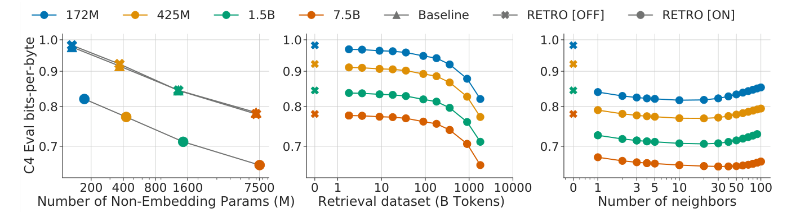

**图 1 | Retro 的扩展性。** 我们的检索模型带来的性能增益随模型规模保持恒定（左），并且相当于将参数化模型规模乘以约 10 倍。在 C4 验证集上，该增益随检索数据库规模（中）和检索邻居数量（右）的增加而提升，最多用到 40 个邻居；超过此值后，性能开始下降，这或许是由于质量降低所致。在评估时，Retro 可以在不使用检索数据（Retro[OFF]）的情况下运行，与基线 Transformer 相比仅带来有限的性能下降。

### 图 2

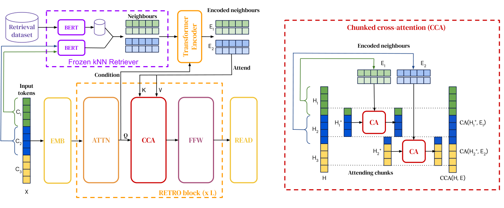

**图 2 | Retro 架构。** 左：简化版本，其中长度为 n = 12 的序列被分割为 l = 3 个大小为 m = 4 的块。对于每个块，我们检索 k = 2 个邻居，每个邻居 r = 5 个 token。检索通路显示在上方。右：Cca 算子中交互的细节。因果性得以保持，因为第一个块的邻居只影响第一个块的最后一个 token 以及第二个块的 token。

### 图 3

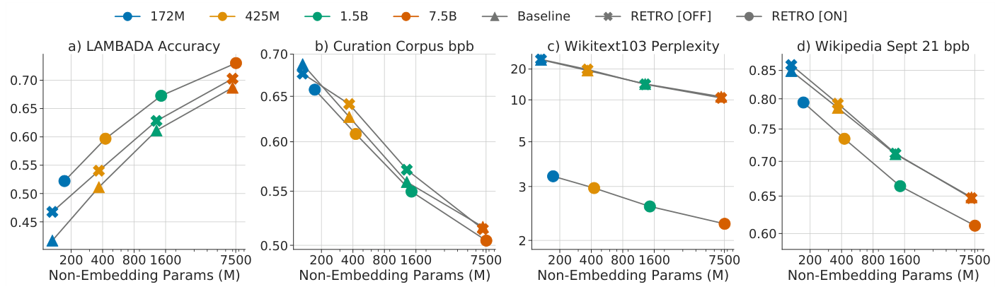

**图 3 | 关于模型规模的扩展性。** (a) LAMBADA top-1 准确率。(b) Curation Corpus 上的评估损失。(c) Wikitext103 验证集上的困惑度。(d) 2021 年 9 月挑选的 Wikipedia 文章上的每字节比特数。

### 图 4

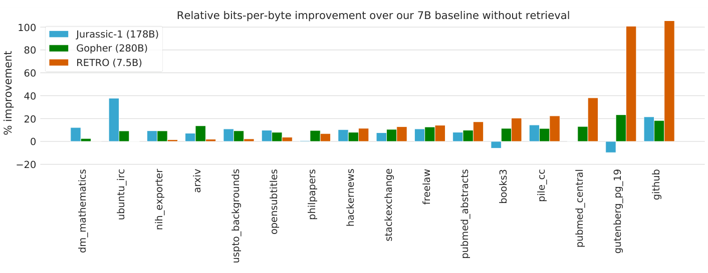

**图 4 | the Pile：** 我们的 7B 基线与 Jurassic-1、Gopher 和 Retro 的比较。我们观察到，检索模型在所有测试集上都优于基线，并在其中大多数测试集上优于 Jurassic-1，尽管其规模小了一个数量级以上。

### 图 5

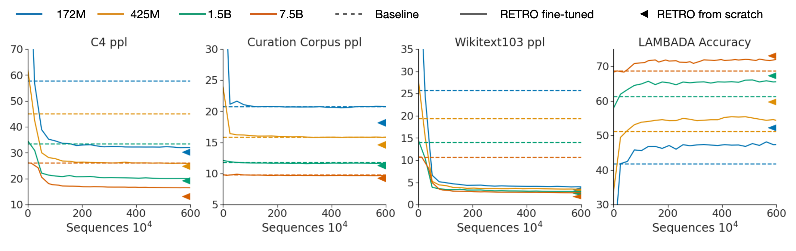

**图 5 | 基线 Transformer 的 Retro 化。** 任何 Transformer 都可以通过随机初始化并仅训练分块交叉注意力和检索编码器权重而被微调为检索增强 Transformer。以这种方式微调会迅速恢复并超越非检索性能，并且几乎达到与从头训练检索模型相同的性能（如每个图右侧的箭头所示）。我们发现，仅用预训练期间所见 token 数量的 3% 来训练即可获得良好的 Retro 化性能。

### 图 6

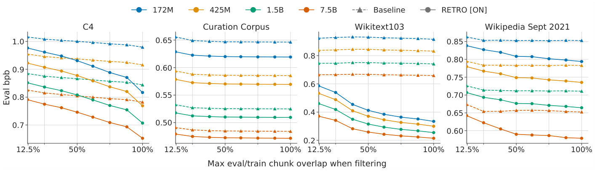

**图 6 | 性能与最长共同检索子串。** 评估损失作为评估数据块与其最近邻居之间允许的最长共同子串的函数。当考虑与训练数据集块共享的连续 token 不超过 8 个的块时，检索仍然有帮助。

### 图 7

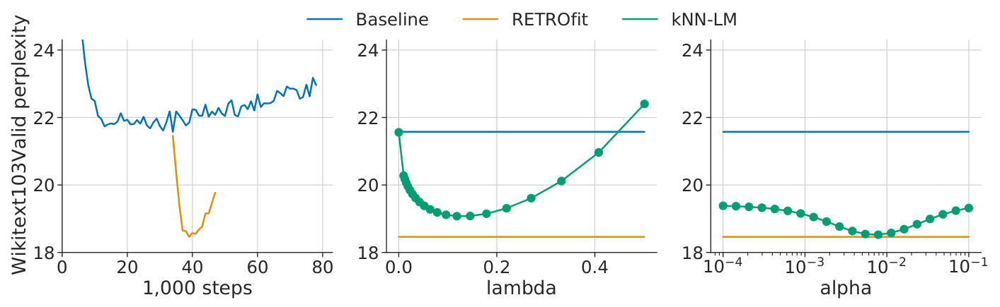

**图 7 | Wikitext103 验证困惑度。** 左：基线和 Retro 化（从第 35,000 步的基线检查点初始化）的困惑度作为训练步数的函数。中和右：kNN-LM 的困惑度分别作为 λ（α = 0.0012）和 α（λ = 0.12）的函数。

### 图 8

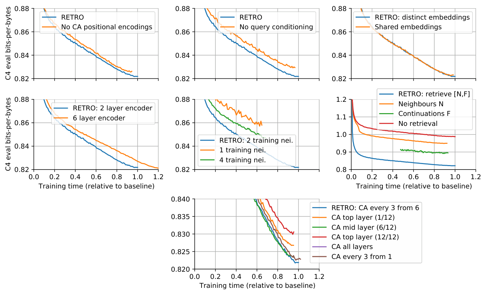

**图 8 | 不同变体的计算效率。** 我们报告训练曲线，将 C4 评估每字节比特数相对于训练基线 Retro 模型所用时间绘制出来。总体而言，我们的设计选择在计算效率方面是最优的。

### 图 9

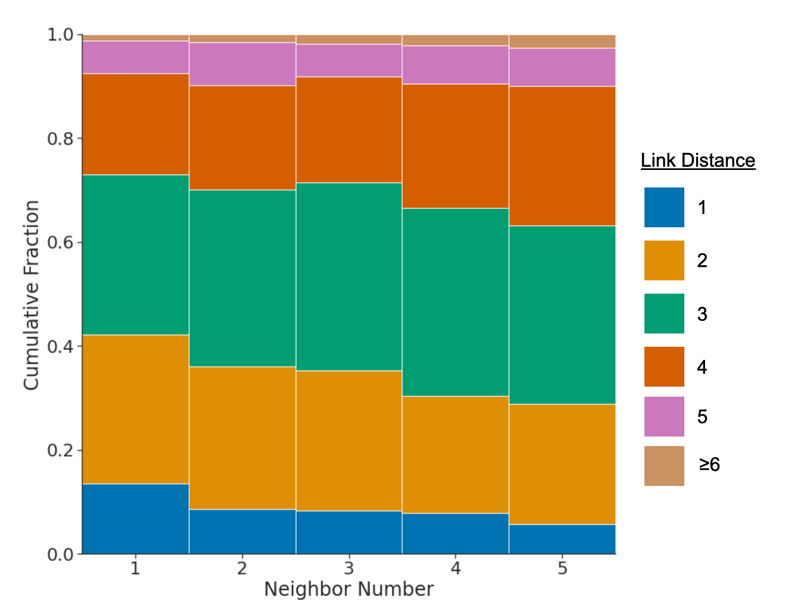

**图 9 | 检索文章之间的 Wikipedia 链接距离。** 对于每个序列、块的组合，我们仅使用 Wikipedia 计算目标与 top-5 邻居之间的链接距离。排名显示相对的邻居距离，其中 rank-1 是第一个邻居，rank 5 是第五个。不同的颜色表示链接距离。因为我们不从同一文档检索，1 是最小值。我们发现，平均而言，路径相连的随机文章之间的距离超过 5.0。

### 图 10

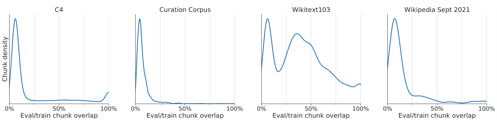

**图 10 | C4、Curation Corpus、Wikitext103 和 Wikipedia Sept. 2021 的评估块与训练块之间重叠的分布。**

### 图 11

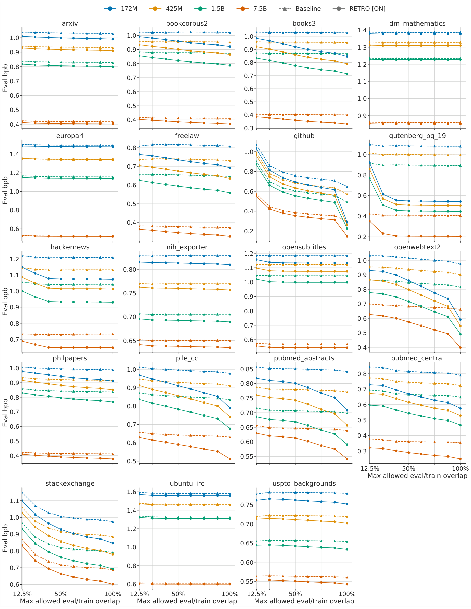

**图 11 | the Pile 上的过滤评估损失，含基线 Transformer 与 Retro。**

### 图 12

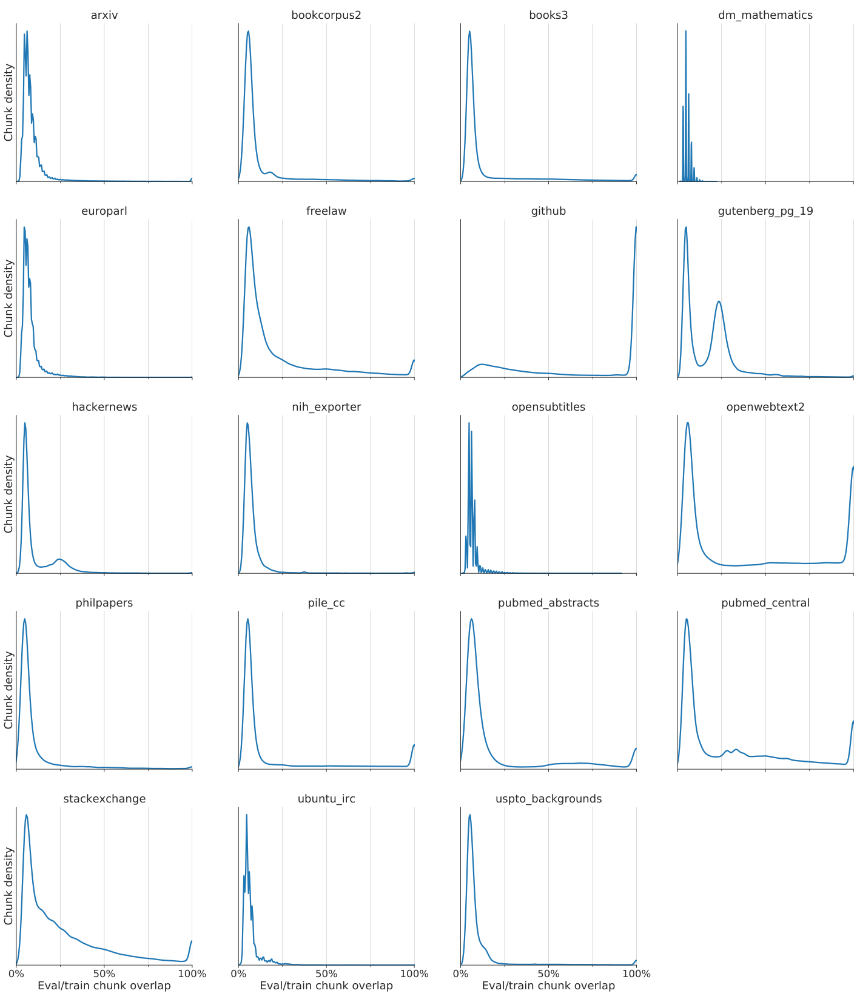

**图 12 | the Pile 评估集的评估块与训练块之间重叠的分布。**

### 表 1：MassiveText

最后一列表示训练期间的采样权重。多语言子集包含 10 种语言的文档。完整细分见 §A.1。

| 来源 | Token 数（M） | 文档数（M） | 多语言 | 采样频率 |
|------|--------------|------------|--------|----------|
| Web | 977,563 | 1,208 | 是 | 55% |
| Books | 3,423,740 | 20 | 否 | 25% |
| News | 236,918 | 398 | 否 | 10% |
| Wikipedia | 13,288 | 23 | 是 | 5% |
| GitHub | 374,952 | 143 | 否 | 5% |

### 表 2：基线和 Retro 模型的参数数量（不含嵌入）及相应超参数

| 基线参数 | Retro | d | d_ffw | 头数（# heads） | 头大小（Head size） | 层数（# layers） |
|---------|-------|------|-------|------|------|------|
| 132M | 172M (+30%) | 896 | 3,584 | 16 | 64 | 12 |
| 368M | 425M (+15%) | 1,536 | 6,144 | 12 | 128 | 12 |
| 1,309M | 1,451M (+11%) | 2,048 | 8,192 | 16 | 128 | 24 |
| 6,982M | 7,532M (+8%) | 4,096 | 16,384 | 32 | 128 | 32 |

### 表 3：Retro 与现有检索方法的比较

| 方法 | # 检索 token | 粒度（Granularity） | 检索器训练 | 检索整合 |
|------|-------------|--------------------|------------|----------|
| Continuous Cache | O(10³) | Token | 冻结（LSTM） | 加到概率上 |
| kNN-LM | O(10⁹) | Token | 冻结（Transformer） | 加到概率上 |
| Spalm | O(10⁹) | Token | 冻结（Transformer） | 门控 logits |
| Dpr | O(10⁹) | Prompt | 对比代理 | 抽取式 QA |
| Realm | O(10⁹) | Prompt | 端到端 | 前置到 prompt |
| RAG | O(10⁹) | Prompt | 微调 Dpr | 交叉注意力 |
| FiD | O(10⁹) | Prompt | 冻结 Dpr | 交叉注意力 |
| Emdr² | O(10⁹) | Prompt | 端到端（EM） | 交叉注意力 |
| Retro（本文） | O(10¹²) | Chunk | 冻结（Bert） | 分块交叉注意力 |

### 表 4：Wikitext103 上的困惑度

当使用 Wikipedia 数据集检索时，Retro 的表现与我们实现的 kNN-LM 相似。随着检索数据集的扩大，Retro 表现好得多。从完整 MassiveText 检索的困惑度相当低，这部分是由于与 Wikitext103 存在未被我们去重捕获的部分重叠。

| 模型 | 检索集 | # 数据库 token | # 数据库键 | 验证 | 测试 |
|------|--------|---------------|-----------|------|------|
| Adaptive Inputs (Baevski and Auli, 2019) | — | — | — | 17.96 | 18.65 |
| Spalm (Yogatama et al., 2021) | Wikipedia | 3B | 3B | 17.20 | 17.60 |
| kNN-LM (Khandelwal et al., 2020) | Wikipedia | 3B | 3B | 16.06 | 16.12 |
| Megatron (Shoeybi et al., 2019) | — | — | — | — | 10.81 |
| Baseline transformer（本文） | — | — | — | 21.53 | 22.96 |
| kNN-LM（本文） | Wikipedia | 4B | 4B | 18.52 | 19.54 |
| Retro | Wikipedia | 4B | 0.06B | 18.46 | 18.97 |
| Retro | C4 | 174B | 2.9B | 12.87 | 10.23 |
| Retro | MassiveText (1%) | 18B | 0.8B | 18.92 | 20.33 |
| Retro | MassiveText (10%) | 179B | 4B | 13.54 | 14.95 |
| Retro | MassiveText (100%) | 1792B | 28B | 3.21 | 3.92 |

### 表 5：问答结果

Natural Questions 上的精确匹配准确率。

| 模型 | 测试准确率 |
|------|-----------|
| Realm (Guu et al., 2020) | 40.4 |
| Dpr (Karpukhin et al., 2020) | 41.5 |
| RAG (Lewis et al., 2020) | 44.5 |
| Emdr² (Sachan et al., 2021) | 52.5 |
| FiD (Izacard and Grave, 2021) | 51.4 |
| FiD + Distill. (Izacard et al., 2020) | 54.7 |
| Baseline 7B（闭卷） | 30.4 |
| Retro 7.5B（DPR 检索） | 45.5 |

### 表 6：样本——海狸是有趣的动物

Retro[Off] 的样本迅速偏离到其他动物，而 Retro[On] 的样本由于邻居条件化而倾向于保持聚焦在海狸主题上。

> 说明：下表为全文彩色对照表（含 Retro[Off] 与 Retro[On] 的提示与采样、以及按与 C_{u+1} 的 LCP 着色的两个邻居块）。表中正文为模型生成的原始英文文本（着色表示 LCP = 0, 1, 2, 3, 4, ≥5），按图片展示如下，不做逐字翻译。

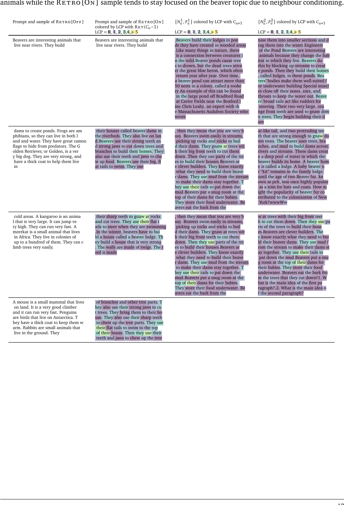

### 表 7：样本——《哈姆雷特》第一幕第一场

Retro[Off] 的样本语法正确但是幻觉，并以一个角色的重复结束（FRANCISCO Approach me not）。Retro[On] 的样本是原文的正确续写，并且对我们提示与检索数据之间的格式差异具有鲁棒性。

> 说明：下表为全文彩色对照表（含 Retro[Off] 与 Retro[On] 的提示与采样、以及按与 C_{u+1} 的 LCP 着色的两个邻居块）。表中正文为模型生成的原始英文文本（着色表示 LCP = 0, 1, 2, 3, 4, ≥5），按图片展示如下，不做逐字翻译。

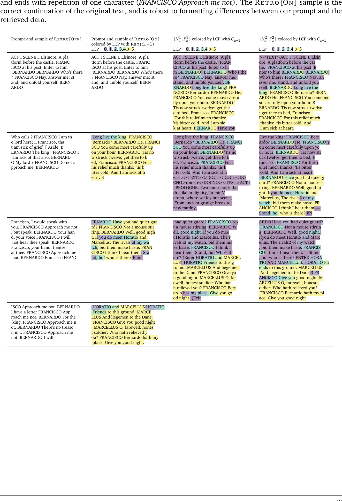

### 表 8：MassiveText 数据集

最后一列表示每个数据集在训练期间的采样权重。对于检索数据库，使用整个数据集，但书籍除外——对书籍我们使用 4% 的子采样。

| 来源 | 语言 | Token 数（M） | 文档数 | 采样权重 |
|------|------|--------------|--------|----------|
| Web | En | 483,002 | 604,938,816 | 0.314 |
| Web | Ru | 103,954 | 93,004,882 | 0.033 |
| Web | Es | 95,762 | 126,893,286 | 0.033 |
| Web | Zh | 95,152 | 121,813,451 | 0.033 |
| Web | Fr | 59,450 | 76,612,205 | 0.033 |
| Web | De | 57,546 | 77,242,640 | 0.033 |
| Web | Pt | 44,561 | 62,524,362 | 0.033 |
| Web | It | 35,255 | 42,565,093 | 0.033 |
| Web | Sw | 2,246 | 1,971,234 | 0.0044 |
| Web | Ur | 631 | 455,429 | 0.0011 |
| Books | En | 3,423,740 | 20,472,632 | 0.25 |
| News | En | 236,918 | 397,852,713 | 0.1 |
| Wikipedia | En | 3,977 | 6,267,214 | 0.0285 |
| Wikipedia | De | 2,155 | 3,307,818 | 0.003 |
| Wikipedia | Fr | 1,783 | 2,310,040 | 0.003 |
| Wikipedia | Ru | 1,411 | 2,767,039 | 0.003 |
| Wikipedia | Es | 1,270 | 2,885,013 | 0.003 |
| Wikipedia | It | 1,071 | 2,014,291 | 0.003 |
| Wikipedia | Zh | 927 | 1,654,772 | 0.003 |
| Wikipedia | Pt | 614 | 1,423,335 | 0.003 |
| Wikipedia | Ur | 61 | 344,811 | 0.0001 |
| Wikipedia | Sw | 15 | 58,090 | 0.0004 |
| Github | — | 374,952 | 142,881,832 | 0.05 |
| 总计（Total） | — | 5,026,463 | 1,792,260,998 | 1 |

### 表 9：我们的 Wikipedia Sept. 2021 评估数据集所包含的完整文章集

| 文章标题 |
|----------|
| Megan Rohrer |
| Aakashavaani |
| Emma Raducanu |
| Junior Eurovision Song Contest 2021 |
| Ambra Sabatini |
| Pavilion Bukit Jalil |
| WhyDonate |
| Blake Desjarlais |
| The Juggernaut (company) |
| 2021 All-Ireland Senior Football Championship Final |
| Angela Diaz |
| Drift-barrier hypothesis |
| 2020 Summer Paralympics |
| Venomics |
| 2021 Afghan protests |
| Great Circle (novel) |
| Rexh Xhakli |
| Hurricane Ida |
| Julia Laskin |
| 2021 Montenegrin episcopal enthronement protests |
| Cuijk |
| At War With the Silverfish |
| Ghoubet Wind Power Station |

### 表 10：Retro 模型超参数及解码器规模

| 基线 | d_model | d_ffw | 头数 | 头大小 | 层数 | P | P_Enc | 最大学习率 |
|------|---------|-------|------|--------|------|-----|-------|------------|
| 247M | 896 | 3584 | 16 | 64 | 12 | [6, 9, 12] | [1] | 2×10⁻⁴ |
| 564M | 1536 | 6144 | 12 | 128 | 12 | [6, 9, 12] | [1] | 2×10⁻⁴ |
| 1,574M | 2048 | 8192 | 16 | 128 | 24 | [9, 12, . . . , 24] | [1] | 2×10⁻⁴ |
| 7,505M | 4096 | 16384 | 32 | 128 | 32 | [9, 12, . . . , 32] | [1] | 1×10⁻⁴ |

### 表 11：表 4 中 Wikitext103 实验的超参数

我们对基线和 Retro 化使用相同的学习率调度。对于 Retro 化，我们重置调度，即调度从第 0 步开始，而不是从第 35,000 步开始。

| 类别 | 项 | 值 |
|------|-----|-----|
| 模型 | 层数 | 18 |
| | d | 1024 |
| | d_Ffw | 4096 |
| | 键大小（Key size） | 64 |
| | 值大小（Value size） | 64 |
| | 头数 | 16 |
| 训练数据 | 数据集 | Wikitext103train |
| | 序列长度 | 3072 |
| | 批量大小 | 128 |
| | 分词器词表大小 | 128,000 |
| 优化 | 优化器 | Adam |
| | Adam 的 β₁ | 0.9 |
| | Adam 的 β₂ | 0.95 |
| | Adam 的 ε | 1e-8 |
| | Dropout 率 | 0.25 |
| 调度 | 学习率起始 | 1e-7 |
| | 学习率最大 | 2.5e-4 |
| | 学习率最小 | 2e-5 |
| | 预热步数 | 4,000 |
| | 余弦周期步数 | 100,000 |
| 评估 | 重叠比例 | 87.5% |

### 表 12：Retro 化实验的超参数

| 模型 | 带 Retro 块的层（P） | 学习率 | 批量大小 |
|------|---------------------|--------|----------|
| 172M | 从 6 起每 3 层 | 2 × 10⁻⁴ → 2 × 10⁻⁵ | 256 |
| 425M | 从 6 起每 3 层 | 2 × 10⁻⁴ → 2 × 10⁻⁵ | 256 |
| 1.5B | 从 6 起每 3 层 | 2 × 10⁻⁴ → 2 × 10⁻⁵ | 256 |
| 7.5B | 从 6 起每 3 层 | 1 × 10⁻⁴ → 1 × 10⁻⁵ | 256 |

### 表 13：不同变体下 Retro 的性能

以一个 247M 参数模型在 1570 亿 token 调度上训练，在 C4 评估集上的模型性能，以每字节比特数（bits-per-byte）衡量（原文此处写作 "bytes-per-bits"，应为 "bits-per-byte"）。

| 消融组 | 消融 | C4 评估 bpb |
|--------|------|------------|
| 模型 | Retro | 0.822 |
| | 无查询条件化 | 0.829 |
| | 无 CA 位置编码 | 0.826 |
| | 共享嵌入 | 0.823 |
| | 6 层编码器 | 0.821 |
| 检索值 | 邻居 N | 0.950 |
| | 延续 F | 0.895 |
| | 无检索 | 0.987 |
| 训练邻居 | 1 个训练邻居 | 0.858 |
| | 4 个训练邻居 | 0.847 |
| 交叉注意力位置 | CA 顶层 (1/12) | 0.827 |
| | CA 中层 (6/12) | 0.823 |
| | CA 顶层 (12/12) | 0.831 |
| | CA 所有层 | 0.860 |
| | CA 从 1 起每 3 层 | 0.823 |

### 表 14：主要语言建模数据集的完整结果

前三组行对应图 1，最后一组行对应图 3。

| 指标 | Baseline 172M | Baseline 425M | Baseline 1.5B | Baseline 7.5B | Retro[Off] 172M | Retro[Off] 425M | Retro[Off] 1.5B | Retro[Off] 7.5B | Retro[On] 172M | Retro[On] 425M | Retro[On] 1.5B | Retro[On] 7.5B |
|------|---------------|---------------|---------------|---------------|-----------------|-----------------|-----------------|-----------------|----------------|----------------|----------------|----------------|
| C4 Eval bpb | 0.98 | 0.92 | 0.84 | 0.78 | 0.98 | 0.92 | 0.84 | 0.78 | 0.82 | 0.77 | 0.71 | 0.66 |
| C4 Eval bpb (900B) | — | — | — | — | — | — | — | — | 0.88 | 0.83 | 0.76 | 0.71 |
| C4 Eval bpb (360B) | — | — | — | — | — | — | — | — | 0.92 | 0.87 | 0.80 | 0.74 |
| C4 Eval bpb (180B) | — | — | — | — | — | — | — | — | 0.94 | 0.89 | 0.81 | 0.75 |
| C4 Eval bpb (90B) | — | — | — | — | — | — | — | — | 0.95 | 0.89 | 0.82 | 0.76 |
| C4 Eval bpb (36B) | — | — | — | — | — | — | — | — | 0.96 | 0.90 | 0.83 | 0.77 |
| C4 Eval bpb (18B) | — | — | — | — | — | — | — | — | 0.96 | 0.91 | 0.83 | 0.77 |
| C4 Eval bpb (9B) | — | — | — | — | — | — | — | — | 0.96 | 0.91 | 0.83 | 0.77 |
| C4 Eval bpb (4B) | — | — | — | — | — | — | — | — | 0.97 | 0.91 | 0.84 | 0.78 |
| C4 Eval bpb (2B) | — | — | — | — | — | — | — | — | 0.97 | 0.91 | 0.84 | 0.78 |
| C4 Eval bpb (k = 1) | — | — | — | — | — | — | — | — | 0.84 | 0.79 | 0.73 | 0.67 |
| C4 Eval bpb (k = 2) | — | — | — | — | — | — | — | — | 0.83 | 0.78 | 0.72 | 0.67 |
| C4 Eval bpb (k = 3) | — | — | — | — | — | — | — | — | 0.82 | 0.78 | 0.71 | 0.66 |
| C4 Eval bpb (k = 4) | — | — | — | — | — | — | — | — | 0.82 | 0.77 | 0.71 | 0.66 |
| C4 Eval bpb (k = 5) | — | — | — | — | — | — | — | — | 0.82 | 0.77 | 0.71 | 0.66 |
| C4 Eval bpb (k = 10) | — | — | — | — | — | — | — | — | 0.82 | 0.77 | 0.71 | 0.66 |
| C4 Eval bpb (k = 20) | — | — | — | — | — | — | — | — | 0.82 | 0.77 | 0.71 | 0.66 |
| C4 Eval bpb (k = 30) | — | — | — | — | — | — | — | — | 0.82 | 0.77 | 0.71 | 0.65 |
| C4 Eval bpb (k = 40) | — | — | — | — | — | — | — | — | 0.83 | 0.77 | 0.71 | 0.65 |
| C4 Eval bpb (k = 50) | — | — | — | — | — | — | — | — | 0.83 | 0.78 | 0.71 | 0.66 |
| C4 Eval bpb (k = 60) | — | — | — | — | — | — | — | — | 0.84 | 0.78 | 0.72 | 0.66 |
| C4 Eval bpb (k = 70) | — | — | — | — | — | — | — | — | 0.84 | 0.79 | 0.72 | 0.66 |
| C4 Eval bpb (k = 80) | — | — | — | — | — | — | — | — | 0.85 | 0.79 | 0.73 | 0.66 |
| C4 Eval bpb (k = 90) | — | — | — | — | — | — | — | — | 0.85 | 0.79 | 0.73 | 0.66 |
| C4 Eval bpb (k = 100) | — | — | — | — | — | — | — | — | 0.85 | 0.79 | — | 0.67 |
| Lambada Accuracy | 0.42 | 0.51 | 0.61 | 0.69 | 0.47 | 0.54 | 0.63 | 0.70 | 0.52 | 0.60 | 0.67 | 0.73 |
| Curation Corpus bpb | 0.69 | 0.63 | 0.56 | 0.52 | 0.68 | 0.64 | 0.57 | 0.51 | 0.66 | 0.61 | 0.55 | 0.50 |
| Wikitext103 Perplexity | 25.62 | 19.29 | 13.98 | 10.65 | 25.88 | 19.78 | 13.89 | 10.40 | 3.32 | 2.96 | 2.53 | 2.22 |
| Wikipedia Sept. 2021 bpb | 0.85 | 0.78 | 0.71 | 0.65 | 0.86 | 0.79 | 0.71 | 0.65 | 0.79 | 0.73 | 0.66 | 0.61 |

> 注：C4 Eval bpb 的 "(900B)" 等各行，其 Baseline 与 Retro[Off] 列在原文中为 "—"（无数据），只有 Retro[On] 列有数值。

### 表 15：the Pile 上的完整结果（以每字节比特数衡量）

Jurassic-1 和 GPT-3 的数值取自 Lieber et al. (2021)。Gopher 的数值取自 Rae et al. (2021)。

| 子集 | 7B Baseline（本文） | GPT-3 | Jurassic-1 | Gopher | 7.5B Retro |
|------|---------------------|-------|------------|--------|------------|
| arxiv | 0.742 | 0.838 | 0.680 | 0.641 | 0.714 |
| books3 | 0.792 | 0.802 | 0.835 | 0.706 | 0.653 |
| dm_mathematics | 1.177 | 1.371 | 1.037 | 1.135 | 1.164 |
| freelaw | 0.576 | 0.612 | 0.514 | 0.506 | 0.499 |
| github | 0.420 | 0.645 | 0.358 | 0.367 | 0.199 |
| gutenberg_pg_19 | 0.803 | 1.163 | 0.890 | 0.652 | 0.400 |
| hackernews | 0.971 | 0.975 | 0.869 | 0.888 | 0.860 |
| nih_exporter | 0.650 | 0.612 | 0.590 | 0.590 | 0.635 |
| opensubtitles | 0.974 | 0.932 | 0.879 | 0.894 | 0.930 |
| philpapers | 0.760 | 0.723 | 0.742 | 0.682 | 0.699 |
| pile_cc | 0.771 | 0.698 | 0.669 | 0.688 | 0.626 |
| pubmed_abstracts | 0.639 | 0.625 | 0.587 | 0.578 | 0.542 |
| pubmed_central | 0.588 | 0.690 | 0.579 | 0.512 | 0.419 |
| stackexchange | 0.714 | 0.773 | 0.655 | 0.638 | 0.624 |
| ubuntu_irc | 1.200 | 0.946 | 0.857 | 1.081 | 1.178 |
| uspto_backgrounds | 0.603 | 0.566 | 0.537 | 0.545 | 0.583 |

### 表 16：Great Circle (novel)，来自 Wikipedia September 21

该文章关于一部近期小说，块 C₃ 和 C₄ 具体涉及其反响。评论该小说的期刊名称 Publishers Weekly 既出现在块 C₃ 的邻居 [N¹₃, F¹₃]、[N²₃, F²₃] 中，也出现在后续块 C₄ 中，其中这些 token 的损失被 Retro 显著降低。

> 说明：下表为全文彩色对照表（四列：按损失差着色的 C_u、按与 Ret(C_{u−1}) 的 LCP 着色的 C_u、以及按与 C_{u+1} 的 LCP 着色的 [N¹_u, F¹_u] 与 [N²_u, F²_u]）。表中正文为原始英文文本，着色表示损失差（≤ −0.5、= 0、≥ 0.5）或 LCP（= 0, 1, 2, 3, 4, ≥5），按图片展示如下，不做逐字翻译。

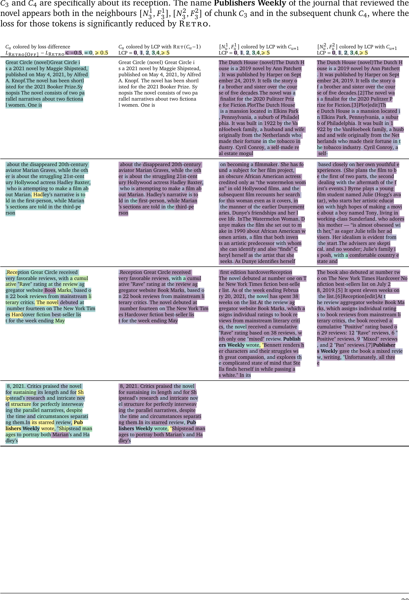

### 表 17：All-Ireland Senior Football Championship Final，来自 Wikipedia September 21

球队名称 Tyrone 既出现在块 C₁ 的第二个邻居 [N²₁, F²₁] 中，也出现在后续块 C₂ 中，其中这些 token 的损失被 Retro 显著降低。

> 说明：下表为全文彩色对照表（四列：按损失差着色的 C_u、按与 Ret(C_{u−1}) 的 LCP 着色的 C_u、以及按与 C_{u+1} 的 LCP 着色的 [N¹_u, F¹_u] 与 [N²_u, F²_u]）。表中正文为原始英文文本，着色表示损失差（≤ −0.5、= 0、≥ 0.5）或 LCP（= 0, 1, 2, 3, 4, ≥5），按图片展示如下，不做逐字翻译。

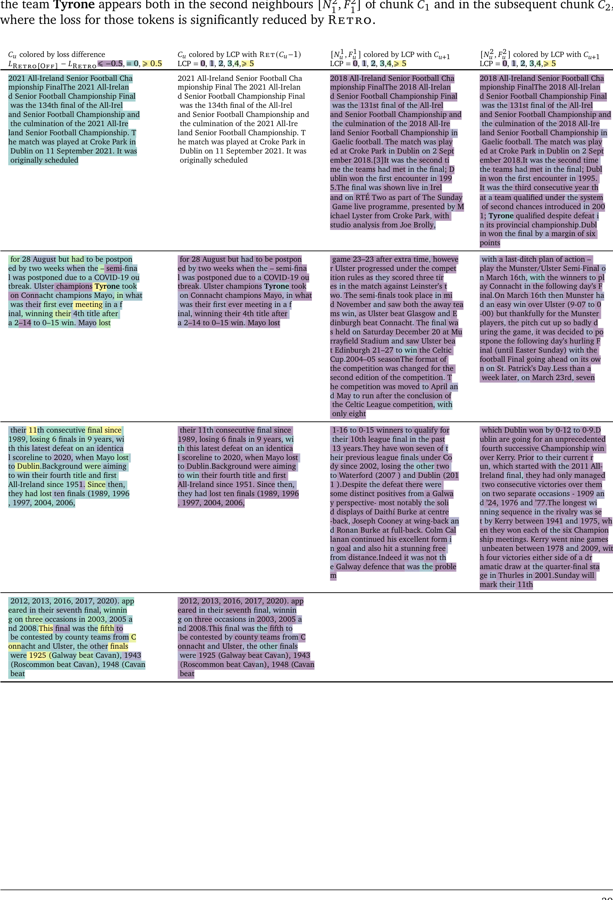

### 表 18：2020 Summer Paralympics，来自 Wikipedia September 21

事件的原始日期 2020 年 8 月 25 日至 9 月 6 日既出现在块 C₁ 的邻居 [N¹₁, F¹₁]、[N²₁, F²₁] 中，也出现在后续块 C₂ 中，其中这些 token 的损失被 Retro 显著降低。有趣的是，在此情况下，这些邻居是在该事件尚未被推迟时撰写的。

> 说明：下表为全文彩色对照表（四列：按损失差着色的 C_u、按与 Ret(C_{u−1}) 的 LCP 着色的 C_u、以及按与 C_{u+1} 的 LCP 着色的 [N¹_u, F¹_u] 与 [N²_u, F²_u]）。表中正文为原始英文文本，着色表示损失差（≤ −0.5、= 0、≥ 0.5）或 LCP（= 0, 1, 2, 3, 4, ≥5），按图片展示如下，不做逐字翻译。

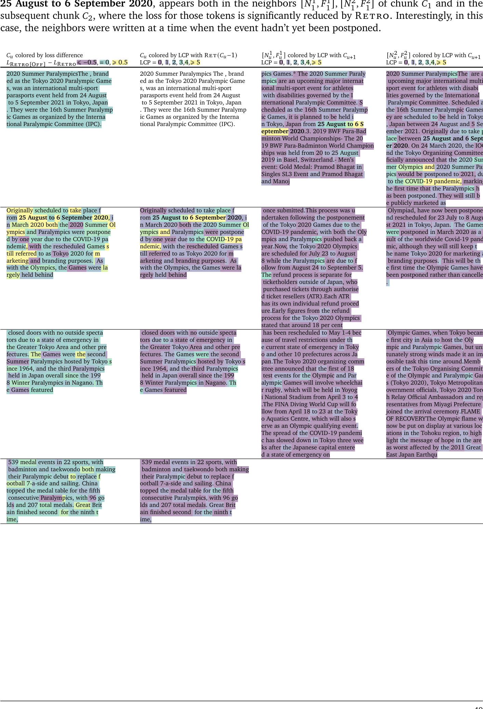

### 表 19：Daniel Radcliffe，来自 Wikitext103Valid，检索数据来自 C4

块 C₂ 和 C₃ 几乎完全分别从邻居 [N¹, F¹] 和 [N², F²] 检索而来（除格式差异外），这极大地降低了这些 token 的损失。此示例说明，当训练数据尽管去重仍泄漏到评估集中时，我们的 Retro 模型可以直接利用这种泄漏。

> 说明：下表为全文彩色对照表（四列：按损失差着色的 C_u、按与 Ret(C_{u−1}) 的 LCP 着色的 C_u、以及按与 C_{u+1} 的 LCP 着色的 [N¹_u, F¹_u] 与 [N²_u, F²_u]）。表中正文为原始英文文本，着色表示损失差（≤ −0.5、= 0、≥ 0.5）或 LCP（= 0, 1, 2, 3, 4, ≥5），按图片展示如下，不做逐字翻译。

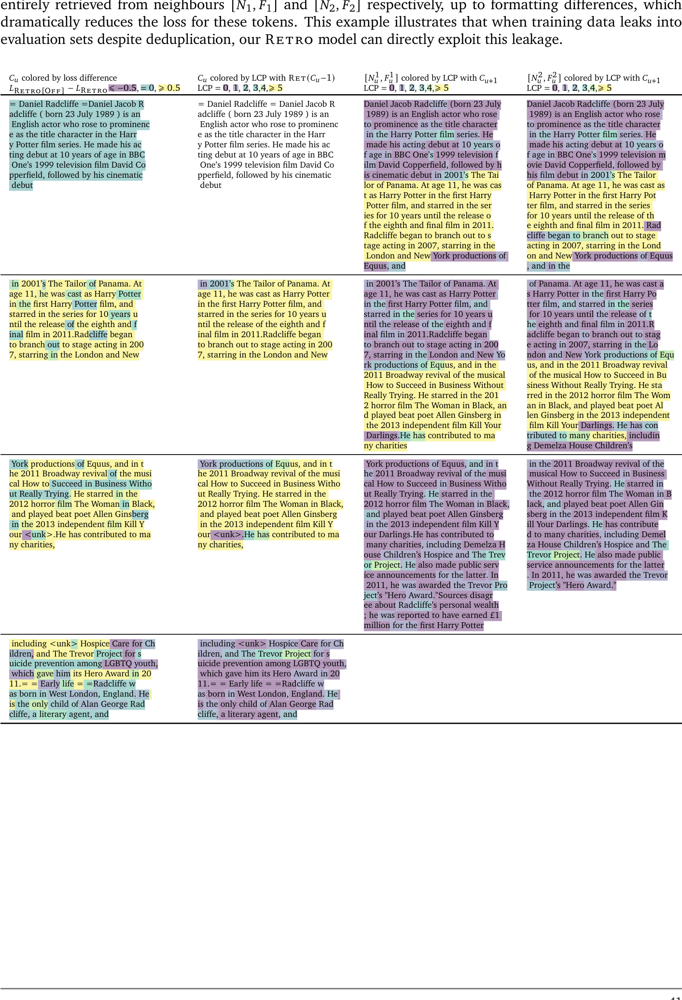

### 表 20：样本——《人权宣言》（Déclaration des droits de l'homme）：第一条

Retro[Off] 的样本语法正确且几乎合理，但是幻觉。Retro[On] 的样本被正确地从邻居数据复制，并根据我们的提示进行了稳健的重新格式化。

> 说明：下表为全文彩色对照表（含 Retro[Off] 与 Retro[On] 的提示与采样、以及按与 C_{u+1} 的 LCP 着色的两个邻居块）。表中正文为模型生成的原始法文文本（着色表示 LCP = 0, 1, 2, 3, 4, ≥5），按图片展示如下，不做逐字翻译。

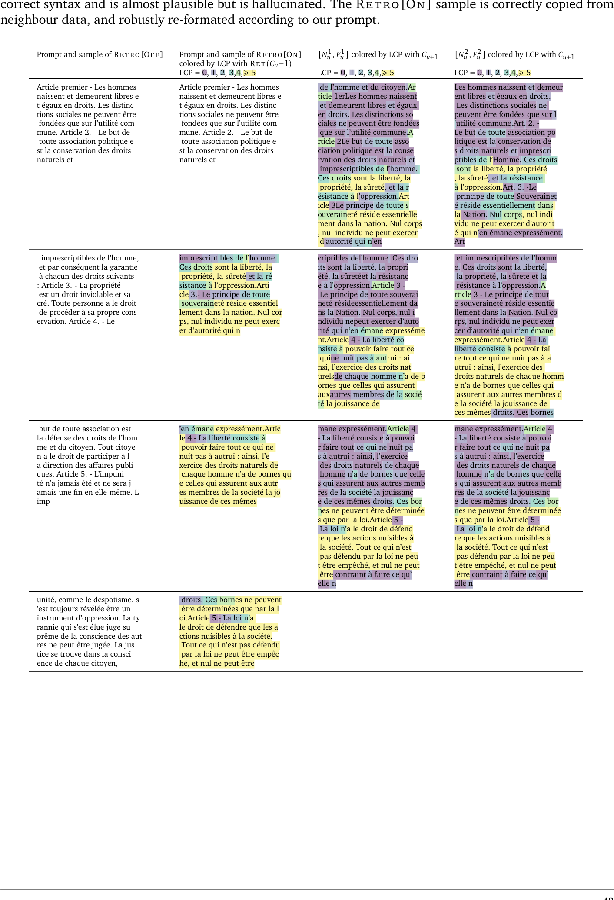

### 表 21：样本——π 的小数位

Retro[Off] 的样本在提示结束后的两位数字处迅速偏离，而 Retro[On] 正确地输出了大量 π 的数字，直接从邻居数据复制。

> 说明：下表为全文彩色对照表（含 Retro[Off] 与 Retro[On] 的提示与采样、以及按与 C_{u+1} 的 LCP 着色的两个邻居块）。表中正文为 π 的数字序列（着色表示 LCP = 0, 1, 2, 3, 4, ≥5），按图片展示如下，不做逐字翻译。

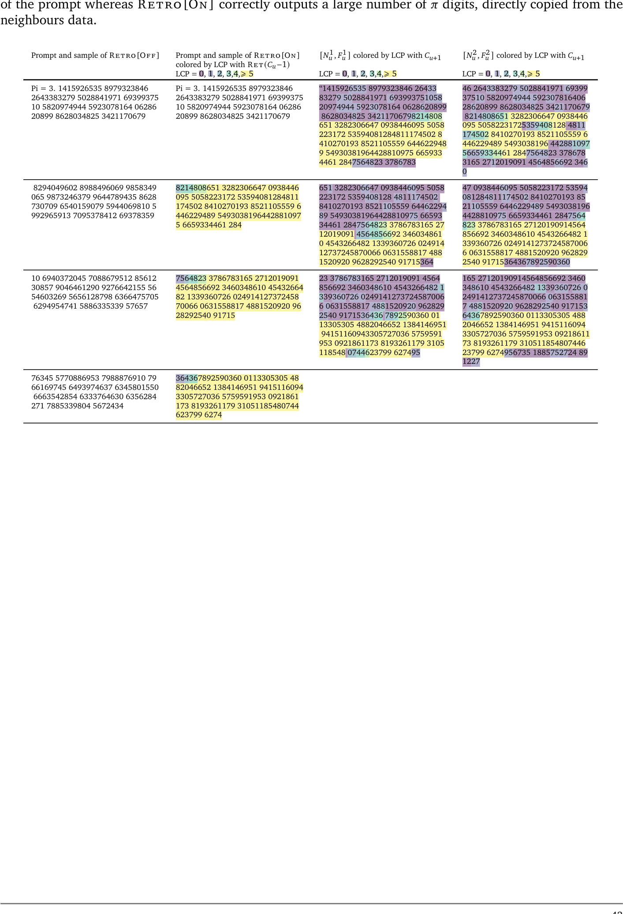
