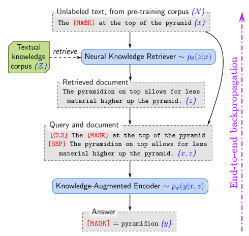
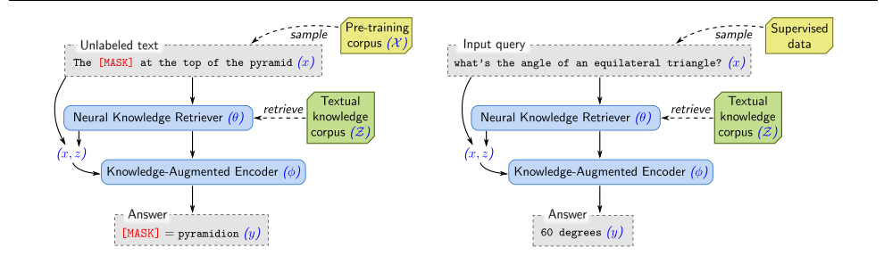
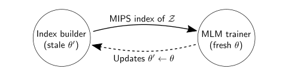
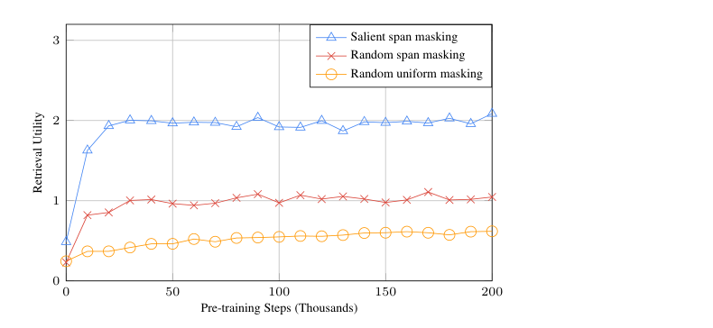

# REALM：检索增强语言模型预训练

**（REALM: Retrieval-Augmented Language Model Pre-Training）**

> 本文为 Guu 等人 2020 年论文《REALM: Retrieval-Augmented Language Model Pre-Training》（arXiv:2002.08909v1）的中文精确翻译。

**作者**：Kelvin Guu\*，Kenton Lee\*，Zora Tung，Panupong Pasupat，Ming-Wei Chang（\* 表示同等贡献）

**单位**：Google Research

**联系方式**：Kelvin Guu <kguu@google.com>；Kenton Lee <kentonl@google.com>；Zora Tung <gatoatigrado@google.com>；Panupong Pasupat <ppasupat@google.com>；Ming-Wei Chang <mingweichang@google.com>

---

## 摘要

语言模型预训练已被证明能够捕捉到大量惊人的世界知识，这些知识对于问答等自然语言处理（NLP）任务至关重要。然而，这些知识被隐式地存储在神经网络的参数中，为了覆盖更多事实，就需要规模越来越大的网络。为了以一种更模块化、更可解释的方式捕捉知识，我们为语言模型预训练引入了一个**潜知识检索器（latent knowledge retriever）**，使模型能够从维基百科等大型语料库中检索文档并对其施加注意力（attend over），该机制在预训练、微调和推理阶段均被使用。我们首次展示了如何以无监督的方式预训练这样一个知识检索器：以**掩码语言建模（masked language modeling）**作为学习信号，并通过一个需要考虑数百万文档的检索步骤进行反向传播。我们在具有挑战性的**开放域问答（Open-domain Question Answering，Open-QA）**任务上对**检索增强语言模型预训练（Retrieval-Augmented Language Model pre-training，REALM）**进行微调，从而证明其有效性。我们在三个流行的 Open-QA 基准上，与显式和隐式知识存储的最先进模型进行比较，发现我们在绝对准确率上以显著优势（4–16%）超越了所有先前的方法，同时还带来了可解释性和模块化等定性收益。

---

## 1 引言

语言模型预训练的最新进展表明，BERT（Devlin et al., 2018）、RoBERTa（Liu et al., 2019）和 T5（Raffel et al., 2019）等模型存储了大量惊人的世界知识，这些知识是从它们所训练的大规模文本语料中获得的（Petroni et al., 2019）。例如，BERT 能够正确预测下面这句话中缺失的单词："The [MASK] is the currency of the United Kingdom"（答案："pound"）。在这些语言模型中，学到的世界知识被隐式地存储在底层神经网络的参数里。这使得人们难以确定网络中存储了哪些知识、存储在哪里。此外，存储空间受限于网络的规模——为了捕捉更多的世界知识，就必须训练规模越来越大的网络，而这可能慢得令人望而却步或代价高昂。

为了以更可解释、更模块化的方式捕捉知识，我们提出了一个新颖的框架——**检索增强语言模型（Retrieval-Augmented Language Model，REALM）预训练**，它用一个学习到的文本知识检索器来增强语言模型预训练算法。与在参数中存储知识的模型不同，这种方法通过要求模型在推理时决定检索和使用哪些知识，从而明确地凸显了世界知识的作用。在做出每一次预测之前，语言模型使用检索器从维基百科等大型语料库中检索文档¹，然后对这些文档施加注意力，以帮助完成预测。端到端地学习这一模型，需要通过一个考虑整个文本知识语料库的检索步骤进行反向传播，如图 1 所示。

REALM 的核心直觉在于，使用来自无监督文本的、基于性能的信号来训练检索器：能够改善语言模型困惑度（perplexity）的检索是有帮助的，应当得到奖励；而信息量不足的检索则应当受到惩罚。例如，在图 1 中，如果模型需要填补 "the [MASK] at the top of the pyramid" 中的空白，那么检索器应当因为选中了包含 "The pyramidion on top allows for less material higher up the pyramid" 的文档而得到奖励。我们通过将这种"先检索后预测"（retrieve-then-predict）的方法建模为一个潜变量语言模型并优化其边际似然，来实现上述行为。

在预训练期间引入大规模神经检索模块会带来显著的计算挑战，因为对于每一个预训练步骤，检索器都必须考虑数百万个候选文档，而且我们必须对其决策进行反向传播。为解决这一问题，我们对检索器进行了结构化设计：为每个文档执行的计算可以被缓存并异步更新，而最佳文档的选择可以被表述为一个**最大内积搜索（Maximum Inner Product Search，MIPS）**问题。

大量先前的工作已经证明了向神经网络中加入离散检索步骤的好处（Miller et al., 2016; Chen et al., 2017），但这些工作并未将该框架应用于语言模型预训练，且采用了非学习式（non-learned）的检索器来处理大规模文档集合。在语言建模文献中，**k 近邻语言模型（k-Nearest Neighbor Language Model，kNN-LM）**（Khandelwal et al., 2019）检索相似的 LM 示例以改进记忆化（memorization）。然而，kNN-LM 并未针对下游任务进行微调，这可能是因为尚不清楚如何适配其检索机制：kNN 只能使用为目标任务标注的示例——在微调期间，这排除了包含所需世界知识的 LM 示例。相比之下，REALM 的检索器被设计为可以迁移到其他任务，而且检索到的只是文本，而不是带标签的示例。

我们通过在**开放域问答（Open-QA）**——自然语言处理中最知识密集型的任务之一——上微调用 REALM 预训练的模型来评估我们的方法。我们在三个流行的 Open-QA 基准（NATURALQUESTIONS-OPEN、WEBQUESTIONS 和 CURATEDTREC）上进行评估，并与最先进的 Open-QA 模型进行比较，其中既包括隐式存储知识的超大模型（如 T5），也包括同样使用知识检索器访问外部知识、但以更启发式方式实现检索的先前方法（Lee et al., 2019; Min et al., 2019a; Asai et al., 2019）。REALM 在全部三个基准上都取得了新的最先进结果，以 4–16% 的绝对准确率显著超越了所有先前的系统。我们还展示了 REALM 的定性收益，包括可解释性和模块化。

> ¹ 我们宽泛地使用"文档"（document）一词来指代知识语料库中的某个段落，而不一定是整篇文章。

---

## 2 背景

**语言模型预训练**：语言模型预训练的目标是学习有用的语言表示，通常来自无标签文本语料。由此得到的预训练模型随后可以针对主要关心的下游任务（在我们的情形中是 Open-QA）进行进一步训练（微调），往往能带来比从零开始训练更好的泛化能力（Dai & Le, 2015; Radford et al., 2019）。我们聚焦于 BERT（Devlin et al., 2018）所普及的预训练的掩码语言模型²（masked language model，MLM）变体。在其基本形式中，MLM 被训练用来预测一段输入文本中缺失的 token。给定一个无标签的预训练语料 X（例如维基百科文本），可以通过随机掩码一段采样文本中的 token 来生成训练示例 (x, y)（例如，x = "The [MASK] is the currency [MASK] the UK"；y = ("pound", "of")）。模型使用其对被掩码输入 x 的表示来预测每个掩码位置应当填入的 token。一个好的 MLM 必须学会编码句法和语义信息（例如预测 "of"）以及一些世界知识（例如预测 "pound"）。

**开放域问答（Open-QA）**：为了衡量模型融入世界知识的能力，我们需要一个世界知识至关重要的下游任务。自然语言处理中最知识密集型的任务之一，或许就是开放域问答（Open-QA）：给定一个问题 x，例如 "What is the currency of the UK?"，模型必须输出正确的答案字符串 y，"pound"。Open-QA 中的"开放"（open）指的是，模型不会像 SQuAD（Rajpurkar et al., 2016; 2018）这类传统阅读理解（reading comprehension，RC）任务那样，收到一篇已知包含答案的、预先确定的文档。虽然 RC 模型理解的是单篇文档，但 Open-QA 模型必须从数百万篇文档中保留知识，因为问题可能涉及其中任何一篇。

我们聚焦于利用文本知识语料库 Z 作为知识来源的 Open-QA 系统。其中许多系统采用基于检索的方法：给定问题 x，从语料库 Z 中检索可能相关的文档 z，然后从这些文档中抽取答案 y（Brill et al., 2002; Chen et al., 2017; Lee et al., 2019）。我们的方法 REALM 受这一范式的启发，并将其扩展到语言模型预训练。另一方面，一些近期工作提出了基于生成的系统，它们对 x 应用序列到序列（sequence-to-sequence）模型，逐 token 直接生成 y（Lewis et al., 2019; Raffel et al., 2019）。我们将在实验中与这两种范式的最先进系统进行比较。

> ² 严格来说，MLM 并不是标准的语言模型，因为它没有定义整个 token 序列上的分布。在本文中，我们有时略微滥用"语言模型"这一术语，以使表述更简短。

---

## 3 方法

我们首先在 3.1 节将 REALM 的预训练和微调任务形式化为一个"先检索后预测"的生成过程。然后在 3.2 节描述该过程中每个组件的模型架构。在 3.3 节，我们展示如何通过最大化 REALM 生成过程的似然来实现 REALM 的预训练和微调。在此过程中，我们解决重要的计算挑战，解释训练为何有效，并讨论注入有用归纳偏置的策略。整体框架如图 2 所示。

### 3.1 REALM 的生成过程

对于预训练和微调，REALM 都接受某个输入 x，并学习在可能输出 y 上的分布 p(y|x)。对于预训练，任务是掩码语言建模：x 是来自预训练语料 X 的一个句子，其中某些 token 被掩码，模型必须预测这些缺失 token 的值 y。对于微调，任务是 Open-QA：x 是问题，y 是答案。

REALM 将 p(y|x) 分解为两步：先检索，后预测。给定输入 x，我们首先从知识语料库 Z 中检索可能有帮助的文档 z。我们将此建模为从分布 p(z|x) 中采样。然后，我们同时以检索到的 z 和原始输入 x 为条件生成输出 y——建模为 p(y|z,x)。为了得到生成 y 的整体似然，我们将 z 视为潜变量，并对所有可能的文档 z 进行边缘化（marginalize），得到

p(y|x) = Σ_{z∈Z} p(y|z,x) · p(z|x).　　(1)

### 3.2 模型架构

现在我们描述两个关键组件：建模 p(z|x) 的**神经知识检索器（neural knowledge retriever）**，以及建模 p(y|z,x) 的**知识增强编码器（knowledge-augmented encoder）**。

**知识检索器**：检索器用一个稠密内积模型来定义：

p(z|x) = exp f(x,z) / Σ_{z′} exp f(x,z′),

f(x,z) = Embed_input(x)ᵀ · Embed_doc(z),

其中 Embed_input 和 Embed_doc 是嵌入函数，分别将 x 和 z 映射为 d 维向量。x 与 z 之间的相关性分数 f(x,z) 定义为向量嵌入的内积。检索分布是对所有相关性分数取 softmax 的结果。

我们使用 BERT 风格的 Transformer（Devlin et al., 2018）来实现嵌入函数。遵循标准做法，我们对文本片段应用 wordpiece 分词来拼接文本，用 [SEP] token 分隔它们，前缀一个 [CLS] token，并在末尾追加一个 [SEP] token：

joinBERT(x) = [CLS] x [SEP]

joinBERT(x₁, x₂) = [CLS] x₁ [SEP] x₂ [SEP]

与 Devlin 等人（2018）一致，我们将该序列传入一个 Transformer，它为每个 token 产出一个向量，其中包括与 [CLS] 对应的向量，该向量被用作序列的"池化"（pooled）表示（记为 BERT_CLS）。最后，我们执行一次线性投影以降低向量的维度，用投影矩阵 W 表示：

Embed_input(x) = W_input · BERT_CLS(joinBERT(x))

Embed_doc(z) = W_doc · BERT_CLS(joinBERT(z_title, z_body))

其中 z_title 是文档的标题，z_body 是其正文。我们用 θ 表示与检索器相关的所有参数，包括 Transformer 和投影矩阵。

**知识增强编码器**：给定输入 x 和检索到的文档 z，知识增强编码器定义 p(y|z,x)。我们将 x 和 z 拼接成单一序列，并输入到一个 Transformer（与检索器中使用的那个不同）。这使我们能够在预测 y 之前对 x 和 z 进行丰富的交叉注意力（cross-attention）。具体示例见图 1。

在这一阶段，预训练和微调的架构略有不同。对于掩码语言模型预训练任务，我们必须预测 x 中每个 [MASK] token 的原始值。为此，我们使用与 Devlin 等人（2018）相同的掩码语言建模（MLM）损失：

p(y|z,x) = ∏_{j=1}^{J_x} p(y_j|z,x)

p(y_j|z,x) ∝ exp( w_jᵀ · BERT_MASK(j)(joinBERT(x, z_body)) )

其中 BERT_MASK(j) 表示与第 j 个被掩码 token 对应的 Transformer 输出向量，J_x 是 x 中 [MASK] token 的总数，w_j 是 token y_j 的学习到的词嵌入。

对于 Open-QA 微调，我们希望产出答案字符串 y。遵循先前的阅读理解工作（Rajpurkar et al., 2016; Seo et al., 2016; Lee et al., 2016; Clark & Gardner, 2017），我们假设答案 y 可以作为某个文档 z 中的连续 token 序列被找到。设 S(z, y) 为 z 中与 y 匹配的片段（span）集合。那么我们可以将 p(y|z,x) 定义为：

p(y|z,x) ∝ Σ_{s∈S(z,y)} exp( MLP([h_START(s); h_END(s)]) )

h_START(s) = BERT_START(s)(joinBERT(x, z_body)),

h_END(s) = BERT_END(s)(joinBERT(x, z_body)),

其中 BERT_START(s) 和 BERT_END(s) 分别表示与片段 s 的起始和结束 token 对应的 Transformer 输出向量，MLP 表示一个前馈神经网络。我们用 φ 表示与知识增强编码器相关的所有参数。

### 3.3 训练

对于预训练和微调，我们都通过最大化正确输出 y 的对数似然 log p(y|x) 来进行训练。由于知识检索器和知识增强编码器都是可微的神经网络，我们可以计算 log p(y|x)（在等式 (1) 中定义）关于模型参数 θ 和 φ 的梯度，并使用随机梯度下降进行优化。

关键的计算挑战在于，边际概率 p(y|x) = Σ_{z∈Z} p(y|x,z) p(z|x) 涉及对知识语料库 Z 中所有文档的求和。我们通过改为对 p(z|x) 下概率最高的 top k 个文档求和来近似它——如果大多数文档的概率接近零，这是合理的。即使采用这种近似，我们仍然需要一种高效的方法来找到 top k 个文档。注意，文档在 p(z|x) 下的排序与在相关性分数 f(x,z) = Embed_input(x)ᵀ · Embed_doc(z)（一个内积）下的排序相同。因此，我们可以采用**最大内积搜索（MIPS）**算法来找到近似的 top k 个文档，其运行时间和存储空间随文档数量呈亚线性增长（Ram & Gray, 2012; Shrivastava & Li, 2014; Shen et al., 2015）。

要使用 MIPS，我们必须为每个 z ∈ Z 预先计算 Embed_doc(z)，并在这些嵌入之上构建一个高效的搜索索引。然而，如果 Embed_doc 的参数 θ 随后被更新，这个数据结构就不再与 p(z|x) 一致。因此，在每次对 θ 进行梯度更新之后，搜索索引就会变得"陈旧"（stale）。

我们的解决方案是"刷新"（refresh）索引：每几百个训练步骤异步地重新嵌入并重新索引所有文档。MIPS 索引在两次刷新之间会略微陈旧，但请注意它仅被用于选择 top k 个文档。检索之后，我们使用新鲜的 θ 为这 top k 个文档重新计算 p(z|x) 及其梯度。在 4.5 节，我们凭经验证明，只要刷新的频率足够高，这一过程就能带来稳定的优化。

**实现异步 MIPS 刷新**：我们通过并行运行两个任务（job）来异步刷新 MIPS 索引：一个主训练器（trainer）任务，负责对参数执行梯度更新；以及一个辅助的索引构建器（index builder）任务，负责嵌入并索引文档。如图 3 所示，训练器向索引构建器发送其参数的一个快照 θ′。随后训练器继续训练，而索引构建器在后台使用 θ′ 构建新索引。索引构建器一完成，就将新索引发回训练器，此过程周而复始。

虽然异步刷新既可用于预训练也可用于微调，但在我们的实验中只将其用于预训练。对于微调，为简单起见，我们只构建一次 MIPS 索引（使用预训练的 θ），并且不更新 Embed_doc。³ 注意，我们仍然会微调 Embed_input，因此检索函数仍会从查询侧得到更新。

**检索器学到了什么？** 由于 REALM 的知识检索是潜（latent）的，训练目标如何鼓励有意义的检索并不显而易见。在此，我们展示它如何奖励那些改进预测准确率的检索。

对于给定的查询 x 和文档 z，回顾 f(x,z) 是知识检索器赋予文档 z 的"相关性分数"。我们可以通过分析关于知识检索器参数 θ 的梯度，来观察 REALM 预训练期间单步梯度下降如何改变这一分数：

∇ log p(y|x) = Σ_{z∈Z} r(z) · ∇f(x,z)

r(z) = [ p(y|z,x)/p(y|x) − 1 ] · p(z|x).

对于每个文档 z，梯度鼓励检索器以 r(z) 的大小来改变分数 f(x,z)——若 r(z) 为正则增大，为负则减小。乘子 r(z) 为正，当且仅当 p(y|z,x) > p(y|x)。p(y|z,x) 这一项是在使用文档 z 时预测出正确输出 y 的概率。p(y|x) 这一项是从 p(z|x) 中随机采样文档时 p(y|x,z) 的期望值。因此，每当文档 z 的表现优于预期时，它就会得到正向更新。

### 3.4 向预训练中注入归纳偏置

在开发 REALM 的过程中，我们发现了几种额外的策略，它们能进一步引导模型进行有意义的检索，描述如下。

**显著片段掩码（Salient span masking）**：在 REALM 预训练期间，我们希望聚焦于那些需要世界知识才能预测被掩码 token 的示例 x。如第 2 节所述，一些 MLM 片段只需局部上下文即可预测。为了聚焦于需要世界知识的问题，我们掩码诸如 "United Kingdom" 或 "July 1969" 这样的显著片段。我们使用一个在 CoNLL-2003 数据上训练的基于 BERT 的标注器（Sang & De Meulder, 2003）来识别命名实体，并使用正则表达式来识别日期。对于掩码语言建模任务，我们在句子中选择并掩码这些显著片段之一。我们在 4.5 节表明，这显著优于其他掩码策略。

**空文档（Null document）**：即便采用显著片段掩码，也并非所有被掩码的 token 都需要世界知识才能预测。我们通过在 top k 个检索文档中加入一个空的空文档 ∅ 来对此建模，从而在不需要检索时，将适当的"功劳"（credit）分配给一个一致的汇（sink）。

**禁止平凡检索（Prohibiting trivial retrievals）**：如果预训练语料 X 与知识语料库 Z 相同，则存在一个信息量过大的平凡检索候选 z：如果被掩码的句子 x 来自文档 z，知识增强编码器就可以通过在 z 中查看 x 的未掩码版本而平凡地预测出 y。这会导致 p(z|x) 产生很大的正梯度。如果这种情况发生得过于频繁，知识检索器最终会学会寻找 x 与 z 之间的精确字符串匹配，而这并不能捕捉其他形式的相关性。因此，我们在预训练期间排除这个平凡候选。

**初始化（Initialization）**：在训练开始时，如果检索器没有良好的 Embed_input(x) 和 Embed_doc(z) 嵌入，检索到的文档 z 很可能与 x 无关。这会导致知识增强编码器学会忽略检索到的文档。一旦发生这种情况，知识检索器就得不到有意义的梯度，从而无法改进，形成恶性循环。为避免这种冷启动问题，我们使用一种称为**逆完形填空任务（Inverse Cloze Task，ICT）**的简单训练目标来热启动（warm-start）Embed_input 和 Embed_doc：给定一个句子，模型被训练去检索该句子所出自的文档。细节请参见 Lee 等人（2019）。对于知识增强编码器，我们用 BERT 预训练进行热启动——具体而言是 uncased BERT-base 模型（12 层，768 个隐藏单元，12 个注意力头）。

> ³ 之所以可行，是因为预训练已经得到了良好的 Embed_doc 函数。不过，刷新索引仍有可能进一步提升性能。

---

## 4 实验

现在我们评估我们的方法在 Open-QA 任务上的表现。在本节中，我们详细描述所使用的基准，以及我们进行经验比较的不同方法。

### 4.1 Open-QA 基准

针对 Open-QA 已经提出了许多基准。在这项工作中，我们聚焦于那些提问者事先并不知道答案的数据集。这会产生反映更真实信息寻求需求的问题，也能避免"问题是围绕某个特定答案而构造的"所可能产生的伪影（artifact）。更深入的论证见 Lee 等人（2019）。在所有情形下，遵循先前的 Open-QA 工作（Chen et al., 2017），预测答案通过与任何参考答案的精确匹配（exact match）来评估。

**NaturalQuestions-Open**：NaturalQuestions 数据集（Kwiatkowski et al., 2019）由自然出现的 Google 查询及其答案组成。每个答案还附带一个"答案类型"（answer type）：遵循 Lee 等人（2019），我们只保留被归类为至多五个 token 的"短答案类型"（short answer type）的问题。该数据集还提供一篇建议检索的维基百科文档；与我们比较的所有模型一样，我们不会把这篇文档提供给我们的模型。

**WebQuestions**：WebQuestions 数据集（Berant et al., 2013）是从 Google Suggest API 收集的，从一个种子问题出发并扩展到相关问题。我们遵循 Chen 等人（2017）定义的设定。

**CuratedTrec**：CuratedTrec 数据集是从 MSNSearch 和 AskJeeves 等网站上发布的真实用户查询中抽取的问答对集合。为了应对多个正确答案或不同拼写变体，该数据集的答案被定义为匹配所有正确答案的正则表达式。尚不清楚如何用这种类型的监督来训练基于生成的模型，因此我们不在该数据集上评估这些模型。

### 4.2 比较的方法

**基于检索的 Open-QA**：大多数现有的 Open-QA 系统回答输入问题的方式是，先从知识语料库中检索可能相关的文档，然后使用阅读理解系统从文档中抽取答案。在这一范式中，知识被显式地存储在语料库中。我们希望对实现检索的不同方法进行比较。

许多方法使用非学习式的启发式检索，例如稀疏的词袋（bag-of-words）匹配（Robertson et al., 2009），或对问题进行实体链接以选出少量相关文档（例如 20 篇）。这些文档随后通常会用学习到的模型进行重排序，但覆盖范围可能受限于最初的启发式检索步骤。表 1 中的 DrQA（Chen et al., 2017）、HardEM（Min et al., 2019a）、GraphRetriever（Min et al., 2019b）和 PathRetriever（Asai et al., 2019）等方法就属于这一类。

一些近期工作提出使用 MIPS 索引来实现可学习的检索。ORQA（Lee et al., 2019）使用与 REALM 类似的潜变量模型来形式化 Open-QA，并且同样通过最大化边际似然来训练。然而，REALM 增加了一个新颖的语言模型预训练步骤，并且对 MIPS 索引进行反向传播，而不是使用固定索引。在表 1 中，我们对两者进行了直接比较。还需要注意的重要一点是，REALM 预训练和 ORQA 的检索器都是用第 3.4 节所述的逆完形填空任务（ICT）初始化的。

**基于生成的 Open-QA**：一种新兴的 Open-QA 替代方法是将其建模为序列预测任务：只需编码问题，然后基于编码逐 token 解码出答案。虽然最初尚不清楚如何将大量知识注入模型，但 GPT-2（Radford et al., 2019）暗示了通过序列到序列、在没有任何给定上下文的情况下直接生成答案的可能性。然而，它们的性能并不具有竞争力，可能是因为缺乏微调。与之正交地，T5（Raffel et al., 2019）表明，不显式地从给定上下文中抽取而直接生成答案是一种可行的方法，但他们只在提供了上下文文档的阅读理解任务上进行了实验。

对于最具竞争力且最具可比性的基于生成的基线，我们与将 T5 微调用于 Open-QA 的同期工作（Roberts et al., 2020）进行比较。⁴ 我们与 Base、Large 甚至更大的 110 亿（11B）参数模型进行比较，以衡量模型规模的影响。

### 4.3 实现细节

**微调**：我们复用了 Lee 等人（2019）的所有超参数，以便能够直接比较。我们的知识语料库源自 2018 年 12 月 20 日的英文维基百科快照。文档被贪婪地切分为至多 288 个 BERT wordpiece 的块，得到略多于 1300 万个检索候选。在微调推理期间，我们考虑 top-5 个候选，并且整个模型可以在配备 12GB GPU 的单台机器上运行。

**预训练**：我们在 64 块 Google Cloud TPU 上预训练 20 万步（200k），批大小为 512，学习率为 3e-5，使用 BERT 的默认优化器。用于 MIPS 索引的文档嵌入步骤在 16 块 TPU 上并行化。对于每个示例，我们检索并对 8 个候选文档进行边缘化，其中包括空文档 ∅。我们对预训练语料 X 的两种选择进行了实验：(1) 维基百科，它与知识语料库 Z 相同；(2) CC-News，我们对 Liu 等人（2019）提出的英文新闻语料的复现。

### 4.4 主要结果

表 1 展示了不同方法在三个 Open-QA 数据集上的准确率。REALM 以显著优势超越了所有先前的方法。表 1 还展示了每个模型的参数量。

正如 Roberts 等人（2020）的同期工作所报告的那样，基于 T5 的生成式 Open-QA 系统出人意料地强大，最大的 T5-11B 模型超越了此前最佳的 Open-QA 系统。增大 T5 的规模带来了持续改进，但代价是显著的计算成本（从 Base 到 11B，模型增大了 50 倍，而准确率仅提升约 5 个点）。相比之下，REALM 超越了最大的 T5-11B 模型，而参数量仅为它的 1/30。还需要注意的重要一点是，T5 在其预训练期间访问了来自 SQuAD 的额外阅读理解数据（10 万多个示例）。访问这些数据也可能使 REALM 受益，但在我们的实验中并未使用。

在所有系统中，与 REALM 最直接可比的是 ORQA（Lee et al., 2019），两者的微调设定、超参数和训练数据完全相同。REALM 相对于 ORQA 的提升纯粹归功于更好的预训练方法。结果还表明，我们的预训练方法既可以应用于 (1) 单一语料设定（X = 维基百科，Z = 维基百科），也可以应用于 (2) 分离语料设定（X = CC-News，Z = 维基百科）。与其他基于检索的系统（Asai et al., 2019; Min et al., 2019a;b）——它们通常检索 20 到 80 篇文档——相比，我们的系统在仅检索 5 篇文档的情况下取得了整体最佳性能。

### 4.5 分析

在表 2 中，我们展示了消融 REALM 关键组件后 NaturalQuestions-Open 的结果。除了端到端结果之外，我们还报告了在施加任何微调之前，黄金答案出现在 top-5 检索结果中的频率。后一个指标能更显著地隔离出"在预训练期间改进检索器"的贡献。

**编码器还是检索器**：我们首先旨在确定 REALM 预训练改进的是检索器还是编码器，抑或两者兼有。为此，我们可以在 REALM 预训练之前将检索器或编码器的参数重置为其基线状态，并将其输入到微调中。将检索器和编码器都重置，则系统退化为我们的主要基线 ORQA。我们发现编码器和检索器都分别从 REALM 训练中受益，但最佳结果需要两个组件协同作用。

**掩码方案**：我们将我们的显著片段掩码方案（第 3.4 节）与 (1) BERT 中引入的随机 token 掩码（Devlin et al., 2018）以及 (2) SpanBERT 提出的随机片段掩码（Joshi et al., 2019）进行比较。虽然此前使用标准 BERT 训练的工作表明这种显著片段掩码并无显著影响（Joshi et al., 2019），但它对 REALM 至关重要。直观来看，潜变量学习高度依赖于检索的效用，因此对一致的学习信号更为敏感。

**MIPS 索引刷新频率**：在预训练期间，我们运行一个并行进程来重新嵌入语料文档并重建 MIPS 索引。这导致大约每 500 个训练步骤刷新一次索引。为了证明频繁刷新索引的重要性，我们与更慢的刷新频率进行比较。表 2 中的结果表明，陈旧的索引会损害模型训练，而进一步降低这种陈旧程度可能会带来更好的优化。

**检索文档的示例**：表 3 展示了 REALM 掩码语言模型预测的一个示例。在该示例中，"Fermat" 是正确的词，与 BERT 模型（第 (a) 行）相比，REALM（第 (c) 行）赋予该词的概率要高得多。由于 REALM 成功检索到了一些包含相关事实的文档（第 (b) 行），正确答案的边际概率大幅增加。这表明，尽管 REALM 仅用无监督文本训练，它仍能检索文档来填补被掩码的词。

> ⁴ 我们最初使用 https://tinyurl.com/t5-openqa-colab 的代码（Raffel et al., 2019）自行进行了 T5 实验。现在我们报告同期工作 Roberts 等人（2020）的结果，其微调流程有所改进。

---

## 5 讨论与相关工作

我们此前已经讨论了 Open-QA 的相关方法。在此，我们提出几种看待 REALM 的替代视角，将其与 Open-QA 之外的更广泛思想联系起来：

**以语料库为上下文的语言建模**：语言表示模型在进行预测时，所纳入的上下文范围越来越大。这一演进的例子包括：以周围词为条件的模型（Mikolov et al., 2013a;b）、以句子为条件的模型（Kiros et al., 2015; Peters et al., 2018），以及以段落为条件的模型（Radford et al., 2018; Devlin et al., 2018）。我们可以将 REALM 视为对上述工作的推广，将范围提升到下一个层级：整个文本语料库。

**学习式检索的"检索-编辑"（Retrieve-and-edit）**：为了更好地解释输入文本中的方差并实现可控生成，Guu 等人（2018）提出了一个采用检索-编辑框架（Hashimoto et al., 2018）的语言模型，该模型以具有高词汇重叠度的文本为条件。REALM 有类似的方法，区别在于模型会自行学习哪些文本对降低困惑度最有用。通过联合学习检索器，REALM 有能力依赖词汇重叠之外的信息。

**可扩展的接地神经记忆（Scalable grounded neural memory）**：文档索引可以被视为一种记忆，其中键是文档嵌入。从这个视角来看，我们的工作与乘积键记忆（product key memory）（Lample et al., 2019）等工作具有相同的动机，后者在记忆网络（Weston et al., 2014; Graves et al., 2014; Sukhbaatar et al., 2015）中实现了亚线性的记忆访问，使得这些可扩展的记忆层能够集成到大型语言模型中。一个主要区别在于，我们的记忆是**接地的（grounded）**——每一段记忆都与一篇文档相关联，而不是无名的值向量。这种程度的可解释性对于 Open-QA 这类应用至关重要，因为用户需要预测答案的出处（provenance）才能信任它。

**无监督语料对齐（Unsupervised Corpus Alignment）**：在带注意力机制的序列到序列模型中（Bahdanau et al., 2014），文本是在对相关 token 的潜选择下生成的。这在目标 token 与源 token 之间产生了一组以模型为中心的无监督对齐。类似地，REALM 也在对相关文档的潜选择下生成文本。我们方法的一个副产品是，我们在预训练语料 X 与知识语料库 Z 的文本之间提供了一组以模型为中心的无监督对齐。

---

## 6 未来工作

本文所呈现的工作，是 REALM 类方法族的最小化实例：其中表示被预训练为在推理期间对一个大型知识语料库进行即时（on-the-fly）推理。我们对该工作的以下推广方向尤其乐观：(1) 结构化知识，这将产生对 Peters 等人（2019）的推广——我们还将学习"哪些实体具有信息量"的决策；(2) 多语言设定，例如在高资源语言中检索知识，以更好地表示低资源语言中的文本；(3) 多模态设定，例如检索图像或视频，它们能够提供文本中很少观察到的知识。

---

## 参考文献

Asai, A., Hashimoto, K., Hajishirzi, H., Socher, R., and Xiong, C. Learning to retrieve reasoning paths over wikipedia graph for question answering. arXiv preprint arXiv:1911.10470, 2019.

Bahdanau, D., Cho, K., and Bengio, Y. Neural machine translation by jointly learning to align and translate. arXiv preprint arXiv:1409.0473, 2014.

Berant, J., Chou, A., Frostig, R., and Liang, P. Semantic parsing on freebase from question-answer pairs. In Proceedings of the 2013 Conference on Empirical Methods in Natural Language Processing, pp. 1533–1544, 2013.

Brill, E., Dumais, S., and Banko, M. An analysis of the askmsr question-answering system. In Empirical Methods in Natural Language Processing, 2002.

Chen, D., Fisch, A., Weston, J., and Bordes, A. Reading wikipedia to answer open-domain questions. In Proceedings of the 55th Annual Meeting of the Association for Computational Linguistics (Volume 1: Long Papers), volume 1, pp. 1870–1879, 2017.

Clark, C. and Gardner, M. Simple and effective multi-paragraph reading comprehension. In Annual Meeting of the Association for Computational Linguistics, 2017.

Dai, A. M. and Le, Q. V. Semi-supervised sequence learning. In Advances in neural information processing systems, pp. 3079–3087, 2015.

Devlin, J., Chang, M.-W., Lee, K., and Toutanova, K. Bert: Pre-training of deep bidirectional transformers for language understanding. arXiv preprint arXiv:1810.04805, 2018.

Graves, A., Wayne, G., and Danihelka, I. Neural turing machines. ArXiv, abs/1410.5401, 2014.

Guu, K., Hashimoto, T. B., Oren, Y., and Liang, P. Generating sentences by editing prototypes. Transactions of the Association for Computational Linguistics, 6:437–450, 2018.

Hashimoto, T. B., Guu, K., Oren, Y., and Liang, P. S. A retrieve-and-edit framework for predicting structured outputs. In Advances in Neural Information Processing Systems, pp. 10052–10062, 2018.

Joshi, M., Chen, D., Liu, Y., Weld, D. S., Zettlemoyer, L., and Levy, O. SpanBERT: Improving pre-training by representing and predicting spans. arXiv preprint arXiv:1907.10529, 2019.

Khandelwal, U., Levy, O., Jurafsky, D., Zettlemoyer, L., and Lewis, M. Generalization through memorization: Nearest neighbor language models. ArXiv, abs/1911.00172, 2019.

Kiros, R., Zhu, Y., Salakhutdinov, R. R., Zemel, R., Urtasun, R., Torralba, A., and Fidler, S. Skip-thought vectors. In Advances in neural information processing systems, pp. 3294–3302, 2015.

Kwiatkowski, T., Palomaki, J., Rhinehart, O., Collins, M., Parikh, A., Alberti, C., Epstein, D., Polosukhin, I., Kelcey, M., Devlin, J., et al. Natural questions: a benchmark for question answering research. Transactions of the Association for Computational Linguistics, 2019.

Lample, G., Sablayrolles, A., Ranzato, M., Denoyer, L., and Jégou, H. Large memory layers with product keys. In Advances in Neural Information Processing Systems, pp. 8546–8557, 2019.

Lee, K., Salant, S., Kwiatkowski, T., Parikh, A., Das, D., and Berant, J. Learning recurrent span representations for extractive question answering. arXiv preprint arXiv:1611.01436, 2016.

Lee, K., Chang, M.-W., and Toutanova, K. Latent retrieval for weakly supervised open domain question answering. In Proceedings of the Conference of Association for Computational Linguistics, 2019.

Lewis, M., Liu, Y., Goyal, N., Ghazvininejad, M., Mohamed, A., Levy, O., Stoyanov, V., and Zettlemoyer, L. Bart: Denoising sequence-to-sequence pre-training for natural language generation, translation, and comprehension. ArXiv, abs/1910.13461, 2019.

Liu, Y., Ott, M., Goyal, N., Du, J., Joshi, M., Chen, D., Levy, O., Lewis, M., Zettlemoyer, L., and Stoyanov, V. Roberta: A robustly optimized bert pretraining approach. arXiv preprint arXiv:1907.11692, 2019.

Mikolov, T., Chen, K., Corrado, G., and Dean, J. Efficient estimation of word representations in vector space. arXiv preprint arXiv:1301.3781, 2013a.

Mikolov, T., Sutskever, I., Chen, K., Corrado, G. S., and Dean, J. Distributed representations of words and phrases and their compositionality. In Advances in neural information processing systems, pp. 3111–3119, 2013b.

Miller, A., Fisch, A., Dodge, J., Karimi, A.-H., Bordes, A., and Weston, J. Key-value memory networks for directly reading documents. arXiv preprint arXiv:1606.03126, 2016.

Min, S., Chen, D., Hajishirzi, H., and Zettlemoyer, L. A discrete hard em approach for weakly supervised question answering. arXiv preprint arXiv:1909.04849, 2019a.

Min, S., Chen, D., Zettlemoyer, L., and Hajishirzi, H. Knowledge guided text retrieval and reading for open domain question answering. arXiv preprint arXiv:1911.03868, 2019b.

Peters, M. E., Neumann, M., Iyyer, M., Gardner, M., Clark, C., Lee, K., and Zettlemoyer, L. Deep contextualized word representations. In Proc. of NAACL, 2018.

Peters, M. E., Neumann, M., IV, R. L. L., Schwartz, R., Joshi, V., Singh, S., and Smith, N. A. Knowledge enhanced contextual word representations, 2019.

Petroni, F., Rocktäschel, T., Lewis, P., Bakhtin, A., Wu, Y., Miller, A. H., and Riedel, S. Language models as knowledge bases? arXiv preprint arXiv:1909.01066, 2019.

Radford, A., Narasimhan, K., Salimans, T., and Sutskever, I. Improving language understanding with unsupervised learning. Technical report, OpenAI, 2018.

Radford, A., Wu, J., Child, R., Luan, D., Amodei, D., and Sutskever, I. Language models are unsupervised multitask learners. OpenAI Blog, 2019.

Raffel, C., Shazeer, N., Roberts, A., Lee, K., Narang, S., Matena, M., Zhou, Y., Li, W., and Liu, P. J. Exploring the limits of transfer learning with a unified text-to-text transformer. arXiv preprint arXiv:1910.10683, 2019.

Rajpurkar, P., Zhang, J., Lopyrev, K., and Liang, P. Squad: 100,000+ questions for machine comprehension of text. In Proceedings of the 2016 Conference on Empirical Methods in Natural Language Processing, pp. 2383–2392, 2016.

Rajpurkar, P., Jia, R., and Liang, P. Know what you don't know: Unanswerable questions for squad. arXiv preprint arXiv:1806.03822, 2018.

Ram, P. and Gray, A. G. Maximum inner-product search using cone trees. In Proceedings of the 18th ACM SIGKDD international conference on Knowledge discovery and data mining, pp. 931–939, 2012.

Roberts, A., Raffel, C., and Shazeer, N. How much knowledge can you pack into the parameters of a language model? arXiv preprint arXiv:TBD, 2020.

Robertson, S., Zaragoza, H., et al. The probabilistic relevance framework: Bm25 and beyond. Foundations and Trends in Information Retrieval, 3(4):333–389, 2009.

Sang, E. T. K. and De Meulder, F. Introduction to the conll-2003 shared task: Language-independent named entity recognition. In Proceedings of the Seventh Conference on Natural Language Learning at HLT-NAACL 2003, pp. 142–147, 2003.

Seo, M., Kembhavi, A., Farhadi, A., and Hajishirzi, H. Bidirectional attention flow for machine comprehension. In International Conference on Learning Representations, 2016.

Shen, F., Liu, W., Zhang, S., Yang, Y., and Tao Shen, H. Learning binary codes for maximum inner product search. In Proceedings of the IEEE International Conference on Computer Vision, pp. 4148–4156, 2015.

Shrivastava, A. and Li, P. Asymmetric lsh (alsh) for sublinear time maximum inner product search (mips). In Advances in Neural Information Processing Systems, pp. 2321–2329, 2014.

Sukhbaatar, S., Weston, J., Fergus, R., et al. End-to-end memory networks. In Advances in neural information processing systems, 2015.

Weston, J., Chopra, S., and Bordes, A. Memory networks. arXiv preprint arXiv:1410.3916, 2014.

---

## 附录

### A 关于知识检索器的梯度推导

我们计算 REALM 预训练目标（对数似然）关于知识检索器参数 θ 的梯度：

∇ log p(y|x) = p(y|x)⁻¹ ∇p(y|x)

= p(y|x)⁻¹ Σ_z p(y|z,x) ∇p(z|x)

= p(y|x)⁻¹ Σ_z p(y|z,x) p(z|x) ∇log p(z|x)

= Σ_z p(z|y,x) ∇log p(z|x),

其中最后一行是通过应用条件贝叶斯规则得到的。然后我们可以将 ∇log p(z|x) 展开为：

∇log p(z|x) = ∇log [ exp f(x,z) / Σ_{z′} exp f(x,z′) ]

= ∇[ f(x,z) − log Σ_{z′} exp f(x,z′) ]

= ∇f(x,z) − Σ_{z′} p(z′|x) ∇f(x,z′)

将其代回第一组等式，得到：

∇log p(y|x) = Σ_z p(z|y,x) [ ∇f(x,z) − Σ_{z′} p(z′|x) ∇f(x,z′) ]

= Σ_z p(z|y,x) ∇f(x,z) − Σ_{z′} p(z′|x) ∇f(x,z′)

= Σ_z [ p(z|y,x) − p(z|x) ] ∇f(x,z)

= Σ_z [ p(y|z,x) p(z|x) / p(y|x) − p(z|x) ] ∇f(x,z)

= Σ_z [ p(y|z,x)/p(y|x) − 1 ] p(z|x) ∇f(x,z).

在第二行，我们利用了这样一个事实：整个表达式是关于 p(z|y,x) 的期望，而依赖于 z′ 但不依赖于 z 的项可以被移出该期望。

### B REALM 与监督学习的联系

从附录 A 的等式出发，我们看到

∇log p(y|x) = Σ_z [ p(z|y,x) − p(z|x) ] ∇f(x,z).

假设存在一篇文档 z\*，它使模型达到完美的预测准确率（即 p(y|z\*,x) = 1），而所有其他文档 z′ 的准确率为零（即 p(y|z′,x) = 0）。在这一设定下，p(z\*|y,x) = 1（前提是 p(z\*|x) 非零），这使得梯度变为

∇log p(y|x) = ∇f(x,z\*) − Σ_z p(z|x) ∇f(x,z)

= ∇log p(z\*|x).

由此我们看到，对 REALM 目标进行梯度下降等价于对 log p(z\*|x) 进行梯度下降。这正是监督学习中使用的典型最大似然训练目标，其中 z\* 是"黄金"（gold）文档。

### C 适应新知识

显式检索系统允许我们仅通过修改语料文档来适应新的世界知识。为证明这一能力，我们在预训练完成后，用更新版本的维基百科语料替换知识语料库。当输入查询涉及两个语料库意见不一致的事实时，REALM 可以改变预测以反映更新后的信息，如表 4 所示。然而，即使有显式检索机制，知识增强编码器最终仍会记住一些世界知识，使得某些输入句子的预测不会随新语料更新。（例如，在两个语料库上，模型对 "[MASK] is the prime minister of United Kingdom." 都预测 "Thatcher"，这或许是因为她的名字在维基百科文章中被频繁提及。）

### D 检索效用

第 3.4 节所述的空文档 ∅ 提供了一种衡量检索到的文档 z 重要程度的方法：我们将 z 对于被掩码输入 x 的**检索效用（retrieval utility，RU）**定义为，知识增强编码器在以 z 为条件时与以 ∅ 为条件时的对数似然之差：

RU(z|x) = log p(y|z,x) − log p(y|∅,x).　　(2)

负的 RU 表明，z 对预测 y 的帮助小于空文档。这可能意味着 z 与 x 不相关，但也可能意味着 x 中被掩码的 token 不需要世界知识即可预测，或者这些世界知识足够常见、已经被"烘焙"（baked）进了模型的参数。在实践中，我们发现 RU 在预训练过程中稳步增长，并且它对下游 Open-QA 任务良好性能的预测能力甚至超过了整体对数似然。图 4 给出了 RU 随时间及不同设定变化的示例。

---

## 图与表

### 图 1

**图 1：** REALM 用一个神经知识检索器增强语言模型预训练，该检索器从文本知识语料库 Z（例如全部维基百科）中检索知识。语言建模目标的信号一路反向传播穿过检索器，而检索器必须考虑 Z 中数百万文档——这是我们着手解决的一个重大计算挑战。

### 图 2

**图 2：REALM 的整体框架。左：** 无监督预训练。知识检索器和知识增强编码器在无监督语言建模任务上联合预训练。**右：** 有监督微调。在检索器（θ）和编码器（φ）的参数完成预训练后，使用有监督示例在主要关心的任务上对其进行微调。

### 图 3

**图 3：** 带异步 MIPS 刷新的 REALM 预训练。

### 图 4

**图 4：** 检索效用（RU，见等式 (2)）随预训练步数的变化。RU 粗略地估计检索的"有用性"。RU 受掩码方式的选择和预训练步数的影响。

### 表 1：Open-QA 基准上的测试结果

每个基准名称下方的括号中显示了训练/测试示例数量。预测通过与任何参考答案的精确匹配来评估。稀疏检索（Sparse retrieval）表示使用 TF-IDF 和 BM25 等稀疏特征的方法。我们的模型 REALM 超越了所有现有系统。

| 名称（Name） | 架构（Architectures） | 预训练（Pre-training） | NQ（79k/4k） | WQ（3k/2k） | CT（1k/1k） | 参数量（# params） |
|------|------|------|-----|-----|-----|-----|
| BERT-Baseline（Lee et al., 2019） | Sparse Retr.+Transformer | BERT | 26.5 | 17.7 | 21.3 | 110m |
| T5 (base)（Roberts et al., 2020） | Transformer Seq2Seq | T5 (Multitask) | 27.0 | 29.1 | — | 223m |
| T5 (large)（Roberts et al., 2020） | Transformer Seq2Seq | T5 (Multitask) | 29.8 | 32.2 | — | 738m |
| T5 (11b)（Roberts et al., 2020） | Transformer Seq2Seq | T5 (Multitask) | 34.5 | 37.4 | — | 11318m |
| DrQA（Chen et al., 2017） | Sparse Retr.+DocReader | N/A | — | 20.7 | 25.7 | 34m |
| HardEM（Min et al., 2019a） | Sparse Retr.+Transformer | BERT | 28.1 | — | — | 110m |
| GraphRetriever（Min et al., 2019b） | GraphRetriever+Transformer | BERT | 31.8 | 31.6 | — | 110m |
| PathRetriever（Asai et al., 2019） | PathRetriever+Transformer | MLM | 32.6 | — | — | 110m |
| ORQA（Lee et al., 2019） | Dense Retr.+Transformer | ICT+BERT | 33.3 | 36.4 | 30.1 | 330m |
| Ours（X = Wikipedia, Z = Wikipedia） | Dense Retr.+Transformer | REALM | 39.2 | 40.2 | 46.8 | 330m |
| Ours（X = CC-News, Z = Wikipedia） | Dense Retr.+Transformer | REALM | 40.4 | 40.7 | 42.9 | 330m |

> 注：表中"—"表示原文该处为空（对应方法未在该数据集上报告结果）；T5 系列未在 CT（CuratedTrec，其答案以正则表达式给出）上评估，DrQA 未在 NQ 上报告，HardEM/PathRetriever 未在 WQ 与 CT 上报告，GraphRetriever 未在 CT 上报告。

### 表 2：NQ 开发集上的消融实验

| 消融项（Ablation） | 精确匹配（Exact Match） | 零样本检索 Recall@5（Zero-shot Retrieval Recall@5） |
|------|-----|-----|
| REALM | 38.2 | 38.5 |
| REALM 检索器 + 基线编码器 | 37.4 | 38.5 |
| 基线检索器 + REALM 编码器 | 35.3 | 13.9 |
| 基线（ORQA） | 31.3 | 13.9 |
| REALM（随机均匀掩码） | 32.3 | 24.2 |
| REALM（随机片段掩码） | 35.3 | 26.1 |
| 30× 陈旧 MIPS | 28.7 | 15.1 |

### 表 3：REALM 利用检索文档更好地预测被掩码 token 的示例

与 BERT 相比，REALM 赋予正确词 "Fermat" 高得多的概率（0.129）。（注意，该空白对应 3 个 BERT wordpiece。）

| 情形 | 概率 | 说明 |
|------|------|------|
| x | — | An equilateral triangle is easily constructed using a straightedge and compass, because 3 is a [MASK] prime. |
| (a) BERT | p(y = "Fermat" \| x) = 1.1 × 10⁻¹⁴ | 无检索（No retrieval）。 |
| (b) REALM | p(y = "Fermat" \| x, z) = 1.0 | 以文档 z = "257 is ... a Fermat prime. Thus a regular polygon with 257 sides is constructible with compass ..." 为条件的条件概率。 |
| (c) REALM | p(y = "Fermat" \| x) = 0.129 | 对 top 8 个检索文档进行边缘化后的边际概率。 |

### 表 4：REALM 适应更新后知识语料库的示例

维基百科页面 "Excellent Cadaver" 于 2019 年新增，因此当知识语料库过时（2018 年）时，模型无法恢复出该词。有趣的是，同一个在 2018 年语料上预训练的 REALM 模型，能够在更新后的语料（2020 年）中检索到该文档，并生成正确的 token "Lawrence"。

| 情形 | 预测（概率） |
|------|------|
| x | "Jennifer [MASK] formed the production company Excellent Cadaver." |
| BERT | also (0.13), then (0.08), later (0.05), ... |
| REALM（Z = 2018-12-20 语料） | smith (0.01), brown (0.01), jones (0.01) |
| REALM（Z = 2020-01-20 语料） | lawrence (0.13), brown (0.01), smith (0.01), ... |
