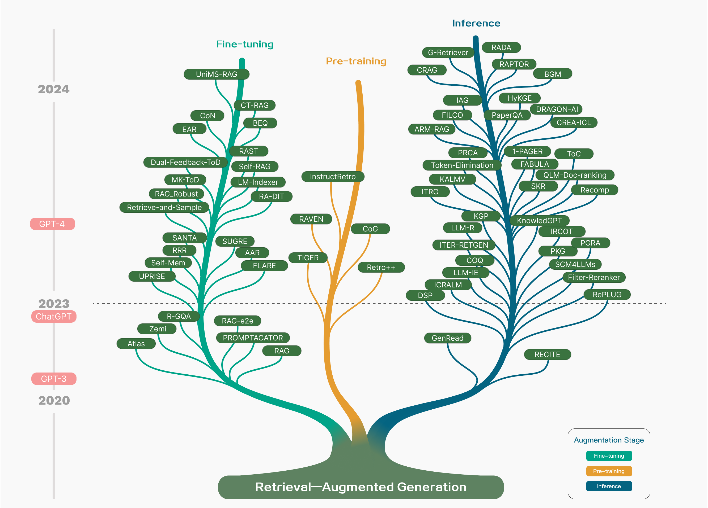
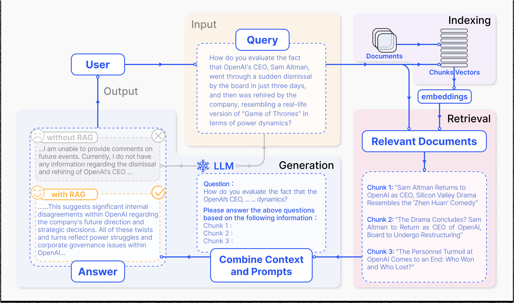
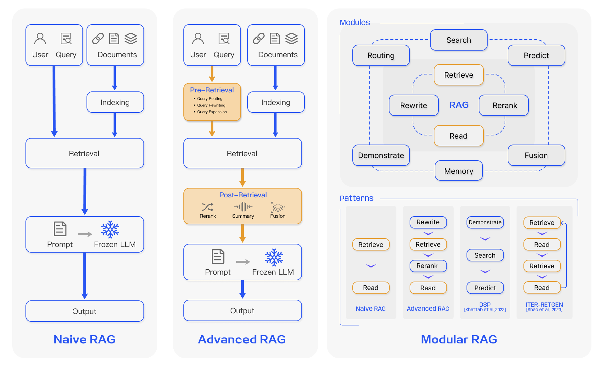
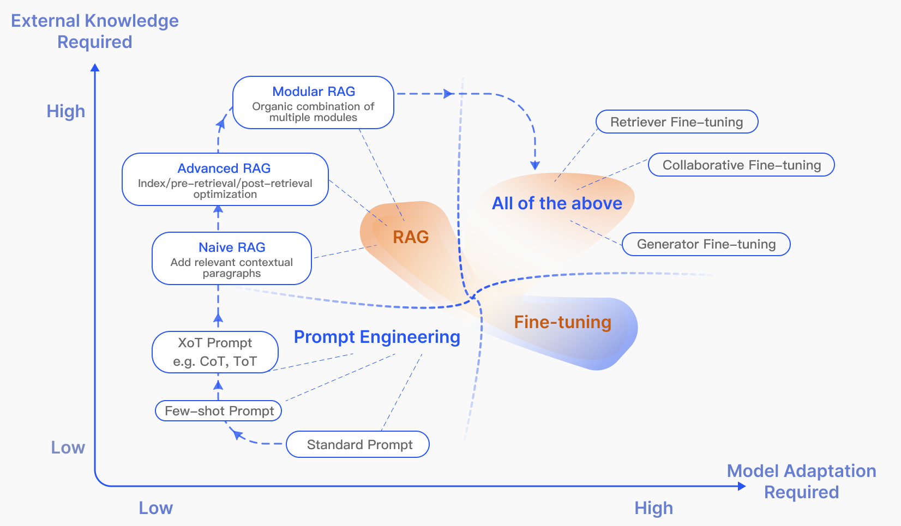
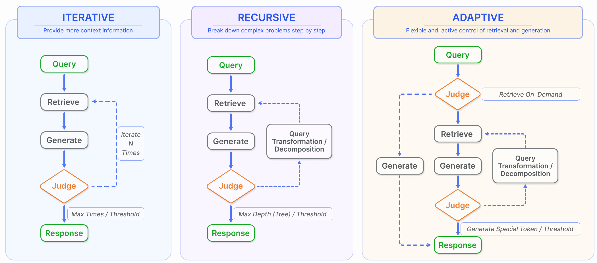
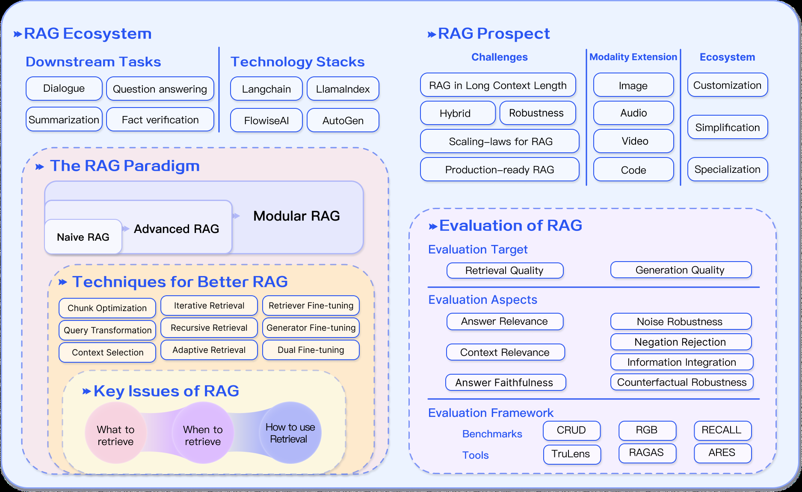

# 面向大型语言模型的检索增强生成：综述

**（Retrieval-Augmented Generation for Large Language Models: A Survey）**

> 本文为 Gao 等人 2023 年综述论文《Retrieval-Augmented Generation for Large Language Models: A Survey》（arXiv:2312.10997v5 [cs.CL]）的中文精确翻译。

**作者**：Yunfan Gaoᵃ, Yun Xiongᵇ, Xinyu Gaoᵇ, Kangxiang Jiaᵇ, Jinliu Panᵇ, Yuxi Biᶜ, Yi Daiᵃ, Jiawei Sunᵃ, Meng Wangᶜ, Haofen Wangᵃ'ᶜ

**单位**：ᵃ同济大学上海自主智能无人系统科学中心（Shanghai Research Institute for Intelligent Autonomous Systems, Tongji University）；ᵇ复旦大学计算机科学技术学院上海市数据科学重点实验室（Shanghai Key Laboratory of Data Science, School of Computer Science, Fudan University）；ᶜ同济大学设计创意学院（College of Design and Innovation, Tongji University）

**通讯作者邮箱**：haofen.wang@tongji.edu.cn

---

## 摘要

大型语言模型（Large Language Models，LLMs）展现出令人瞩目的能力，但同时也面临幻觉（hallucination）、知识过时以及推理过程不透明、不可追溯等挑战。检索增强生成（Retrieval-Augmented Generation，RAG）通过引入外部数据库中的知识，已成为一种前景广阔的解决方案。这提升了生成的准确性与可信度，尤其是在知识密集型任务上，并支持知识的持续更新与领域特定信息的整合。RAG 将 LLM 的内在知识与外部数据库中庞大、动态的知识库协同融合。本综述论文详细考察了 RAG 范式的演进历程，涵盖朴素 RAG（Naive RAG）、高级 RAG（Advanced RAG）与模块化 RAG（Modular RAG）。论文细致审视了 RAG 框架的三重基础，包括检索（retrieval）、生成（generation）与增强（augmentation）技术。论文重点介绍了嵌入在这些关键组件中的最先进（state-of-the-art）技术，以深入理解 RAG 系统的进展。此外，本文还介绍了最新的评估框架与基准。最后，本文阐述了当前面临的挑战，并指出研究与开发的前瞻性方向¹。

> ¹ 相关资源可在 <https://github.com/Tongji-KGLLM/RAG-Survey> 获取。

**索引词（Index Terms）**：大型语言模型，检索增强生成，自然语言处理，信息检索

---

## 1 引言

大型语言模型（LLMs）已经取得了显著的成功，但它们仍然面临重大局限，尤其是在领域特定或知识密集型任务上 [1]，特别是当处理超出其训练数据范围或需要当前信息的查询时会产生"幻觉"（hallucination）[2]。为了克服这些挑战，检索增强生成（RAG）通过基于语义相似度计算，从外部知识库中检索相关文档块（chunk）来增强 LLM。通过引用外部知识，RAG 有效地减少了生成事实性错误内容的问题。RAG 与 LLM 的结合已得到广泛应用，使 RAG 成为推动聊天机器人发展、提升 LLM 对现实世界应用适配性的关键技术。

近年来 RAG 技术发展迅速，总结相关研究的技术树如图 1 所示。RAG 在大模型时代的发展轨迹呈现出若干鲜明的阶段性特征。最初，RAG 的兴起恰逢 Transformer 架构的崛起，其重点是通过预训练模型（Pre-Training Models，PTM）融入额外知识来增强语言模型。这一早期阶段的特征是旨在改进预训练技术的基础性工作 [3]–[5]。随后 ChatGPT [6] 的出现标志着一个关键节点，LLM 展现出强大的上下文学习（in-context learning，ICL）能力。RAG 研究随之转向在推理阶段为 LLM 提供更好的信息，以回答更复杂、知识密集型的任务，从而推动 RAG 研究快速发展。随着研究的深入，RAG 的增强不再局限于推理阶段，而是开始与 LLM 微调技术更深入地结合。

蓬勃发展的 RAG 领域经历了快速增长，但尚未有系统的综合梳理来厘清其更宏观的发展轨迹。本综述力图填补这一空白，通过梳理 RAG 的流程，绘制其演进历程并展望其未来路径，重点关注 RAG 在 LLM 中的整合。本文兼顾技术范式与研究方法，从 100 余项 RAG 研究中总结出三大主要研究范式，并分析"检索"（Retrieval）、"生成"（Generation）与"增强"（Augmentation）核心阶段的关键技术。另一方面，当前研究更侧重于方法，缺乏对如何评估 RAG 的分析与总结。本文全面综述了适用于 RAG 的下游任务、数据集、基准与评估方法。总体而言，本文旨在细致梳理并分类 RAG 的基础技术概念、历史演进，以及 LLM 出现之后涌现的各种 RAG 方法与应用的谱系。本文旨在为读者和专业人士提供对大型模型与 RAG 的详尽、结构化的理解，阐明检索增强技术的演进，评估各种方法在各自情境下的优势与不足，并推测即将到来的趋势与创新。

我们的贡献如下：

- 在本综述中，我们对最先进的 RAG 方法进行了全面、系统的回顾，描绘了其通过朴素 RAG、高级 RAG 与模块化 RAG 等范式的演进，并将更广泛的 RAG 研究置于 LLM 的格局之中加以定位。
- 我们识别并讨论了 RAG 流程中的核心技术，特别聚焦于"检索"、"生成"与"增强"三个方面，并深入探讨它们之间的协同作用，阐明这些组件如何精巧地协作，形成一个连贯而高效的 RAG 框架。
- 我们总结了当前 RAG 的评估方法，涵盖 26 项任务、近 50 个数据集，概述了评估目标与指标，以及当前的评估基准与工具。此外，我们展望了 RAG 的未来方向，强调应对当前挑战的潜在改进。

本文结构如下：第 2 节介绍 RAG 的主要概念与当前范式。随后的三节分别探讨"检索"、"生成"与"增强"三大核心组件。第 3 节聚焦检索中的优化方法，包括索引、查询与嵌入优化。第 4 节聚焦生成中的检索后处理与 LLM 微调。第 5 节分析三种增强过程。第 6 节聚焦 RAG 的下游任务与评估体系。第 7 节主要讨论 RAG 当前面临的挑战及其未来发展方向。最后，第 8 节总结全文。

---

## 2 RAG 概览

RAG 的一个典型应用如图 2 所示。图中，用户就一则近期广受讨论的新闻向 ChatGPT 提问。由于 ChatGPT 依赖预训练数据，它最初无法提供关于近期动态的最新信息。RAG 通过从外部数据库获取并整合知识来弥合这一信息鸿沟。在此例中，它收集与用户查询相关的新闻文章。这些文章与原问题结合，形成一个全面的提示（prompt），使 LLM 能够生成一个信息充分的回答。

RAG 研究范式在持续演进，我们将其划分为三个阶段：朴素 RAG、高级 RAG 与模块化 RAG，如图 3 所示。尽管 RAG 方法成本效益高且性能超越原生 LLM，但它们也表现出若干局限性。高级 RAG 与模块化 RAG 的发展正是对朴素 RAG 这些具体不足的回应。

### 2.1 朴素 RAG

朴素 RAG 研究范式代表最早的方法论，它在 ChatGPT 被广泛采用后不久便崭露头角。朴素 RAG 遵循包含索引（indexing）、检索（retrieval）与生成（generation）的传统流程，这一流程也被称为"检索-阅读"（Retrieve-Read）框架 [7]。

**索引**从对 PDF、HTML、Word 和 Markdown 等多种格式的原始数据进行清洗与提取开始，随后将其转换为统一的纯文本格式。为了适应语言模型的上下文限制，文本被切分成更小、更易处理的块（chunk）。随后，块通过嵌入模型（embedding model）被编码为向量表示，并存储于向量数据库中。这一步对于在后续检索阶段实现高效的相似度搜索至关重要。

**检索**。当收到用户查询时，RAG 系统采用与索引阶段相同的编码模型，将查询转换为向量表示。然后计算查询向量与索引语料中块向量之间的相似度分数。系统优先检索与查询相似度最高的前 K 个块。这些块随后被用作提示中的扩展上下文。

**生成**。所提出的查询与选定的文档被合成为一个连贯的提示，大型语言模型据此负责给出回答。模型回答问题的方式可能因任务特定的标准而异，使其既可以利用其内在的参数化知识，也可以将回答限制在所提供的文档所包含的信息范围内。在持续对话的情况下，任何已有的对话历史都可以被整合进提示中，使模型能够有效地进行多轮对话交互。

然而，朴素 RAG 面临显著的缺陷：

**检索挑战**。检索阶段往往在精确率与召回率上力不从心，导致选中不相关或错位的块，以及遗漏关键信息。

**生成困难**。在生成回答时，模型可能面临幻觉问题，即生成检索上下文不支持的内容。这一阶段还可能出现输出中的不相关性、有害性或偏见，从而削弱回答的质量与可靠性。

**增强障碍**。将检索到的信息与不同任务相结合可能具有挑战性，有时会导致输出脱节或不连贯。当从多个来源检索到相似信息时，该过程还可能遇到冗余问题，导致回答重复。判断不同段落的重要性和相关性，以及确保风格与语气的一致性，进一步增加了复杂性。面对复杂问题，仅基于原始查询的单次检索可能不足以获取充分的上下文信息。此外，还存在一种担忧：生成模型可能过度依赖增强信息，导致输出只是简单复述检索到的内容，而未添加有见地的或综合性的信息。

### 2.2 高级 RAG

高级 RAG 引入了针对性的改进，以克服朴素 RAG 的局限性。它以提升检索质量为重点，采用检索前（pre-retrieval）与检索后（post-retrieval）策略。为了解决索引问题，高级 RAG 通过使用滑动窗口方法、细粒度切分以及引入元数据来改进其索引技术。此外，它还引入多种优化方法来简化检索流程 [8]。

**检索前过程**。在这一阶段，主要关注点是优化索引结构和原始查询。优化索引的目标是提升被索引内容的质量。这涉及若干策略：增强数据粒度、优化索引结构、添加元数据、对齐优化以及混合检索。而查询优化的目标是使用户的原始问题更清晰、更适用于检索任务。常见的方法包括查询重写、查询变换、查询扩展等技术 [7]，[9]–[11]。

**检索后过程**。一旦检索到相关上下文，将其与查询有效整合便至关重要。检索后过程中的主要方法包括对块进行重排序（rerank）和上下文压缩。对检索到的信息进行重排序，将最相关的内容重新定位到提示的边缘位置，是一项关键策略。这一概念已在 LlamaIndex²、LangChain³ 和 HayStack [12] 等框架中得到实现。将所有相关文档直接输入 LLM 可能导致信息过载，使关键细节被无关内容稀释。为缓解这一问题，检索后的工作集中于选取关键信息、强调重要部分并缩短待处理的上下文。

> ² <https://www.llamaindex.ai>
> ³ <https://www.langchain.com/>

### 2.3 模块化 RAG

模块化 RAG 架构超越了前两种 RAG 范式，提供了更强的适应性与通用性。它纳入了改进其组件的多种策略，例如添加用于相似度搜索的搜索模块，以及通过微调来改进检索器。诸如重构 RAG 模块 [13] 与重新编排 RAG 流水线 [14] 等创新被引入，以应对特定挑战。向模块化 RAG 方法的转变正日益普遍，既支持跨组件的顺序处理，也支持集成的端到端训练。尽管具有独特性，模块化 RAG 建立在高级 RAG 与朴素 RAG 的基础原则之上，体现了 RAG 家族内部的递进与精化。

**1）新模块**：模块化 RAG 框架引入了额外的专用组件，以增强检索与处理能力。**搜索（Search）模块**适应特定场景，利用 LLM 生成的代码与查询语言，在搜索引擎、数据库和知识图谱等各种数据源上实现直接搜索 [15]。**RAG-Fusion** 通过采用多查询策略来解决传统搜索的局限，将用户查询扩展为多样化的视角，利用并行向量搜索与智能重排序来挖掘显性与变革性知识 [16]。**记忆（Memory）模块**利用 LLM 的记忆来引导检索，创建一个无界的记忆池，通过迭代式自我增强使文本更贴近数据分布 [17]，[18]。RAG 系统中的**路由（Routing）**在多样化的数据源之间导航，为查询选择最优路径，无论这涉及摘要生成、特定数据库搜索还是合并不同的信息流 [19]。**预测（Predict）模块**旨在通过 LLM 直接生成上下文来减少冗余与噪声，确保相关性与准确性 [13]。最后，**任务适配器（Task Adapter）模块**使 RAG 适配各种下游任务，为零样本输入自动检索提示，并通过少样本查询生成来创建任务特定的检索器 [20]，[21]。这种全面的方法不仅简化了检索流程，还显著提升了检索信息的质量与相关性，以更强的精确性与灵活性服务于广泛的任务与查询。

**2）新模式**：模块化 RAG 通过允许模块替换或重新配置来应对特定挑战，从而提供卓越的适应性。这超越了朴素 RAG 与高级 RAG 的固定结构，后者以简单的"检索"与"阅读"机制为特征。此外，模块化 RAG 通过集成新模块或调整现有模块之间的交互流程来扩展这种灵活性，增强了其在不同任务中的适用性。

诸如**重写-检索-阅读（Rewrite-Retrieve-Read）**[7] 模型等创新，利用 LLM 的能力通过重写模块和语言模型反馈机制来精化检索查询，以更新重写模型，从而提升任务性能。类似地，**生成-阅读（Generate-Read）**[13] 等方法用 LLM 生成的内容替代传统检索，而**复述-阅读（Recite-Read）**[22] 则强调从模型权重中检索，增强模型处理知识密集型任务的能力。混合检索策略整合关键词、语义与向量搜索，以服务于多样化的查询。此外，采用子查询与假设文档嵌入（Hypothetical Document Embeddings，HyDE）[11] 的方法，通过聚焦于生成答案与真实文档之间的嵌入相似度，力求提升检索相关性。

模块编排与交互的调整，例如**演示-搜索-预测（Demonstrate-Search-Predict，DSP）**[23] 框架以及 ITER-RETGEN [14] 的迭代式"检索-阅读-检索-阅读"流程，展示了动态利用模块输出来增强另一模块功能的做法，体现出对增强模块协同作用的深入理解。模块化 RAG 流程的灵活编排通过 FLARE [24] 与 Self-RAG [25] 等技术展示了自适应检索的益处。这种方法超越固定的 RAG 检索流程，根据不同场景评估检索的必要性。灵活架构的另一个好处是，RAG 系统可以更容易地与其他技术（如微调或强化学习）集成 [26]。例如，这可以包括微调检索器以获得更好的检索结果，微调生成器以获得更个性化的输出，或者进行协同微调 [27]。

### 2.4 RAG 与微调

随着 LLM 日益普及，对 LLM 的增强已引起广泛关注。在 LLM 的优化方法中，RAG 常常与微调（Fine-tuning，FT）和提示工程（prompt engineering）进行比较。每种方法具有不同的特征，如图 4 所示。我们使用象限图（quadrant chart）从两个维度阐述三种方法之间的差异：外部知识需求与模型适配需求。提示工程利用模型的内在能力，对外部知识与模型适配的需求最低。RAG 可以类比为给模型提供一本量身定制的教科书用于信息检索，非常适合精确的信息检索任务。相比之下，微调好比学生随着时间的推移内化知识，适用于需要复现特定结构、风格或格式的场景。

RAG 在动态环境中表现出色，提供实时的知识更新，并以高可解释性有效利用外部知识源。然而，它带来更高的延迟，以及在数据检索方面的伦理考量。另一方面，微调更为静态，更新时需要重新训练，但能够对模型的行为与风格进行深度定制。它在数据集准备与训练上需要大量的计算资源，虽然能够减少幻觉，但在面对陌生数据时可能遇到挑战。

在对不同主题的各种知识密集型任务上的性能进行多项评估时，[28] 揭示出：虽然无监督微调带来一定改进，但 RAG 始终优于它——无论是对训练期间已见过的既有知识，还是全新的知识。此外，研究发现 LLM 难以通过无监督微调学习新的事实性信息。RAG 与微调之间的选择，取决于应用场景中对数据动态性、定制化与计算能力的具体需求。RAG 与微调并非互斥，而是可以相互补充，在不同层面增强模型的能力。在某些情况下，二者的结合使用可能带来最优性能。涉及 RAG 与微调的优化过程可能需要多次迭代才能达到令人满意的结果。

---

## 3 检索

在 RAG 的语境下，高效地从数据源中检索相关文档至关重要。其中涉及若干关键问题，例如检索来源、检索粒度、检索的预处理以及相应嵌入模型的选择。

### 3.1 检索来源

RAG 依赖外部知识来增强 LLM，而检索来源的类型与检索单元的粒度都会影响最终的生成结果。

**1）数据结构**：最初，文本是检索的主流来源。随后，检索来源扩展到半结构化数据（PDF）和结构化数据（知识图谱，Knowledge Graph，KG）以进行增强。除了从原始外部来源检索之外，近期研究中也出现了一种日益增长的趋势，即利用 LLM 自身生成的内容来进行检索与增强。

**非结构化数据**（如文本）是最广泛使用的检索来源，主要采集自语料库。对于开放域问答（open-domain question-answering，ODQA）任务，主要的检索来源是维基百科转储（Wikipedia Dump），当前的主要版本包括 HotpotQA⁴（2017 年 10 月 1 日）与 DPR⁵（2018 年 12 月 20 日）。除了百科数据外，常见的非结构化数据还包括跨语言文本 [19] 和领域特定数据（如医疗 [67] 与法律领域 [29]）。

**半结构化数据**通常指同时包含文本与表格信息的数据，例如 PDF。处理半结构化数据对传统 RAG 系统构成挑战，主要有两个原因。首先，文本切分过程可能无意间将表格分开，导致检索过程中的数据损坏。其次，将表格纳入数据会使语义相似度搜索变得复杂。在处理半结构化数据时，一种方法利用 LLM 的代码能力，对数据库中的表格执行 Text-2-SQL 查询，例如 TableGPT [85]。或者，表格可以转换为文本格式，用基于文本的方法进行进一步分析 [75]。然而，这两种方法都不是最优解，表明该领域存在大量研究机会。

**结构化数据**，例如知识图谱（KGs）[86]，通常经过验证，能够提供更精确的信息。KnowledGPT [15] 生成知识库（KB）搜索查询，并将知识存储在个性化知识库中，增强了 RAG 模型的知识丰富度。针对 LLM 在理解与回答文本图谱相关问题上的局限，G-Retriever [84] 集成了图神经网络（Graph Neural Networks，GNNs）、LLM 与 RAG，通过 LLM 的软提示（soft prompting）增强图谱理解与问答能力，并采用奖励收集斯坦纳树（Prize-Collecting Steiner Tree，PCST）优化问题进行目标化的图谱检索。相反，构建、验证和维护结构化数据库需要额外的努力。

**LLM 生成的内容**。针对 RAG 中外部辅助信息的局限，一些研究聚焦于挖掘 LLM 的内部知识。SKR [58] 将问题分类为已知或未知，选择性地应用检索增强。GenRead [13] 用 LLM 生成器替代检索器，发现由于与因果语言建模的预训练目标更一致，LLM 生成的上下文往往包含更准确的答案。Selfmem [17] 通过检索增强的生成器迭代式地创建无界记忆池，使用记忆选择器选择输出，作为原问题的对偶问题，从而实现生成模型的自我增强。这些方法论凸显了 RAG 中创新性数据源利用的广度，力求提升模型性能与任务效果。

**2）检索粒度**：除检索来源的数据格式外，另一个重要因素是检索数据的粒度。粗粒度检索单元理论上可以为问题提供更多相关信息，但也可能包含冗余内容，从而在下游任务中分散检索器与语言模型的注意力 [50]，[87]。另一方面，细粒度检索单元的粒度增加了检索的负担，且无法保证语义完整性与满足所需的知识。在推理期间选择合适的检索粒度，可以成为一种简单而有效的策略，以提升稠密检索器的检索与下游任务性能。

在文本中，检索粒度从细到粗，包括令牌（Token）、短语（Phrase）、句子（Sentence）、命题（Proposition）、块（Chunk）、文档（Document）。其中，DenseX [30] 提出了使用命题作为检索单元的概念。命题被定义为文本中的原子表达式（atomic expressions），每个命题封装一个独特的事实片段，并以简洁、自包含的自然语言格式呈现。这种方法旨在提升检索的精确性与相关性。在知识图谱（KG）上，检索粒度包括实体（Entity）、三元组（Triplet）与子图（sub-Graph）。检索粒度还可以适配下游任务，例如在推荐任务中检索物品 ID（Item IDs）[40]，以及句子对（Sentence pairs）[38]。详细信息如表 I 所示。

> ⁴ <https://hotpotqa.github.io/wiki-readme.html>
> ⁵ <https://github.com/facebookresearch/DPR>

### 3.2 索引优化

在索引阶段，文档将被处理、切分并转换为嵌入（Embeddings），存储于向量数据库中。索引构建的质量决定了检索阶段能否获取正确的上下文。

**1）分块策略**：最常见的方法是按固定数量的 token（例如 100、256、512）将文档切分为块 [88]。较大的块能够捕获更多上下文，但也会产生更多噪声，需要更长的处理时间与更高的成本。而较小的块虽然可能无法充分传达必要上下文，但噪声更少。然而，分块会导致句子内部被截断，这促使了对递归切分与滑动窗口方法的优化，通过在多次检索过程中合并全局相关信息来实现分层检索 [89]。尽管如此，这些方法仍无法在语义完整性与上下文长度之间取得平衡。因此，人们提出了 Small2Big 等方法，其中句子（小，small）被用作检索单元，而其前后文句子作为（大，big）上下文提供给 LLM [90]。

**2）元数据附加**：块可以用页面编号、文件名、作者、类别、时间戳等元数据信息进行丰富。随后，可以基于这些元数据对检索进行过滤，缩小检索范围。在检索过程中为文档时间戳分配不同的权重，可以实现时间感知的 RAG，确保知识的新鲜度并避免过时信息。

除了从原始文档中提取元数据外，元数据也可以被人工构造。例如，添加段落摘要，以及引入假设性问题。这种方法也被称为**反向 HyDE（Reverse HyDE）**。具体而言，使用 LLM 生成能够由该文档回答的问题，然后在检索时计算原问题与假设问题之间的相似度，以缩小问题与答案之间的语义鸿沟。

**3）结构索引**：增强信息检索的一种有效方法是为文档建立层次化结构。通过构建结构化索引，RAG 系统可以加速对相关数据的检索与处理。

**层次化索引结构**。文件以父子关系排列，块与之关联。每个节点存储数据摘要，有助于快速遍历数据，并协助 RAG 系统确定要提取哪些块。这种方法还可以缓解由块提取问题引起的错觉（illusion）。

**知识图谱索引**。利用知识图谱（KG）构建文档的层次化结构有助于保持一致性。它勾勒出不同概念与实体之间的联系，显著降低产生错觉的可能性。另一个优势是将信息检索过程转化为 LLM 能够理解的指令，从而提升知识检索的准确性，并使 LLM 生成上下文连贯的回答，进而提升 RAG 系统的整体效率。为了捕获文档内容与结构之间的逻辑关系，KGP [91] 提出了一种使用 KG 在多个文档之间构建索引的方法。该 KG 由节点（表示文档中的段落或结构，例如页面和表格）与边（表示段落之间的语义/词汇相似度，或文档结构内的关系）组成，有效地解决了多文档环境下的知识检索与推理问题。

### 3.3 查询优化

朴素 RAG 的主要挑战之一是其直接依赖用户的原始查询作为检索基础。提出一个精确、清晰的问题是困难的，而不谨慎的查询会导致检索效果欠佳。有时问题本身很复杂，语言组织也不够好。另一个困难在于语言的复杂性与歧义性。语言模型在处理专业词汇或具有多重含义的模糊缩写时往往举步维艰。例如，它们可能无法辨别"LLM"在法律语境下究竟指大型语言模型（large language model）还是法学硕士（Master of Laws）。

**1）查询扩展**：将单一查询扩展为多个查询，可以丰富查询内容，提供更多上下文以弥补特定细微之处的缺失，从而确保生成答案的最优相关性。

**多查询（Multi-Query）**。通过提示工程利用 LLM 扩展查询，随后这些查询可以并行执行。查询的扩展并非随机的，而是经过精心设计的。

**子查询（Sub-Query）**。子问题规划的过程代表生成必要的子问题，以便在合并时对原问题进行语境化并完整回答。这种添加相关上下文的过程在原理上与查询扩展相似。具体而言，可以使用从易到难提示（least-to-most prompting）方法将一个复杂问题分解为一系列更简单的子问题 [92]。

**验证链（Chain-of-Verification，CoVe）**。扩展后的查询经过 LLM 的验证，以达到减少幻觉的效果。经过验证的扩展查询通常表现出更高的可靠性 [93]。

**2）查询变换**：其核心概念是基于变换后的查询而非用户的原始查询来检索块。

**查询重写（Query Rewrite）**。原始查询对 LLM 检索而言并非总是最优的，尤其是在现实场景中。因此，我们可以提示 LLM 重写查询。除了使用 LLM 进行查询重写外，还可以使用专门的小型语言模型，例如 RRR（重写-检索-阅读，Rewrite-retrieve-read）[7]。查询重写方法在淘宝中的实现，即 BEQUE [9]，显著提升了长尾查询的召回效果，从而带来 GMV 的增长。

另一种查询变换方法是使用提示工程，让 LLM 基于原始查询生成一个用于后续检索的查询。HyDE [11] 构造假设文档（即对原始查询的假定答案）。它聚焦于从答案到答案的嵌入相似度，而非寻求问题或查询的嵌入相似度。使用后退提示（Step-back Prompting）方法 [10]，原始查询被抽象化，生成一个高层次的概念问题（后退问题，step-back question）。在 RAG 系统中，后退问题与原始查询都被用于检索，二者的结果都被用作语言模型生成答案的基础。

**3）查询路由**：根据不同的查询，路由到不同的 RAG 流水线，这适用于旨在适应多样化场景的通用型 RAG 系统。

**元数据路由/过滤（Metadata Router/Filter）**。第一步涉及从查询中提取关键词（实体），随后基于关键词与块内的元数据进行过滤，以缩小搜索范围。

**语义路由（Semantic Router）**是另一种路由方法，涉及利用查询的语义信息。具体做法参见 Semantic Router⁶。当然，也可以采用混合路由方法，将基于语义与基于元数据的方法结合起来，以实现增强的查询路由。

> ⁶ <https://github.com/aurelio-labs/semantic-router>

### 3.4 嵌入

在 RAG 中，检索是通过计算问题嵌入与文档块嵌入之间的相似度（例如余弦相似度）来实现的，其中嵌入模型的语义表示能力起着关键作用。这主要包括稀疏编码器（BM25）和稠密检索器（基于 BERT 架构的预训练语言模型）。近期研究引入了诸如 AngIE、Voyage、BGE 等 [94]–[96] 出色的嵌入模型，它们受益于多任务指令微调。Hugging Face 的 MTEB 排行榜⁷在 8 项任务上评估嵌入模型，涵盖 58 个数据集。此外，C-MTEB 专注于中文能力，涵盖 6 项任务和 35 个数据集。对于"使用哪个嵌入模型"，并不存在放之四海而皆准的答案。然而，某些特定模型更适合特定的用例。

**1）混合/融合检索（Mix/hybrid Retrieval）**：稀疏与稠密嵌入方法捕获不同的相关性特征，可以通过利用互补的相关性信息彼此受益。例如，稀疏检索模型可用于为稠密检索模型的训练提供初始搜索结果。此外，可以利用预训练语言模型（PLMs）学习词项权重，以增强稀疏检索。具体而言，研究还表明稀疏检索模型可以增强稠密检索模型的零样本检索能力，并协助稠密检索器处理包含罕见实体的查询，从而提升鲁棒性。

**2）微调嵌入模型**：当上下文与预训练语料显著偏离时，尤其是在医疗保健、法律实务以及其他充斥专有术语的高度专业化领域，必须在你自己的领域数据集上微调嵌入模型，以缓解这种差异。

除了补充领域知识外，微调的另一个目的是对齐检索器与生成器，例如使用 LLM 的结果作为微调的监督信号，即所谓的 LSR（语言模型监督的检索器，LM-supervised Retriever）。PROMPTAGATOR [21] 利用 LLM 作为少样本查询生成器，创建任务特定的检索器，解决监督微调中的挑战，尤其是在数据稀缺的领域。另一种方法 LLM-Embedder [97] 利用 LLM 在多个下游任务上生成奖励信号。检索器使用两种监督信号进行微调：数据集的硬标签与来自 LLM 的软奖励。这种双信号方法促进了更有效的微调过程，使嵌入模型适配多样化的下游应用。REPLUG [72] 利用检索器和 LLM 计算检索文档的概率分布，然后通过计算 KL 散度进行监督训练。这种直接而有效的训练方法通过使用 LM 作为监督信号来提升检索模型的性能，无需特定的交叉注意力机制。此外，受 RLHF（基于人类反馈的强化学习，Reinforcement Learning from Human Feedback）的启发，利用基于 LM 的反馈通过强化学习来强化检索器。

### 3.5 适配器

微调模型可能带来挑战，例如通过 API 集成功能，或应对本地计算资源有限带来的约束。因此，一些方法选择引入外部适配器（adapter）来辅助对齐。

为了优化 LLM 的多任务能力，UPRISE [20] 训练了一个轻量级的提示检索器，能够从预先构建的提示池中自动检索适合给定零样本任务输入的提示。AAR（增强自适应检索器，Augmentation-Adapted Retriever）[47] 引入了一个通用适配器，旨在适应多个下游任务。而 PRCA [69] 添加了一个可插拔的奖励驱动上下文适配器，以增强在特定任务上的性能。BGM [26] 保持检索器与 LLM 固定，在二者之间训练一个桥接 Seq2Seq 模型。该桥接模型旨在将检索到的信息转换为 LLM 能够有效处理的格式，使其不仅能够重排序，还能为每个查询动态选择段落，并可能采用更高级的策略（如重复）。此外，PKG 引入了一种创新方法，通过指令微调（directive fine-tuning）将知识整合到白盒模型中 [75]。在这种方法中，检索器模块被直接替换，以根据查询生成相关文档。这种方法有助于解决微调过程中遇到的困难，并提升模型性能。

---

## 4 生成

检索之后，将所有检索到的信息直接输入 LLM 来回答问题并非良好实践。下文将从两个角度介绍调整方法：调整检索到的内容与调整 LLM。

### 4.1 上下文整理

冗余信息会干扰 LLM 的最终生成，而过长的上下文还会导致 LLM 出现"迷失在中间"（Lost in the middle）问题 [98]。与人类一样，LLM 往往只关注长文本的开头与结尾，而遗忘中间部分。因此，在 RAG 系统中，我们通常需要进一步处理检索到的内容。

**1）重排序**：重排序从根本上重新排列文档块，以首先突出最相关的结果，有效缩减整体文档池，在信息检索中起到双重作用——既作为增强器又作为过滤器，为更精确的语言模型处理提供精炼的输入 [70]。重排序可以使用基于规则的方法（依赖于预定义的指标，如多样性（Diversity）、相关性（Relevance）与 MRR），也可以使用基于模型的方法，如 BERT 系列的编码器-解码器模型（例如 SpanBERT）、专门的重排序模型（如 Cohere rerank 或 bge-reranker-large），以及通用大型语言模型（如 GPT）[12]，[99]。

**2）上下文选择/压缩**：RAG 过程中一个常见的误解是认为检索尽可能多的相关文档并将其拼接成冗长的检索提示是有益的。然而，过度的上下文会引入更多噪声，削弱 LLM 对关键信息的感知。

（长）LLMLingua [100]，[101] 利用小型语言模型（Small Language Models，SLMs）（如 GPT-2 Small 或 LLaMA-7B）检测并移除不重要的 token，将其转换为一种人类难以理解但 LLM 能很好理解的形式。这种方法为提示压缩提供了一种直接而实用的途径，无需对 LLM 进行额外训练，同时兼顾了语言完整性与压缩比。PRCA 通过训练一个信息提取器来解决这一问题 [69]。类似地，RECOMP 采用可比的方法，使用对比学习训练一个信息压缩器 [71]。每个训练数据点由一个正样本与五个负样本组成，编码器在整个过程中使用对比损失进行训练 [102]。

除了压缩上下文之外，减少文档数量也有助于提升模型回答的准确性。Ma 等人 [103] 提出了"过滤-重排序"（Filter-Reranker）范式，该范式结合了 LLM 与 SLM 的优势。在该范式中，SLM 充当过滤器，而 LLM 充当重排序代理。研究表明，指示 LLM 重新排列由 SLM 识别出的困难样本，可在各种信息抽取（Information Extraction，IE）任务中带来显著改进。另一种直接而有效的方法涉及让 LLM 在生成最终答案之前评估检索到的内容。这使 LLM 能够通过 LLM 评判过滤掉相关性差的文档。例如，在 Chatlaw [104] 中，LLM 被提示对所引用的法律条文进行自我建议，以评估其相关性。

### 4.2 LLM 微调

基于场景与数据特征对 LLM 进行针对性微调可以带来更好的结果。这也是使用本地部署（on-premise）LLM 的最大优势之一。当 LLM 在特定领域缺乏数据时，可以通过微调向 LLM 提供额外的知识。HuggingFace 的微调数据也可以作为初始步骤。

微调的另一个好处是能够调整模型的输入与输出。例如，它可以使 LLM 适应特定的数据格式，并按照指示以特定风格生成回答 [37]。对于涉及结构化数据的检索任务，SANTA 框架 [76] 实施了三方训练方案（tripartite training），以有效地同时封装结构化与语义上的细微之处。初始阶段聚焦于检索器，利用对比学习来精化查询与文档嵌入。

通过强化学习将 LLM 的输出与人类或检索器的偏好对齐是一种潜在的途径。例如，人工标注最终生成的答案，然后通过强化学习提供反馈。除了与人类偏好对齐外，还可以与微调模型和检索器的偏好对齐 [79]。当无法访问强大的专有模型或更大参数的开源模型时，一种简单而有效的方法是蒸馏更强大的模型（例如 GPT-4）。LLM 的微调也可以与检索器的微调协同进行，以对齐偏好。一种典型的方法，如 RA-DIT [27]，使用 KL 散度对齐检索器与生成器之间的评分函数。

---

## 5 RAG 中的增强过程

在 RAG 领域，标准做法往往涉及单次（once）检索后接生成，这可能导致效率低下，并且对于需要多步推理的复杂问题而言通常是不够的，因为它提供的信息范围有限 [105]。许多研究针对这一问题优化了检索过程，我们已将其总结于图 5 中。

### 5.1 迭代检索

迭代检索（Iterative Retrieval）是一个基于初始查询与迄今已生成文本反复搜索知识库的过程，为 LLM 提供更全面的知识库。该方法已被证明能够通过多次检索迭代提供额外的上下文参考，从而增强后续答案生成的鲁棒性。然而，它可能受到语义不连续性与无关信息累积的影响。ITER-RETGEN [14] 采用一种协同方法，将"检索增强的生成"与"生成增强的检索"相结合，用于需要复现特定信息的任务。模型利用解决输入任务所需的内容作为检索相关知识的上下文基础，进而促进后续迭代中生成更优的回答。

### 5.2 递归检索

递归检索（Recursive Retrieval）常用于信息检索与 NLP，以提升搜索结果的深度与相关性。该过程涉及基于先前搜索获得的结果迭代地精化搜索查询。递归检索旨在通过反馈回路逐步收敛到最相关的信息，从而增强搜索体验。IRCoT [61] 使用思维链（chain-of-thought）引导检索过程，并用获得的检索结果精化思维链。ToC [57] 创建了一棵澄清树（clarification tree），系统地优化查询中的歧义部分。在用户需求从一开始就不完全清晰，或所寻求的信息高度专业或微妙复杂的搜索场景中，它尤为有用。该过程的递归特性允许持续学习并适应用户需求，通常能带来搜索结果的更高满意度。

为了应对特定的数据场景，递归检索与多跳检索技术被结合使用。递归检索涉及使用结构化索引，以层次化的方式处理与检索数据，这可能包括在对文档或冗长 PDF 执行检索之前，先对其各部分进行摘要。随后，在文档内部进行二次检索以精化搜索，体现出该过程的递归特性。相比之下，多跳检索旨在深入挖掘图结构化的数据源，提取相互关联的信息 [106]。

### 5.3 自适应检索

以 Flare [24] 和 Self-RAG [25] 为代表的自适应检索方法，通过使 LLM 主动确定检索的最优时机与内容来精化 RAG 框架，从而提升所获取信息的效率与相关性。

这些方法属于一个更广泛趋势的一部分，其中 LLM 在其运行中运用主动判断，正如 AutoGPT、Toolformer 与 Graph-Toolformer [107]–[109] 等模型代理中所见。例如，Graph-Toolformer 将其检索过程划分为不同的步骤，LLM 主动使用检索器、应用 Self-Ask 技术，并采用少样本提示来发起搜索查询。这种主动姿态使 LLM 能够决定何时搜索必要信息，类似于代理使用工具的方式。

WebGPT [110] 集成了强化学习框架，训练 GPT-3 模型在文本生成过程中自主使用搜索引擎。它使用特殊 token 来导航这一过程，这些 token 促进诸如搜索引擎查询、浏览结果与引用参考文献等操作，从而通过使用外部搜索引擎扩展 GPT-3 的能力。Flare 通过监控生成过程的置信度（由生成词项的概率指示）来自动化检索时机 [24]。当概率降至某个阈值以下时，就会激活检索系统收集相关信息，从而优化检索循环。Self-RAG [25] 引入了"反思令牌"（reflection tokens），使模型能够反思其输出。这些 token 有两种类型："检索"（retrieve）与"评判"（critic）。模型自主决定何时激活检索，或者，也可以由预定义的阈值触发该过程。在检索期间，生成器跨多个段落进行片段级束搜索（fragment-level beam search），以得出最连贯的序列。评判分数用于更新细分评分，并且可以在推理期间灵活调整这些权重，从而定制模型的行为。Self-RAG 的设计无需额外的分类器，也无需依赖自然语言推理（Natural Language Inference，NLI）模型，从而简化了何时启动检索机制的决策过程，并提升了模型在生成准确回答时的自主判断能力。

## 6 任务与评估

RAG 在 NLP 领域的快速进步与日益普及，已将 RAG 模型的评估推向 LLM 社区研究的前沿。这一评估的首要目标是理解并优化 RAG 模型在多样化应用场景中的性能。本章将主要介绍 RAG 的主要下游任务、数据集，以及如何评估 RAG 系统。

### 6.1 下游任务

RAG 的核心任务仍是问答（Question Answering，QA），包括传统的单跳/多跳问答、选择题、领域特定问答，以及适合 RAG 的长文本场景。除 QA 之外，RAG 还不断扩展到多个下游任务，如信息抽取（Information Extraction，IE）、对话生成、代码搜索等。RAG 的主要下游任务及其相应数据集总结于表 II 中。

### 6.2 评估目标

从历史上看，RAG 模型的评估一直以其在特定下游任务上的表现为中心。这些评估采用适合手头任务的既定指标。例如，问答评估可能依赖 EM 与 F1 分数 [7]，[45]，[59]，[72]，而事实核查任务通常以准确率（Accuracy）作为主要指标 [4]，[14]，[42]。BLEU 与 ROUGE 指标也常用于评估答案质量 [26]，[32]，[52]，[78]。诸如 RALLE 等为 RAG 应用自动评估而设计的工具，同样基于这些任务特定指标进行评估 [160]。尽管如此，专门评估 RAG 模型独特特征的研究仍明显匮乏。主要的评估目标包括：

**检索质量**。评估检索质量对于确定检索器组件所获取上下文的有效性至关重要。来自搜索引擎、推荐系统与信息检索系统领域的标准指标被用于衡量 RAG 检索模块的性能。命中率（Hit Rate）、MRR 与 NDCG 等指标常用于此目的 [161]，[162]。

**生成质量**。生成质量的评估聚焦于生成器从检索到的上下文中综合出连贯且相关答案的能力。这一评估可以基于内容的性质进行分类：无标注内容与有标注内容。对于无标注内容，评估涵盖生成答案的忠实性、相关性与无害性。相比之下，对于有标注内容，重点在于模型所生成信息的准确性 [161]。此外，检索与生成质量的评估都可以通过人工或自动评估方法进行 [29]，[161]，[163]。

### 6.3 评估方面

当代 RAG 模型的评估实践强调三项主要的质量评分（quality scores）与四项基本能力（abilities），它们共同构成对 RAG 模型两大主要目标——检索与生成——的评估依据。

**1）质量评分**：质量评分包括上下文相关性（context relevance）、答案忠实性（answer faithfulness）与答案相关性（answer relevance）。这些质量评分从不同角度评估 RAG 模型在信息检索与生成过程中的效率 [164]–[166]。

**上下文相关性**评估所检索上下文的精确性与具体性，确保相关性并最小化与无关内容相关的处理成本。

**答案忠实性**确保生成的答案忠于检索到的上下文，保持一致并避免矛盾。

**答案相关性**要求生成的答案直接切合所提出的问题，有效地回应核心疑问。

**2）所需能力**：RAG 评估还涵盖四项体现其适应性与效率的能力：噪声鲁棒性（noise robustness）、负向拒答（negative rejection）、信息整合（information integration）与反事实鲁棒性（counterfactual robustness）[167]，[168]。这些能力对于模型在各种挑战与复杂场景下的表现至关重要，并影响质量评分。

**噪声鲁棒性**评估模型管理那些与问题相关但缺乏实质性信息的噪声文档的能力。

**负向拒答**评估模型在检索到的文档不包含回答问题所需知识时克制作答的辨别力。

**信息整合**评估模型综合来自多个文档的信息以回答复杂问题的熟练程度。

**反事实鲁棒性**测试模型识别并忽略文档中已知不准确内容的能力，即使被告知存在潜在的错误信息时也是如此。

上下文相关性与噪声鲁棒性对于评估检索质量很重要，而答案忠实性、答案相关性、负向拒答、信息整合与反事实鲁棒性对于评估生成质量很重要。

每个评估方面的具体指标总结于表 III。必须认识到，这些从相关工作推导而来的指标是传统度量，尚不代表用于量化 RAG 评估方面的成熟或标准化方法。一些评估研究中也开发了针对 RAG 模型细微之处量身定制的自定义指标，尽管此处未包含。

### 6.4 评估基准与工具

为促进 RAG 的评估，一系列基准测试与工具已被提出。这些工具提供量化指标，不仅衡量 RAG 模型性能，还增强了对模型在各种评估方面能力的理解。诸如 RGB、RECALL 与 CRUD [167]–[169] 等著名基准侧重于评估 RAG 模型的基本能力。同时，诸如 RAGAS [164]、ARES [165] 与 TruLens⁸ 等最先进的自动化工具利用 LLM 来判定质量评分。这些工具与基准共同构成了一个对 RAG 模型进行系统评估的稳健框架，如表 IV 所总结。

> ⁸ <https://www.trulens.org/trulens_eval/core_concepts_rag_triad/>

---

## 7 讨论与未来展望

尽管 RAG 技术取得了长足进步，但仍有若干挑战亟待深入研究。本章将主要介绍 RAG 当前面临的挑战与未来的研究方向。

### 7.1 RAG 与长上下文

随着相关研究的深入，LLM 的上下文在不断扩展 [170]–[172]。目前，LLM 可以轻松处理超过 200,000 个 token 的上下文⁹。这一能力意味着，以往依赖 RAG 的长文档问答现在可以直接将整个文档纳入提示。这也引发了关于当 LLM 不再受上下文限制时 RAG 是否仍有必要的讨论。事实上，RAG 仍发挥着不可替代的作用。一方面，一次性向 LLM 提供大量上下文会显著影响其推理速度，而分块检索与按需输入可以显著提升运行效率。另一方面，基于 RAG 的生成可以快速定位原始参考文献，以帮助用户核验生成的答案。整个检索与推理过程是可观测的，而仅依赖长上下文的生成仍然是一个黑箱。反之，上下文的扩展为 RAG 的发展提供了新的机遇，使其能够处理更复杂的问题，以及需要阅读大量材料才能回答的整合性或总结性问题 [49]。在超长上下文的背景下开发新的 RAG 方法是未来的研究趋势之一。

> ⁹ <https://kimi.moonshot.cn>

### 7.2 RAG 鲁棒性

检索过程中存在的噪声或矛盾信息会损害 RAG 的输出质量。这种情况被形象地称为"错误信息可能比没有信息更糟"（Misinformation can be worse than no information at all）。提升 RAG 对此类对抗性或反事实输入的抵抗力正在获得研究势头，并已成为一项关键性能指标 [48]，[50]，[82]。Cuconasu 等人 [54] 分析了应当检索哪种类型的文档，评估了文档与提示的相关性、其位置以及上下文中包含的数量。研究结果表明，纳入不相关文档可能出人意料地将准确率提升超过 30%，这与最初认为质量会下降的假设相矛盾。这些结果凸显了开发专门策略以将检索与语言生成模型整合的重要性，表明需要进一步研究与探索 RAG 的鲁棒性。

### 7.3 混合方法

将 RAG 与微调相结合正成为一种领先策略。确定 RAG 与微调的最优整合方式——无论是顺序式、交替式，还是通过端到端联合训练——以及如何同时利用参数化与非参数化的优势，都是亟待探索的领域 [27]。另一个趋势是将具有特定功能的小型语言模型（SLMs）引入 RAG，并根据 RAG 系统的结果进行微调。例如，CRAG [67] 训练一个轻量级检索评估器，评估查询所检索文档的整体质量，并根据置信度水平触发不同的知识检索动作。

### 7.4 RAG 的规模法则

端到端 RAG 模型与基于 RAG 的预训练模型仍是当前研究者的焦点之一 [173]。这些模型的参数是关键因素之一。虽然规模法则（scaling laws）[174] 已为 LLM 建立，但其对 RAG 的适用性仍不确定。RETRO++ [44] 等初步研究已开始探讨这一问题，然而 RAG 模型的参数数量仍落后于 LLM。**逆规模法则（Inverse Scaling Law）**¹⁰——即较小模型优于较大模型——的可能性尤其引人入胜，值得进一步研究。

> ¹⁰ <https://github.com/inverse-scaling/prize>

### 7.5 生产就绪的 RAG

RAG 的实用性及其与工程需求的契合促进了它的采用。然而，提升检索效率、改善大型知识库中的文档召回，以及确保数据安全——例如防止 LLM 无意中泄露文档来源或元数据——仍是亟待解决的关键工程挑战 [175]。

RAG 生态系统的发展深受其技术栈演进的影响。LangChain 与 LLamaIndex 等关键工具随着 ChatGPT 的出现迅速流行，提供了广泛的 RAG 相关 API，并已成为 LLM 领域不可或缺的一部分。新兴的技术栈虽然在功能丰富度上不及 LangChain 与 LLamaIndex，但凭借其专业化的产品脱颖而出。例如，Flowise AI 优先采用低代码方式，允许用户通过用户友好的拖放界面部署 AI 应用（包括 RAG）。HayStack、Meltano 与 Cohere Coral 等其他技术也因其对该领域的独特贡献而日益受到关注。

除了以 AI 为重点的供应商外，传统软件与云服务提供商也在扩展其产品线，纳入以 RAG 为中心的服务。Weaviate 的 Verba¹¹ 专为个人助理应用而设计，而 Amazon 的 Kendra¹² 提供智能企业搜索服务，使用户能够通过内置连接器浏览各种内容库。

在 RAG 技术的发展中，存在朝向不同专业化方向的明显趋势，例如：1）**定制化（Customization）**——定制 RAG 以满足特定需求。2）**简化（Simplification）**——使 RAG 更易于使用，以降低初始学习曲线。3）**专业化（Specialization）**——优化 RAG 以更好地服务于生产环境。

RAG 模型与其技术栈的共同成长显而易见；技术进步不断为现有基础设施树立新标准。反过来，技术栈的增强又推动 RAG 能力的发展。RAG 工具包正汇聚成一个基础性技术栈，为先进的企业应用奠定基础。然而，一个完全集成、全面的平台概念仍在未来，需要进一步的创新与发展。

> ¹¹ <https://github.com/weaviate/Verba>
> ¹² <https://aws.amazon.com/cn/kendra/>

### 7.6 多模态 RAG

RAG 已超越其最初基于文本的问答范畴，纳入了多样化的模态数据。这一扩展催生了许多跨领域整合 RAG 概念的创新多模态模型：

**图像**。RA-CM3 [176] 是同时检索与生成文本和图像的开创性多模态模型。BLIP-2 [177] 利用冻结的图像编码器与 LLM 进行高效的视觉语言预训练，实现零样本的图像到文本转换。"先可视化再书写"（Visualize Before You Write）方法 [178] 采用图像生成来引导 LM 的文本生成，在开放式文本生成任务中展现出前景。

**音频与视频**。GSS 方法检索并拼接音频片段，将机器翻译数据转换为语音翻译数据 [179]。UEOP 通过引入外部的离线语音转文本策略，标志着端到端自动语音识别（ASR）的重大进步 [180]。此外，基于 KNN 的注意力融合利用音频嵌入与语义相关的文本嵌入来精化 ASR，从而加速领域适配。Vid2Seq 为语言模型增强专门的时间标记，便于在统一的输出序列中预测事件边界与文本描述 [181]。

**代码**。RBPS [182] 通过编码与频率分析检索与开发者目标一致的代码示例，在小规模学习任务中表现出色。这种方法在测试断言生成与程序修复等任务中已显示出有效性。对于结构化知识，CoK 方法 [106] 首先从知识图谱中提取与输入查询相关的事实，然后将这些事实作为提示整合进输入中，从而提升知识图谱问答任务的性能。

---

## 8 结论

本文的总结（如图 6 所示）强调了 RAG 在通过整合语言模型的参数化知识与外部知识库中广泛存在的非参数化数据来增强 LLM 能力方面的重大进展。本综述展示了 RAG 技术的演进及其在众多不同任务上的应用。分析勾勒出 RAG 框架内的三种发展范式：朴素、高级与模块化 RAG，每种范式都代表着对其前身的递进式增强。RAG 与其他 AI 方法（如微调与强化学习）的技术整合，进一步扩展了其能力。尽管 RAG 技术取得了进步，但在提升其鲁棒性与处理扩展上下文的能力方面仍存在研究机会。RAG 的应用范围正扩展到多模态领域，使其原理适应解读与处理图像、视频与代码等多种数据形式。这一扩展凸显了 RAG 对 AI 部署的重大实际意义，吸引了学术界与产业界的关注。

RAG 生态系统的日益壮大，体现在以 RAG 为中心的 AI 应用的兴起与配套工具的持续发展上。随着 RAG 应用版图的拓宽，需要精化评估方法以跟上其演进步伐。确保准确且具有代表性的性能评估，对于充分把握 RAG 对 AI 研究与发展社区的贡献至关重要。

## 参考文献

[1] N. Kandpal, H. Deng, A. Roberts, E. Wallace, and C. Raffel, "Large language models struggle to learn long-tail knowledge," in International Conference on Machine Learning. PMLR, 2023, pp. 15 696–15 707.

[2] Y. Zhang, Y. Li, L. Cui, D. Cai, L. Liu, T. Fu, X. Huang, E. Zhao, Y. Zhang, Y. Chen et al., "Siren's song in the ai ocean: A survey on hallucination in large language models," arXiv preprint arXiv:2309.01219, 2023.

[3] D. Arora, A. Kini, S. R. Chowdhury, N. Natarajan, G. Sinha, and A. Sharma, "Gar-meets-rag paradigm for zero-shot information retrieval," arXiv preprint arXiv:2310.20158, 2023.

[4] P. Lewis, E. Perez, A. Piktus, F. Petroni, V. Karpukhin, N. Goyal, H. Küttler, M. Lewis, W.-t. Yih, T. Rocktäschel et al., "Retrieval-augmented generation for knowledge-intensive nlp tasks," Advances in Neural Information Processing Systems, vol. 33, pp. 9459–9474, 2020.

[5] S. Borgeaud, A. Mensch, J. Hoffmann, T. Cai, E. Rutherford, K. Millican, G. B. Van Den Driessche, J.-B. Lespiau, B. Damoc, A. Clark et al., "Improving language models by retrieving from trillions of tokens," in International conference on machine learning. PMLR, 2022, pp. 2206–2240.

[6] L. Ouyang, J. Wu, X. Jiang, D. Almeida, C. Wainwright, P. Mishkin, C. Zhang, S. Agarwal, K. Slama, A. Ray et al., "Training language models to follow instructions with human feedback," Advances in neural information processing systems, vol. 35, pp. 27 730–27 744, 2022.

[7] X. Ma, Y. Gong, P. He, H. Zhao, and N. Duan, "Query rewriting for retrieval-augmented large language models," arXiv preprint arXiv:2305.14283, 2023.

[8] I. ILIN, "Advanced rag techniques: an illustrated overview," https://pub.towardsai.net/advanced-rag-techniques-an-illustrated-overview-04d193d8fec6, 2023.

[9] W. Peng, G. Li, Y. Jiang, Z. Wang, D. Ou, X. Zeng, E. Chen et al., "Large language model based long-tail query rewriting in taobao search," arXiv preprint arXiv:2311.03758, 2023.

[10] H. S. Zheng, S. Mishra, X. Chen, H.-T. Cheng, E. H. Chi, Q. V. Le, and D. Zhou, "Take a step back: Evoking reasoning via abstraction in large language models," arXiv preprint arXiv:2310.06117, 2023.

[11] L. Gao, X. Ma, J. Lin, and J. Callan, "Precise zero-shot dense retrieval without relevance labels," arXiv preprint arXiv:2212.10496, 2022.

[12] V. Blagojevi, "Enhancing rag pipelines in haystack: Introducing diversityranker and lostinthemiddleranker," https://towardsdatascience.com/enhancing-rag-pipelines-in-haystack-45f14e2bc9f5, 2023.

[13] W. Yu, D. Iter, S. Wang, Y. Xu, M. Ju, S. Sanyal, C. Zhu, M. Zeng, and M. Jiang, "Generate rather than retrieve: Large language models are strong context generators," arXiv preprint arXiv:2209.10063, 2022.

[14] Z. Shao, Y. Gong, Y. Shen, M. Huang, N. Duan, and W. Chen, "Enhancing retrieval-augmented large language models with iterative retrieval-generation synergy," arXiv preprint arXiv:2305.15294, 2023.

[15] X. Wang, Q. Yang, Y. Qiu, J. Liang, Q. He, Z. Gu, Y. Xiao, and W. Wang, "Knowledgpt: Enhancing large language models with retrieval and storage access on knowledge bases," arXiv preprint arXiv:2308.11761, 2023.

[16] A. H. Raudaschl, "Forget rag, the future is rag-fusion," https://towardsdatascience.com/forget-rag-the-future-is-rag-fusion-1147298d8ad1, 2023.

[17] X. Cheng, D. Luo, X. Chen, L. Liu, D. Zhao, and R. Yan, "Lift yourself up: Retrieval-augmented text generation with self memory," arXiv preprint arXiv:2305.02437, 2023.

[18] S. Wang, Y. Xu, Y. Fang, Y. Liu, S. Sun, R. Xu, C. Zhu, and M. Zeng, "Training data is more valuable than you think: A simple and effective method by retrieving from training data," arXiv preprint arXiv:2203.08773, 2022.

[19] X. Li, E. Nie, and S. Liang, "From classification to generation: Insights into crosslingual retrieval augmented icl," arXiv preprint arXiv:2311.06595, 2023.

[20] D. Cheng, S. Huang, J. Bi, Y. Zhan, J. Liu, Y. Wang, H. Sun, F. Wei, D. Deng, and Q. Zhang, "Uprise: Universal prompt retrieval for improving zero-shot evaluation," arXiv preprint arXiv:2303.08518, 2023.

[21] Z. Dai, V. Y. Zhao, J. Ma, Y. Luan, J. Ni, J. Lu, A. Bakalov, K. Guu, K. B. Hall, and M.-W. Chang, "Promptagator: Few-shot dense retrieval from 8 examples," arXiv preprint arXiv:2209.11755, 2022.

[22] Z. Sun, X. Wang, Y. Tay, Y. Yang, and D. Zhou, "Recitation-augmented language models," arXiv preprint arXiv:2210.01296, 2022.

[23] O. Khattab, K. Santhanam, X. L. Li, D. Hall, P. Liang, C. Potts, and M. Zaharia, "Demonstrate-search-predict: Composing retrieval and language models for knowledge-intensive nlp," arXiv preprint arXiv:2212.14024, 2022.

[24] Z. Jiang, F. F. Xu, L. Gao, Z. Sun, Q. Liu, J. Dwivedi-Yu, Y. Yang, J. Callan, and G. Neubig, "Active retrieval augmented generation," arXiv preprint arXiv:2305.06983, 2023.

[25] A. Asai, Z. Wu, Y. Wang, A. Sil, and H. Hajishirzi, "Self-rag: Learning to retrieve, generate, and critique through self-reflection," arXiv preprint arXiv:2310.11511, 2023.

[26] Z. Ke, W. Kong, C. Li, M. Zhang, Q. Mei, and M. Bendersky, "Bridging the preference gap between retrievers and llms," arXiv preprint arXiv:2401.06954, 2024.

[27] X. V. Lin, X. Chen, M. Chen, W. Shi, M. Lomeli, R. James, P. Rodriguez, J. Kahn, G. Szilvasy, M. Lewis et al., "Ra-dit: Retrieval-augmented dual instruction tuning," arXiv preprint arXiv:2310.01352, 2023.

[28] O. Ovadia, M. Brief, M. Mishaeli, and O. Elisha, "Fine-tuning or retrieval? comparing knowledge injection in llms," arXiv preprint arXiv:2312.05934, 2023.

[29] T. Lan, D. Cai, Y. Wang, H. Huang, and X.-L. Mao, "Copy is all you need," in The Eleventh International Conference on Learning Representations, 2022.

[30] T. Chen, H. Wang, S. Chen, W. Yu, K. Ma, X. Zhao, D. Yu, and H. Zhang, "Dense x retrieval: What retrieval granularity should we use?" arXiv preprint arXiv:2312.06648, 2023.

[31] F. Luo and M. Surdeanu, "Divide & conquer for entailment-aware multi-hop evidence retrieval," arXiv preprint arXiv:2311.02616, 2023.

[32] Q. Gou, Z. Xia, B. Yu, H. Yu, F. Huang, Y. Li, and N. Cam-Tu, "Diversify question generation with retrieval-augmented style transfer," arXiv preprint arXiv:2310.14503, 2023.

[33] Z. Guo, S. Cheng, Y. Wang, P. Li, and Y. Liu, "Prompt-guided retrieval augmentation for non-knowledge-intensive tasks," arXiv preprint arXiv:2305.17653, 2023.

[34] Z. Wang, J. Araki, Z. Jiang, M. R. Parvez, and G. Neubig, "Learning to filter context for retrieval-augmented generation," arXiv preprint arXiv:2311.08377, 2023.

[35] M. Seo, J. Baek, J. Thorne, and S. J. Hwang, "Retrieval-augmented data augmentation for low-resource domain tasks," arXiv preprint arXiv:2402.13482, 2024.

[36] Y. Ma, Y. Cao, Y. Hong, and A. Sun, "Large language model is not a good few-shot information extractor, but a good reranker for hard samples!" arXiv preprint arXiv:2303.08559, 2023.

[37] X. Du and H. Ji, "Retrieval-augmented generative question answering for event argument extraction," arXiv preprint arXiv:2211.07067, 2022.

[38] L. Wang, N. Yang, and F. Wei, "Learning to retrieve in-context examples for large language models," arXiv preprint arXiv:2307.07164, 2023.

[39] S. Rajput, N. Mehta, A. Singh, R. H. Keshavan, T. Vu, L. Heldt, L. Hong, Y. Tay, V. Q. Tran, J. Samost et al., "Recommender systems with generative retrieval," arXiv preprint arXiv:2305.05065, 2023.

[40] B. Jin, H. Zeng, G. Wang, X. Chen, T. Wei, R. Li, Z. Wang, Z. Li, Y. Li, H. Lu et al., "Language models as semantic indexers," arXiv preprint arXiv:2310.07815, 2023.

[41] R. Anantha, T. Bethi, D. Vodianik, and S. Chappidi, "Context tuning for retrieval augmented generation," arXiv preprint arXiv:2312.05708, 2023.

[42] G. Izacard, P. Lewis, M. Lomeli, L. Hosseini, F. Petroni, T. Schick, J. Dwivedi-Yu, A. Joulin, S. Riedel, and E. Grave, "Few-shot learning with retrieval augmented language models," arXiv preprint arXiv:2208.03299, 2022.

[43] J. Huang, W. Ping, P. Xu, M. Shoeybi, K. C.-C. Chang, and B. Catanzaro, "Raven: In-context learning with retrieval augmented encoder-decoder language models," arXiv preprint arXiv:2308.07922, 2023.

[44] B. Wang, W. Ping, P. Xu, L. McAfee, Z. Liu, M. Shoeybi, Y. Dong, O. Kuchaiev, B. Li, C. Xiao et al., "Shall we pretrain autoregressive language models with retrieval? a comprehensive study," arXiv preprint arXiv:2304.06762, 2023.

[45] B. Wang, W. Ping, L. McAfee, P. Xu, B. Li, M. Shoeybi, and B. Catanzaro, "Instructretro: Instruction tuning post retrieval-augmented pre-training," arXiv preprint arXiv:2310.07713, 2023.

[46] S. Siriwardhana, R. Weerasekera, E. Wen, T. Kaluarachchi, R. Rana, and S. Nanayakkara, "Improving the domain adaptation of retrieval augmented generation (rag) models for open domain question answering," Transactions of the Association for Computational Linguistics, vol. 11, pp. 1–17, 2023.

[47] Z. Yu, C. Xiong, S. Yu, and Z. Liu, "Augmentation-adapted retriever improves generalization of language models as generic plug-in," arXiv preprint arXiv:2305.17331, 2023.

[48] O. Yoran, T. Wolfson, O. Ram, and J. Berant, "Making retrieval-augmented language models robust to irrelevant context," arXiv preprint arXiv:2310.01558, 2023.

[49] H.-T. Chen, F. Xu, S. A. Arora, and E. Choi, "Understanding retrieval augmentation for long-form question answering," arXiv preprint arXiv:2310.12150, 2023.

[50] W. Yu, H. Zhang, X. Pan, K. Ma, H. Wang, and D. Yu, "Chain-of-note: Enhancing robustness in retrieval-augmented language models," arXiv preprint arXiv:2311.09210, 2023.

[51] S. Xu, L. Pang, H. Shen, X. Cheng, and T.-S. Chua, "Search-in-the-chain: Towards accurate, credible and traceable large language models for knowledgeintensive tasks," CoRR, vol. abs/2304.14732, 2023.

[52] M. Berchansky, P. Izsak, A. Caciularu, I. Dagan, and M. Wasserblat, "Optimizing retrieval-augmented reader models via token elimination," arXiv preprint arXiv:2310.13682, 2023.

[53] J. Lála, O. O'Donoghue, A. Shtedritski, S. Cox, S. G. Rodriques, and A. D. White, "Paperqa: Retrieval-augmented generative agent for scientific research," arXiv preprint arXiv:2312.07559, 2023.

[54] F. Cuconasu, G. Trappolini, F. Siciliano, S. Filice, C. Campagnano, Y. Maarek, N. Tonellotto, and F. Silvestri, "The power of noise: Redefining retrieval for rag systems," arXiv preprint arXiv:2401.14887, 2024.

[55] Z. Zhang, X. Zhang, Y. Ren, S. Shi, M. Han, Y. Wu, R. Lai, and Z. Cao, "Iag: Induction-augmented generation framework for answering reasoning questions," in Proceedings of the 2023 Conference on Empirical Methods in Natural Language Processing, 2023, pp. 1–14.

[56] N. Thakur, L. Bonifacio, X. Zhang, O. Ogundepo, E. Kamalloo, D. Alfonso-Hermelo, X. Li, Q. Liu, B. Chen, M. Rezagholizadeh et al., "Nomiracl: Knowing when you don't know for robust multilingual retrieval-augmented generation," arXiv preprint arXiv:2312.11361, 2023.

[57] G. Kim, S. Kim, B. Jeon, J. Park, and J. Kang, "Tree of clarifications: Answering ambiguous questions with retrieval-augmented large language models," arXiv preprint arXiv:2310.14696, 2023.

[58] Y. Wang, P. Li, M. Sun, and Y. Liu, "Self-knowledge guided retrieval augmentation for large language models," arXiv preprint arXiv:2310.05002, 2023.

[59] Z. Feng, X. Feng, D. Zhao, M. Yang, and B. Qin, "Retrieval-generation synergy augmented large language models," arXiv preprint arXiv:2310.05149, 2023.

[60] P. Xu, W. Ping, X. Wu, L. McAfee, C. Zhu, Z. Liu, S. Subramanian, E. Bakhturina, M. Shoeybi, and B. Catanzaro, "Retrieval meets long context large language models," arXiv preprint arXiv:2310.03025, 2023.

[61] H. Trivedi, N. Balasubramanian, T. Khot, and A. Sabharwal, "Interleaving retrieval with chain-of-thought reasoning for knowledge-intensive multi-step questions," arXiv preprint arXiv:2212.10509, 2022.

[62] R. Ren, Y. Wang, Y. Qu, W. X. Zhao, J. Liu, H. Tian, H. Wu, J.-R. Wen, and H. Wang, "Investigating the factual knowledge boundary of large language models with retrieval augmentation," arXiv preprint arXiv:2307.11019, 2023.

[63] P. Sarthi, S. Abdullah, A. Tuli, S. Khanna, A. Goldie, and C. D. Manning, "Raptor: Recursive abstractive processing for tree-organized retrieval," arXiv preprint arXiv:2401.18059, 2024.

[64] O. Ram, Y. Levine, I. Dalmedigos, D. Muhlgay, A. Shashua, K. Leyton-Brown, and Y. Shoham, "In-context retrieval-augmented language models," arXiv preprint arXiv:2302.00083, 2023.

[65] Y. Ren, Y. Cao, P. Guo, F. Fang, W. Ma, and Z. Lin, "Retrieve-and-sample: Document-level event argument extraction via hybrid retrieval augmentation," in Proceedings of the 61st Annual Meeting of the Association for Computational Linguistics (Volume 1: Long Papers), 2023, pp. 293–306.

[66] Z. Wang, X. Pan, D. Yu, D. Yu, J. Chen, and H. Ji, "Zemi: Learning zero-shot semi-parametric language models from multiple tasks," arXiv preprint arXiv:2210.00185, 2022.

[67] S.-Q. Yan, J.-C. Gu, Y. Zhu, and Z.-H. Ling, "Corrective retrieval augmented generation," arXiv preprint arXiv:2401.15884, 2024.

[68] P. Jain, L. B. Soares, and T. Kwiatkowski, "1-pager: One pass answer generation and evidence retrieval," arXiv preprint arXiv:2310.16568, 2023.

[69] H. Yang, Z. Li, Y. Zhang, J. Wang, N. Cheng, M. Li, and J. Xiao, "Prca: Fitting black-box large language models for retrieval question answering via pluggable reward-driven contextual adapter," arXiv preprint arXiv:2310.18347, 2023.

[70] S. Zhuang, B. Liu, B. Koopman, and G. Zuccon, "Open-source large language models are strong zero-shot query likelihood models for document ranking," arXiv preprint arXiv:2310.13243, 2023.

[71] F. Xu, W. Shi, and E. Choi, "Recomp: Improving retrieval-augmented lms with compression and selective augmentation," arXiv preprint arXiv:2310.04408, 2023.

[72] W. Shi, S. Min, M. Yasunaga, M. Seo, R. James, M. Lewis, L. Zettlemoyer, and W.-t. Yih, "Replug: Retrieval-augmented black-box language models," arXiv preprint arXiv:2301.12652, 2023.

[73] E. Melz, "Enhancing llm intelligence with arm-rag: Auxiliary rationale memory for retrieval augmented generation," arXiv preprint arXiv:2311.04177, 2023.

[74] H. Wang, W. Huang, Y. Deng, R. Wang, Z. Wang, Y. Wang, F. Mi, J. Z. Pan, and K.-F. Wong, "Unims-rag: A unified multi-source retrieval-augmented generation for personalized dialogue systems," arXiv preprint arXiv:2401.13256, 2024.

[75] Z. Luo, C. Xu, P. Zhao, X. Geng, C. Tao, J. Ma, Q. Lin, and D. Jiang, "Augmented large language models with parametric knowledge guiding," arXiv preprint arXiv:2305.04757, 2023.

[76] X. Li, Z. Liu, C. Xiong, S. Yu, Y. Gu, Z. Liu, and G. Yu, "Structure-aware language model pretraining improves dense retrieval on structured data," arXiv preprint arXiv:2305.19912, 2023.

[77] M. Kang, J. M. Kwak, J. Baek, and S. J. Hwang, "Knowledge graph-augmented language models for knowledge-grounded dialogue generation," arXiv preprint arXiv:2305.18846, 2023.

[78] W. Shen, Y. Gao, C. Huang, F. Wan, X. Quan, and W. Bi, "Retrieval-generation alignment for end-to-end task-oriented dialogue system," arXiv preprint arXiv:2310.08877, 2023.

[79] T. Shi, L. Li, Z. Lin, T. Yang, X. Quan, and Q. Wang, "Dual-feedback knowledge retrieval for task-oriented dialogue systems," arXiv preprint arXiv:2310.14528, 2023.

[80] P. Ranade and A. Joshi, "Fabula: Intelligence report generation using retrieval-augmented narrative construction," arXiv preprint arXiv:2310.13848, 2023.

[81] X. Jiang, R. Zhang, Y. Xu, R. Qiu, Y. Fang, Z. Wang, J. Tang, H. Ding, X. Chu, J. Zhao et al., "Think and retrieval: A hypothesis knowledge graph enhanced medical large language models," arXiv preprint arXiv:2312.15883, 2023.

[82] J. Baek, S. Jeong, M. Kang, J. C. Park, and S. J. Hwang, "Knowledge-augmented language model verification," arXiv preprint arXiv:2310.12836, 2023.

[83] L. Luo, Y.-F. Li, G. Haffari, and S. Pan, "Reasoning on graphs: Faithful and interpretable large language model reasoning," arXiv preprint arXiv:2310.01061, 2023.

[84] X. He, Y. Tian, Y. Sun, N. V. Chawla, T. Laurent, Y. LeCun, X. Bresson, and B. Hooi, "G-retriever: Retrieval-augmented generation for textual graph understanding and question answering," arXiv preprint arXiv:2402.07630, 2024.

[85] L. Zha, J. Zhou, L. Li, R. Wang, Q. Huang, S. Yang, J. Yuan, C. Su, X. Li, A. Su et al., "Tablegpt: Towards unifying tables, nature language and commands into one gpt," arXiv preprint arXiv:2307.08674, 2023.

[86] M. Gaur, K. Gunaratna, V. Srinivasan, and H. Jin, "Iseeq: Information seeking question generation using dynamic meta-information retrieval and knowledge graphs," in Proceedings of the AAAI Conference on Artificial Intelligence, vol. 36, no. 10, 2022, pp. 10 672–10 680.

[87] F. Shi, X. Chen, K. Misra, N. Scales, D. Dohan, E. H. Chi, N. Schärli, and D. Zhou, "Large language models can be easily distracted by irrelevant context," in International Conference on Machine Learning. PMLR, 2023, pp. 31 210–31 227.

[88] R. Teja, "Evaluating the ideal chunk size for a rag system using llamaindex," https://www.llamaindex.ai/blog/evaluating-the-ideal-chunk-size-for-a-rag-system-using-llamaindex-6207e5d3fec5, 2023.

[89] Langchain, "Recursively split by character," https://python.langchain.com/docs/modules/data_connection/document_transformers/recursive_text_splitter, 2023.

[90] S. Yang, "Advanced rag 01: Small-to-big retrieval," https://towardsdatascience.com/advanced-rag-01-small-to-big-retrieval-172181b396d4, 2023.

[91] Y. Wang, N. Lipka, R. A. Rossi, A. Siu, R. Zhang, and T. Derr, "Knowledge graph prompting for multi-document question answering," arXiv preprint arXiv:2308.11730, 2023.

[92] D. Zhou, N. Schärli, L. Hou, J. Wei, N. Scales, X. Wang, D. Schuurmans, C. Cui, O. Bousquet, Q. Le et al., "Least-to-most prompting enables complex reasoning in large language models," arXiv preprint arXiv:2205.10625, 2022.

[93] S. Dhuliawala, M. Komeili, J. Xu, R. Raileanu, X. Li, A. Celikyilmaz, and J. Weston, "Chain-of-verification reduces hallucination in large language models," arXiv preprint arXiv:2309.11495, 2023.

[94] X. Li and J. Li, "Angle-optimized text embeddings," arXiv preprint arXiv:2309.12871, 2023.

[95] VoyageAI, "Voyage's embedding models," https://docs.voyageai.com/embeddings/, 2023.

[96] BAAI, "Flagembedding," https://github.com/FlagOpen/FlagEmbedding, 2023.

[97] P. Zhang, S. Xiao, Z. Liu, Z. Dou, and J.-Y. Nie, "Retrieve anything to augment large language models," arXiv preprint arXiv:2310.07554, 2023.

[98] N. F. Liu, K. Lin, J. Hewitt, A. Paranjape, M. Bevilacqua, F. Petroni, and P. Liang, "Lost in the middle: How language models use long contexts," arXiv preprint arXiv:2307.03172, 2023.

[99] Y. Gao, T. Sheng, Y. Xiang, Y. Xiong, H. Wang, and J. Zhang, "Chat-rec: Towards interactive and explainable llms-augmented recommender system," arXiv preprint arXiv:2303.14524, 2023.

[100] N. Anderson, C. Wilson, and S. D. Richardson, "Lingua: Addressing scenarios for live interpretation and automatic dubbing," in Proceedings of the 15th Biennial Conference of the Association for Machine Translation in the Americas (Volume 2: Users and Providers Track and Government Track), J. Campbell, S. Larocca, J. Marciano, K. Savenkov, and A. Yanishevsky, Eds. Orlando, USA: Association for Machine Translation in the Americas, Sep. 2022, pp. 202–209. [Online]. Available: https://aclanthology.org/2022.amta-upg.14

[101] H. Jiang, Q. Wu, X. Luo, D. Li, C.-Y. Lin, Y. Yang, and L. Qiu, "Longllmlingua: Accelerating and enhancing llms in long context scenarios via prompt compression," arXiv preprint arXiv:2310.06839, 2023.

[102] V. Karpukhin, B. Oğuz, S. Min, P. Lewis, L. Wu, S. Edunov, D. Chen, and W.-t. Yih, "Dense passage retrieval for open-domain question answering," arXiv preprint arXiv:2004.04906, 2020.

[103] Y. Ma, Y. Cao, Y. Hong, and A. Sun, "Large language model is not a good few-shot information extractor, but a good reranker for hard samples!" ArXiv, vol. abs/2303.08559, 2023. [Online]. Available: https://api.semanticscholar.org/CorpusID:257532405

[104] J. Cui, Z. Li, Y. Yan, B. Chen, and L. Yuan, "Chatlaw: Open-source legal large language model with integrated external knowledge bases," arXiv preprint arXiv:2306.16092, 2023.

[105] O. Yoran, T. Wolfson, O. Ram, and J. Berant, "Making retrieval-augmented language models robust to irrelevant context," arXiv preprint arXiv:2310.01558, 2023.

[106] X. Li, R. Zhao, Y. K. Chia, B. Ding, L. Bing, S. Joty, and S. Poria, "Chain of knowledge: A framework for grounding large language models with structured knowledge bases," arXiv preprint arXiv:2305.13269, 2023.

[107] H. Yang, S. Yue, and Y. He, "Auto-gpt for online decision making: Benchmarks and additional opinions," arXiv preprint arXiv:2306.02224, 2023.

[108] T. Schick, J. Dwivedi-Yu, R. Dessì, R. Raileanu, M. Lomeli, L. Zettlemoyer, N. Cancedda, and T. Scialom, "Toolformer: Language models can teach themselves to use tools," arXiv preprint arXiv:2302.04761, 2023.

[109] J. Zhang, "Graph-toolformer: To empower llms with graph reasoning ability via prompt augmented by chatgpt," arXiv preprint arXiv:2304.11116, 2023.

[110] R. Nakano, J. Hilton, S. Balaji, J. Wu, L. Ouyang, C. Kim, C. Hesse, S. Jain, V. Kosaraju, W. Saunders et al., "Webgpt: Browser-assisted question-answering with human feedback," arXiv preprint arXiv:2112.09332, 2021.

[111] T. Kwiatkowski, J. Palomaki, O. Redfield, M. Collins, A. Parikh, C. Alberti, D. Epstein, I. Polosukhin, J. Devlin, K. Lee et al., "Natural questions: a benchmark for question answering research," Transactions of the Association for Computational Linguistics, vol. 7, pp. 453–466, 2019.

[112] Y. Liu, S. Yavuz, R. Meng, M. Moorthy, S. Joty, C. Xiong, and Y. Zhou, "Exploring the integration strategies of retriever and large language models," arXiv preprint arXiv:2308.12574, 2023.

[113] M. Joshi, E. Choi, D. S. Weld, and L. Zettlemoyer, "Triviaqa: A large scale distantly supervised challenge dataset for reading comprehension," arXiv preprint arXiv:1705.03551, 2017.

[114] P. Rajpurkar, J. Zhang, K. Lopyrev, and P. Liang, "Squad: 100,000+ questions for machine comprehension of text," arXiv preprint arXiv:1606.05250, 2016.

[115] J. Berant, A. Chou, R. Frostig, and P. Liang, "Semantic parsing on freebase from question-answer pairs," in Proceedings of the 2013 conference on empirical methods in natural language processing, 2013, pp. 1533–1544.

[116] A. Mallen, A. Asai, V. Zhong, R. Das, H. Hajishirzi, and D. Khashabi, "When not to trust language models: Investigating effectiveness and limitations of parametric and non-parametric memories," arXiv preprint arXiv:2212.10511, 2022.

[117] T. Nguyen, M. Rosenberg, X. Song, J. Gao, S. Tiwary, R. Majumder, and L. Deng, "Ms marco: A human-generated machine reading comprehension dataset," 2016.

[118] Z. Yang, P. Qi, S. Zhang, Y. Bengio, W. W. Cohen, R. Salakhutdinov, and C. D. Manning, "Hotpotqa: A dataset for diverse, explainable multi-hop question answering," arXiv preprint arXiv:1809.09600, 2018.

[119] X. Ho, A.-K. D. Nguyen, S. Sugawara, and A. Aizawa, "Constructing a multi-hop qa dataset for comprehensive evaluation of reasoning steps," arXiv preprint arXiv:2011.01060, 2020.

[120] H. Trivedi, N. Balasubramanian, T. Khot, and A. Sabharwal, "Musique: Multihop questions via single-hop question composition," Transactions of the Association for Computational Linguistics, vol. 10, pp. 539–554, 2022.

[121] A. Fan, Y. Jernite, E. Perez, D. Grangier, J. Weston, and M. Auli, "Eli5: Long form question answering," arXiv preprint arXiv:1907.09190, 2019.

[122] T. Kočiský, J. Schwarz, P. Blunsom, C. Dyer, K. M. Hermann, G. Melis, and E. Grefenstette, "The narrativeqa reading comprehension challenge," Transactions of the Association for Computational Linguistics, vol. 6, pp. 317–328, 2018.

[123] K.-H. Lee, X. Chen, H. Furuta, J. Canny, and I. Fischer, "A human-inspired reading agent with gist memory of very long contexts," arXiv preprint arXiv:2402.09727, 2024.

[124] I. Stelmakh, Y. Luan, B. Dhingra, and M.-W. Chang, "Asqa: Factoid questions meet long-form answers," arXiv preprint arXiv:2204.06092, 2022.

[125] M. Zhong, D. Yin, T. Yu, A. Zaidi, M. Mutuma, R. Jha, A. H. Awadallah, A. Celikyilmaz, Y. Liu, X. Qiu et al., "Qmsum: A new benchmark for query-based multi-domain meeting summarization," arXiv preprint arXiv:2104.05938, 2021.

[126] P. Dasigi, K. Lo, I. Beltagy, A. Cohan, N. A. Smith, and M. Gardner, "A dataset of information-seeking questions and answers anchored in research papers," arXiv preprint arXiv:2105.03011, 2021.

[127] T. Möller, A. Reina, R. Jayakumar, and M. Pietsch, "Covid-qa: A question answering dataset for covid-19," in ACL 2020 Workshop on Natural Language Processing for COVID-19 (NLP-COVID), 2020.

[128] X. Wang, G. H. Chen, D. Song, Z. Zhang, Z. Chen, Q. Xiao, F. Jiang, J. Li, X. Wan, B. Wang et al., "Cmb: A comprehensive medical benchmark in chinese," arXiv preprint arXiv:2308.08833, 2023.

[129] H. Zeng, "Measuring massive multitask chinese understanding," arXiv preprint arXiv:2304.12986, 2023.

[130] R. Y. Pang, A. Parrish, N. Joshi, N. Nangia, J. Phang, A. Chen, V. Padmakumar, J. Ma, J. Thompson, H. He et al., "Quality: Question answering with long input texts, yes!" arXiv preprint arXiv:2112.08608, 2021.

[131] P. Clark, I. Cowhey, O. Etzioni, T. Khot, A. Sabharwal, C. Schoenick, and O. Tafjord, "Think you have solved question answering? try arc, the ai2 reasoning challenge," arXiv preprint arXiv:1803.05457, 2018.

[132] A. Talmor, J. Herzig, N. Lourie, and J. Berant, "Commonsenseqa: A question answering challenge targeting commonsense knowledge," arXiv preprint arXiv:1811.00937, 2018.

[133] E. Dinan, S. Roller, K. Shuster, A. Fan, M. Auli, and J. Weston, "Wizard of wikipedia: Knowledge-powered conversational agents," arXiv preprint arXiv:1811.01241, 2018.

[134] H. Wang, M. Hu, Y. Deng, R. Wang, F. Mi, W. Wang, Y. Wang, W.-C. Kwan, I. King, and K.-F. Wong, "Large language models as source planner for personalized knowledge-grounded dialogue," arXiv preprint arXiv:2310.08840, 2023.

[135] ——, "Large language models as source planner for personalized knowledge-grounded dialogue," arXiv preprint arXiv:2310.08840, 2023.

[136] X. Xu, Z. Gou, W. Wu, Z.-Y. Niu, H. Wu, H. Wang, and S. Wang, "Long time no see! open-domain conversation with long-term persona memory," arXiv preprint arXiv:2203.05797, 2022.

[137] T.-H. Wen, M. Gasic, N. Mrksic, L. M. Rojas-Barahona, P.-H. Su, S. Ultes, D. Vandyke, and S. Young, "Conditional generation and snapshot learning in neural dialogue systems," arXiv preprint arXiv:1606.03352, 2016.

[138] R. He and J. McAuley, "Ups and downs: Modeling the visual evolution of fashion trends with one-class collaborative filtering," in proceedings of the 25th international conference on world wide web, 2016, pp. 507–517.

[139] S. Li, H. Ji, and J. Han, "Document-level event argument extraction by conditional generation," arXiv preprint arXiv:2104.05919, 2021.

[140] S. Ebner, P. Xia, R. Culkin, K. Rawlins, and B. Van Durme, "Multi-sentence argument linking," arXiv preprint arXiv:1911.03766, 2019.

[141] H. Elsahar, P. Vougiouklis, A. Remaci, C. Gravier, J. Hare, F. Laforest, and E. Simperl, "T-rex: A large scale alignment of natural language with knowledge base triples," in Proceedings of the Eleventh International Conference on Language Resources and Evaluation (LREC 2018), 2018.

[142] O. Levy, M. Seo, E. Choi, and L. Zettlemoyer, "Zero-shot relation extraction via reading comprehension," arXiv preprint arXiv:1706.04115, 2017.

[143] R. Zellers, A. Holtzman, Y. Bisk, A. Farhadi, and Y. Choi, "Hellaswag: Can a machine really finish your sentence?" arXiv preprint arXiv:1905.07830, 2019.

[144] S. Kim, S. J. Joo, D. Kim, J. Jang, S. Ye, J. Shin, and M. Seo, "The cot collection: Improving zero-shot and few-shot learning of language models via chain-of-thought fine-tuning," arXiv preprint arXiv:2305.14045, 2023.

[145] A. Saha, V. Pahuja, M. Khapra, K. Sankaranarayanan, and S. Chandar, "Complex sequential question answering: Towards learning to converse over linked question answer pairs with a knowledge graph," in Proceedings of the AAAI conference on artificial intelligence, vol. 32, no. 1, 2018.

[146] D. Hendrycks, C. Burns, S. Basart, A. Zou, M. Mazeika, D. Song, and J. Steinhardt, "Measuring massive multitask language understanding," arXiv preprint arXiv:2009.03300, 2020.

[147] S. Merity, C. Xiong, J. Bradbury, and R. Socher, "Pointer sentinel mixture models," arXiv preprint arXiv:1609.07843, 2016.

[148] M. Geva, D. Khashabi, E. Segal, T. Khot, D. Roth, and J. Berant, "Did aristotle use a laptop? a question answering benchmark with implicit reasoning strategies," Transactions of the Association for Computational Linguistics, vol. 9, pp. 346–361, 2021.

[149] J. Thorne, A. Vlachos, C. Christodoulopoulos, and A. Mittal, "Fever: a large-scale dataset for fact extraction and verification," arXiv preprint arXiv:1803.05355, 2018.

[150] N. Kotonya and F. Toni, "Explainable automated fact-checking for public health claims," arXiv preprint arXiv:2010.09926, 2020.

[151] R. Lebret, D. Grangier, and M. Auli, "Neural text generation from structured data with application to the biography domain," arXiv preprint arXiv:1603.07771, 2016.

[152] H. Hayashi, P. Budania, P. Wang, C. Ackerson, R. Neervannan, and G. Neubig, "Wikiasp: A dataset for multi-domain aspect-based summarization," Transactions of the Association for Computational Linguistics, vol. 9, pp. 211–225, 2021.

[153] S. Narayan, S. B. Cohen, and M. Lapata, "Don't give me the details, just the summary! topic-aware convolutional neural networks for extreme summarization," arXiv preprint arXiv:1808.08745, 2018.

[154] S. Saha, J. A. Junaed, M. Saleki, A. S. Sharma, M. R. Rifat, M. Rahouti, S. I. Ahmed, N. Mohammed, and M. R. Amin, "Vio-lens: A novel dataset of annotated social network posts leading to different forms of communal violence and its evaluation," in Proceedings of the First Workshop on Bangla Language Processing (BLP-2023), 2023, pp. 72–84.

[155] X. Li and D. Roth, "Learning question classifiers," in COLING 2002: The 19th International Conference on Computational Linguistics, 2002.

[156] R. Socher, A. Perelygin, J. Wu, J. Chuang, C. D. Manning, A. Y. Ng, and C. Potts, "Recursive deep models for semantic compositionality over a sentiment treebank," in Proceedings of the 2013 conference on empirical methods in natural language processing, 2013, pp. 1631–1642.

[157] H. Husain, H.-H. Wu, T. Gazit, M. Allamanis, and M. Brockschmidt, "Codesearchnet challenge: Evaluating the state of semantic code search," arXiv preprint arXiv:1909.09436, 2019.

[158] K. Cobbe, V. Kosaraju, M. Bavarian, M. Chen, H. Jun, L. Kaiser, M. Plappert, J. Tworek, J. Hilton, R. Nakano et al., "Training verifiers to solve math word problems," arXiv preprint arXiv:2110.14168, 2021.

[159] R. Steinberger, B. Pouliquen, A. Widiger, C. Ignat, T. Erjavec, D. Tufis, and D. Varga, "The jrc-acquis: A multilingual aligned parallel corpus with 20+ languages," arXiv preprint cs/0609058, 2006.

[160] Y. Hoshi, D. Miyashita, Y. Ng, K. Tatsuno, Y. Morioka, O. Torii, and J. Deguchi, "Ralle: A framework for developing and evaluating retrieval-augmented large language models," arXiv preprint arXiv:2308.10633, 2023.

[161] J. Liu, "Building production-ready rag applications," https://www.ai.engineer/summit/schedule/building-production-ready-rag-applications, 2023.

[162] I. Nguyen, "Evaluating rag part i: How to evaluate document retrieval," https://www.deepset.ai/blog/rag-evaluation-retrieval, 2023.

[163] Q. Leng, K. Uhlenhuth, and A. Polyzotis, "Best practices for llm evaluation of rag applications," https://www.databricks.com/blog/LLM-auto-eval-best-practices-RAG, 2023.

[164] S. Es, J. James, L. Espinosa-Anke, and S. Schockaert, "Ragas: Automated evaluation of retrieval augmented generation," arXiv preprint arXiv:2309.15217, 2023.

[165] J. Saad-Falcon, O. Khattab, C. Potts, and M. Zaharia, "Ares: An automated evaluation framework for retrieval-augmented generation systems," arXiv preprint arXiv:2311.09476, 2023.

[166] C. Jarvis and J. Allard, "A survey of techniques for maximizing llm performance," https://community.openai.com/t/openai-dev-day-2023-breakout-sessions/505213#a-survey-of-techniques-for-maximizing-llm-performance-2, 2023.

[167] J. Chen, H. Lin, X. Han, and L. Sun, "Benchmarking large language models in retrieval-augmented generation," arXiv preprint arXiv:2309.01431, 2023.

[168] Y. Liu, L. Huang, S. Li, S. Chen, H. Zhou, F. Meng, J. Zhou, and X. Sun, "Recall: A benchmark for llms robustness against external counterfactual knowledge," arXiv preprint arXiv:2311.08147, 2023.

[169] Y. Lyu, Z. Li, S. Niu, F. Xiong, B. Tang, W. Wang, H. Wu, H. Liu, T. Xu, and E. Chen, "Crud-rag: A comprehensive chinese benchmark for retrieval-augmented generation of large language models," arXiv preprint arXiv:2401.17043, 2024.

[170] P. Xu, W. Ping, X. Wu, L. McAfee, C. Zhu, Z. Liu, S. Subramanian, E. Bakhturina, M. Shoeybi, and B. Catanzaro, "Retrieval meets long context large language models," arXiv preprint arXiv:2310.03025, 2023.

[171] C. Packer, V. Fang, S. G. Patil, K. Lin, S. Wooders, and J. E. Gonzalez, "Memgpt: Towards llms as operating systems," arXiv preprint arXiv:2310.08560, 2023.

[172] G. Xiao, Y. Tian, B. Chen, S. Han, and M. Lewis, "Efficient streaming language models with attention sinks," arXiv preprint arXiv:2309.17453, 2023.

[173] T. Zhang, S. G. Patil, N. Jain, S. Shen, M. Zaharia, I. Stoica, and J. E. Gonzalez, "Raft: Adapting language model to domain specific rag," arXiv preprint arXiv:2403.10131, 2024.

[174] J. Kaplan, S. McCandlish, T. Henighan, T. B. Brown, B. Chess, R. Child, S. Gray, A. Radford, J. Wu, and D. Amodei, "Scaling laws for neural language models," arXiv preprint arXiv:2001.08361, 2020.

[175] U. Alon, F. Xu, J. He, S. Sengupta, D. Roth, and G. Neubig, "Neuro-symbolic language modeling with automaton-augmented retrieval," in International Conference on Machine Learning. PMLR, 2022, pp. 468–485.

[176] M. Yasunaga, A. Aghajanyan, W. Shi, R. James, J. Leskovec, P. Liang, M. Lewis, L. Zettlemoyer, and W.-t. Yih, "Retrieval-augmented multimodal language modeling," arXiv preprint arXiv:2211.12561, 2022.

[177] J. Li, D. Li, S. Savarese, and S. Hoi, "Blip-2: Bootstrapping language-image pre-training with frozen image encoders and large language models," arXiv preprint arXiv:2301.12597, 2023.

[178] W. Zhu, A. Yan, Y. Lu, W. Xu, X. E. Wang, M. Eckstein, and W. Y. Wang, "Visualize before you write: Imagination-guided open-ended text generation," arXiv preprint arXiv:2210.03765, 2022.

[179] J. Zhao, G. Haffar, and E. Shareghi, "Generating synthetic speech from spokenvocab for speech translation," arXiv preprint arXiv:2210.08174, 2022.

[180] D. M. Chan, S. Ghosh, A. Rastrow, and B. Hoffmeister, "Using external off-policy speech-to-text mappings in contextual end-to-end automated speech recognition," arXiv preprint arXiv:2301.02736, 2023.

[181] A. Yang, A. Nagrani, P. H. Seo, A. Miech, J. Pont-Tuset, I. Laptev, J. Sivic, and C. Schmid, "Vid2seq: Large-scale pretraining of a visual language model for dense video captioning," in Proceedings of the IEEE/CVF Conference on Computer Vision and Pattern Recognition, 2023, pp. 10 714–10 726.

[182] N. Nashid, M. Sintaha, and A. Mesbah, "Retrieval-based prompt selection for code-related few-shot learning," in 2023 IEEE/ACM 45th International Conference on Software Engineering (ICSE), 2023, pp. 2450–2462.

---

## 图与表

### 图 1

**图 1：RAG 研究的技术树。** 涉及 RAG 的阶段主要包括预训练、微调与推理。随着 LLM 的出现，RAG 研究最初聚焦于利用 LLM 强大的上下文学习能力，主要集中于推理阶段。后续研究不断深入，逐渐与 LLM 的微调更紧密地结合。研究者也一直在探索通过检索增强技术在预训练阶段增强语言模型的方法。

### 图 2

**图 2：RAG 过程应用于问答的一个代表性实例。** 它主要包含 3 个步骤。1）索引：文档被切分为块，编码为向量，并存储于向量数据库中。2）检索：基于语义相似度检索与问题最相关的前 K 个块。3）生成：将原始问题与检索到的块一起输入 LLM，生成最终答案。

### 图 3

**图 3：RAG 三种范式之间的比较。**（左）朴素 RAG 主要由三个部分组成：索引、检索与生成。（中）高级 RAG 围绕检索前与检索后提出多种优化策略，其流程与朴素 RAG 相似，仍遵循链式结构。（右）模块化 RAG 继承并发展了前一种范式，整体展现出更大的灵活性。这体现在引入多个特定功能模块以及替换现有模块上。整体流程不限于顺序检索与生成；它包括迭代式与自适应检索等方法。

### 图 4

**图 4：RAG 与其他模型优化方法在"所需外部知识"（External Knowledge Required）与"所需模型适配"（Model Adaption Required）两个方面的比较。** 提示工程对模型与外部知识的修改要求低，聚焦于利用 LLM 自身的能力。另一方面，微调涉及对模型的进一步训练。在 RAG 的早期阶段（朴素 RAG），对模型修改的需求较低。随着研究的推进，模块化 RAG 已与微调技术更加紧密地结合。

### 图 5

**图 5：** 除了最常见的单次检索外，RAG 还包括三种类型的检索增强过程。（左）迭代检索涉及检索与生成的交替进行，允许在每一步从知识库中获得更丰富、更有针对性的上下文。（中）递归检索涉及逐步精化用户查询并将问题分解为子问题，然后通过检索与生成持续解决复杂问题。（右）自适应检索聚焦于使 RAG 系统自主判断是否有必要进行外部知识检索，以及何时停止检索与生成，通常利用 LLM 生成的特殊 token 进行控制。

### 图 6

**图 6：RAG 生态系统总结。**

### 表 I：RAG 方法汇总

（列名译自原文；单元格内容保留英文原文。）

| 方法 | 检索来源 | 检索数据类型 | 检索粒度 | 增强阶段 | 检索过程 |
|------|----------|--------------|----------|----------|----------|
| CoG [29] | Wikipedia | Text | Phrase | Pre-training | Iterative |
| DenseX [30] | FactoidWiki | Text | Proposition | Inference | Once |
| EAR [31] | Dataset-base | Text | Sentence | Tuning | Once |
| UPRISE [20] | Dataset-base | Text | Sentence | Tuning | Once |
| RAST [32] | Dataset-base | Text | Sentence | Tuning | Once |
| Self-Mem [17] | Dataset-base | Text | Sentence | Tuning | Iterative |
| FLARE [24] | Search Engine, Wikipedia | Text | Sentence | Tuning | Adaptive |
| PGRA [33] | Wikipedia | Text | Sentence | Inference | Once |
| FILCO [34] | Wikipedia | Text | Sentence | Inference | Once |
| RADA [35] | Dataset-base | Text | Sentence | Inference | Once |
| Filter-rerank [36] | Synthesized dataset | Text | Sentence | Inference | Once |
| R-GQA [37] | Dataset-base | Text | Sentence Pair | Tuning | Once |
| LLM-R [38] | Dataset-base | Text | Sentence Pair | Inference | Iterative |
| TIGER [39] | Dataset-base | Text | Item-base | Pre-training | Once |
| LM-Indexer [40] | Dataset-base | Text | Item-base | Tuning | Once |
| BEQUE [9] | Dataset-base | Text | Item-base | Tuning | Once |
| CT-RAG [41] | Synthesized dataset | Text | Item-base | Tuning | Once |
| Atlas [42] | Wikipedia, Common Crawl | Text | Chunk | Pre-training | Iterative |
| RAVEN [43] | Wikipedia | Text | Chunk | Pre-training | Once |
| RETRO++ [44] | Pre-training Corpus | Text | Chunk | Pre-training | Iterative |
| INSTRUCTRETRO [45] | Pre-training corpus | Text | Chunk | Pre-training | Iterative |
| RRR [7] | Search Engine | Text | Chunk | Tuning | Once |
| RA-e2e [46] | Dataset-base | Text | Chunk | Tuning | Once |
| PROMPTAGATOR [21] | BEIR | Text | Chunk | Tuning | Once |
| AAR [47] | MSMARCO, Wikipedia | Text | Chunk | Tuning | Once |
| RA-DIT [27] | Common Crawl, Wikipedia | Text | Chunk | Tuning | Once |
| RAG-Robust [48] | Wikipedia | Text | Chunk | Tuning | Once |
| RA-Long-Form [49] | Dataset-base | Text | Chunk | Tuning | Once |
| CoN [50] | Wikipedia | Text | Chunk | Tuning | Once |
| Self-RAG [25] | Wikipedia | Text | Chunk | Tuning | Adaptive |
| BGM [26] | Wikipedia | Text | Chunk | Inference | Once |
| CoQ [51] | Wikipedia | Text | Chunk | Inference | Iterative |
| Token-Elimination [52] | Wikipedia | Text | Chunk | Inference | Once |
| PaperQA [53] | Arxiv, Online Database, PubMed | Text | Chunk | Inference | Iterative |
| NoiseRAG [54] | FactoidWiki | Text | Chunk | Inference | Once |
| IAG [55] | Search Engine, Wikipedia | Text | Chunk | Inference | Once |
| NoMIRACL [56] | Wikipedia | Text | Chunk | Inference | Once |
| ToC [57] | Search Engine, Wikipedia | Text | Chunk | Inference | Recursive |
| SKR [58] | Dataset-base, Wikipedia | Text | Chunk | Inference | Adaptive |
| ITRG [59] | Wikipedia | Text | Chunk | Inference | Iterative |
| RAG-LongContext [60] | Dataset-base | Text | Chunk | Inference | Once |
| ITER-RETGEN [14] | Wikipedia | Text | Chunk | Inference | Iterative |
| IRCoT [61] | Wikipedia | Text | Chunk | Inference | Recursive |
| LLM-Knowledge-Boundary [62] | Wikipedia | Text | Chunk | Inference | Once |
| RAPTOR [63] | Dataset-base | Text | Chunk | Inference | Recursive |
| RECITE [22] | LLMs | Text | Chunk | Inference | Once |
| ICRALM [64] | Pile, Wikipedia | Text | Chunk | Inference | Iterative |
| Retrieve-and-Sample [65] | Dataset-base | Text | Doc | Tuning | Once |
| Zemi [66] | C4 | Text | Doc | Tuning | Once |
| CRAG [67] | Arxiv | Text | Doc | Inference | Once |
| 1-PAGER [68] | Wikipedia | Text | Doc | Inference | Iterative |
| PRCA [69] | Dataset-base | Text | Doc | Inference | Once |
| QLM-Doc-ranking [70] | Dataset-base | Text | Doc | Inference | Once |
| Recomp [71] | Wikipedia | Text | Doc | Inference | Once |
| DSP [23] | Wikipedia | Text | Doc | Inference | Iterative |
| RePLUG [72] | Pile | Text | Doc | Inference | Once |
| ARM-RAG [73] | Dataset-base | Text | Doc | Inference | Iterative |
| GenRead [13] | LLMs | Text | Doc | Inference | Iterative |
| UniMS-RAG [74] | Dataset-base | Text | Multi | Tuning | Once |
| CREA-ICL [19] | Dataset-base | Crosslingual, Text | Sentence | Inference | Once |
| PKG [75] | LLM | Tabular, Text | Chunk | Inference | Once |
| SANTA [76] | Dataset-base | Code, Text | Item | Pre-training | Once |
| SURGE [77] | Freebase | KG | Sub-Graph | Tuning | Once |
| MK-ToD [78] | Dataset-base | KG | Entity | Tuning | Once |
| Dual-Feedback-ToD [79] | Dataset-base | KG | Entity Sequence | Tuning | Once |
| KnowledGPT [15] | Dataset-base | KG | Triplet | Inference | Muti-time |
| FABULA [80] | Dataset-base, Graph | KG | Entity | Inference | Once |
| HyKGE [81] | CMeKG | KG | Entity | Inference | Once |
| KALMV [82] | Wikipedia | KG | Triplet | Inference | Iterative |
| RoG [83] | Freebase | KG | Triplet | Inference | Iterative |
| G-Retriever [84] | Dataset-base | TextGraph | Sub-Graph | Inference | Once |

> 注：表 I 中 KnowledGPT [15] 行的检索过程"Multi-time"在原文中拼作 "Muti-time"（应为 "Multi-time" 之笔误），此处按原文照录。

### 表 II：RAG 的下游任务与数据集

（列名译自原文；数据集名、方法引用编号保留英文原文。）

| 任务 | 子任务 | 数据集 | 方法 |
|------|--------|--------|------|
| QA | Single-hop | Natural Questions (NQ) [111] | [26], [30], [34], [42], [45], [50], [52], [59], [64], [82], [3], [4], [22], [27], [40], [43], [54], [62], [71], [112], [20], [44], [72] |
| | | TriviaQA (TQA) [113] | [13], [30], [34], [45], [50], [64], [4], [27], [59], [62], [112], [22], [25], [43], [44], [71], [72] |
| | | SQuAD [114] | [20], [23], [30], [32], [45], [69], [112] |
| | | Web Questions (WebQ) [115] | [3], [4], [13], [30], [50], [68] |
| | | PopQA [116] | [7], [25], [67] |
| | | MS MARCO [117] | [4], [40], [52] |
| | Multi-hop | HotpotQA [118] | [23], [26], [31], [34], [47], [51], [61], [82], [7], [14], [22], [27], [59], [62], [69], [71], [91] |
| | | 2WikiMultiHopQA [119] | [14], [24], [48], [59], [61], [91] |
| | | MuSiQue [120] | [14], [51], [61], [91] |
| | Long-form QA | ELI5 [121] | [27], [34], [43], [49], [51] |
| | | NarrativeQA (NQA) [122] | [45], [60], [63], [123] |
| | | ASQA [124] | [24], [57] |
| | | QMSum (QM) [125] | [60], [123] |
| | Domain QA | Qasper [126] | [60], [63] |
| | | COVID-QA [127] | [35], [46] |
| | | CMB [128], MMCU Medical [129] | [81] |
| | Multi-Choice QA | QuALITY [130] | [60], [63] |
| | | ARC [131] | [25], [67] |
| | | CommonsenseQA [132] | [58], [66] |
| | Graph QA | GraphQA [84] | [84] |
| Dialog | Dialog Generation | Wizard of Wikipedia (WoW) [133] | [13], [27], [34], [42] |
| | Personal Dialog | KBP [134] | [74], [135] |
| | | DuleMon [136] | [74] |
| | Task-oriented Dialog | CamRest [137] | [78], [79] |
| Recommendation | — | Amazon (Toys, Sport, Beauty) [138] | [39], [40] |
| IE | Event Argument Extraction | WikiEvent [139] | [13], [27], [37], [42] |
| | | RAMS [140] | [36], [37] |
| | Relation Extraction | T-REx [141], ZsRE [142] | [27], [51] |
| Reasoning | Commonsense Reasoning | HellaSwag [143] | [20], [66] |
| | CoT Reasoning | CoT Reasoning [144] | [27] |
| | Complex Reasoning | CSQA [145] | [55] |
| Others | Language Understanding | MMLU [146] | [7], [27], [28], [42], [43], [47], [72] |
| | Language Modeling | WikiText-103 [147] | [5], [29], [64], [71] |
| | | StrategyQA [148] | [14], [24], [48], [51], [55], [58] |
| | Fact Checking/Verification | FEVER [149] | [4], [13], [27], [34], [42], [50] |
| | | PubHealth [150] | [25], [67] |
| | Text Generation | Biography [151] | [67] |
| | Text Summarization | WikiASP [152] | [24] |
| | | XSum [153] | [17] |
| | Text Classification | VioLens [154] | [19] |
| | | TREC [155] | [33] |
| | Sentiment | SST-2 [156] | [20], [33], [38] |
| | Code Search | CodeSearchNet [157] | [76] |
| | Robustness Evaluation | NoMIRACL [56] | [56] |
| | Math | GSM8K [158] | [73] |
| | Machine Translation | JRC-Acquis [159] | [17] |

> 注：原文中 "Recommendation"（推荐）作为任务名出现在"子任务"列、"任务"列为空；本表将其置于"任务"列以便阅读。原文中 "Language Modeling" 子任务下同时列有 WikiText-103 与 StrategyQA 两个数据集（StrategyQA 在原文中即列于该子任务之下）。

### 表 III：适用于 RAG 评估方面的指标汇总

（列名译自原文；指标名保留英文原文。✓ 表示该指标适用于对应评估方面。）

| 指标 | 上下文相关性 | 忠实性 | 答案相关性 | 噪声鲁棒性 | 负向拒答 | 信息整合 | 反事实鲁棒性 |
|------|:---:|:---:|:---:|:---:|:---:|:---:|:---:|
| Accuracy | ✓ | ✓ | ✓ | ✓ | ✓ | ✓ | ✓ |
| EM | | | | | ✓ | | |
| Recall | ✓ | | | | | | |
| Precision | ✓ | | | ✓ | | | |
| R-Rate | | | | | | | ✓ |
| Cosine Similarity | | | ✓ | | | | |
| Hit Rate | ✓ | | | | | | |
| MRR | ✓ | | | | | | |
| NDCG | ✓ | | | | | | |
| BLEU | ✓ | ✓ | ✓ | | | | |
| ROUGE/ROUGE-L | ✓ | ✓ | ✓ | | | | |

> 注：这些从相关工作推导而来的指标是传统度量，尚不代表用于量化 RAG 评估方面的成熟或标准化方法。

### 表 IV：评估框架汇总

（列名译自原文；评估目标、评估方面、量化指标保留英文原文。† 表示基准（benchmark），‡ 表示工具（tool）。\* 表示自定义量化指标，与传统指标不同；建议读者根据需要查阅相关文献了解其具体量化公式。）

| 评估框架 | 评估目标 | 评估方面 | 量化指标 |
|----------|----------|----------|----------|
| RGB† | Retrieval Quality, Generation Quality | Noise Robustness, Negative Rejection, Information Integration, Counterfactual Robustness | Accuracy, EM, Accuracy, Accuracy |
| RECALL† | Generation Quality | Counterfactual Robustness | R-Rate (Reappearance Rate) |
| RAGAS‡ | Retrieval Quality, Generation Quality | Context Relevance, Faithfulness, Answer Relevance | \*, \*, Cosine Similarity |
| ARES‡ | Retrieval Quality, Generation Quality | Context Relevance, Faithfulness, Answer Relevance | Accuracy, Accuracy, Accuracy |
| TruLens‡ | Retrieval Quality, Generation Quality | Context Relevance, Faithfulness, Answer Relevance | \*, \*, \* |
| CRUD† | Retrieval Quality, Generation Quality | Creative Generation, Knowledge-intensive QA, Error Correction, Summarization | BLEU, ROUGE-L, BertScore, RAGQuestEval |
