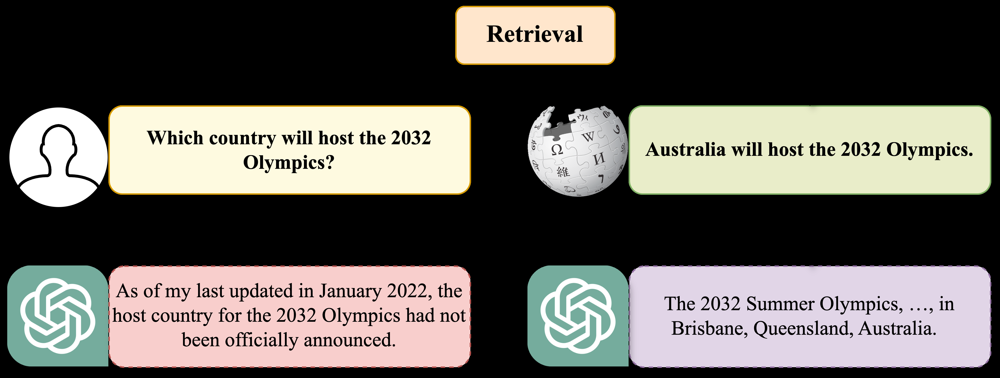
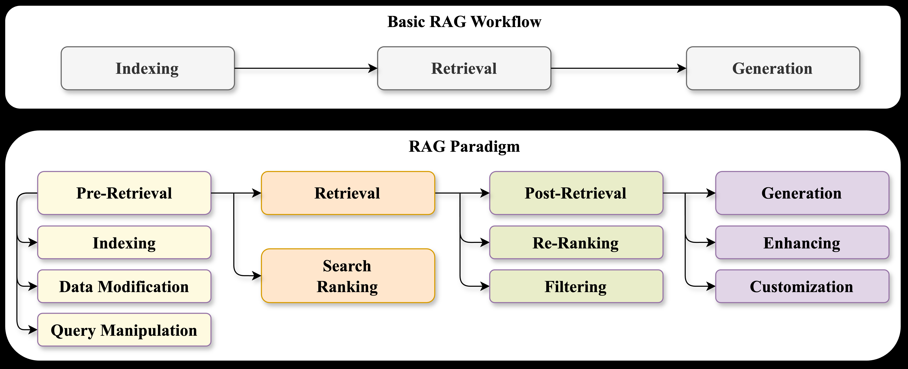
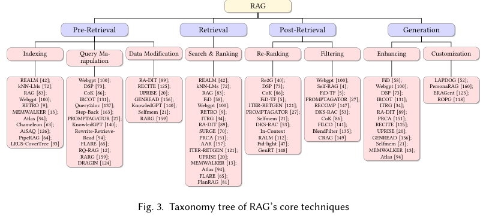
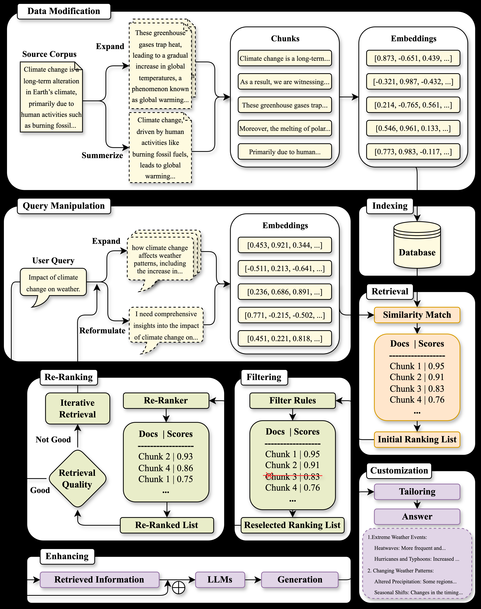
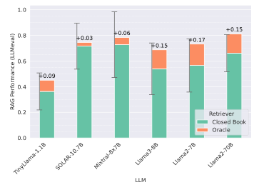
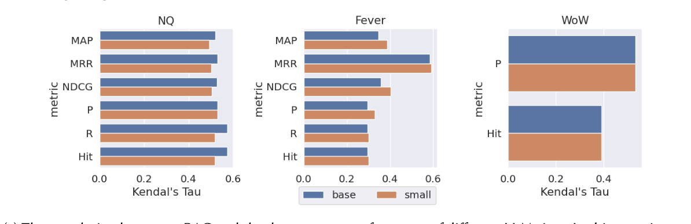

# 大型语言模型中检索增强文本生成综述

**（The Survey of Retrieval-Augmented Text Generation in Large Language Models）**

> 本文为 Yizheng Huang 与 Jimmy X. Huang 2024 年论文《The Survey of Retrieval-Augmented Text Generation in Large Language Models》（arXiv:2404.10981v2，37 页）的中文精确翻译。

**作者**：YIZHENG HUANG，JIMMY X. HUANG，约克大学（York University），加拿大

**联系方式**：Yizheng Huang, hyz@yorku.ca；Jimmy X. Huang, jhuang@yorku.ca，约克大学，加拿大多伦多，安大略省。

---

## 摘要

**检索增强生成（Retrieval-Augmented Generation，RAG）**将检索方法与深度学习进展相结合，通过实现外部最新信息的动态整合，来解决大型语言模型（large language models，LLM）的静态局限。这一主要聚焦于文本领域的方法，为 LLM 生成"看似合理但可能不正确"的回复这一问题提供了一种经济高效的解决方案，从而通过使用真实世界数据来提升其输出的准确性与可靠性。随着 RAG 的复杂度日益增加，并纳入多种可能影响其性能的概念，本文将 RAG 范式划分为四个类别：**预检索（pre-retrieval）、检索（retrieval）、后检索（post-retrieval）与生成（generation）**，从检索视角提供了细致的论述。本文概述了 RAG 的机制，并通过分析重要研究来讨论该领域的发展脉络。此外，本文还介绍了 RAG 的评估方法，阐述了所面临的挑战，并提出了未来的研究方向。通过提供一个有条理的框架与分类体系，本研究旨在整合现有的 RAG 研究、厘清其技术基础，并凸显其在拓宽 LLM 的适应性与应用范围方面的潜力。

**CCS 概念**：• 计算方法学 →自然语言生成；• 信息系统 →信息检索。

**附加关键词与短语**：检索增强生成（retrieval-augmented generation）、信息检索（information retrieval）、大型语言模型（large language model）

**ACM 引用格式**：
Yizheng Huang and Jimmy X. Huang. 2018. The Survey of Retrieval-Augmented Text Generation in Large Language Models. In *Proceedings of Make sure to enter the correct conference title from your rights confirmation email (Conference acronym 'XX)*. ACM, New York, NY, USA, 37 pages. https://doi.org/XXXXXXX.XXXXXXX

---

## 1 引言

ChatGPT 的出现凭借其交互能力与广泛应用，对学术界和工业界都产生了重大影响，使其成为一款领先的人工智能工具 [55, 60, 77]。ChatGPT 的核心是大型语言模型 GPT-4（详见 [1]），它在诸多前代模型的基础上进行了大量增强，在各类自然语言处理（Natural Language Processing，NLP）任务上展现出卓越的能力 [78]。尽管取得了这些进展，LLM 的应用也暴露了若干关键问题，这主要源于其对海量数据集的依赖。这种依赖限制了它们在训练后纳入新信息的能力，从而导致三大主要挑战。第一，为最大化可访问性与适用性而聚焦于宽泛、通用数据，导致其在专业领域的性能欠佳。第二，线上数据的快速产生，叠加数据标注与模型训练所需的大量资源，阻碍了 LLM 保持实时更新的能力。第三，LLM 容易生成令人信服却不准确的回复，即所谓的"幻觉"（hallucination），这可能误导用户。

解决这些挑战对于 LLM 在各个领域的有效应用至关重要。一个有前景的解决方案是集成 RAG 技术，它通过响应查询抓取外部数据来补充模型，从而确保输出更加准确且与时俱进。图 1 展示了 RAG 如何使 ChatGPT 能够在初始训练数据范围之外给出精确的答案。



自 Lewis 等人 [83] 于 2020 年提出 RAG 以来，RAG 取得了飞速发展，尤其随着 ChatGPT 等模型的兴起更是如此。尽管有这些进展，文献中对于 RAG 的底层机制以及后续研究所取得进展的全面分析仍存在明显缺口。此外，该领域还存在研究焦点碎片化、相似方法的术语不一致等问题，从而导致混乱。本综述旨在弥合这一缺口，通过对 RAG 进行结构化概述、对各种方法进行分类，并提供对当前研究图景的深入理解——鉴于文本应用在近期研究中的突出地位，本文将聚焦于文本应用。

为提供清晰性和结构，本文组织如下：第 2 节概述 RAG 的整体工作流程，将方法论划分为预检索、检索、后检索与生成四个阶段。第 3 至第 6 节探讨每个阶段的核心技术。第 7 节聚焦 RAG 的评估方法论。第 8 节总结所综述的研究，详述所使用的检索器与生成器；第 9 节讨论挑战与未来研究方向，并超越基于文本的研究扩展到多模态数据应用。第 10 节对全文进行总结。

其他相关综述从不同角度为不断演进的 RAG 图景提供了宝贵见解。Gao 等人 [38] 识别出 RAG 发展的三个关键阶段：预训练增强、推理与微调。Zhao 等人 [162] 聚焦于 RAG 的多样化应用，包括文本、代码、图像与视频生成，强调生成式任务中的增强智能（augmented intelligence）。同时，Hu 等人 [48] 探讨了检索增强语言模型（Retrieval-Augmented Language Models，RALM），考察检索器、语言模型与增强之间的交互如何影响模型架构与应用。

在本文中，我们旨在提供一个全面、统一的框架，从信息检索（information retrieval，IR）视角理解 RAG，识别关键挑战与改进空间。我们深入探讨驱动 RAG 的核心技术，评估它们在处理检索与生成任务方面的有效性。此外，本综述还介绍了 RAG 研究中所采用的评估方法，指出当前的局限，并提出有前景的未来探索方向。

---

## 2 RAG 框架

幻觉在很大程度上归因于 LLM 无法访问最新信息。这一局限源于模型对训练数据集的依赖。RAG 针对此问题提出了一种解决方案，即通过检索模型用外部来源的当前信息来补充 LLM 的训练数据，从而能够生成准确的回复。相对于 LLM 通常所需的昂贵训练与微调过程，RAG 提供了一种更经济高效的替代方案。它允许通过传统检索方法或预训练语言模型动态纳入新鲜信息，而无需将这些新数据直接集成到 LLM 中。这一特性使 RAG 既灵活又可扩展，便于其跨不同 LLM、面向各种用途进行应用。通过 RAG 检索到的信息来源于真实世界数据、由人类撰写，这不仅简化了生成过程，也提高了生成回复的可靠性。

Khandelwal 等人 [72] 的研究表明，从训练数据集本身访问相关信息即可显著提升 LLM 性能，凸显了 RAG 的有效性。随着时间推移，RAG 已从一种提供补充信息的手段，演进为支持检索与生成组件之间多次交互的方式。这涉及进行多轮检索以提升所检索信息的准确性，并迭代地改进生成输出的质量。诸如 LangChain¹ 和 LlamaIndex² 等工具包已将 RAG 方法模块化，增强了其适应性并扩大了应用范围。尽管这些工具包采用多种方法论来处理 RAG 的不同方面——从多次搜索迭代到迭代生成——它们都遵循基本的 RAG 工作流程。这种一致性对于理解其运作方式、以及找准进一步发展的机会至关重要。

> ¹ <https://www.langchain.com>
> ² <https://www.llamaindex.ai>

### 2.1 基本 RAG 工作流程

图 2 展示了统一的 RAG 核心概念与基本工作流程。RAG 的工作流程始于创建由外部来源构成的索引。该索引作为基础，供检索器模型基于特定查询检索相关信息。最后一步涉及生成器模型，它将检索到的信息与查询相结合以产生期望的输出。



#### 2.1.1 索引

高效检索始于全面的索引构建，其中数据准备是关键。这一阶段涉及文本规范化处理，如分词（tokenization）、词干提取（stemming）与停用词（stop words）去除，以提升文本对索引的适配性 [98]。随后，文本片段被组织为句子或段落，以促进更聚焦的搜索，从而能够精确定位包含相关关键词的片段。深度学习的引入通过使用预训练语言模型生成文本的语义向量表示，彻底改变了索引方式。这些向量被存储起来，从而能够从海量数据集合中进行快速、精确的检索，显著提升检索效率。

#### 2.1.2 检索

虽然诸如 BM25 算法 [44] 等传统检索方法侧重于词频与词项出现情况来进行文档排序，但它们往往忽视查询的语义信息。当前策略利用 BERT [29] 等预训练语言模型，它们能更有效地捕捉查询的语义本质。这些模型通过考虑同义词与短语结构来提升搜索准确性，从而通过检测语义相似度来优化文档排序。这通常通过测量文档与查询之间的向量距离来实现，将传统检索指标与语义理解相结合，从而产生既相关又符合用户意图的搜索结果。

#### 2.1.3 生成

生成阶段的任务是生成既与查询相关、又能反映所检索文档中信息的文本。常见方法是将查询与检索到的信息拼接起来，然后输入 LLM 进行文本生成 [85]。尽管确保生成文本与检索内容之间的一致性和准确性存在挑战，但在紧密遵循源材料与为输出注入创造性之间取得平衡也同样重要。生成的文本应准确传达检索文档中的信息、符合查询意图，同时还能灵活引入检索数据中并未明确包含的新见解或新视角。

### 2.2 RAG 范式

RAG 范式组织该领域内的研究，为提升 LLM 性能提供了一个简洁而稳健的框架。RAG 的核心在于其搜索机制，这对生成高质量结果至关重要。因此，从检索视角出发，该范式被划分为四个主要阶段：预检索、检索、后检索与生成。单跳（single-hop）与多跳（multi-hop）检索方法（包括迭代式的"检索-生成"循环）都遵循这一四阶段结构。图 3 是 RAG 核心技术的分类树。

#### 2.2.1 预检索

检索增强生成的预检索阶段为成功的数据与查询准备奠定基础，确保高效的信息检索。该阶段包括为有效数据访问做准备的必要任务。

**索引（Indexing）**。过程始于索引构建，它建立一个有组织的系统以实现快速、准确的信息检索。索引的细粒度取决于任务与数据类型。例如，句子级索引有利于问答系统精确地定位答案，而文档级索引更适用于文档摘要，以理解其主要概念与思想。

**查询操作（Query Manipulation）**。索引之后，进行查询操作以调整用户查询，使其与已索引数据更好地匹配。这包括查询重写（query reformulation）[61, 155]——改写查询以更贴近用户意图；查询扩展（query expansion）[51]——通过同义词或相关词项扩展查询以捕获更多相关结果；以及查询规范化（query normalization）——解决拼写或术语上的差异以实现一致的查询匹配。

**数据修改（Data Modification）**。数据修改对于提升检索效率也至关重要。该步骤包括预处理技术，如去除无关或冗余信息以提升结果质量，以及用元数据（metadata）等额外信息丰富数据，以提升检索内容的相关性与多样性 [6]。

#### 2.2.2 检索

**搜索与排序（Search & Ranking）**。检索阶段是搜索与排序的结合。它聚焦于从数据集中选择文档并确定其优先级，以提升生成模型输出的质量。该阶段采用搜索算法在已索引数据中导航，找出与用户查询匹配的文档。在识别出相关文档之后，对这些文档进行初步排序的过程随即开始，根据其与查询的相关性进行排序。

#### 2.2.3 后检索

后检索阶段用于精化初步检索到的文档，以提升文本生成的质量。该阶段由重排序与过滤组成，二者都旨在为最终生成任务优化文档选择。

**重排序（Re-Ranking）**。在重排序步骤中，对先前检索到的文档进行重新评估、打分与重组。其目标是更准确地突出与查询最相关的文档，并降低相关性较弱文档的重要性。该步骤涉及引入额外指标与外部知识来源以提升精度。在此背景下，由于候选文档集合有限，可以有效地采用精度更高但效率较低的预训练模型 [54]。

**过滤（Filtering）**。过滤旨在去除不满足特定质量或相关性标准的文档 [56, 74]。这可以通过多种方法实现，例如设定最低相关性分数阈值以排除低于某一相关性水平的文档。此外，利用用户反馈或先前的相关性评估有助于调整过滤过程，保证只有最相关的文档被保留用于文本生成。

#### 2.2.4 生成

生成阶段是 RAG 流程中的关键组成部分，负责利用检索到的信息来提升生成回复的质量。该阶段包含若干子步骤，旨在生成可读、引人入胜且信息丰富的内容。

**增强（Enhancing）**。生成阶段的核心是增强步骤，其目标是将检索到的信息与用户查询相融合，以创建连贯、相关的回复。这包括细化（elaboration）过程，即为检索内容补充额外细节以丰富其内容。其着力点在于通过改写（rephrasing）与重组（restructuring）等方法提升输出的清晰度、连贯性与风格吸引力，以改进输出质量。来自不同来源的信息被整合起来以提供全面的视角，并进行验证以确保内容的准确性与相关性。

**定制化（Customization）**。定制化以用户为中心。它以两种主要方式定制内容。第一，它将生成输出与先前阶段检索到的相关信息对齐，通过纳入关键知识来确保一致性与准确性。第二，它使内容适应用户特定因素，如目标受众、情境背景与个人偏好，将回复塑造成既与上下文相关又以用户为中心。这种在整合相关知识、适应多样化上下文需求方面的双重聚焦，构成了 RAG 中有效定制化的基础。



---

## 3 预检索

### 3.1 索引

传统信息检索系统中最常用的索引结构之一是**倒排索引（inverted index）**。该结构将文档与词语关联起来形成词汇表，使用户能够快速定位特定词语在文档集合中出现的位置。这里的词汇表指文档集合中出现的所有不重复词语的集合，而"引用"则包括词语出现的文档，以及该词语在这些文档中的位置与权重。然而，传统索引结构难以检索那些与用户查询语义相关、但并未包含精确查询词项的文档。

为弥补这一局限，使用深度学习模型生成的**稠密向量（dense vectors）**进行检索的方法已成为首选。这些向量（也称为嵌入，embeddings）捕捉词语与文档的语义含义，从而实现更灵活、准确的检索。基于稠密向量的索引方法可分为三大类：**图（graph）**、**乘积量化（Product Quantization，PQ）**[62] 与**局部敏感哈希（Locality-Sensitive Hashing，LSH）**[28]。由于用大型语言模型生成稠密向量需要大量资源，且待搜索的文档集合通常十分庞大，这些索引方法的核心策略都基于**近似最近邻搜索（Approximate Nearest Neighbor Search，ANNS）**[3]。该方法在略微降低搜索精度的代价下显著加快搜索过程。

**图**。使用图来构建索引是 RAG 中的常见做法。通过用图结构对向量进行索引，检索期间需要计算距离的节点范围可被限制在局部子图内，从而提升搜索速度。若干重要方法与工具已采用这种方法开发出来。例如，Khandelwal 等人提出的 **k-近邻语言模型 kNN-LMs** [72] 将 kNN 算法与预训练语言模型相结合。该方法采用由文本集合构建的数据存储（datastore）来动态检索上下文相关的示例，从而无需额外训练即可提升模型性能。**FAISS** [68] 是一款在诸多研究 [72, 73, 83] 中广泛采用的索引工具，它集成了**分层可导航小世界（Hierarchical Navigable Small World，HNSW）**近似 [97] 等增强技术以进一步加快检索 [83]。**WebGPT** [100] 展示了另一个实际应用，它利用 Bing API³ 基于真实用户搜索历史进行索引，展示了将真实世界用户数据集成到检索流程中的潜力。此外，**MEMWALKER** [13] 等其他方法引入了创新性做法以克服大型语言模型中上下文窗口大小等局限。它从输入文本构建记忆树，将文本分割为更小的片段，并将这些片段摘要为层级结构。而且，**LRUS-CoverTree** 方法 [93] 为 k-最大内积搜索（k-Maximum Inner-Product Search，k-MIPS）设计了另一种树结构，在索引构建时间显著更低的情况下取得可比的性能。这些技术促进了大规模信息的高效索引与管理，展示了基于图方法的多样性与有效性。

> ³ <https://www.microsoft.com/en-us/bing/apis/bing-web-search-api>

**乘积量化**。PQ 是处理大规模数据最具代表性的方法之一。它通过对向量进行分割、再对每一部分进行聚类以实现量化来加速搜索。与基于图的方法（通过减少用于距离计算的向量数量来加快搜索）不同，PQ 通过减少计算词距所花费的时间来实现更快搜索。PQ 在 RAG 中已涌现出多种实现，各自以不同方式改进其效率与可扩展性。**PipeRAG** [64] 在流水线并行（pipeline-parallelism）框架中集成 PQ，通过优化检索间隔来增强检索增强生成。**Chameleon** 系统 [63] 在解耦（disaggregated）加速器环境中利用 PQ，以平衡 RAG 任务中的内存使用与检索速度。**AiSAQ** [126] 引入一种全存储（all-in-storage）ANNS 方法，将 PQ 向量从 DRAM 卸载到存储中，在保持高召回率的同时大幅降低内存使用。它表明，即使在十亿级数据集上，内存使用也可被最小化到约 10 MB，而延迟仅略有增加，使其成为 RAG 系统高度可扩展的解决方案。

**局部敏感哈希**。LSH 的核心思想是以高概率将相似向量放入同一个哈希桶。LSH 使用哈希函数将相似向量映射到相同或相近的哈希值，从而更容易找到近似最近邻。在 LSH 中，当一个查询向量被哈希时，系统会快速检索出共享相同哈希值的候选向量。该方法降低了问题的维度，且可实现高效计算，但哈希过程本身可能引入一些不准确。尽管与基于图和 PQ 的方法相比，LSH 在 RAG 系统中较少使用，但在速度优先于轻微精度损失的场景下，它仍提供了一种有用的方法。

### 3.2 查询操作

查询操作对于提升现代 IR 系统的有效性与准确性至关重要。通过精化用户的原始查询，它解决了查询与目标文档之间措辞模糊与词汇不匹配等挑战。这一过程不仅仅是将词语替换为同义词；它需要深入理解用户意图与查询的上下文，尤其在 RAG 等复杂任务中更是如此。有效的查询操作可显著提升检索性能，进而对生成输出的质量产生重大影响。查询操作的三种主要方法是查询扩展、查询重写与基于提示的重写。

**查询扩展（Query Expansion）**。查询扩展涉及用与查询词项相关或同义的额外词项或短语来扩充原始查询。在 LLM 的语境下，查询扩展可以更加精细，利用模型广博的知识来生成上下文相关的扩展。该技术旨在通过确保检索过程捕获更广泛的相关文档、容纳不同的术语或表达方式来提升召回率。同义词扩展、语义相似度或利用外部知识库等技术常用于查询扩展。例如，**FiD** [58] 中描述的方法通过使用稀疏与稠密两种检索技术检索更广范围的段落来扩展查询，使模型能够聚合来自多个来源的证据，从而提升生成答案的准确性与鲁棒性。**Query2doc** [137] 展示了更高级的查询扩展形式，其中由 LLM 生成的伪文档（pseudo-documents）增强原始查询，有效弥合了用户输入与语料信息之间的鸿沟，对稀疏与稠密检索系统都有益处。类似地，**KnowledGPT** [140] 通过利用外部知识库拓宽了检索过程中所访问信息的范围，进一步精化检索过程。**RARG** [159] 框架采用证据驱动的查询扩展方法，纳入广泛的支持文档来生成有据可依且准确的反虚假信息（counter-misinformation）回复。

**查询重写（Query Reformulation）**。查询重写涉及改写或重组原始查询以增强其有效性。这可能包括使措辞更具体、去除含糊词项，或调整句法以更好地契合检索系统的要求。借助 LLM，查询重写可以通过理解用户意图与上下文动态驱动，从而实现更精确的修改，带来更好的检索结果。这一重写过程还可以依据过往查询或用户交互进行调整，使查询更适配特定的检索任务。例如，**RQ-RAG** [12] 模型代表了查询重写的高级形式，通过改写、分解与消歧查询，在需要处理复杂查询的场景中尤为有效。该方法确保精化后的查询能更好地匹配所需上下文，提升检索信息的相关性。**Rewrite-Retrieve-Read** 框架 [94] 调整原始查询以优化检索过程，使系统能够更有效地利用检索数据来生成准确回复。此外，**FLARE** [65] 通过其主动检索增强生成方法体现了查询重写，该方法基于检索与生成之间的反馈循环迭代精化查询，从而提升检索信息的准确性与相关性。

**基于提示的重写（Prompt-based Rewriting）**。基于提示的重写，尤其在 LLM 的语境下，代表了一种创新方法，即将原始查询嵌入一个更大的提示或上下文中，以引导 LLM 的回复。该技术利用模型在特定上下文中理解和生成语言的能力，有效地改写查询以与期望输出对齐。在检索过程被集成到生成式工作流程中的场景下，基于提示的重写尤为强大，使系统能够将查询适配到检索与生成的各个阶段。该方法还可能涉及随交互而演进的动态提示，进一步精化检索过程。例如，**Step-Back** [163] 通过精心设计的提示精化查询上下文，引导 LLM 的推理过程，确保输出更符合用户意图，尤其在复杂推理任务中。**CoK** [86] 方法聚焦于动态适配知识来源，并使用提示改写查询被解释时所处的上下文。该方法利用基于提示的重写，使 LLM 能够基于各种异构知识来源有效地整合并锚定其回复。此外，**Promptagator** [27] 讨论了使用基于提示的技术来适配和改写查询，使其更好地契合检索系统的预期，尤其在少样本学习场景中。这些提示引导模型生成或精化查询，以优化检索结果。

### 3.3 数据修改

文档修改技术在提升检索性能方面发挥关键作用，尤其在与 LLM 结合时。这些技术可大致分为**内部数据增强（Internal Data Augmentation）**与**外部数据丰富（External Data Enrichment）**。内部数据增强聚焦于最大化文档或模型内已有信息的价值，而外部数据丰富则引入来自外部来源的补充数据，以填补缺口、提供额外上下文或拓宽内容范围。

**内部数据增强**。内部数据增强利用文档中已有的信息，或挖掘 LLM 中内嵌的知识。改写（paraphrasing，即重写内容以提升可读性或提供多重视角）与摘要（summarization，即在保留核心内容的同时压缩信息）等技术被普遍采用。其他方法涉及在不引入外部数据的情况下，生成与上下文相关的补充内容或解释。例如，**RECITE** [125] 利用模型的内部记忆在生成回复之前背诵（recite）相关信息，从而在闭卷问答等任务中提升性能，而无需外部数据。**KnowledGPT** [140] 类似地精化 LLM 内嵌的内部知识，优化其在生成过程中的使用。**GENREAD** [156] 进一步展示了如何利用 LLM 中已有的知识来生成提升任务性能的上下文，从而绕过对外部来源的需求。在另一个示例中，**Selfmem** [21] 框架允许模型在后续生成任务中迭代地将其自身输出作为记忆。通过选择并利用最佳内部输出作为记忆，该方法在不依赖外部记忆资源的情况下提升了模型性能。

**外部数据丰富**。外部数据丰富通过纳入来自外部来源的新信息来增强文档内容，丰富整体上下文与准确性。该过程可涉及整合来自外部数据集或知识库的事实、数据或上下文知识。例如，**RA-DIT** [89] 在微调期间利用 Wikipedia 和 CommonCrawl 等大型数据集来增强输入提示，提升模型在知识密集型任务上的能力。其双指令微调（dual instruction tuning）技术同时优化语言模型与检索器，以更有效地纳入检索信息。**UPRISE** [20] 展示了在推理期间通过丰富上下文，从多样化任务数据集中检索提示来提升模型在零样本场景下的泛化能力。此外，**RARG** [159] 通过整合来自学术数据库的科学证据以强化反虚假信息的回复，体现了外部数据丰富。该方法涉及一个两阶段检索流水线，识别并排序相关文档，然后用这些文档来支撑并提升生成回复的事实准确性。

---

## 4 检索

### 4.1 搜索与排序

RAG 中的搜索与排序过程对于提升生成输出的相关性与准确性至关重要。已发展出多种方法论来精化这一过程，每种方法都为增强检索与排序贡献了独特策略。例如，**Atlas** [59] 与 **AAR** [157] 都旨在提升检索文档的相关性，但它们应对这一挑战的方式不同。Atlas 聚焦于优化检索器选择上下文相关文档的能力，尤其是在数据有限的新领域，通过采用**注意力蒸馏（Attention Distillation）**与**困惑度蒸馏（Perplexity Distillation）**等少样本学习技术。而 AAR 则使检索偏好适应 LLM 的要求，通过训练一个较小的源模型来增强检索在不同任务间的泛化能力。

此外，**IRCOT** [131] 与 **FLARE** [65] 在检索过程中引入了动态交互，尽管目标各异。IRCOT 将检索与思维链（chain-of-thought，CoT）推理相结合，交织这两个过程以确保每个检索步骤都支持正在进行的推理任务。相比之下，FLARE 采用基于置信度的主动检索机制，在模型生成低置信度 token 时动态触发检索。该方法在模型置信度变化的场景中尤为有用，因为它允许系统在生成过程中抓取额外信息以解决不确定性。

在应对领域特定的检索挑战时，**SURGE** [70] 与 **PRCA** [151] 提供了不同的解决方案。SURGE 使用子图检索器从知识图谱中提取相关子图，将结构化数据纳入检索过程，以提升对生成回复的上下文理解。知识图谱的关系结构使检索更准确、更有依据。相比之下，PRCA 聚焦于领域特定的抽取式摘要，采用奖励驱动的方法精化检索内容。该策略旨在为生成器优化内容，尤其在生成器充当黑盒的场景中，从而增强检索与生成之间的对齐。

**MEMWALKER** [13] 呈现了一种处理长上下文问答的独特方法，它在记忆树结构中融入内部搜索与排序机制。该方法在庞大的记忆存储中导航，确保为复杂查询检索并使用最相关的信息。与其他方法不同，MEMWALKER 强调通过迭代导航与摘要来高效处理长文本，而非仅仅优化初始检索阶段。



### 4.2 检索策略

RAG 中的检索策略对于将检索过程定制到特定应用需求至关重要，每种策略都提供独特的优势并应对特定的挑战。在 RAG 中，涉及的更多是检索技术的运用而非检索算法的探索，因此在搜索与排序中通常考虑的是检索策略。虽然基本 RAG 通常采用单跳搜索（即仅检索一次、作为生成的补充材料），但如今的 RAG 大多采用多跳搜索（即通过不同的搜索策略多次搜索，直到满足要求）。在实际应用中，这些策略属于工程流水线上的设计。图 4 展示了具有迭代检索策略的 RAG 框架的典型案例。RAG 中有五种主要检索策略：

**基本检索策略（Basic Retrieval Strategy）**。基本检索策略通常遵循线性工作流程，顺序经过预检索、检索、后检索与生成阶段。**Atlas** [94] 框架体现了这种直接的方法，从始至终高效引导检索过程，而无需迭代或复杂的条件性修改。**REPLUG** [122] 同样遵循这一基本策略，以简单方式为黑盒语言模型增添检索，其中检索到的信息被直接用于增强生成过程。

**迭代检索策略（Iterative Retrieval Strategy）**。对于更复杂的场景，采用迭代检索策略（算法 1），即在多个步骤中检索信息，每一步都由先前结果所引导。**IRCOT** [131] 通过将检索与思维链推理相结合体现了这一点，其中检索过程是顺序性的，并与推理步骤紧密关联。该方法在需要多步求解的场景中尤为有效，例如研究辅助或受益于详细探索的复杂查询。**ITER-RETGEN** [121] 也采用迭代检索，基于生成的回复精化过程，从而实现持续改进并使检索与生成更紧密地对齐。**RQ-RAG** [12] 通过使用查询改写、分解与消歧等技术推进了该方法，逐步精化检索以增强最终输出。**PlanRAG** [81] 也属于这一策略，它基于生成内容与反馈迭代精化检索过程，确保每一步都比上一步更有依据。

**递归检索策略（Recursive Retrieval Strategy）**。递归检索（算法 2）涉及可调用自身的检索，从而创建一个检索的层级或树。该方法通过将复杂查询分解为更简单的子查询，有效处理层级化或分层化的信息。它对于层级数据探索、知识库构建以及详细信息检索尤为有用。**SURGE** [70] 通过知识图谱利用这一策略，提取相关子图以增强上下文理解。知识图谱的关系结构有助于在多层信息间导航，确保检索准确且上下文相关。**MEMWALKER** [13] 类似地采用递归方法，通过构建摘要的记忆树来处理长文本。系统在该树中导航以检索相关信息，将复杂查询有效分解为可管理的片段，这在处理长上下文问答时尤为有用。**IMRAG** [150] 引入多轮检索机制，其中每一轮检索都基于模型的内部独白（monologue），随每次迭代逐步精化搜索。**Selfmem** [21] 采用自记忆模块，使系统能够递归地存储与检索信息，以层级方式在先前检索知识的基础上构建。这种递归策略增强了系统在多次检索迭代中管理与整合海量信息的能力。

**条件检索策略（Conditional Retrieval Strategy）**。条件检索策略（算法 3）由特定条件或规则所支配，这些条件或规则可能是预先定义的，也可能在过程中动态确定。该方法确保检索符合特定约束或标准，从而增强相关性与特异性。它对于合规检查、基于规则的推荐系统以及上下文敏感的信息检索尤为有用。**PRCA** [151] 是一个典型示例，其检索策略根据奖励驱动的调整而适配，精化大型语言模型所用的上下文以增强精度与相关性。**RARG** [159] 同样强调基于特定证据条件的检索，确保检索过程符合预定义要求，这对于生成事实性且得体的回复至关重要。**CRAG** [149] 通过引入一个检索评估器为该方法增添了另一层，该评估器评估检索文档的质量，并根据置信度阈值触发不同动作，确保只有最相关、最准确的信息被用于生成过程。

**自适应检索策略（Adaptive Retrieval Strategy）**。自适应检索（算法 4）根据查询的上下文与性质、或迄今检索到的数据，动态调整检索策略。这种高度灵活的方法即时定制检索方法，以优化相关性与精度，使其成为个性化搜索引擎、自适应学习系统与实时决策支持的理想之选。**AAR** [157] 通过根据 LLM 的偏好调整其策略、从小型源模型学习并泛化到未见任务，体现了自适应检索。**FLARE** [65] 采取类似的自适应方法，但聚焦于在模型置信度低时动态抓取额外信息，从而提升生成回复的相关性。**SelfRAG** [4] 更进一步，融入自反思过程，其中检索策略基于对生成内容的批评而演进。另一方面，**CoK** [86] 实现了一种动态机制，根据任务不断演进的需求调整检索策略。CoK 中的检索过程并非静态，而是根据具体场景与所访问信息的性质进行适配，使其在上下文敏感应用中非常有效。**DRAGIN** [124] 讨论了实时动态检索机制，它适应语言模型不断演进的需求，确保检索策略保持响应性并与即时任务需求对齐，从而优化所检索信息的相关性与精度。

总之，RAG 中检索策略的选择取决于具体应用的需求。基本检索策略简单高效；迭代检索非常适合需要详细探索与精化的任务；递归检索擅长管理层级化信息；自适应检索在动态环境中提供灵活性；条件检索确保严格遵守预定义标准，使其在合规与特定约束至关重要的应用中不可或缺。通过审慎地选择与组合这些策略，可以定制 RAG 系统以有效处理广泛的信息检索场景，利用每种方法的优势来产出稳健而精确的结果。

---

### 算法 1 RAG 中的迭代检索策略

**输入**：查询 𝑞，文档 𝐷，最大迭代次数 𝑁，检索器 𝑅，生成器 𝐺，预检索函数 𝐹_pre，后检索函数 𝐹_post

**输出**：最终输出 𝑦_final

```
 1:  初始化 𝑖 ← 1                              // 启动迭代计数器
 2:  while 𝑖 ≤ 𝑁 do
 3:      预检索阶段
 4:          𝑞′ ← 𝐹_pre(𝑞)                     // 索引、查询操作、数据修改
 5:      检索阶段
 6:          𝐷_𝑖 ← 𝑅(𝑞′, 𝐷)                    // 文档的搜索与初步排序
 7:      后检索阶段
 8:          𝐷′_𝑖 ← 𝐹_post(𝑞′, 𝐷_𝑖)            // 重排序与过滤以精化文档
 9:      生成阶段
10:          𝑦_𝑖 ← 𝐺(𝑞′, 𝐷′_𝑖)                 // 基于精化后的文档生成输出
11:      if 基于 𝑦_𝑖 满足停止条件 then
12:          BREAK                               // 若输出令人满意则停止迭代
13:      end if
14:      更新 𝑞′ ← UpdateQuery(𝑞, 𝑦_𝑖)          // 基于生成输出精化查询
15:      𝑖 ← 𝑖 + 1                              // 迭代计数器递增
16:  end while
17:  最终综合
18:  𝑦_final ← SynthesizeResults({𝑦₁, 𝑦₂, … , 𝑦_𝑖})   // 合并结果
19:  return 𝑦_final
```

### 算法 2 RAG 中的递归检索策略

**输入**：初始查询 𝑞，文档 𝐷，最大深度 𝐿，检索器 𝑅，生成器 𝐺，预检索函数 𝐹_pre，后检索函数 𝐹_post，子查询生成函数 𝐹_subq，层级构建函数 𝐹_build，层级信息操作函数 𝐹_hier

**输出**：最终输出 𝑦_final

```
 1:  构建层级（预检索）
 2:      Hierarchy ← 𝐹_build(𝑞)                // 基于初始查询构建层级
 3:  初始化 𝑙 ← 0                               // 深度计数器从 0 开始
 4:  初始化 Sub_queries ← [𝑞]                   // 初始化子查询列表
 5:  while 𝑙 ≤ 𝐿 do
 6:      for each 𝑞′_𝑙 ∈ Sub_queries do
 7:          预检索阶段
 8:              𝑞′_𝑙 ← 𝐹_hier(Hierarchy, 𝑞′_𝑙) // 基于层级调整查询
 9:              𝑞′_𝑙 ← 𝐹_pre(𝑞′_𝑙)            // 查询操作、索引与数据修改
10:          检索阶段
11:              𝐷_𝑙 ← 𝑅(𝑞′_𝑙, 𝐷)              // 为当前子查询检索文档
12:          后检索阶段
13:              𝐷′_𝑙 ← 𝐹_post(𝑞′_𝑙, 𝐷_𝑙)      // 重排序与过滤以精化文档
14:          生成阶段
15:              𝑦_𝑙 ← 𝐺(𝑞′_𝑙, 𝐷′_𝑙)           // 基于精化后的文档生成输出
16:          子查询生成（如需要）
17:          if 基于 𝑦_𝑙 需要进一步精化 then
18:              Sub_queries ← 𝐹_subq(𝑦_𝑙)      // 基于当前输出生成新子查询
19:          end if
20:      end for
21:      𝑙 ← 𝑙 + 1                              // 深度计数器递增
22:  end while
23:  最终综合
24:  𝑦_final ← SynthesizeResults({𝑦₀, 𝑦₁, … , 𝑦_𝑙})   // 合并结果
25:  return 𝑦_final
```

### 算法 3 RAG 中的条件检索策略

**输入**：查询 𝑞，文档 𝐷，最大迭代次数 𝑁，检索器 𝑅，生成器 𝐺，预检索函数 𝐹_pre，后检索函数 𝐹_post，条件评估函数 𝐹_cond

**输出**：最终输出 𝑦_final

```
 1:  初始化 𝑖 ← 1                              // 启动迭代计数器
 2:  𝑞′ ← 𝑞                                    // 初始化查询
 3:  while 𝑖 ≤ 𝑁 do
 4:      预检索阶段
 5:          𝑞′ ← 𝐹_pre(𝑞′)                    // 执行查询操作与数据修改
 6:      检索阶段
 7:          𝐷_𝑖 ← 𝑅(𝑞′, 𝐷)                    // 基于当前查询检索文档
 8:      后检索阶段
 9:          𝐷′_𝑖 ← 𝐹_post(𝑞′, 𝐷_𝑖)            // 基于条件对文档重排序与过滤
10:      生成阶段
11:          𝑦_𝑖 ← 𝐺(𝑞′, 𝐷′_𝑖)                 // 使用精化后的文档生成输出
12:      条件分支
13:      if 𝐹_cond(𝑦_𝑖, 𝐷′_𝑖) 为条件 A then
14:          应用策略 A                          // 例如，基于反馈精化查询
15:      else if 𝐹_cond(𝑦_𝑖, 𝐷′_𝑖) 为条件 B then
16:          应用策略 B                          // 例如，扩展范围或调整参数
17:      else if 𝐹_cond(𝑦_𝑖, 𝐷′_𝑖) 为条件 C then
18:          应用策略 C                          // 例如，修改检索策略或输出处理
19:      else
20:          不作更改继续                        // 若无条件满足，则不调整继续执行
21:      end if
22:      检查终止条件
23:      if 𝐹_cond(𝑦_𝑖, 𝐷′_𝑖) 满足停止标准 then
24:          BREAK                               // 若满足停止条件则退出循环
25:      end if
26:      𝑖 ← 𝑖 + 1                              // 迭代计数器递增
27:  end while
28:  最终综合
29:  𝑦_final ← SynthesizeResults({𝑦₁, 𝑦₂, … , 𝑦_𝑖})   // 合并结果
30:  return 𝑦_final
```

### 算法 4 RAG 中的自适应检索策略

**输入**：查询 𝑞，文档 𝐷，最大迭代次数 𝑁，检索器 𝑅，生成器 𝐺，预检索函数 𝐹_pre，后检索函数 𝐹_post，自适应调整函数 𝐹_adapt，反馈函数 𝐹_feedback

**输出**：最终输出 𝑦_final

```
 1:  初始化 𝑖 ← 1                              // 启动迭代计数器
 2:  𝑞′, Context ← 𝑞, ∅                        // 初始化查询与上下文
 3:  while 𝑖 ≤ 𝑁 do
 4:      预检索阶段
 5:          𝑞′, Context ← 𝐹_pre(𝑞′, Context)  // 查询操作、索引、数据修改与上下文设置
 6:      动态检索阶段
 7:          𝐷_𝑖 ← 𝑅(𝑞′, 𝐷, Context)          // 基于当前查询与上下文检索文档
 8:      自适应后检索阶段
 9:          𝐷′_𝑖 ← 𝐹_post(𝑞′, 𝐷_𝑖, Context)  // 基于自适应标准重排序与过滤
10:      生成阶段
11:          𝑦_𝑖 ← 𝐺(𝑞′, 𝐷′_𝑖, Context)       // 使用精化后的文档生成输出
12:      自适应调整
13:      if 𝐹_feedback(𝑦_𝑖, 𝐷′_𝑖) 为负面 then
14:          𝑞′, Context ← 𝐹_adapt(𝑞′, Context, 𝑦_𝑖, 𝐷′_𝑖)  // 动态调整查询与上下文
15:      end if
16:      反馈整合
17:      if 𝐹_feedback(𝑦_𝑖) 为正面 then
18:          BREAK                               // 若输出令人满意则停止迭代
19:      end if
20:      𝑖 ← 𝑖 + 1                              // 迭代计数器递增
21:  end while
22:  最终综合
23:  𝑦_final ← SynthesizeResults({𝑦₁, 𝑦₂, … , 𝑦_𝑖})   // 合并结果
24:  return 𝑦_final
```

---

## 5 后检索

### 5.1 重排序

由于检索机制通常会返回大量潜在相关文档，因此采用重排序方法对这些文档重新排序，优先考虑那些最有可能对最终输出做出有意义贡献的文档。通过利用包括无监督技术、监督学习与数据增强在内的多种策略，重排序旨在优化检索内容与期望回复之间的对齐，从而提升 RAG 系统的整体有效性 [165]。

**无监督重排序（Unsupervised Re-ranking）**。无监督重排序器不依赖标注数据进行训练。它们使用逐点（pointwise）、列表式（listwise）或成对（pairwise）等方法，基于 LLM 输出来排序文档，而无需监督式微调。例如，**In-Context RALM** [112] 采用零样本方法，使用现成的语言模型对由 BM25 检索器检索出的 top-k 文档进行重排序。该过程涉及选择使生成文本似然最大化的文档，从而有效利用 LM 的语义理解来提升文档相关性，而无需额外的监督训练。该论文还探索了使用自监督学习训练专用重排序器，以进一步增强相关文档的选择，表明用领域特定数据训练重排序器可能比零样本重排序更有效。

**监督重排序（Supervised Re-ranking）**。监督重排序器涉及在特定排序数据集上微调 LLM。这一类别可进一步细分为：BERT 类模型（处理查询-文档对以计算相关性分数）、T5 类模型（将排序视为生成任务并使用生成的 token 来确定相关性）、以及 RankLLaMA [95] 类模型（采用基于提示的方法，聚焦于最后一个 token 的表示来计算相关性）[165]。例如，**Re2G** [40] 中的重排序器基于一个在标注数据（如 MS MARCO）上训练的 BERT 模型，并被微调以改进检索文档的相关性排序。**FiD-Light** [47] 采用监督方法，模型在特定数据集上微调，以学习如何在自回归文本生成过程中使用源指针（source pointers）有效地重排序段落。该模型使用列表式自回归重排序机制，经训练后基于文本生成过程中产生的输出来识别并重排序相关段落。**GenRT** [148] 结合编码器（捕获全局列表级特征）与顺序解码器（基于相关性重排文档）。该模型通过监督学习、以标注的相关性数据为引导来学习相关性分数，确保最相关的文档在最终重排序列表中被优先考虑。此外，**ITER-RETGEN** [121] 提出使用能力更强的重排序器（可访问模型生成结果），将知识蒸馏到稠密检索器中。该知识蒸馏过程优化稠密检索器的查询编码器，使其能更好地捕捉文档相对于任务输入的语义相关性。

**面向重排序的数据增强（Data Augmentation for Re-ranking）**。面向重排序器的数据增强聚焦于通过使用 LLM 生成额外训练数据（如伪相关性标签，pseudo-relevance labels）来增强训练过程。这种数据增强提供了更多样化的训练示例，有助于提升重排序模型的性能。例如，**DKS-RAC** [53] 引入了**稠密知识相似度（Dense Knowledge Similarity，DKS）**与**检索器即答案分类器（Retriever as Answer Classifier，RAC）**等方法，聚焦于通过纳入丰富的答案编码来改进检索过程。这些方法涉及生成额外训练信号或利用丰富的数据表示来改进文档的检索与排序。此外，**PROMPTAGATOR** [27] 框架利用基于 LLM 的查询生成所产生的合成数据来增强重排序器的训练。这种数据增强方法使重排序器能够更有效地精化候选段落，使用在这些额外示例上训练的交叉注意力模型来提升检索精度。

### 5.2 过滤

过滤与重排序是 RAG 系统后检索阶段中两个不同的过程。过滤聚焦于从检索到的集合中剔除无关或低质量文档，从而减小文档集合规模并提升后续处理的效率与有效性。相比之下，重排序则基于文档对任务的相关性或效用对剩余文档进行排序，通常优先考虑那些能提升生成输出质量的文档，尤其在响应感知（response-aware）的场景中。

已发展出多种过滤方法来精化 RAG 系统中的文档集合，每种方法机制独特，但都共享提升相关性与降低计算负载的共同目标。**Self-RAG** [4] 采用自反思机制，利用模型生成的专门"反思 token"（reflection tokens）来评估检索段落以及模型自身生成输出的相关性与质量。这种自反思确保只有最相关的文档被保留，在推理期间利用模型的内部能力而无需依赖外部模型。类似地，**BlendFilter** [135] 将 LLM 本身用作过滤器，通过对来自原始查询、外部增强查询与内部增强查询的知识分别应用过滤，来评估并移除无关或效用较低的文档。Self-RAG 与 BlendFilter 都凸显了模型执行过滤的内在能力，减少了对额外模型的需求并提升了计算效率。

相比之下，**RECOMP** [147] 与 **CRAG** [149] 采用更偏外部或结构化的策略。RECOMP 聚焦于选择性增强，其中从检索文档生成的摘要被选择性地前置到语言模型的输入之前。若检索文档被认为无关，压缩器可生成空摘要，从而有效过滤掉不必要的信息。该方法允许动态过滤，仅保留有用的内容。另一方面，CRAG 使用"先分解后重组"（decompose-then-recompose）的方法，将检索文档拆分为更细的知识条带。这些条带使用微调后的 T5 模型评估相关性，仅将相关条带重组为精化的信息集合，供生成任务使用。这种细粒度过滤过程确保最终文档集合既相关又简洁，专门针对生成任务定制。

动态过滤技术也被用于 **FiD-TF** [5] 与 **CoK** [86] 等方法中。FiD-TF 在解码过程中引入 token 过滤（Token Filtering），基于交叉注意力分数动态过滤掉相关性较低的 token。该方法通过剔除被认为对生成最终答案无信息量的 token 来降低计算负载，在对性能影响最小的情况下提升效率。CoK 采用基于自一致性（self-consistency）的过滤技术，仅识别并处理那些答案"不确定"的问题。该方法通过采样多条推理路径与答案来运作，仅保留高一致性的预测。未达到指定一致性阈值的问题则进入进一步处理，从而有效防止生成过程中的错误传播。

最后，**FILCO** [141] 使用三种不同策略实现全面的过滤：字符串包含（String Inclusion，STRINC）以匹配精确输出、词法重叠（Lexical Overlap）以衡量词级相似度、以及条件交叉互信息（Conditional Cross-Mutual Information，CXMI）以评估上下文在多大程度上提升了输出似然。FILCO 在句子级别应用这些过滤策略，精化检索内容以获得更好的相关性。此外，FILCO 使用这些策略训练上下文过滤模型，在推理时预测最有用的上下文，从而提升生成模型输出的准确性与相关性。

---

## 6 生成

### 6.1 增强

增强方法是通过以各种方式整合检索内容来提升生成输出质量与相关性的策略。这些方法在组合、聚合或精化检索信息的方式上有所不同，提供了多种丰富最终输出的途径。大致而言，这些技术可分为三类：利用查询增强、利用集成（ensemble）方法增强、以及利用反馈循环增强。

**利用查询增强（Enhance with Query）**。该方法将检索文档与原始查询整合，使生成器能够利用这两个来源来产出最终输出。通过将查询与检索内容相结合，生成过程确保回复与用户意图保持紧密一致，同时被相关信息所丰富。这里的重点是查询与上下文的无缝融合，使生成输出既能保持相关性又能保持完整性。例如，**RETRO** [9] 模型通过使用分块交叉注意力（chunked cross-attention）机制将检索到的文本块与用户查询整合来增强生成，其中来自检索邻居的相关信息被直接注入生成过程。该方法首先基于查询检索相似文档块，然后在生成期间使用交叉注意力模块将这些块与输入序列对齐并组合。**In-Context RALM** [112] 采用类似方法，直接将检索文档前置到输入查询之前。这样，语言模型可以同时以查询和检索内容为条件生成回复，而无需改变模型架构。这两个示例都说明了一种简单而有效的方法：将查询与检索文档拼接成单一输入序列，由 LLM 一并处理，产出上下文增强的输出。

**利用集成增强（Enhance with Ensemble）**。当多个来源被综合时，生成过程可以实现更连贯、更全面的回复。该方法不依赖单一来源，而是聚合来自不同文档的信息，使生成器能够调和相互矛盾的细节、融合不同视角，并选择最可靠或最全面的输出。集成过程可以以不同方式体现：可能涉及将来自若干来源的见解组合成统一叙述，或生成多个候选输出并根据一致性、相关性或事实准确性等标准选择最佳者。该策略的一个实例见于 **FiD** [58]，它独立编码多个检索段落，然后在解码器中融合它们以创建连贯答案。通过在编码期间分别处理每个段落、再在解码期间合并它们，模型有效地组合了来自多个来源的证据。同时，在 **REPLUG** [122] 中采用集成方法，将每个检索文档独立前置到查询之前并分别处理。随后对输出进行聚合，用相关性分数引导每个文档贡献的加权。通过该过程，模型利用了来自多个来源的多样化信息，随着可用数据的增多，带来答案准确性、覆盖范围与可扩展性的提升。

**利用反馈增强（Enhance with Feedback）**。与单遍处理检索信息的方法相比，该方法通过纳入反馈循环将迭代精化引入生成过程。最初，生成器产出草稿回复，然后基于反馈机制（如自反思或聚焦于事实准确性与流畅性的预定义标准）对其进行评估与调整。这种迭代方法旨在通过识别并纠正错误、或微调内容以更好地契合质量标准来逐步改进输出，最终产出精炼而可靠的回复。**PRCA** [151] 提供了一个示例，它定位于检索器与生成器之间，基于来自生成器的反馈来提炼检索信息。这些提炼后的信息充当奖励模型以引导上下文优化，利用强化学习以及 ROUGE-L 分数等指标来迭代精化哪些细节应被强调或淡化。另一方面，**DSP** [73] 通过纳入程序化自举（programmatically bootstrapped）反馈的多跳检索过程，同时精化查询与检索段落。在此，语言模型生成中间查询、检索相关段落，并在后续步骤中更新上下文——每一阶段都基于前一阶段以精化最终输出。反馈驱动的增强也见于 **Selfmem** [21] 等模型，它们聚焦于生成自记忆。模型首先产出无界的输出池，然后在 BLEU 或 ROUGE 等指标引导下选择最相关的一个作为下一轮生成的记忆。最后，**RECITE** [122] 通过从模型内部知识生成多个背诵并利用自一致性技术聚合输出，将反馈整合进来。通过在背诵中引入多样性并在生成期间利用段落提示（passage hints），该方法通过多数投票选择最佳内容。这些方法共同展示了反馈循环与迭代精化如何带来不仅更准确、而且在演进过程中日益连贯且上下文扎根的输出。

### 6.2 定制化

定制化聚焦于使内容契合用户的个性与需求。它涉及调整输出，要么与早期阶段检索到的特定知识对齐（内容对齐，content alignment），要么使生成的回复适应用户的偏好、上下文或受众需求（情境适配，contextual adaptation）。

在 **LAPDOG** [52] 中，定制化主要通过内容对齐实现，即整合人物画像（persona profiles）与外部故事来丰富用于生成的上下文。故事检索器基于人物画像识别相关叙事，用额外信息扩充有限的画像。随后生成器将这些丰富后的知识与对话历史相结合，确保回复与画像的特征和背景紧密对齐。该方法允许对用户个性进行细致入微的理解，使输出更具吸引力且更契合上下文。

另一方面，**PersonaRAG** [160] 强调实时适配，基于动态用户画像、会话行为与持续反馈来定制生成内容。一个多智能体系统持续分析用户交互以精化回复，确保与用户偏好和上下文对齐。通过在每一步整合个性化洞察，系统可以调整其输出以适应特定的信息需求与情境上下文。这种级别的响应性使系统能够随用户不断变化的需求而演进，产生更相关、更有针对性的回复。

**ERAGent** [123] 也聚焦于定制化，但通过使用个性化 LLM 阅读器（Personalized LLM Reader）实现，它利用用户特定画像来适配回复。该模块整合改写后的问题、过滤后的知识与用户偏好，根据内容相关性与用户需求定制回复。例如，它考虑诸如环保意识或饮食限制等偏好，确保生成内容不仅与检索知识对齐，还针对用户特定的价值观与需求进行个性化。这种深层次的定制化确保输出既相关又对个人有意义，从而提升用户参与度。

**ROPG** [118] 提出动态的生成前与生成后检索器选择模型，通过将检索过程与输入上下文及用户偏好对齐来增强个性化。生成前模型确定在生成开始前哪种检索策略（如基于时效性、关键词匹配或语义检索）最合适。通过这种方式定制检索过程，模型确保从用户画像中检索出的文档与当前输入紧密匹配，从而使内容与相关的用户特定知识对齐。随后，生成后模型评估不同检索策略生成的输出，并选择最个性化的结果。该选择由生成内容的反馈所引导，随后用于调整未来的检索。通过将内容对齐（通过生成前检索）与情境适配（通过生成后评估）相结合，该方法为 RAG 内的定制化提供了全面的解决方案。

---

## 7 RAG 的评估

为评估语言模型在利用外部知识时能多有效地生成更准确、更相关、更鲁棒的回复，RAG 系统的评估已成为一个关键研究焦点。鉴于基于对话的交互日益流行，近期许多工作聚焦于使用精确匹配（Exact Match，EM）与 F1 分数等既有指标，评估 RAG 模型在此类下游任务上的性能。这些指标已被应用于广泛的数据集，包括 TriviaQA [69]、HotpotQA [153]、FEVER [129]、Natural Questions (NQ) [76]、Wizard of Wikipedia (WoW) [30] 与 T-REX [32]，这些数据集常用于基准测试知识密集型任务中检索与生成组件的有效性。

尽管下游任务评估提供了宝贵见解，但它们未能应对 RAG 系统持续演进所带来的多方面挑战。为填补这一空白，近期研究提出了各种框架与基准，旨在从多个视角评估这些系统，不仅考虑生成文本的质量，还考虑检索文档的相关性以及系统对虚假信息的韧性，如表 1 所示。这些评估包括衡量噪声鲁棒性、负向提示、信息整合与反事实鲁棒性的指标，所有这些都反映了 RAG 系统在真实世界应用中所面临的复杂挑战。综合评估框架与指标的持续发展对于推进该领域、拓宽 RAG 系统的适用性、以及确保它们满足日益动态且复杂的信息格局之需求至关重要 [154]。

| 评估框架 | 方面 | 方法 | 指标 | 数据集 |
| --- | --- | --- | --- | --- |
| RAGAS [33] | RAG 系统的质量 | 上下文相关性 (Context Relevance) | 抽取句子数 / 总句子数 | WikiEval⁷ |
| | | 答案相关性 (Answer Relevance) | 平均余弦相似度 | |
| | | 忠实性 (Faithfulness) | 被支持陈述数 / 总陈述数 | |
| ARES [117] | 改进 RAGAS | 上下文相关性 | 置信区间 (Confidence Intervals) | KILT [109]；SuperGLUE [134] |
| | | 答案相关性 | | |
| | | 答案忠实性 (Answer Faithfulness) | | |
| RECALL [91] | 反事实鲁棒性 | 回复质量 | 准确率（问答）；BLEU、ROUGE-L（生成） | EventKG [41]；UJ [50] |
| | | 鲁棒性 | 误导率（问答）；错误重现率（生成） | |
| RGB [14] | RAG 对 LLM 的影响 | 噪声鲁棒性 | 准确率 | Synthetic |
| | | 负向拒绝 (Negative Rejection) | 拒绝率 (Rejection Rate) | |
| | | 信息整合 | 准确率 | |
| | | 反事实鲁棒性 | 错误检测率；错误纠正率 | |
| MIRAGE [144] | 医学问答中的 RAG | 零样本学习 | 准确率 | MMLU-Med [45]；MedQA-US [66]；MedMCQA [105]；PubMedQA [67]；BioASQ-Y/N [132] |
| | | 多选评估 | | |
| | | 检索增强生成 | | |
| | | 仅问题检索 | | |
| eRAG [119] | RAG 中的检索质量 | 下游任务 | 准确率、ROUGE | KILT |
| | | 基于集合 | 精确率、召回率、命中率 | |
| | | 排序 | MAP、MRR、NDCG | |
| BERGEN [114] | 标准化 RAG 实验 | 基于表面 | EM、F1、精确率、召回率 | QA 数据集 [69, 76] |
| | | 语义 | BEM [11]、LLMeval [114] | |

> **表 1：不同 RAG 评估框架的比较。**
> 注：表 1 中"WikiEval⁷"的上标 ⁷ 为原文脚注标记，本 arXiv 版本中未显示该脚注正文。

### 7.1 基于检索的方面

在信息检索中，**平均精度均值（Mean Average Precision，MAP）**、精确率（Precision）、倒数排名（Reciprocal Rank）与**归一化折损累计增益（Normalized Discounted Cumulative Gain，NDCG）**等标准指标 [103, 110, 115] 传统上用于评估检索文档与给定查询的相关性。这些指标对于评估传统信息检索系统的有效性至关重要，其首要目标是衡量检索文档与用户查询的匹配程度。

当应用于 RAG 系统时，这些基于检索的指标将关注点扩展到检索信息对生成输出质量的贡献。在此背景下，**准确率（Accuracy）**成为关键指标，评估检索文档在提供正确答案以回答查询方面的精确程度。此外，**拒绝率（Rejection Rate）**[14] 衡量系统在无相关信息可用时拒绝作答的能力，已成为负责任输出生成的关键指标。类似地，**错误检测率（Error Detection Rate）**[14] 评估模型识别并过滤不正确或误导性信息的能力，确保生成过程基于可信赖的来源。

另一项重要考量是**上下文相关性（Context Relevance）**，它评估检索文档与特定查询的对齐程度，强调内容需与生成任务上下文直接相关。**忠实性（Faithfulness）**[33] 对于判断生成文本是否准确反映检索文档中的信息也至关重要，从而最小化生成误导性或错误内容的风险。

**eRAG** 框架 [119] 通过聚焦于单个文档而非整个检索过程，为评估 RAG 系统中的检索质量引入了更精细的方法。其运作方式是将检索列表中的每个文档连同查询一起输入 LLM，并针对准确率等下游任务指标评估生成输出。随后使用 MAP 等排序指标聚合文档级分数，产生单一评估分数。这种对文档级贡献的关注提供了对检索质量更精确的评估，同时比传统的端到端评估显著更省计算。值得注意的是，eRAG 表明，与传统方法（如人工标注或出处标签）相比，其文档级评估与下游 RAG 性能的相关性更强。这种相关性强调了 LLM 作为检索结果的主要消费者，是检索性能最可靠的评判者 [119]。无论检索模型或检索文档数量如何，eRAG 都一致地优于其他评估方法，表明直接评估每个文档对 LLM 输出的支持程度，是衡量 RAG 系统中检索质量的最有效方式。

### 7.2 基于生成的方面

对大型语言模型所生成文本的评估涉及使用评估语言质量、连贯性、准确性以及与真实数据对齐程度的标准指标，分析其在一系列下游任务上的表现。**BLEU** [107] 与 **ROUGE-L** [87] 等指标常分别用于衡量流畅度、与人类生成文本的相似度、以及与参考摘要的重叠程度，提供对生成内容在多大程度上捕捉关键思想与短语的洞察。除了这些聚焦于语言输出质量的指标外，准确率以及与真实数据的重叠通过 EM 与 F1 分数来评估，它们分别衡量完全正确答案的百分比，并提供对精确率与召回率的均衡视角。这确保相关答案被检索出来，同时将不准确性降至最低。

在这些标准评估技术之外，还引入了更专门的标准来评估特定语境下的 RAG 系统。例如，对于对话生成，采用困惑度（perplexity）与熵（entropy）等指标来评估回复的多样性与自然度。在虚假信息构成隐患的场景中，**误导率（Misleading Rate）**与**错误重现率（Mistake Reappearance Rate）**[91] 等指标已被开发出来，用以衡量模型避免生成错误或误导性内容的能力。其他高级指标包括**答案相关性（Answer Relevance）**[33]（评估回复对查询的精确度）、**Kendall's tau** [117]（用于评估系统排序的准确性）、以及 **Micro-F1** [117]（在涉及多个正确答案的任务中细化准确率评估）。**预测准确率（Prediction Accuracy）**进一步补充了这些指标，它直接衡量生成回复与期望答案的接近程度，为系统产出准确内容的有效性提供了清晰度量。

---

## 8 RAG 的比较

### 8.1 RAG 综合总结

表 2 对本文所讨论的 RAG 研究进行了详细分析。分析表明，这些研究中的大多数都利用了外部数据来源来丰富 LLM 的内容。多跳检索优于单跳检索的偏好被注意到，表明迭代式搜索轮次通常能产生更优结果。换言之，大多数方法采用稠密检索以获取更高质量的候选文档。与在预检索阶段修改数据集相比，更多研究聚焦于操作查询以提升检索性能。此外，对检索阶段的优化受到显著重视，凸显了其在研究中的关键作用。然而，聚焦于生成阶段定制化的研究似乎较为稀缺，这指向了一个未来可探索的潜在领域。总体而言，尽管 RAG 的目标是提升 LLM 的回复质量，但更大的努力被投向改进检索方面。

| 研究 | 年份 | 检索来源 | | 多跳 | 训练 | 预检索 | | | 检索 | 后检索 | | 生成 | |
| --- | --- | --- | --- | --- | --- | --- | --- | --- | --- | --- | --- | --- | --- | --- |
| | | 内部 | 外部 | | | 索引 | 查询操作 | 数据修改 | 搜索与排序 | 重排序 | 过滤 | 增强 | 定制化 |
| --- | --- | --- | --- | --- | --- | --- | --- | --- | --- | --- | --- | --- | --- | --- |
| REALM [42] | 2020 | | ✓ | | ✓ | ✓ | | | ✓ | | | | |
| kNN-LMs [72] | 2020 | ✓ | ✓ | | | ✓ | | | ✓ | | | ✓ | |
| RAG [83] | 2020 | | ✓ | | ✓ | ✓ | | | ✓ | | | | |
| FiD [58] | 2021 | | ✓ | | | | | | ✓ | | | ✓ | |
| Webgpt [100] | 2021 | | ✓ | ✓ | ✓ | ✓ | ✓ | | ✓ | | ✓ | ✓ | |
| Re2G [40] | 2022 | ✓ | | ✓ | ✓ | | | | | ✓ | | | |
| RETRO [9] | 2022 | | ✓ | ✓ | ✓ | ✓ | | | ✓ | | | | |
| DSP [73] | 2022 | | ✓ | ✓ | | | ✓ | | | ✓ | | ✓ | |
| CoK [86] | 2023 | | ✓ | ✓ | | | ✓ | | | ✓ | | | |
| IRCOT [131] | 2023 | | ✓ | ✓ | | | ✓ | | | | | ✓ | |
| ITRG [34] | 2023 | ✓ | ✓ | ✓ | | | | | ✓ | | | ✓ | |
| PKG [92] | 2023 | ✓ | | | | | | | | | | | |
| RA-DIT [89] | 2023 | | ✓ | ✓ | ✓ | | | ✓ | ✓ | | | ✓ | |
| Self-RAG [4] | 2023 | | ✓ | | ✓ | | | | | | ✓ | | |
| SURGE [70] | 2023 | ✓ | | | | | | | ✓ | | | | |
| FiD-TF [5] | 2023 | | ✓ | | | | | | | ✓ | ✓ | | |
| PRCA [151] | 2023 | | ✓ | | ✓ | | | | ✓ | | | ✓ | |
| REPLUG [122] | 2023 | | ✓ | | ✓ | | | | | | | ✓ | |
| AAR [157] | 2023 | | ✓ | | ✓ | | | | ✓ | | | | |
| Query2doc [137] | 2023 | ✓ | | | | | ✓ | | | | | | |
| Step-Back [163] | 2023 | | ✓ | ✓ | | | ✓ | | | | | | |
| ITER-RETGEN [121] | 2023 | | ✓ | ✓ | | | | | ✓ | ✓ | | | |
| RECITE [125] | 2023 | ✓ | | ✓ | ✓ | | | ✓ | | | | ✓ | |
| PROMPTAGATOR [27] | 2023 | ✓ | | ✓ | | | ✓ | | | ✓ | ✓ | | |
| UPRISE [20] | 2023 | ✓ | | ✓ | ✓ | | | ✓ | ✓ | | | ✓ | |
| GENREAD [156] | 2023 | ✓ | | | | | | ✓ | | | | ✓ | |
| LAPDOG [52] | 2023 | | ✓ | | ✓ | | ✓ | | ✓ | ✓ | | ✓ | ✓ |
| KnowledGPT [140] | 2023 | | ✓ | ✓ | | | ✓ | ✓ | | | | | |
| Selfmem [21] | 2023 | | ✓ | ✓ | ✓ | | | | | ✓ | | ✓ | |
| MEMWALKER [13] | 2023 | | ✓ | | | ✓ | | | ✓ | | | ✓ | |
| RECOMP [147] | 2023 | | ✓ | | ✓ | | | | | | ✓ | | |
| Rewrite-Retrieve-Read [94] | 2023 | | ✓ | | ✓ | | ✓ | | | | | | |
| Atlas [94] | 2023 | | ✓ | ✓ | ✓ | ✓ | | | ✓ | ✓ | | | |
| DKS-RAC [53] | 2023 | | ✓ | ✓ | ✓ | | | | | ✓ | ✓ | | |
| In-Context RALM [112] | 2023 | | ✓ | | | | | | | ✓ | | | |
| Fid-light [47] | 2023 | | ✓ | ✓ | | | | | | ✓ | | | |
| FLARE [65] | 2023 | | ✓ | | | | ✓ | | ✓ | | | | |
| Chameleon [63] | 2023 | | ✓ | | ✓ | ✓ | | | ✓ | | | | |
| ERAGent [123] | 2024 | ✓ | ✓ | | ✓ | | ✓ | | ✓ | | ✓ | ✓ | ✓ |
| PipeRAG [64] | 2024 | | ✓ | ✓ | ✓ | ✓ | | | | | | ✓ | |
| GenRT [148] | 2024 | ✓ | | | ✓ | | | | | ✓ | ✓ | | |
| PersonaRAG [160] | 2024 | ✓ | ✓ | ✓ | ✓ | | ✓ | | ✓ | ✓ | | ✓ | ✓ |
| CRAG [149] | 2024 | ✓ | ✓ | | ✓ | | | ✓ | | ✓ | ✓ | ✓ | |
| IMRAG [150] | 2024 | | ✓ | ✓ | ✓ | | ✓ | | | ✓ | | ✓ | |
| AiSAQ [126] | 2024 | ✓ | | | | ✓ | | | ✓ | ✓ | | | |
| ROPG [118] | 2024 | ✓ | | | ✓ | | | | ✓ | | | ✓ | ✓ |
| RQ-RAG [12] | 2024 | | ✓ | ✓ | ✓ | | ✓ | | | ✓ | | | |
| PlanRAG [81] | 2024 | | ✓ | ✓ | | | ✓ | | | ✓ | | ✓ | |
| RARG [159] | 2024 | | ✓ | | ✓ | | | ✓ | ✓ | | | ✓ | |
| DRAGIN [124] | 2024 | | ✓ | ✓ | | | ✓ | | ✓ | | | ✓ | |
| LRUS-CoverTree [93] | 2024 | ✓ | | | ✓ | ✓ | | | ✓ | ✓ | | | |

> **表 2：RAG 研究的综合总结。**"多跳"列中的 ✓ 表示该研究涉及多轮搜索。类似地，"训练"列中的 ✓ 表示该研究包含训练阶段。需要指出的是，在此语境下，"训练"同时涵盖初始模型训练与微调过程。

### 8.2 检索器与生成器

在 RAG 中，检索器与生成器是核心组件，各自在系统整体性能中扮演不同角色。表 3 总结了本文所讨论研究中使用的检索器与生成器。该表显示，尽管广泛采用了一系列先进语言模型作为生成器，许多系统仍依赖 BM25 等传统检索器，因其效率而受到青睐。这凸显了在平衡计算需求的同时持续优化检索方法的重要性。有趣的是，尽管有 LLaMA2、GPT-3.5 与 GPT-4 等强大模型可用，它们并未被广泛用作生成器。相反，T5 等模型仍然流行，而基于 BERT 等更基础性的检索方法则使用有限。检索器中面向 IR 的 LLM 相对稀缺，这暗示了该领域未来研究与开发的一个有前景的方向。

| 研究 | 年份 | 检索器 | 生成器 |
| --- | --- | --- | --- |
| REALM [42] | 2020 | BERT [29] | Transformers [133] |
| kNN-LMs [72] | 2020 | FAISS [68] | Transformers |
| RAG [83] | 2020 | DPR [71] | BART-Large [82] |
| FiD [58] | 2021 | BM25 [116], DPR | T5 [111] |
| Webgpt [100] | 2021 | Bing | GPT-3 [10] |
| Re2G [40] | 2022 | BM25, DPR | BART |
| RETRO [9] | 2022 | BERT | Transformer |
| DSP [73] | 2022 | ColBERTv2 [74] | GPT-3.5 (text-davinci-002) |
| CoK [86] | 2023 | LLaMA2-7B [130], ChatGPT (gpt-3.5-turbo-0613) | ChatGPT (gpt-3.5-turbo-0613) |
| IRCOT [131] | 2023 | BM25 | GPT-3 (code-davinci-002), Flan-T5 [24] |
| ITRG [34] | 2023 | Atlas [94] | LLaMA-33B |
| PKG [92] | 2023 | LLaMA-7B | InstructGPT-3.5 (text-davinic-002) [104] |
| RA-DIT [89] | 2023 | DRAGON+ [88] | LLaMA |
| Self-RAG [4] | 2023 | Contriever [57] | LLaMA2 (7B and 13B), GPT-4 [1] |
| SURGE [70] | 2023 | 图神经网络 (Graph Neural Networks, GNN) [43] | Transformers |
| FiD-TF [5] | 2023 | BM25, SBERT [115] | T5 |
| PRCA [151] | 2023 | BM25, DPR, Contriver, SimCSE [37], SBERT | T5, Phoenix-7B [19], Vicuna-7B [22], ChatGLM [31], GPT-3.5 |
| REPLUG [122] | 2023 | Contriever | GPT-3 |
| AAR [157] | 2023 | ANCE [146], Contriever | Flan-T5, InstructGPT |
| Query2doc [137] | 2023 | BM25, DPR | GPT-3 (text-davinci-003) |
| Step-Back [163] | 2023 | PaLM-2L [23] | PaLM-2L, GPT-4 |
| ITER-RETGEN [121] | 2023 | Contriever | InstructGPT (text-davinci-003), LLaMA2 |
| RECITE [125] | 2023 | | PaLM, UL2 [127], OPT [161], Codex [16] |
| PROMPTAGATOR [27] | 2023 | T5 | FLAN |
| UPRISE [20] | 2023 | GPT-Neo-2.7B [8] | BLOOM-7.1B [142], OPT-66B, GPT-3-175B |
| GENREAD [156] | 2023 | | InstructGPT |
| LAPDOG [52] | 2023 | Contriever | T5 |
| KnowledGPT [140] | 2023 | | GPT-4 |
| Selfmem [21] | 2023 | BM25 | XGLM [90], XLM-Rbase [25] |
| MEMWALKER [13] | 2023 | LLaMA2 | LLaMA2 |
| RECOMP [147] | 2023 | BM25 | T5-Large |
| Rewrite-Retrieve-Read [94] | 2023 | Bing | T5-Large, ChatGPT(gpt-3.5-turbo), Vicuna-13B |
| Atlas [94] | 2023 | Contriever | T5 |
| DKS-RAC [53] | 2023 | DPR | BART |
| In-Context RALM [112] | 2023 | BM25, BERT-base, Contriever, Spider [113] | GPT-2, GPT-Neo, GPT-J [35], OPT, and LLaMA |
| Fid-light [47] | 2023 | GTR-Base [101] | T5 |
| FLARE [65] | 2023 | BM25, Bing | GPT-3.5 (text-davinci-003) |
| Chameleon [63] | 2023 | ChamVS [63] | ChamLM [63] |
| ERAGent [123] | 2024 | Bing | GPT-3.5, Falcon 1B [108] |
| PipeRAG [64] | 2024 | SBERT | RETRO [9] |
| GenRT [148] | 2024 | LambdaMart [2] | |
| PersonaRAG [160] | 2024 | BM25 | GPT-3.5 |
| CRAG [149] | 2024 | Contriever | LLaMA2 |
| IMRAG [150] | 2024 | DPR | Vicuna-7B |
| AiSAQ [126] | 2024 | DiskANN [106] | |
| ROPG [118] | 2024 | BM25, Contriever | FlanT5-XXL |
| RQ-RAG [12] | 2024 | DuckDuckGo⁸ | LLaMA2-7B |
| PlanRAG [81] | 2024 | GPT-4 | GPT-4 |
| RARG [159] | 2024 | BM25, E5 [136] | LLaMA2-7B |
| DRAGIN [124] | 2024 | BM25, SGPT [99] | LLaMA2 (7B and 13B), Vicuna-13B |
| LRUS-CoverTree [93] | 2024 | k-MIPS | |

> **表 3：检索器与生成器总结。**已记录这些研究中明确提到的检索模型与预训练语言模型。表 3 中"DuckDuckGo⁸"的上标 ⁸ 为原文脚注标记，本 arXiv 版本中未显示该脚注正文。

---

| 语料 | 检索器 | MMLU-Med | MedQA-US | MedMCQA | PubMedQA* | BioASQ-Y/N | 平均 |
| --- | --- | --- | --- | --- | --- | --- | --- |
| 无 (None) | 无 (None) | 72.91 ± 1.35 | 65.04 ± 1.34 | 55.25 ± 0.77 | 36.00 ± 2.15 | 74.27 ± 1.76 | 60.69 |
| PubMed (23.9M) | BM25 | 72.27 ± 1.36 | 63.71 ± 1.35 | 55.49 ± 0.77 | 66.20 ± 2.12 | 88.51 ± 1.28 | 69.23 |
| | Contriever | 71.72 ± 1.36 | 63.94 ± 1.35 | 54.29 ± 0.77 | 65.60 ± 2.12 | 85.44 ± 1.42 | 68.20 |
| | SPECTER | 73.19 ± 1.34 | 65.20 ± 1.34 | 53.12 ± 0.77 | 54.80 ± 2.23 | 75.73 ± 1.72 | 64.41 |
| | MedCPT | 73.09 ± 1.34 | 66.69 ± 1.32 | 54.94 ± 0.77 | 66.40 ± 2.11 | 85.76 ± 1.41 | 69.38 |
| | RRF-2 | 75.57 ± 1.30 | 64.34 ± 1.34 | 55.34 ± 0.77 | 69.00 ± 2.07 | 87.06 ± 1.35 | 70.26 |
| | RRF-4 | 73.37 ± 1.34 | 64.73 ± 1.34 | 54.75 ± 0.77 | 67.20 ± 2.10 | 88.51 ± 1.28 | 69.71 |
| Wikipedia (29.9M) | BM25 | 73.37 ± 1.34 | 63.47 ± 1.35 | 54.10 ± 0.77 | 26.40 ± 1.97 | 71.36 ± 1.82 | 57.74 |
| | Contriever | 74.10 ± 1.33 | 65.99 ± 1.33 | 54.03 ± 0.77 | 26.40 ± 1.97 | 69.90 ± 1.85 | 58.08 |
| | SPECTER | 72.18 ± 1.36 | 63.63 ± 1.35 | 52.71 ± 0.77 | 22.20 ± 1.86 | 66.83 ± 1.89 | 55.51 |
| | MedCPT | 71.99 ± 1.36 | 65.12 ± 1.34 | 55.15 ± 0.77 | 29.00 ± 2.03 | 73.46 ± 1.78 | 58.95 |
| | RRF-2 | 74.20 ± 1.33 | 64.57 ± 1.34 | 54.72 ± 0.77 | 31.00 ± 2.07 | 76.21 ± 1.71 | 60.14 |
| | RRF-4 | 73.19 ± 1.34 | 64.96 ± 1.34 | 54.53 ± 0.77 | 31.00 ± 2.07 | 72.01 ± 1.81 | 59.14 |

> **表 4：GPT-3.5 在不同语料与检索器上于 Mirage 上的部分准确率（%）结果。**红色与绿色高亮分别表示相对于 CoT（第一行）的下降与提升，阴影强度反映变化程度。数据来源于 Mirage [144]。注：表中"PubMedQA*"的星号 * 为原文所带标记，本 arXiv 版本中未给出其说明。

**检索器的影响**。表 4 所示结果凸显了 GPT-3.5 在 Mirage 基准 [144] 上跨不同语料与检索器的准确率。这些发现强调了检索器性能在多大程度上紧密依赖于训练数据与目标语料之间的对齐。例如，在 MEDRAG 系统中，专门在 PubMed 用户日志上训练的 MedCPT 在访问 PubMed 语料时显著提升了检索性能。这说明了使用针对专门数据集定制的领域特定检索器的益处。相比之下，Contriever 等通用检索器在训练期间纳入了 Wikipedia 数据，在从 Wikipedia 检索信息方面表现出色，尤其在 MMLU-Med 与 MedQA-US 等任务上。另一方面，SPECTER 更侧重于正则化文章之间的成对距离，而非优化查询与文章的相关性，因此在 MedCorp 语料上表现欠佳。该研究还探索了使用**倒数排名融合（Reciprocal Rank Fusion，RRF）**组合多个检索器。然而，结果表明增加更多检索器并不总能带来更好的结果；例如，在 Wikipedia 上排除 SPECTER 的 RRF-2 比 RRF-4 结果更好，表明简单地增加检索器数量并无益处，除非它们的优势与检索任务对齐。

图 5a 展示了 eRAG 如何在 NQ 数据集上使用三种不同特性的检索器——BM25（词法稀疏）、RetroMAE（稠密）[143] 与 SPLADEv3（学习式稀疏）[80]——来研究 LLM 性能与检索有效性之间的相关性。初始检索结果使用 DeBERTa-v3 [79] 交叉编码器进行重排序。分析表明，随着检索质量的提升，各模型的 LLM 性能显著提高。值得注意的是，使用 SPLADEv3 与 DeBERTa-v3 进行重排序在各数据集与指标上一致地取得最佳结果。这凸显了高质量检索在决定 RAG 系统整体有效性方面所扮演的关键角色，表明面向 IR 的 LLM 可能成为提升生成性能的宝贵资产。

**生成器的影响**。BERGEN 研究 [114] 将使用黄金段落（Oracle）的 LLM 性能与无检索的闭卷设置进行对比，如图 5b 所示。令人意外的是，实验并未揭示模型规模与检索带来的性能增益之间存在简单直接的关系。例如，LLaMA2-7B 等较小模型从检索中的获益比 LLaMA2-70B 等更大模型更多。事实上，带检索的 LLaMA2-7B 在闭卷设置下超越了 LLaMA2-70B，表明检索增强可以使较小模型更具竞争力。类似地，图 5c 中 eRAG 实验的结果表明，改变 LLM 规模（如 T5-small 与 T5-base）并不会显著影响 eRAG 与下游性能之间的相关性。这些发现强调，检索质量对 RAG 性能的影响比生成器的选择更显著，进一步印证了"投资于更好的检索策略往往比单纯依赖更大的 LLM 获益更多"这一观点。

![图 5：来源于 eRAG [119] 与 BERGEN [114] 的检索器与生成器实验结果。](./images/05_RAG_Text_Generation_Survey_2024/_fig05_fig5a.png)

> 图 5（a）：在 NQ 上、使用不同排序系统时，SOLAR-10.7B [75] 的检索性能对 RAG 性能的影响。RR 表示使用 DeBERTa-v3 进行额外重排序。





---

## 9 挑战与未来方向

不断演进的 RAG 系统格局面临着影响生成输出质量、系统效率与多模态数据整合的重大挑战。随着这些系统在一系列应用中日渐普及，应对这些挑战对于提升其有效性与可扩展性至关重要。

### 9.1 检索质量

检索质量是任何有效 RAG 系统的基础，直接影响生成内容的相关性与准确性 [46, 119, 138, 164]。然而，当前的检索方法经常面临噪声、无关文档与碎片化信息等问题，所有这些都会损害生成过程。

**噪声鲁棒性（Noise Robustness）**。检索集合中的无关或误导性文档会引入噪声，导致幻觉或不可靠的答案。这一挑战凸显了对更精细的过滤与上下文感知检索方法的需求，以便更好地区分相关内容与无关内容。然而，Cuconasu 等人 [26] 提出了一个有趣的视角，表明在某些条件下，纳入无关文档反而可以提升整体准确性。这一发现挑战了传统检索策略，并暗示了开发专门方法、在检索过程中策略性地整合噪声的可能性。

**负向拒绝（Negative Rejection）**。当检索未能返回相关结果时，模型往往仍试图生成回复，从而增加了错误输出的风险。当查询表述不佳或缺乏足够上下文时，这一问题尤为突出，使检索模型难以找到相关文档。如 **HyDE** [36] 所示，生成捕获查询本质的伪文档等技术有助于弥合这一鸿沟。通过让检索系统即使在次优查询下也能找到更相关的文档，HyDE 提升了检索准确性，尽管以计算成本为代价。未来研究可聚焦于优化该过程，以在提升检索准确性与降低延迟之间取得平衡。

**信息整合（Information Integration）**。复杂查询往往需要综合来自多个文档的信息，然而碎片化或相互矛盾的信息可能导致不连贯或不完整的答案。预检索与后检索技术在应对这一挑战中发挥关键作用。提升检索粒度并纳入实体级检索与重排序等技术，可以改进检索文档的内聚性。然而，正如 Zhu 等人 [165] 所研究的那样，许多后检索方法严重依赖调用 LLM API，这会产生显著成本。探索知识蒸馏到轻量模型等替代方案，可能提供更具可扩展性的解决方案，使先进检索策略在在线场景中更实用。

近期研究凸显了面向搜索的生成式模型的发展，这是改进检索质量的一个有前景的方向。**GERE** [15] 与 **PARADE** [84] 等模型通过直接生成相关文档标题或证据句，增强了文档重排序与事实核查。微调 **RankT5** [166] 等预训练模型用于排序特定任务，也展示了提升域外性能的潜力，这对于 RAG 系统跨多样化语境的泛化至关重要。

### 9.2 系统效率

系统效率仍然是一个显著瓶颈，尤其当 RAG 系统扩展到处理大数据集与实时应用时。RAG 工作流程的多步骤特性——包括查询分类、检索、重排序与生成——增加了复杂度与延迟，这可能会阻碍整体性能。

**检索过程中的延迟（Latency in Retrieval Processes）**。随着文档集合的增长，检索与重排序过程日益成为延迟的来源。轻量级搜索方法与结合稀疏与稠密技术的混合检索方法，通过平衡速度与准确性提供了潜在解决方案。例如，索引这一传统上资源密集的过程，已通过 **DSI** [128] 与 **SEAL** [7] 等可微搜索索引（differentiable search indices）实现创新。这些方法将检索集成到 Transformer 模型中，使文本查询能够直接映射到文档标识符，从而同时提升性能与检索效率。

**计算成本（Computational Costs）**。引入 monoT5 [102] 与 RankLLaMA [96] 等基于深度学习的重排序模型带来了显著的计算开销，尤其在需要迭代推理的场景中。未来研究可聚焦于优化这些模型，或开发检索剪枝技术，在不牺牲性能的情况下减少传入生成阶段的文档数量 [145]。

**模块化工作流程优化（Modular Workflow Optimization）**。RAG 系统的复杂度往往源于分块策略、嵌入模型与重排序算法等组件之间的相互依赖。模块化设计使每一步都能独立优化，同时兼顾跨组件交互，是提升系统吞吐量的关键 [39]。先进的分块方法与混合搜索策略可以提供同时最大化检索精度与速度的权衡。一个例子是 **Hybrid with HyDE** [139] 方法，它整合了稀疏与稠密检索，从词法与语义两个视角捕获相关文档。

### 9.3 多模态 RAG

RAG 系统扩展到支持多模态数据（涵盖文本、图像与音频）带来了新的挑战。整合多样化模态不仅需要有效检索，还需要跨不同数据类型的无缝对齐与生成。

**跨模态对齐（Cross-Modal Alignment）**。将多模态文档与基于文本的查询对齐仍然是一项核心挑战。将多样化数据类型映射到统一检索框架的复杂性，要求改进能够同时处理文本、图像、乃至视频或音频数据的跨模态检索策略。

**连贯的多模态生成（Coherent Multimodal Generation）**。生成有意义地整合来自多个模态信息的回复是另一项艰巨任务。需要能够跨不同模态推理的先进生成模型，以产出既上下文相关又视觉连贯的输出。

多模态 RAG 的近期进展，如 **MuRAG** [17]、**REVEAL** [49] 与 **Re-ViLM** [152]，已展现出将多模态检索与生成纳入视觉问答 [18]、图像描述 [120] 与文本到音频生成 [158] 等真实世界应用的潜力。展望未来，研究可能会聚焦于精化这些技术，尤其是在扩展多模态检索以处理更大数据集与更复杂查询方面。将检索能力扩展到包含视频与语音等更多样化的媒体类型，也代表了 RAG 系统持续演进的一个有前景的方向。

---

## 10 结论

在本文中，我们提出了一个理解 RAG 领域的全面框架，强调了它在增强 LLM 能力方面的重要性。通过对 RAG 的结构化概述、对各种方法的分类、以及对其核心技术与评估方法的深入分析，本研究为未来研究指明了道路。它识别出关键的改进领域，并勾勒了推进 RAG 应用（尤其是在文本语境中）的潜在方向。本综述旨在从检索视角阐明 RAG 领域的核心概念，并旨在促进信息精确检索与生成方面的进一步探索与创新。

---

## 致谢

本研究由加拿大自然科学与工程研究理事会（Natural Sciences and Engineering Research Council，NSERC）资助。

---

## 参考文献

[1] OpenAI Josh Achiam, Steven Adler, Sandhini Agarwal, Lama Ahmad, and etc. 2023. GPT-4 Technical Report. arXiv (2023).

[2] Qingyao Ai, Keping Bi, Jiafeng Guo, and W. Bruce Croft. 2018. Learning a Deep Listwise Context Model for Ranking Refinement. In The 41st International ACM SIGIR Conference on Research & Development in Information Retrieval. ACM.

[3] Sunil Arya, David M. Mount, Nathan S. Netanyahu, Ruth Silverman, and Angela Y. Wu. 1998. An Optimal Algorithm for Approximate Nearest Neighbor Searching Fixed Dimensions. J. ACM 45, 6 (1998), 891–923. https://doi.org/10.1145/293347.293348

[4] Akari Asai, Zeqiu Wu, Yizhong Wang, Avirup Sil, and Hannaneh Hajishirzi. 2024. Self-RAG: Learning to Retrieve, Generate, and Critique through Self-Reflection. In The Twelfth International Conference on Learning Representations, Vol. abs/2310.11511.

[5] Moshe Berchansky, Peter Izsak, Avi Caciularu, Ido Dagan, and Moshe Wasserblat. 2023. Optimizing Retrieval-augmented Reader Models via Token Elimination. In Proceedings of the Conference on Empirical Methods in Natural Language Processing. Association for Computational Linguistics, 1506–1524.

[6] Michele Bevilacqua, Giuseppe Ottaviano, Patrick S. H. Lewis, Scott Yih, Sebastian Riedel, and Fabio Petroni. 2022. Autoregressive Search Engines: Generating Substrings as Document Identifiers. In Advances in Neural Information Processing Systems 35: Annual Conference on Neural Information Processing Systems 2022, NeurIPS 2022, New Orleans, LA, USA, November 28 - December 9, 2022, Sanmi Koyejo, S. Mohamed, A. Agarwal, Danielle Belgrave, K. Cho, and A. Oh (Eds.). http://papers.nips.cc/paper_files/paper/2022/hash/cd88d62a2063fdaf7ce6f9068fb15dcd-Abstract-Conference.html

[7] Michele Bevilacqua, Giuseppe Ottaviano, Patrick S. H. Lewis, Scott Yih, Sebastian Riedel, and Fabio Petroni. 2022. Autoregressive Search Engines: Generating Substrings as Document Identifiers. In Conference on Neural Information Processing Systems (NeurIPS).

[8] Sidney Black, Stella Biderman, Eric Hallahan, Quentin Anthony, Leo Gao, Laurence Golding, Horace He, Connor Leahy, Kyle McDonell, Jason Phang, Michael Pieler, Usvsn Sai Prashanth, Shivanshu Purohit, Laria Reynolds, Jonathan Tow, Ben Wang, and Samuel Weinbach. 2022. GPT-NeoX-20B: An Open-Source Autoregressive Language Model. In Proceedings of BigScience Episode #5 – Workshop on Challenges & Perspectives in Creating Large Language Models, Vol. abs/2204.06745. Association for Computational Linguistics.

[9] Sebastian Borgeaud, Arthur Mensch, Jordan Hoffmann, Trevor Cai, Eliza Rutherford, Katie Millican, George van den Driessche, Jean-Baptiste Lespiau, Bogdan Damoc, Aidan Clark, Diego de Las Casas, Aurelia Guy, Jacob Menick, Roman Ring, Tom Hennigan, Saffron Huang, Loren Maggiore, Chris Jones, Albin Cassirer, Andy Brock, Michela Paganini, Geoffrey Irving, Oriol Vinyals, Simon Osindero, Karen Simonyan, Jack W. Rae, Erich Elsen, and Laurent Sifre. 2022. Improving Language Models by Retrieving from Trillions of Tokens. In International Conference on Machine Learning (ICML). 2206–2240.

[10] Tom B. Brown, Benjamin Mann, Nick Ryder, Melanie Subbiah, Jared Kaplan, Prafulla Dhariwal, Arvind Neelakantan, Pranav Shyam, Girish Sastry, Amanda Askell, Sandhini Agarwal, Ariel Herbert-Voss, Gretchen Krueger, Tom Henighan, Rewon Child, Aditya Ramesh, Daniel M. Ziegler, Jeffrey Wu, Clemens Winter, Christopher Hesse, Mark Chen, Eric Sigler, Mateusz Litwin, Scott Gray, Benjamin Chess, Jack Clark, Christopher Berner, Sam McCandlish, Alec Radford, Ilya Sutskever, and Dario Amodei. 2020. Language Models are Few-Shot Learners. In Conference on Neural Information Processing Systems (NeurIPS), Vol. abs/2005.14165.

[11] Jannis Bulian, Christian Buck, Wojciech Gajewski, Benjamin Börschinger, and Tal Schuster. 2022. Tomayto, Tomahto. Beyond Token-level Answer Equivalence for Question Answering Evaluation.. In Conference on Empirical Methods in Natural Language Processing (EMNLP). 291–305.

[12] Chi-Min Chan, Chunpu Xu, Ruibin Yuan, Hongyin Luo, Wei Xue, Yike Guo, and Jie Fu. 2024. RQ-RAG: Learning to Refine Queries for Retrieval Augmented Generation. arXiv abs/2404.00610 (2024).

[13] Howard Chen, Ramakanth Pasunuru, Jason Weston, and Asli Celikyilmaz. 2023. Walking Down the Memory Maze: Beyond Context Limit through Interactive Reading. arXiv abs/2310.05029 (2023).

[14] Jiawei Chen, Hongyu Lin, Xianpei Han, and Le Sun. 2024. Benchmarking Large Language Models in Retrieval-Augmented Generation. Proceedings of the AAAI Conference on Artificial Intelligence 38, 16 (2024), 17754–17762.

[15] Jiangui Chen, Ruqing Zhang, Jiafeng Guo, Yixing Fan, and Xueqi Cheng. 2022. GERE: Generative Evidence Retrieval for Fact Verification. In Proceedings of the 45th International ACM SIGIR Conference on Research and Development in Information Retrieval. ACM.

[16] Mark Chen, Jerry Tworek, Heewoo Jun, Qiming Yuan, Henrique Pondé de Oliveira Pinto, Jared Kaplan, Harrison Edwards, Yuri Burda, Nicholas Joseph, Greg Brockman, Alex Ray, Raul Puri, Gretchen Krueger, Michael Petrov, Heidy Khlaaf, Girish Sastry, Pamela Mishkin, Brooke Chan, Scott Gray, Nick Ryder, Mikhail Pavlov, Alethea Power, Lukasz Kaiser, Mohammad Bavarian, Clemens Winter, Philippe Tillet, Felipe Petroski Such, Dave Cummings, Matthias Plappert, Fotios Chantzis, Elizabeth Barnes, Ariel Herbert-Voss, William Hebgen Guss, Alex Nichol, Alex Paino, Nikolas Tezak, Jie Tang, Igor Babuschkin, Suchir Balaji, Shantanu Jain, William Saunders, Christopher Hesse, Andrew N. Carr, Jan Leike, Joshua Achiam, Vedant Misra, Evan Morikawa, Alec Radford, Matthew Knight, Miles Brundage, Mira Murati, Katie Mayer, Peter Welinder, Bob McGrew, Dario Amodei, Sam McCandlish, Ilya Sutskever, and Wojciech Zaremba. 2021. Evaluating Large Language Models Trained on Code. arXiv abs/2107.03374 (2021).

[17] Wenhu Chen, Hexiang Hu, Xi Chen, Pat Verga, and William Cohen. 2022. MuRAG: Multimodal Retrieval-Augmented Generator for Open Question Answering over Images and Text. In Proceedings of the Conference on Empirical Methods in Natural Language Processing (EMNLP).

[18] Wenhu Chen, Hexiang Hu, Chitwan Saharia, and William W. Cohen. 2023. Re-Imagen: Retrieval-Augmented Text-to-Image Generator. In International Conference on Learning Representations (ICLR).

[19] Zhihong Chen, Feng Jiang, Junying Chen, Tiannan Wang, Fei Yu, Guiming Chen, Hongbo Zhang, Juhao Liang, Chen Zhang, Zhiyi Zhang, Jianquan Li, Xiang Wan, Benyou Wang, and Haizhou Li. 2023. Phoenix: Democratizing ChatGPT across Languages. arXiv abs/2304.10453 (2023).

[20] Daixuan Cheng, Shaohan Huang, Junyu Bi, Yuefeng Zhan, Jianfeng Liu, Yujing Wang, Hao Sun, Furu Wei, Weiwei Deng, and Qi Zhang. 2023. UPRISE: Universal Prompt Retrieval for Improving Zero-Shot Evaluation. In Proceedings of the Conference on Empirical Methods in Natural Language Processing. Association for Computational Linguistics, 12318–12337.

[21] Xin Cheng, Di Luo, Xiuying Chen, Lemao Liu, Dongyan Zhao, and Rui Yan. 2023. Lift Yourself Up: Retrieval-augmented Text Generation with Self-Memory.. In Conference on Neural Information Processing Systems (NeurIPS).

[22] Wei-Lin Chiang, Zhuohan Li, Zi Lin, Ying Sheng, Zhanghao Wu, Hao Zhang, Lianmin Zheng, Siyuan Zhuang, Yonghao Zhuang, Joseph E. Gonzalez, Ion Stoica, and Eric P. Xing. 2023. Vicuna: An Open-Source Chatbot Impressing GPT-4 with 90%* ChatGPT Quality. https://lmsys.org/blog/2023-03-30-vicuna/

[23] Aakanksha Chowdhery, Sharan Narang, Jacob Devlin, Maarten Bosma, Gaurav Mishra, Adam Roberts, Paul Barham, Hyung Won Chung, Charles Sutton, Sebastian Gehrmann, Parker Schuh, Kensen Shi, Sasha Tsvyashchenko, Joshua Maynez, Abhishek Rao, Parker Barnes, Yi Tay, Noam Shazeer, Vinodkumar Prabhakaran, Emily Reif, Nan Du, Ben Hutchinson, Reiner Pope, James Bradbury, Jacob Austin, Michael Isard, Guy Gur-Ari, Pengcheng Yin, Toju Duke, Anselm Levskaya, Sanjay Ghemawat, Sunipa Dev, Henryk Michalewski, Xavier Garcia, Vedant Misra, Kevin Robinson, Liam Fedus, Denny Zhou, Daphne Ippolito, David Luan, Hyeontaek Lim, Barret Zoph, Alexander Spiridonov, Ryan Sepassi, David Dohan, Shivani Agrawal, Mark Omernick, Andrew M. Dai, Thanumalayan Sankaranarayana Pillai, Marie Pellat, Aitor Lewkowycz, Erica Moreira, Rewon Child, Oleksandr Polozov, Katherine Lee, Zongwei Zhou, Xuezhi Wang, Brennan Saeta, Mark Diaz, Orhan Firat, Michele Catasta, Jason Wei, Kathy Meier-Hellstern, Douglas Eck, Jeff Dean, Slav Petrov, and Noah Fiedel. 2023. PaLM: Scaling Language Modeling with Pathways. Journal of Machine Learning Research (JMLR) 24 (2023), 240:1–240:113.

[24] Hyung Won Chung, Le Hou, Shayne Longpre, Barret Zoph, Yi Tay, William Fedus, Yunxuan Li, Xuezhi Wang, Mostafa Dehghani, Siddhartha Brahma, Albert Webson, Shixiang Shane Gu, Zhuyun Dai, Mirac Suzgun, Xinyun Chen, Aakanksha Chowdhery, Alex Castro-Ros, Marie Pellat, Kevin Robinson, Dasha Valter, Sharan Narang, Gaurav Mishra, Adams Yu, Vincent Zhao, Yanping Huang, Andrew Dai, Hongkun Yu, Slav Petrov, Ed H. Chi, Jeff Dean, Jacob Devlin, Adam Roberts, Denny Zhou, Quoc V. Le, and Jason Wei. 2022. Scaling Instruction-Finetuned Language Models. arXiv abs/2210.11416 (2022).

[25] Alexis Conneau, Kartikay Khandelwal, Naman Goyal, Vishrav Chaudhary, Guillaume Wenzek, Francisco Guzmán, Edouard Grave, Myle Ott, Luke Zettlemoyer, and Veselin Stoyanov. 2020. Unsupervised Cross-lingual Representation Learning at Scale. In Proceedings of the 58th Annual Meeting of the Association for Computational Linguistics. Association for Computational Linguistics, 8440–8451.

[26] Florin Cuconasu, Giovanni Trappolini, Federico Siciliano, Simone Filice, Cesare Campagnano, Yoelle Maarek, Nicola Tonellotto, and Fabrizio Silvestri. 2024. The Power of Noise: Redefining Retrieval for RAG Systems. In Annual International ACM SIGIR Conference on Research and Development in Information Retrieval (SIGIR), Vol. abs/2401.14887.

[27] Zhuyun Dai, Vincent Y. Zhao, Ji Ma, Yi Luan, Jianmo Ni, Jing Lu, Anton Bakalov, Kelvin Guu, Keith B. Hall, and Ming-Wei Chang. 2023. Promptagator: Few-shot Dense Retrieval From 8 Examples. In International Conference on Learning Representations (ICLR).

[28] Mayur Datar, Nicole Immorlica, Piotr Indyk, and Vahab S. Mirrokni. 2004. Locality-sensitive hashing scheme based on p-stable distributions.. In International Symposium on Computational Geometry (SoCG). 253–262.

[29] Jacob Devlin, Ming-Wei Chang, Kenton Lee, and Kristina Toutanova. 2019. BERT: Pre-training of Deep Bidirectional Transformers for Language Understanding. In Proceedings of the Conference of the North. Association for Computational Linguistics, 4171–4186.

[30] Emily Dinan, Stephen Roller, Kurt Shuster, Angela Fan, Michael Auli, and Jason Weston. 2019. Wizard of Wikipedia: Knowledge-Powered Conversational Agents. In International Conference on Learning Representations (ICLR).

[31] Zhengxiao Du, Yujie Qian, Xiao Liu, Ming Ding, Jiezhong Qiu, Zhilin Yang, and Jie Tang. 2022. GLM: General Language Model Pretraining with Autoregressive Blank Infilling. In Proceedings of the 60th Annual Meeting of the Association for Computational Linguistics (Volume 1: Long Papers). Association for Computational Linguistics.

[32] Hady ElSahar, Pavlos Vougiouklis, Arslen Remaci, Christophe Gravier, Jonathon S. Hare, Frédérique Laforest, and Elena Simperl. 2018. T-REx: A Large Scale Alignment of Natural Language with Knowledge Base Triples. In International Conference on Language Resources and Evaluation (LREC).

[33] Shahul ES, Jithin James, Luis Espinosa Anke, and Steven Schockaert. 2023. RAGAs: Automated Evaluation of Retrieval Augmented Generation. Conference of the European Chapter of the Association for Computational Linguistics abs/2309.15217 (2023).

[34] Zhangyin Feng, Xiaocheng Feng, Dezhi Zhao, Maojin Yang, and Bing Qin. 2024. Retrieval-Generation Synergy Augmented Large Language Models. In IEEE International Conference on Acoustics, Speech, and Signal Processing, Vol. abs/2310.05149. IEEE.

[35] Leo Gao, Stella Biderman, Sid Black, Laurence Golding, Travis Hoppe, Charles Foster, Jason Phang, Horace He, Anish Thite, Noa Nabeshima, Shawn Presser, and Connor Leahy. 2021. The Pile: An 800GB Dataset of Diverse Text for Language Modeling. arXiv abs/2101.00027 (2021).

[36] Luyu Gao, Xueguang Ma, Jimmy Lin, and Jamie Callan. 2023. Precise Zero-Shot Dense Retrieval without Relevance Labels. In Proceedings of the 61st Annual Meeting of the Association for Computational Linguistics (Volume 1: Long Papers). Association for Computational Linguistics, 1762–1777.

[37] Tianyu Gao, Xingcheng Yao, and Danqi Chen. 2021. SimCSE: Simple Contrastive Learning of Sentence Embeddings. In Proceedings of the Conference on Empirical Methods in Natural Language Processing. Association for Computational Linguistics, 6894–6910.

[38] Yunfan Gao, Yun Xiong, Xinyu Gao, Kangxiang Jia, Jinliu Pan, Yuxi Bi, Yi Dai, Jiawei Sun, Meng Wang, and Haofen Wang. 2023. Retrieval-Augmented Generation for Large Language Models: A Survey. arXiv abs/2312.10997 (2023).

[39] Yunfan Gao, Yun Xiong, Meng Wang, and Haofen Wang. 2024. Modular RAG: Transforming RAG Systems into LEGO-like Reconfigurable Frameworks. arXiv (2024).

[40] Michael Glass, Gaetano Rossiello, Md Faisal Mahbub Chowdhury, Ankita Naik, Pengshan Cai, and Alfio Gliozzo. 2022. Re2G: Retrieve, Rerank, Generate. In Proceedings of the Conference of the North American Chapter of the Association for Computational Linguistics: Human Language Technologies. Association for Computational Linguistics, 2701–2715.

[41] Simon Gottschalk and Elena Demidova. 2018. EventKG: A Multilingual Event-Centric Temporal Knowledge Graph. Springer International Publishing. 272–287 pages.

[42] Kelvin Guu, Kenton Lee, Zora Tung, Panupong Pasupat, and Ming-Wei Chang. 2020. Retrieval Augmented Language Model Pre-Training. In International Conference on Machine Learning (ICML). 3929–3938.

[43] William L. Hamilton. 2020. Graph representation learning. Springer International Publishing.

[44] Micheline Hancock-Beaulieu, Mike Gatford, Xiangji Huang, Stephen E. Robertson, Steve Walker, and P. W. Williams. 1996. Okapi at TREC-5. In Proceedings of The Fifth Text REtrieval Conference, TREC 1996, Gaithersburg, Maryland, USA, November 20-22, 1996 (NIST Special Publication, Vol. 500-238), Ellen M. Voorhees and Donna K. Harman (Eds.). National Institute of Standards and Technology (NIST). http://trec.nist.gov/pubs/trec5/papers/city.procpaper.ps.gz

[45] Dan Hendrycks, Collin Burns, Steven Basart, Andy Zou, Mantas Mazeika, Dawn Song, and Jacob Steinhardt. 2021. Measuring Massive Multitask Language Understanding.. In International Conference on Learning Representations (ICLR).

[46] Enrique HerreraViedma, Gabriella Pasi, Antonio G. LopezHerrera, and Carlos Porcel. 2006. Evaluating the information quality of Web sites: A methodology based on fuzzy computing with words. Journal of the American Society for Information Science and Technology 57, 4 (2006), 538–549.

[47] Sebastian Hofstätter, Jiecao Chen, Karthik Raman, and Hamed Zamani. 2023. Fid-light: Efficient and effective retrieval-augmented text generation. In Proceedings of the 46th International ACM SIGIR Conference on Research and Development in Information Retrieval. 1437–1447.

[48] Yucheng Hu and Yuxing Lu. 2024. RAG and RAU: A Survey on Retrieval-Augmented Language Model in Natural Language Processing. arXiv abs/2404.19543 (2024).

[49] Ziniu Hu, Ahmet Iscen, Chen Sun, Zirui Wang, Kai-Wei Chang, Yizhou Sun, Cordelia Schmid, David A. Ross, and Alireza Fathi. 2023. Reveal: Retrieval-Augmented Visual-Language Pre-Training with Multi-Source Multimodal Knowledge Memory. In 2023 IEEE/CVF Conference on Computer Vision and Pattern Recognition (CVPR). IEEE, 23369–23379.

[50] Jie Huang, Hanyin Shao, Kevin Chen-Chuan Chang, Jinjun Xiong, and Wen-mei Hwu. 2022. Understanding Jargon: Combining Extraction and Generation for Definition Modeling. In Proceedings of the Conference on Empirical Methods in Natural Language Processing. Association for Computational Linguistics.

[51] Jimmy Xiangji Huang, Jun Miao, and Ben He. 2013. High performance query expansion using adaptive co-training. Inf. Process. Manag. 49, 2 (2013), 441–453. https://doi.org/10.1016/J.IPM.2012.08.002

[52] Qiushi Huang, Shuai Fu, Xubo Liu, Wenwu Wang, Tom Ko, Yu Zhang, and Lilian H. Y. Tang. 2023. Learning Retrieval Augmentation for Personalized Dialogue Generation.. In Conference on Empirical Methods in Natural Language Processing (EMNLP). 2523–2540.

[53] Wenyu Huang, Mirella Lapata, Pavlos Vougiouklis, Nikos Papasarantopoulos, and Jeff Z Pan. 2023. Retrieval Augmented Generation with Rich Answer Encoding. Proc. of IJCNLP-AACL 2023 (2023).

[54] Xiangji Huang and Qinmin Hu. 2009. A bayesian learning approach to promoting diversity in ranking for biomedical information retrieval. In Proceedings of the 32nd Annual International ACM SIGIR Conference on Research and Development in Information Retrieval, SIGIR 2009, Boston, MA, USA, July 19-23, 2009, James Allan, Javed A. Aslam, Mark Sanderson, ChengXiang Zhai, and Justin Zobel (Eds.). ACM, 307–314. https://doi.org/10.1145/1571941.1571995

[55] Yizheng Huang and Jimmy Huang. 2024. Exploring ChatGPT for Next-generation Information Retrieval: Opportunities and Challenges. CoRR abs/2402.11203 (2024). https://doi.org/10.48550/ARXIV.2402.11203 arXiv:2402.11203

[56] Yizheng Huang and Jimmy X. Huang. 2023. Diversified Prior Knowledge Enhanced General Language Model for Biomedical Information Retrieval. In ECAI 2023 - 26th European Conference on Artificial Intelligence, September 30 - October 4, 2023, Kraków, Poland - Including 12th Conference on Prestigious Applications of Intelligent Systems (PAIS 2023) (Frontiers in Artificial Intelligence and Applications, Vol. 372), Kobi Gal, Ann Nowé, Grzegorz J. Nalepa, Roy Fairstein, and Roxana Radulescu (Eds.). IOS Press, 1109–1115. https://doi.org/10.3233/FAIA230385

[57] Gautier Izacard, Mathilde Caron, Lucas Hosseini, Sebastian Riedel, Piotr Bojanowski, Armand Joulin, and Edouard Grave. 2022. Unsupervised Dense Information Retrieval with Contrastive Learning. Transactions on Machine Learning Research (TMLR) 2022 (2022).

[58] Gautier Izacard and Edouard Grave. 2021. Leveraging Passage Retrieval with Generative Models for Open Domain Question Answering. In Proceedings of the 16th Conference of the European Chapter of the Association for Computational Linguistics: Main Volume. Association for Computational Linguistics, 874–880.

[59] Gautier Izacard, Patrick S. H. Lewis, Maria Lomeli, Lucas Hosseini, Fabio Petroni, Timo Schick, Jane Dwivedi-Yu, Armand Joulin, Sebastian Riedel, and Edouard Grave. 2023. Atlas: Few-shot Learning with Retrieval Augmented Language Models. Journal of Machine Learning Research (JMLR) 24 (2023), 251:1–251:43.

[60] Israt Jahan, Md. Tahmid Rahman Laskar, Chun Peng, and Jimmy Xiangji Huang. 2023. Evaluation of ChatGPT on Biomedical Tasks: A Zero-Shot Comparison with Fine-Tuned Generative Transformers. CoRR abs/2306.04504 (2023). https://doi.org/10.48550/ARXIV.2306.04504 arXiv:2306.04504

[61] Bernard J. Jansen, Danielle L. Booth, and Amanda Spink. 2009. Patterns of query reformulation during Web searching. J. Assoc. Inf. Sci. Technol. 60, 7 (2009), 1358–1371. https://doi.org/10.1002/ASI.21071

[62] H Jégou, M Douze, and C Schmid. 2011. Product Quantization for Nearest Neighbor Search. IEEE Transactions on Pattern Analysis and Machine Intelligence 33, 1 (2011), 117–128.

[63] Wenqi Jiang, Marco Zeller, Roger Waleffe, Torsten Hoefler, and Gustavo Alonso. 2023. Chameleon: a Heterogeneous and Disaggregated Accelerator System for Retrieval-Augmented Language Models. arXiv abs/2310.09949 (2023).

[64] Wenqi Jiang, Shuai Zhang, Boran Han, Jie Wang, Bernie Wang, and Tim Kraska. 2024. PipeRAG: Fast Retrieval-Augmented Generation via Algorithm-System Co-design. arXiv abs/2403.05676 (2024).

[65] Zhengbao Jiang, Frank F. Xu, Luyu Gao, Zhiqing Sun, Qian Liu, Jane Dwivedi-Yu, Yiming Yang, Jamie Callan, and Graham Neubig. 2023. Active Retrieval Augmented Generation. In Conference on Empirical Methods in Natural Language Processing (EMNLP). 7969–7992.

[66] Di Jin, Eileen Pan, Nassim Oufattole, Wei-Hung Weng, Hanyi Fang, and Peter Szolovits. 2021. What Disease Does This Patient Have? A Large-Scale Open Domain Question Answering Dataset from Medical Exams. Applied Sciences 11, 14 (2021), 6421.

[67] Qiao Jin, Bhuwan Dhingra, Zhengping Liu, William W. Cohen, and Xinghua Lu. 2019. PubMedQA: A Dataset for Biomedical Research Question Answering.. In Conference on Empirical Methods in Natural Language Processing (EMNLP). 2567–2577.

[68] Jeff Johnson, Matthijs Douze, and Hervé Jégou. 2021. Billion-Scale Similarity Search with GPUs. IEEE Transactions on Big Data 7, 3 (2021), 535–547. https://doi.org/10.1109/TBDATA.2019.2921572

[69] Mandar Joshi, Eunsol Choi, Daniel Weld, and Luke Zettlemoyer. 2017. TriviaQA: A Large Scale Distantly Supervised Challenge Dataset for Reading Comprehension. In Proceedings of the 55th Annual Meeting of the Association for Computational Linguistics (Volume 1: Long Papers). Association for Computational Linguistics, 1601–1611.

[70] Minki Kang, Jin Myung Kwak, Jinheon Baek, and Sung Ju Hwang. 2023. Knowledge Graph-Augmented Language Models for Knowledge-Grounded Dialogue Generation. arXiv abs/2305.18846 (2023).

[71] Vladimir Karpukhin, Barlas Oguz, Sewon Min, Patrick S. H. Lewis, Ledell Wu, Sergey Edunov, Danqi Chen, and Wen-tau Yih. 2020. Dense Passage Retrieval for Open-Domain Question Answering.. In Conference on Empirical Methods in Natural Language Processing (EMNLP). 6769–6781.

[72] Urvashi Khandelwal, Omer Levy, Dan Jurafsky, Luke Zettlemoyer, and Mike Lewis. 2020. Generalization through Memorization: Nearest Neighbor Language Models. In International Conference on Learning Representations (ICLR).

[73] Omar Khattab, Keshav Santhanam, Xiang Lisa Li, David Hall, Percy Liang, Christopher Potts, and Matei Zaharia. 2022. Demonstrate-Search-Predict: Composing retrieval and language models for knowledge-intensive NLP. arXiv abs/2212.14024 (2022).

[74] Omar Khattab and Matei Zaharia. 2020. ColBERT - Efficient and Effective Passage Search via Contextualized Late Interaction over BERT. In Proceedings of the 43rd International ACM SIGIR Conference on Research and Development in Information Retrieval. ACM, 39–48.

[75] Sanghoon Kim, Dahyun Kim, Chanjun Park, Wonsung Lee, Wonho Song, Yunsu Kim, Hyeonwoo Kim, Yungi Kim, Hyeonju Lee, Jihoo Kim, Changbae Ahn, Seonghoon Yang, Sukyung Lee, Hyunbyung Park, Gyoungjin Gim, Mikyoung Cha, Hwalsuk Lee, and Sunghun Kim. 2024. SOLAR 10.7B: Scaling Large Language Models with Simple yet Effective Depth Up-Scaling. In Proceedings of the Conference of the North American Chapter of the Association for Computational Linguistics: Human Language Technologies (Volume 6: Industry Track), Vol. abs/2312.15166. Association for Computational Linguistics.

[76] Tom Kwiatkowski, Jennimaria Palomaki, Olivia Redfield, Michael Collins, Ankur Parikh, Chris Alberti, Danielle Epstein, Illia Polosukhin, Jacob Devlin, Kenton Lee, Kristina Toutanova, Llion Jones, Matthew Kelcey, Ming-Wei Chang, Andrew M. Dai, Jakob Uszkoreit, Quoc Le, and Slav Petrov. 2019. Natural Questions: A Benchmark for Question Answering Research. Transactions of the Association for Computational Linguistics 7 (2019), 453–466.

[77] Md. Tahmid Rahman Laskar, M. Saiful Bari, Mizanur Rahman, Md Amran Hossen Bhuiyan, Shafiq Joty, and Jimmy Xiangji Huang. 2023. A Systematic Study and Comprehensive Evaluation of ChatGPT on Benchmark Datasets. CoRR abs/2305.18486 (2023). https://doi.org/10.48550/ARXIV.2305.18486 arXiv:2305.18486

[78] Md. Tahmid Rahman Laskar, Enamul Hoque, and Jimmy X. Huang. 2020. Query Focused Abstractive Summarization via Incorporating Query Relevance and Transfer Learning with Transformer Models. In Advances in Artificial Intelligence - 33rd Canadian Conference on Artificial Intelligence, Canadian AI 2020, Ottawa, ON, Canada, May 13-15, 2020, Proceedings (Lecture Notes in Computer Science, Vol. 12109), Cyril Goutte and Xiaodan Zhu (Eds.). Springer, 342–348. https://doi.org/10.1007/978-3-030-47358-7_35

[79] Carlos Lassance and Stéphane Clinchant. 2022. Naver Labs Europe (SPLADE) @ TREC NeuCLIR 2022.. In Text Retrieval Conference (TREC).

[80] Carlos Lassance, Hervé Déjean, Thibault Formal, and Stéphane Clinchant. 2024. SPLADE-v3: New baselines for SPLADE. arXiv abs/2403.06789 (2024).

[81] Myeonghwa Lee, Seonho An, and Min-Soo Kim. 2024. PlanRAG: A Plan-then-Retrieval Augmented Generation for Generative Large Language Models as Decision Makers. In Proceedings of the Conference of the North American Chapter of the Association for Computational Linguistics: Human Language Technologies (Volume 1: Long Papers). Association for Computational Linguistics.

[82] Mike Lewis, Yinhan Liu, Naman Goyal, Marjan Ghazvininejad, Abdelrahman Mohamed, Omer Levy, Veselin Stoyanov, and Luke Zettlemoyer. 2020. BART: Denoising Sequence-to-Sequence Pre-training for Natural Language Generation, Translation, and Comprehension. In Proceedings of the 58th Annual Meeting of the Association for Computational Linguistics. Association for Computational Linguistics, 7871–7880.

[83] Patrick S. H. Lewis, Ethan Perez, Aleksandra Piktus, Fabio Petroni, Vladimir Karpukhin, Naman Goyal, Heinrich Küttler, Mike Lewis, Wen-tau Yih, Tim Rocktäschel, Sebastian Riedel, and Douwe Kiela. 2020. Retrieval-Augmented Generation for Knowledge-Intensive NLP Tasks.. In Conference on Neural Information Processing Systems (NeurIPS).

[84] Canjia Li, Andrew Yates, Sean MacAvaney, Ben He, and Yingfei Sun. 2024. PARADE: Passage Representation Aggregation forDocument Reranking. ACM Transactions on Information Systems 42, 2 (2024), 1–26.

[85] Huayang Li, Yixuan Su, Deng Cai, Yan Wang, and Lemao Liu. 2022. A Survey on Retrieval-Augmented Text Generation. arXiv abs/2202.01110 (2022).

[86] Xingxuan Li, Ruochen Zhao, Yew Ken Chia, Bosheng Ding, Shafiq R. Joty, Soujanya Poria, and Lidong Bing. 2024. Chain-of-Knowledge: Grounding Large Language Models via Dynamic Knowledge Adapting over Heterogeneous Sources. In The Twelfth International Conference on Learning Representations.

[87] Chin-Yew Lin. 2004. ROUGE: A Package for Automatic Evaluation of Summaries. In Text Summarization Branches Out. Association for Computational Linguistics, Barcelona, Spain, 74–81. https://aclanthology.org/W04-1013

[88] Sheng-Chieh Lin, Akari Asai, Minghan Li, Barlas Oguz, Jimmy Lin, Yashar Mehdad, Wen-tau Yih, and Xilun Chen. 2023. How to Train Your Dragon: Diverse Augmentation Towards Generalizable Dense Retrieval. In Findings of the Association for Computational Linguistics: EMNLP 2023. Association for Computational Linguistics, 6385–6400.

[89] Xi Victoria Lin, Xilun Chen, Mingda Chen, Weijia Shi, Maria Lomeli, Richard James, Pedro Rodriguez, Jacob Kahn, Gergely Szilvasy, Mike Lewis, Luke Zettlemoyer, and Wen-tau Yih. 2024. RA-DIT: Retrieval-Augmented Dual Instruction Tuning. In The Twelfth International Conference on Learning Representations, Vol. abs/2310.01352.

[90] Xi Victoria Lin, Todor Mihaylov, Mikel Artetxe, Tianlu Wang, Shuohui Chen, Daniel Simig, Myle Ott, Naman Goyal, Shruti Bhosale, Jingfei Du, Ramakanth Pasunuru, Sam Shleifer, Punit Singh Koura, Vishrav Chaudhary, Brian O'Horo, Jeff Wang, Luke Zettlemoyer, Zornitsa Kozareva, Mona Diab, Veselin Stoyanov, and Xian Li. 2022. Few-shot Learning with Multilingual Generative Language Models. In Proceedings of the Conference on Empirical Methods in Natural Language Processing. Association for Computational Linguistics.

[91] Yi Liu, Lianzhe Huang, Shicheng Li, Sishuo Chen, Hao Zhou, Fandong Meng, Jie Zhou, and Xu Sun. 2023. RECALL: A Benchmark for LLMs Robustness against External Counterfactual Knowledge. arXiv abs/2311.08147 (2023).

[92] Ziyang Luo, Can Xu, Pu Zhao, Xiubo Geng, Chongyang Tao, Jing Ma, Qingwei Lin, and Daxin Jiang. 2023. Augmented Large Language Models with Parametric Knowledge Guiding. arXiv abs/2305.04757 (2023).

[93] Hengzhao Ma, Jianzhong Li, and Yong Zhang. 2024. Reconsidering Tree based Methods for k-Maximum Inner-Product Search: The LRUS-CoverTree. In 2024 IEEE 40th International Conference on Data Engineering (ICDE). IEEE.

[94] Xinbei Ma, Yeyun Gong, Pengcheng He, Hai Zhao, and Nan Duan. 2023. Query Rewriting in Retrieval-Augmented Large Language Models. In Proceedings of the Conference on Empirical Methods in Natural Language Processing. Association for Computational Linguistics, 5303–5315.

[95] Xueguang Ma, Liang Wang, Nan Yang, Furu Wei, and Jimmy Lin. 2024. Fine-Tuning LLaMA for Multi-Stage Text Retrieval. In Proceedings of the 47th International ACM SIGIR Conference on Research and Development in Information Retrieval, Vol. 1. ACM, 2421–2425.

[96] Xueguang Ma, Liang Wang, Nan Yang, Furu Wei, and Jimmy Lin. 2024. Fine-Tuning LLaMA for Multi-Stage Text Retrieval. In Proceedings of the 47th International ACM SIGIR Conference on Research and Development in Information Retrieval, SIGIR 2024, Washington DC, USA, July 14-18, 2024, Grace Hui Yang, Hongning Wang, Sam Han, Claudia Hauff, Guido Zuccon, and Yi Zhang (Eds.). ACM, 2421–2425. https://doi.org/10.1145/3626772.3657951

[97] Yu A. Malkov and D. A. Yashunin. 2020. Efficient and Robust Approximate Nearest Neighbor Search Using Hierarchical Navigable Small World Graphs. IEEE Transactions on Pattern Analysis and Machine Intelligence 42, 4 (2020), 824–836. https://doi.org/10.1109/TPAMI.2018.2889473

[98] Christopher D. Manning, Prabhakar Raghavan, and Hinrich Schütze. 2008. Introduction to information retrieval. Cambridge University Press. https://doi.org/10.1017/CBO9780511809071

[99] Niklas Muennighoff. 2022. SGPT: GPT Sentence Embeddings for Semantic Search. arXiv abs/2202.08904 (2022).

[100] Reiichiro Nakano, Jacob Hilton, Suchir Balaji, Jeff Wu, Long Ouyang, Christina Kim, Christopher Hesse, Shantanu Jain, Vineet Kosaraju, William Saunders, Xu Jiang, Karl Cobbe, Tyna Eloundou, Gretchen Krueger, Kevin Button, Matthew Knight, Benjamin Chess, and John Schulman. 2021. WebGPT: Browser-assisted question-answering with human feedback. arXiv abs/2112.09332 (2021).

[101] Jianmo Ni, Chen Qu, Jing Lu, Zhuyun Dai, Gustavo Hernandez Abrego, Ji Ma, Vincent Zhao, Yi Luan, Keith Hall, Ming-Wei Chang, and Yinfei Yang. 2022. Large Dual Encoders Are Generalizable Retrievers. In Proceedings of the Conference on Empirical Methods in Natural Language Processing. Association for Computational Linguistics, 9844–9855.

[102] Rodrigo Nogueira, Zhiying Jiang, Ronak Pradeep, and Jimmy Lin. 2020. Document Ranking with a Pretrained Sequence-to-Sequence Model. In Findings of the Association for Computational Linguistics: EMNLP 2020. Association for Computational Linguistics.

[103] Rodrigo Nogueira, Wei Yang, Kyunghyun Cho, and Jimmy Lin. 2019. Multi-stage document ranking with BERT. CoRR abs/1910.14424 (2019).

[104] Long Ouyang, Jeffrey Wu, Xu Jiang, Diogo Almeida, Carroll L. Wainwright, Pamela Mishkin, Chong Zhang, Sandhini Agarwal, Katarina Slama, Alex Ray, John Schulman, Jacob Hilton, Fraser Kelton, Luke Miller, Maddie Simens, Amanda Askell, Peter Welinder, Paul F. Christiano, Jan Leike, and Ryan Lowe. 2022. Training language models to follow instructions with human feedback. In Conference on Neural Information Processing Systems (NeurIPS).

[105] Ankit Pal, Logesh Kumar Umapathi, and Malaikannan Sankarasubbu. 2022. MedMCQA: A Large-scale Multi-Subject Multi-Choice Dataset for Medical domain Question Answering.. In Conference on Health, Inference, and Learning (CHIL). 248–260.

[106] Yu Pan, Jianxin Sun, and Hongfeng Yu. 2023. LM-DiskANN: Low Memory Footprint in Disk-Native Dynamic Graph-Based ANN Indexing. In 2023 IEEE International Conference on Big Data (BigData). IEEE.

[107] Kishore Papineni, Salim Roukos, Todd Ward, and Wei-Jing Zhu. 2002. BLEU: a method for automatic evaluation of machine translation. In Proceedings of the 40th Annual Meeting on Association for Computational Linguistics (Philadelphia, Pennsylvania) (ACL '02). Association for Computational Linguistics, USA, 311–318. https://doi.org/10.3115/1073083.1073135

[108] Guilherme Penedo, Quentin Malartic, Daniel Hesslow, Ruxandra Cojocaru, Hamza Alobeidli, Alessandro Cappelli, Baptiste Pannier, Ebtesam Almazrouei, and Julien Launay. 2023. The RefinedWeb Dataset for Falcon LLM: Outperforming Curated Corpora with Web Data Only.. In Conference on Neural Information Processing Systems (NeurIPS).

[109] Fabio Petroni, Aleksandra Piktus, Angela Fan, Patrick Lewis, Majid Yazdani, Nicola De Cao, James Thorne, Yacine Jernite, Vladimir Karpukhin, Jean Maillard, Vassilis Plachouras, Tim Rocktäschel, and Sebastian Riedel. 2021. KILT: a Benchmark for Knowledge Intensive Language Tasks. In Proceedings of the Conference of the North American Chapter of the Association for Computational Linguistics: Human Language Technologies. Association for Computational Linguistics, 2523–2544.

[110] Filip Radlinski and Nick Craswell. 2010. Comparing the sensitivity of information retrieval metrics.. In Annual International ACM SIGIR Conference on Research and Development in Information Retrieval (SIGIR). 667–674.

[111] Colin Raffel, Noam M. Shazeer, Adam Roberts, Katherine Lee, Sharan Narang, Michael Matena, Yanqi Zhou, Wei Li, and Peter J. Liu. 2020. Exploring the Limits of Transfer Learning with a Unified Text-to-Text Transformer. Journal of Machine Learning Research (JMLR) 21 (2020), 140:1–140:67.

[112] Ori Ram, Yoav Levine, Itay Dalmedigos, Dor Muhlgay, Amnon Shashua, Kevin Leyton-Brown, and Yoav Shoham. 2023. In-Context Retrieval-Augmented Language Models. Transactions of the Association for Computational Linguistics 11 (2023), 1316–1331.

[113] Ori Ram, Gal Shachaf, Omer Levy, Jonathan Berant, and Amir Globerson. 2022. Learning to Retrieve Passages without Supervision. In Proceedings of the Conference of the North American Chapter of the Association for Computational Linguistics: Human Language Technologies. Association for Computational Linguistics.

[114] David Rau, Hervé Déjean, Nadezhda Chirkova, Thibault Formal, Shuai Wang, Vassilina Nikoulina, and Stéphane Clinchant. 2024. BERGEN: A Benchmarking Library for Retrieval-Augmented Generation. arXiv abs/2407.01102 (2024).

[115] Nils Reimers and Iryna Gurevych. 2019. Sentence-BERT: Sentence Embeddings using Siamese BERT-Networks. In Proceedings of the Conference on Empirical Methods in Natural Language Processing and the 9th International Joint Conference on Natural Language Processing (EMNLP-IJCNLP). Association for Computational Linguistics, 3980–3990.

[116] Stephen Robertson and Hugo Zaragoza. 2009. The Probabilistic Relevance Framework: BM25 and Beyond. Foundations and Trends® in Information Retrieval 3, 4 (2009), 333–389.

[117] Jon Saad-Falcon, O. Khattab, Christopher Potts, and Matei Zaharia. 2023. ARES: An Automated Evaluation Framework for Retrieval-Augmented Generation Systems. In North American Chapter of the Association for Computational Linguistics, Vol. abs/2311.09476.

[118] Alireza Salemi, Surya Kallumadi, and Hamed Zamani. 2024. Optimization Methods for Personalizing Large Language Models through Retrieval Augmentation. In Proceedings of the 47th International ACM SIGIR Conference on Research and Development in Information Retrieval. ACM, 752–762.

[119] Alireza Salemi and Hamed Zamani. 2024. Evaluating Retrieval Quality in Retrieval-Augmented Generation. In Proceedings of the 47th International ACM SIGIR Conference on Research and Development in Information Retrieval, Vol. 21. ACM, 2395–2400.

[120] Sara Sarto, Marcella Cornia, Lorenzo Baraldi, and Rita Cucchiara. 2022. Retrieval-Augmented Transformer for Image Captioning. In International Conference on Content-based Multimedia Indexing. ACM.

[121] Zhihong Shao, Yeyun Gong, Yelong Shen, Minlie Huang, Nan Duan, and Weizhu Chen. 2023. Enhancing Retrieval-Augmented Large Language Models with Iterative Retrieval-Generation Synergy. In Findings of the Association for Computational Linguistics: EMNLP 2023. Association for Computational Linguistics, 9248–9274.

[122] Weijia Shi, Sewon Min, Michihiro Yasunaga, Minjoon Seo, Rich James, M. Lewis, Luke Zettlemoyer, and Wen-tau Yih. 2023. REPLUG: Retrieval-Augmented Black-Box Language Models. In North American Chapter of the Association for Computational Linguistics, Vol. abs/2301.12652.

[123] Yunxiao Shi, Xing Zi, Zijing Shi, Haimin Zhang, Qiang Wu, and Min Xu. 2024. ERAGent: Enhancing Retrieval-Augmented Language Models with Improved Accuracy, Efficiency, and Personalization. arXiv abs/2405.06683 (2024).

[124] Weihang Su, Yichen Tang, Qingyao Ai, Zhijing Wu, and Yiqun Liu. 2024. DRAGIN: Dynamic Retrieval Augmented Generation based on the Real-time Information Needs of Large Language Models. arXiv abs/2403.10081 (2024).

[125] Zhiqing Sun, Xuezhi Wang, Yi Tay, Yiming Yang, and Denny Zhou. 2023. Recitation-Augmented Language Models. In International Conference on Learning Representations (ICLR).

[126] Kento Tatsuno, Daisuke Miyashita, Taiga Ikeda, Kiyoshi Ishiyama, Kazunari Sumiyoshi, and Jun Deguchi. 2024. AiSAQ: All-in-Storage ANNS with Product Quantization for DRAM-free Information Retrieval. arXiv abs/2404.06004 (2024).

[127] Yi Tay, Mostafa Dehghani, Vinh Q. Tran, Xavier Garcia, Jason Wei, Xuezhi Wang, Hyung Won Chung, Dara Bahri, Tal Schuster, Huaixiu Steven Zheng, Denny Zhou, Neil Houlsby, and Donald Metzler. 2023. UL2: Unifying Language Learning Paradigms. In International Conference on Learning Representations (ICLR).

[128] Yi Tay, Vinh Tran, Mostafa Dehghani, Jianmo Ni, Dara Bahri, Harsh Mehta, Zhen Qin, Kai Hui, Zhe Zhao, Jai Prakash Gupta, Tal Schuster, William W. Cohen, and Donald Metzler. 2022. Transformer Memory as a Differentiable Search Index. In Conference on Neural Information Processing Systems (NeurIPS).

[129] James Thorne, Andreas Vlachos, Christos Christodoulopoulos, and Arpit Mittal. 2018. FEVER: a Large-scale Dataset for Fact Extraction and VERification. In Proceedings of the Conference of the North American Chapter of the Association for Computational Linguistics: Human Language Technologies, Volume 1 (Long Papers). Association for Computational Linguistics, 809–819.

[130] Hugo Touvron, Louis Martin, Kevin Stone, Peter Albert, Amjad Almahairi, Yasmine Babaei, Nikolay Bashlykov, Soumya Batra, Prajjwal Bhargava, Shruti Bhosale, Dan Bikel, Lukas Blecher, Cristian Canton Ferrer, Moya Chen, Guillem Cucurull, David Esiobu, Jude Fernandes, Jeremy Fu, Wenyin Fu, Brian Fuller, Cynthia Gao, Vedanuj Goswami, Naman Goyal, Anthony Hartshorn, Saghar Hosseini, Rui Hou, Hakan Inan, Marcin Kardas, Viktor Kerkez, Madian Khabsa, Isabel Kloumann, Artem Korenev, Punit Singh Koura, Marie-Anne Lachaux, Thibaut Lavril, Jenya Lee, Diana Liskovich, Yinghai Lu, Yuning Mao, Xavier Martinet, Todor Mihaylov, Pushkar Mishra, Igor Molybog, Yixin Nie, Andrew Poulton, Jeremy Reizenstein, Rashi Rungta, Kalyan Saladi, Alan Schelten, Ruan Silva, Eric Michael Smith, Ranjan Subramanian, Xiaoqing Ellen Tan, Binh Tang, Ross Taylor, Adina Williams, Jian Xiang Kuan, Puxin Xu, Zheng Yan, Iliyan Zarov, Yuchen Zhang, Angela Fan, Melanie Kambadur, Sharan Narang, Aurelien Rodriguez, Robert Stojnic, Sergey Edunov, and Thomas Scialom. 2023. Llama 2: Open Foundation and Fine-Tuned Chat Models. arXiv abs/2307.09288 (2023).

[131] Harsh Trivedi, Niranjan Balasubramanian, Tushar Khot, and Ashish Sabharwal. 2023. Interleaving Retrieval with Chain-of-Thought Reasoning for Knowledge-Intensive Multi-Step Questions. In Proceedings of the 61st Annual Meeting of the Association for Computational Linguistics (Volume 1: Long Papers). Association for Computational Linguistics, 10014–10037.

[132] George Tsatsaronis, Georgios Balikas, Prodromos Malakasiotis, Ioannis Partalas, Matthias Zschunke, Michael R Alvers, Dirk Weissenborn, Anastasia Krithara, Sergios Petridis, Dimitris Polychronopoulos, Yannis Almirantis, John Pavlopoulos, Nicolas Baskiotis, Patrick Gallinari, Thierry Artiéres, Axel-Cyrille Ngonga Ngomo, Norman Heino, Eric Gaussier, Liliana Barrio-Alvers, Michael Schroeder, Ion Androutsopoulos, and Georgios Paliouras. 2015. An overview of the BIOASQ large-scale biomedical semantic indexing and question answering competition. BMC Bioinformatics 16, 1 (2015).

[133] Ashish Vaswani, Noam M. Shazeer, Niki Parmar, Jakob Uszkoreit, Llion Jones, Aidan N. Gomez, Lukasz Kaiser, and Illia Polosukhin. 2017. Attention is All you Need. In Neural Information Processing Systems. 5998–6008.

[134] Alex Wang, Yada Pruksachatkun, Nikita Nangia, Amanpreet Singh, Julian Michael, Felix Hill, Omer Levy, and Samuel R. Bowman. 2019. SuperGLUE: A Stickier Benchmark for General-Purpose Language Understanding Systems. In Conference on Neural Information Processing Systems (NeurIPS). 3261–3275.

[135] Haoyu Wang, Tuo Zhao, and Jing Gao. 2024. BlendFilter: Advancing Retrieval-Augmented Large Language Models via Query Generation Blending and Knowledge Filtering. arXiv abs/2402.11129 (2024).

[136] Liang Wang, Nan Yang, Xiaolong Huang, Binxing Jiao, Linjun Yang, Daxin Jiang, Rangan Majumder, and Furu Wei. 2022. Text Embeddings by Weakly-Supervised Contrastive Pre-training. arXiv abs/2212.03533 (2022).

[137] Liang Wang, Nan Yang, and Furu Wei. 2023. Query2doc: Query Expansion with Large Language Models. In Proceedings of the Conference on Empirical Methods in Natural Language Processing. Association for Computational Linguistics, 9414–9423.

[138] Qifan Wang, Yi Fang, Anirudh Ravula, Fuli Feng, Xiaojun Quan, and Dongfang Liu. 2022. WebFormer: The Web-page Transformer for Structure Information Extraction. In Proceedings of the ACM Web Conference 2022. ACM.

[139] Xiaohua Wang, Zhenghua Wang, Xuan Gao, Feiran Zhang, Yixin Wu, Zhibo Xu, Tianyuan Shi, Zhengyuan Wang, Shizheng Li, Qi Qian, Ruicheng Yin, Changze Lv, Xiaoqing Zheng, and Xuanjing Huang. 2024. Searching for Best Practices in Retrieval-Augmented Generation. arXiv abs/2407.01219 (2024).

[140] Xintao Wang, Qianwen Yang, Yongting Qiu, Jiaqing Liang, Qianyu He, Zhouhong Gu, Yanghua Xiao, and Wei Wang. 2023. KnowledGPT: Enhancing Large Language Models with Retrieval and Storage Access on Knowledge Bases. arXiv abs/2308.11761 (2023).

[141] Zhiruo Wang, Jun Araki, Zhengbao Jiang, Md. Rizwan Parvez, and Graham Neubig. 2023. Learning to Filter Context for Retrieval-Augmented Generation. arXiv abs/2311.08377 (2023).

[142] BigScience Workshop, :, Teven Le Scao, Angela Fan, Christopher Akiki, and etc. 2022. BLOOM: A 176B-Parameter Open-Access Multilingual Language Model. arXiv abs/2211.05100 (2022).

[143] Shitao Xiao, Zheng Liu, Yingxia Shao, and Zhao Cao. 2022. RetroMAE: Pre-Training Retrieval-oriented Language Models Via Masked Auto-Encoder.. In Conference on Empirical Methods in Natural Language Processing (EMNLP). 538–548.

[144] Guangzhi Xiong, Qiao Jin, Zhiyong Lu, and Aidong Zhang. 2024. Benchmarking Retrieval-Augmented Generation for Medicine. arXiv abs/2402.13178 (2024).

[145] Jie Xiong, Li Yu, Xi Niu, and Youfang Leng. 2023. XRR: Extreme multi-label text classification with candidate retrieving and deep ranking. Information Sciences 622 (2023), 115–132.

[146] Lee Xiong, Chenyan Xiong, Ye Li, Kwok-Fung Tang, Jialin Liu, Paul N. Bennett, Junaid Ahmed, and Arnold Overwijk. 2021. Approximate Nearest Neighbor Negative Contrastive Learning for Dense Text Retrieval. In International Conference on Learning Representations (ICLR).

[147] Fangyuan Xu, Weijia Shi, and Eunsol Choi. 2024. RECOMP: Improving Retrieval-Augmented LMs with Context Compression and Selective Augmentation. In The Twelfth International Conference on Learning Representations, Vol. abs/2310.04408.

[148] Shicheng Xu, Liang Pang, Jun Xu, Huawei Shen, and Xueqi Cheng. 2024. List-aware Reranking-Truncation Joint Model for Search and Retrieval-augmented Generation. In Proceedings of the ACM on Web Conference 2024, Vol. 21. ACM, 1330–1340.

[149] Shi-Qi Yan, Jia-Chen Gu, Yun Zhu, and Zhen-Hua Ling. 2024. Corrective Retrieval Augmented Generation. arXiv abs/2401.15884 (2024).

[150] Diji Yang, Jinmeng Rao, Kezhen Chen, Xiaoyuan Guo, Yawen Zhang, Jie Yang, and Yi Zhang. 2024. IM-RAG: Multi-Round Retrieval-Augmented Generation Through Learning Inner Monologues. In Proceedings of the 47th International ACM SIGIR Conference on Research and Development in Information Retrieval, Vol. 33. ACM, 730–740.

[151] Haoyan Yang, Zhitao Li, Yong Zhang, Jianzong Wang, Ning Cheng, Ming Li, and Jing Xiao. 2023. PRCA: Fitting Black-Box Large Language Models for Retrieval Question Answering via Pluggable Reward-Driven Contextual Adapter. In Proceedings of the Conference on Empirical Methods in Natural Language Processing. Association for Computational Linguistics, 5364–5375.

[152] Zhuolin Yang, Wei Ping, Zihan Liu, Vijay Korthikanti, Weili Nie, De-An Huang, Linxi Fan, Zhiding Yu, Shiyi Lan, Bo Li, Mohammad Shoeybi, Ming-Yu Liu, Yuke Zhu, Bryan Catanzaro, Chaowei Xiao, and Anima Anandkumar. 2023. Re-ViLM: Retrieval-Augmented Visual Language Model for Zero and Few-Shot Image Captioning. In Findings of the Association for Computational Linguistics: EMNLP 2023. Association for Computational Linguistics, 11844–11857.

[153] Zhilin Yang, Peng Qi, Saizheng Zhang, Yoshua Bengio, William Cohen, Ruslan Salakhutdinov, and Christopher D. Manning. 2018. HotpotQA: A Dataset for Diverse, Explainable Multi-hop Question Answering. In Proceedings of the Conference on Empirical Methods in Natural Language Processing. Association for Computational Linguistics, 2369–2380.

[154] Hao Yu, Aoran Gan, Kai Zhang, Shiwei Tong, Qi Liu, and Zhaofeng Liu. 2024. Evaluation of Retrieval-Augmented Generation: A Survey. arXiv abs/2405.07437 (2024).

[155] Shi Yu, Jiahua Liu, Jingqin Yang, Chenyan Xiong, Paul N. Bennett, Jianfeng Gao, and Zhiyuan Liu. 2020. Few-Shot Generative Conversational Query Rewriting. In Proceedings of the 43rd International ACM SIGIR conference on research and development in Information Retrieval, SIGIR 2020, Virtual Event, China, July 25-30, 2020, Jimmy X. Huang, Yi Chang, Xueqi Cheng, Jaap Kamps, Vanessa Murdock, Ji-Rong Wen, and Yiqun Liu (Eds.). ACM, 1933–1936. https://doi.org/10.1145/3397271.3401323

[156] Wenhao Yu, Dan Iter, Shuohang Wang, Yichong Xu, Mingxuan Ju, Soumya Sanyal, Chenguang Zhu, Michael Zeng, and Meng Jiang. 2023. Generate rather than Retrieve: Large Language Models are Strong Context Generators. In International Conference on Learning Representations (ICLR).

[157] Zichun Yu, Chenyan Xiong, Shi Yu, and Zhiyuan Liu. 2023. Augmentation-Adapted Retriever Improves Generalization of Language Models as Generic Plug-In. In Proceedings of the 61st Annual Meeting of the Association for Computational Linguistics (Volume 1: Long Papers). Association for Computational Linguistics, 2421–2436.

[158] Yi Yuan, Haohe Liu, Xubo Liu, Qiushi Huang, Mark D. Plumbley, and Wenwu Wang. 2024. Retrieval-Augmented Text-to-Audio Generation. In ICASSP - IEEE International Conference on Acoustics, Speech and Signal Processing (ICASSP), Vol. abs/2309.08051. IEEE.

[159] Zhenrui Yue, Huimin Zeng, Yimeng Lu, Lanyu Shang, Yang Zhang, and Dong Wang. 2024. Evidence-Driven Retrieval Augmented Response Generation for Online Misinformation. In North American Chapter of the Association for Computational Linguistics, Vol. abs/2403.14952.

[160] Saber Zerhoudi and Michael Granitzer. 2024. PersonaRAG: Enhancing Retrieval-Augmented Generation Systems with User-Centric Agents. arXiv (2024).

[161] Susan Zhang, Stephen Roller, Naman Goyal, Mikel Artetxe, Moya Chen, Shuohui Chen, Christopher Dewan, Mona T. Diab, Xian Li, Xi Victoria Lin, Todor Mihaylov, Myle Ott, Sam Shleifer, Kurt Shuster, Daniel Simig, Punit Singh Koura, Anjali Sridhar, Tianlu Wang, and Luke Zettlemoyer. 2022. OPT: Open Pre-trained Transformer Language Models. arXiv abs/2205.01068 (2022).

[162] Penghao Zhao, Hailin Zhang, Qinhan Yu, Zhengren Wang, Yunteng Geng, Fangcheng Fu, Ling Yang, Wentao Zhang, Jie Jiang, and Bin Cui. 2024. Retrieval-Augmented Generation for AI-Generated Content: A Survey. arXiv abs/2402.19473 (2024).

[163] Huaixiu Steven Zheng, Swaroop Mishra, Xinyun Chen, Heng-Tze Cheng, Ed H. Chi, Quoc V Le, and Denny Zhou. 2024. Take a Step Back: Evoking Reasoning via Abstraction in Large Language Models. In The Twelfth International Conference on Learning Representations, Vol. abs/2310.06117.

[164] Ning Zhong, Yuefeng Li, and Sheng-Tang Wu. 2012. Effective Pattern Discovery for Text Mining. IEEE Transactions on Knowledge and Data Engineering 24, 1 (2012), 30–44.

[165] Yutao Zhu, Huaying Yuan, Shuting Wang, Jiongnan Liu, Wenhan Liu, Chenlong Deng, Zhicheng Dou, and Ji-Rong Wen. 2023. Large Language Models for Information Retrieval: A Survey. arXiv abs/2308.07107 (2023).

[166] Honglei Zhuang, Zhen Qin, Rolf Jagerman, Kai Hui, Ji Ma, Jing Lu, Jianmo Ni, Xuanhui Wang, and Michael Bendersky. 2023. RankT5: Fine-Tuning T5 for Text Ranking with Ranking Losses. In Proceedings of the 46th International ACM SIGIR Conference on Research and Development in Information Retrieval. ACM.
