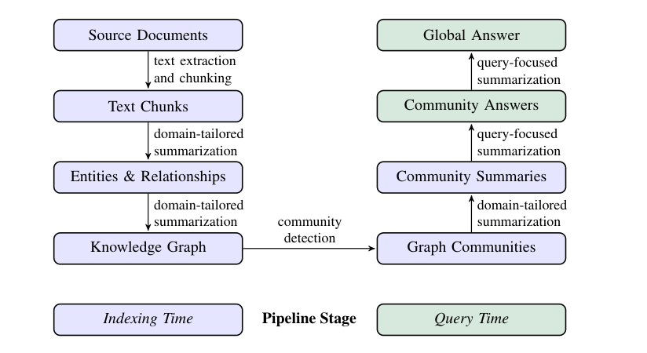
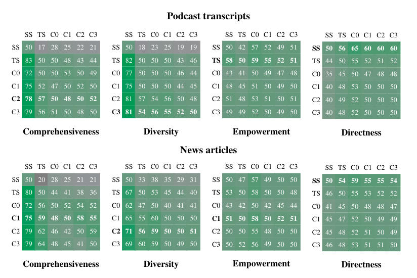
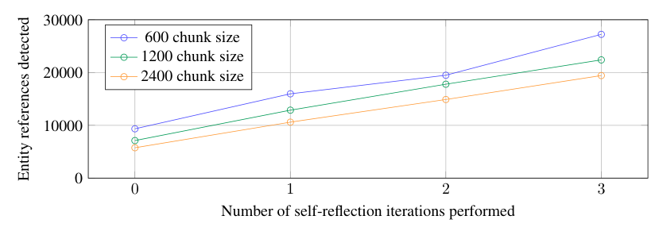
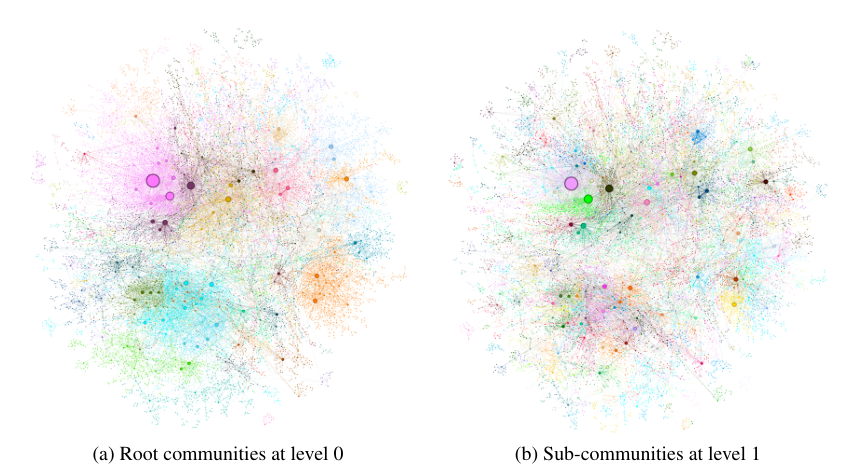

# 从局部到全局：一种面向查询聚焦式摘要的 GraphRAG 方法

**（From Local to Global: A GraphRAG Approach to Query-Focused Summarization）**

> 本文为 Edge 等人论文《From Local to Global: A GraphRAG Approach to Query-Focused Summarization》（arXiv:2404.16130v2 [cs.CL]，预印本，正在评审中，2025 年 2 月 19 日版本）的中文精确翻译。

**作者**：Darren Edge¹†、Ha Trinh¹†、Newman Cheng²、Joshua Bradley²、Alex Chao³、Apurva Mody³、Steven Truitt²、Dasha Metropolitansky¹、Robert Osazuwa Ness¹、Jonathan Larson¹

**单位**：¹微软研究院（Microsoft Research）；²微软战略任务与技术部（Microsoft Strategic Missions and Technologies）；³微软首席技术官办公室（Microsoft Office of the CTO）

**联系方式**：{daedge,trinhha,newmancheng,joshbradley,achao,moapurva,steventruitt,dasham,robertness,jolarso}@microsoft.com

†这两位作者对本文贡献相同。

---

## 摘要

使用**检索增强生成（retrieval-augmented generation，RAG）**从外部知识源检索相关信息，使**大语言模型（large language models，LLMs）**能够针对私有和/或此前未见过的文档集合回答问题。然而，RAG 在面向整个文本语料库的全局性问题（global questions）上会失效，例如"数据集中的主要主题是什么？"，因为这本质上是一项**查询聚焦式摘要（query-focused summarization，QFS）**任务，而非显式的检索任务。与此同时，此前的 QFS 方法又无法扩展到典型 RAG 系统所索引的文本量级。为了结合这两种截然不同方法的优势，我们提出了 GraphRAG——一种基于图（graph）的方法，用于在私有文本语料库上回答问题，它既能随用户问题的普遍性（generality）扩展，也能随源文本的数量扩展。我们的方法使用 LLM 分两个阶段构建图索引（graph index）：首先，从源文档中导出实体知识图谱（entity knowledge graph）；然后，为所有紧密相关实体的分组预生成社区摘要（community summaries）。给定一个问题，每个社区摘要被用来生成一个部分回答，随后所有部分回答再次被汇总为返回给用户的最终回答。对于一百万 token 量级数据集上的一类全局性**意义建构（sensemaking）**问题，我们表明 GraphRAG 在生成答案的**全面性（comprehensiveness）**和**多样性（diversity）**两方面，相对于传统 RAG 基线都带来了实质性的改进。

---

## 1 引言

检索增强生成（RAG）（Lewis et al., 2020）是一种成熟的方法，用于让 LLM 基于超出语言模型**上下文窗口（context window）**所能容纳的数据来回答查询；上下文窗口即 LLM 一次能够处理的最大 token（文本单元）数量（Kuratov et al., 2024; Liu et al., 2023）。在典型的 RAG 设置中，系统可以访问一个大型外部文本记录语料库，并检索出与查询单独相关、且合起来足够小、能装入 LLM 上下文窗口的记录子集。然后，LLM 基于查询和检索到的记录生成回答（Baumel et al., 2018; Dang, 2006; Laskar et al., 2020; Yao et al., 2017）。这种传统方法——我们统称为**向量 RAG（vector RAG）**——对于能够用一小部分记录中局部化的信息来回答的查询效果良好。然而，向量 RAG 方法不支持意义建构型查询，即需要全局理解整个数据集的查询，例如"过去十年中，跨学科研究影响科学发现的方式有哪些关键趋势？"

意义建构任务需要对"关联（可以是人、地点和事件之间的关联）"进行推理，"以便预判其发展轨迹并有效地采取行动"（Klein et al., 2006）。像 GPT（Achiam et al., 2023; Brown et al., 2020）、Llama（Touvron et al., 2023）和 Gemini（Anil et al., 2023）这样的 LLM 擅长在科学发现（Microsoft, 2023）和情报分析（Ranade and Joshi, 2023）等复杂领域中进行意义建构。给定一个意义建构查询和一段包含隐式且相互关联的概念集合的文本，LLM 能够生成回答该查询的摘要。然而，当数据量需要采用 RAG 方法时，挑战就出现了，因为向量 RAG 方法无法支持对整个语料库进行意义建构。

在本文中，我们提出了 GraphRAG——一种基于图的 RAG 方法，能够对整个大型文本语料库进行意义建构。GraphRAG 首先使用 LLM 构建知识图谱，其中节点对应语料库中的关键实体，边表示这些实体之间的关系。接着，它将图划分为紧密相关实体的社区层级结构（hierarchy of communities），然后使用 LLM 生成社区级摘要。这些摘要按照所提取社区的层级结构以自底向上的方式生成，层级较高的摘要递归地纳入较低层的摘要。合起来，这些社区摘要提供了对整个语料库的全局性描述和洞见。最后，GraphRAG 通过对社区摘要进行 **map-reduce（映射-归约）**处理来回答查询：在 map 步骤中，这些摘要被用来独立地、并行地对查询给出部分回答；随后在 reduce 步骤中，这些部分回答被合并，并用于生成最终的全局回答。

GraphRAG 方法及其对整个语料库进行全局意义建构的能力，构成本文的主要贡献。为了证明这一能力，我们开发了一种新颖的 **LLM-as-a-judge（以 LLM 作为评判者）**技术的应用（Zheng et al., 2024），适用于针对广泛议题和主题、且没有标准答案（ground-truth answer）的问题。该方法首先使用一个 LLM，基于特定于语料库的用例，生成一组多样化的全局意义建构问题；然后使用第二个 LLM，按照预定义的标准（见第 3.3 节定义）评判两个不同 RAG 系统的答案。我们使用这种方法，在两个有代表性的真实世界文本数据集上将 GraphRAG 与向量 RAG 进行比较。结果表明，在使用 GPT-4 作为 LLM 时，GraphRAG 大幅优于向量 RAG。

GraphRAG 已作为开源软件发布，地址为 https://github.com/microsoft/graphrag。此外，GraphRAG 方法的多个版本也可作为多个开源库的扩展使用，包括 LangChain（LangChain, 2024）、LlamaIndex（LlamaIndex, 2024）、NebulaGraph（NebulaGraph, 2024）和 Neo4J（Neo4J, 2024）。

---

## 2 背景（Background）

### 2.1 RAG 方法与系统（RAG Approaches and Systems）

RAG 泛指这样一类系统：用户查询被用于从外部数据源检索相关信息，随后这些信息被纳入 LLM（或其他生成式 AI 模型，例如多模态模型）对查询的回答的生成过程。查询和检索到的记录填充到一个提示模板（prompt template）中，然后该模板被传递给 LLM（Ram et al., 2023）。当数据源中的记录总数太大、无法包含在发给 LLM 的单个提示中时——即数据源中的文本量超过了 LLM 的上下文窗口时——RAG 是理想的选择。

在典型的 RAG 方法中，检索过程返回固定数量的、与查询语义相似的记录，生成的答案只使用这些检索到的记录中的信息。传统 RAG 的一种常见做法是使用文本嵌入（text embeddings），在向量空间中检索与查询最接近的记录，其中接近程度对应语义相似性（Gao et al., 2023）。虽然一些 RAG 方法可能使用替代的检索机制，但我们将这一类传统方法统称为向量 RAG。GraphRAG 与向量 RAG 的对比之处在于，它能够回答需要在整个数据语料库上进行全局意义建构的查询。

GraphRAG 建立在先前关于高级 RAG 策略的工作之上。GraphRAG 利用数据源大部分内容的摘要，作为"**自我记忆（self-memory）**"的一种形式（在 Cheng et al. 2024 中有描述），随后用它们来回答问题，如同 Mao et al. 2020 中的做法。这些摘要并行生成，并被迭代地聚合成全局摘要，类似于先前的技术（Feng et al., 2023; Gao et al., 2023; Khattab et al., 2022; Shao et al., 2023; Su et al., 2020; Trivedi et al., 2022; Wang et al., 2024）。特别是，GraphRAG 与其他使用层级索引（hierarchical indexing）来创建摘要的方法类似（类似于 Kim et al. 2023; Sarthi et al. 2024）。GraphRAG 与这些方法的不同之处在于，它从源数据生成图索引，然后应用基于图的社区检测来创建数据的主题划分（thematic partitioning）。

### 2.2 将知识图谱与 LLM 和 RAG 结合使用（Using Knowledge Graphs with LLMs and RAG）

从自然语言文本语料库提取知识图谱的方法包括规则匹配、统计模式识别、聚类和嵌入（Etzioni et al., 2004; Kim et al., 2016; Mooney and Bunescu, 2005; Yates et al., 2007）。GraphRAG 属于较新的一类研究——使用 LLM 进行知识图谱提取（Ban et al., 2023; Melnyk et al., 2022; OpenAI, 2023; Tan et al., 2017; Trajanoska et al., 2023; Yao et al., 2023; Yates et al., 2007; Zhang et al., 2024a）。它也为不断增长的、使用知识图谱作为索引的 RAG 方法体系做出了贡献（Gao et al., 2023）。一些技术直接在提示中使用子图（subgraph）、图的元素或图结构的属性（Baek et al., 2023; He et al., 2024; Zhang, 2023），或将其作为生成输出的事实依据（factual grounding）（Kang et al., 2023; Ranade and Joshi, 2023）。其他技术（Wang et al., 2023b）使用知识图谱来增强检索，在查询时，一个基于 LLM 的智能体（agent）动态遍历图，其中节点表示文档元素（例如段落、表格），边编码词法和语义相似性或结构关系。GraphRAG 与这些方法的不同之处在于，它聚焦于图在此语境中一个此前未被探索的性质：其固有的**模块性（modularity）**（Newman, 2006），以及将图划分为紧密相关节点的嵌套模块化社区的能力（例如 Louvain，Blondel et al. 2008；Leiden，Traag et al. 2019）。具体而言，GraphRAG 通过使用 LLM 创建跨越该社区层级的摘要，递归地创建越来越全局化的摘要。

### 2.3 面向 RAG 评估的自适应基准测试（Adaptive benchmarking for RAG Evaluation）

存在许多开放域问答基准数据集，包括 HotPotQA（Yang et al., 2018）、MultiHop-RAG（Tang and Yang, 2024）和 MT-Bench（Zheng et al., 2024）。然而，这些基准面向的是向量 RAG 的性能，即它们评估的是显式事实检索的性能。在本文中，我们提出一种方法，用于生成一组评估对整个语料库进行全局意义建构的问题。我们的方法与这样一类 LLM 方法相关：使用语料库生成问题，其答案将是该语料库的摘要，例如 Xu and Lapata (2021)。然而，为了产生公平的评估，我们的方法避免直接从语料库本身生成问题（作为替代实现，可以使用从后续图提取和答案评估步骤中留出（held out）的语料库子集）。

**自适应基准测试（Adaptive benchmarking）**指的是动态生成针对特定领域或用例量身定制的评估基准的过程。近期工作已使用 LLM 进行自适应基准测试，以确保与目标应用或任务的相关性、多样性和一致性（Yuan et al., 2024; Zhang et al., 2024b）。在本文中，我们提出一种自适应基准测试方法，为 LLM 生成全局意义建构查询。我们的方法建立在先前基于 LLM 的**人物画像（persona）**生成工作之上，其中 LLM 被用来生成多样且真实的人物画像集合（Kosinski, 2024; Salminen et al., 2024; Shin et al., 2024）。我们的自适应基准测试流程使用人物画像生成来创建能代表真实世界 RAG 系统使用方式的查询。具体而言，我们的方法使用 LLM 来推断可能使用该 RAG 系统的潜在用户及其用例，从而指导生成特定于语料库的意义建构查询。

### 2.4 RAG 评估标准（RAG evaluation criteria）

我们的评估依赖 LLM 来评估 RAG 系统回答所生成问题的好坏。先前工作表明 LLM 是自然语言生成的良好评估者，包括一些 LLM 评估与人工评估不相上下的工作（Wang et al., 2023a; Zheng et al., 2024）。一些先前工作提出了让 LLM 量化生成文本质量的标准，例如"**流畅性（fluency）**"（Wang et al., 2023a）。其中一些标准对向量 RAG 系统是通用的，且与全局意义建构无关，例如"上下文相关性"（context relevance）、"忠实性"（faithfulness）和"答案相关性"（answer relevance）（RAGAS, Es et al. 2023）。由于缺乏评估的黄金标准（gold standard），人们可以通过提示 LLM 比较两个不同竞争模型生成的文本，来量化某一标准上的相对性能（LLM-as-a-judge,（Zheng et al., 2024））。在本文中，我们设计了用于评估 RAG 对全局意义建构问题所生成答案的标准，并使用比较式方法评估我们的结果。我们还使用从 LLM 提取的可验证事实陈述（即"**主张（claims）**"）所得的统计量来验证结果。

---

## 3 方法（Methods）

### 3.1 GraphRAG 工作流（GraphRAG Workflow）

图 1 展示了 GraphRAG 方法与流水线的高层数据流。在本节中，我们描述每一步的关键设计参数、技术和实现细节。

#### 3.1.1 源文档 → 文本块（Source Documents → Text Chunks）

首先，语料库中的文档被切分为文本块（text chunks）。LLM 从每个文本块中提取信息以供下游处理。选择文本块的大小是一个基本的设计决策；较长的文本块需要较少的 LLM 调用来完成此类提取（从而降低成本），但对文本块早期出现信息的召回率会下降（Kuratov et al., 2024; Liu et al., 2023）。关于召回率-精确率权衡的提示和示例，见第 A.1 节。

#### 3.1.2 文本块 → 实体与关系（Text Chunks → Entities & Relationships）

在这一步中，提示 LLM 从给定的文本块中提取重要实体的实例以及实体之间的关系。此外，LLM 为实体和关系生成简短描述。举例来说，假设一个文本块包含以下文本：

> NeoChip（NC）的股价在 NewTech 交易所上市交易的第一周大幅上涨。然而，市场分析师提醒说，这家芯片制造商的公开上市可能并不反映其他科技公司 IPO 的趋势。NeoChip 此前是一家私人实体，于 2016 年被 Quantum Systems 收购。这家创新的半导体公司专注于面向可穿戴设备和物联网（IoT）设备的低功耗处理器。

提示 LLM 使其提取出以下内容：

- 实体 NeoChip，描述为"NeoChip 是一家公开交易的公司，专注于面向可穿戴设备和物联网设备的低功耗处理器。"
- 实体 Quantum Systems，描述为"Quantum Systems 是一家此前拥有 NeoChip 的公司。"
- NeoChip 与 Quantum Systems 之间的关系，描述为"Quantum Systems 从 2016 年起拥有 NeoChip，直到 NeoChip 成为公开交易公司。"

这些提示可以通过选择适合领域的**少样本（few-shot）**示例来进行**上下文学习（in-context learning）**（Brown et al., 2020），从而针对文档语料库的领域进行定制。例如，虽然我们的默认提示提取"**命名实体（named entities）**"这一广泛类别（如人物、地点和组织），且普遍适用，但具有专门知识的领域（例如科学、医学、法律）将受益于专门针对这些领域的少样本示例。

也可以提示 LLM 提取关于已检测实体的**主张（claims）**。主张是关于实体的重要事实性陈述，例如日期、事件以及与其他实体的交互。与实体和关系一样，上下文学习示例可以提供特定于领域的指导。从示例文本块中提取的主张描述如下：

- NeoChip 的股价在 NewTech 交易所交易的第一周大幅上涨。
- NeoChip 作为公开上市公司在 NewTech 交易所首次亮相。
- Quantum Systems 于 2016 年收购了 NeoChip，并持有所有权直到 NeoChip 上市。

关于我们实现实体和主张提取的提示和细节，见附录 A。

#### 3.1.3 实体与关系 → 知识图谱（Entities & Relationships → Knowledge Graph）

使用 LLM 提取实体、关系和主张是一种**抽象式摘要（abstractive summarization）**的形式——它们是对概念的有意义摘要，就关系和主张而言，这些摘要可能并未在文本中显式陈述。实体/关系/主张的提取过程会为单个元素创建多个实例，因为一个元素通常会在多个文档中被多次检测和提取。

在知识图谱提取过程的最后一步，这些实体和关系的实例成为图中的单个节点和边。实体描述为每个节点和边进行聚合和摘要。关系被聚合为图边，其中给定关系的重复次数成为边的权重。主张也以类似方式聚合。在本文中，我们的分析使用精确字符串匹配进行**实体匹配（entity matching）**——即调和同一实体的不同提取名称的任务（Barlaug and Gulla, 2021; Christen and Christen, 2012; Elmagarmid et al., 2006）。不过，通过对提示或代码做少量调整，也可以使用更宽松（softer）的匹配方法。此外，GraphRAG 通常对重复实体具有鲁棒性，因为在后续步骤中，重复项通常会被聚在一起进行摘要。

#### 3.1.4 知识图谱 → 图社区（Knowledge Graph → Graph Communities）

给定上一步创建的图索引，可以使用各种**社区检测（community detection）**算法将图划分为强连接节点的社区（例如，参见 Fortunato (2010) 和 Jin et al. (2021) 的综述）。在我们的流水线中，我们以层级方式使用 Leiden 社区检测（Traag et al., 2019），在每个检测到的社区内递归地检测子社区，直到达到无法再划分的**叶社区（leaf communities）**。

该层级的每一层都提供一种社区划分，以互斥且整体穷尽（mutually exclusive, collectively exhaustive）的方式覆盖图中的节点，从而能够进行分治式的全局摘要。在示例数据集上进行这种层级划分的图示见附录 B。

#### 3.1.5 图社区 → 社区摘要（Graph Communities → Community Summaries）

下一步为社区层级中的每个社区创建类似报告的摘要，采用一种设计用于扩展到非常大语料库的方法。这些摘要本身就很有用，可用于理解数据集的全局结构和语义，并且本身可以在没有特定查询的情况下用于理解语料库。例如，用户可以浏览某一层的社区摘要，寻找感兴趣的总体主题，然后阅读更低层级的关联报告，这些报告为每个子主题提供了更多细节。然而，在这里我们聚焦于它们作为用于回答全局查询的基于图的索引的一部分的效用。

GraphRAG 通过将各种元素摘要（针对节点、边和相关主张）添加到社区摘要模板中来生成社区摘要。来自低层社区（lower-level communities）的社区摘要被用于生成高层社区（higher-level communities）的摘要，具体如下：

- **叶级社区（Leaf-level communities）**。叶级社区的元素摘要被排序，然后迭代地加入 LLM 上下文窗口，直到达到 token 上限。排序方式如下：对于每条社区边，按源节点和目标节点的组合度数（即总体显著性）降序排列，添加源节点、目标节点、边本身以及相关主张的描述。
- **高层社区（Higher-level communities）**。如果所有元素摘要都能装入上下文窗口的 token 上限内，则按叶级社区的方式处理，摘要该社区内的所有元素摘要。否则，按元素摘要 token 数的降序对子社区排序，并迭代地用（更短的）子社区摘要替换其关联的（更长的）元素摘要，直到它们能装入上下文窗口。

#### 3.1.6 社区摘要 → 社区答案 → 全局答案（Community Summaries → Community Answers → Global Answer）

给定一个用户查询，上一步生成的社区摘要可以在多阶段过程中用于生成最终答案。社区结构的层级性质也意味着，可以使用不同层级的社区摘要来回答问题，从而引出一个问题：在层级社区结构中，是否存在某个特定层级能为一般性意义建构问题提供摘要细节与范围之间的最佳平衡（在第 4 节中评估）。

对于给定的社区层级，对任何用户查询的全局答案按如下方式生成：

- **准备社区摘要（Prepare community summaries）**。社区摘要被随机打乱，并划分为预指定 token 大小的块。这确保相关信息分散在各个块中，而不是集中（并可能丢失）在单个上下文窗口中。
- **映射社区答案（Map community answers）**。中间答案并行生成。还要求 LLM 生成一个 0-100 之间的分数，表示所生成答案对回答目标问题的帮助程度。分数为 0 的答案被过滤掉。
- **归约为全局答案（Reduce to global answer）**。中间社区答案按帮助分数的降序排序，并迭代地加入新的上下文窗口，直到达到 token 上限。这个最终上下文用于生成返回给用户的全局答案。

### 3.2 全局意义建构问题生成（Global Sensemaking Question Generation）

为了评估 RAG 系统在全局意义建构任务上的有效性，我们使用 LLM 生成一组特定于语料库的问题，旨在评估对给定语料库的高层理解，而不需要检索特定的低层事实。相反，给定语料库的高层描述及其用途，提示 LLM 生成 RAG 系统假设用户的人物画像。对于每个假设用户，然后提示 LLM 指定该用户会使用 RAG 系统完成的任务。最后，对于每个用户与任务的组合，提示 LLM 生成需要理解整个语料库的问题。算法 1 描述了该方法。

**算法 1：问题生成的提示流程（Prompting Procedure for Question Generation）**

```
1: 输入：语料库的描述、用户数 K、每个用户的任务数 N、每个（用户，任务）组合的问题数 M。
2: 输出：一组 K × N × M 个需要全局理解语料库的高层问题。
3: 流程 GENERATEQUESTIONS
4:     基于语料库描述，提示 LLM：
       1. 描述数据集的 K 个潜在用户的人物画像。
       2. 为每个用户，确定 N 个与该用户相关的任务。
       3. 针对每个用户与任务对，生成 M 个高层问题，这些问题：
          • 需要理解整个语料库。
          • 不需要检索特定的低层事实。
5:     收集生成的问题，为数据集生成 K × N × M 个测试问题。
6: 结束流程
```

对于我们的评估，我们设 K = M = N = 5，每个数据集共 125 个测试问题。表 1 展示了两个评估数据集各自的问题示例。

### 3.3 评估全局意义建构的标准（Criteria for Evaluating Global Sensemaking）

鉴于我们的基于活动的意义建构问题缺乏黄金标准答案，我们采用**两两对比（head-to-head）**方法，使用 LLM 评估者按照特定标准评判相对性能。我们设计了三个目标标准，捕捉对全局意义建构活动而言可取的品质。

附录 F 展示了我们使用 LLM 评估者计算两两对比度量的提示，概括如下：

- **全面性（Comprehensiveness）**。答案在覆盖问题的所有方面和细节方面提供了多少细节？
- **多样性（Diversity）**。答案在就问题提供不同视角和洞见方面有多多样、多丰富？
- **赋能性（Empowerment）**。答案在多大程度上帮助读者理解主题并做出明智的判断？

此外，我们使用一个名为"**直接性（Directness）**"的"对照标准"（control criterion），它回答"答案具体且清晰地针对问题的程度如何？"。通俗地说，直接性在通用意义上评估答案的简洁性，适用于任何 LLM 生成的摘要。我们将其作为参照，据此判断其他标准结果的可靠性。由于直接性实际上与全面性和多样性相对立，我们预期不会有任何方法能在全部四个标准上都胜出。

在我们的评估中，向 LLM 提供问题、来自两个竞争系统的生成答案，并提示 LLM 按照该标准比较两个答案，然后给出哪个答案更受偏好的最终判断。LLM 要么给出一个胜者；要么在两者本质上相似时返回平局。为考虑 LLM 生成固有的随机性，我们对每次比较运行多个重复，并在重复和问题之间取平均结果。针对一个示例问题的答案进行 LLM 评估的图示见附录 D。

---

## 4 分析（Analysis）

### 4.1 实验 1（Experiment 1）

#### 4.1.1 数据集（Datasets）

我们选取了两个一百万 token 量级的数据集，每个都代表用户在实际活动中可能遇到的语料库：

**播客转录文本（Podcast transcripts）**。"Behind the Tech with Kevin Scott" 的公开转录文本，这是一档播客，内容是微软 CTO Kevin Scott 与科学和技术领域多位思想领袖之间的对话（Scott, 2024）。该语料库被划分为 1669 个 600-token 的文本块，块与块之间有 100-token 的重叠（约 100 万 token）。

**新闻文章（News articles）**。一个基准数据集，由 2013 年 9 月至 2023 年 12 月间发布的多类新闻文章组成，类别包括娱乐、商业、体育、科技、健康和科学（Tang and Yang, 2024）。该语料库被划分为 3197 个 600-token 的文本块，块与块之间有 100-token 的重叠（约 170 万 token）。

#### 4.1.2 条件（Conditions）

我们比较了六种条件，包括在四个不同图社区层级（C0、C1、C2、C3）上的 GraphRAG、一种将我们的 map-reduce 方法直接应用于源文本的文本摘要方法（TS），以及一种向量 RAG"语义搜索（semantic search）"方法（SS）：

- **C0**。使用根级社区摘要（数量最少）来回答用户查询。
- **C1**。使用高层社区摘要来回答查询。这些是 C0 的子社区（如果存在），否则是向下投影的 C0 社区。
- **C2**。使用中间层社区摘要来回答查询。这些是 C1 的子社区（如果存在），否则是向下投影的 C1 社区。
- **C3**。使用低层社区摘要（数量最多）来回答查询。这些是 C2 的子社区（如果存在），否则是向下投影的 C2 社区。
- **TS**。与第 3.1.6 节相同的方法，区别在于对 map-reduce 摘要阶段打乱和切块的是源文本（而非社区摘要）。
- **SS**。一种向量 RAG 的实现，其中文本块被检索并加入可用上下文窗口，直到达到指定的 token 上限。

上下文窗口的大小和用于答案生成的提示在所有六种条件下都相同（除了为匹配所用上下文信息的类型，对引用风格做了少量修改）。条件之间的差异仅在于上下文窗口内容是如何创建的。支持条件 C0-C3 的图索引是使用我们通用的实体和关系提取提示创建的，实体类型和少样本示例针对数据领域进行了定制。

#### 4.1.3 配置（Configuration）

我们使用固定的 8k token 上下文窗口大小来生成社区摘要、社区答案和全局答案（附录 C 中有说明）。使用 600 token 窗口进行图索引（第 A.2 节有说明）对播客数据集耗时 281 分钟，运行在一台虚拟机（16GB RAM，Intel(R) Xeon(R) Platinum 8171M CPU @ 2.60GHz）上，并使用 gpt-4-turbo 的公开 OpenAI 端点（2M TPM，10k RPM）。

我们使用 graspologic 库（Chung et al., 2019）实现 Leiden 社区检测。用于生成图索引和全局答案的提示见附录 E，用于评估 LLM 回答是否符合我们标准的提示见附录 F。对下一节结果进行的完整统计分析见附录 G。

### 4.2 实验 2（Experiment 2）

为了验证实验 1 中全面性和多样性的结果，我们实现了基于主张（claim-based）的这些品质的度量。我们使用 Ni et al. (2024) 中对**事实性主张（factual claim）**的定义，即"明确陈述某些可验证事实的陈述"。例如，句子"California and New York implemented incentives for renewable energy adoption, highlighting the broader importance of sustainability in policy decisions"（加利福尼亚州和纽约州实施了促进可再生能源采用的激励措施，凸显了可持续性在政策决策中的更广泛重要性）包含两个事实性主张：(1) 加利福尼亚州实施了促进可再生能源采用的激励措施；(2) 纽约州实施了促进可再生能源采用的激励措施。

为了提取事实性主张，我们使用了 Claimify（Metropolitansky and Larson, 2025），这是一种基于 LLM 的方法，它识别答案中包含至少一个事实性主张的句子，然后将这些句子分解为简单、自包含的事实性主张。我们将 Claimify 应用于实验 1 各条件下生成的答案。在去除每个答案中的重复主张后，我们提取了 47,075 个不重复主张，平均每个答案 31 个主张。

我们定义了两个度量，值越高表示性能越好：

1. **全面性（Comprehensiveness）**：以每个条件下生成的答案中提取的平均主张数来衡量。
2. **多样性（Diversity）**：通过对每个答案的主张进行聚类，并计算平均簇数来衡量。

对于聚类，我们遵循 Padmakumar and He (2024) 描述的方法，该方法使用了 Scikit-learn 的**凝聚聚类（agglomerative clustering）**实现（Pedregosa et al., 2011）。簇通过"complete"（完全）链接合并，即只有当它们最远点之间的最大距离小于或等于预定义距离阈值时才合并。使用的距离度量为 1 − ROUGE-L。由于距离阈值会影响簇的数量，我们在一系列阈值上报告结果。

---

## 5 结果（Results）

### 5.1 实验 1（Experiment 1）

索引过程为播客数据集生成了一个由 8,564 个节点和 20,691 条边组成的图，为新闻数据集生成了一个更大的、由 15,754 个节点和 19,520 条边组成的图。表 2 展示了每个图社区层级不同层级上的社区摘要数量。

**全局方法 vs. 向量 RAG**。如图 2 和表 6 所示，在两个数据集上，全局方法在全面性和多样性两个标准上都显著优于传统向量 RAG（SS）。具体而言，全局方法在播客转录文本上取得了 72-83%（p<.001）的全面性胜率，在新闻文章上取得了 72-80%（p<.001）的全面性胜率；多样性胜率则分别为 75-82%（p<.001）和 62-71%（p<.01）。我们使用直接性作为有效性检验，确认了在所有比较中，向量 RAG 产生的回答都最直接。

**赋能性（Empowerment）**。赋能性比较显示出混合结果：无论是全局方法与向量 RAG（SS）相比，还是 GraphRAG 方法与源文本摘要（TS）相比，均是如此。使用 LLM 分析 LLM 在此度量上的推理表明，提供具体示例、引语和引用的能力被判定为帮助用户达成知情理解的关键。调整元素提取提示可能有助于在 GraphRAG 索引中保留更多此类细节。

**社区摘要 vs. 源文本**。当使用 GraphRAG 将社区摘要与源文本进行比较时，社区摘要通常在答案全面性和多样性上提供了小幅但一致的改进，根级摘要除外。播客数据集中的中间层摘要和新闻数据集中的低层社区摘要分别取得了 57%（p<.001）和 64%（p<.001）的全面性胜率。多样性胜率为：播客中间层摘要 57%（p=.036），新闻低层社区摘要 60%（p<.001）。表 2 还说明了 GraphRAG 相比源文本摘要的可扩展性优势：对于低层社区摘要（C3），GraphRAG 所需的上下文 token 少了 26-33%；而对于根级社区摘要（C0），所需 token 少了 97% 以上。与其它全局方法相比性能仅有适度下降，根级 GraphRAG 为意义建构活动所特有的迭代式问答提供了一种高效的方法，同时相对于向量 RAG 仍保持全面性（72% 胜率）和多样性（62% 胜率）方面的优势。

### 5.2 实验 2（Experiment 2）

表 3 展示了每个条件提取的平均主张数（即基于主张的全面性度量）的结果。对于新闻和播客两个数据集，所有全局搜索条件（C0-C3）和源文本摘要（TS）的全面性都高于向量 RAG（SS）。这些差异在所有情况下都具有统计显著性（p<.05）。这些发现与实验 1 中基于 LLM 的胜率一致。

表 4 包含平均簇数（基于主张的多样性度量）的结果。对于播客数据集，所有全局搜索条件在所有距离阈值上的多样性都显著高于 SS（p<.05），与实验 1 中观察到的胜率一致。然而，对于新闻数据集，只有 C0 在所有距离阈值上都显著优于 SS（p<.05）。虽然 C1-C3 的平均簇数也高于 SS，但差异仅在某些距离阈值上具有统计显著性。在实验 1 中，新闻数据集上所有全局搜索条件都显著优于 SS——不仅仅是 C0。然而，新闻数据集中 SS 与全局搜索条件之间的平均多样性分数差异小于播客数据集，与基于主张的结果方向一致。

对于全面性和多样性两个标准，在两个数据集上，全局搜索条件之间、或全局搜索与 TS 之间都没有观察到统计显著性差异。

最后，对于实验 1 中的每次两两比较，我们检验了 LLM 偏好的答案是否与基于主张度量的胜者一致。由于实验 1 中的每次两两比较进行了五次，而基于主张的度量每次比较只提供一个结果，我们使用**多数投票（majority voting）**将实验 1 的结果聚合成单个标签。例如，如果对于某个问题的全面性，C0 在五次评判中有三次胜过 SS，则将 C0 标记为胜者、SS 标记为败者。然而，如果 C0 胜两次、SS 胜一次、平局两次，则没有多数结果，因此最终标签为平局。

我们发现，基于主张的度量中精确平局很罕见。一种可能的解决方案是基于阈值定义平局（例如，条件 A 与条件 B 的基于主张结果的绝对差必须小于或等于 x）。然而，我们观察到结果对阈值的选择很敏感。因此，我们聚焦于聚合后的 LLM 标签不是平局的情况，这些情况分别占全面性和多样性两两比较的 33% 和 39%。在这些情况下，聚合后的 LLM 标签在 78% 的全面性两两比较中与基于主张的标签一致，在多样性方面为 69-70%（跨所有距离阈值），表明存在中等强度的对齐（moderately strong alignment）。

---

## 6 讨论（Discussion）

### 6.1 评估方法的局限性（Limitations of evaluation approach）

我们迄今为止的评估聚焦于两个各自包含约 100 万 token 的语料库所特有的意义建构问题。还需要更多工作来理解性能如何推广到来自不同领域、具有不同用例的数据集。对编造率（fabrication rates）的比较——例如使用 SelfCheckGPT（Manakul et al., 2023）之类的方法——也会强化当前的分析。

### 6.2 未来工作（Future work）

支撑当前 GraphRAG 方法的图索引、富文本标注和层级社区结构为改进和适配提供了许多可能性。这包括以更局部的方式运行的 RAG 方法，通过用户查询与图标注的基于嵌入的匹配来实现。特别是，我们看到了混合 RAG 方案的潜力：在采用我们的 map-reduce 摘要机制之前，将基于嵌入的匹配与即时（just-in-time）社区报告生成相结合。这种"上卷（roll-up）"方法也可以扩展到社区层级的多个层级，并可以实现为一种更具探索性的"下钻（drill down）"机制，追随高层社区摘要中所包含的信息线索（information scent）。

**更广泛的影响（Broader impacts）**。作为一种在大规模文档集合上回答问题（question answering）的机制，如果生成的答案不能准确表示源数据，就会给下游的意义建构和决策任务带来风险。系统的使用应当伴随对 AI 使用以及输出可能存在错误的明确披露。然而，与向量 RAG 相比，GraphRAG 显示出了缓解这些下游风险的潜力——针对的是全局性质的问题，这类问题否则可能由被虚假地呈现为全局摘要的检索事实样本（samples of retrieved facts）来回答。

---

## 7 结论（Conclusion）

我们提出了 GraphRAG，一种结合知识图谱生成与查询聚焦式摘要（QFS）的 RAG 方法，用于支持对整个文本语料库的人类意义建构。初步评估表明，在答案的全面性和多样性两方面，相对于向量 RAG 基线都有实质性改进，并且与一种使用 map-reduce 源文本摘要的全局但无图的方法相比也表现出有利的比较结果。对于需要在同一数据集上进行大量全局查询的场景，基于实体的图索引中根级社区的摘要提供了一种数据索引，既优于向量 RAG，又以远低得多的 token 成本取得了与其他全局方法有竞争力的性能。

---

## 致谢（Acknowledgements）

我们还要感谢以下对本文做出贡献的人：Alonso Guevara Fernández、Amber Hoak、Andrés Morales Esquivel、Ben Cutler、Billie Rinaldi、Chris Sanchez、Chris Trevino、Christine Caggiano、David Tittsworth、Dayenne de Souza、Douglas Orbaker、Ed Clark、Gabriel Nieves-Ponce、Gaudy Blanco Meneses、Kate Lytvynets、Katy Smith、Mónica Carvajal、Nathan Evans、Richard Ortega、Rodrigo Racanicci、Sarah Smith 和 Shane Solomon。

---

## 参考文献

Achiam, J., Adler, S., Agarwal, S., Ahmad, L., Akkaya, I., Aleman, F. L., Almeida, D., Altenschmidt, J., Altman, S., Anadkat, S., et al. (2023). Gpt-4 technical report. arXiv preprint arXiv:2303.08774.

Anil, R., Borgeaud, S., Wu, Y., Alayrac, J.-B., Yu, J., Soricut, R., Schalkwyk, J., Dai, A. M., Hauth, A., et al. (2023). Gemini: a family of highly capable multimodal models. arXiv preprint arXiv:2312.11805.

Baek, J., Aji, A. F., and Saffari, A. (2023). Knowledge-augmented language model prompting for zero-shot knowledge graph question answering. arXiv preprint arXiv:2306.04136.

Ban, T., Chen, L., Wang, X., and Chen, H. (2023). From query tools to causal architects: Harnessing large language models for advanced causal discovery from data.

Barlaug, N. and Gulla, J. A. (2021). Neural networks for entity matching: A survey. ACM Transactions on Knowledge Discovery from Data (TKDD), 15(3):1–37.

Baumel, T., Eyal, M., and Elhadad, M. (2018). Query focused abstractive summarization: Incorporating query relevance, multi-document coverage, and summary length constraints into seq2seq models. arXiv preprint arXiv:1801.07704.

Blondel, V. D., Guillaume, J.-L., Lambiotte, R., and Lefebvre, E. (2008). Fast unfolding of communities in large networks. Journal of statistical mechanics: theory and experiment, 2008(10):P10008.

Brown, T., Mann, B., Ryder, N., Subbiah, M., Kaplan, J. D., Dhariwal, P., Neelakantan, A., Shyam, P., Sastry, G., Askell, A., et al. (2020). Language models are few-shot learners. Advances in neural information processing systems, 33:1877–1901.

Cheng, X., Luo, D., Chen, X., Liu, L., Zhao, D., and Yan, R. (2024). Lift yourself up: Retrieval-augmented text generation with self-memory. Advances in Neural Information Processing Systems, 36.

Christen, P. and Christen, P. (2012). The data matching process. Springer.

Chung, J., Pedigo, B. D., Bridgeford, E. W., Varjavand, B. K., Helm, H. S., and Vogelstein, J. T. (2019). Graspy: Graph statistics in python. Journal of Machine Learning Research, 20(158):1–7.

Dang, H. T. (2006). Duc 2005: Evaluation of question-focused summarization systems. In Proceedings of the Workshop on Task-Focused Summarization and Question Answering, pages 48–55.

Elmagarmid, A. K., Ipeirotis, P. G., and Verykios, V. S. (2006). Duplicate record detection: A survey. IEEE Transactions on knowledge and data engineering, 19(1):1–16.

Es, S., James, J., Espinosa-Anke, L., and Schockaert, S. (2023). Ragas: Automated evaluation of retrieval augmented generation. arXiv preprint arXiv:2309.15217.

Etzioni, O., Cafarella, M., Downey, D., Kok, S., Popescu, A.-M., Shaked, T., Soderland, S., Weld, D. S., and Yates, A. (2004). Web-scale information extraction in knowitall: (preliminary results). In Proceedings of the 13th International Conference on World Wide Web, WWW ’04, page 100–110, New York, NY, USA. Association for Computing Machinery.

Feng, Z., Feng, X., Zhao, D., Yang, M., and Qin, B. (2023). Retrieval-generation synergy augmented large language models. arXiv preprint arXiv:2310.05149.

Fortunato, S. (2010). Community detection in graphs. Physics reports, 486(3-5):75–174.

Gao, Y., Xiong, Y., Gao, X., Jia, K., Pan, J., Bi, Y., Dai, Y., Sun, J., and Wang, H. (2023). Retrieval-augmented generation for large language models: A survey. arXiv preprint arXiv:2312.10997.

He, X., Tian, Y., Sun, Y., Chawla, N. V., Laurent, T., LeCun, Y., Bresson, X., and Hooi, B. (2024). G-retriever: Retrieval-augmented generation for textual graph understanding and question answering. arXiv preprint arXiv:2402.07630.

Huang, J., Chen, X., Mishra, S., Zheng, H. S., Yu, A. W., Song, X., and Zhou, D. (2023). Large language models cannot self-correct reasoning yet. arXiv preprint arXiv:2310.01798.

Jacomy, M., Venturini, T., Heymann, S., and Bastian, M. (2014). Forceatlas2, a continuous graph layout algorithm for handy network visualization designed for the gephi software. PLoS ONE 9(6): e98679. https://doi.org/10.1371/journal.pone.0098679.

Jin, D., Yu, Z., Jiao, P., Pan, S., He, D., Wu, J., Philip, S. Y., and Zhang, W. (2021). A survey of community detection approaches: From statistical modeling to deep learning. IEEE Transactions on Knowledge and Data Engineering, 35(2):1149–1170.

Kang, M., Kwak, J. M., Baek, J., and Hwang, S. J. (2023). Knowledge graph-augmented language models for knowledge-grounded dialogue generation. arXiv preprint arXiv:2305.18846.

Khattab, O., Santhanam, K., Li, X. L., Hall, D., Liang, P., Potts, C., and Zaharia, M. (2022). Demonstrate-search-predict: Composing retrieval and language models for knowledge-intensive nlp. arXiv preprint arXiv:2212.14024.

Kim, D., Xie, L., and Ong, C. S. (2016). Probabilistic knowledge graph construction: Compositional and incremental approaches. In Proceedings of the 25th ACM International on Conference on Information and Knowledge Management, CIKM ’16, page 2257–2262, New York, NY, USA. Association for Computing Machinery.

Kim, G., Kim, S., Jeon, B., Park, J., and Kang, J. (2023). Tree of clarifications: Answering ambiguous questions with retrieval-augmented large language models. arXiv preprint arXiv:2310.14696.

Klein, G., Moon, B., and Hoffman, R. R. (2006). Making sense of sensemaking 1: Alternative perspectives. IEEE intelligent systems, 21(4):70–73.

Kosinski, M. (2024). Evaluating large language models in theory of mind tasks. Proceedings of the National Academy of Sciences, 121(45):e2405460121.

Kuratov, Y., Bulatov, A., Anokhin, P., Sorokin, D., Sorokin, A., and Burtsev, M. (2024). In search of needles in a 11m haystack: Recurrent memory finds what llms miss.

LangChain (2024). Langchain graphs. https://langchain-graphrag.readthedocs.io/en/latest/.

Laskar, M. T. R., Hoque, E., and Huang, J. (2020). Query focused abstractive summarization via incorporating query relevance and transfer learning with transformer models. In Advances in Artificial Intelligence: 33rd Canadian Conference on Artificial Intelligence, Canadian AI 2020, Ottawa, ON, Canada, May 13–15, 2020, Proceedings 33, pages 342–348. Springer.

Lewis, P., Perez, E., Piktus, A., Petroni, F., Karpukhin, V., Goyal, N., Küttler, H., Lewis, M., Yih, W.-t., Rocktäschel, T., et al. (2020). Retrieval-augmented generation for knowledge-intensive nlp tasks. Advances in Neural Information Processing Systems, 33:9459–9474.

Liu, N. F., Lin, K., Hewitt, J., Paranjape, A., Bevilacqua, M., Petroni, F., and Liang, P. (2023). Lost in the middle: How language models use long contexts. arXiv:2307.03172.

LlamaIndex (2024). GraphRAG Implementation with LlamaIndex - V2. https://github.com/run-llama/llama_index/blob/main/docs/docs/examples/cookbooks/GraphRAG_v2.ipynb.

Madaan, A., Tandon, N., Gupta, P., Hallinan, S., Gao, L., Wiegreffe, S., Alon, U., Dziri, N., Prabhumoye, S., Yang, Y., et al. (2024). Self-refine: Iterative refinement with self-feedback. Advances in Neural Information Processing Systems, 36.

Manakul, P., Liusie, A., and Gales, M. J. (2023). Selfcheckgpt: Zero-resource black-box hallucination detection for generative large language models. arXiv preprint arXiv:2303.08896.

Mao, Y., He, P., Liu, X., Shen, Y., Gao, J., Han, J., and Chen, W. (2020). Generation-augmented retrieval for open-domain question answering. arXiv preprint arXiv:2009.08553.

Martin, S., Brown, W. M., Klavans, R., and Boyack, K. (2011). Openord: An open-source toolbox for large graph layout. SPIE Conference on Visualization and Data Analysis (VDA).

Melnyk, I., Dognin, P., and Das, P. (2022). Knowledge graph generation from text.

Metropolitansky, D. and Larson, J. (2025). Towards effective extraction and evaluation of factual claims.

Microsoft (2023). The impact of large language models on scientific discovery: a preliminary study using gpt-4.

Mooney, R. J. and Bunescu, R. (2005). Mining knowledge from text using information extraction. SIGKDD Explor. Newsl., 7(1):3–10.

NebulaGraph (2024). Nebulagraph launches industry-first graph rag: Retrieval-augmented generation with llm based on knowledge graphs. https://www.nebula-graph.io/posts/graph-RAG.

Neo4J (2024). Get started with graphrag: Neo4j’s ecosystem tools. https://neo4j.com/developer-blog/graphrag-ecosystem-tools/.

Newman, M. E. (2006). Modularity and community structure in networks. Proceedings of the national academy of sciences, 103(23):8577–8582.

Ni, J., Shi, M., Stammbach, D., Sachan, M., Ash, E., and Leippold, M. (2024). AFaCTA: Assisting the annotation of factual claim detection with reliable LLM annotators. In Ku, L.-W., Martins, A., and Srikumar, V., editors, Proceedings of the 62nd Annual Meeting of the Association for Computational Linguistics (Volume 1: Long Papers), pages 1890–1912, Bangkok, Thailand. Association for Computational Linguistics.

OpenAI (2023). Chatgpt: Gpt-4 language model.

Padmakumar, V. and He, H. (2024). Does writing with language models reduce content diversity? ICLR.

Pedregosa, F., Varoquaux, G., Gramfort, A., Michel, V., Thirion, B., Grisel, O., Blondel, M., Prettenhofer, P., Weiss, R., Dubourg, V., Vanderplas, J., Passos, A., Cournapeau, D., Brucher, M., Perrot, M., and Duchesnay, E. (2011). Scikit-learn: Machine learning in python. Journal of Machine Learning Research, 12:2825–2830.

Ram, O., Levine, Y., Dalmedigos, I., Muhlgay, D., Shashua, A., Leyton-Brown, K., and Shoham, Y. (2023). In-context retrieval-augmented language models. Transactions of the Association for Computational Linguistics, 11:1316–1331.

Ranade, P. and Joshi, A. (2023). Fabula: Intelligence report generation using retrieval-augmented narrative construction. arXiv preprint arXiv:2310.13848.

Salminen, J., Liu, C., Pian, W., Chi, J., Häyhänen, E., and Jansen, B. J. (2024). Deus ex machina and personas from large language models: Investigating the composition of ai-generated persona descriptions. In Proceedings of the CHI Conference on Human Factors in Computing Systems, pages 1–20.

Sarthi, P., Abdullah, S., Tuli, A., Khanna, S., Goldie, A., and Manning, C. D. (2024). Raptor: Recursive abstractive processing for tree-organized retrieval. arXiv preprint arXiv:2401.18059.

Scott, K. (2024). Behind the Tech. https://www.microsoft.com/en-us/behind-the-tech.

Shao, Z., Gong, Y., Shen, Y., Huang, M., Duan, N., and Chen, W. (2023). Enhancing retrieval-augmented large language models with iterative retrieval-generation synergy. arXiv preprint arXiv:2305.15294.

Shin, J., Hedderich, M. A., Rey, B. J., Lucero, A., and Oulasvirta, A. (2024). Understanding human-ai workflows for generating personas. In Proceedings of the 2024 ACM Designing Interactive Systems Conference, pages 757–781.

Shinn, N., Cassano, F., Gopinath, A., Narasimhan, K., and Yao, S. (2024). Reflexion: Language agents with verbal reinforcement learning. Advances in Neural Information Processing Systems, 36.

Su, D., Xu, Y., Yu, T., Siddique, F. B., Barezi, E. J., and Fung, P. (2020). Caire-covid: A question answering and query-focused multi-document summarization system for covid-19 scholarly information management. arXiv preprint arXiv:2005.03975.

Tan, Z., Zhao, X., and Wang, W. (2017). Representation learning of large-scale knowledge graphs via entity feature combinations. In Proceedings of the 2017 ACM on Conference on Information and Knowledge Management, CIKM ’17, page 1777–1786, New York, NY, USA. Association for Computing Machinery.

Tang, Y. and Yang, Y. (2024). MultiHop-RAG: Benchmarking retrieval-augmented generation for multi-hop queries. arXiv preprint arXiv:2401.15391.

Touvron, H., Martin, L., Stone, K., Albert, P., Almahairi, A., Babaei, Y., Bashlykov, N., Batra, S., Bhargava, P., Bhosale, S., et al. (2023). Llama 2: Open foundation and fine-tuned chat models. arXiv preprint arXiv:2307.09288.

Traag, V. A., Waltman, L., and Van Eck, N. J. (2019). From Louvain to Leiden: guaranteeing well-connected communities. Scientific Reports, 9(1).

Trajanoska, M., Stojanov, R., and Trajanov, D. (2023). Enhancing knowledge graph construction using large language models. ArXiv, abs/2305.04676.

Trivedi, H., Balasubramanian, N., Khot, T., and Sabharwal, A. (2022). Interleaving retrieval with chain-of-thought reasoning for knowledge-intensive multi-step questions. arXiv preprint arXiv:2212.10509.

Wang, J., Liang, Y., Meng, F., Sun, Z., Shi, H., Li, Z., Xu, J., Qu, J., and Zhou, J. (2023a). Is chatgpt a good nlg evaluator? a preliminary study. arXiv preprint arXiv:2303.04048.

Wang, S., Khramtsova, E., Zhuang, S., and Zuccon, G. (2024). Feb4rag: Evaluating federated search in the context of retrieval augmented generation. arXiv preprint arXiv:2402.11891.

Wang, X., Wei, J., Schuurmans, D., Le, Q., Chi, E., Narang, S., Chowdhery, A., and Zhou, D. (2022). Self-consistency improves chain of thought reasoning in language models. arXiv preprint arXiv:2203.11171.

Wang, Y., Lipka, N., Rossi, R. A., Siu, A., Zhang, R., and Derr, T. (2023b). Knowledge graph prompting for multi-document question answering.

Xu, Y. and Lapata, M. (2021). Text summarization with latent queries. arXiv preprint arXiv:2106.00104.

Yang, Z., Qi, P., Zhang, S., Bengio, Y., Cohen, W. W., Salakhutdinov, R., and Manning, C. D. (2018). HotpotQA: A dataset for diverse, explainable multi-hop question answering. In Conference on Empirical Methods in Natural Language Processing (EMNLP).

Yao, J.-g., Wan, X., and Xiao, J. (2017). Recent advances in document summarization. Knowledge and Information Systems, 53:297–336.

Yao, L., Peng, J., Mao, C., and Luo, Y. (2023). Exploring large language models for knowledge graph completion.

Yates, A., Banko, M., Broadhead, M., Cafarella, M., Etzioni, O., and Soderland, S. (2007). TextRunner: Open information extraction on the web. In Carpenter, B., Stent, A., and Williams, J. D., editors, Proceedings of Human Language Technologies: The Annual Conference of the North American Chapter of the Association for Computational Linguistics (NAACL-HLT), pages 25–26, Rochester, New York, USA. Association for Computational Linguistics.

Yuan, X., Li, J., Wang, D., Chen, Y., Mao, X., Huang, L., Xue, H., Wang, W., Ren, K., and Wang, J. (2024). S-eval: Automatic and adaptive test generation for benchmarking safety evaluation of large language models. arXiv preprint arXiv:2405.14191.

Zhang, J. (2023). Graph-toolformer: To empower llms with graph reasoning ability via prompt augmented by chatgpt. arXiv preprint arXiv:2304.11116.

Zhang, Y., Zhang, Y., Gan, Y., Yao, L., and Wang, C. (2024a). Causal graph discovery with retrieval-augmented generation based large language models. arXiv preprint arXiv:2402.15301.

Zhang, Z., Chen, J., and Yang, D. (2024b). Darg: Dynamic evaluation of large language models via adaptive reasoning graph. arXiv preprint arXiv:2406.17271.

Zheng, L., Chiang, W.-L., Sheng, Y., Zhuang, S., Wu, Z., Zhuang, Y., Lin, Z., Li, Z., Li, D., Xing, E., et al. (2024). Judging llm-as-a-judge with mt-bench and chatbot arena. Advances in Neural Information Processing Systems, 36.

Zhu, Y., Wang, X., Chen, J., Qiao, S., Ou, Y., Yao, Y., Deng, S., Chen, H., and Zhang, N. (2024). Llms for knowledge graph construction and reasoning: Recent capabilities and future opportunities.

---

## 附录（Appendices）

### A 实体与关系提取方法（Entity and Relationship Extraction Approach）

以下为 GPT-4 设计的提示，用于默认的 GraphRAG 初始化流水线：

- 默认图提取提示（Default Graph Extraction Prompt）
- 主张提取提示（Claim Extraction Prompt）

#### A.1 实体提取（Entity Extraction）

我们使用一个多部分（multipart）LLM 提示来完成此操作：首先识别文本中的所有实体，包括其名称、类型和描述；然后识别所有明确相关实体之间的所有关系，包括源实体、目标实体及其关系的描述。两种元素实例都以一个带分隔符元组（delimited tuples）的单一列表输出。

#### A.2 自反思（Self-Reflection）

提示工程技术的选择对知识图谱提取质量有很大影响（Zhu et al., 2024），不同技术在模型消耗和生成的 token 方面成本也不同。自反思（self-reflection）是一种提示工程技术：LLM 生成答案后，被提示就其正确性、清晰性或完整性评估自身输出，然后基于该评估生成改进后的回答（Huang et al., 2023; Madaan et al., 2024; Shinn et al., 2024; Wang et al., 2022）。我们在知识图谱提取中利用自反思，并探索移除自反思会如何影响性能和成本。

使用更大的文本块在调用 LLM 方面成本更低。然而，LLM 往往会从更大尺寸的文本块中提取更少的实体。例如，在一个样本数据集（HotPotQA, Yang et al., 2018）中，当文本块大小为 600 token 时，GPT-4 提取的实体引用数量几乎是 2400 token 时的两倍。为了解决这个问题，我们部署了一种自反思提示工程方法。在从文本块中提取实体后，我们将提取出的实体返回给 LLM，提示它"拾遗（glean）"任何可能遗漏的实体。这是一个多阶段过程：我们首先要求 LLM 评估是否已提取所有实体，使用 100 的 logit bias 来强制做出是/否的决定。如果 LLM 回应有实体被遗漏，那么一条表示"上次提取中遗漏了许多实体（MANY entities were missed in the last extraction）"的续写会鼓励 LLM 检测这些缺失的实体。这种方法使我们能够使用更大的文本块而不会降低质量（图 3）或强行引入噪声。我们将自反思步骤迭代至指定的最大次数。

### B 示例社区检测（Example Community Detection）

图 4 展示了一个示例社区检测的结果。

### C 上下文窗口选择（Context Window Selection）

上下文窗口大小对任何特定任务的影响尚不清楚，尤其是对于像 gpt-4-turbo 这样具有 128k token 大上下文大小的模型。鉴于信息可能在较长上下文中"被遗忘在中间"（lost in the middle）的潜在问题（Kuratov et al., 2024; Liu et al., 2023），我们希望探索对我们的数据集、问题和度量组合改变上下文窗口大小的影响。特别是，我们的目标是确定基线条件（SS）的最优上下文大小，然后在所有查询时的 LLM 使用中统一采用它。为此，我们测试了四种上下文窗口大小：8k、16k、32k 和 64k。令人惊讶的是，测试的最小上下文窗口大小（8k）在全面性上对所有比较都普遍更好（平均胜率 58.1%），在多样性（平均胜率 = 52.4%）和赋能性（平均胜率 = 51.3%）上与更大的上下文大小表现相当。鉴于我们偏好更全面和更多样的答案，我们因此在最终评估中使用了固定的 8k token 上下文窗口大小。

### D 示例答案比较（Example Answer Comparison）

表 5 展示了新闻文章数据集的一个示例问题、两个系统的答案以及 LLM 生成的评估。

### E 系统提示（System Prompts）

#### E.1 元素实例生成（Element Instance Generation）

——目标（Goal）——
给定一份可能与这项活动相关的文本文档以及一个实体类型列表，从文本中识别所有属于这些类型的实体，以及所有已识别实体之间的所有关系。

——步骤（Steps）——
1. 识别所有实体。
   对于每个识别出的实体，提取以下信息：
   - entity name（实体名称）：
     实体的名称，首字母大写
   - entity type（实体类型）：
     以下类型之一：
     [{entity types}]
   - entity description（实体描述）：
     对实体属性和活动的全面描述
   将每个实体格式化为 ("entity"{tuple delimiter}<实体名称>{tuple delimiter}<实体类型>{tuple delimiter}<实体描述>)
2. 从步骤 1 中识别出的实体中，识别所有*明确相关*的（源实体，目标实体）对
   对于每对相关实体，提取以下信息：
   - source entity（源实体）：
     步骤 1 中识别出的源实体名称
   - target entity（目标实体）：
     步骤 1 中识别出的目标实体名称
   - relationship description（关系描述）：
     解释你认为源实体和目标实体为何彼此相关
   - relationship strength（关系强度）：
     一个表示源实体与目标实体之间关系强度的数值分数
   将每个关系格式化为 ("relationship"{tuple delimiter}<源实体>{tuple delimiter}<目标实体>{tuple delimiter}<关系描述>{tuple delimiter}<关系强度>)
3. 以英语返回输出，作为步骤 1 和步骤 2 中识别出的所有实体和关系的单一列表。
   使用 **{record delimiter}** 作为列表分隔符。
4. 完成后，输出 {completion delimiter}

——示例（Examples）——
实体类型：
ORGANIZATION,PERSON
输入：
The Fed is scheduled to meet on Tuesday and Wednesday, with the central bank planning to release its latest policy decision on Wednesday at 2:00 p.m. ET, followed by a press conference where Fed Chair Jerome Powell will take questions. Investors expect the Federal Open Market Committee to hold its benchmark interest rate steady in a range of 5.25%-5.5%.
输出：
("entity"{tuple delimiter}FED{tuple delimiter}ORGANIZATION{tuple delimiter}The Fed is the Federal Reserve, which is setting interest rates on Tuesday and Wednesday)
{record delimiter}
("entity"{tuple delimiter}JEROME POWELL{tuple delimiter}PERSON{tuple delimiter}Jerome Powell is the chair of the Federal Reserve)
{record delimiter}
("entity"{tuple delimiter}FEDERAL OPEN MARKET COMMITTEE{tuple delimiter}ORGANIZATION{tuple delimiter}The Federal Reserve committee makes key decisions about interest rates and the growth of the United States money supply)
{record delimiter}
("relationship"{tuple delimiter}JEROME POWELL{tuple delimiter}FED{tuple delimiter}Jerome Powell is the Chair of the Federal Reserve and will answer questions at a press conference{tuple delimiter}9)
{completion delimiter}
...更多示例（More examples）...
——真实数据（Real Data）——
实体类型：
{entity types}
输入：
{input text}
输出：

#### E.2 社区摘要生成（Community Summary Generation）

——角色（Role）——
你是一个 AI 助手，帮助人类分析师进行通用信息发现。信息发现是识别和评估网络中与某些实体（例如组织和个人）相关的相关信息的过程。

——目标（Goal）——
给定属于某个社区的实体列表及其关系和可选的相关主张，撰写一份关于该社区的综合报告。该报告将用于让决策者了解与该社区相关的信息及其潜在影响。该报告的内容包括社区关键实体的概览、它们的合规性、技术能力、声誉以及值得注意的主张。

——报告结构（Report Structure）——
报告应包含以下部分：
- TITLE（标题）：代表社区关键实体的社区名称——标题应简短但具体。可能时，在标题中包含代表性的命名实体。
- SUMMARY（摘要）：对社区整体结构、其实体如何彼此关联以及与其实体相关的显著信息的管理摘要（executive summary）。
- IMPACT SEVERITY RATING（影响严重性评级）：一个 0-10 之间的浮点分数，表示社区内实体所构成影响的严重程度。IMPACT 是对社区重要性的评分。
- RATING EXPLANATION（评级说明）：用一句话解释 IMPACT 严重性评级。
- DETAILED FINDINGS（详细发现）：关于社区的 5-10 条关键洞见的列表。每条洞见应有一个简短摘要，后跟多段依据下述依据规则（grounding rules）的解释性文本。要全面。

将输出作为格式良好的 JSON 格式字符串返回，格式如下：
```
{{
"title": <报告标题>,
"summary": <管理摘要>,
"rating": <影响严重性评级>,
"rating explanation": <评级说明>,
"findings": [
{{
"summary": <洞见 1 摘要>,
"explanation": <洞见 1 解释>
}},
{{
"summary": <洞见 2 摘要>,
"explanation": <洞见 2 解释>
}}
]
}}
```

——依据规则（Grounding Rules）——
有数据支持的要点应如下列出其数据引用：
"This is an example sentence supported by multiple data references [Data: <dataset name> (record ids); <dataset name> (record ids)]."（"这是一个由多个数据引用支持的示例句子 [数据：<数据集名称>（记录 id）；<数据集名称>（记录 id）]。"）
单个引用中列出的记录 id 不要超过 5 个。相反，列出前 5 个最相关的记录 id，并加 "+more" 表示还有更多。
例如：
"Person X is the owner of Company Y and subject to many allegations of wrongdoing [Data: Reports (1), Entities (5, 7); Relationships (23); Claims (7, 2, 34, 64, 46, +more)]."（"某人 X 是公司 Y 的所有者，并受到多项不当行为指控 [数据：报告（1），实体（5, 7）；关系（23）；主张（7, 2, 34, 64, 46, +more）]。"）
其中 1, 5, 7, 23, 2, 34, 46 和 64 表示相关数据记录的 id（而非索引）。
不要包含其支持证据未被提供的信息。

——示例（Example）——
输入：
Entities（实体）
id,entity,description
5,VERDANT OASIS PLAZA,Verdant Oasis Plaza is the location of the Unity March
6,HARMONY ASSEMBLY,Harmony Assembly is an organization that is holding a march at Verdant Oasis Plaza
Relationships（关系）
id,source,target,description
37,VERDANT OASIS PLAZA,UNITY MARCH,Verdant Oasis Plaza is the location of the Unity March
38,VERDANT OASIS PLAZA,HARMONY ASSEMBLY,Harmony Assembly is holding a march at Verdant Oasis Plaza
39,VERDANT OASIS PLAZA,UNITY MARCH,The Unity March is taking place at Verdant Oasis Plaza
40,VERDANT OASIS PLAZA,TRIBUNE SPOTLIGHT,Tribune Spotlight is reporting on the Unity march taking place at Verdant Oasis Plaza
41,VERDANT OASIS PLAZA,BAILEY ASADI,Bailey Asadi is speaking at Verdant Oasis Plaza about the march
43,HARMONY ASSEMBLY,UNITY MARCH,Harmony Assembly is organizing the Unity March
输出：
```
{{
"title": "Verdant Oasis Plaza and Unity March",
"summary": "The community revolves around the Verdant Oasis Plaza, which is the location of the Unity March. The plaza has relationships with the Harmony Assembly, Unity March, and Tribune Spotlight, all of which are associated with the march event.",
"rating": 5.0,
"rating explanation": "The impact severity rating is moderate due to the potential for unrest or conflict during the Unity March.",
"findings": [
{{
"summary": "Verdant Oasis Plaza as the central location",
"explanation": "Verdant Oasis Plaza is the central entity in this community, serving as the location for the Unity March. This plaza is the common link between all other entities, suggesting its significance in the community. The plaza’s association with the march could potentially lead to issues such as public disorder or conflict, depending on the nature of the march and the reactions it provokes. [Data: Entities (5), Relationships (37, 38, 39, 40, 41,+more)]"
}},
{{
"summary": "Harmony Assembly’s role in the community",
"explanation": "Harmony Assembly is another key entity in this community, being the organizer of the march at Verdant Oasis Plaza. The nature of Harmony Assembly and its march could be a potential source of threat, depending on their objectives and the reactions they provoke. The relationship between Harmony Assembly and the plaza is crucial in understanding the dynamics of this community. [Data: Entities(6), Relationships (38, 43)]"
}},
{{
"summary": "Unity March as a significant event",
"explanation": "The Unity March is a significant event taking place at Verdant Oasis Plaza. This event is a key factor in the community’s dynamics and could be a potential source of threat, depending on the nature of the march and the reactions it provokes. The relationship between the march and the plaza is crucial in understanding the dynamics of this community. [Data: Relationships (39)]"
}},
{{
"summary": "Role of Tribune Spotlight",
"explanation": "Tribune Spotlight is reporting on the Unity March taking place in Verdant Oasis Plaza. This suggests that the event has attracted media attention, which could amplify its impact on the community. The role of Tribune Spotlight could be significant in shaping public perception of the event and the entities involved. [Data: Relationships (40)]"
}}
]
}}
```
——真实数据（Real Data）——
使用以下文本作答。不要编造任何内容。
输入：
{input text}
...报告结构与依据规则重复（Report Structure and Grounding Rules Repeated）...
输出：

#### E.3 社区答案生成（Community Answer Generation）

——角色（Role）——
你是一个乐于助人的助手，通过综合多位分析师的视角来回答关于数据集的问题。

——目标（Goal）——
生成一个符合目标长度和格式的回答，回应用户的问题，总结来自聚焦于数据集不同部分的多位分析师的所有报告，并纳入任何相关的通用知识。
请注意，以下提供的分析师报告按**帮助程度的降序**排列。
如果你不知道答案，请直说。不要编造任何内容。
最终回答应从分析师报告中移除所有无关信息，并将清理后的信息合并为一个全面的答案，就该回答长度和格式而言，提供对所有关键要点及其影响的解释。
根据长度和格式的需要，为回答添加章节和评论。用 markdown 对回答进行样式化。
回答应保留情态动词（如 "shall"、"may" 或 "will"）的原始含义和用法。
回答还应保留分析师报告中此前包含的所有数据引用，但在分析过程中不要提及多位分析师的角色。
单个引用中列出的记录 id 不要超过 5 个。相反，列出前 5 个最相关的记录 id，并加 "+more" 表示还有更多。
例如：
"Person X is the owner of Company Y and subject to many allegations of wrongdoing [Data: Reports (2, 7, 34, 46, 64, +more)]. He is also CEO of company X [Data: Reports (1, 3)]"（"某人 X 是公司 Y 的所有者，并受到多项不当行为指控 [数据：报告（2, 7, 34, 46, 64, +more）]。他也是公司 X 的首席执行官 [数据：报告（1, 3）]"）
其中 1, 2, 3, 7, 34, 46 和 64 表示相关数据记录的 id（而非索引）。
不要包含其支持证据未被提供的信息。
——目标回答长度与格式（Target response length and format）——
{response type}
——分析师报告（Analyst Reports）——
{report data}
...目标与目标回答长度与格式重复（Goal and Target response length and format repeated）...
根据长度和格式的需要，为回答添加章节和评论。用 markdown 对回答进行样式化。
输出：

#### E.4 全局答案生成（Global Answer Generation）

——角色（Role）——
你是一个乐于助人的助手，回答关于所提供表格中数据的问题。

——目标（Goal）——
生成一个符合目标长度和格式的回答，回应用户的问题，总结输入数据表中所有相关信息（与回答长度和格式相称），并纳入任何相关的通用知识。
如果你不知道答案，请直说。不要编造任何内容。
回答应保留情态动词（如 "shall"、"may" 或 "will"）的原始含义和用法。
有数据支持的要点应如下列出相关报告作为引用：
"This is an example sentence supported by data references [Data: Reports (report ids)]"（"这是一个由数据引用支持的示例句子 [数据：报告（报告 id）]"）
注意：SS（语义搜索）和 TS（文本摘要）条件的提示在上述位置使用 "Sources"（来源）替代 "Reports"（报告）。
单个引用中列出的记录 id 不要超过 5 个。相反，列出前 5 个最相关的记录 id，并加 "+more" 表示还有更多。
例如：
"Person X is the owner of Company Y and subject to many allegations of wrongdoing [Data: Reports (2, 7, 64, 46, 34, +more)]. He is also CEO of company X [Data: Reports (1, 3)]"（"某人 X 是公司 Y 的所有者，并受到多项不当行为指控 [数据：报告（2, 7, 64, 46, 34, +more）]。他也是公司 X 的首席执行官 [数据：报告（1, 3）]"）
其中 1, 2, 3, 7, 34, 46 和 64 表示所提供表格中相关数据报告的 id（而非索引）。
不要包含其支持证据未被提供的信息。
在回答开头，生成一个 0-100 之间的整数分数，表示该回答在回答用户问题方面的**帮助**程度。
按以下格式返回分数：
<ANSWER HELPFULNESS>
score value
</ANSWER HELPFULNESS>
——目标回答长度与格式（Target response length and format）——
{response type}
——数据表（Data tables）——
{context data}
...目标与目标回答长度与格式重复（Goal and Target response length and format repeated）...
输出：

### F 评估提示（Evaluation Prompts）

#### F.1 相对评估提示（Relative Assessment Prompt）

——角色（Role）——
你是一个乐于助人的助手，负责为两个人针对一个问题提供的两个答案打分。

——目标（Goal）——
给定一个问题以及两个答案（答案 1 和答案 2），根据以下度量评估哪个答案更好：
{criteria}
你的评估应包括两部分：
- Winner（胜者）：
  1（如果答案 1 更好）、2（如果答案 2 更好），或 0（如果它们本质上相似且差异无足轻重）。
- Reasoning（理由）：
  就上述度量，简要解释你为何选择该胜者。
将你的回答格式化为具有以下结构的 JSON 对象：
```
{{
"winner": <1、2 或 0>,
"reasoning": "Answer 1 is better because <你的理由>。"
}}
```
——问题（Question）——
{question}
——答案 1（Answer 1）——
{answer1}
——答案 2（Answer 2）——
{answer2}
根据以下度量评估哪个答案更好：
{criteria}
输出：

#### F.2 相对评估度量（Relative Assessment Metrics）

```
CRITERIA = {
"comprehensiveness":
"答案在覆盖问题的所有方面和细节方面提供了多少细节？一个全面的答案应当详尽而完整，既不冗余也不无关。例如，如果问题是'核能的利弊是什么？'，一个全面的答案会提供核能的积极和消极两方面，例如其效率、环境影响、安全性和成本等。一个全面的答案不应遗漏任何要点，也不应提供无关信息。例如，一个不完整的答案只会描述核能的好处而不描述其弊端；而一个冗余的答案会多次重复相同的信息。",
"diversity":
"答案在就问题提供不同视角和洞见方面有多多样、多丰富？一个多样的答案应当是多侧面、多维度的，就问题提供不同的观点和角度。例如，如果问题是'气候变化的原因和影响是什么？'，一个多样的答案会提供气候变化的不同原因和影响，例如温室气体排放、森林砍伐、自然灾害、生物多样性丧失等。一个多样的答案还应提供不同的来源和证据来支持该答案。例如，单一来源的答案只会引用一个来源或证据；而一个有偏见的答案只会提供一个视角或观点。",
"directness":
"答案具体且清晰地针对问题的程度如何？一个直接的答案应当对问题给出清晰简洁的回答。例如，如果问题是'法国的首都是哪里？'，一个直接的答案会是'巴黎'。一个直接的答案不应提供任何不回答问题的无关或不必要信息。例如，一个间接的答案会是'法国首都位于塞纳河畔'。",
"empowerment":
"答案在多大程度上帮助读者理解主题并做出明智的判断，而不被误导或做出谬误的假设。根据答案在清晰解释并提供主张背后的推理和来源方面的质量，评估每个答案。"
}
```

### G 统计分析（Statistical Analysis）

表 6 展示了六个条件在两个数据集、125 个问题上、四个度量的两两比较结果。

---

## 图与表

### 图 1



**图 1：使用 LLM 派生的源文档文本图索引的 GraphRAG 流水线。** 该图索引涵盖已通过针对数据集领域定制的 LLM 提示检测、提取并摘要的节点（例如实体）、边（例如关系）和协变量（例如主张）。社区检测（例如 Leiden，Traag et al., 2019）用于将图索引划分为若干元素组（节点、边、协变量），LLM 可以在索引时和查询时并行地对这些元素组进行摘要。对给定查询的"全局答案"是通过对所有报告与该查询相关性的社区摘要进行最后一轮查询聚焦式摘要而生成的。

### 图 2



**图 2：两个数据集、四个度量、每次比较 125 个问题（每个重复五次并取平均）上的（行条件）相对于（列条件）的两两对比胜率百分比。** 每个数据集和度量的总体胜者以粗体显示。自身胜率未计算，但以预期的 50% 显示以供参考。所有 GraphRAG 条件在全面性和多样性上都优于朴素 RAG。条件 C1-C3 在答案全面性和多样性方面也相对于 TS（无图索引的全局文本摘要）表现出小幅改进。

### 图 3



**图 3：对于我们的通用实体提取提示配合 gpt-4-turbo，HotPotQA 数据集（Yang et al., 2018）中检测到的实体引用数量如何随文本块大小和自反思迭代次数变化。**

### 图 4



**图 4：在按索引方式处理的 MultiHop-RAG（Tang and Yang, 2024）数据集上，使用 Leiden 算法（Traag et al., 2019）检测到的图社区。** 圆圈表示实体节点，大小与其度数成正比。节点布局使用 OpenORD（Martin et al., 2011）和 Force Atlas 2（Jacomy et al., 2014）完成。节点颜色表示实体社区，在层级聚类的两个层级上展示：(a) 第 0 层，对应具有最大模块度的层级划分；(b) 第 1 层，揭示这些根级社区内部的子结构。

### 表 1：LLM 生成的潜在用户、任务和问题示例

由 LLM 基于目标数据集的简短描述生成。问题针对的是全局理解，而非具体细节。

| 数据集 | 示例活动框架与全局意义建构问题生成 |
|------|------|
| 播客转录文本 | **用户**：一位寻找科技行业洞见与趋势的科技记者<br>**任务**：理解科技领袖如何看待政策与监管的角色<br>**问题**：<br>1. 哪些集主要讨论科技政策与政府监管？<br>2. 嘉宾如何看待隐私法对技术发展的影响？<br>3. 是否有嘉宾讨论创新与伦理考量之间的平衡？<br>4. 嘉宾提到了哪些对现行政策的建议性修改？<br>5. 科技公司与政府之间的合作是否被讨论？如何讨论？ |
| 新闻文章 | **用户**：将时事纳入课程的教育工作者<br>**任务**：教授健康与养生相关知识<br>**问题**：<br>1. 当前有哪些健康主题可以纳入健康教育课程？<br>2. 新闻文章如何阐述预防医学与养生的概念？<br>3. 是否有相互矛盾的健康文章示例？如果有，为什么？<br>4. 基于新闻报道，可以获得哪些关于公共卫生优先事项的洞见？<br>5. 教育工作者如何利用该数据集来凸显健康素养的重要性？ |

### 表 2：上下文单元数量、token 数与最大占比

上下文单元数量（C0-C3 为社区摘要，TS 为文本块）、对应的 token 数，以及占最大 token 数的百分比。源文本的 map-reduce 摘要是资源最密集的方法，需要的上下文 token 最多。根级社区摘要（C0）每次查询所需的 token 少得多（少 9–43 倍）。

| | 播客转录文本 | | | | | 新闻文章 | | | | |
|---|---|---|---|---|---|---|---|---|---|---|
| | C0 | C1 | C2 | C3 | TS | C0 | C1 | C2 | C3 | TS |
| 单元数（Units） | 34 | 367 | 969 | 1310 | 1669 | 55 | 555 | 1797 | 2142 | 3197 |
| Token 数（Tokens） | 26657 | 225756 | 565720 | 746100 | 1014611 | 39770 | 352641 | 980898 | 1140266 | 1707694 |
| 最大占比 %（% Max） | 2.6 | 22.2 | 55.8 | 73.5 | 100 | 2.3 | 20.7 | 57.4 | 66.8 | 100 |

### 表 3：平均提取主张数

按条件和数据集类型报告。加粗值表示每一列中的最高分。

| 条件 | 新闻文章 | 播客转录文本 |
|------|------|------|
| C0 | **34.18** | 32.21 |
| C1 | 32.50 | 32.20 |
| C2 | 31.62 | **32.46** |
| C3 | 33.14 | 32.28 |
| TS | 32.89 | 31.39 |
| SS | 25.23 | 26.50 |

### 表 4：不同距离阈值下的平均簇数

按条件和数据集类型报告。加粗值表示每一行中的最高分。列 C0–SS 均为"平均簇数"（Average Number of Clusters）值。

| 数据集 | 距离阈值 | C0 | C1 | C2 | C3 | TS | SS |
|------|------|------|------|------|------|------|------|
| 新闻文章 | 0.5 | **23.42** | 21.85 | 21.90 | 22.13 | 21.80 | 17.92 |
| | 0.6 | **21.65** | 20.38 | 20.30 | 20.52 | 20.13 | 16.78 |
| | 0.7 | **20.19** | 19.06 | 19.03 | 19.13 | 18.62 | 15.80 |
| | 0.8 | **18.86** | 17.78 | 17.82 | 17.79 | 17.30 | 14.80 |
| 播客转录文本 | 0.5 | **23.16** | 22.62 | 22.52 | 21.93 | 21.14 | 18.55 |
| | 0.6 | **21.65** | 21.33 | 21.21 | 20.62 | 19.70 | 17.39 |
| | 0.7 | **20.41** | 20.04 | 19.79 | 19.22 | 18.08 | 16.28 |
| | 0.8 | **19.26** | 18.77 | 18.46 | 17.89 | 16.66 | 15.07 |

### 表 5：新闻文章数据集的示例问题、答案与 LLM 评估

**问题（Question）**：Which public figures are repeatedly mentioned across various entertainment articles?（哪些公众人物在各种娱乐文章中被反复提及？）

**Graph RAG**：

娱乐产业广阔而多样，涵盖电影、电视、音乐、体育和数字媒体。某些公众人物因其在这些领域的重大贡献和影响力而脱颖而出。以下摘要重点介绍了在各种娱乐文章中被反复提及的关键人物，反映了他们在业内的影响力和存在感。

演员与导演 [...] 处于争议中的公众人物 [...] 音乐人与高管 [...] 运动员与教练 [...] 网红与企业家 [...]

这些人物在娱乐文章中被反复提及，表明他们持续的关联性和公众对其工作的兴趣。他们的影响力横跨娱乐的各个方面，从塑造影视中的文化叙事，到推动音乐和数字媒体的潮流。这些人不仅为其各自的领域做出贡献，还影响着更广泛的文化图景，常常成为社会讨论和公共话语中的核心人物。

**朴素 RAG（Naïve RAG）**：

在各种娱乐文章中被反复提及的公众人物包括 Taylor Swift、Travis Kelce、Britney Spears 和 Justin Timberlake。这些人因各种原因受到关注，从他们的职业成就到个人生活。

Taylor Swift [...] Travis Kelce [...] Britney Spears [...] Justin Timberlake [...]

这些人物因其高知名度以及公众对其职业和个人生活的兴趣而频繁被报道。他们的活动——无论是在音乐、体育还是人际关系方面——都具有显著的文化和经济影响，正如媒体报道和公众反应所证明的那样。

**LLM 判定（LLM Decision）**：

- **全面性（Comprehensiveness）：胜者=1（Graph RAG）**。答案 1 更好，因为它提供了更全面、更详细的公众人物列表，涵盖更广泛的娱乐领域，包括电影、电视、音乐、体育、游戏和数字媒体。它还列举了他们的贡献及其对各自领域影响的例子，并提到了争议及其影响。答案 2 虽然对少数几个人物的覆盖很详细，但仅限于较少的公众人物，主要聚焦于他们的个人生活和关系，而非他们在整个娱乐产业中广泛的专业影响力。
- **多样性（Diversity）：胜者=1（Graph RAG）**。答案 1 更好，因为它通过覆盖娱乐产业不同领域（包括电影、电视、音乐、体育、游戏和数字媒体）的广泛公众人物，提供了更多样、更丰富的回答。它就这些人物的贡献和影响，以及争议及其对公共话语的影响提供了洞见。该答案还为每个提到的人物引用了具体数据来源，表明支持其主张的证据范围多样。相比之下，答案 2 聚焦于较小的公众人物群体，主要来自音乐产业和体育，且严重依赖单一数据来源，这使其视角和洞见的多样性较弱。
- **赋能性（Empowerment）：胜者=1（Graph RAG）**。答案 1 更好，因为它提供了娱乐产业各个领域公众人物的全面且结构化的概览，包括电影、电视、音乐、体育和数字媒体。它列举了多个人物，提供了其贡献的具体例子以及他们在娱乐文章中被提及的语境，并为每项主张附上了数据报告引用。这种方法帮助读者理解主题的广度，并做出明智的判断而不被误导。相比之下，答案 2 聚焦于较小的公众人物群体，主要讨论他们的个人生活和关系，这可能无法提供对主题同样广泛的理解。虽然答案 2 也引用了来源，但其深度和多样性不及答案 1。
- **直接性（Directness）：胜者=2（朴素 RAG）**。答案 2 更好，因为它直接列出了在各种娱乐文章中被反复提及的具体公众人物，如 Taylor Swift、Travis Kelce、Britney Spears 和 Justin Timberlake，并对其频繁被提及提供了简洁的解释。答案 1 虽然全面，但包含了大量关于娱乐不同领域各类人物的详细信息，虽然信息量大，但并未像答案 2 那样以同等的简洁性和针对性直接回答问题。

### 表 6：六个条件的成对比较（两两对比）

六个条件在两个数据集、125 个问题上、四个度量的两两比较。对于每个问题和度量，胜出条件得分为 100，落败条件得分为 0，平局时每个条件得 50 分。然后这些分数在五个评估运行上取平均。Shapiro-Wilk 检验结果表明数据不服从正态分布。因此，采用非参数检验（Wilcoxon 符号秩检验）来评估条件对之间的性能差异，并应用 Holm-Bonferroni 校正以考虑多次两两比较。指示统计显著性差异的校正后 p 值以**粗体**高亮。

> 注：下表"播客"列为播客转录文本（Podcast Transcripts）数据，"新闻"列为新闻文章（News Articles）数据；Z 值列均以负值表示（第一列条件的均值减去第二列条件的均值方向）。

**全面性（Comprehensiveness）**

| 条件 1 | 条件 2 | 播客 均值1 | 播客 均值2 | 播客 Z值 | 播客 p值 | 新闻 均值1 | 新闻 均值2 | 新闻 Z值 | 新闻 p值 |
|------|------|------|------|------|------|------|------|------|------|
| C0 | TS | 50.24 | 49.76 | -0.06 | 1 | 55.52 | 44.48 | -2.03 | 0.17 |
| C1 | TS | 51.92 | 48.08 | -1.56 | 0.633 | 58.8 | 41.2 | -3.62 | **0.002** |
| C2 | TS | 57.28 | 42.72 | -4.1 | **<0.001** | 62.08 | 37.92 | -5.07 | **<0.001** |
| C3 | TS | 56.48 | 43.52 | -3.42 | **0.006** | 63.6 | 36.4 | -5.63 | **<0.001** |
| C0 | SS | 71.92 | 28.08 | -6.2 | **<0.001** | 71.76 | 28.24 | -6.3 | **<0.001** |
| C1 | SS | 75.44 | 24.56 | -7.45 | **<0.001** | 74.72 | 25.28 | -7.78 | **<0.001** |
| C2 | SS | 77.76 | 22.24 | -8.17 | **<0.001** | 79.2 | 20.8 | -8.34 | **<0.001** |
| C3 | SS | 78.96 | 21.04 | -8.12 | **<0.001** | 79.44 | 20.56 | -8.44 | **<0.001** |
| TS | SS | 83.12 | 16.88 | -8.85 | **<0.001** | 79.6 | 20.4 | -8.27 | **<0.001** |
| C0 | C1 | 53.2 | 46.8 | -1.96 | 0.389 | 51.92 | 48.08 | -0.45 | 0.777 |
| C0 | C2 | 50.24 | 49.76 | -0.23 | 1 | 53.68 | 46.32 | -1.54 | 0.371 |
| C1 | C2 | 51.52 | 48.48 | -1.62 | 0.633 | 57.76 | 42.24 | -4.01 | **<0.001** |
| C0 | C3 | 49.12 | 50.88 | -0.56 | 1 | 52.16 | 47.84 | -0.86 | 0.777 |
| C1 | C3 | 50.32 | 49.68 | -0.66 | 1 | 55.12 | 44.88 | -2.94 | **0.016** |
| C2 | C3 | 52.24 | 47.76 | -1.97 | 0.389 | 58.64 | 41.36 | -3.68 | **0.002** |

**多样性（Diversity）**

| 条件 1 | 条件 2 | 播客 均值1 | 播客 均值2 | 播客 Z值 | 播客 p值 | 新闻 均值1 | 新闻 均值2 | 新闻 Z值 | 新闻 p值 |
|------|------|------|------|------|------|------|------|------|------|
| C0 | TS | 50.24 | 49.76 | -0.11 | 1 | 46.88 | 53.12 | -1.38 | 0.676 |
| C1 | TS | 50.48 | 49.52 | -0.12 | 1 | 54.64 | 45.36 | -1.88 | 0.298 |
| C2 | TS | 57.12 | 42.88 | -2.84 | **0.036** | 55.76 | 44.24 | -2.16 | 0.184 |
| C3 | TS | 54.32 | 45.68 | -2.39 | 0.1 | 60.16 | 39.84 | -4.07 | **<0.001** |
| C0 | SS | 76.56 | 23.44 | -7.12 | **<0.001** | 62.08 | 37.92 | -3.57 | **0.003** |
| C1 | SS | 75.44 | 24.56 | -7.33 | **<0.001** | 64.96 | 35.04 | -4.92 | **<0.001** |
| C2 | SS | 80.56 | 19.44 | -8.21 | **<0.001** | 70.56 | 29.44 | -6.29 | **<0.001** |
| C3 | SS | 80.8 | 19.2 | -8.3 | **<0.001** | 69.12 | 30.88 | -5.53 | **<0.001** |
| TS | SS | 82.08 | 17.92 | -8.43 | **<0.001** | 67.2 | 32.8 | -4.85 | **<0.001** |
| C0 | C1 | 49.76 | 50.24 | -0.13 | 1 | 39.68 | 60.32 | -3.61 | **0.003** |
| C0 | C2 | 46.32 | 53.68 | -1.5 | 0.669 | 40.96 | 59.04 | -3.14 | **0.012** |
| C1 | C2 | 44.08 | 55.92 | -3.27 | **0.011** | 50.24 | 49.76 | -0.22 | 1 |
| C0 | C3 | 44 | 56 | -2.6 | 0.065 | 41.04 | 58.96 | -3.47 | **0.004** |
| C1 | C3 | 45.44 | 54.56 | -2.98 | **0.026** | 49.52 | 50.48 | -0.01 | 1 |
| C2 | C3 | 48.48 | 51.52 | -0.96 | 1 | 50.96 | 49.04 | -0.39 | 1 |

**赋能性（Empowerment）**

| 条件 1 | 条件 2 | 播客 均值1 | 播客 均值2 | 播客 Z值 | 播客 p值 | 新闻 均值1 | 新闻 均值2 | 新闻 Z值 | 新闻 p值 |
|------|------|------|------|------|------|------|------|------|------|
| C0 | TS | 40.96 | 59.04 | -4.3 | **<0.001** | 42.24 | 57.76 | -3.32 | **0.012** |
| C1 | TS | 45.2 | 54.8 | -3.76 | **0.002** | 50 | 50 | -0.12 | 1 |
| C2 | TS | 47.68 | 52.32 | -2.2 | 0.281 | 49.52 | 50.48 | -0.22 | 1 |
| C3 | TS | 48.72 | 51.28 | -1.27 | 1 | 51.68 | 48.32 | -1.2 | 1 |
| C0 | SS | 42.96 | 57.04 | -3.71 | **0.003** | 42.72 | 57.28 | -3.12 | **0.022** |
| C1 | SS | 47.68 | 52.32 | -1.5 | 0.936 | 51.36 | 48.64 | -0.84 | 1 |
| C2 | SS | 50.72 | 49.28 | -0.55 | 1 | 49.84 | 50.16 | -0.2 | 1 |
| C3 | SS | 48.96 | 51.04 | -0.57 | 1 | 49.52 | 50.48 | -0.08 | 1 |
| TS | SS | 57.52 | 42.48 | -4.1 | **<0.001** | 52.88 | 47.12 | -1.1 | 1 |
| C0 | C1 | 48.72 | 51.28 | -1.23 | 1 | 42.4 | 57.6 | -3.9 | **0.001** |
| C0 | C2 | 46.64 | 53.36 | -2.54 | 0.12 | 44.8 | 55.2 | -2.16 | 0.336 |
| C1 | C2 | 49.28 | 50.72 | -1.73 | 0.682 | 52 | 48 | -1.45 | 1 |
| C0 | C3 | 47.6 | 52.4 | -1.78 | 0.682 | 44.32 | 55.68 | -3.45 | **0.008** |
| C1 | C3 | 50 | 50 | 0 | 1 | 51.44 | 48.56 | -1.02 | 1 |
| C2 | C3 | 50.72 | 49.28 | -0.86 | 1 | 50.4 | 49.6 | -0.22 | 1 |

**直接性（Directness）**

| 条件 1 | 条件 2 | 播客 均值1 | 播客 均值2 | 播客 Z值 | 播客 p值 | 新闻 均值1 | 新闻 均值2 | 新闻 Z值 | 新闻 p值 |
|------|------|------|------|------|------|------|------|------|------|
| C0 | TS | 44.96 | 55.04 | -4.09 | **<0.001** | 45.2 | 54.8 | -3.68 | **0.003** |
| C1 | TS | 47.92 | 52.08 | -2.41 | 0.126 | 46.64 | 53.36 | -2.91 | **0.04** |
| C2 | TS | 48.8 | 51.2 | -2.23 | 0.179 | 48.32 | 51.68 | -2.12 | 0.179 |
| C3 | TS | 48.08 | 51.92 | -2.23 | 0.179 | 48.32 | 51.68 | -2.56 | 0.074 |
| C0 | SS | 35.12 | 64.88 | -6.17 | **<0.001** | 41.44 | 58.56 | -4.82 | **<0.001** |
| C1 | SS | 40.32 | 59.68 | -4.83 | **<0.001** | 45.2 | 54.8 | -3.19 | **0.017** |
| C2 | SS | 40.4 | 59.6 | -4.67 | **<0.001** | 44.88 | 55.12 | -3.65 | **0.003** |
| C3 | SS | 40.48 | 59.52 | -4.69 | **<0.001** | 45.6 | 54.4 | -2.86 | **0.043** |
| TS | SS | 43.6 | 56.4 | -3.96 | **<0.001** | 46 | 54 | -2.68 | 0.066 |
| C0 | C1 | 46.96 | 53.04 | -2.87 | **0.037** | 47.6 | 52.4 | -2.17 | 0.179 |
| C0 | C2 | 48.4 | 51.6 | -2.06 | 0.197 | 48.48 | 51.52 | -1.61 | 0.321 |
| C1 | C2 | 49.84 | 50.16 | -1 | 0.952 | 49.28 | 50.72 | -1.6 | 0.321 |
| C0 | C3 | 48.4 | 51.6 | -1.8 | 0.29 | 47.2 | 52.8 | -2.62 | 0.071 |
| C1 | C3 | 49.76 | 50.24 | 0 | 1 | 48.8 | 51.2 | -1.29 | 0.321 |
| C2 | C3 | 50 | 50 | 0 | 1 | 48.8 | 51.2 | -1.84 | 0.262 |
