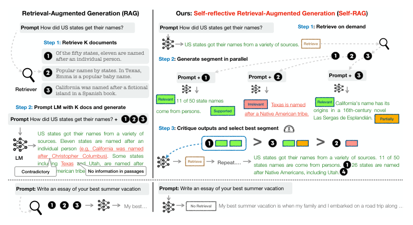
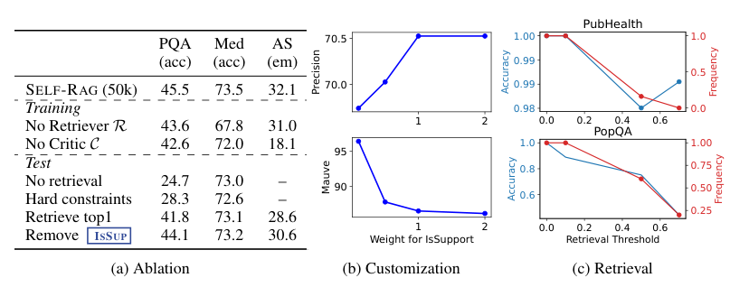
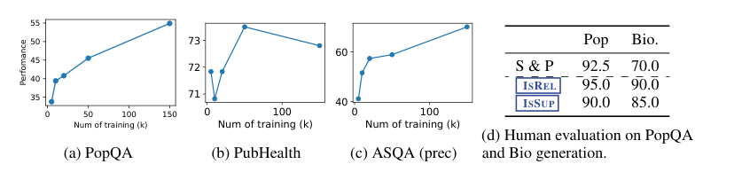
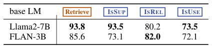

# SELF-RAG：通过自我反思学习检索、生成与批判

**（SELF-RAG: Learning to Retrieve, Generate, and Critique through Self-Reflection）**

> 本文为 Asai 等人 2023 年论文《SELF-RAG: Learning to Retrieve, Generate, and Critique through Self-Reflection》（arXiv:2310.11511v1）的中文精确翻译。

**作者**：Akari Asai†, Zeqiu Wu†, Yizhong Wang†§, Avirup Sil‡, Hannaneh Hajishirzi†§

**单位**：†华盛顿大学（University of Washington）；§艾伦人工智能研究所（Allen Institute for AI）；‡IBM Research AI

**联系方式**：{akari,zeqiuwu,yizhongw,hannaneh}@cs.washington.edu, avi@us.ibm.com

---

## 摘要

尽管大型语言模型（Large Language Models，LLMs）能力卓越，但由于它们仅依赖所封装的参数化知识，其生成的回答常常包含事实性错误。检索增强生成（Retrieval-Augmented Generation，RAG）是一种为语言模型（LM）增强相关知识的即席（ad hoc）方法，可以减少此类问题。然而，无论检索是否必要、检索到的段落是否相关，都不加区分地检索并纳入固定数量的段落，会削弱语言模型的通用性，或导致生成无用的回答。我们提出一种名为**自反思式检索增强生成（Self-Reflective Retrieval-Augmented Generation，SELF-RAG）**的新框架，通过检索和自我反思来提升语言模型的质量与事实性。我们的框架训练一个单一的任意语言模型，使其按需自适应地检索段落，并使用称为**反思令牌（reflection tokens）**的特殊令牌来生成并反思检索到的段落及其自身的生成内容。生成反思令牌使语言模型在推理阶段变得可控，从而能够针对多样化的任务需求定制其行为。实验表明，SELF-RAG（7B 和 13B 参数）在一系列多样化的任务上显著优于最先进的大型语言模型和检索增强模型。具体而言，SELF-RAG 在开放域问答、推理和事实核查任务上优于 ChatGPT 和检索增强的 Llama2-chat，并且在长文本生成方面，相对于这些模型，在提升事实性和引用准确率上取得了显著增益。¹

> ¹ 我们的代码和训练好的模型可在 <https://selfrag.github.io/> 获取。

---

## 1 引言

尽管模型和数据规模不断增大（Ouyang et al., 2022），最先进的大型语言模型（LLMs）仍然难以避免事实性错误（Mallen et al., 2023; Min et al., 2023）。检索增强生成（RAG）方法（图 1 左；Lewis et al. 2020; Guu et al. 2020）用相关检索段落来增强 LLM 的输入，从而减少知识密集型任务中的事实性错误（Ram et al., 2023; Asai et al., 2023a）。然而，这些方法可能会阻碍 LLM 的通用性，或引入不必要或偏离主题的段落而导致低质量的生成（Shi et al., 2023），因为它们在检索段落时并不区分事实性依据是否有帮助。此外，由于模型没有被显式训练去利用和遵循所提供段落中的事实，其输出也未必与检索到的相关段落保持一致（Gao et al., 2023）。本文提出**自反思式检索增强生成（Self-Reflective Retrieval-augmented Generation，SELF-RAG）**，通过按需检索（on-demand retrieval）和自我反思（self-reflection），在不损害其通用性的前提下提升 LLM 的生成质量，包括其事实准确性。我们以端到端的方式训练一个任意语言模型，使其在给定任务输入时，通过同时生成任务输出和穿插其中的特殊令牌（即反思令牌）来学习反思自身的生成过程。反思令牌分为**检索令牌（retrieval tokens）**和**批判令牌（critique tokens）**两类，分别表示是否需要检索以及生成质量（图 1 右）。具体而言，给定一个输入提示和先前的生成内容，SELF-RAG 首先判断用检索到的段落来增强后续生成是否有帮助。如果有帮助，它就输出一个检索令牌，按需调用检索器模型（第 1 步）。随后，SELF-RAG 并行处理多个检索到的段落，评估它们的相关性，然后生成相应的任务输出（第 2 步）。接着，它生成批判令牌来批评自己的输出，并根据事实性和整体质量选择最佳输出（第 3 步）。这一过程不同于传统的 RAG（图 1 左），后者始终为生成检索固定数量的文档，而无论检索是否必要（例如，底部的例子并不需要事实性知识），并且从不回头审视生成质量。此外，SELF-RAG 为每个片段提供引用，并附带对其输出是否得到段落支持的自我评估，从而便于事实核查。

SELF-RAG 训练一个任意 LM 生成带有反思令牌的文本，将这些令牌统一为扩展后的模型词汇表上的下一个 token 预测。我们在一个由反思令牌与检索段落交错组成的多样化文本集合上训练生成器 LM。反思令牌受强化学习中使用的奖励模型（Ziegler et al., 2019; Ouyang et al., 2022）启发，由一个训练好的批判模型离线插入到原始语料中。这消除了在训练期间托管批判模型的需要，从而降低了开销。批判模型部分地在一个由输入、输出及相应反思令牌组成的数据集上受监督训练，这些数据是通过提示一个专有 LM（即 GPT-4；OpenAI 2023）收集的。虽然我们借鉴了使用控制令牌来启动和引导文本生成的研究（Lu et al., 2022; Keskar et al., 2019），但我们训练的 LM 在生成每个片段之后使用批判令牌来评估自己的预测，将其作为生成输出的一个组成部分。

SELF-RAG 进一步支持可定制的解码算法，以满足由反思令牌预测定义的硬约束或软约束。特别是，我们的推理时算法使我们能够：(1) 针对不同的下游应用灵活调整检索频率；(2) 通过利用反思令牌，使用反思令牌概率的加权线性和作为片段分数的片段级束搜索（segment-level beam search），将模型行为定制为用户偏好。

在包括推理和长文本生成在内的六项任务上的经验结果表明，SELF-RAG 显著优于参数量更大的预训练和指令微调 LLM，以及被广泛采用、且具有更高引用准确率的 RAG 方法。特别是，SELF-RAG 在四项任务上优于检索增强的 ChatGPT，在所有任务上优于 Llama2-chat（Touvron et al., 2023）和 Alpaca（Dubois et al., 2023）。我们的分析证明了使用反思令牌进行训练和推理对于整体性能提升以及测试时模型定制（例如，平衡引用精度与完整性之间的权衡）的有效性。

---

## 2 相关工作

**检索增强生成（Retrieval-Augmented Generation）。** 检索增强生成（RAG）用检索到的文本段落来增强 LM 的输入空间（Guu et al., 2020; Lewis et al., 2020），在微调后或与现成的 LM 结合使用时，可在知识密集型任务上取得大幅改进（Ram et al., 2023）。一项较新的工作（Luo et al., 2023）对 LM 进行指令微调，将固定数量的检索段落前置到输入中；或者联合预训练检索器和 LM，然后在任务数据集上进行少样本微调（Izacard et al., 2022b）。

先前的工作通常只在开始时检索一次，而 Jiang et al. (2023) 提出在一个专有 LLM 之上自适应地检索段落用于生成，Schick et al. (2023) 则训练一个 LM 为命名实体生成 API 调用。然而，此类方法任务性能的提升往往以运行时效率（Mallen et al., 2023）、对无关上下文的鲁棒性（Shi et al., 2023）以及缺乏归因（Liu et al., 2023a; Gao et al., 2023）为代价。我们提出一种方法，训练一个任意 LM 学会为多样化的指令遵循查询按需使用检索，并引入由反思令牌引导的可控生成，以进一步提升生成质量和归因。

**同期 RAG 工作。** 若干同期工作² 针对 RAG 提出了新的训练或提示策略，以改进被广泛采用的 RAG 方法。Lin et al. (2023) 分两步在指令微调数据集上微调检索器和 LM。虽然我们也在多样化的指令遵循数据集上训练我们的模型，但 SELF-RAG 通过细粒度的自我反思实现按需检索和最佳可能模型输出的选择，使其适用范围更广、更鲁棒、更可控。Yoran et al. (2023) 使用自然语言推理模型，Xu et al. (2023) 使用摘要模型，在使用检索段落提示 LM 生成输出之前对其过滤或压缩。SELF-RAG 并行处理段落，并通过自我反思过滤掉无关段落，而无需在推理时依赖外部模型。此外，我们的自我反思机制还评估模型输出质量的其他方面，包括事实性。LATS（Zhou et al., 2023）提示现成的 LM 为问答任务搜索相关信息，并在 LM 生成的价值分数引导下通过树搜索进行生成。虽然它们的价值函数仅仅表示每次生成的总体分数，但 SELF-RAG 训练一个任意 LM 学会生成细粒度的自我反思和可定制的推理。

**使用批判进行训练和生成。** 使用来自人类反馈的强化学习（例如，近端策略优化（Proximal Policy Optimization，PPO）；Schulman et al. 2017）训练 LLM——即 RLHF——已被证明在将 LLM 与人类偏好对齐方面有效（Ouyang et al., 2022）。Wu et al. (2023) 提出使用多个奖励模型的细粒度 RLHF。虽然我们的工作也研究对检索和生成的细粒度批判，但我们在离线状态下，用来自批判模型的反思令牌增强任务示例来训练目标 LM，其训练成本远低于 RLHF。此外，SELF-RAG 中的反思令牌在推理时支持可控生成，而 RLHF 侧重于训练期间的人类偏好对齐。其他工作使用通用控制令牌来引导 LM 生成（Lu et al., 2022; Korbak et al., 2023），而 SELF-RAG 使用反思令牌来决定是否需要检索以及自我评估生成质量。Xie et al. (2023) 提出一种自我评估引导的解码框架，但他们只关注推理任务，且只有一个评估维度（推理路径一致性），并且不涉及检索。近期关于 LLM 精炼的工作（Dhuliawala et al., 2023; Madaan et al., 2023; Paul et al., 2023）提示模型迭代地生成任务输出、自然语言反馈和精炼后的任务输出，但以推理效率为代价。

> ² 所有工作均在本预印本发布后一周内发布到 arXiv。

---

## 3 SELF-RAG：学习检索、生成与批判

我们提出自反思式检索增强生成（Self-Reflective Retrieval-Augmented Generation，SELF-RAG），如图 1 所示。SELF-RAG 是一个框架，通过检索和自我反思来增强 LLM 的质量与事实性，而不牺牲 LLM 原有的创造力和通用性。我们的端到端训练让语言模型 M 在需要时基于检索到的段落生成文本，并通过学习生成特殊令牌来批评其输出。这些反思令牌（表 1）表示是否需要检索，或确认输出的相关性、支持性或完整性。相比之下，常见的 RAG 方法不加区分地检索段落，且不确保得到所引用来源的完全支持。

### 3.1 问题形式化与概述

形式化地，给定输入 x，我们训练 M 依次生成由多个片段组成的文本输出 y，即 y = [y1, …, yT]，其中 yt 表示第 t 个片段的 token 序列。³ 生成出的 yt 中的 token 包括来自原始词汇表的文本以及反思令牌（表 1）。

> ³ 在本文中，我们在实验中把一个句子视为一个片段，但我们的框架适用于任意片段单元（即子句）。

**算法 1 SELF-RAG 推理（SELF-RAG Inference）**

**Require（输入）**：生成器 LM M，检索器 R，大规模段落集合 {d1, …, dN}
1: **输入**：输入提示 x 和先前的生成 y<t；**输出**：下一个输出片段 yt
2: M 在给定 (x, y<t) 时预测 `Retrieve`
3: **if** `Retrieve == Yes` **then**
4:     使用 R 在给定 (x, y_{t−1}) 时检索相关文本段落 D        ▷ 检索
5:     对每个 d ∈ D，M 在给定 x, d 时预测 `ISREL`，并在给定 x, d, y<t 时预测 yt        ▷ 生成
6:     对每个 d ∈ D，M 在给定 x, yt, d 时预测 `ISSUP` 和 `ISUSE`        ▷ 批判
7:     基于 `ISREL`、`ISSUP`、`ISUSE` 对 yt 排序        ▷ 详见第 3.3 节
8: **else if** `Retrieve == No` **then**
9:     M_gen 在给定 x 时预测 yt        ▷ 生成
10:    M_gen 在给定 x, yt 时预测 `ISUSE`        ▷ 批判

**推理概述。** 图 1 和算法 1 展示了 SELF-RAG 在推理时的概览。对于每个 x 和先前的生成 y<t，模型解码一个检索令牌以评估检索的效用。如果不需要检索，模型就像标准 LM 那样预测下一个输出片段。如果需要检索，模型生成：一个批判令牌以评估检索段落的相关性、下一个回答片段，以及一个批判令牌以评估回答片段中的信息是否得到该段落的支持。最后，一个新的批判令牌评估回答的整体效用。⁴ 为了生成每个片段，SELF-RAG 并行处理多个段落，并使用自己生成的反思令牌对所生成的任务输出施加软约束（第 3.3 节）或硬控制（算法 1）。例如，在图 1（右）中，检索到的段落 d1 在第一个时间步被选中，因为 d2 没有提供直接证据（`ISREL` 为 Irrelevant），而 d3 的输出仅得到部分支持，d1 则得到完全支持。

**训练概述。** SELF-RAG 使任意 LM 能够通过将反思令牌统一为扩展词汇表（即原始词汇表加上反思令牌）上的下一个 token 预测，来生成带有反思令牌的文本。具体而言，我们在一个经过整理的语料上训练生成器模型 M，该语料中交错着由检索器 R 检索到的段落和由批判模型 C 预测的反思令牌（概述见附录算法 2）。我们训练 C 生成反思令牌，用于评估检索到的段落和给定任务输出的质量（第 3.2.1 节）。利用批判模型，我们通过离线地将反思令牌插入任务输出来更新训练语料。随后，我们使用常规的 LM 目标训练最终的生成器模型 M（第 3.2.2 节），使 M 能够在推理时自行生成反思令牌，而无需依赖批判模型。

> ⁴ 我们遵循 Liu et al. (2023a) 的做法，使用独立于检索段落的"感知"效用值。

### 3.2 SELF-RAG 训练

这里我们描述两个模型——批判模型 C（第 3.2.1 节）和生成器 M（第 3.2.2 节）——的监督数据收集与训练。

#### 3.2.1 训练批判模型

**批判模型的数据收集。** 为每个片段人工标注反思令牌成本高昂（Wu et al., 2023）。像 GPT-4（OpenAI, 2023）这样最先进的 LLM 可以有效地用于生成此类反馈（Liu et al., 2023b）。然而，依赖此类专有 LM 会提高 API 成本并降低可复现性（Chen et al., 2023）。我们通过提示 GPT-4 生成反思令牌来创建监督数据，然后将其知识蒸馏到内部模型 C 中。对于每组反思令牌，我们从原始训练数据中随机采样实例：{X_sample, Y_sample} ∼ {X, Y}。由于不同的反思令牌组有各自的定义和输入，如表 1 所示，我们对它们使用不同的指令提示。这里以 `Retrieve` 为例。我们用特定类型的指令（"给定一条指令，判断从网上查找一些外部文档是否有助于生成更好的回答。"）以及原始任务输入 x 和输出 y 的少样本示例（few-shot demonstrations）来提示 GPT-4，以预测合适的反思令牌作为文本：p(r|I, x, y)。人工评估表明，GPT-4 的反思令牌预测与人类评估高度一致。我们为每种类型收集 4k–20k 条监督训练数据，并将它们合并形成 C 的训练数据。附录第 D 节给出指令的完整列表，A.1 节包含更多细节和我们的分析。

**批判模型学习。** 在收集到训练数据 D_critic 之后，我们用预训练 LM 初始化 C，并使用标准的条件语言建模目标在 D_critic 上训练它，最大化似然：

max_C E_{((x,y),r)∼D_critic} log p_C(r|x, y)，r 为反思令牌。 (1)

虽然初始模型可以是任何预训练 LM，但我们使用与生成器 LM 相同的模型（即 Llama 2-7B；Touvron et al. 2023）来初始化 C。在大多数反思令牌类别上，批判模型与基于 GPT-4 的预测的一致性高于 90%（附录表 5）。

#### 3.2.2 训练生成器模型

**生成器的数据收集。** 给定一个输入-输出对 (x, y)，我们使用检索模型和批判模型来增强原始输出 y，以创建精确模拟 SELF-RAG 推理时过程（第 3.1 节）的监督数据。对于每个片段 yt ∈ y，我们运行 C 来评估额外的段落是否有助于增强生成。如果需要检索，则添加检索特殊令牌 `Retrieve =Yes`，并由 R 检索 top K 个段落 D。对于每个段落，C 进一步评估该段落是否相关并预测 `ISREL`。如果段落相关，C 进一步评估该段落是否支持模型生成并预测 `ISSUP`。批判令牌 `ISREL` 和 `ISSUP` 被附加在检索段落或生成内容之后。在输出 y（或 yT）的末尾，C 预测整体效用令牌 `ISUSE`，然后将带有反思令牌的增强输出与原始输入对一起加入 D_gen。训练数据示例见图 2。

**生成器学习。** 我们在带有反思令牌增强的整理语料 D_gen 上，使用标准的下一个 token 目标训练生成器模型 M：

max_M E_{(x,y,r)∼D_gen} log p_M(y, r|x)。 (2)

与 C 的训练（式 1）不同，M 学习预测目标输出以及反思令牌。在训练期间，我们屏蔽掉检索到的文本块（在图 2 中用 
 和 
 包围）以进行损失计算，并用一组反思令牌 {`Critique`, `Retrieve`} 扩展原始词汇表 V。

**与先前使用批判进行学习的工作的联系。** 近期的工作在训练中纳入额外的批判（反馈），例如通过 PPO 实现的 RLHF（Ouyang et al. 2022）。虽然 PPO 在训练期间依赖单独的奖励模型，但我们离线计算批判并将其直接插入训练语料，生成器 LM 使用标准的 LM 目标进行训练。与 PPO 相比，这显著降低了训练成本。我们的工作也与先前纳入特殊令牌来控制生成的工作相关（Keskar et al., 2019; Lu et al., 2022; Korbak et al., 2023）。我们的 SELF-RAG 学会在每个生成片段之后生成特殊令牌来评估自己的预测，从而能够在推理时使用软重排序机制或硬约束（下文讨论）。

### 3.3 SELF-RAG 推理

生成反思令牌来自我评估自身输出，使 SELF-RAG 在推理阶段变得可控，从而能够针对多样化的任务需求定制其行为。对于要求事实准确性的任务（Min et al., 2023），我们希望模型更频繁地检索段落，以确保输出与可用证据紧密对齐。相反，在更开放式的任务中，例如撰写个人经历作文，重点转向更少检索，并优先考虑整体创造力或效用分数。在本节中，我们描述在推理过程中施加控制以满足这些不同目标的方法。

**带阈值的自适应检索。** SELF-RAG 通过预测 `Retrieve` 来动态决定何时检索文本段落。或者，我们的框架允许设置一个阈值。具体而言，如果生成 `Retrieve =Yes` 令牌的概率（在 `Retrieve` 的所有输出令牌上归一化后）超过指定阈值，我们就触发检索（详见附录第 A.3 节）。

**带批判令牌的树解码。** 在每个片段步骤 t，当需要检索时（基于硬或软条件），R 检索 K 个段落，生成器 M 并行处理每个段落并输出 K 个不同的续写候选。我们执行片段级束搜索（束大小 = B），在每个时间戳 t 获得 top-B 个片段续写，并在生成结束时返回最佳序列。每个片段 yt 相对于段落 d 的分数用批判分数 S 更新，S 是每种批判令牌类型的归一化概率的线性加权和。对于每个批判令牌组 G（例如 `ISREL`），我们将其在时间戳 t 的分数记为 s_G^t，并按如下方式计算片段分数：

f(y_t, d, `Critique`) = p(y_t|x, d, y<t) + S(`Critique`)，其中 (3)

S(`Critique`) = Σ_{G∈G} w_G s_G^t，其中 G = {`ISREL`, `ISSUP`, `ISUSE`}， (4)

其中 s_G^t = p_t(ˆr) / Σ_{i=1}^{N_G} p_t(r_i)，表示批判令牌类型 G 的最理想反思令牌 ˆr（例如 `ISREL` =Relevant）的生成概率，N_G 为（表示 G 的不同可能取值的）不同令牌的数量。式 4 中的权重 w_G 是超参数，可在推理时调整，以在测试时实现定制行为。例如，为确保结果 y 大多得到证据支持，我们可以将 `ISSUP` 分数的权重项设得更高，同时相对降低其他方面的权重。或者，我们可以在解码期间使用 `Critique` 进一步施加硬约束。我们可以不使用式 4 中的软奖励函数，而是在模型生成不理想的 `Critique` 令牌（例如 `ISSUP` =No support）时显式过滤掉该片段续写。在多个偏好之间进行权衡已在 RLHF（Touvron et al., 2023; Wu et al., 2023）中有所研究，这通常需要训练来改变模型行为。SELF-RAG 则在无需额外训练的情况下定制 LM。

---

## 4 实验

### 4.1 任务与数据集

我们在一系列下游任务上对 SELF-RAG 和各种基线进行评估，使用旨在评估整体正确性、事实性和流畅性的指标来全面评估输出。在这些实验中，我们进行零样本评估，即只提供描述任务的指令而不提供少样本示例（Wei et al., 2022; Sanh et al., 2022）。实验设置的细节，包括测试时指令，见附录第 B.1 节。

**闭集任务**包括两个数据集，即一个关于公共卫生的事实核查数据集（PubHealth；Zhang et al. 2023）和一个从科学考试中创建的多选题推理数据集（ARC-Challenge；Clark et al. 2018）。我们使用准确率作为评估指标，并在测试集上报告。对于这两个数据集，我们聚合目标类别的答案概率（附录第 B.2 节）。

**短文本生成任务**包括两个开放域问答（open-domain question answering，QA）数据集，PopQA（Mallen et al., 2023）和 TriviaQA-unfiltered（Joshi et al., 2017），系统需要回答关于事实性知识的任意问题。对于 PopQA，我们使用长尾子集，包含 1,399 个稀有实体查询，其月度维基百科页面浏览量低于 100。由于 TriviaQA-unfiltered（开放）测试集未公开，我们遵循先前工作的验证集与测试集划分（Min et al., 2019; Guu et al., 2020），使用 11,313 个测试查询进行评估。遵循 Mallen et al. (2023); Schick et al. (2023) 的做法，我们基于模型生成中是否包含黄金答案来评估性能，而非严格要求精确匹配。

**长文本生成任务**包括一个传记生成任务（Min et al., 2023）和一个长文本问答任务 ALCE-ASQA（Gao et al. 2023; Stelmakh et al. 2022）。我们使用 FactScore（Min et al., 2023）评估传记，并使用官方指标——正确性（str-em）、基于 MAUVE 的流畅性（Pillutla et al., 2021），以及 ASQA 的引用精确率和召回率（Gao et al., 2023）。⁵

### 4.2 基线

**不使用检索的基线。** 我们评估强大的公开预训练 LLM：Llama2 7B, 13B（Touvron et al., 2023）；指令微调模型 Alpaca 7B, 13B（Dubois et al., 2023）（我们基于 Llama2 的复现）；以及使用私有数据训练和强化学习的模型 ChatGPT（Ouyang et al., 2022）和 Llama2-chat 13B。对于指令微调 LM，如果公开可用，我们使用训练时使用的官方系统提示或指令格式。我们还将我们的方法与同期工作 CoVE 65B（Dhuliawala et al., 2023）进行比较，后者引入迭代式提示工程来改进 LLM 生成的事实性。

**使用检索的基线。** 我们评估在测试时或训练期间用检索增强的模型。第一类包括标准 RAG 基线，其中 LM（Llama2、Alpaca）在给定查询前置 top 检索文档的情况下生成输出，使用的检索器与我们的系统相同。它还包括 Llama2-FT，即在所有我们使用的训练数据上微调 Llama2，但不使用反思令牌或检索段落。我们还报告使用私有数据训练的 LM 的检索增强基线结果：Ret-ChatGPT 和 Ret-Llama2-chat，它们部署了与上述相同的增强技术，以及 perplexity.ai，一个基于 InstructGPT 的生产级搜索系统。

第二类包括使用检索文本段落训练的同期方法，即 SAIL（Luo et al., 2023），它在 Alpaca 指令微调数据上对 LM 进行指令微调，将 top 检索文档插入指令之前；以及 Toolformer（Schick et al., 2023），它使用 API 调用（例如维基百科 API）预训练 LM。⁶

### 4.3 实验设置

**训练数据与设置。** 我们的训练数据由多样化的指令遵循输入-输出对组成。具体而言，我们从 Open-Instruct 处理后的数据（Wang et al., 2023）和知识密集型数据集（Petroni et al., 2021; Stelmakh et al., 2022; Mihaylov et al., 2018）中采样实例。总共我们使用 150k 条指令-输出对。我们使用 Llama2 7B 和 13B（Touvron et al., 2023）作为生成器基础 LM，并使用 Llama2 7B 作为基础批判 LM。对于检索器模型 R，我们默认使用现成的 Contriever-MS MARCO（Izacard et al., 2022a），并为每个输入检索最多十个文档。更多训练细节见附录第 B.1 节。

**推理设置。** 作为默认配置，我们分别将 `ISREL`、`ISSUP`、`ISUSE` 的权重项设为 1.0、1.0 和 0.5。为鼓励频繁检索，我们将检索阈值设为 0.2（大多数任务），ALCE（Gao et al., 2023）因引用要求设为 0。我们使用 vllm（Kwon et al., 2023）加速推理。在每个片段级别，我们采用束宽 2。对于 token 级生成，我们使用贪心解码。默认情况下，我们使用 Contriever-MS MARCO（Izacard et al., 2022a）的 top 五个文档；对于传记和开放域 QA，我们遵循 Luo et al. (2023) 的做法，额外使用网络搜索引擎检索的 top 五个文档；对于 ASQA，我们在所有基线上统一使用作者提供的 GTR-XXL（Ni et al., 2022）top 5 文档，以实现公平比较。

> ⁵ <https://github.com/princeton-nlp/ALCE>
> ⁶ 由于实现不可用，我们报告论文中报告的数字。

---

## 5 结果与分析

### 5.1 主要结果

**与不使用检索的基线的比较。** 表 2（顶部）展示了不使用检索的基线。我们的 SELF-RAG（底部两行）在所有任务上均表现出相对监督微调 LLM 的显著性能优势，甚至在 PubHealth、PopQA、传记生成和 ASQA（Rouge 和 MAUVE）上优于 ChatGPT。我们的方法还显著优于采用复杂提示工程的同期方法；具体而言，在传记生成任务上，我们的 7B 和 13B 模型优于同期方法 CoVE（Dhuliawala et al., 2023），后者迭代地提示 Llama2 65B 来精炼输出。

**与使用检索的基线的比较。** 如表 2（底部）所示，我们的 SELF-RAG 在许多任务上也优于现有的 RAG，在所有任务上取得基于非专有 LM 模型中的最佳性能。虽然我们的方法优于其他基线，但在 PopQA 或 Bio 上，带检索的强指令微调 LM（例如 Llama2-chat、Alpaca）相比其无检索基线显示出大幅增益。然而，我们发现，对于不能简单复制或抽取检索段落子串的任务，这些基线提供的解决方案有限。在 PubHealth 和 ARC-Challenge 上，带检索的基线相比其无检索对应版本性能提升不显著。我们还观察到，大多数带检索的基线都难以提高引用准确率。在 ASQA 上，我们的模型表现出除 ChatGPT 之外所有模型中显著更高的引用精确率和召回率。Gao et al. (2023) 发现 ChatGPT 在此特定任务上始终表现出优越的效能，超越较小的 LM。我们的 SELF-RAG 弥合了这一性能差距，甚至在引用精确率（衡量模型生成的论断是否完全得到所引用证据的支持）上优于 ChatGPT。我们还发现，在事实精确率指标上，SELF-RAG 7B 偶尔优于我们的 13B，这是由于较小的 SELF-RAG 倾向于经常生成精确有据但较短的输出。Llama2-FT 7B 是在与 SELF-RAG 相同的指令-输出对上训练、但无检索或自我反思、且仅在测试时用检索增强的基线 LM，其性能落后于 SELF-RAG。这一结果表明，SELF-RAG 的增益并非仅仅来自训练数据，从而证明了 SELF-RAG 框架的有效性。

### 5.2 分析

**消融研究。** 我们对我们框架进行一组消融实验，以识别哪些因素起关键作用。我们评估了两个与我们的模型训练方式不同的模型变体：No Retriever 使用标准的指令遵循方法，仅给定指令-输出对训练 LM，不使用检索段落；No Critic 训练的 LM，其输入-输出对总是用 top-1 检索文档增强，但不使用反思令牌。这类似于 SAIL（Luo et al., 2023），而我们使用我们的指令-输出数据，而非像 SAIL 那样使用 Alpaca 数据集（Dubois et al., 2023）。我们还对推理时算法进行消融，包括 No retrieval 在推理时禁用检索；Hard constraints 表示在 `Retrieve =Yes` 时检索、而非使用自适应阈值的模型性能；Retrieve top 1 总是检索并仅使用 top-1 文档，类似于标准 RAG 方法；Remove `ISSUP` 表示在式 4 的批判引导束搜索中仅移除 `ISSUP` 分数的模型性能。在此消融实验中，我们使用 50k 的训练实例规模，以更高效地探索训练变体。本节稍后，我们对训练数据规模的影响进行分析。我们在三个数据集 PopQA、PubHealth 和 ASQA 上进行消融研究。在 ASQA 上，我们在采样的 150 个实例上评估模型，并排除涉及自适应或无检索过程的消融项。

我们在表 3a 中展示消融结果。表的顶部展示训练消融的结果，底部是推理消融的结果。我们看到所有组件都起重要作用。我们还观察到 SELF-RAG 与 No Retriever 或 No Critic 基线之间在所有任务上都存在较大的性能差距，表明用这些模型训练 LM 对 SELF-RAG 的性能增益贡献巨大。像传统 RAG 方法那样不加区分其相关性使用 top 段落（Retrieve top 1）会导致 PopQA 和 ASQA 大幅下降，而在束搜索中移除 `ISSUP` 会损害 ASQA 的性能。这证明了 SELF-RAG 基于细粒度的多重标准谨慎选择生成的能力是有效的，而不是天真地使用检索模型的所有 top 段落或仅仅依赖相关性分数。

**推理时定制的影响。** 我们提出的框架的一个关键优势是，它使我们能够控制每种批判类型对最终生成采样的影响程度。我们在 ASQA 上分析不同参数权重在我们 7B 模型上的影响，该任务考虑多个评估方面。图 3b 展示了改变 `ISSUP`（批评输出在多大程度上得到文本段落支持）权重项的影响。如图所示，增大权重对模型的引用精确率产生积极影响，因为这更强调模型生成是否得到证据支持。相反，较大的权重会导致较低的 MAUVE 分数：当生成变得更长、更流畅时，往往会有更多论断未被引用完全支持，这与 Liu et al. (2023a) 的发现一致。我们的框架让实践者可以通过调整此类参数在测试时选择和定制模型行为，而无需额外训练。

**效率与准确率的权衡。** 使用我们的框架，实践者可以利用奖励令牌的 token 概率来调整检索发生的频率。我们评估这一自适应阈值如何影响整体准确率和检索频率，并在 PubHealth 和 PopQA 上评估不同阈值 δ（更大的 δ 导致更少的检索）下的性能。图 3c 显示，随着 δ 变化，模型在两个数据集上的检索频率都发生显著变化。一方面，减少检索导致的性能下降在 PubHealth 上较小，而在 PopQA 上较大。

**训练数据规模的影响。** 我们分析数据规模如何影响模型性能。具体而言，我们从原始 150k 训练实例中随机采样 5k、10k、20k 和 50k 实例，并在这些子集上微调四个 SELF-RAG 7B 变体。然后，我们在 PopQA、PubHealth 和 ASQA（引用精确率）上将这些模型性能与在完整 150k 实例上训练的最终 SELF-RAG 进行比较。图 4a、4b 和 4c 展示了在不同数据量上训练的模型性能。在所有数据集上，增大数据规模通常呈现上升趋势，且在 PopQA 和 ASQA 上的提升显著更大，而当将 Llama2-FT 7B 的训练数据从 50k 增加到 150k 时，我们没有观察到如此显著的提升。这些结果还表明，进一步扩展 SELF-RAG 的训练数据可能会带来进一步的改进，尽管在本工作中我们将训练数据规模限制为 150k。

**人工评估。** 我们对 SELF-RAG 的输出以及预测反思令牌的可靠性进行了小规模人工评估。具体而言，我们从 PopQA 和 Bio 结果中采样了 50 个样本。遵循 Menick et al. (2022) 的做法，人工标注者评估 S&P，它表示模型输出是否合理（plausible，即输出是对问题的合理且切题的回答，就像在对话中自然出现的那样）且得到支持（supported，即所提供的证据足以验证答案的有效性）。对于 S&P，我们不考虑 SELF-RAG 预测为无关或无支持的实例。然后我们请标注者判断模型预测的关于 `ISREL` 和 `ISSUP` 的反思令牌是否与他们的检查一致（例如，完全支持的输出是否确实得到所引用证据的支持）。人工标注者发现 SELF-RAG 的回答通常是合理的，且得到相关段落的支持，在短文本 PopQA 上 S&P 分数更高，这与 Menick et al. (2022) 一致。人工标注者还发现 `ISREL` 和 `ISSUP` 反思令牌的预测大多与他们的评估一致。附录表 6 展示了若干带标注的示例和评估说明。

---

## 6 结论

本文提出 SELF-RAG，一种通过按需检索和自我反思来增强 LLM 质量和事实性的新框架。SELF-RAG 训练一个 LM，通过从其原始词汇表以及新添加的特殊令牌（称为反思令牌）中预测下一个 token，来学习检索、生成和批判文本段落及其自身的生成。SELF-RAG 进一步支持在测试时利用反思令牌来定制 LM 行为。我们在六项任务上使用多个指标的全面评估表明，SELF-RAG 显著优于参数量更大的 LLM 或使用传统检索增强生成方法的模型。

---

## 伦理关切

本工作旨在改进 LLM 输出的事实性，事实性的缺失持续导致大量现实世界问题（例如，错误信息的传播以及提供不正确和危险的建议）。虽然我们的方法在性能、事实性和引用准确率方面显示出显著改进，但它仍可能生成未得到引用完全支持的输出。我们希望显式的自我反思和细粒度的归因可以帮助用户核查模型输出中的事实性错误。

---

## 致谢

我们感谢 Sewon Min、Scott Wen-tau Yih、Sean Welleck 和 Kawin Ethayarajh 在本工作早期阶段富有成效的讨论。我们感谢 Sewon Min、Joongwon (Daniel) Kim 和 Sandy Kaplan 对本文的宝贵反馈，以及 Tianyu Gao 和 Weijia Shi 在评估方面的帮助。Akari Asai 得到 IBM Fellowship 的支持。我们感谢 Stability AI 为训练和评估本文中的 LM 提供计算资源，以及 Microsoft Accelerate Foundation Models Research Program 提供 OpenAI API 的访问权限。本工作部分由 DARPA MCS 项目（通过 NIWC Pacific，N66001-19-2-4031）、NSF IIS-2044660 以及 AI2 的资助支持。

---

## 参考文献

Akari Asai, Kazuma Hashimoto, Hannaneh Hajishirzi, Richard Socher, and Caiming Xiong. Learning to retrieve reasoning paths over wikipedia graph for question answering. In International Conference on Learning Representations, 2020. URL https://openreview.net/forum?id=SJgVHkrYDH.

Akari Asai, Sewon Min, Zexuan Zhong, and Danqi Chen. Retrieval-based language models and applications. In Proceedings of the 61st Annual Meeting of the Association for Computational Linguistics (Tutorial), 2023a. URL https://aclanthology.org/2023.acl-tutorials.6.

Akari Asai, Timo Schick, Patrick Lewis, Xilun Chen, Gautier Izacard, Sebastian Riedel, Hannaneh Hajishirzi, and Wen-tau Yih. Task-aware retrieval with instructions. In Findings of the Association for Computational Linguistics, 2023b. URL https://aclanthology.org/2023.findings-acl.225.

Bernd Bohnet, Vinh Q Tran, Pat Verga, Roee Aharoni, Daniel Andor, Livio Baldini Soares, Jacob Eisenstein, Kuzman Ganchev, Jonathan Herzig, Kai Hui, et al. Attributed question answering: Evaluation and modeling for attributed large language models. arXiv preprint arXiv:2212.08037, 2022. URL https://arxiv.org/abs/2212.08037.

Lingjiao Chen, Matei Zaharia, and James Zou. How is chatgpt's behavior changing over time? arXiv preprint arXiv:2307.09009, 2023. URL https://arxiv.org/abs/2307.09009.

Peter Clark, Isaac Cowhey, Oren Etzioni, Tushar Khot, Ashish Sabharwal, Carissa Schoenick, and Oyvind Tafjord. Think you have solved question answering? try arc, the ai2 reasoning challenge. arXiv preprint arXiv:1803.05457, 2018. URL https://arxiv.org/abs/1803.05457.

Tri Dao, Dan Fu, Stefano Ermon, Atri Rudra, and Christopher Ré. Flashattention: Fast and memory-efficient exact attention with io-awareness. In Advances in Neural Information Processing Systems, 2022. URL https://openreview.net/forum?id=H4DqfPSibmx.

Shehzaad Dhuliawala, Mojtaba Komeili, Jing Xu, Roberta Raileanu, Xian Li, Asli Celikyilmaz, and Jason Weston. Chain-of-verification reduces hallucination in large language models. arXiv preprint arXiv:2309.11495, 2023. URL https://arxiv.org/abs/2309.11495.

Emily Dinan, Stephen Roller, Kurt Shuster, Angela Fan, Michael Auli, and Jason Weston. Wizard of wikipedia: Knowledge-powered conversational agents. In International Conference on Learning Representations, 2019. URL https://openreview.net/forum?id=r1l73iRqKm.

Yann Dubois, Xuechen Li, Rohan Taori, Tianyi Zhang, Ishaan Gulrajani, Jimmy Ba, Carlos Guestrin, Percy Liang, and Tatsunori B. Hashimoto. Alpacafarm: A simulation framework for methods that learn from human feedback. arXiv preprint arXiv:2305.14387, 2023. URL https://arxiv.org/abs/2305.14387.

Tianyu Gao, Howard Yen, Jiatong Yu, and Danqi Chen. Enabling large language models to generate text with citations. arXiv preprint arXiv:2305.14627, 2023. URL https://arxiv.org/abs/2305.14627.

Kelvin Guu, Kenton Lee, Zora Tung, Panupong Pasupat, and Mingwei Chang. Retrieval augmented language model pre-training. In International Conference on Machine Learning, 2020. URL https://dl.acm.org/doi/pdf/10.5555/3524938.3525306.

Gautier Izacard, Mathilde Caron, Lucas Hosseini, Sebastian Riedel, Piotr Bojanowski, Armand Joulin, and Edouard Grave. Unsupervised dense information retrieval with contrastive learning. Transactions on Machine Learning Research, 2022a. URL https://openreview.net/forum?id=jKN1pXi7b0.

Gautier Izacard, Patrick Lewis, Maria Lomeli, Lucas Hosseini, Fabio Petroni, Timo Schick, Jane Dwivedi-Yu, Armand Joulin, Sebastian Riedel, and Edouard Grave. Few-shot learning with retrieval augmented language models. arXiv preprint arXiv:2208.03299, 2022b. URL https://arxiv.org/abs/2208.03299.

Zhengbao Jiang, Frank F Xu, Luyu Gao, Zhiqing Sun, Qian Liu, Jane Dwivedi-Yu, Yiming Yang, Jamie Callan, and Graham Neubig. Active retrieval augmented generation. arXiv preprint arXiv:2305.06983, 2023. URL https://arxiv.org/abs/2305.06983.

Mandar Joshi, Eunsol Choi, Daniel Weld, and Luke Zettlemoyer. TriviaQA: A large scale distantly supervised challenge dataset for reading comprehension. In Proceedings of the 55th Annual Meeting of the Association for Computational Linguistics (Volume 1: Long Papers), 2017. URL https://aclanthology.org/P17-1147.

Nitish Shirish Keskar, Bryan McCann, Lav R Varshney, Caiming Xiong, and Richard Socher. Ctrl: A conditional transformer language model for controllable generation. arXiv preprint arXiv:1909.05858, 2019. URL https://arxiv.org/abs/1909.05858.

Tomasz Korbak, Kejian Shi, Angelica Chen, Rasika Vinayak Bhalerao, Christopher Buckley, Jason Phang, Samuel R Bowman, and Ethan Perez. Pretraining language models with human preferences. In International Conference on Machine Learning, 2023. URL https://openreview.net/forum?id=AT8Iw8KOeC.

Tom Kwiatkowski, Jennimaria Palomaki, Olivia Redfield, Michael Collins, Ankur Parikh, Chris Alberti, Danielle Epstein, Illia Polosukhin, Jacob Devlin, Kenton Lee, Kristina Toutanova, Llion Jones, Matthew Kelcey, Ming-Wei Chang, Andrew M. Dai, Jakob Uszkoreit, Quoc Le, and Slav Petrov. Natural questions: A benchmark for question answering research. Transactions of the Association for Computational Linguistics, 2019. URL https://aclanthology.org/Q19-1026.

Woosuk Kwon, Zhuohan Li, Siyuan Zhuang, Ying Sheng, Lianmin Zheng, Cody Hao Yu, Joseph E. Gonzalez, Hao Zhang, and Ion Stoica. Efficient memory management for large language model serving with pagedattention. In Proceedings of the ACM SIGOPS 29th Symposium on Operating Systems Principles, 2023. URL https://arxiv.org/abs/2309.06180.

Patrick Lewis, Ethan Perez, Aleksandra Piktus, Fabio Petroni, Vladimir Karpukhin, Naman Goyal, Heinrich Küttler, Mike Lewis, Wen-tau Yih, Tim Rocktäschel, Sebastian Riedel, and Douwe Kiela. Retrieval-augmented generation for knowledge-intensive nlp tasks. In Advances in Neural Information Processing Systems, 2020. URL https://proceedings.neurips.cc/paper/2020/file/6b493230205f780e1bc26945df7481e5-Paper.pdf.

Xi Victoria Lin, Xilun Chen, Mingda Chen, Weijia Shi, Maria Lomeli, Rich James, Pedro Rodriguez, Jacob Kahn, Gergely Szilvasy, Mike Lewis, Luke Zettlemoyer, and Scott Yih. Ra-dit: Retrieval-augmented dual instruction tuning, 2023. URL https://arxiv.org/abs/2310.01352.

Nelson F Liu, Tianyi Zhang, and Percy Liang. Evaluating verifiability in generative search engines. arXiv preprint arXiv:2304.09848, 2023a. URL https://arxiv.org/abs/2304.09848.

Yang Liu, Dan Iter, Yichong Xu, Shuohang Wang, Ruochen Xu, and Chenguang Zhu. Gpteval: Nlg evaluation using gpt-4 with better human alignment. arXiv preprint arXiv:2303.16634, 2023b. URL https://arxiv.org/abs/2303.16634.

Ximing Lu, Sean Welleck, Jack Hessel, Liwei Jiang, Lianhui Qin, Peter West, Prithviraj Ammanabrolu, and Yejin Choi. QUARK: Controllable text generation with reinforced unlearning. In Advances in Neural Information Processing Systems, 2022. URL https://openreview.net/forum?id=5HaIds3ux5O.

Hongyin Luo, Yung-Sung Chuang, Yuan Gong, Tianhua Zhang, Yoon Kim, Xixin Wu, Danny Fox, Helen Meng, and James Glass. Sail: Search-augmented instruction learning. arXiv preprint arXiv:2305.15225, 2023. URL https://arxiv.org/abs/2305.15225.

Aman Madaan, Niket Tandon, Prakhar Gupta, Skyler Hallinan, Luyu Gao, Sarah Wiegreffe, Uri Alon, Nouha Dziri, Shrimai Prabhumoye, Yiming Yang, Shashank Gupta, Bodhisattwa Prasad Majumder, Katherine Hermann, Sean Welleck, Amir Yazdanbakhsh, and Peter Clark. Self-refine: Iterative refinement with self-feedback. arXiv preprint arXiv:2303.17651, 2023. URL https://arxiv.org/abs/2303.17651.

Alex Mallen, Akari Asai, Victor Zhong, Rajarshi Das, Daniel Khashabi, and Hannaneh Hajishirzi. When not to trust language models: Investigating effectiveness of parametric and non-parametric memories. In Proceedings of the 61st Annual Meeting of the Association for Computational Linguistics (Volume 1: Long Papers), 2023. URL https://aclanthology.org/2023.acl-long.546.

Jacob Menick, Maja Trebacz, Vladimir Mikulik, John Aslanides, Francis Song, Martin Chadwick, Mia Glaese, Susannah Young, Lucy Campbell-Gillingham, Geoffrey Irving, et al. Teaching language models to support answers with verified quotes. arXiv preprint arXiv:2203.11147, 2022. URL https://arxiv.org/abs/2203.11147.

Todor Mihaylov, Peter Clark, Tushar Khot, and Ashish Sabharwal. Can a suit of armor conduct electricity? a new dataset for open book question answering. In Proceedings of the 2018 Conference on Empirical Methods in Natural Language Processing, 2018. URL https://aclanthology.org/D18-1260.

Sewon Min, Danqi Chen, Hannaneh Hajishirzi, and Luke Zettlemoyer. A discrete hard EM approach for weakly supervised question answering. In Proceedings of the 2019 Conference on Empirical Methods in Natural Language Processing and the 9th International Joint Conference on Natural Language Processing (EMNLP-IJCNLP), 2019. URL https://aclanthology.org/D19-1284.

Sewon Min, Kalpesh Krishna, Xinxi Lyu, Mike Lewis, Wen-tau Yih, Pang Wei Koh, Mohit Iyyer, Luke Zettlemoyer, and Hannaneh Hajishirzi. Factscore: Fine-grained atomic evaluation of factual precision in long form text generation. arXiv preprint arXiv:2305.14251, 2023. URL https://arxiv.org/abs/2305.14251.

Reiichiro Nakano, Jacob Hilton, Suchir Balaji, Jeff Wu, Long Ouyang, Christina Kim, Christopher Hesse, Shantanu Jain, Vineet Kosaraju, William Saunders, et al. Webgpt: Browser-assisted question-answering with human feedback. arXiv preprint arXiv:2112.09332, 2021. URL https://arxiv.org/abs/2112.09332.

Jianmo Ni, Chen Qu, Jing Lu, Zhuyun Dai, Gustavo Hernandez Abrego, Ji Ma, Vincent Zhao, Yi Luan, Keith Hall, Ming-Wei Chang, and Yinfei Yang. Large dual encoders are generalizable retrievers. In Proceedings of the 2022 Conference on Empirical Methods in Natural Language Processing, 2022. URL https://aclanthology.org/2022.emnlp-main.669.

OpenAI. Gpt-4 technical report. arXiv preprint arXiv:2303.08774, 2023. URL https://arxiv.org/abs/2303.08774.

Long Ouyang, Jeffrey Wu, Xu Jiang, Diogo Almeida, Carroll Wainwright, Pamela Mishkin, Chong Zhang, Sandhini Agarwal, Katarina Slama, Alex Gray, John Schulman, Jacob Hilton, Fraser Kelton, Luke Miller, Maddie Simens, Amanda Askell, Peter Welinder, Paul Christiano, Jan Leike, and Ryan Lowe. Training language models to follow instructions with human feedback. In Advances in Neural Information Processing Systems, 2022. URL https://openreview.net/forum?id=TG8KACxEON.

Debjit Paul, Mete Ismayilzada, Maxime Peyrard, Beatriz Borges, Antoine Bosselut, Robert West, and Boi Faltings. Refiner: Reasoning feedback on intermediate representations. arXiv preprint arXiv:2304.01904, 2023. URL https://arxiv.org/abs/2304.01904.

Fabio Petroni, Aleksandra Piktus, Angela Fan, Patrick Lewis, Majid Yazdani, Nicola De Cao, James Thorne, Yacine Jernite, Vladimir Karpukhin, Jean Maillard, Vassilis Plachouras, Tim Rocktäschel, and Sebastian Riedel. KILT: a benchmark for knowledge intensive language tasks. In Proceedings of the 2021 Conference of the North American Chapter of the Association for Computational Linguistics: Human Language Technologies, 2021. URL https://aclanthology.org/2021.naacl-main.200.

Krishna Pillutla, Swabha Swayamdipta, Rowan Zellers, John Thickstun, Sean Welleck, Yejin Choi, and Zaid Harchaoui. MAUVE: Measuring the gap between neural text and human text using divergence frontiers. In Advances in Neural Information Processing Systems, 2021. URL https://openreview.net/forum?id=Tqx7nJp7PR.

Samyam Rajbhandari, Jeff Rasley, Olatunji Ruwase, and Yuxiong He. Zero: Memory optimizations toward training trillion parameter models. In Proceedings of the International Conference for High Performance Computing, Networking, Storage and Analysis, 2020. URL https://dl.acm.org/doi/10.5555/3433701.3433727.

Ori Ram, Yoav Levine, Itay Dalmedigos, Dor Muhlgay, Amnon Shashua, Kevin Leyton-Brown, and Yoav Shoham. In-context retrieval-augmented language models. Transactions of the Association for Computational Linguistics, 2023. URL https://arxiv.org/abs/2302.00083.

Victor Sanh, Albert Webson, Colin Raffel, Stephen Bach, Lintang Sutawika, Zaid Alyafeai, Antoine Chaffin, Arnaud Stiegler, Arun Raja, Manan Dey, M Saiful Bari, Canwen Xu, Urmish Thakker, Shanya Sharma Sharma, Eliza Szczechla, Taewoon Kim, Gunjan Chhablani, Nihal Nayak, Debajyoti Datta, Jonathan Chang, Mike Tian-Jian Jiang, Han Wang, Matteo Manica, Sheng Shen, Zheng Xin Yong, Harshit Pandey, Rachel Bawden, Thomas Wang, Trishala Neeraj, Jos Rozen, Abheesht Sharma, Andrea Santilli, Thibault Fevry, Jason Alan Fries, Ryan Teehan, Teven Le Scao, Stella Biderman, Leo Gao, Thomas Wolf, and Alexander M Rush. Multitask prompted training enables zero-shot task generalization. In International Conference on Learning Representations, 2022. URL https://openreview.net/forum?id=9Vrb9D0WI4.

Timo Schick, Jane Dwivedi-Yu, Roberto Dessì, Roberta Raileanu, Maria Lomeli, Luke Zettlemoyer, Nicola Cancedda, and Thomas Scialom. Toolformer: Language models can teach themselves to use tools. arXiv preprint arXiv:2302.04761, 2023. URL https://arxiv.org/abs/2302.04761.

John Schulman, Filip Wolski, Prafulla Dhariwal, Alec Radford, and Oleg Klimov. Proximal policy optimization algorithms. arXiv preprint arXiv:1707.06347, 2017. URL https://arxiv.org/abs/1707.06347.

Freda Shi, Xinyun Chen, Kanishka Misra, Nathan Scales, David Dohan, Ed H. Chi, Nathanael Schärli, and Denny Zhou. Large language models can be easily distracted by irrelevant context. In Proceedings of the 40th International Conference on Machine Learning, 2023. URL https://proceedings.mlr.press/v202/shi23a.html.

Ivan Stelmakh, Yi Luan, Bhuwan Dhingra, and Ming-Wei Chang. ASQA: Factoid questions meet long-form answers. In Proceedings of the 2022 Conference on Empirical Methods in Natural Language Processing, 2022. URL https://aclanthology.org/2022.emnlp-main.566.

James Thorne, Andreas Vlachos, Christos Christodoulopoulos, and Arpit Mittal. FEVER: a large-scale dataset for fact extraction and VERification. In Proceedings of the 2018 Conference of the North American Chapter of the Association for Computational Linguistics: Human Language Technologies, Volume 1 (Long Papers), 2018. URL https://aclanthology.org/N18-1074.

Hugo Touvron, Louis Martin, Kevin Stone, Peter Albert, Amjad Almahairi, Yasmine Babaei, Nikolay Bashlykov, Soumya Batra, Prajjwal Bhargava, Shruti Bhosale, et al. Llama 2: Open foundation and fine-tuned chat models. arXiv preprint arXiv:2307.09288, 2023. URL https://arxiv.org/abs/2307.09288.

Yizhong Wang, Hamish Ivison, Pradeep Dasigi, Jack Hessel, Tushar Khot, Khyathi Raghavi Chandu, David Wadden, Kelsey MacMillan, Noah A Smith, Iz Beltagy, et al. How far can camels go? exploring the state of instruction tuning on open resources. arXiv preprint arXiv:2306.04751, 2023. URL https://arxiv.org/abs/2306.04751.

Jason Wei, Maarten Bosma, Vincent Zhao, Kelvin Guu, Adams Wei Yu, Brian Lester, Nan Du, Andrew M. Dai, and Quoc V Le. Finetuned language models are zero-shot learners. In International Conference on Learning Representations, 2022. URL https://openreview.net/forum?id=gEZrGCozdqR.

Zeqiu Wu, Yushi Hu, Weijia Shi, Nouha Dziri, Alane Suhr, Prithviraj Ammanabrolu, Noah A Smith, Mari Ostendorf, and Hannaneh Hajishirzi. Fine-grained human feedback gives better rewards for language model training. arXiv preprint arXiv:2306.01693, 2023. URL https://arxiv.org/abs/2306.01693.

Yuxi Xie, Kenji Kawaguchi, Yiran Zhao, Xu Zhao, Min-Yen Kan, Junxian He, and Qizhe Xie. Decomposition enhances reasoning via self-evaluation guided decoding. arXiv preprint arXiv:2305.00633, 2023. URL https://arxiv.org/abs/2305.00633.

Fangyuan Xu, Weijia Shi, and Eunsol Choi. Recomp: Improving retrieval-augmented lms with compression and selective augmentation, 2023. URL https://arxiv.org/abs/2310.04408.

Ori Yoran, Tomer Wolfson, Ori Ram, and Jonathan Berant. Making retrieval-augmented language models robust to irrelevant context, 2023. URL https://arxiv.org/abs/2310.01558.

Xiang Yue, Boshi Wang, Kai Zhang, Ziru Chen, Yu Su, and Huan Sun. Automatic evaluation of attribution by large language models. arXiv preprint arXiv:2305.06311, 2023. URL https://arxiv.org/abs/2305.06311.

Tianhua Zhang, Hongyin Luo, Yung-Sung Chuang, Wei Fang, Luc Gaitskell, Thomas Hartvigsen, Xixin Wu, Danny Fox, Helen Meng, and James Glass. Interpretable unified language checking. arXiv preprint arXiv:2304.03728, 2023. URL https://arxiv.org/abs/2304.03728.

Andy Zhou, Kai Yan, Michal Shlapentokh-Rothman, Haohan Wang, and Yu-Xiong Wang. Language agent tree search unifies reasoning acting and planning in language models, 2023. URL https://arxiv.org/abs/2310.04406.

Daniel M Ziegler, Nisan Stiennon, Jeffrey Wu, Tom B Brown, Alec Radford, Dario Amodei, Paul Christiano, and Geoffrey Irving. Fine-tuning language models from human preferences. arXiv preprint arXiv:1909.08593, 2019. URL https://arxiv.org/abs/1909.08593.

---

## 附录

### A SELF-RAG 细节

#### A.1 反思令牌

**反思令牌的定义。** 下面我们给出反思类型和输出令牌的详细定义。前三个方面在每个片段级别提供，最后一个方面只在每个输出级别给出。

- **按需检索（`Retrieve`）**：给定一个输入和上一步的生成（如适用），LM 判断续写是否需要事实性依据。`No` 表示检索不必要，因为序列不需要事实性依据，或者知识检索无法增强其内容；`Yes` 表示检索是必要的。我们还有 `continue to use evidence`，表示模型可以继续使用先前检索到的证据。例如，一个段落可能包含丰富的事实信息，因此 SELF-RAG 基于该段落生成多个片段。
- **相关性（`ISREL`）**：检索到的知识未必总是与输入相关。此方面表示证据是否提供有用信息（`Relevant`）或不提供（`Irrelevant`）。
- **支持性（`ISSUP`）**：归因（attribution）是指输出是否完全得到某一证据支持的概念（Menick et al., 2022; Bohnet et al., 2022）。此方面判断输出中有多少信息是由证据蕴含的。遵循 Yue et al. (2023); Nakano et al. (2021) 的做法，我们以三个等级评估归因：`Fully supported`（完全支持）、`Partially supported`（部分支持）和 `No support / Contradictory`（无支持/矛盾）。
- **有用性（`ISUSE`）**：遵循 Liu et al. (2023a) 的定义，我们将感知效用（perceived utility）定义为回答是否是对查询有帮助且信息丰富的回答，而独立于其事实上是否正确。这也可视为 Menick et al. (2022) 中的合理性（plausibility）。对于有用性，我们使用五级评估（1 为最低，5 为最高）。

**基于 GPT-4 的数据收集细节。** 我们使用第 D 节列出的指令和示例对来提示 GPT-4。遵循官方建议，我们用"##"分隔指令和输出。我们使用温度 1，并将最大输出 token 数设为 200。我们丢弃 GPT-4 未遵循指定输出格式、或输出序列与我们预期类别名称不匹配的实例。结果，我们为 `Retrieve` 收集了 12,594 条，为 `ISSUP` 收集了 11,181 条，为相关性收集了 19,317 条，为效用收集了 3,831 条。

**GPT-4 预测的人工分析。** 本文作者对每个方面随机采样 20 个实例进行人工评估，检查在给定相同指令、示例和测试实例的情况下，GPT-4 的预测是否与他们的评估一致。我们发现我们的评估与 GPT-4 预测高度一致，尤其是相关性（95%）、检索必要性（95%）和支持程度（90%）。有用性的一致性略低（80%），主要是由于 1 与 2 之间、或 4 与 5 之间的分歧。

#### A.2 SELF-RAG 训练

**训练概览。** 算法 2 提供我们训练的高层概览。

**种子数据集的完整列表。** 为采样多样化的输入-输出对，我们采样 Open-Instruct（Wang et al., 2023）数据集的实例。具体而言，我们使用其 ShareGPT、GPT-4 Alpaca、Alpaca、OpenAssistant 和 FLAN 子集。我们还从若干知识密集型数据集采样实例，包括 KILT 基准（Petroni et al., 2021）中的 Natural Questions（Kwiatkowski et al., 2019）、Wizard of Wikipedia（Dinan et al., 2019）和 FEVER（Thorne et al., 2018），ASQA（Stelmakh et al., 2022），以及包括 ARC-Easy 和 OpenBookQA（Mihaylov et al., 2018）在内的多个 QA 数据集。表 3 给出训练实例的完整列表，总共我们使用 145,619 个实例。

**批判模型 C 的性能。** 我们通过将 GPT-4 生成的反馈划分为训练集、开发集和测试集来评估奖励预测的准确率。奖励模型的准确率如下。表 5 展示预测 GPT-4 判断的模型性能。可以看到，总体而言我们微调后的奖励模型与 GPT-4 预测的反馈表现出高度匹配。

**算法 2 SELF-RAG 训练（SELF-RAG Training）**

1: **输入** 输入-输出数据 D = {X, Y}，生成器 M，C θ
2: 用预训练 LM 初始化 C
3: 采样数据 {X_sample, Y_sample} ∼ {X, Y}        ▷ 训练批判 LM（第 3.2.1 节）
4: **for** (x, y) ∈ (X_sample, Y_sample) **do**        ▷ 为 C 收集数据
5:     提示 GPT-4 为 (x, y) 收集反思令牌 r
6:     将 {(x, y, r)} 加入 D_critic
7: 用下一个 token 预测损失更新 C        ▷ 批判学习；式 1
8: 用预训练 LM 初始化 M        ▷ 训练生成器 LM（第 3.2.2 节）
9: **for** (x, y) ∈ (X, Y) **do**        ▷ 用 D_critic 为 M 收集数据
10:    运行 C 在给定 (x, y) 时预测 r
11:    将 (x, y, r) 加入 D_gen
12: 用下一个 token 预测损失在 D_gen 上更新 M        ▷ 生成器 LM 学习；式 2

**M 数据创建的细节。** 这里我们给出详细的数据创建过程。算法 3 总结该过程。这里为简化，我们设 yt 为 y。训练好批判模型后，我们首先在上述数据集中的输入数据上运行它，预测是否需要检索。对于批判模型预测 `Retrieve =No` 的实例，我们仅在给定输入和输出时预测 `ISUSE`。对于批判模型预测 `Retrieve =Yes` 的实例，我们首先使用输入和整个输出作为查询检索段落，以找到与整个输出相关的段落。然后我们使用 Spacy 分割输出句子。⁷ 对于每个句子，我们运行 C，在给定输入、先前片段和最初检索的段落时预测是否需要检索。如果 C 预测 `Retrieve =No`，则不在第 t 个片段插入任何段落。如果 C 预测 `Retrieve =Yes`，则我们使用原始输入和第 t 个片段作为检索查询，为第 t 个片段查找相关段落。对于每个检索到的段落，我们预测 `ISREL` 和 `ISSUP`。如果存在任何段落和续写满足 `ISREL` =Relevant 且 `ISSUP` =Fully Supported / `ISSUP` =Partially Supported，则我们将其采样为续写。如果有多个段落满足此标准，我们使用检索分数最高的那个。如果只有 `ISREL` =Irrelevant 或 `ISSUP` =No Support 的段落，我们随机采样一个段落。

> ⁷ <https://spacy.io/>

**算法 3 M_gen 数据创建（Mgen Data creation）**

1: **输入** 输入-输出数据 D = X, Y
2: **for** (x, y) ∈ {X, Y} **do**
3:     给定 (x, y)，C 预测 `Retrieve`
4:     **if** 预测需要检索 **then**
5:         使用 R 在给定 (x, y) 时检索相关段落 D        ▷ 检索段落
6:         **for** d ∈ D **do**
7:             C 为每个 d 预测 `ISREL`        ▷ 预测段落相关性
8:             C 为每个 (y, d) 预测 `ISSUP`        ▷ 预测输出支持性
9:             C 为每个 d 预测 `ISUSE`        ▷ 预测整体效用（仅 t = T 时）
10:        采样 d
11:    **else if** 预测不需要检索 **then**
12:        C 在给定 x, y 时预测 `ISUSE`
将增强后的 (x, y, d, r) 加入 D_gen

**训练示例。** 表 4 展示了若干用于 M 训练的训练示例。

#### A.3 SELF-RAG 推理

**束搜索分数计算的细节。** 我们首先通过取理想令牌的归一化概率来计算每种批判类型的分数。对于 `ISREL`，我们按如下方式计算分数：

s(`ISREL`) = p(`ISREL` = RELEVANT) / (p(`ISREL` = RELEVANT) + p(`ISREL` = IRRELEVANT)).

对于 `ISSUP`，我们按如下方式计算分数：

s(`ISSUP`) = [p(`ISSUP` = FULLY) + 0.5 × p(`ISSUP` = PARTIALLY)] / S,

其中 S = Σ_{t∈{FULLY,PARTIALLY,NO}} p(`ISSUP` = t)。对于有五级分数的 `ISUSE`，我们计算分数的加权和。我们为令牌 `ISUSE` ={1, 2, 3, 4, 5} 赋予加权分数 w = {−1, −0.5, 0, 0.5, 1}，并按如下方式计算最终分数：

s(`ISUSE`) = Σ_i w_i p(`ISUSE` = i) / S,

其中 S = Σ_{t∈{1,2,3,4,5}} p(`ISUSE` = t)。

**自适应检索的细节。** 对于基于软约束的检索，如果满足以下条件，我们触发检索：

p(`Retrieve` = YES) / (p(`Retrieve` = YES) + p(`Retrieve` = NO)) > δ.

> 译者注：原文附录 A.3 中 `ISSUP` 分数公式左侧误写为 "s(ISREL)"（应为 "s(ISSUP)"），此处已按上下文更正为 s(`ISSUP`)；自适应检索公式原文为 "p(Retrieve=YES) / (p(Retrieve=YES) + p(p(Retrieve=NO)) > δ"，多出一个 "p(" 且括号不闭合，此处已更正为标准形式。

### B 实验细节

#### B.1 训练的更多细节

**训练和计算的更多细节。** 我们使用 4 块 80GB 显存的 Nvidia A100 训练我们的模型。所有模型训练 3 个 epoch，批量大小为 128，峰值学习率为 2e-5，3% 的 warmup 步，之后线性衰减。对于 7B 模型，我们将最大 token 长度设为 2,048；对于 13B 模型，由于内存限制设为 1,524。我们使用 Deepspeed stage 3（Rajbhandari et al., 2020）进行多 GPU 分布式训练，并启用 Bfloat16 训练精度。使用 FlashAttention（Dao et al., 2022）使长上下文训练更高效。我们使用 1–2 块 24GB 显存的 Quadro RTX 6000 GPU 运行训练模型的推理。

#### B.2 评估的更多细节

**检索设置细节。** 默认情况下，我们使用 Contriever-MS MARCO 从维基百科检索 top 五个文档，并使用基于 2018 年英文维基百科的官方维基百科嵌入。在 PopQA 上，问题-答案对是基于 2022 年的 WikiData 创建的，我们发现 2018 年的维基百科有时缺少一些近期才加入维基百科的实体的文章。因此，对于 PopQA，我们使用 Izacard et al. (2022b) 提供的 2020 年 12 月预处理的维基百科语料并生成文档嵌入。⁸ 不同维基百科转储导致的性能差异问题已由先前工作报告（Asai et al., 2020; Izacard et al., 2022b）。然而，我们观察到，这些主要针对知识密集型任务训练的现成检索模型对于开放式生成（例如指令遵循）效果有限。近期或同期的工作研究了检索系统的指令微调（Asai et al., 2023b）或检索与 LM 组件的联合训练（Lin et al., 2023），而我们将这些方法的有效性探索留待未来工作。对于传记生成和开放域 QA 任务，我们额外使用 Google Programmable Search 检索五个文档，⁹ 并从英文维基百科搜索文档。由于此 API 仅提供片段，我们检索相应实体的维基百科导语段落。

**各数据集的详细实验设置。** 对于 OpenQA 数据集，我们将最大新增 token 数设为 100。对于闭集任务（PubHealth 和 ARC-C），我们将所有基线的最大新增 token 长度设为 50。对于 SELF-RAG 在 PubHealth 和 ARC-C 上的推理，我们不采用其他任务中确定最高分数 4 的输出，而是聚合每个选项的分数并选择分数最高的答案选项。我们发现在事实核查的零样本设置中，一些 LLM 会生成大写类别标签（例如 True），而我们的黄金标签是小写的。因此，在不同 LM 之间，对于事实核查，我们将预测小写化。在多选题任务中，我们发现一些模型以略有不同的方式生成答案（例如 (A) 而非 A）。我们为每个 LLM 略微修改指令以避免此类格式违规，并且如果格式违规仍然存在，则在每个候选与模型预测之间进一步进行字符串匹配。经过此处理后，在闭集任务中，模型预测几乎在所有情况下都与某个黄金类别匹配。对于 ALCE，我们发现 Llama2-chat 倾向于生成明显比其他模型更长的输出（例如，其输出平均近 100 token，而 ChatGPT 平均生成 40 token），导致 str-em 分数虚高。我们将所有基线的最大生成长度限制为 100 token，而非 ALCE 论文中原始的 300 token。因此，所有基线输出长度都在 30–60 token 之间。对于 FactScore，我们将最大新增 token 长度设为：基线 500，SELF-RAG 在每个片段级别 200。

**任务特定指令。** 表 5 展示评估期间使用的指令列表。对于开放域 QA，我们不提供显式指令。

> ⁸ <https://github.com/facebookresearch/atlas>
> ⁹ <https://programmablesearchengine.google.com/about/>

### C 结果

#### C.1 分析

**对参数化与非参数化记忆的依赖。** 我们对模型回答来自检索段落（非参数化记忆）或自身参数化记忆的频率进行分析。在两个开放域 QA 数据集 TriviaQA 和 PopQA 上，我们进行以下分析：1) 采样模型成功正确回答的查询，2) 对于该组中的每个查询，检查匹配的 ground-truth 答案是否为检索段落的子串。我们评估 SELF-RAG 7B、Alpaca 7B、Alpaca 13B 和 Llama2-Chat-13B。我们发现 SELF-RAG 生成未包含在所提供证据中的答案的频率显著更低；具体而言，在 Alpaca 30B 中，20% 的正确预测未包含在所提供段落中，其次是 Llama2-chat 13B（18%）和 Alpaca（15%），而 SELF-RAG 中仅为 2%。当检索到的段落不相关时，SELF-RAG 生成 `ISREL` =Irrelevant，表明后续答案可能没有事实依据，而那些指令微调模型仍继续生成看似合理的答案。

#### C.2 人工评估示例

表 6 展示了带有 S&P 人工评估以及 `ISREL` 和 `ISSUP` 反思令牌正确性评估的示例。

#### C.3 定性示例

表 7 展示了若干由我们的 SELF-RAG（13B）预测的示例。第一个示例是模型对 ASQA 问题的输出。第一个引用指出君士坦丁大帝将星期日定为休息日，进一步的第二个引用支持了君士坦丁于公元 321 年正式采用星期日为休息日这一事实。在第二个示例中，模型对第一个输出预测为 Contradictory，因为输出说此人自 2010 年起担任 CEO，而段落说他在 2015 年辞去 CEO 职务。将这些事实矛盾表示为反思令牌，使得能够实施硬控制并便于核查模型输出。在第三个示例中，虽然生成大体正确，但 SELF-RAG 对列出歌曲名称的陈述预测为 Partially Support，因为它们没有被明确提及。

### D 用于 GPT-4 的指令与示例的完整列表

这里我们展示用于提示 GPT-4 收集反思令牌的指令和示例。表 8 展示用于初始检索令牌的指令和示例。表 9 展示用于在给定指令、先前句子和先前检索段落的情况下收集 `Retrieve` 的三值输出令牌的指令和示例。由于示例和测试输入较长，我们只使用单个示例。表 10 展示用于收集 `ISREL` 三值输出令牌的指令和示例。表 11 展示用于收集 `ISSUP` 三值输出令牌的指令和示例。表 12 展示用于收集 `ISUSE` 五值输出令牌的指令和示例。

---

## 图与表

### 图 1

**图 1：SELF-RAG 概览。** SELF-RAG 学会检索、批判和生成文本段落，以提升整体生成质量、事实性和可验证性。

### 图 2

**图 2：SELF-RAG 训练示例。** 左侧示例不需要检索，而右侧示例需要检索；因此插入了段落。更多示例见附录表 4。

### 图 3

**图 3：对 SELF-RAG 的分析：** (a) 基于我们 7B 模型的 SELF-RAG 训练和推理关键组件的消融研究。(b) 软权重对 ASQA 引用精确率和 Mauve（流畅性）的影响。(c) PubHealth 和 PopQA 上的检索频率与归一化准确率。

> 注：图 3(a) 消融表中的数据（列依次为 PopQA 准确率、PubHealth 准确率、ASQA 精确匹配）如下——SELF-RAG (50k)：45.5 / 73.5 / 32.1；训练消融：No Retriever R：43.6 / 67.8 / 31.0，No Critic C：42.6 / 72.0 / 18.1；推理消融：No retrieval：24.7 / 73.0 / –，Hard constraints：28.3 / 72.6 / –，Retrieve top1：41.8 / 73.1 / 28.6，Remove ISSUP：44.1 / 73.2 / 30.6。（原文正文第 5.2 节将图 3(a) 的消融结果误引为"Table 3a"，实为编号不一致，此处按图题"Figure 3"处理。）

### 图 4

**图 4：训练规模与人工分析：** (a)(b)(c) 训练规模分析分别展示训练数据规模对 PopQA、PubHealth 和 ASQA（引用精确率）的影响。(d) 对 SELF-RAG 输出以及反思令牌的人工分析。

> 注：图 4(d) 中的人工评估分数（S&P、`ISREL`、`ISSUP` 各列）为——PopQA：S&P 92.5、`ISREL` 95.0、`ISSUP` 90.0；Bio 生成：S&P 70.0、`ISREL` 90.0、`ISSUP` 85.0。

### 图 5

**图 5：以 GPT-4 预测作为 ground-truth 的奖励预测准确率。**

| 基础 LM | Retrieve | ISSUP | ISREL | ISUSE |
|------|------|------|------|------|
| Llama2-7B | 93.8 | 93.5 | 80.2 | 73.5 |
| FLAN-3B | 85.6 | 73.1 | 82.0 | 72.1 |

> 注：原文正文中两处引用此"图 5"时写作"Table 5"（附录表 5），但 PDF 中的题注编号为"Figure 5"；此处按题注翻译为图 5，数据一致。

### 表 1：SELF-RAG 中使用的四类反思令牌

每一类使用若干令牌来表示其输出值。底部三行是三类批判令牌，粗体文字表示最理想的批判令牌。x、y、d 分别表示输入、输出和相关段落。

| 类型 | 输入 | 输出 | 定义 |
|------|------|------|------|
| `Retrieve` | x / x, y | {yes, no, continue} | 决定何时用 R 进行检索 |
| `ISREL` | x, d | {**relevant**, irrelevant} | d 提供了用于解决 x 的有用信息 |
| `ISSUP` | x, d, y | {**fully supported**, partially supported, no support} | y 中所有值得核实的陈述均得到 d 的支持 |
| `ISUSE` | x, y | {**5**, 4, 3, 2, 1} | y 是对 x 的有用回答 |

### 表 2：六项任务上的总体实验结果

原文中粗体数字表示非专有模型中的最佳性能，灰色粗体文字表示当专有模型优于所有非专有模型时的最佳专有模型。下表中以 **粗体** 对应原文粗体（非专有模型最佳），以 *斜体* 对应原文灰色粗体（最佳专有模型）。∗ 表示同期工作报告的同期或近期结果。– 表示原始论文未报告或不适用。模型按规模排序。FS、em、rg、mau、prec、rec 分别表示 FactScore（事实性）；str-em、rouge（正确性）；MAUVE（流畅性）；引用精确率和召回率。

| 模型 | PopQA (acc) | TQA (acc) | Pub (acc) | ARC (acc) | Bio (FS) | ASQA (em) | ASQA (rg) | ASQA (mau) | ASQA (pre) | ASQA (rec) |
|------|------|------|------|------|------|------|------|------|------|------|
| **使用专有数据的 LM** | | | | | | | | | | |
| Llama2-c 13B | 20.0 | 59.3 | 49.4 | 38.4 | 55.9 | 22.4 | 29.6 | 28.6 | – | – |
| Ret-Llama2-c 13B | 51.8 | 59.8 | 52.1 | 37.9 | 79.9 | 32.8 | 34.8 | 43.8 | 19.8 | 36.1 |
| ChatGPT | 29.3 | *74.3* | 70.1 | *75.3* | 71.8 | 35.3 | 36.2 | 68.8 | – | – |
| Ret-ChatGPT | 50.8 | 65.7 | 54.7 | *75.3* | – | *40.7* | *39.9* | *79.7* | 65.1 | *76.6* |
| Perplexity.ai | – | – | – | – | 71.2 | – | – | – | – | – |
| **不使用检索的基线** | | | | | | | | | | |
| Llama2 7B | 14.7 | 30.5 | 34.2 | 21.8 | 44.5 | 7.9 | 15.3 | 19.0 | – | – |
| Alpaca 7B | 23.6 | 54.5 | 49.8 | 45.0 | 45.8 | 18.8 | 29.4 | 61.7 | – | – |
| Llama2 13B | 14.7 | 38.5 | 29.4 | 29.4 | 53.4 | 7.2 | 12.4 | 16.0 | – | – |
| Alpaca 13B | 24.4 | 61.3 | 55.5 | 54.9 | 50.2 | 22.9 | 32.0 | 70.6 | – | – |
| CoVE 65B ∗ | – | – | – | – | 71.2 | – | – | – | – | – |
| **使用检索的基线** | | | | | | | | | | |
| Toolformer∗ 6B | – | 48.8 | – | – | – | – | – | – | – | – |
| Llama2 7B | 38.2 | 42.5 | 30.0 | 48.0 | 78.0 | 15.2 | 22.1 | 32.0 | 2.9 | 4.0 |
| Alpaca 7B | 46.7 | 64.1 | 40.2 | 48.0 | 76.6 | 30.9 | 33.3 | 57.9 | 5.5 | 7.2 |
| Llama2-FT 7B | 48.7 | 57.3 | 64.3 | 65.8 | 78.2 | 31.0 | 35.8 | 51.2 | 5.0 | 7.5 |
| SAIL∗ 7B | – | – | 69.2 | 48.4 | – | – | – | – | – | – |
| Llama2 13B | 45.7 | 47.0 | 30.2 | 26.0 | 77.5 | 16.3 | 20.5 | 24.7 | 2.3 | 3.6 |
| Alpaca 13B | 46.1 | 66.9 | 51.1 | 57.6 | 77.7 | 34.8 | 36.7 | 56.6 | 2.0 | 3.8 |
| Our SELF-RAG 7B | 54.9 | 66.4 | 72.4 | 67.3 | **81.2** | 30.0 | 35.7 | **74.3** | 66.9 | 67.8 |
| Our SELF-RAG 13B | **55.8** | **69.3** | **74.5** | **73.1** | 80.2 | **31.7** | **37.0** | 71.6 | **70.3** | **71.3** |

### 表 3：生成器 LM M 的训练数据统计

| 数据集名称 | 类别 | 数据来源 | 实例数量 |
|------|------|------|------|
| GPT-4 Alpaca | 指令遵循 | Open-Instruct | 26,168 |
| Stanford Alpaca | 指令遵循 | Open-Instruct | 25,153 |
| FLAN-V2 | 指令遵循 | Open-Instruct | 17,817 |
| ShareGPT | 指令遵循 | Open-Instruct | 13,406 |
| Open Assistant 1 | 指令遵循 | Open-Instruct | 9,464 |
| Wizard of Wikipedia | 知识密集型 | KILT | 17,367 |
| Natural Questions | 知识密集型 | KILT | 15,535 |
| FEVER | 知识密集型 | KILT | 9,966 |
| OpenBookQA | 知识密集型 | HF Dataset | 4,699 |
| Arc-Easy | 知识密集型 | HF Dataset | 2,147 |
| ASQA | 知识密集型 | ASQA | 3,897 |

### 表 4：训练示例列表

> 注：下表中 `[Retrieve=Yes/No]`、`[ISREL=...]`、`[ISSUP=...]`、`[ISUSE:n]` 为反思令牌，`
...
` 为插入的检索段落；这些特殊令牌在原文中保持不变，其余正文译为中文。

| 输入 | 输出 |
|------|------|
| 识别计算机内存的两种类型。（来自 gpt4 alpaca） | `[Retrieve =Yes]`
计算机内存（Computer memory）——在计算领域，内存是指用于在计算机中存储信息以供立即使用的计算机硬件集成电路；它与术语"主存储"同义。计算机内存以高速运行，例如随机存取存储器（RAM），以区别于提供慢速访问但容量更高的存储。如有需要，计算机内存的内容可以转移到二级存储；一种非常常见的做法是通过称为"虚拟内存"的内存管理技术。内存的一个古老同义词是 store。"内存"一词，意为"主存储"或"主内存"，是
`[ISREL =Relevant]`主内存，也称为 main memory，是计算机可以直接访问和操作的内存。`[ISSUP =Fully Supported]` `[Retrieve =Yes]`
计算机内存——通常与可寻址半导体存储器相关联，即由基于硅的晶体管组成的集成电路，例如用作主存储，也用于计算机和其他数字电子设备中的其他用途。半导体存储器有两种主要类型：易失性和非易失性。非易失性存储器的例子有闪存（用作二级存储）以及 ROM、PROM、EPROM 和 EEPROM 存储器（用于存储 BIOS 等固件）。易失性存储器的例子有主存储（通常是动态随机存取存储器 DRAM）和快速 CPU 缓存存储器（通常是静态随机存取存储器 SRAM），速度快但耗能，提供较低的内存
`[ISREL =Relevant]`主内存可以快速访问，但它是易失性的，意味着断电后数据会丢失。`[ISSUP =Partially Supported]`...`[ISUSE :5]` |
| 举一个你需要委派任务的场景的例子（来自 gpt4 alpaca） | `[Retrieve =No]`经理意识到有一长串任务需要完成，才能让活动取得成功。`[Retrieve =Yes]`
委派（Delegation）——委派是将任何责任或权力分配给另一个人（通常是从经理到下属）以执行特定活动。它是管理领导力的核心概念之一。然而，委派工作的人仍需对委派工作的结果负责。委派赋予下属做出决策的权力，即将决策权从一个组织层级转移到较低层级。如果做得好，委派不是捏造。有效委派的反面是微观管理，即经理提供过多输入，
`[ISREL =Relevant]`这包括诸如制定宾客名单、设计和发送邀请函、预订场地、与供应商协调、规划活动节目以及监控预算等任务。`[ISSUP =Partially Supported]``[Retrieve =No]`由于经理不可能独自处理所有事情，他们必须将任务委派给团队成员。`[Retrieve =No]`然后经理会根据每个团队成员各自的技能和优势，为他们分配具体职责。`[Retrieve =Yes]`
联合应用设计（Joint application design）——主题专家（Subject Matter Experts）：这些是成功举办研讨会所需的业务用户、IS 专业人员和外部专家。这个小组是会议的骨干
`[ISREL =Irrelevant]`例如，团队的平面设计师可能负责设计邀请函，而活动协调员将负责规划节目并与供应商合作...`[Retrieve =No]`通过委派任务，经理可以确保所有必要任务及时完成，同时也赋能团队成员承担责任并为活动的成功做出贡献。`[ISUSE =5]` |
| 基于这个提示合成一首诗："夕阳西下"（来自 stanford alpaca） | `[Retrieve =No]`星星开始在明亮的树梢闪烁，散落在夜色中；`[Retrieve =No]`星星开始在明亮的树梢闪烁，散落在夜色中 `[Retrieve =No]` 它们像一支无声的舞蹈般闪烁，是恍惚中一个安宁的瞬间。`[Retrieve =No]` 它们像一支无声的舞蹈般闪烁，是恍惚中一个安宁的瞬间。`[Retrieve =No]` 蟋蟀合唱起摇篮曲，献给每一个在天空中漫游的生灵 `[ISUSE =5]` |
| 行尸走肉第七季是什么时候播出的（来自 nq） | `[Retrieve =Yes]`
行尸走肉（第七季）（The Walking Dead (season 7)）——"行尸走肉"第七季，一部 AMC 上的美国末日恐怖电视剧，于 2016 年 10 月 23 日首播，2017 年 4 月 2 日结束，共 16 集。该剧由 Frank Darabont 为电视开发，改编自 Robert Kirkman、Tony Moore 和 Charlie Adlard 创作的同名漫画系列。...
`[ISREL =Relevant]`2016 年 10 月 23 日`[ISSUP =Fully Supported]``[ISUSE =5]` |
| 给定一段以换行分隔的聊天记录，生成一个信息丰富、有知识且引人入胜的回复：你好，我喜欢德国牧羊犬，你呢？——我最喜欢的狗，它们官方名称是 German Shepherd Dogs？——是的，我家里养了一只德国牧羊犬，她怀孕了（来自 wow） | hey 而且它们容易被训练、服从且聪明。`[Retrieve =Yes]`
德国牧羊犬（German Shepherd）——一个简单的意见分歧，这是该犬种基本外形和运动方式的根本问题。……它们以易于训练、善于执行任务和遵循指令而闻名。它们尤其以警务工作闻名，用于追踪罪犯、巡逻问题区域以及侦查和制服嫌疑人。
`[ISREL =Relevant]`正因为如此，它们常被用于残障协助和警务工作。`[ISSUP =Partially Supported]``[ISUSE =2]` |

### 表 5：零样本评估中使用的指令完整列表

对于开放域 QA，我们不使用任何任务特定指令，直接使用原始问题作为输入查询。

| 数据集 | 指令 |
|------|------|
| ARC-C | 给定四个答案候选 A、B、C 和 D，选择最佳答案选项。请只回答大写字母，不要添加任何额外短语或句号。 |
| PubHealth | 以下陈述是否正确？如果正确就说 true；否则说 false。不要大写或加句号，只说 "true" 或 "false"。 |
| Bio Generation | 告诉我关于 [人名] 的传记 |
| ASQA（基线） | 指令：仅使用提供的搜索结果（其中一些可能无关）为给定问题写出准确、引人入胜且简洁的答案，并正确引用它们。使用客观、新闻式的语气。对任何事实性论断都要始终引用。引用多个搜索结果时使用 [1][2][3]。每个句子至少引用一个文档，最多三个文档。如果多个文档支持该句子，只引用一个最小的充分子集。 |
| ASQA（ours） | 回答以下问题。问题可能有歧义并有多个正确答案，在这种情况下，你必须提供包含所有正确答案的长文本回答。 |

### 表 6：人工评估结果示例

| 输入 | 输出 |
|------|------|
| 《A Question and Answer Guide to Astronomy》是什么体裁？（PopQA） | `[Retrieve =Yes]` 
Reference [1]
`[ISREL =Relevant]`《A Question and Answer Guide to Astronomy》是一本非虚构书籍，属于天文学与宇宙学体裁。`[ISSUP =Fully Supported]``[ISUSE =5]`  **Reference [1]**《A Question and Answer Guide to Astronomy》是一本关于天文学和宇宙学的书，面向普通读者。该书由 Pierre-Yves Bely、Carol Christian 和 Jean-Rene Roy 撰写，2010 年由剑桥大学出版社出版英文版。它最初以法语写成。书中内容采用问答形式。它包含约 250 个问题，《The Science Teacher》称每个问题都用一篇简洁、表述精良、信息丰富且易读的文章作答。《The Science Teacher》的评论还称，书中给出的许多答案都是科普写作的小小瑰宝。《The Science Teacher》总结说，每个问题都可能被学生想到，而且答案是信息丰富、结构良好且全面的。该书涵盖行星、地球、宇宙、实用天文学、历史等信息，以及诸如圣经中的天文学、UFO 和外星人等棘手问题。还涵盖大爆炸、大数理解以及月球错觉等主题。  **S&P**：Supported and Plausible（得到支持且合理）。 **`ISREL` 和 `ISSUP` 的正确性**：`ISREL` 和 `ISSUP` 均正确，因为 Reference [1] 提供了该书的详细信息（包括体裁），且模型输出完全得到该引用的支持。 |
| 《The Lie》的作者是谁？（PopQA） | `[Retrieve =Yes]` 
Reference [1]
`[ISREL =Relevant]`《The Lie》的作者是 Sam Harris。`[ISSUP =Fully Supported]``[ISUSE =5]`  **Reference [1]**《Lying》是美国作家兼神经科学专家 Sam Harris 于 2011 年出版的一本长篇散文书。Harris 认为，通过在他人经常撒谎的情况下只说真话，我们可以从根本上简化生活并改善社会。  **S&P**：Plausible but not supported（合理但未得到支持）。 **`ISREL` 和 `ISSUP` 的正确性**：`ISREL` 和 `ISSUP` 均不正确，因为 Reference [1] 是关于一本标题与《The Lie》相似的不同书籍。 |
| 告诉我关于 Ronaldinho（罗纳尔迪尼奥）的传记（Bio） | `[Retrieve =Yes]` 
Reference [1]
`[ISREL =Relevant]` Ronaldinho 是一位来自巴西的退役职业足球运动员。`[ISSUP =Fully Supported]``[Retrieve =Continue]`他司职攻击型中场，以技术能力、创造力、盘带能力以及任意球精度著称`[Retrieve =Continue]`他赢得两次 FIFA 世界足球先生奖和一座金球奖。`[ISUSE =5]`  **Reference [1]** Ronaldo de Assis Moreira（生于 1980 年 3 月 21 日），通称 Ronaldinho Gaúcho 或简称 Ronaldinho，是一名巴西退役职业足球运动员，主要司职攻击型中场，但也被部署为边锋。Ronaldinho 被认为是他那一代最优秀的球员之一，被许多人视为史上最伟大的球员之一，他赢得了两次 FIFA 世界足球先生奖和一座金球奖。作为这项运动的全球偶像，他以技术能力、创造力、盘带能力、任意球精度，以及花式技巧、假动作、不看人传球和倒钩等闻名……  **S&P**：Plausible and fully supported（合理且完全得到支持）。 **`ISREL` 和 `ISSUP` 的正确性**：`ISREL` 和 `ISSUP` 均正确。 |
| 告诉我关于 Sergei Bodrov 的传记（Bio） | `[Retrieve =Yes]` 
Reference [1]
`[ISREL =Relevant]` Sergei Vladimirovich Bodrov（生于 1948 年 6 月 28 日）是一位俄罗斯电影导演、编剧和制片人。`[ISSUP =Fully Supported]``[Retrieve =Continue]`他出生于俄罗斯莫斯科。`[Retrieve =Continue]`他是俄罗斯电影制片人协会主席。`[ISUSE =5]`  **Reference [1]** Sergei Vladimirovich Bodrov（生于 1948 年 6 月 28 日）是一位俄罗斯电影导演、编剧和制片人。2003 年，他担任第 25 届莫斯科国际电影节评审团主席。  **S&P**：Plausible but only partially supported（合理但仅部分得到支持）。Reference [1] 没有明确提及此人出生于莫斯科，也没有关于俄罗斯电影制片人协会的描述。 **`ISREL` 和 `ISSUP` 的正确性**：`ISREL` 和 `ISSUP` 正确，因为参考文档高度相关，且第一句得到完全支持。 |

### 表 7：输出示例

| 输入 | 输出 |
|------|------|
| 星期日何时成为一周的第七天（asqa） | `[Retrieve =Yes]` 
Reference [1]
`[ISREL =Relevant]` 公元 321 年，罗马皇帝君士坦丁大帝将星期日定为休息日，他说："在可敬的太阳日，让地方官员和住在城市里的人们休息，让所有作坊关闭"。[ISSUP =Fully Supported] `[Retrieve =Yes]` 
Reference [2]
`[ISREL =Relevant]` 君士坦丁大帝在公元 321 年正式采用星期日为休息日，使星期日成为一周的第七天。[2]`[ISSUP =Fully Supported]``[ISUSE =5]`  **Reference [1]** 君士坦丁大帝随后颁布了第一部星期日法令，针对公元 321 年的"可敬的太阳日"。321 年 3 月 7 日，罗马皇帝君士坦丁颁布法令，将星期日定为休息日，他说：我们在《Rest Days》等书籍中找到对此的很好描述，书中称：早期基督徒对属灵的第七日安息日和主日聚会的遵守，在约公元 110 年伊格纳修写给马格尼西亚人的信中就有证据。  **Reference [2]** 尽管君士坦丁正式采用星期日为休息日，七日周和集市日（nundial cycle）至少直到 354 年历法之后仍并行使用，可能更晚。……该教规之所以必须颁布，本身就表明君士坦丁 321 年法令的采用仍未普及…… |
| 告诉我关于 Rory Tapner 的传记。（传记生成） | 
Reference [1]
`[ISREL =Relevant]` Rory Tapner 是一位英国商人，自 2010 年起担任 Coutts（一家私人银行和财富管理公司）的首席执行官。`[ISSUP =Contradictory]`, Reference [2]
`[ISREL =Relevant]` Rory Tapner 于 1959 年 9 月 30 日出生于英国伦敦。`[ISSUP =Fully Supported]`  **Reference [1]** Rory Tapner 是一位英国商人，2010 年 9 月被任命为 Coutts（苏格兰皇家银行集团的财富管理部门）的 CEO。2015 年 2 月，他辞去 CEO 职务，由 Alison Rose 接任。  **Reference [2]** Holdings（自 2016 年 8 月起）；以及白金汉大学理事会（自 2017 年 7 月起）。Rory Tapner（生于 1959 年 9 月 30 日）是一位英国商人…… |
| 告诉我关于 G. Venugopal 的传记。（传记生成） | （排名第 1 的输出）`[Retrieve =Yes]` 
Reference [1]
`[ISREL =Relevant]` G. Venugopal 是马拉雅拉姆语电影界一位受欢迎的幕后歌手（playback singer）。`[Retrieve =Continue]` 他已用马拉雅拉姆语、泰米尔语和印地语电影演唱了 300 多首歌曲。`[ISSUP =Partially Supported]` `[Retrieve =Yes]` 
Reference [2]
G. Venugopal 于 1960 年 12 月 10 日出生于印度。`[ISSUP =Fully Supported]`  **Reference [1]** G. Venugopal（生于 1960 年 12 月 10 日）是一位印度幕后歌手，以其在马拉雅拉姆语电影中的作品闻名。他的演唱生涯始于电影《Odaruthammaava Aalariyaam》（1984 年）。此后，他已在 300 多部电影中演唱，并拥有 500 多张私人专辑。他获得的众多奖项包括三次获得梦寐以求的 Kerala State 最佳幕后歌手奖、Film Critics 奖和 Kerala Kaumudi Gallop Poll 奖（两次）。他凭借电影《Ullam》中的歌曲 "aadedee..aadaadedee" 第三次获得 Kerala State 最佳幕后歌手奖（2004 年）。  **Reference [2]** Kerala State Film Awards：Kerala Film Critics Award、Kerala State Government Award（Professional Drama）：Asianet Film Awards：Kerala Kaumadi Gallup Poll Award：Academic。G. Venugopal（生于 1960 年 12 月 10 日）是一位印度幕后歌手，以其在马拉雅拉姆语电影中的作品闻名。 |

### 表 8：仅给定输入时 `Retrieve` 方面的指令与示例

| | 内容 |
|------|------|
| **指令** | 给定一条指令，请判断从网上（例如维基百科）查找一些外部文档是否有助于生成更好的回答。请回答 [Yes] 或 [No] 并写出解释。 |
| **示例** | |
| 指令：给出保持健康的三条建议。 | 需要检索？[Yes] 解释：可能会有一些在线来源列出保持健康的三条建议，或一些可靠来源解释不同行为对健康的影响。因此检索文档有助于改进对此查询的回答。 |
| 指令：描述一次你不得不做出艰难决定的经历。 | 需要检索？[No] 解释：这条指令询问的是个人经历，因此不需要查找外部文档。 |
| 指令：以第三人称叙述写一个短篇故事，讲述一个必须做出重要职业决定的主人公。 | 需要检索？[No] 解释：这条指令要求写一个短篇故事，不需要外部证据来核实。 |
| 指令：法国的首都是哪里？ | 需要检索？[Yes] 解释：虽然这条指令只是要求回答法国的首都（这是一个众所周知的事实），但为此问题检索网络文档仍然有帮助。 |
| 指令：给定圆的半径求其面积。半径 = 4 | 需要检索？[No] 解释：这是一道数学题，虽然我们可能找到一些描述公式的文档，但不太可能找到精确提及答案的文档。 |
| 指令：将给定句子中的单词排列成语法正确的句子。quickly the brown fox jumped | 需要检索？[No] 解释：此任务不需要任何外部证据，因为它是一个简单的语法问题。 |
| 指令：解释植物中细胞呼吸的过程。 | 需要检索？[Yes] 解释：这条指令要求对科学概念进行详细描述，我们很可能找到可靠且有用的文档来支持回答。 |

### 表 9：给定输入、先前生成和检索段落时 `Retrieve` 方面的指令与示例

| | 内容 |
|------|------|
| **指令** | 你将得到一个指令、证据、输出句子和（可选的）先前句子。如果给出先前句子，输出应该是紧跟那些先前句子的句子。你的任务是判断输出句子中的信息是否可以完全由证据核实，还是需要进一步的外部核实。有三种情况： - 如果输出句子仅凭证据即可核实，则回答 [Continue to Use Evidence]。 - 如果句子不需要任何事实性核实（例如，主观句子或关于常识的句子），则回答 [No Retrieval]。 - 如果需要额外信息来核实输出句子，则回答 [Retrieval]。 请为你的判断提供解释。 |
| **示例** | |
| 指令：解释词嵌入在自然语言处理中的用途。 先前句子：词嵌入是自然语言处理（NLP）中最强大的工具之一。它们是词或短语在向量空间中的数学表示，允许衡量词之间的相似性以及它们的使用语境。 证据：Word embedding 词嵌入是自然语言处理（NLP）中一组语言建模和特征学习技术的统称，其中词汇表中的词或短语被映射到实数向量。从概念上讲，它涉及从每个词一个维度的空间到一个维度低得多的连续向量空间的数学嵌入。 输出：词嵌入对诸如情感分析、文本分类、预测序列中的下一个词以及理解同义词和类比等任务很有用。 | 评级：[Retrieval] 解释：输出讨论的是词嵌入的应用，而证据只讨论词嵌入的定义及其工作原理。因此，我们需要检索其他证据来核实输出是否正确。 |

### 表 10：仅给定输入时 `ISREL` 方面的指令与示例

| | 内容 |
|------|------|
| **指令** | 你将得到一个指令，以及证据和可能的一些先前句子。当有先前句子时，你的重点应放在紧随其后的那个句子上。你的任务是判断证据是否与初始指令和先前上下文相关，并提供有用的信息来完成指令中描述的任务。如果证据满足此要求，回答 [Relevant]；否则，生成 [Irrelevant]。 |
| **示例** | |
| 指令：给定四个答案选项 A、B、C 和 D，选择最佳答案。 输入：地球自转导致 A：上午和下午的循环 B：火山喷发的形成 C：潮汐的循环 D：引力的形成 证据：自转导致昼夜循环，昼夜循环也产生相应的温度和湿度循环。随着地球自转，海平面每天升降两次。 | 评级：[Relevant] 解释：证据明确提到自转导致昼夜循环，正如答案选项 A 所述。 |
| 指令：竞选美国众议员的年龄 证据：宪法为在美国参议院任职设定了三项资格：年龄（至少三十岁）；美国公民身份（至少九年）；以及在选举时该参议员所代表的州的居住权。 | 评级：[Irrelevant] 解释：证据只讨论了竞选美国参议员的年龄，而非众议员。 |

### 表 11：`ISSUP` 令牌的指令与示例

| | 内容 |
|------|------|
| **指令** | 你将收到一个指令、证据和输出，以及可选的先前句子。如果给出先前句子，输出应该是紧跟那些先前句子的句子。你的任务是评估输出是否完全得到证据中所提供信息的支持。 使用以下蕴含等级生成分数： - [Fully supported] - 输出中的所有信息都得到证据或从证据中抽取的内容的支持。这仅适用于输出和部分证据几乎相同的情况。 - [Partially supported] - 输出在一定程度上得到证据的支持，但输出中有主要信息未在证据中讨论。例如，如果一条指令询问两个概念而证据只讨论其中之一，则应视为 [Partially supported]。 - [No support / Contradictory] - 输出完全忽略证据、与证据无关，或与证据相矛盾。如果证据与指令无关，也可能出现这种情况。 务必不要使用任何外部信息/知识来判断输出是否真实。只检查输出是否得到证据支持，而不是输出是否遵循指令。 |
| **示例** | |
| 指令：解释词嵌入在自然语言处理中的用途。 先前句子：词嵌入是自然语言处理（NLP）中最强大的工具之一。它们是词或短语在向量空间中的数学表示，允许衡量词之间的相似性以及它们的使用语境。 输出：词嵌入对诸如情感分析、文本分类、预测序列中的下一个词以及理解同义词和类比等任务很有用。 证据：Word embedding 词嵌入是自然语言处理（NLP）中一组语言建模和特征学习技术的统称，其中词汇表中的词或短语被映射到实数向量。从概念上讲，它涉及从每个词一个维度的空间到一个维度低得多的连续向量空间的数学嵌入。生成这种映射的方法包括神经网络、词共现矩阵的降维、概率模型、可解释知识库方法，以及基于词出现语境的显式表示。词和短语嵌入在用作底层输入表示时，已被证明能提升 NLP 任务的性能，如句法解析、情感分析、下一个 token 预测以及类比检测。 | 分数：[Fully supported] 解释：输出句子讨论词嵌入的应用，而证据提到了所有应用——句法解析、情感分析、下一个 token 预测以及类比检测——作为其应用。因此分数应为 [Fully supported]。 |

### 表 12：`ISUSE` 令牌的指令与示例

| | 内容 |
|------|------|
| **指令** | 给定一个指令和一个输出，从 1（最低）到 5（最高）评估该回答是否是对查询有帮助且信息丰富的回答。我们称此分数为感知效用。详细标准如下：5：回答为查询提供完整、高度详细且信息丰富的回应，完全满足信息需求。4：回答基本满足查询中的需求，但可以有一些小的改进，例如讨论更详细的信息、更好的回答结构，或提高连贯性。3：回答可接受，但需要一些重要的补充或改进才能满足用户需求。2：回答仍涉及主要请求，但不完整或与查询不相关。1：回答勉强切题或完全不相关。 |
| **示例** | |
| 指令：截至 2023 年，英国现任首相是谁？ 输出：Boris Johnson 在 2019 年至 2022 年期间担任英国首相。 | 感知效用：2 解释：虽然输出提供了关于 2019 年至 2022 年英国首相的事实正确的陈述，但此指令询问的是截至 2023 年的首相，所以它没有回答该指令。因此效用为 2。 |
| 指令：给定对一个旅行目的地的描述，推荐 10 个旅游景点并详细描述每个景点。旅行目的地是日本东京。 输出：东京是一座充满令人兴奋的旅游景点的活力之城。一些必看景点包括东京晴空塔、东京迪士尼乐园、浅草寺、明治神宫、筑地市场、原宿和新宿御苑。 | 感知效用：3 解释：此输出没有提供每个景点的描述，景点数量也少于 10 个。虽然此输出部分回答了指令，但没有严格符合指令。 |
