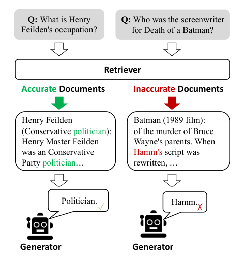
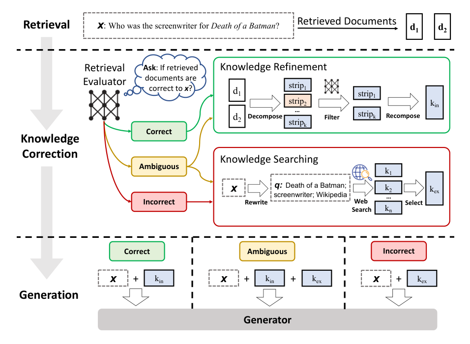
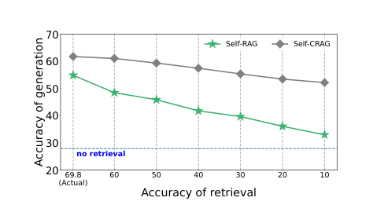

# 纠正性检索增强生成

**（Corrective Retrieval Augmented Generation）**

> 本文为 Yan 等人 2024 年论文《Corrective Retrieval Augmented Generation》（arXiv:2401.15884v3）的中文精确翻译。

**作者**：Shi-Qi Yan¹*、Jia-Chen Gu²*、Yun Zhu³、Zhen-Hua Ling¹

**单位**：¹语音及语言信息处理国家工程研究中心（National Engineering Research Center of Speech and Language Information Processing），中国科学技术大学（University of Science and Technology of China），合肥，中国；²计算机科学系，加州大学洛杉矶分校（University of California, Los Angeles）；³Google DeepMind

**联系方式**：yansiki@mail.ustc.edu.cn, gujc@ucla.edu, yunzhu@google.com, zhling@ustc.edu.cn

> * 表示同等贡献（Equal contribution）。

---

## 摘要

大型语言模型（Large Language Models，LLM）不可避免地会表现出幻觉（hallucination），因为仅凭其封装的参数化知识（parametric knowledge）无法保证生成文本的准确性。尽管检索增强生成（Retrieval-Augmented Generation，RAG）是对 LLM 的一种可行补充，但它严重依赖所检索文档的相关性，这引发了人们对"当检索出错时模型将如何表现"的担忧。为此，我们提出**纠正性检索增强生成（Corrective Retrieval Augmented Generation，CRAG）**以提高生成的鲁棒性（robustness）。具体而言，我们设计了一个轻量级的**检索评估器（retrieval evaluator）**，用于评估针对某查询所检索文档的整体质量，并返回一个置信度（confidence degree），基于该置信度可以触发不同的知识检索动作。由于从静态且有限的语料库中检索只能返回次优文档，我们利用大规模网络搜索（web search）作为扩展来增强检索结果。此外，我们还为检索到的文档设计了一种"先分解再重组"（decompose-then-recompose）算法，以选择性地聚焦其中的关键信息并过滤掉无关信息。CRAG 是即插即用（plug-and-play）的，可以与各种基于 RAG 的方法无缝结合。在涵盖短文本与长文本生成任务的四个数据集上的实验表明，CRAG 能够显著提升基于 RAG 的方法的性能。¹

> ¹ 代码可在 github.com/HuskyInSalt/CRAG 获取。

---

## 1 引言

大型语言模型（LLM）已经吸引了越来越多的关注，并展现出理解指令和生成流畅文本的出色能力（Brown et al., 2020; Ouyang et al., 2022; Touvron et al., 2023a）。然而，由于 LLM 难以避免事实性错误（factual error）（Mallen et al., 2023; Min et al., 2023），并且无法仅凭其封装的参数化知识来保证生成文本的准确性（Zhang et al., 2023b; Muhlgay et al., 2023），它们不可避免地会表现出幻觉（Ji et al., 2023）。

先前的研究引入了检索技术，以融入与输入相关的知识并增强生成，其典型代表是检索增强生成（RAG）（Lewis et al., 2020）。在此框架中，模型的输入通过在其前面拼接从外部知识库中检索到的相关文档来增强（Guu et al., 2020）。虽然 RAG 是对 LLM 的一种可行补充，但其有效性取决于所检索文档的相关性和准确性（Li et al., 2022; Tan et al., 2022）。生成对检索知识的严重依赖，引发了人们对"检索可能失败或返回不准确结果"场景下模型行为与性能的严重担忧（Shi et al., 2023）。如图 1 所示，低质量的检索器容易引入大量无关信息，阻碍模型获取准确知识并可能误导它们，从而导致诸如幻觉之类的问题（Zhang et al., 2023b）。

然而，大多数传统的 RAG 方法不加区分地纳入检索到的文档，而不管这些文档是否相关（Rony et al., 2022）。此外，当前的方法在检索和利用过程中大多将完整文档作为参考知识。但这些检索文档中相当一部分文本对于生成来说往往并非必需，本不应被同等程度地参考和纳入 RAG 中。

鉴于上述问题，本文特别研究了检索器返回不准确结果的场景。我们提出了一种名为**纠正性检索增强生成（CRAG）**的方法，用于自我纠正检索器的结果，并改进对文档的利用以增强生成。我们设计了一个轻量级的检索评估器，用于评估针对某查询所检索文档的整体质量。它是 RAG 中的关键组件，通过审查和评估所检索文档的相关性与可靠性来促成有信息量的生成。我们量化了一个置信度，基于该置信度可以触发 {Correct、Incorrect、Ambiguous} 等不同的知识检索动作。对于后两种动作，我们整合了大规模网络搜索（Piktus et al., 2021; Komeili et al., 2022）作为战略性扩展，因为从静态且有限的语料库中检索只能在范围和多样性方面返回次优文档。这一增强旨在拓宽所检索信息的范围，利用网络广阔而动态的特性来补充和丰富最初获得的文档。此外，为了消除检索文档中所含的对 RAG 无帮助的冗余上下文，我们在整个检索和利用过程中精心设计了一种"先分解再重组"算法。该算法确保了对检索信息的精炼，优化关键见解的提取并尽量减少非必要元素的纳入，从而增强对检索数据的利用。

CRAG 是即插即用的，我们在实验中将其实现到 RAG（Lewis et al., 2020）和 Self-RAG（Asai et al., 2024）中，以证明其对基于 RAG 方法的适应性。在 PopQA（Mallen et al., 2023）、Biography（Min et al., 2023）、PubHealth（Zhang et al., 2023a）和 Arc-Challenge（Bhakthavatsalam et al., 2021）这四个数据集上的结果表明，CRAG 能显著提升标准 RAG 和最先进的 Self-RAG 的性能，证明了其在短文本与长文本生成任务上的泛化能力。为了便于他人复现我们的结果，我们稍后将公布全部源代码。

总而言之，本文的贡献有三方面：1）本文研究了检索器返回不准确结果的场景，并且据我们所知，首次尝试为 RAG 设计纠正性策略以提高其鲁棒性。2）提出了一种名为 CRAG 的即插即用方法，以提高自动自我纠正的能力和对检索文档的高效利用。3）实验结果广泛证明了 CRAG 对基于 RAG 方法的适应性，以及其在短文本与长文本生成任务上的泛化能力。

---

## 2 相关工作

**LLM 的幻觉**：尽管 LLM 已经展现出理解指令和生成流畅文本的出色能力（Bang et al., 2023; Qin et al., 2023; Zhong et al., 2023），但它们仍在苦苦应对的最严重问题之一就是幻觉。正如许多研究所发现的（Tonmoy et al., 2024; Zhang et al., 2023b; Shuster et al., 2021），无论是过时的信息还是被激活的错误知识，都会严重导致幻觉。大规模无监管的训练数据收集、高质量采样数据比例低、输入空间中数据分配不完善，以及许多其他现实因素，都可能影响 LLM 并加剧这些问题。因此，显而易见的是，缺乏准确而具体的知识会导致误导性甚至不准确的生成，这将在大多数实际应用中严重损害用户体验。

**检索增强生成（RAG）**：RAG（Lewis et al., 2020; Guu et al., 2020）被认为是解决上述问题的一种有效方法，它用检索到的文档来增强生成式 LM 的输入问题。它通常从特定的语料库（即维基百科）中提供额外的知识来源，从而极大提升了 LM 在各类任务中的性能，尤其是在知识密集型任务中。所提出的方法通常利用信息检索为生成式 LLM 提供包含相关知识的文档。早期研究在专门负责响应生成的预训练语言模型前端采用稀疏或稠密检索器。尽管如此，上述方法通常忽略了一个问题：如果检索出错了怎么办？因为引入检索的目的是确保生成式 LM 能获得相关且准确的知识。如果检索到的文档不相关，检索系统甚至会加剧 LM 所犯的事实性错误。

**高级 RAG**：近年来，从原始 RAG 发展出了许多高级方法（Zhang et al., 2024; Kim et al., 2024; Wang et al., 2024; Liu et al., 2024）。考虑到对于某些查询来说检索有时并非必需，相反，在许多情况下不检索的响应甚至更准确。Self-RAG（Asai et al., 2024）被提出用于选择性地检索知识，并引入一个评判模型（critic model）来决定是否检索。Yoran 等人（2024）设计了一个 NLI 模型来识别无关上下文并提高鲁棒性。SAIL（Luo et al., 2023）在指令上进行调优，以在指令之前插入检索到的文档。而 Toolformer（Schick et al., 2023）则被预训练用于调用诸如维基百科之类的 API。此外，在一些长文本生成任务中，外部知识需要不止一次地被使用，何时检索也应当被关注。Jiang 等人（2023）主动预测未来内容，并决定在长文本生成中何时检索以及检索什么。与我们的工作最相关的近期研究（Schick et al., 2023; Luo et al., 2023; Asai et al., 2024）相比，有一个主要差异应当被强调。这些方法的目标是利用检索作为增强生成的有用工具，或判断检索是否必要，而本研究特别研究了检索器返回不准确结果的场景。据我们所知，本文首次尝试为 RAG 探索和设计纠正性策略，以提高其生成鲁棒性。

---

## 3 任务形式化

遵循先前的工作（Lewis et al., 2020; Asai et al., 2024），给定输入 X 以及一个包含大量知识文档的可访问语料库 C = {d₁, ..., d_N}，系统被期望生成输出 Y。整个框架通常分为检索器（retriever）R 和生成器（generator）G。检索器 R 旨在从语料库 C 中检索出与输入 X 相关的 top-K 文档 D = {d_r1, ..., d_rk}。基于输入 X 和检索结果 D，生成器 G 负责生成输出 Y。该框架可以形式化为：

P(Y|X) = P(D|X) · P(Y, D|X)   (1)

这表明检索器和生成器是无缝耦合的，表现出较低的风险容忍度。无论生成器的能力多么出色，任何不成功的检索都可能导致不满意的响应。这正是本文关注的重点——提高生成的鲁棒性。

---

## 4 CRAG

### 4.1 模型推理概览

图 2 和算法 1 展示了 CRAG 在推理阶段的概览，它设计了纠正性策略以提高生成的鲁棒性。给定一个输入查询和来自任意检索器的检索文档，我们构造一个轻量级的检索评估器来估计检索文档与输入查询之间的相关性得分（第 4.2 节）。相关性得分被量化为三种置信度，然后触发相应的动作：{Correct、Incorrect、Ambiguous}（第 4.3 节）。如果触发 Correct 动作，检索到的文档将被精炼为更精确的知识片段（knowledge strips）。这一精炼操作涉及知识分解（decomposition）、过滤（filter）和重组（recomposition）（第 4.4 节）。如果触发 Incorrect 动作，检索到的文档将被丢弃，转而求助于网络搜索，并将其视为用于纠正的补充知识来源（第 4.5 节）。最终，当无法自信地做出正确或错误的判断时，将触发一个柔和而平衡的 Ambiguous 动作，将两者结合起来。在优化检索结果之后，可以采用任意的生成模型。

### 4.2 检索评估器

在使用检索文档之前，很自然地会想了解它们是否准确，这一点很重要，因为通过这种方式可以识别出无关或具有误导性的信息。检索评估器的准确性无可否认地在塑造整个系统性能方面起着关键作用，因为它会影响后续过程的结果。

我们的目标是：如果检索到的文档不相关，就对它们进行纠正。具体而言，我们采用 T5-large（Raffel et al., 2020）来初始化检索评估器并进行微调。它的参数规模远小于当前大多数 LLM（Touvron et al., 2023a,b; Chowdhery et al., 2023; Anil et al., 2023; Brown et al., 2020; Ouyang et al., 2022; OpenAI, 2023）。为确保所有实验结果与 Self-RAG（Asai et al., 2024）可比，我们的实验也采用了 Self-RAG 提供的、通过 Contriever（Izacard et al., 2022）得到的相同检索结果。用于微调评估器的相关性信号可以从现有数据集中收集。例如，PopQA（Mallen et al., 2023）为每个问题提供了来自维基百科的黄金主题词条标题（golden subject wiki title）。我们可以用它来追踪一段并非 100% 相关但质量相当高的段落。我们将其用作微调检索评估器的相关性信号。²另一方面，微调所用的负样本全部从检索结果中随机采样，它们与输入查询相当相似但并不相关。关于这一微调步骤的更多细节可参见附录 B.3。

对于每个问题，通常会检索到 10 个文档。将问题与每个单独的文档拼接作为输入，评估器为每个"问题-文档"对分别预测相关性得分。我们还尝试通过提示 ChatGPT 来识别检索相关性以作对比，但如第 5.5 节所述，它的表现较差。基于这些计算出的相关性得分，做出最终判断，确定检索是否正确，并与动作触发相关联。在我们提出的框架中，检索质量的评估以相对较低的成本完成，无需访问大型且昂贵的 LLM。与 Self-RAG（Asai et al., 2024）中经过指令微调的 LLaMA-2（7B）评判模型相比，CRAG 中设计的评估器展现出了相当轻量（0.77B）的优势。

> ² https://huggingface.co/datasets/akariasai/PopQA

**算法 1：CRAG 推理（CRAG Inference）**

```
输入（Require）：E（检索评估器 Retrieval Evaluator）、W（查询改写器 Query Rewriter）、G（生成器 Generator）
输入（Input）：x（输入问题）、D = {d1, d2, ..., dk}（检索到的文档）
输出（Output）：y（生成的响应）
1   score_i = E 评估每一对 (x, d_i) 的相关性，d_i ∈ D
2   Confidence = 基于 {score_1, score_2, ... score_k} 计算并给出最终判定
    // Confidence 有 3 个可选值：[CORRECT]、[INCORRECT] 或 [AMBIGUOUS]
3   if Confidence == [CORRECT] then
4       Internal_Knowledge = Knowledge_Refine(x, D)
5       k = Internal_Knowledge
6   else if Confidence == [INCORRECT] then
7       External_Knowledge = Web_Search(W 改写 x 以用于搜索)
8       k = External_Knowledge
9   else if Confidence == [AMBIGUOUS] then
10      Internal_Knowledge = Knowledge_Refine(x, D)
11      External_Knowledge = Web_Search(W 改写 x 以用于搜索)
12      k = Internal_Knowledge + External_Knowledge
13  end
14  G 基于 x 和 k 预测 y
```

### 4.3 动作触发

为了纠正不相关的文档并按需精炼目标文档，应当有区别地执行动作。基于前述每个检索文档的置信度得分，我们设计了三类动作，并在设置了上限和下限阈值的情况下相应地触发它们。如果置信度得分高于上限阈值，则将检索文档判定为 Correct；如果低于下限阈值，则判定为 Incorrect。否则，将执行一个更柔和、居中的动作，即 Ambiguous。每个检索文档都被单独处理，最终再汇总。

**Correct**：当至少一个检索文档的置信度得分高于上限阈值时，就假定检索为 Correct。若是如此，意味着检索结果中存在相关文档，检索结果中的知识被认为更可靠、更准确。然而，即使能找到相关文档，该文档中也不可避免地存在一些噪声知识片段。为了提取该文档中最关键的知识片段，我们进一步设计了一种知识精炼方法，将在第 4.4 节详述。

**Incorrect**：此外，当所有检索文档的置信度得分都低于下限阈值时，就假定检索为 Incorrect。这表明所有检索文档都被认为是不相关的，对生成没有帮助。一旦检索结果中的知识被判定为不准确，仍固守其中是不明智的，这很可能导致编造事实。因此，我们需要寻求新的知识来源进行纠正。这里引入了网络搜索，从互联网上进行搜索，如第 4.5 节所述。这一纠正动作有助于克服"没有任何可靠知识可供参考"这一令人尴尬的挑战。

**Ambiguous**：除上述两种情况外，其余情况将被分配到一个居中的 Ambiguous 动作。这通常发生在检索的准确性难以区分、评估器给出中间得分的时候。由于检索评估器对其判断并不自信，Correct 和 Incorrect 中两种类型的已处理知识会被结合起来相互补充。实施这种缓和而柔和的策略，可以显著有助于增强系统的鲁棒性和弹性，培育一个更具适应性、以实现最优性能的框架。

**讨论**：仅采用 Correct 和 Incorrect 动作的初步实验表明，CRAG 的效果很容易受到检索评估器准确性的影响。原因可能在于，对所有输入情况都进行了截然不同的知识切换，而不管其判断的置信度水平如何。Ambiguous 动作的设计显著有助于缓解对检索评估器准确性的依赖。

### 4.4 知识精炼

给定一个检索到的相关文档，我们设计了一种"先分解再重组"（decompose-then-recompose）的知识精炼方法，以进一步提取其中最关键的内部知识片段。为了获得细粒度的检索结果，我们将检索结果切分为内部片段（internal strips）。如果一个检索结果短至一两个句子，则将其视为一个单独的片段；否则，检索文档需要被拆分为更小的单元，这些单元通常根据总长度由几个句子组成。该片段被假定包含一条独立的信息，而过滤则是基于这些片段进行的。然后，使用第 4.2 节中微调的检索评估器来计算每个知识片段的相关性得分。基于这些得分，不相关的知识片段被过滤掉，而相关的片段则按顺序拼接重组，即得到内部知识（internal knowledge）。

### 4.5 网络搜索

如果一个系统自身能判断出其现有知识库无法很好地解决问题，并转而求助于额外的外部知识，那它就会更智能。相反，即使一个系统知道现有知识无法解决问题，却仍固守于有限的知识库，那么它最终只会给出一个编造的事实，这被称为幻觉。因此，如果检索结果全都被假定为不相关，那么寻求互补的外部知识就极其重要；我们认为，一个"知道自己不知道什么、自己无法回答什么"的系统，比一个固守有限知识、无法寻求外部知识的系统更智能。由于从静态且有限的语料库中检索只能在范围和多样性方面返回次优文档，因此整合大规模网络搜索（Piktus et al., 2021; Komeili et al., 2022）作为 RAG 的战略性扩展。具体而言，输入由 ChatGPT 改写为由关键词组成的查询，以模仿搜索引擎的日常使用方式。用于改写的提示见附录 A。在 CRAG 中，采用一个公开且可访问的商业网络搜索 API，为每个查询生成一系列 URL 链接。³考虑到来自大规模网络搜索的知识可能引入偏见或不可靠信息，我们优先选择维基百科这类权威且受监管的网页，这可以显著有助于缓解这些问题。此外，我们利用这些 URL 链接来导航网页、转录其内容，并采用与第 4.4 节相同的知识精炼方法来获取相关的网络知识，即外部知识（external knowledge）。

> ³ 在本研究中，使用 Google 搜索 API 进行搜索。

---

## 5 实验

我们进行了实验，以广泛证明 CRAG 对基于 RAG 方法的适应性，以及其在短文本与长文本生成任务上的泛化能力。

### 5.1 任务、数据集与指标

CRAG 在四个数据集上进行了评估，包括 PopQA（Mallen et al., 2023）（短文本生成）、Biography（Min et al., 2023）（长文本生成）、PubHealth（Zhang et al., 2023a）（真/假判断题）和 Arc-Challenge（Bhakthavatsalam et al., 2021）（多项选择题）。遵循先前的工作，PopQA、PubHealth 和 Arc-Challenge 采用准确率（accuracy）作为评估指标；Biography 采用 FactScore（Min et al., 2023）作为评估指标。读者可以参考附录 B.1 了解更多细节。之所以使用相同的指标，是因为我们提出的方法可与先前研究进行比较，我们使用了与先前工作相同的检索结果。区别在于，我们的动机是通过纠正系统判定为低质量的检索结果来提高检索质量。这可以类比为 RAG 对独立参数化语言模型的增强，而我们进一步用纠正性策略增强了 RAG。

### 5.2 基线

我们主要将 CRAG 与"有检索"和"无检索"两类方法进行比较，其中后者又可以进一步分为标准 RAG 和最新的高级 RAG，包括：

**无检索基线（Baselines without retrieval）**：我们评估了一些公开 LLM，包括 LLaMA2-7B、13B（Touvron et al., 2023b），指令微调模型 Alpaca-7B、13B（Dubois et al., 2023），以及引入迭代式工程以提高 LLM 生成事实性的 CoVE-65B（Dhuliawala et al., 2024）。此外还包括 LLaMA2-chat13B 和 ChatGPT 这类专有（proprietary）LLM。

**标准 RAG（Standard RAG）**：我们评估了标准 RAG（Lewis et al., 2020），其中 LM 在查询前拼接 top 检索文档（使用与我们系统中相同的检索器）来生成输出。这里我们采用了几种公开的指令微调 LLM，包括 LLaMA2-7B、13B（Touvron et al., 2023b），Alpaca-7B、13B（Dubois et al., 2023），以及在 Self-RAG 中经过指令微调的 LLaMA2-7B（Asai et al., 2024）。

**高级 RAG（Advanced RAG）**：(1) SAIL（Luo et al., 2023），它在 Alpaca 指令微调数据上对 LM 进行指令微调，并在指令之前插入 top 检索文档。(2) Self-RAG（Asai et al., 2024），它在包含若干组反思 token（reflection tokens，由 GPT-4（OpenAI, 2023）标注）的指令微调数据上对 LLaMA2 进行调优。(3) 遵循 Asai 等人（2024）的做法，我们还引用了使用私有数据训练的检索增强基线的结果：Ret-ChatGPT 和 Ret-LLaMA-chat，它们部署了与上述相同的增强技术；以及 perplexity.ai，一个基于 InstructGPT 的生产级搜索系统。

### 5.3 结果

表 1 展示了四个数据集上的结果。将所提方法与标准 RAG 结合的模型命名为 CRAG，与 Self-RAG 结合的命名为 Self-CRAG。读者可以参考附录 B.3 了解我们所提方法的更多实现细节。从这些结果中，我们可以得出以下结论：

**第一，所提方法能显著提升 RAG 和 Self-RAG 的性能。** 具体而言，如表 1 所示，当基于 SelfRAG-LLaMA2-7b 时，CRAG 在 PopQA 上比 RAG 高出 7.0% 的准确率，在 Biography 上高出 14.9% 的 FactScore，在 PubHealth 上高出 36.6% 的准确率，在 Arc-Challenge 上高出 15.4% 的准确率；当基于 LLaMA2-hf-7b 时，在 PopQA 上高出 4.4% 的准确率，在 Biography 上高出 2.8% 的 FactScore，在 Arc-Challenge 上高出 10.3%。与当前最先进的 Self-RAG 相比，当基于 LLaMA2-hf-7b 时，Self-CRAG 在 PopQA 上高出 20.0% 的准确率，在 Biography 上高出 36.9% 的 FactScore，在 Arc-Challenge 上高出 4.0% 的准确率；当基于 SelfRAG-LLaMA2-7b 时，在 PopQA 上高出 6.9% 的准确率，在 Biography 上高出 5.0% 的 FactScore，在 PubHealth 上高出 2.4% 的准确率。这些结果证明了 CRAG 的适应性——它是即插即用的，可以被实现到基于 RAG 的方法中。

**第二，所提方法在各种生成任务上展现了出色的泛化能力。** 特别是，表 1 中报告的这些基准分别代表了不同的实际场景，包括短文本实体生成（PopQA）、长文本生成（Biography）和闭集任务（PubHealth、Arc-Challenge）。这些结果验证了 CRAG 一致的有效性。它在各类任务上的通用性凸显了其稳健的能力和跨多样化场景的泛化能力。

**第三，所提方法在替换底层 LLM 生成器时表现出更大的灵活性。** 可以看到，当底层 LLM 从 SelfRAG-LLaMA2-7b 更换为 LLaMA2-hf-7b 时，CRAG 仍然表现出有竞争力的性能，而 Self-RAG 的性能则显著下降，甚至在若干基准上还不如标准 RAG。出现这些结果的原因是，Self-RAG 需要使用人工或 LLM 标注的数据进行指令微调，以学习按需输出特殊的评判 token（critic token），而这种能力在普通 LLM 中并未被学习到。CRAG 对这种能力没有任何要求。可以想象，当未来出现更先进的 LLM 时，它们可以轻松地与 CRAG 结合，而 Self-RAG 仍然需要额外的指令微调。

### 5.4 消融研究

**每个触发动作的影响。** 为了进一步验证检索评估器中设计的触发动作的有效性，我们进行了如表 2 所示的、逐一移除所提方法中每个动作的消融测试。在 PopQA 数据集上以准确率为指标进行了评估，以展示性能变化。具体而言，当移除 Correct 或 Incorrect 动作时，将其合并到 Ambiguous 中，使得原本触发 Correct 或 Incorrect 的比例会转而触发 Ambiguous。另一方面，当移除 Ambiguous 动作时，只剩下一个阈值，所有输入查询都据此明确触发 Correct 或 Incorrect。从这些结果可以看出，无论移除哪个动作，性能都会下降，这说明每个动作都有助于提高生成的鲁棒性。为了进一步说明这项研究，我们还进行了只触发一个动作的实验，附录中展示的结果同样证明了这一致性。

**每个知识利用操作的影响。** 表 3 说明了当一个关键的知识利用操作被消融时性能如何变化。在 PopQA 数据集上以准确率为指标，通过逐一移除"文档精炼（document refinement）""搜索查询改写（search query rewriting）"和"外部知识选择（external knowledge selection）"这些知识利用操作来进行评估。移除文档精炼表示将原始检索文档直接输入后续生成器，正如大多数现有工作所做的那样。此外，移除搜索查询改写表示在知识搜索过程中不将问题改写为由关键词组成的查询。最后，移除知识选择表示将搜索到的所有网页内容全部视为外部知识而不做选择。这些结果有助于得出如下发现：无论移除哪个知识利用操作，最终系统的性能都会下降，这表明每个知识利用操作都有助于改进对知识的利用。

### 5.5 检索评估器的准确性

检索评估器的质量在很大程度上决定了整个系统的性能。给定文档检索结果，我们评估了检索评估器能否准确判断这些结果的整体质量。表 4 展示了在 PopQA 数据集上，我们的检索评估器与商业 LLM ChatGPT 对文档检索结果的评估准确率。实验中使用的 ChatGPT、ChatGPT-CoT 和 ChatGPT-few-shot 的提示可参见附录 A。结果表明，轻量级的、基于 T5 的检索评估器在所有设置下都显著优于具有竞争力的 ChatGPT。

### 5.6 对检索性能的鲁棒性

为了进一步验证所提方法对检索性能的鲁棒性，我们研究了在不同检索性能下生成性能的变化。我们随机故意移除了一部分准确的检索结果，以模拟低质量的检索器，并评估性能如何变化。图 3 展示了 Self-RAG 和 Self-CRAG 在 PopQA 数据集上的性能变化。可以看到，随着检索性能的下降，Self-RAG 和 Self-CRAG 的生成性能也随之下降，这表明生成器严重依赖检索器的质量。此外，随着检索性能的下降，Self-CRAG 的生成性能下降幅度比 Self-RAG 更轻微。这些结果意味着 Self-CRAG 在增强对检索性能的鲁棒性方面优于 Self-RAG。

### 5.7 网络搜索知识的一致补充

本文强调了在初始检索结果不相关、不可靠时，通过纳入额外信息来增强检索上下文的必要性。同时，确认我们方法的主要改进源于自我纠正机制，而非仅仅源于通过网络搜索获得的补充信息，这一点也至关重要。为了进一步证明所提自我纠正机制的有效性，我们给 RAG 和 Self-RAG 都一致地补充了网络搜索知识，以确保它们能访问相同范围的检索知识。表 5 中的结果表明，给 RAG 或 Self-RAG 一致地补充网络搜索知识在大多数情况下可以提升性能（使用原始 LLaMA2 模型的 Self-RAG w. web 除外），尽管提升幅度有限。此外，用所提自我纠正机制增强的 RAG 或 Self-RAG，在所有情况下都显著优于一致补充网络搜索知识的模型。这一发现证实，所观察到的进步主要归因于所提的自我纠正机制。

### 5.8 计算开销分析

为了说明我们的自我纠正机制是一种轻量级、即插即用的解决方案，适用于各种基于 RAG 的框架，我们测量了计算开销。我们采用了 Narayanan 等人（2021）中的 FLOPs 预测公式，结果如表 6 所示，该表展示了在 GPU 上预测的每 token FLOPs。由于 Self-RAG 的自适应特性（它根据输入改变其生成策略），其计算开销无法精确确定。因此，我们给出一个估计范围。此外，我们在 PopQA 上进行了实验，以评估实际中每实例的平均执行时间，详见表 6。研究结果表明，自我纠正机制仅带来适度的计算开销，同时显著提升了性能，从而验证了其轻量级特性。

---

## 6 结论与局限性

本文研究了当检索出错时基于 RAG 的方法所面临的挑战——即向生成式 LM 暴露不准确和误导性知识的问题。我们提出**纠正性检索增强生成（Corrective Retrieval Augmented Generation，CRAG）**以提高生成的鲁棒性。本质上，一个轻量级的检索评估器用于有区别地估计并触发三种知识检索动作。借助网络搜索的进一步利用和优化的知识利用，CRAG 显著提升了自动自我纠正的能力和对检索文档的高效利用。实验广泛证明了其对基于 RAG 方法的适应性，以及在短文本与长文本生成任务上的泛化能力。虽然我们主要从纠正的角度来改进 RAG 框架，且 CRAG 可以与各种基于 RAG 的方法无缝结合，但微调一个外部检索评估器是不可避免的。如何消除这一外部评估器，并为 LLM 配备更好的检索评估能力，将是我们未来的工作。

---

## 参考文献

Rohan Anil, Andrew M. Dai, Orhan Firat, Melvin Johnson, Dmitry Lepikhin, Alexandre Passos, Siamak Shakeri, Emanuel Taropa, Paige Bailey, Zhifeng Chen, Eric Chu, Jonathan H. Clark, Laurent El Shafey, Yanping Huang, Kathy Meier-Hellstern, Gaurav Mishra, Erica Moreira, Mark Omernick, Kevin Robinson, Sebastian Ruder, et al. 2023. PaLM 2 technical report. CoRR, abs/2305.10403.

Akari Asai, Zeqiu Wu, Yizhong Wang, Avirup Sil, and Hannaneh Hajishirzi. 2024. Self-rag: Learning to retrieve, generate, and critique through self-reflection. In The Twelfth International Conference on Learning Representations, ICLR 2024, Vienna, Austria, May 7-11, 2024. OpenReview.net.

Yejin Bang, Samuel Cahyawijaya, Nayeon Lee, Wenliang Dai, Dan Su, Bryan Wilie, Holy Lovenia, Ziwei Ji, Tiezheng Yu, Willy Chung, Quyet V. Do, Yan Xu, and Pascale Fung. 2023. A multitask, multilingual, multimodal evaluation of chatgpt on reasoning, hallucination, and interactivity. pages 675–718.

Sumithra Bhakthavatsalam, Daniel Khashabi, Tushar Khot, Bhavana Dalvi Mishra, Kyle Richardson, Ashish Sabharwal, Carissa Schoenick, Oyvind Tafjord, and Peter Clark. 2021. Think you have solved direct-answer question answering? try arc-da, the direct-answer AI2 reasoning challenge. CoRR, abs/2102.03315.

Tom B Brown, Benjamin Mann, Nick Ryder, et al. 2020. Language models are few-shot learners. In Advances in neural information processing systems, pages 1877–1901.

Aakanksha Chowdhery, Sharan Narang, Jacob Devlin, Maarten Bosma, Gaurav Mishra, Adam Roberts, Paul Barham, Hyung Won Chung, Charles Sutton, Sebastian Gehrmann, Parker Schuh, Kensen Shi, Sasha Tsvyashchenko, Joshua Maynez, Abhishek Rao, Parker Barnes, Yi Tay, Noam Shazeer, Vinodkumar Prabhakaran, Emily Reif, Nan Du, Ben Hutchinson, Reiner Pope, James Bradbury, Jacob Austin, Michael Isard, Guy Gur-Ari, Pengcheng Yin, Toju Duke, Anselm Levskaya, Sanjay Ghemawat, Sunipa Dev, Henryk Michalewski, Xavier Garcia, Vedant Misra, Kevin Robinson, Liam Fedus, Denny Zhou, Daphne Ippolito, David Luan, Hyeontaek Lim, Barret Zoph, Alexander Spiridonov, Ryan Sepassi, David Dohan, Shivani Agrawal, Mark Omernick, Andrew M. Dai, Thanumalayan Sankaranarayana Pillai, Marie Pellat, Aitor Lewkowycz, Erica Moreira, Rewon Child, Oleksandr Polozov, Katherine Lee, Zongwei Zhou, Xuezhi Wang, Brennan Saeta, Mark Diaz, Orhan Firat, Michele Catasta, Jason Wei, Kathy Meier-Hellstern, Douglas Eck, Jeff Dean, Slav Petrov, and Noah Fiedel. 2023. Palm: Scaling language modeling with pathways. J. Mach. Learn. Res., 24:240:1–240:113.

Shehzaad Dhuliawala, Mojtaba Komeili, Jing Xu, Roberta Raileanu, Xian Li, Asli Celikyilmaz, and Jason Weston. 2024. Chain-of-verification reduces hallucination in large language models. pages 3563–3578.

Yann Dubois, Xuechen Li, Rohan Taori, Tianyi Zhang, Ishaan Gulrajani, Jimmy Ba, Carlos Guestrin, Percy Liang, and Tatsunori B. Hashimoto. 2023. Alpaca-farm: A simulation framework for methods that learn from human feedback. CoRR, abs/2305.14387.

Kelvin Guu, Kenton Lee, Zora Tung, Panupong Pasupat, and Ming-Wei Chang. 2020. Retrieval augmented language model pre-training. In Proceedings of the 37th International Conference on Machine Learning, ICML 2020, 13-18 July 2020, Virtual Event, volume 119 of Proceedings of Machine Learning Research, pages 3929–3938. PMLR.

Gautier Izacard, Mathilde Caron, Lucas Hosseini, Sebastian Riedel, Piotr Bojanowski, Armand Joulin, and Edouard Grave. 2022. Unsupervised dense information retrieval with contrastive learning. Trans. Mach. Learn. Res., 2022.

Ziwei Ji, Nayeon Lee, Rita Frieske, Tiezheng Yu, Dan Su, Yan Xu, Etsuko Ishii, Yejin Bang, Andrea Madotto, and Pascale Fung. 2023. Survey of hallucination in natural language generation. ACM Comput. Surv., 55(12):248:1–248:38.

Zhengbao Jiang, Frank F. Xu, Luyu Gao, Zhiqing Sun, Qian Liu, Jane Dwivedi-Yu, Yiming Yang, Jamie Callan, and Graham Neubig. 2023. Active retrieval augmented generation. In Proceedings of the 2023 Conference on Empirical Methods in Natural Language Processing, EMNLP 2023, Singapore, December 6-10, 2023, pages 7969–7992. Association for Computational Linguistics.

Jaehyung Kim, Jaehyun Nam, Sangwoo Mo, Jongjin Park, Sang-Woo Lee, Minjoon Seo, Jung-Woo Ha, and Jinwoo Shin. 2024. Sure: Summarizing retrievals using answer candidates for open-domain QA of llms. In The Twelfth International Conference on Learning Representations, ICLR 2024, Vienna, Austria, May 7-11, 2024. OpenReview.net.

Mojtaba Komeili, Kurt Shuster, and Jason Weston. 2022. Internet-augmented dialogue generation. In Proceedings of the 60th Annual Meeting of the Association for Computational Linguistics (Volume 1: Long Papers), ACL 2022, Dublin, Ireland, May 22-27, 2022, pages 8460–8478. Association for Computational Linguistics.

Patrick S. H. Lewis, Ethan Perez, Aleksandra Piktus, Fabio Petroni, Vladimir Karpukhin, Naman Goyal, Heinrich Küttler, Mike Lewis, Wen-tau Yih, Tim Rocktäschel, Sebastian Riedel, and Douwe Kiela. 2020. Retrieval-augmented generation for knowledge-intensive NLP tasks. In Advances in Neural Information Processing Systems 33: Annual Conference on Neural Information Processing Systems 2020, NeurIPS 2020, December 6-12, 2020, virtual.

Huayang Li, Yixuan Su, Deng Cai, Yan Wang, and Lemao Liu. 2022. A survey on retrieval-augmented text generation. CoRR, abs/2202.01110.

Yanming Liu, Xinyue Peng, Xuhong Zhang, Weihao Liu, Jianwei Yin, Jiannan Cao, and Tianyu Du. 2024. RA-ISF: learning to answer and understand from retrieval augmentation via iterative self-feedback. In Findings of the Association for Computational Linguistics, ACL 2024, Bangkok, Thailand and virtual meeting, August 11-16, 2024, pages 4730–4749. Association for Computational Linguistics.

Hongyin Luo, Tianhua Zhang, Yung-Sung Chuang, Yuan Gong, Yoon Kim, Xixin Wu, Helen Meng, and James R. Glass. 2023. Search augmented instruction learning. In Findings of the Association for Computational Linguistics: EMNLP 2023, Singapore, December 6-10, 2023, pages 3717–3729. Association for Computational Linguistics.

Alex Mallen, Akari Asai, Victor Zhong, Rajarshi Das, Daniel Khashabi, and Hannaneh Hajishirzi. 2023. When not to trust language models: Investigating effectiveness of parametric and non-parametric memories. In Proceedings of the 61st Annual Meeting of the Association for Computational Linguistics (Volume 1: Long Papers), ACL 2023, Toronto, Canada, July 9-14, 2023, pages 9802–9822. Association for Computational Linguistics.

Sewon Min, Kalpesh Krishna, Xinxi Lyu, Mike Lewis, Wen-tau Yih, Pang Wei Koh, Mohit Iyyer, Luke Zettlemoyer, and Hannaneh Hajishirzi. 2023. Factscore: Fine-grained atomic evaluation of factual precision in long form text generation. In Proceedings of the 2023 Conference on Empirical Methods in Natural Language Processing, EMNLP 2023, Singapore, December 6-10, 2023, pages 12076–12100. Association for Computational Linguistics.

Dor Muhlgay, Ori Ram, Inbal Magar, Yoav Levine, Nir Ratner, Yonatan Belinkov, Omri Abend, Kevin Leyton-Brown, Amnon Shashua, and Yoav Shoham. 2023. Generating benchmarks for factuality evaluation of language models. CoRR, abs/2307.06908.

Deepak Narayanan, Mohammad Shoeybi, Jared Casper, Patrick LeGresley, Mostofa Patwary, Vijay Korthikanti, Dmitri Vainbrand, Prethvi Kashinkunti, Julie Bernauer, Bryan Catanzaro, Amar Phanishayee, and Matei Zaharia. 2021. Efficient large-scale language model training on GPU clusters using megatron-lm. In International Conference for High Performance Computing, Networking, Storage and Analysis, SC 2021, St. Louis, Missouri, USA, November 14-19, 2021, page 58. ACM.

OpenAI. 2023. GPT-4 technical report. CoRR, abs/2303.08774.

Long Ouyang, Jeffrey Wu, Xu Jiang, Diogo Almeida, Carroll L. Wainwright, Pamela Mishkin, Chong Zhang, Sandhini Agarwal, Katarina Slama, Alex Ray, John Schulman, Jacob Hilton, Fraser Kelton, Luke Miller, Maddie Simens, Amanda Askell, Peter Welinder, Paul F. Christiano, Jan Leike, and Ryan Lowe. 2022. Training language models to follow instructions with human feedback. In NeurIPS.

Aleksandra Piktus, Fabio Petroni, Vladimir Karpukhin, Dmytro Okhonko, Samuel Broscheit, Gautier Izacard, Patrick S. H. Lewis, Barlas Oguz, Edouard Grave, Wen-tau Yih, and Sebastian Riedel. 2021. The web is your oyster - knowledge-intensive NLP against a very large web corpus. CoRR, abs/2112.09924.

Chengwei Qin, Aston Zhang, Zhuosheng Zhang, Jiaao Chen, Michihiro Yasunaga, and Diyi Yang. 2023. Is chatgpt a general-purpose natural language processing task solver? In Proceedings of the 2023 Conference on Empirical Methods in Natural Language Processing, EMNLP 2023, Singapore, December 6-10, 2023, pages 1339–1384. Association for Computational Linguistics.

Colin Raffel, Noam Shazeer, Adam Roberts, Katherine Lee, Sharan Narang, Michael Matena, Yanqi Zhou, Wei Li, and Peter J. Liu. 2020. Exploring the limits of transfer learning with a unified text-to-text transformer. J. Mach. Learn. Res., 21:140:1–140:67.

Md. Rashad Al Hasan Rony, Ricardo Usbeck, and Jens Lehmann. 2022. Dialokg: Knowledge-structure aware task-oriented dialogue generation. In Findings of the Association for Computational Linguistics: NAACL 2022, Seattle, WA, United States, July 10-15, 2022, pages 2557–2571. Association for Computational Linguistics.

Timo Schick, Jane Dwivedi-Yu, Roberto Dessì, Roberta Raileanu, Maria Lomeli, Eric Hambro, Luke Zettlemoyer, Nicola Cancedda, and Thomas Scialom. 2023. Toolformer: Language models can teach themselves to use tools.

Freda Shi, Xinyun Chen, Kanishka Misra, Nathan Scales, David Dohan, Ed H. Chi, Nathanael Schärli, and Denny Zhou. 2023. Large language models can be easily distracted by irrelevant context. In Proceedings of the 40th International Conference on Machine Learning, volume 202 of Proceedings of Machine Learning Research, pages 31210–31227. PMLR.

Kurt Shuster, Spencer Poff, Moya Chen, Douwe Kiela, and Jason Weston. 2021. Retrieval augmentation reduces hallucination in conversation. In Findings of the Association for Computational Linguistics: EMNLP 2021, Virtual Event / Punta Cana, Dominican Republic, 16-20 November, 2021, pages 3784–3803. Association for Computational Linguistics.

Chao-Hong Tan, Jia-Chen Gu, Chongyang Tao, Zhen-Hua Ling, Can Xu, Huang Hu, Xiubo Geng, and Daxin Jiang. 2022. Tegtok: Augmenting text generation via task-specific and open-world knowledge. In Findings of the Association for Computational Linguistics: ACL 2022, Dublin, Ireland, May 22-27, 2022, pages 1597–1609. Association for Computational Linguistics.

S. M. Towhidul Islam Tonmoy, S. M. Mehedi Zaman, Vinija Jain, Anku Rani, Vipula Rawte, Aman Chadha, and Amitava Das. 2024. A comprehensive survey of hallucination mitigation techniques in large language models. CoRR, abs/2401.01313.

Hugo Touvron, Thibaut Lavril, Gautier Izacard, Xavier Martinet, Marie-Anne Lachaux, Timothée Lacroix, Baptiste Rozière, Naman Goyal, Eric Hambro, Faisal Azhar, Aurélien Rodriguez, Armand Joulin, Edouard Grave, and Guillaume Lample. 2023a. Llama: Open and efficient foundation language models. CoRR, abs/2302.13971.

Hugo Touvron, Louis Martin, Kevin Stone, Peter Albert, Amjad Almahairi, Yasmine Babaei, Nikolay Bashlykov, Soumya Batra, Prajjwal Bhargava, Shruti Bhosale, Dan Bikel, Lukas Blecher, et al. 2023b. Llama 2: Open foundation and fine-tuned chat models. CoRR, abs/2307.09288.

Zihao Wang, Anji Liu, Haowei Lin, Jiaqi Li, Xiaojian Ma, and Yitao Liang. 2024. RAT: retrieval augmented thoughts elicit context-aware reasoning in long-horizon generation. CoRR, abs/2403.05313.

Ori Yoran, Tomer Wolfson, Ori Ram, and Jonathan Berant. 2024. Making retrieval-augmented language models robust to irrelevant context.

Tianhua Zhang, Hongyin Luo, Yung-Sung Chuang, Wei Fang, Luc Gaitskell, Thomas Hartvigsen, Xixin Wu, Danny Fox, Helen Meng, and James R. Glass. 2023a. Interpretable unified language checking. CoRR, abs/2304.03728.

Tianjun Zhang, Shishir G. Patil, Naman Jain, Sheng Shen, Matei Zaharia, Ion Stoica, and Joseph E. Gonzalez. 2024. RAFT: adapting language model to domain specific RAG. CoRR, abs/2403.10131.

Yue Zhang, Yafu Li, Leyang Cui, Deng Cai, Lemao Liu, Tingchen Fu, Xinting Huang, Enbo Zhao, Yu Zhang, Yulong Chen, Longyue Wang, Anh Tuan Luu, Wei Bi, Freda Shi, and Shuming Shi. 2023b. Siren's song in the AI ocean: A survey on hallucination in large language models. CoRR, abs/2309.01219.

Qihuang Zhong, Liang Ding, Juhua Liu, Bo Du, and Dacheng Tao. 2023. Can chatgpt understand too? A comparative study on chatgpt and fine-tuned BERT. CoRR, abs/2302.10198.

---

## 附录 A：任务提示（Task Prompts）

用于生成作为网络搜索查询的知识关键词的提示如表 7 所示。

**表 7：用于向 GPT-3.5 Turbo 生成作为网络搜索查询的知识关键词的少样本提示（few-shot prompt）。**

指令（英文原文）：从以下对话和问题中提取至多三个以逗号分隔的关键词，作为网络搜索的查询，包括对话中的主题背景和问题中的主要意图。（Extract at most three keywords separated by comma from the following dialogues and questions as queries for the web search, including topic background within dialogues and main intent within questions.）

```
question: What is Henry Feilden's occupation?（亨利·菲尔登的职业是什么？）
query: Henry Feilden, occupation

question: In what city was Billy Carlson born?（比利·卡尔森出生在哪个城市？）
query: city, Billy Carlson, born

question: What is the religion of John Gwynn?（约翰·格温的宗教是什么？）
query: religion of John Gwynn

question: What sport does Kiribati men's national basketball team play?（基里巴斯男子国家篮球队参加什么运动？）
query: sport, Kiribati men's national basketball team play

question: [question]
query:
```

用于指示 ChatGPT 作为评估器的提示分别如表 8、表 9 和表 10 所示。

**表 8：用作评估器的、面向 GPT-3.5 Turbo 的直接提示（direct prompt）。**

指令（英文原文）：给定一个问题，以下文档是否含有回答该问题的确切信息？只回答 yes 或 no。（Given a question, does the following document have exact information to answer the question? Answer yes or no only.）

```
Question: [question]
Document: [document]
```

**表 9：用作评估器的、带思维链（Chain-of-Thought）的、面向 GPT-3.5 Turbo 的提示。**

指令（英文原文）：给定一个问题，以下文档是否含有回答该问题的确切信息？（Given a question, does the following document have exact information to answer the question?）

```
Question: [question]
Document: [document]
Think Step by step, and answer with yes or no only.（逐步思考，只回答 yes 或 no。）
```

**表 10：用作评估器的、面向 GPT-3.5 Turbo 的少样本提示。**

指令（英文原文）：给定一个问题，以下文档是否含有回答该问题的确切信息？只回答 yes 或 no。（Given a question, does the following document have exact information to answer the question? Answer yes or no only.）

以下示例内容为原始英文提示文本（为忠实起见保留英文原文）：

```
Question: In what city was Abraham Raimbach born?
Document: Bancroft was born on November 25, 1839 in New Ipswich, New Hampshire to James Bancroft and Sarah Kimball. At an early age he was cared for by Mr. and Mrs. Patch of Ashby, Massachusetts, the neighboring town. While not legally adopted, they named him Cecil Franklin Patch Bancroft, adding Franklin Patch after the son Mr. and Mrs. Patch had who recently died. He attended public schools in Ashby as well as the Appleton Academy in New Ipswich. He entered Dartmouth College in 1856 at the age of sixteen and graduated in 1860 near the top of his class. Bancroft continued his education as he began his career in teaching. He took classes at the Union Theological Seminary in New York City during the 1864-65 academic year. While there he was a member of the United States Christian Commission, traveling to support soldiers during the Civil War. He then transferred to the Andover Theological Seminary where he would graduate in 1867.
Answer: No.

Question: In what country is Wilcza Jama, Sokółka County?
Document: Wilcza Jama is a village in the administrative district of Gmina Sokółka, within Sokółka County, Podlaskie Voivodeship, in north-eastern Poland, close to the border with Belarus.
Answer: Yes.

Question: What sport does 2004 Legg Mason Tennis Classic play?
Document: The 2004 Legg Mason Tenis Classic was the 36th edition of this tennis tournament and was played on outdoor hard courts. The tournament was part of the International Series of the 2004 ATP Tour. It was held at the William H.G. FitzGerald Tennis Center in Washington, D.C. from August 16 through August 22, 2004.
Answer: Yes.

Question: Who is the author of Skin?
Document: The Skin We're In: A Year of Black Resistance and Power is a book by Desmond Cole published by Doubleday Canada in 2020. The Skin We're In describes the struggle against racism in Canada during the year 2017, chronicling Cole's role as an anti-racist activist and the impact of systemic racism in Canadian society. Among the events it discusses are the aftermath of the assault of Dafonte Miller in late 2016 and Canada 150. The work argues that Canada is not immune to the anti-Black racism that characterizes American society. Due to an error by the publisher, the initial printing of the book's cover did not include word "Black" in the subtitle. The mistake was later corrected. The book won the Toronto Book Award for 2020. In 2021, the book was nominated for the Shaughnessy Cohen Prize for Political Writing.
Answer: No.

Question: [question]
Document: [document]
Answer:
```

---

## 附录 B：实验（Experiments）

### B.1 任务、数据集与指标

CRAG 在四个公开、且获得研究许可的数据集上进行了评估，包括：

PopQA（Mallen et al., 2023）是一个短文本生成任务。一般而言，每个问题只需回答一个事实性知识实体。在我们的实验中，我们完全遵循 Self-RAG（Asai et al., 2024）的设置，该设置在一个由 1,399 个长尾稀有实体查询组成的子集上评估方法，这些实体每月的维基百科页面浏览量少于 100。采用准确率作为评估指标。

Biography（Min et al., 2023）是一个长文本生成任务，要求生成关于某个实体的详细传记。遵循先前的工作，采用 FactScore（Min et al., 2023）来评估生成的传记。

PubHealth（Zhang et al., 2023a）是医疗健康领域的一个任务，由真/假判断题组成。其中给出了关于健康的、带事实信息的断言（claim），模型需要验证其真实性并给出判断。采用准确率作为评估指标。

Arc-Challenge（Bhakthavatsalam et al., 2021）是一个关于日常常识性科学现象的多项选择题任务。给定一个发生在日常生活中的科学事件，模型需要在 3 或 4 个候选项中选择正确的描述。同样采用准确率作为评估指标。

### B.2 实验计算资源

我们使用 NVIDIA A800 80GB GPU 进行实验。对于 LLaMA-2（7B）的生成，推理期间占用超过 40GB 的内存。对于 T5-large（0.77B）的微调，与 LLaMA-2 相比占用的资源少得多。

### B.3 实现细节

**检索评估器（Retrieval Evaluator）**：我们基于轻量级的 T5-large（Raffel et al., 2020）预训练模型来微调检索评估器。我们使用的数据集是 Self-RAG（Asai et al., 2024）提供的版本。具体而言，原始 PopQA 数据集包含 14k 个样本，其中 1,399 个按照 Self-RAG（Asai et al., 2024）的做法用于测试，其余样本用于微调，以避免信息泄漏。此外，微调后的评估器被迁移到 Bio、Pub 和 ARC 数据集上，并在推理期间使用。正样本的标签为 1，负样本的标签为 -1。在推理时，评估器为每个文档打分，相关性得分范围从 -1 到 1。用于触发三个动作之一的两个置信度阈值是凭经验设定的。具体而言，在 PopQA 中设为 (0.59, -0.99)，在 PubHealth 和 Arc-Challenge 中设为 (0.5, -0.91)，在 Biography 中设为 (0.95, -0.91)。（注：原文此处将 PubHealth 写作 "PubQA"，疑为笔误。）

**内部知识（Internal Knowledge）**：为了获得细粒度的检索结果，我们将检索结果切分为内部片段。如果一个检索结果短至一两个句子，则将其视为一个单独的片段；否则，检索文档需要被拆分为更小的单元，这些单元通常根据总长度由几个句子组成。该片段被假定包含一条独立的信息，而过滤则是基于这些片段进行的。我们直接再次采用该评估器来过滤知识片段，top-k 设为 5，过滤阈值设为 -0.5。

**外部知识（External Knowledge）**：采用 Google 搜索 API 来搜索相关 URL，top-k 设为 5，来自维基百科的页面会被优先加入。搜索到的网页通常为 HTML 文件形式，其内容以 `<p>` 和 `</p>` 等特殊 token 分隔。因此不需要像知识精炼那样做额外的切分，相关知识段落可以直接用与内部知识类似的评估器来选择。这样既能确保搜索结果的准确性，又不会损害用于生成的信息的质量和相关性。

**生成器（Generator）**：由于 CRAG 是一种即插即用的方法，所有可用于 RAG 的生成模型同样适用于我们的方法。为了与基线保持一致以便比较，我们采用 LLaMA2（Touvron et al., 2023b）进行生成。我们首先引入来自 huggingface 的 LLaMA2-hf-7b 来生成响应。由于 Self-RAG（Asai et al., 2024）对 LLaMA2 进行了微调，并在若干任务上达到了新的最先进性能，我们进一步利用其发布的模型 SelfRAG-LLaMA2-7b 作为新的生成器，以与其工作保持一致，并研究我们方法的具体改进。

**Self-CRAG**：为了证明我们的即插即用方法可以用于其他同期研究，我们专门设计将 CRAG 插入到 Self-RAG（Asai et al., 2024）框架中，并将其命名为 Self-CRAG。Self-RAG 是一种高级 RAG 方法，它引入了一个评判模型来决定是否检索，以及生成时应参考哪个检索文档。它满足了我们对"决定触发哪个动作"的需求，因此我们将 Self-RAG 中的检索项替换为：对于 Correct，使用我们处理后的内部知识；对于 Incorrect，使用外部知识；对于 Ambiguous，使用组合知识。

### B.4 更多详细结果

**消融研究**：表 11 中的结果展示了对所有实例仅触发一个动作的消融研究。

### B.5 PubHealth 与 Arc-Challenge 上的结果

值得一提的是，基于 LLaMA2-hf-7b 在 PubHealth 上的性能比其他模型差得多。我们研究了这些案例，发现 LLaMA2-hf-7b 在指令理解方面相对较弱。在这种二元判断题任务中，大多数案例无法生成 True 或 False，导致评估时准确率很低。这种情况在 Arc-Challenge 中也有所发生，当模型被要求生成某个候选项的索引时也是如此。

---

## 图与表

### 图 1



**图 1：** 这些示例表明，低质量的检索器容易引入大量无关信息，妨碍生成器获取准确知识，并可能误导它们。

### 图 2



**图 2：** 所提 CRAG 在推理阶段的概览。构造一个检索评估器来评估检索文档与输入的相关性，并估计一个置信度，基于该置信度可以触发 {Correct、Incorrect、Ambiguous} 等不同的知识检索动作。

### 图 3



**图 3：** 在 PopQA 数据集上使用 SelfRAG-LLaMA-7b 时，Self-RAG 与 Self-CRAG 在不同检索性能下的生成性能。下方的水平线表示无检索时生成器的性能。

### 表 1：四个数据集测试集上的总体评估结果

结果按生成 LLM 分组。加粗数字表示所有方法与所有 LLM 中的最佳性能。灰色加粗分数表示使用特定 LLM 时的最佳性能。* 表示由我们复现的结果，除我们之外的其余结果均引自其原始论文。

| 方法 | PopQA（准确率） | Bio（FactScore） | Pub（准确率） | ARC（准确率） |
|------|------|------|------|------|
| **使用专有数据训练的 LM（LMs trained with propriety data）** | | | | |
| LLaMA2-c13B | 20.0 | 55.9 | 49.4 | 38.4 |
| Ret-LLaMA2-c13B | 51.8 | 79.9 | 52.1 | 37.9 |
| ChatGPT | 29.3 | 71.8 | 70.1 | 75.3 |
| Ret-ChatGPT | 50.8 | — | 54.7 | 75.3 |
| Perplexity.ai | — | 71.2 | — | — |
| **无检索基线（Baselines without retrieval）** | | | | |
| LLaMA27B | 14.7 | 44.5 | 34.2 | 21.8 |
| Alpaca7B | 23.6 | 45.8 | 49.8 | 45.0 |
| LLaMA213B | 14.7 | 53.4 | 29.4 | 29.4 |
| Alpaca13B | 24.4 | 50.2 | 55.5 | 54.9 |
| CoVE65B | — | 71.2 | — | — |
| **有检索基线（Baselines with retrieval）** | | | | |
| LLaMA27B | 38.2 | 78.0 | 30.0 | 48.0 |
| Alpaca7B | 46.7 | 76.6 | 40.2 | 48.0 |
| SAIL | — | — | 69.2 | 48.4 |
| LLaMA213B | 45.7 | 77.5 | 30.2 | 26.0 |
| Alpaca13B | 46.1 | 77.7 | 51.1 | 57.6 |
| **LLaMA2-hf-7b（生成器）** | | | | |
| RAG | 50.5 | 44.9 | 48.9 | 43.4 |
| CRAG | 54.9 | 47.7 | 59.5 | 53.7 |
| Self-RAG* | 29.0 | 32.2 | 0.7 | 23.9 |
| Self-CRAG | 49.0 | 69.1 | 0.6 | 27.9 |
| **SelfRAG-LLaMA2-7b（生成器）** | | | | |
| RAG | 52.8 | 59.2 | 39.0 | 53.2 |
| CRAG | 59.8 | 74.1 | 75.6 | 68.6 |
| Self-RAG | 54.9 | 81.2 | 72.4 | 67.3 |
| Self-CRAG | 61.8 | 86.2 | 74.8 | 67.2 |

> 注：表中模型名（如 LLaMA2-c13B、LLaMA27B、CoVE65B 等）按原文照录；"propriety" 疑为 "proprietary" 之笔误。

### 表 2：在 PopQA 数据集上，以准确率为指标，逐一移除单个动作的消融研究

| 方法 | LLaMA2-hf-7b | SelfRAG-LLaMA2-7b |
|------|------|------|
| CRAG | 54.9 | 59.8 |
| w/o. Correct | 53.2 | 58.3 |
| w/o. Incorrect | 54.4 | 59.5 |
| w/o. Ambiguous | 54.0 | 59.0 |
| Self-CRAG | 49.0 | 61.8 |
| w/o. Correct | 43.6 | 59.6 |
| w/o. Incorrect | 47.7 | 60.8 |
| w/o. Ambiguous | 48.1 | 61.5 |

### 表 3：在 PopQA 上，以准确率为指标，逐一移除每个知识利用操作的消融研究

| 方法 | LLaMA2-hf-7b | SelfRAG-LLaMA2-7b |
|------|------|------|
| CRAG | 54.9 | 59.8 |
| w/o. refinement | 49.8 | 54.2 |
| w/o. rewriting | 51.7 | 56.2 |
| w/o. selection | 50.9 | 58.6 |
| Self-CRAG | 49.0 | 61.8 |
| w/o. refinement | 35.9 | 52.2 |
| w/o. rewriting | 37.2 | 58.4 |
| w/o. selection | 24.9 | 57.9 |

### 表 4：我们的检索评估器与 ChatGPT 对 PopQA 数据集检索结果的评估（准确率）

| 方法 | 准确率 |
|------|------|
| 我们的检索评估器（基于 T5） | 84.3 |
| ChatGPT | 58.0 |
| ChatGPT-CoT | 62.4 |
| ChatGPT-few-shot | 64.7 |

### 表 5：在相同输入下，以准确率为指标，CRAG、Self-CRAG 与 RAG、Self-RAG 的对比结果

| 方法（PopQA） | LLaMA2-hf-7b | SelfRAG-LLaMA2-7b |
|------|------|------|
| CRAG | 54.9 | 59.8 |
| RAG | 50.5 | 52.8 |
| RAG w. web | 52.2 | 53.8 |
| Self-CRAG | 49.0 | 61.8 |
| Self-RAG | 29.0 | 54.9 |
| Self-RAG w. web | 24.9 | 57.9 |

### 表 6：RAG、CRAG、Self-CRAG 与 Self-RAG 的计算开销评估（GPU 上每 token FLOPs 与每实例执行时间）

Self-CRAG 的上界更低，因为只提供三个段落作为输入（正确、错误和模糊内容）。表中所有数据仅代表生成阶段的粗略估计，不包括检索和数据处理阶段。

| 方法 | 每 token TFLOPs | 执行时间（秒） |
|------|------|------|
| RAG | 26.5 | 0.363 |
| CRAG | 27.2 | 0.512 |
| Self-RAG | 26.5∼132.4 | 0.741 |
| Self-CRAG | 27.2∼80.2 | 0.908 |

### 表 11：在 PopQA 数据集上，以准确率为指标，仅移除单个动作的消融研究

| 方法 | LLaMA2-hf-7b | SelfRAG-LLaMA2-7b |
|------|------|------|
| CRAG | 54.9 | 59.8 |
| only Correct | 52.4 | 56.7 |
| only Incorrect | 47.0 | 48.5 |
| only Ambiguous | 52.7 | 58.0 |
| Self-CRAG | 49.0 | 61.8 |
| only Correct | 48.6 | 57.2 |
| only Incorrect | 40.8 | 53.3 |
| only Ambiguous | 44.9 | 59.8 |
