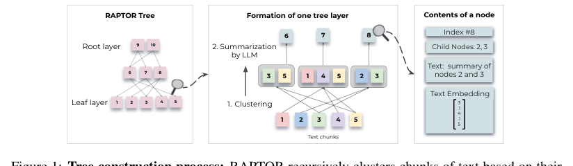
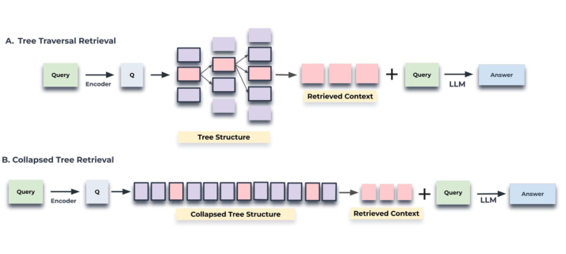
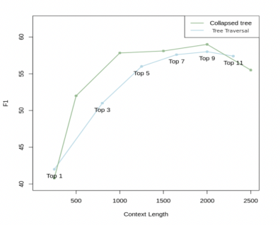
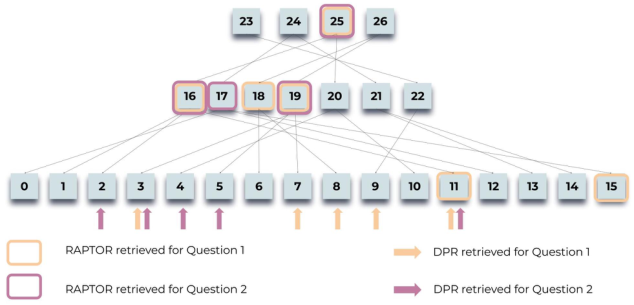
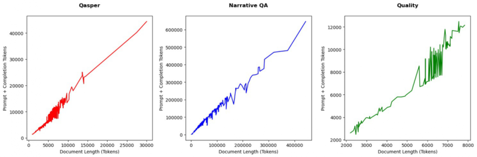
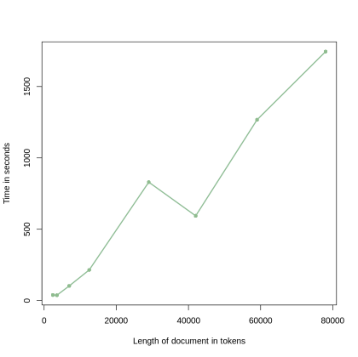
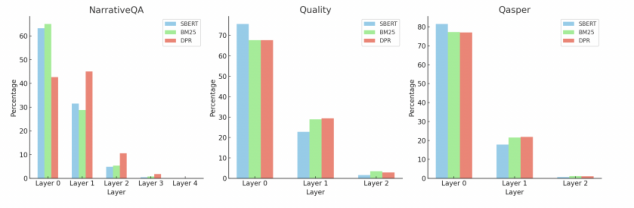

# RAPTOR：用于树形组织检索的递归抽象处理

**（RAPTOR: Recursive Abstractive Processing for Tree-Organized Retrieval）**

> 本文为 Sarthi 等人 2024 年论文《RAPTOR: Recursive Abstractive Processing for Tree-Organized Retrieval》（ICLR 2024，arXiv:2401.18059v1 [cs.CL]）的中文精确翻译。

**作者**：Parth Sarthi, Salman Abdullah, Aditi Tuli, Shubh Khanna, Anna Goldie, Christopher D. Manning

**单位**：斯坦福大学（Stanford University）

**联系方式**：psarthi@cs.stanford.edu

---

## 摘要

检索增强语言模型能够更好地适应世界状态的变化，并吸收长尾知识。然而，大多数现有方法只从检索语料库中检索短小且连续的文本块，这限制了其对整体文档语境的整体性理解。我们提出了一种新颖的方法：递归地对文本块进行嵌入、聚类和摘要生成，自底向上地构建一棵具有不同摘要层级的树。在推理时，我们的 RAPTOR 模型从这棵树中进行检索，在不同抽象层级上整合贯穿长篇文档的信息。受控实验表明，与传统的检索增强语言模型相比，利用递归摘要进行检索在多个任务上都有显著提升。在涉及复杂多步推理的问答任务上，我们取得了最先进（state-of-the-art）的结果；例如，通过将 RAPTOR 检索与 GPT-4 结合使用，我们能够在 QuALITY 基准上将最佳性能的绝对准确率提升 20%。

---

## 1 引言

大语言模型（Large Language Models，LLM）已经崛起为具有变革性的工具，在众多任务上展现出令人瞩目的性能。随着 LLM 规模的不断增长，它们可以作为非常有效的独立知识库，将事实编码在自身参数之中（Petroni et al., 2019; Jiang et al., 2020; Talmor et al., 2020; Rae et al., 2021; Hoffmann et al., 2022; Chowdhery et al., 2022; Bubeck et al., 2023; Kandpal et al., 2023），并且这些模型还可以通过在下游任务上进行微调得到进一步改进（Roberts et al., 2020）。然而，即便是大型模型也不包含特定任务所需的充分领域知识，而且世界在持续变化，使 LLM 中的事实失效。通过额外的微调或编辑来更新这些模型的知识是困难的，尤其是在处理海量文本语料库时（Lewis et al., 2020; Mitchell et al., 2022）。一种替代方法是开放域问答系统中开创的做法（Chen et al., 2017; Yu et al., 2018）：将大量文本切分为块（段落）后，在独立的信息检索系统中建立索引。检索到的信息随后连同问题一起作为上下文呈现给 LLM（"检索增强"（retrieval augmentation），Lewis et al., 2020; Izacard et al., 2022; Min et al., 2023; Ram et al., 2023），这使得为系统提供特定领域的最新知识变得容易，并能实现便捷的可解释性和出处（provenance）追踪；而相比之下，LLM 的参数化知识是不透明的，难以追溯其来源（Akyurek et al., 2022）。

然而，现有的检索增强方法也存在缺陷。我们要解决的是其中一点：大多数现有方法只检索少量短小、连续的文本块，这限制了它们表示和利用大规模篇章结构的能力。这对于需要整合文本多个部分知识的主题性问题尤为相关，例如在 NarrativeQA 数据集（Kočiský et al., 2018）中理解整本书。以灰姑娘（Cinderella）的童话故事为例，考虑问题"灰姑娘是如何迎来她的幸福结局的？"。检索到的 top-k 个短小连续文本不足以提供回答该问题的语境。

为了解决这一问题，我们设计了一种索引与检索系统，利用树结构来同时捕捉文本的高层与低层细节。如图 1 所示，我们的系统 RAPTOR 对文本块进行聚类，生成这些聚类的文本摘要，然后重复这一过程，自底向上地构建一棵树。这种结构使 RAPTOR 能够将代表文本不同层级的块加载到 LLM 的上下文中，从而有效且高效地回答不同层级的问题。



**图 1**：树的构建过程：RAPTOR 根据文本块的向量嵌入递归地对文本块进行聚类，并生成这些聚类的文本摘要，自底向上地构建一棵树。被聚在一起的节点互为兄弟节点；父节点包含该聚类的文本摘要。

我们的主要贡献在于：提出利用文本摘要来实现不同尺度上下文的检索增强这一思想，并在长文档集合的实验上证明了其有效性。使用三种语言模型（UnifiedQA（Khashabi et al., 2020）、GPT-3（Brown et al., 2020）和 GPT-4（OpenAI, 2023））进行的受控实验表明，RAPTOR 优于当前的检索增强方法。此外，RAPTOR 与 GPT-4 结合（有时甚至与 UnifiedQA 结合）在三个 QA 任务上取得了新的最先进结果：关于书籍和电影的开放式文本回答（NarrativeQA，Kočiský et al. 2018）、NLP 论文全文（QASPER，Dasigi et al. 2021），以及基于中等长度篇章的多项选择题（QuALITY，Pang et al. 2022）。¹

> ¹ 我们将在[此处](https://github.com/parthsarthi03/raptor)公开 RAPTOR 的代码。

---

## 2 相关工作

**为什么要检索（Why Retrieval?）**：硬件和算法方面的最新进展确实扩展了模型能够处理的上下文长度，从而引发了关于是否需要检索系统的疑问（Dai et al., 2019; Dao et al., 2022; Liu et al., 2023）。然而，正如 Liu et al. (2023) 和 Sun et al. (2021) 所指出的，模型往往会低估长距离上下文的利用价值，并且随着上下文长度的增加，性能会逐渐下降，尤其是当相关信息嵌在冗长的上下文之中时。此外，从实际角度看，使用长上下文的成本高昂且速度缓慢。这表明，对于知识密集型任务而言，选择最相关的信息仍然至关重要。

**检索方法（Retrieval Methods）**：检索增强语言模型（Retrieval-Augmented Language Models，RALM）在多个组件上都有了改进：检索器、阅读器以及端到端系统训练。检索方法已经从传统的基于词项的技术（如 TF-IDF（Spärck Jones, 1972）和 BM25（Robertson et al., 1995; Roberts et al., 2020））过渡到基于深度学习的策略（Karpukhin et al., 2020; Khattab & Zaharia, 2020; Sachan et al., 2023）。近期一些工作提出将大语言模型用作检索器，因为它们能够记忆海量知识（Yu et al., 2022; Sun et al., 2022）。关于阅读器组件的研究包括解码器内融合（Fusion-in-Decoder，FiD）（Izacard & Grave, 2022），它同时采用 DPR 和 BM25 进行检索，并在编码器中独立处理各段落；以及 RETRO（Borgeaud et al., 2022; Wang et al., 2023），它利用跨块注意力（cross-chunked attention）和逐块检索，基于检索到的上下文生成文本。端到端系统训练方面的工作包括 Atlas（Izacard et al., 2022），它将编码器-解码器模型与检索器联合微调；REALM（Guu et al., 2020），一个针对开放域问答微调的双向掩码语言模型；以及 RAG（检索增强生成，Retrieval-Augmented Generation）（Lewis et al., 2020），它将预训练的序列到序列模型与神经检索器相结合。Min et al. (2021) 提出了联合段落检索（Joint Passage Retrieval，JPR）模型，它使用树解码算法来处理多答案检索中的段落多样性和相关性。稠密层次检索（Dense Hierarchical Retrieval，DHR）和混合层次检索（Hybrid Hierarchical Retrieval，HHR）分别通过结合文档级与段落级检索、整合稀疏与稠密检索方法，代表了检索精度方面的进步（Liu et al., 2021; Arivazhagan et al., 2023）。

尽管方法多样，但模型的检索组件主要仍依赖于标准做法，即对语料库进行分块并用基于 BERT 的检索器编码。虽然这种方法被广泛采用，但 Nair et al. (2023) 指出了一个潜在缺陷：连续切分可能无法捕捉文本的完整语义深度。阅读从技术或科学文档中抽取的片段可能缺乏重要语境，使其难以理解甚至具有误导性（Cohan & Goharian, 2017; Newman et al., 2023; Zhang et al., 2023）。

**递归摘要作为上下文（Recursive summarization as Context）**：摘要技术提供了对文档的浓缩视图，使人们能够更聚焦地与内容进行交互（Angelidis & Lapata, 2018）。Gao et al. (2023) 的摘要/片段模型使用了段落的摘要和片段，这在大多数数据集上提高了正确性，但有时会成为一种有损的压缩方式。Wu et al. (2021) 的递归抽象摘要模型采用任务分解，先对较小的文本块进行摘要，随后将这些摘要整合成更大章节的摘要。虽然这种方法在捕捉更广泛主题方面很有效，但可能会遗漏细粒度细节。LlamaIndex（Liu, 2022）通过类似地对相邻文本块进行摘要，同时保留中间节点从而存储不同层级的细节，缓解了这一问题，从而保留细粒度细节。然而，这两种方法由于依赖相邻性来对相邻节点进行分组或摘要，仍可能忽略文本中相距较远的相互依赖关系，而我们可以通过 RAPTOR 找到并分组这些关系。

---

## 3 方法

**RAPTOR 概述**：基于长篇文本通常呈现子主题和层级结构这一思想（Cao & Wang, 2022; Dong et al., 2023b），RAPTOR 通过构建递归树结构来解决阅读中的语义深度与关联问题，该结构在更广泛的主题理解与细粒度细节之间取得平衡，并允许节点基于语义相似性（而不仅仅是文本顺序）进行分组。

RAPTOR 树的构建始于将检索语料库切分为长度为 100 个 token 的短小连续文本，这与传统的检索增强技术类似。如果某个句子超过了 100 个 token 的限制，我们将整个句子移到下一个块，而不是在句子中间截断。这保持了每个块内文本的语境和语义连贯性。然后使用 SBERT——一个基于 BERT 的编码器（multi-qa-mpnet-base-cos-v1）（Reimers & Gurevych, 2019）对这些文本进行嵌入。这些块及其对应的 SBERT 嵌入构成了我们树结构的叶节点。

为了对相似的文本块进行分组，我们采用了一种聚类算法。聚类完成后，使用语言模型对分组后的文本进行摘要。这些摘要文本随后被重新嵌入，嵌入、聚类和摘要的循环持续进行，直到进一步聚类变得不可行为止，最终形成对原始文档的结构化、多层树表示。RAPTOR 的一个重要特点是其计算效率。该系统在构建时间和 token 消耗两方面都呈线性扩展，使其适合处理大型复杂语料库。关于 RAPTOR 可扩展性的全面讨论，请参阅附录 A。

对于在这棵树中进行查询，我们引入了两种不同的策略：树遍历（tree traversal）和折叠树（collapsed tree）。树遍历方法逐层遍历树，在每一层剪枝并选择最相关的节点。折叠树方法则跨所有层集体评估节点，以找出最相关的节点。

**聚类算法**：聚类在构建 RAPTOR 树中扮演着关键角色，将文本段组织成有凝聚力的分组。这一步将相关内容归并在一起，有助于后续的检索过程。

我们聚类方法的一个独特之处在于使用了软聚类（soft clustering），即节点可以属于多个聚类，而不要求固定的聚类数量。这种灵活性至关重要，因为单个文本段往往包含与多个主题相关的信息，因此有理由将其纳入多个摘要之中。

我们的聚类算法基于高斯混合模型（Gaussian Mixture Models，GMM），这种方法兼具灵活性和概率框架。GMM 假设数据点是由若干个高斯分布的混合生成的。

给定一组 N 个文本段，每个文本段表示为一个 d 维稠密向量嵌入，文本向量 x 在属于第 k 个高斯分布的条件下的似然记为 P(x|k) = N(x; μ_k, Σ_k)。整体概率分布是加权组合 P(x) = Σ_{k=1}^{K} π_k · N(x; μ_k, Σ_k)，其中 π_k 表示第 k 个高斯分布的混合权重。

向量嵌入的高维性给传统 GMM 带来了挑战，因为在高维空间中，使用距离度量来衡量相似性时表现可能很差（Aggarwal et al., 2001）。为了缓解这一问题，我们采用了统一流形近似与投影（Uniform Manifold Approximation and Projection，UMAP），一种用于降维的流形学习技术（McInnes et al., 2018）。UMAP 中的最近邻数量参数 n_neighbors 决定了局部结构与全局结构保持之间的平衡。我们的算法通过改变 n_neighbors 来创建层级聚类结构：它首先识别全局聚类，然后在这些全局聚类内部进行局部聚类。这种两阶段聚类过程捕捉了文本数据之间从广泛主题到具体细节的广泛关系。

如果一个局部聚类的组合上下文超过了摘要模型的 token 阈值，我们的算法会在该聚类内部递归地进行聚类，确保上下文保持在 token 阈值之内。

为了确定最优聚类数量，我们采用贝叶斯信息准则（Bayesian Information Criterion，BIC）进行模型选择。BIC 不仅惩罚模型复杂度，还奖励拟合优度（Schwarz, 1978）。给定 GMM 的 BIC 为 BIC = ln(N)·k − 2·ln(L̂)，其中 N 是文本段（或数据点）的数量，k 是模型参数的数量，L̂ 是模型似然函数的最大化值。在 GMM 的语境下，参数数量 k 是输入向量维数和聚类数量的函数。

在通过 BIC 确定最优聚类数量后，使用期望最大化（Expectation-Maximization）算法来估计 GMM 参数，即均值、协方差和混合权重。

虽然 GMM 中的高斯假设可能与文本数据的性质并不完全一致（文本数据往往呈现稀疏且偏斜的分布），但我们的经验观察表明，它为我们提供了有效的模型。我们进行了一项消融实验，将 GMM 聚类与对连续块进行摘要进行比较，详情见附录 B。

**基于模型的摘要生成**：在使用高斯混合模型对节点进行聚类之后，每个聚类中的节点被送入语言模型进行摘要。这一步使模型能够将大块文本转化为对所选节点的简洁、连贯的摘要。在我们的实验中，我们使用 gpt-3.5-turbo 来生成摘要。摘要步骤将可能庞大的检索信息压缩到可管理的规模。我们在附录 C 中提供了由于摘要带来的压缩统计信息，在附录 D 中提供了用于摘要的提示词。

虽然摘要模型通常能生成可靠的摘要，但一项有针对性的标注研究发现，约 4% 的摘要包含轻微幻觉（hallucination）。这些幻觉并未传播到父节点，并且对问答任务没有可察觉的影响。关于幻觉的深入分析，请参阅附录 E。

**查询（Querying）**：在本节中，我们详细阐述 RAPTOR 采用的两种查询机制：树遍历和折叠树。这些方法提供了遍历多层 RAPTOR 树以检索相关信息的独特方式，各自都有其优点与权衡。我们在附录 F 中提供了两种方法的伪代码。注意，我们使用 SBERT 嵌入所有节点。

树遍历方法首先根据与查询嵌入的余弦相似度，选择 top-k 个最相关的根节点。下一层考虑这些被选中节点的子节点，并再次根据它们与查询向量的余弦相似度从该池中选出 top-k 个节点。这一过程不断重复，直到到达叶节点。最后，将所有选中节点的文本拼接起来，形成检索到的上下文。该算法的步骤如下：

1. 从 RAPTOR 树的根层开始。计算查询嵌入与该初始层所有节点嵌入之间的余弦相似度。
2. 根据最高的余弦相似度分数选择 top-k 个节点，形成集合 S1。
3. 进入集合 S1 中元素的子节点。计算查询向量与这些子节点向量嵌入之间的余弦相似度。
4. 选择与查询余弦相似度分数最高的 top-k 个子节点，形成集合 S2。
5. 对 d 层递归地继续此过程，产生集合 S1, S2, …, Sd。
6. 将集合 S1 至 Sd 拼接起来，组装出与查询相关的上下文。



**图 2**：树遍历与折叠树检索机制的示意图。树遍历从树的根层开始，根据与查询向量的余弦相似度检索 top-k（此处为 top-1）个节点。在每一层，它从前一层 top-k 节点的子节点中检索 top-k 个节点。折叠树将树折叠为单层，并基于与查询向量的余弦相似度检索节点，直到达到 token 数量的阈值。两种示意图中都高亮显示了执行余弦相似度搜索的节点。

通过调整深度 d 和每层选择的节点数量 k，树遍历方法可以对所检索信息的专一性和广度进行控制。该算法从考虑树的顶层开始，以宽阔的视野起步，并在向下层下降的过程中逐步聚焦于更细的细节。

折叠树方法通过同时考虑树中的所有节点，提供了一种更简单的相关信息搜索方式，如图 2 所示。该方法不是逐层进行，而是将多层树展平为单层，实质上将所有节点放到同一层级进行比较。该方法的步骤如下：

1. 首先，将整棵 RAPTOR 树折叠为单层。这个新的节点集合记为 C，包含原始树每一层的节点。
2. 接下来，计算查询嵌入与折叠集合 C 中所有节点嵌入之间的余弦相似度。
3. 最后，挑选与查询余弦相似度分数最高的 top-k 个节点。不断将节点加入结果集，直到达到预定义的最大 token 数量，确保不超过模型的输入限制。

我们在 QASPER 数据集的 20 个故事上测试了这两种方法。图 3 展示了不同 top-k 值下的树遍历以及不同最大 token 数量下的折叠树的性能。折叠树方法始终表现更好。我们认为折叠树检索更好，是因为它比树遍历提供了更大的灵活性；也就是说，通过同时搜索所有节点，它能够检索到与给定问题粒度级别相符的信息。相比之下，当使用相同的 d 值和 k 值进行树遍历时，来自树各层的节点比例将是恒定的。因此，无论问题如何，高层主题信息与细粒度细节的比例都将保持不变。



**图 3**：查询方法的比较。在 QASPER 数据集的 20 个故事上的结果，使用不同 top-k 值的树遍历，以及不同上下文长度的折叠树。折叠树使用 2000 个 token 取得了最佳结果，因此我们采用这种查询策略作为主要结果的查询方式。

然而，折叠树方法的一个缺点是，它需要对树中的所有节点执行余弦相似度搜索。不过，这可以通过 FAISS（Johnson et al., 2019）等快速 k 近邻库来提高效率。

总体而言，鉴于折叠树方法具有更大的灵活性，并且在 QASPER 数据集的子集上表现出更优越的性能，我们以该查询方法继续推进。具体来说，我们使用最大 2000 个 token 的折叠树，这大约相当于检索 top-20 个节点。使用基于 token 的方法可以确保上下文不会超过模型的上下文约束，因为不同节点的 token 数量可能各不相同。对于使用 UnifiedQA 模型的实验，我们提供 400 个 token 的上下文，因为 UnifiedQA 的最大上下文长度为 512 个 token。我们为 RAPTOR 和基线提供相同数量的上下文 token。

**定性研究**：我们进行了一项定性分析，以理解 RAPTOR 检索过程相比稠密段落检索（Dense Passage Retrieval，DPR）方法的优势。我们的研究聚焦于一个 1500 词的灰姑娘童话故事上的主题性、多跳问题。如图 4 所示，RAPTOR 基于树的检索使其能够从不同的树层选择节点，以匹配问题的细节层级。这种方法通常比 DPR 为下游任务产生更相关、更全面的信息。关于具体问题下 RAPTOR 与 DPR 各自检索到的文本等详细讨论与示例，请参阅附录 G。

---

## 4 实验

**数据集**：我们在三个问答数据集上衡量 RAPTOR 的性能：NarrativeQA、QASPER 和 QuALITY。

NarrativeQA 是一个由基于书籍和电影剧本全文的问答对组成的数据集，总计 1,572 篇文档（Kočiský et al., 2018; Wu et al., 2021）。NarrativeQA-Story 任务要求对整个叙事有全面理解才能准确回答其问题，从而测试模型在文学领域理解较长文本的能力。我们使用标准的 BLEU（B-1、B-4）、ROUGE（R-L）和 METEOR（M）指标来衡量该数据集上的性能。关于我们实验中使用的 NarrativeQA 评估脚本的更多细节，请参阅附录 H。

QASPER 数据集包含 1,585 篇 NLP 论文上的 5,049 个问题，每个问题都针对嵌入在全文中的信息进行探究（Dasigi et al., 2021）。QASPER 中的答案类型分为可回答/不可回答（Answerable/Unanswerable）、是/否（Yes/No）、抽象式（Abstractive）和抽取式（Extractive）。准确率使用标准 F1 来衡量。

最后，QuALITY 数据集由多项选择题组成，每道题都配有平均长度约 5,000 个 token 的上下文段落（Pang et al., 2022）。该数据集要求对整个文档进行推理来完成 QA 任务，使我们能够衡量检索系统在中等长度文档上的性能。该数据集包含一个具有挑战性的子集 QuALITY-HARD，其中包含大多数人类标注者在限时设定下回答错误的问题。我们报告整个测试集和 HARD 子集的准确率。

**受控基线对比**：我们首先使用 UnifiedQA 3B 作为阅读器，使用 SBERT（Reimers & Gurevych, 2019）、BM25（Robertson et al., 1995; 2009）和 DPR（Karpukhin et al., 2020）作为嵌入模型，在 QASPER、NarrativeQA 和 QuALITY 三个数据集上，分别在有和没有 RAPTOR 树结构的情况下进行受控对比。如表 1 和表 2 所示，我们的结果表明，RAPTOR 与任何检索器结合时，都能在所有数据集上始终优于对应的检索器。²

> ² 对于表 1 和表 2 中的 DPR 实验，我们使用了 dpr-multiset-base 模型，而非此前其余实验中使用的 dpr-single-nq-base。这一决定基于 Karpukhin et al. (2020) 中观察到的性能，其中 dpr-multiset-base 表现更优。

由于 RAPTOR 与 SBERT 结合性能最佳，我们在后续所有实验中都使用它。



**图 4**：查询过程：RAPTOR 如何为两个关于灰姑娘故事的问题检索信息的示意图："故事的中心主题是什么？"和"灰姑娘是如何迎来幸福结局的？"。高亮节点表示 RAPTOR 的选择，而箭头指向 DPR 的叶节点。值得注意的是，RAPTOR 的上下文通常涵盖 DPR 检索到的信息，无论是以直接的方式还是作为更高层摘要的一部分。

我们现在使用三种不同的 LLM：GPT-3、GPT-4 和 UnifiedQA，将 RAPTOR 与 BM25 和 DPR 进行比较。如表 3 所示，在 QASPER 数据集上，RAPTOR 在全部三种语言模型上都始终优于 BM25 和 DPR。当使用 GPT-3、GPT-4 和 UnifiedQA 时，RAPTOR 的 F-1 Match 分数分别为 53.1%、55.7% 和 36.6%。这些分数分别比 DPR 高出 1.8、2.7 和 4.5 个百分点，并在相应的 LLM 上分别比 BM25 高出 6.5、5.5 和 10.2 个百分点。QASPER 要求综合 NLP 论文中的信息，因此 RAPTOR 的高层摘要节点使其能够优于那些只能抽取 top-k 个最相似原始文本块的方法并不令人意外，因为那些孤立抽取的文本块可能并不包含正确答案。

**表 1**：NarrativeQA 上使用与不使用 RAPTOR 的性能：在 NarrativeQA 数据集上，各种检索方法（SBERT、BM25、DPR）使用与不使用 RAPTOR 的性能比较，以 UnifiedQA-3B 作为语言模型。RAPTOR 优于各相应检索方法的基线。

| 模型 | ROUGE | BLEU-1 | BLEU-4 | METEOR |
|---|---|---|---|---|
| SBERT + RAPTOR | 30.87% | 23.50% | 6.42% | 19.20% |
| SBERT（无 RAPTOR） | 29.26% | 22.56% | 5.95% | 18.15% |
| BM25 + RAPTOR | 27.93% | 21.17% | 5.70% | 17.03% |
| BM25（无 RAPTOR） | 23.52% | 17.73% | 4.65% | 13.98% |
| DPR + RAPTOR | 30.94% | 23.51% | 6.45% | 19.05% |
| DPR（无 RAPTOR） | 29.56% | 22.84% | 6.12% | 18.44% |

同样，在如表 4 所示的 QuALITY 数据集上，RAPTOR 取得了 62.4% 的准确率，比 DPR 和 BM25 分别提高了 2% 和 5.1%。当使用 UnifiedQA 时也观察到类似的趋势，RAPTOR 分别比 DPR 和 BM25 高出 2.7% 和 6.7%。

最后，在如表 6 所示的 NarrativeQA 数据集上，RAPTOR 在多个指标上都表现优异。在 ROUGE-L 上，它分别比 BM25 和 DPR 高出 7.3 和 2.7 个百分点。在 BLEU-1、BLEU-4 和 METEOR 等其他指标上，RAPTOR 分别以 1.7 至 5.8 和 0.7 至 2.1 个百分点的幅度优于 BM25 和 DPR。

**表 2**：QuALITY 和 QASPER 上使用与不使用 RAPTOR 的性能：在 QuALITY 和 QASPER 数据集上，各种检索方法（SBERT、BM25、DPR）使用与不使用 RAPTOR 的性能比较。以 UnifiedQA-3B 作为语言模型。在两个数据集上，RAPTOR 均优于各相应检索方法的基线。

| 模型 | 准确率（QuALITY） | 答案 F1（QASPER） |
|---|---|---|
| SBERT + RAPTOR | 56.6% | 36.70% |
| SBERT（无 RAPTOR） | 54.9% | 36.23% |
| BM25 + RAPTOR | 52.1% | 27.00% |
| BM25（无 RAPTOR） | 49.9% | 26.47% |
| DPR + RAPTOR | 54.7% | 32.23% |
| DPR（无 RAPTOR） | 53.1% | 31.70% |

**表 3**：使用三种不同语言模型（GPT-3、GPT-4、UnifiedQA 3B）和各种检索方法，在 QASPER 数据集上 F-1 分数的受控比较。"Title + Abstract"列反映仅使用论文标题和摘要作为上下文时的性能。RAPTOR 在所有测试的语言模型上都优于既有基线 BM25 和 DPR。具体来说，RAPTOR 的 F-1 分数至少比 DPR 高 1.8 个百分点，至少比 BM25 高 5.3 个百分点。

| 检索器 | GPT-3 F-1 Match | GPT-4 F-1 Match | UnifiedQA F-1 Match |
|---|---|---|---|
| 标题 + 摘要 | 25.2 | 22.2 | 17.5 |
| BM25 | 46.6 | 50.2 | 26.4 |
| DPR | 51.3 | 53.0 | 32.1 |
| RAPTOR | 53.1 | 55.7 | 36.6 |

**表 4**：两种不同语言模型（GPT-3、UnifiedQA 3B）使用各种检索方法在 QuALITY 开发集上的准确率比较。RAPTOR 在准确率上比 BM25 和 DPR 的基线至少高出 2.0%。

| 模型 | GPT-3 准确率 | UnifiedQA 准确率 |
|---|---|---|
| BM25 | 57.3 | 49.9 |
| DPR | 60.4 | 53.9 |
| RAPTOR | 62.4 | 56.6 |

**表 5**：各种模型在 QASPER 数据集上的 F-1 Match 分数结果。

| 模型 | F-1 Match |
|---|---|
| LongT5 XL（Guo et al., 2022） | 53.1 |
| CoLT5 XL（Ainslie et al., 2023） | 53.9 |
| RAPTOR + GPT-4 | 55.7 |

**与最先进系统的比较**：在我们的受控对比基础上，我们考察了 RAPTOR 相对于其他最先进模型的性能。如表 5 所示，RAPTOR 与 GPT-4 结合在 QASPER 上树立了新基准，F-1 分数为 55.7%，超过了 CoLT5 XL 的 53.9%。

在 QuALITY 数据集上，如表 7 所示，RAPTOR 与 GPT-4 搭配取得了 82.6% 的准确率，树立了新的最先进水平，超过了此前的最佳结果 62.3%。特别是，它在 QuALITY-HARD 上比 CoLISA 高出 21.5%，QuALITY-HARD 代表人类需要异常长时间才能正确回答的问题，需要重读文本的某些部分、进行困难的推理，或两者兼有。

对于 NarrativeQA 数据集，如表 6 所示，RAPTOR 与 UnifiedQA 搭配树立了新的最先进 METEOR 分数。与 Wu et al. (2021) 同样采用 UnifiedQA 的递归摘要模型相比，RAPTOR 在所有指标上都优于它。虽然 Wu et al. (2021) 仅依赖树结构顶部根节点中的摘要，但 RAPTOR 受益于其中间层和聚类方法，使其能够捕捉从总体主题到具体细节的一系列信息，从而促成其整体强劲的性能。

**表 6**：在 NarrativeQA 数据集上多个模型的性能比较，聚焦四个指标：ROUGE-L、BLEU-1、BLEU-4 和 METEOR。RAPTOR 与 UnifiedQA 3B 搭配时，不仅超越了 BM25 和 DPR 等检索方法，还在 METEOR 指标上树立了新的最先进水平。

| 模型 | ROUGE-L | BLEU-1 | BLEU-4 | METEOR |
|---|---|---|---|---|
| BiDAF（Kočiský et al., 2018） | 6.2 | 5.7 | 0.3 | 3.7 |
| BM25 + BERT（Mou et al., 2020） | 15.5 | 14.5 | 1.4 | 5.0 |
| 递归摘要书籍（Wu et al., 2021） | 21.6 | 22.3 | 4.2 | 10.6 |
| Retriever + Reader（Izacard & Grave, 2022） | 32.0 | 35.3 | 7.5 | 11.1 |
| RAPTOR + UnifiedQA | 30.8 | 23.5 | 6.4 | 19.1 |

**表 7**：QuALITY 数据集在整体测试集和更具挑战性的困难子集上的准确率。GPT-4 与 RAPTOR 结合树立了新的最先进水平。

| 模型 | 准确率（测试集） | 准确率（困难子集） |
|---|---|---|
| Longformer-base（Beltagy et al., 2020） | 39.5 | 35.3 |
| DPR 和 DeBERTaV3-large（Pang et al., 2022） | 55.4 | 46.1 |
| CoLISA（DeBERTaV3-large）（Dong et al., 2023a） | 62.3 | 54.7 |
| RAPTOR + GPT-4 | 82.6 | 76.2 |

### 4.1 树结构的贡献

我们考察了每一层节点对 RAPTOR 检索能力的贡献。我们假设上层节点在处理需要更广泛文本理解的主题性或多跳查询中起着至关重要的作用。

**表 8**：在 QuALITY 数据集的 Story 1 上，RAPTOR 查询不同树层时的性能。列表示不同的起始点（最高层），行表示查询的层数。

| 查询层数 / 起始层 | 第 0 层（叶节点） | 第 1 层 | 第 2 层 |
|---|---|---|---|
| 1 层 | 57.9 | 57.8 | 57.9 |
| 2 层 | — | 52.6 | 63.15 |
| 3 层 | — | — | 73.68 |

我们从定量和定性两方面验证了这一假设。定性分析见附录 G。为了定量理解上层节点的贡献，我们使用了 QuALITY 数据集中的故事。如第 3 节所述，为每个故事构建 RAPTOR 树。然而，在检索过程中，我们将搜索限制在不同的层子集上。例如，我们仅从叶节点、每个上层，以及不同的连续层子集进行检索。我们在表 8 中展示了针对一个故事的发现，结果表明，利用所有层的全树搜索优于仅聚焦特定层的检索策略。

这些发现凸显了 RAPTOR 中完整树结构的重要性。通过同时提供原始文本和更高层的摘要用于检索，RAPTOR 能够有效处理更广泛的问题，从高层主题查询到细节导向的问题。更多故事以及关于层贡献的消融研究的详细结果见附录 I。

---

## 5 结论

在本文中，我们提出了 RAPTOR，一种新颖的基于树的检索系统，它以不同抽象层级的上下文信息增强大语言模型的参数化知识。通过采用递归聚类和摘要技术，RAPTOR 创建了一种层级树结构，能够综合检索语料库各章节的信息。在查询阶段，RAPTOR 利用这种树结构实现更有效的检索。我们的受控实验表明，RAPTOR 不仅优于传统检索方法，还在多个问答任务上树立了新的性能基准。

---

## 6 可复现性声明

**用于 QA 和摘要的语言模型**：我们的 RAPTOR 实验使用了四种语言模型：用于 QA 任务的 GPT-3 和 GPT-4，以及用于摘要的 GPT-3.5-turbo。gpt-3、gpt-4 和 gpt-3.5-turbo 模型可以通过 API 调用（OpenAI API）访问。用于 QA 任务的 UnifiedQA 在 Hugging Face 上公开可用。

**评估数据集**：我们实验中使用的三个评估数据集——QuALITY、QASPER 和 NarrativeQA——都是公开可访问的。这些数据集确保了本研究中进行的检索和 QA 测试可以被复现。

**源代码**：RAPTOR 的源代码将在[此处](https://github.com/parthsarthi03/raptor)公开。

---

## 参考文献

Charu C Aggarwal, Alexander Hinneburg, and Daniel A Keim. On the Surprising Behavior of Distance Metrics in High Dimensional Space. In Database Theory—ICDT 2001: 8th International Conference London, UK, January 4–6, 2001 Proceedings 8, pp. 420–434. Springer, 2001. URL https://link.springer.com/chapter/10.1007/3-540-44503-x_27.

Joshua Ainslie, Tao Lei, Michiel de Jong, Santiago Ontañón, Siddhartha Brahma, Yury Zemlyanskiy, David Uthus, Mandy Guo, James Lee-Thorp, Yi Tay, et al. CoLT5: Faster long-range transformers with conditional computation. arXiv preprint arXiv:2303.09752, 2023. URL https://arxiv.org/abs/2303.09752.

Ekin Akyurek, Tolga Bolukbasi, Frederick Liu, Binbin Xiong, Ian Tenney, Jacob Andreas, and Kelvin Guu. Towards tracing knowledge in language models back to the training data. In Findings of the Association for Computational Linguistics: EMNLP 2022, pp. 2429–2446, Abu Dhabi, United Arab Emirates, December 2022. Association for Computational Linguistics. doi: 10.18653/v1/2022.findings-emnlp.180. URL https://aclanthology.org/2022.findings-emnlp.180.

Stefanos Angelidis and Mirella Lapata. Summarizing opinions: Aspect extraction meets sentiment prediction and they are both weakly supervised. arXiv preprint arXiv:1808.08858, 2018. URL https://arxiv.org/abs/1808.08858.

Manoj Ghuhan Arivazhagan, Lan Liu, Peng Qi, Xinchi Chen, William Yang Wang, and Zhiheng Huang. Hybrid hierarchical retrieval for open-domain question answering. In Anna Rogers, Jordan Boyd-Graber, and Naoaki Okazaki (eds.), Findings of the Association for Computational Linguistics: ACL 2023, pp. 10680–10689, Toronto, Canada, July 2023. Association for Computational Linguistics. doi: 10.18653/v1/2023.findings-acl.679. URL https://aclanthology.org/2023.findings-acl.679.

Iz Beltagy, Matthew E. Peters, and Arman Cohan. Longformer: The Long-document Transformer, 2020. URL https://arxiv.org/abs/2004.05150. arXiv preprint arXiv:2004.05150.

Sebastian Borgeaud, Arthur Mensch, Jordan Hoffmann, Trevor Cai, Eliza Rutherford, Katie Millican, George Bm Van Den Driessche, Jean-Baptiste Lespiau, Bogdan Damoc, Aidan Clark, et al. Improving language models by retrieving from trillions of tokens. In International conference on machine learning, pp. 2206–2240. PMLR, 2022. URL https://arxiv.org/abs/2112.04426.

Tom Brown, Benjamin Mann, Nick Ryder, Melanie Subbiah, Jared D Kaplan, Prafulla Dhariwal, Arvind Neelakantan, Pranav Shyam, Girish Sastry, Amanda Askell, Sandhini Agarwal, Ariel Herbert-Voss, Gretchen Krueger, Tom Henighan, Rewon Child, Aditya Ramesh, Daniel Ziegler, Jeffrey Wu, Clemens Winter, Chris Hesse, Mark Chen, Eric Sigler, Mateusz Litwin, Scott Gray, Benjamin Chess, Jack Clark, Christopher Berner, Sam McCandlish, Alec Radford, Ilya Sutskever, and Dario Amodei. Language Models are Few-Shot Learners. In H. Larochelle, M. Ranzato, R. Hadsell, M.F. Balcan, and H. Lin (eds.), Advances in Neural Information Processing Systems, volume 33, pp. 1877–1901. Curran Associates, Inc., 2020. URL https://proceedings.neurips.cc/paper_files/paper/2020/file/1457c0d6bfcb4967418bfb8ac142f64a-Paper.pdf.

Sébastien Bubeck, Varun Chandrasekaran, Ronen Eldan, Johannes Gehrke, Eric Horvitz, Ece Kamar, Peter Lee, Yin Tat Lee, Yuanzhi Li, Scott Lundberg, et al. Sparks of Artificial General Intelligence: Early Experiments with GPT-4. arXiv preprint arXiv:2303.12712, 2023. URL https://arxiv.org/abs/2303.12712.

Shuyang Cao and Lu Wang. HIBRIDS: Attention with hierarchical biases for structure-aware long document summarization. In Proceedings of the 60th Annual Meeting of the Association for Computational Linguistics (Volume 1: Long Papers), pp. 786–807, Dublin, Ireland, May 2022. Association for Computational Linguistics. doi: 10.18653/v1/2022.acl-long.58. URL https://aclanthology.org/2022.acl-long.58.

Danqi Chen, Adam Fisch, Jason Weston, and Antoine Bordes. Reading Wikipedia to Answer Open-Domain Questions. In Proceedings of the 55th Annual Meeting of the Association for Computational Linguistics (Volume 1: Long Papers), pp. 1870–1879, Vancouver, Canada, July 2017. Association for Computational Linguistics. doi: 10.18653/v1/P17-1171. URL https://aclanthology.org/P17-1171.

Aakanksha Chowdhery, Sharan Narang, Jacob Devlin, Maarten Bosma, Gaurav Mishra, Adam Roberts, Paul Barham, Hyung Won Chung, Charles Sutton, Sebastian Gehrmann, et al. PaLM: Scaling Language Modeling with Pathways. arXiv preprint arXiv:2204.02311, 2022. URL https://arxiv.org/abs/2204.02311.

Arman Cohan and Nazli Goharian. Contextualizing citations for scientific summarization using word embeddings and domain knowledge. In Proceedings of the 40th International ACM SIGIR Conference on Research and Development in Information Retrieval, pp. 1133–1136, 2017. URL https://dl.acm.org/doi/abs/10.1145/3077136.3080740.

Zihang Dai, Zhilin Yang, Yiming Yang, Jaime Carbonell, Quoc Le, and Ruslan Salakhutdinov. Transformer-XL: Attentive language models beyond a fixed-length context. In Proceedings of the 57th Annual Meeting of the Association for Computational Linguistics, pp. 2978–2988, Florence, Italy, July 2019. Association for Computational Linguistics. doi: 10.18653/v1/P19-1285. URL https://aclanthology.org/P19-1285.

Tri Dao, Dan Fu, Stefano Ermon, Atri Rudra, and Christopher Ré. FlashAttention: Fast and memory-efficient exact attention with IO-Awareness. Advances in Neural Information Processing Systems, 35:16344–16359, 2022. URL https://arxiv.org/abs/2205.14135.

Pradeep Dasigi, Kyle Lo, Iz Beltagy, Arman Cohan, Noah A. Smith, and Matt Gardner. A Dataset of Information-Seeking Questions and Answers Anchored in Research Papers. In Proceedings of the 2021 Conference of the North American Chapter of the Association for Computational Linguistics: Human Language Technologies, pp. 4599–4610, Online, June 2021. Association for Computational Linguistics. doi: 10.18653/v1/2021.naacl-main.365. URL https://aclanthology.org/2021.naacl-main.365.

Mengxing Dong, Bowei Zou, Yanling Li, and Yu Hong. CoLISA: Inner Interaction via Contrastive Learning for Multi-choice Reading Comprehension. In Advances in Information Retrieval: 45th European Conference on Information Retrieval, ECIR 2023, Dublin, Ireland, April 2–6, 2023, Proceedings, Part I, pp. 264–278. Springer, 2023a. URL https://link.springer.com/chapter/10.1007/978-3-031-28244-7_17.

Zican Dong, Tianyi Tang, Lunyi Li, and Wayne Xin Zhao. A survey on long text modeling with transformers. arXiv preprint arXiv:2302.14502, 2023b. URL https://arxiv.org/abs/2302.14502.

Tianyu Gao, Howard Yen, Jiatong Yu, and Danqi Chen. Enabling large language models to generate text with citations. arXiv preprint arXiv:2305.14627, 2023. URL https://arxiv.org/abs/2305.14627.

Mandy Guo, Joshua Ainslie, David Uthus, Santiago Ontanon, Jianmo Ni, Yun-Hsuan Sung, and Yinfei Yang. LongT5: Efficient text-to-text transformer for long sequences. In Findings of the Association for Computational Linguistics: NAACL 2022, pp. 724–736, Seattle, United States, July 2022. Association for Computational Linguistics. doi: 10.18653/v1/2022.findings-naacl.55. URL https://aclanthology.org/2022.findings-naacl.55.

Kelvin Guu, Kenton Lee, Zora Tung, Panupong Pasupat, and Mingwei Chang. Retrieval Augmented Language Model Pre-Training. In International conference on machine learning, pp. 3929–3938. PMLR, 2020. URL https://doi.org/10.48550/arXiv.2002.08909.

Jordan Hoffmann, Sebastian Borgeaud, Arthur Mensch, Elena Buchatskaya, Trevor Cai, Eliza Rutherford, Diego de Las Casas, Lisa Anne Hendricks, Johannes Welbl, Aidan Clark, et al. Training compute-optimal large language models. arXiv preprint arXiv:2203.15556, 2022. URL https://arxiv.org/abs/2203.15556.

Gautier Izacard and Edouard Grave. Distilling Knowledge from Reader to Retriever for Question Answering, 2022. URL https://arxiv.org/abs/2012.04584. arXiv preprint arXiv:2012.04584.

Gautier Izacard, Patrick Lewis, Maria Lomeli, Lucas Hosseini, Fabio Petroni, Timo Schick, Jane Dwivedi-Yu, Armand Joulin, Sebastian Riedel, and Edouard Grave. Few-shot learning with retrieval augmented language models. arXiv preprint arXiv:2208.03299, 2022. URL https://arxiv.org/abs/2208.03299.

Zhengbao Jiang, Frank F Xu, Jun Araki, and Graham Neubig. How can we know what language models know? Transactions of the Association for Computational Linguistics, 8:423–438, 2020. URL https://arxiv.org/abs/1911.12543.

Jeff Johnson, Matthijs Douze, and Hervé Jégou. Billion-Scale Similarity Search with GPUs. IEEE Transactions on Big Data, 7(3):535–547, 2019. URL https://arxiv.org/abs/1702.08734.

Nikhil Kandpal, Haikang Deng, Adam Roberts, Eric Wallace, and Colin Raffel. Large Language Models struggle to learn Long-Tail Knowledge. In International Conference on Machine Learning, pp. 15696–15707. PMLR, 2023. URL https://proceedings.mlr.press/v202/kandpal23a/kandpal23a.pdf.

Vladimir Karpukhin, Barlas Oguz, Sewon Min, Patrick Lewis, Ledell Wu, Sergey Edunov, Danqi Chen, and Wen-tau Yih. Dense Passage Retrieval for Open-Domain Question Answering. In Proceedings of the 2020 Conference on Empirical Methods in Natural Language Processing (EMNLP), pp. 6769–6781, Online, November 2020. Association for Computational Linguistics. doi: 10.18653/v1/2020.emnlp-main.550. URL https://aclanthology.org/2020.emnlp-main.550.

Daniel Khashabi, Sewon Min, Tushar Khot, Ashish Sabharwal, Oyvind Tafjord, Peter Clark, and Hannaneh Hajishirzi. UNIFIEDQA: Crossing format boundaries with a single QA system. In Findings of the Association for Computational Linguistics: EMNLP 2020, pp. 1896–1907, Online, November 2020. Association for Computational Linguistics. doi: 10.18653/v1/2020.findings-emnlp.171. URL https://aclanthology.org/2020.findings-emnlp.171.

Omar Khattab and Matei Zaharia. ColBERT: Efficient and effective passage search via contextualized late interaction over bert. In Proceedings of the 43rd International ACM SIGIR conference on research and development in Information Retrieval, pp. 39–48, 2020. URL https://arxiv.org/abs/2004.12832.

Tomáš Kočiský, Jonathan Schwarz, Phil Blunsom, Chris Dyer, Karl Moritz Hermann, Gábor Melis, and Edward Grefenstette. The NarrativeQA Reading Comprehension Challenge. Transactions of the Association for Computational Linguistics, 6:317–328, 2018. URL https://arxiv.org/abs/1712.07040.

Patrick Lewis, Ethan Perez, Aleksandra Piktus, Fabio Petroni, Vladimir Karpukhin, Naman Goyal, Heinrich Küttler, Mike Lewis, Wen-tau Yih, Tim Rocktäschel, et al. Retrieval-Augmented Generation for Knowledge-Intensive NLP Tasks. Advances in Neural Information Processing Systems, 33:9459–9474, 2020. URL https://doi.org/10.48550/arXiv.2005.11401.

Jerry Liu. LlamaIndex, 2022. URL https://github.com/jerryjliu/llama_index.

Nelson F Liu, Kevin Lin, John Hewitt, Ashwin Paranjape, Michele Bevilacqua, Fabio Petroni, and Percy Liang. Lost in the middle: How language models use long contexts. arXiv preprint arXiv:2307.03172, 2023. URL https://arxiv.org/abs/2307.03172.

Ye Liu, Kazuma Hashimoto, Yingbo Zhou, Semih Yavuz, Caiming Xiong, and Philip Yu. Dense hierarchical retrieval for open-domain question answering. In Marie-Francine Moens, Xuanjing Huang, Lucia Specia, and Scott Wen-tau Yih (eds.), Findings of the Association for Computational Linguistics: EMNLP 2021, pp. 188–200, Punta Cana, Dominican Republic, November 2021. Association for Computational Linguistics. doi: 10.18653/v1/2021.findings-emnlp.19. URL https://aclanthology.org/2021.findings-emnlp.19.

Leland McInnes, John Healy, and James Melville. UMAP: Uniform Manifold Approximation and Projection for Dimension Reduction, 2018. URL https://arxiv.org/abs/1802.03426. arXiv preprint arXiv:1802.03426.

Sewon Min, Kenton Lee, Ming-Wei Chang, Kristina Toutanova, and Hannaneh Hajishirzi. Joint passage ranking for diverse multi-answer retrieval. In Marie-Francine Moens, Xuanjing Huang, Lucia Specia, and Scott Wen-tau Yih (eds.), Proceedings of the 2021 Conference on Empirical Methods in Natural Language Processing, pp. 6997–7008, Online and Punta Cana, Dominican Republic, November 2021. Association for Computational Linguistics. doi: 10.18653/v1/2021.emnlp-main.560. URL https://aclanthology.org/2021.emnlp-main.560.

Sewon Min, Weijia Shi, Mike Lewis, Xilun Chen, Wen-tau Yih, Hannaneh Hajishirzi, and Luke Zettlemoyer. Nonparametric masked language modeling. In Findings of the Association for Computational Linguistics: ACL 2023, pp. 2097–2118, Toronto, Canada, July 2023. Association for Computational Linguistics. doi: 10.18653/v1/2023.findings-acl.132. URL https://aclanthology.org/2023.findings-acl.132.

Eric Mitchell, Charles Lin, Antoine Bosselut, Christopher D Manning, and Chelsea Finn. Memory-based model editing at scale. In International Conference on Machine Learning, pp. 15817–15831. PMLR, 2022. URL https://proceedings.mlr.press/v162/mitchell22a/mitchell22a.pdf.

Xiangyang Mou, Mo Yu, Bingsheng Yao, Chenghao Yang, Xiaoxiao Guo, Saloni Potdar, and Hui Su. Frustratingly hard evidence retrieval for QA over books. In Proceedings of the First Joint Workshop on Narrative Understanding, Storylines, and Events, pp. 108–113, Online, July 2020. Association for Computational Linguistics. doi: 10.18653/v1/2020.nuse-1.13. URL https://aclanthology.org/2020.nuse-1.13.

Inderjeet Nair, Aparna Garimella, Balaji Vasan Srinivasan, Natwar Modani, Niyati Chhaya, Srikrishna Karanam, and Sumit Shekhar. A neural CRF-based hierarchical approach for linear text segmentation. In Findings of the Association for Computational Linguistics: EACL 2023, pp. 883–893, Dubrovnik, Croatia, May 2023. Association for Computational Linguistics. doi: 10.18653/v1/2023.findings-eacl.65. URL https://aclanthology.org/2023.findings-eacl.65.

Benjamin Newman, Luca Soldaini, Raymond Fok, Arman Cohan, and Kyle Lo. A controllable qa-based framework for decontextualization. arXiv preprint arXiv:2305.14772, 2023. URL https://arxiv.org/pdf/2305.14772.pdf.

OpenAI. GPT-4 Technical Report. ArXiv, abs/2303.08774, 2023. URL https://arxiv.org/abs/2303.08774.

Richard Yuanzhe Pang, Alicia Parrish, Nitish Joshi, Nikita Nangia, Jason Phang, Angelica Chen, Vishakh Padmakumar, Johnny Ma, Jana Thompson, He He, and Samuel Bowman. QuALITY: Question Answering with Long Input Texts, Yes! In Proceedings of the 2022 Conference of the North American Chapter of the Association for Computational Linguistics: Human Language Technologies, pp. 5336–5358, Seattle, United States, July 2022. Association for Computational Linguistics. URL https://aclanthology.org/2022.naacl-main.391.

Fabio Petroni, Tim Rocktäschel, Patrick Lewis, Anton Bakhtin, Yuxiang Wu, Alexander H Miller, and Sebastian Riedel. Language models as knowledge bases? arXiv preprint arXiv:1909.01066, 2019. URL https://arxiv.org/abs/1909.01066.

Jack W Rae, Sebastian Borgeaud, Trevor Cai, Katie Millican, Jordan Hoffmann, Francis Song, John Aslanides, Sarah Henderson, Roman Ring, Susannah Young, et al. Scaling language models: Methods, Analysis & Insights from Training Gopher. arXiv preprint arXiv:2112.11446, 2021. URL https://arxiv.org/abs/2112.11446.

Ori Ram, Yoav Levine, Itay Dalmedigos, Dor Muhlgay, Amnon Shashua, Kevin Leyton-Brown, and Yoav Shoham. In-context retrieval-augmented language models. arXiv preprint arXiv:2302.00083, 2023. URL https://arxiv.org/abs/2302.00083.

Nils Reimers and Iryna Gurevych. Sentence-BERT: Sentence embeddings using Siamese BERT-networks. In Proceedings of the 2019 Conference on Empirical Methods in Natural Language Processing and the 9th International Joint Conference on Natural Language Processing (EMNLP-IJCNLP), pp. 3982–3992, Hong Kong, China, November 2019. Association for Computational Linguistics. doi: 10.18653/v1/D19-1410. URL https://aclanthology.org/D19-1410.

Adam Roberts, Colin Raffel, and Noam Shazeer. How Much Knowledge Can You Pack Into the Parameters of a Language Model? In Proceedings of the 2020 Conference on Empirical Methods in Natural Language Processing (EMNLP), pp. 5418–5426, Online, November 2020. Association for Computational Linguistics. doi: 10.18653/v1/2020.emnlp-main.437. URL https://aclanthology.org/2020.emnlp-main.437.

Stephen Robertson, Hugo Zaragoza, et al. The Probabilistic Relevance Framework: BM25 and Beyond. Foundations and Trends in Information Retrieval, 3(4):333–389, 2009. URL https://doi.org/10.1561/1500000019.

Stephen E Robertson, Steve Walker, Susan Jones, Micheline M Hancock-Beaulieu, Mike Gatford, et al. Okapi at TREC-3. Nist Special Publication Sp, 109:109, 1995. URL https://www.microsoft.com/en-us/research/publication/okapi-at-trec-3/.

Devendra Singh Sachan, Mike Lewis, Dani Yogatama, Luke Zettlemoyer, Joelle Pineau, and Manzil Zaheer. Questions are all you need to train a dense passage retriever. Transactions of the Association for Computational Linguistics, 11:600–616, 2023. doi: 10.1162/tacl_a_00564. URL https://aclanthology.org/2023.tacl-1.35.

Gideon Schwarz. Estimating the Dimension of a Model. The annals of statistics, pp. 461–464, 1978. URL https://projecteuclid.org/journals/annals-of-statistics/volume-6/issue-2/Estimating-the-Dimension-of-a-Model/10.1214/aos/1176344136.full.

Karen Spärck Jones. A Statistical Interpretation of Term Specificity and its Application in Retrieval. Journal of documentation, 28(1):11–21, 1972. URL https://doi.org/10.1108/eb026526.

Simeng Sun, Kalpesh Krishna, Andrew Mattarella-Micke, and Mohit Iyyer. Do long-range language models actually use long-range context? In Marie-Francine Moens, Xuanjing Huang, Lucia Specia, and Scott Wen-tau Yih (eds.), Proceedings of the 2021 Conference on Empirical Methods in Natural Language Processing, pp. 807–822, Online and Punta Cana, Dominican Republic, November 2021. Association for Computational Linguistics. doi: 10.18653/v1/2021.emnlp-main.62. URL https://aclanthology.org/2021.emnlp-main.62.

Zhiqing Sun, Xuezhi Wang, Yi Tay, Yiming Yang, and Denny Zhou. Recitation-augmented language models. arXiv preprint arXiv:2210.01296, 2022. URL https://arxiv.org/abs/2210.01296.

Alon Talmor, Yanai Elazar, Yoav Goldberg, and Jonathan Berant. oLMpics– on what language model pre-training captures. Transactions of the Association for Computational Linguistics, 8:743–758, 2020. URL https://arxiv.org/abs/1912.13283.

Boxin Wang, Wei Ping, Peng Xu, Lawrence McAfee, Zihan Liu, Mohammad Shoeybi, Yi Dong, Oleksii Kuchaiev, Bo Li, Chaowei Xiao, et al. Shall we pretrain autoregressive language models with retrieval? a comprehensive study. arXiv preprint arXiv:2304.06762, 2023. URL https://arxiv.org/abs/2304.06762.

Jeff Wu, Long Ouyang, Daniel M. Ziegler, Nisan Stiennon, Ryan Lowe, Jan Leike, and Paul Christiano. Recursively Summarizing Books with Human Feedback, 2021. URL https://arxiv.org/abs/2109.10862.

Adams Wei Yu, David Dohan, Minh-Thang Luong, Rui Zhao, Kai Chen, Mohammad Norouzi, and Quoc V. Le. QANet: Combining Local Convolution with Global Self-Attention for Reading Comprehension, 2018. URL https://arxiv.org/abs/1804.09541. arXiv preprint arXiv:1804.09541.

Wenhao Yu, Dan Iter, Shuohang Wang, Yichong Xu, Mingxuan Ju, Soumya Sanyal, Chenguang Zhu, Michael Zeng, and Meng Jiang. Generate rather than retrieve: Large Language Models are strong context generators, 2022. URL https://arxiv.org/abs/2209.10063.

Shiyue Zhang, David Wan, and Mohit Bansal. Extractive is not faithful: An investigation of broad unfaithfulness problems in extractive summarization. In Anna Rogers, Jordan Boyd-Graber, and Naoaki Okazaki (eds.), Proceedings of the 61st Annual Meeting of the Association for Computational Linguistics (Volume 1: Long Papers), pp. 2153–2174, Toronto, Canada, July 2023. Association for Computational Linguistics. doi: 10.18653/v1/2023.acl-long.120. URL https://aclanthology.org/2023.acl-long.120.

---

## 附录 A：RAPTOR 树构建过程的可扩展性与计算效率

为了评估 RAPTOR 树构建过程的计算效率和成本效益，我们在一台消费级笔记本电脑上进行了实验，具体是一台配备 16GB RAM 的 Apple M1 Mac。这些实验旨在展示 RAPTOR 在典型硬件上的可扩展性和可行性。我们将上下文长度从 12,500 变化到 78,000 个 token，并测量了完成树构建过程所需的 token 消耗和时间，从初始切分和嵌入到最终根节点的构建。



**图 5**：QASPER、NarrativeQA 和 QuALITY 上，token 成本作为文档长度的函数。对于每个数据集，RAPTOR 树构建成本都随文档长度线性扩展。

**Token 消耗**：我们实证研究了初始文档长度与树构建过程中消耗的总 token 数之间的关系，其中包括提示词（prompt）token 和补全（completion）token。在所考察的三个数据集（QuALITY、QASPER 和 NarrativeQA）中，文档长度差异显著。图 5 展示了初始文档长度与总 token 消耗之间清晰的线性相关性，强调无论文档复杂度或长度如何，RAPTOR 都保持线性的 token 扩展。



**图 6**：对于最多 80,000 个 token 的文档，构建时间作为文档长度的函数。对于每个数据集，RAPTOR 树构建时间都随文档长度线性扩展。

**构建时间**：我们还实证观察到文档长度与构建时间之间一致的线性趋势，如图 6 所示。这表明 RAPTOR 在时间上呈线性扩展，使其成为高效处理不同长度大型语料库的可行解决方案。

**结论**：总体而言，我们的实证结果表明，RAPTOR 在消耗的 token 和构建时间两方面都呈线性扩展。即使输入文本的复杂度和体量不断增长，构建树的成本也能以可预测的线性方式扩展。这表明 RAPTOR 计算效率高，非常适合处理大型多样化的语料库。

---

## 附录 B：RAPTOR 中聚类机制的消融研究

为了评估 RAPTOR 方法中聚类机制的有效性，我们在 QuALITY 数据集上进行了一项消融研究。该研究将 RAPTOR 的性能与对连续块进行平衡树式编码和摘要的方法进行对比，后者与我们的标准聚类方法形成对照。

### B.1 方法

本消融研究中的两种配置都使用 SBERT 嵌入和 UnifiedQA，以保持检索的一致性。对于 RAPTOR，我们采用了我们典型的聚类和摘要过程。相比之下，替代设置通过递归编码和摘要连续的文本块来创建一棵平衡树。我们根据 RAPTOR 中观察到的平均聚类大小（约 6.7 个节点）来确定该设置的窗口大小。因此，我们选择了 7 个节点的窗口大小。两种模型都采用折叠树方法进行检索。

### B.2 结果与讨论

消融研究的结果如表 9 所示。该消融研究的结果清楚地表明，采用 RAPTOR 的聚类机制相比基于相邻性（recency-based）的树方法在准确率上有所提升。这一发现证实了我们的假设：RAPTOR 中的聚类策略在捕捉同质内容以进行摘要方面更有效，从而提升了整体检索性能。

**表 9**：比较 RAPTOR 与基于相邻性的树方法的消融研究结果

| 配置 | 准确率 |
|---|---|
| RAPTOR + SBERT 嵌入 + UnifiedQA | 56.6% |
| 基于相邻性的树 + SBERT 嵌入 + UnifiedQA | 55.8% |

---

## 附录 C：数据集统计与压缩比

所有数据集中，摘要长度与子节点长度之和的平均比率为 0.28，表明压缩率为 72%。平均而言，摘要长度为 131 个 token，平均子节点长度为 86 个 token。以下是三个数据集的详细统计：

**表 10**：各数据集平均摘要长度与子节点长度的统计

| 数据集 | 平均摘要长度（tokens） | 平均子节点文本长度（tokens） | 每个父节点平均子节点数 | 平均压缩比（%） |
|---|---|---|---|---|
| 所有数据集 | 131 | 85.6 | 6.7 | 0.28 |
| QuALITY | 124.4 | 87.9 | 5.7 | 0.28 |
| NarrativeQA | 129.7 | 85.5 | 6.8 | 0.27 |
| QASPER | 145.9 | 86.2 | 5.7 | 0.35 |

---

## 附录 D：摘要生成提示词

表 11 展示了用于摘要生成的提示词。

**表 11**：用于摘要生成的提示词

| 角色 | 内容 |
|---|---|
| system | You are a Summarizing Text Portal |
| user | Write a summary of the following, including as many key details as possible: {context}: |

---

## 附录 E：幻觉分析

为了评估 RAPTOR 模型中摘要的质量和准确性，我们进行了一项聚焦于生成摘要中幻觉的分析。摘要由 gpt-3.5-turbo 生成，随后被标注，以量化幻觉率、考察此类不准确性是否会传播到父节点，并评估它们对问答（QA）任务的影响。

### E.1 方法

我们随机抽取了 40 个故事中的 150 个节点，并对其幻觉情况进行评估。这种抽样策略提供了模型在不同语境下性能的广泛视角。每个节点都经过人工标注，判断其是否包含幻觉。

### E.2 发现

在抽取的 150 个节点中，4%（6 个节点）包含某种形式的幻觉。最常见的幻觉来源于模型添加了可能来自其训练数据的次要信息，而这些信息并未出现在被摘要的文本中；或者来源于模型在创建摘要时错误地外推了某些信息。

**示例**：

子节点的文本：

> "你会和我一起到我的人民那里去吗？我们可以和他们一起生活在这里，你会成为一名伟大的战士——哦，等乔尔（Jor）去世后，你甚至可能成为首领，因为没有谁像我的战士那样强大……"但你的父亲不会允许的——乔尔，我的父亲，加卢斯人（Galus）的大首领，不会允许的，因为你和我一样都是 cos-ata-lo。哦，科坦（Co-Tan），如果我们能在一起就好了！……布拉德利（Bradley）注意到她说的是英语——像科坦那样蹩脚的英语，但同样动人。

在该节点父节点中找到的摘要：

> 主人公布拉德利被科坦请求留下来与她的人民一起生活，成为一名伟大的战士，但他拒绝了，必须回到自己的国家。来自圣莫尼卡的汤姆·比林斯（Tom Billings）到来，告诉他们他是来寻找一个名叫小鲍恩·J·泰勒（Bowen J. Tyler, Jr.）的人。科坦的妹妹阿乔尔（Ajor）对可能去汤姆的国家见识新奇美妙事物的前景感到兴奋……

这里的幻觉在于，摘要声称 Jr. Ajor 和 Co-Tan 是姐妹，但原文并未明确提及或暗示这一点。

在审查所有父节点后，我们发现幻觉并未传播到更高层。总体而言，这些幻觉是轻微的，并未改变文本的主题解读。

### E.3 对 QA 任务的影响

在我们的发现中，幻觉对 QA 任务的性能没有可察觉的影响。这表明，在我们的 RAPTOR 架构中，幻觉并不是摘要组件的主要问题。

---

## 附录 F：检索方法的伪代码

**算法 1** 树遍历算法

```
function TRAVERSETREE(tree, query, k)
    Scurrent ← tree.layer[0]
    for layer in range(tree.num_layers) do
        topk ← []
        for node in Scurrent do
            score ← dot_product(query, node)
            top_k.append((node, score))
        end for
        Slayer ← sorted(top_k)[:k].nodes
        Scurrent ← Slayer
    end for
    return S0 ∪ S1 ∪ S2 ∪ . . . ∪ Sk
end function
```

---

## 附录 G：定性分析

为了定性地考察 RAPTOR 的检索过程，我们在一个 1500 词版本的灰姑娘童话故事上，对其主题性、多跳问题进行测试。我们将 RAPTOR 检索到的上下文与稠密段落检索（DPR）检索到的上下文进行比较。正文中的图 4 详细展示了 RAPTOR 树结构内两个问题的检索过程。RAPTOR 为每个问题选择的节点被高亮显示，而 DPR 为同一问题选择的叶节点用箭头标示。这种对比展示了 RAPTOR 树结构的优势。RAPTOR 会根据问题所需的粒度级别，从不同层选择节点。此外，DPR 会检索到的信息，通常都包含在 RAPTOR 检索到的上下文之中，无论是以叶节点的形式直接包含，还是作为更高层摘要的一部分间接包含。

**算法 2** 折叠树算法

```
function COLLAPSEDTREE(tree, query, k, max_tokens)
    tree ← flatten(tree)
    ▷ Flatten tree into 1D
    top_nodes ← []
    for node in tree do
        top_nodes.append((node, dot_product(query, node))
    end for
    top_nodes ← sorted(top_nodes)
    result ← []
    total_tokens ← 0
    for node in top_nodes do
        if total_tokens + node.token_size < max_tokens then
            result.append(node)
        end if
        total_tokens ← total_tokens + node.token_size
    end for
    return result
end function
```

我们考察的第一个问题是"灰姑娘是如何迎来幸福结局的？"，这是一个多跳问题，最好通过综合多个文本段的信息来回答。为了控制语言模型可能对灰姑娘故事已有的熟悉度，我们指示它仅依赖检索到的信息来作答。表 13 展示了 RAPTOR 和 DPR 针对该问题检索到的文本。RAPTOR 的上下文简洁地描述了灰姑娘通往幸福之路的旅程，而 DPR 的叶节点主要聚焦于她最初的转变。检索信息的差异会显著影响下游任务。当向 GPT-4 提供 RAPTOR 的上下文时，它生成了详细的回答："灰姑娘迎来了幸福的结局，因为王子寻找丢失的水晶鞋的主人，发现它属于灰姑娘。他们最终结婚，使灰姑娘的生活变得更好。"相比之下，使用 DPR 的上下文时，GPT-4 则表示："根据给定的上下文，无法确定灰姑娘是如何迎来幸福结局的，因为文本缺乏关于故事结局的信息。"

我们考察的第二个问题是"故事的中心主题是什么？"，这是一个主题性问题，需要对整个文本有整体理解。RAPTOR 和 DPR 针对该问题检索到的文本如表 13 所示。RAPTOR 检索到的文本包含故事所有主要部分的简短描述，而 DPR 检索到的文本包含故事一小部分的详细描述。同样，检索机制的差异影响了 GPT-4 回答该问题时的性能。给定 DPR 的上下文，它输出："故事的中心主题是转变与内在美的力量，因为灰姑娘，一个善良而谦逊的女孩，被神奇地变成了美丽的公主，在舞会上吸引了王子和其他人的注意与赞赏。"这个回答只考虑了故事的第一部分，直到灰姑娘初次遇见王子为止。相比之下，给定 RAPTOR 的上下文，GPT-4 输出："故事的中心主题是转变与战胜逆境，因为灰姑娘在仙女教母的帮助下，从一个受虐待、受压迫的女孩转变为一个美丽自信的年轻女子，最终与王子找到了幸福和爱情。"这是一个更完整的回答，展示了对故事的全面理解。

该定性分析表明，RAPTOR 优于先前的检索机制，因为它检索到的信息更相关、更详尽，从而在下游任务上取得了更好的性能。

我们还创作了一个 2600 词的故事，并提出了关于其叙事和主题的问题。该故事的一段摘录如下，故事的完整 PDF 见[此链接](https://raptor-appendix-g.tiiny.site)。对于"故事的中心主题是什么？"这样的问题，会检索到一个上层节点，其中包含句子："这个故事是关于人与人之间联系的力量……他们在追求各自激情的过程中相互激励、彼此鼓舞。"这个摘要并非明确出现在原文中，却几乎直接回答了该问题。

《渴望写作的人》（The Eager Writer）摘录：

> "对写作的热情一直是伊森（Ethan）的一部分。小时候，他经常在笔记本上涂写故事和诗歌，随着年岁增长，他对写作的热爱只增不减。他的夜晚常常是在房间昏暗的灯光下、在笔记本电脑前敲击键盘中度过的。为了支付账单，他最近在一家网络营销公司谋得了一份内容撰稿人的差事，但他的内心仍渴望讲故事的世界。然而，和许多有抱负的写作者一样，他很难在这个行业里立足。他在一家网络营销公司做内容撰稿人，但越来越明显的是，这并不是他想走的路。正是在这段时间，他偶然发现了 Pathways 应用。这款应用为相似职业的人提供了一个联系和分享知识的平台，他将其视为终于能与同样热爱写作的人建立联系的机会。伊森看到了结识志同道合之人、并获得指导与提携的机会。他迅速注册了，并惊讶于平台上写作者的数量之多，从资深专业人士到刚入行的新手。"

**表 12**：RAPTOR 与 DPR 针对灰姑娘童话故事的问题检索到的相关文本摘录。

| 问题 | 检索方法 | 检索文本 |
|---|---|---|
| 故事的中心主题是什么？ | RAPTOR | 仙女教母帮助灰姑娘，将她的破衣烂衫变成华服，使她得以参加舞会……灰姑娘在舞会上打动了王子……她忘记了时间，不得不在黑暗中独自跑回家。王子无法找到灰姑娘，便去寻找她……她原谅了她的姐姐们，并一直对她们十分友善，而王子则因找到了那只水晶鞋而倍感欣喜。 |
| 故事的中心主题是什么？ | DPR | 两只老鼠变成了侍从；四只蚱蜢变成了白马。接着，仙女轻触灰姑娘的破衣烂衫，它们变成了镶着针绣花边的华贵缎袍。……唉！时钟已敲响十一点。她找不到马车，只有一个南瓜，老鼠们一看见她便飞快地跑开了；而她所有的华服都变回了破衣烂衫，她只得独自跑回家……他们告诉她，舞会上来了一位美丽的公主，王子对她十分倾心。他们并不知道那就是灰姑娘。 |
| 灰姑娘是如何迎来幸福结局的？ | RAPTOR | 灰姑娘的故事涉及她的教母——一位仙女，她用魔杖将南瓜变成华丽的马车，让灰姑娘得以参加舞会。然而，灰姑娘必须在时钟敲响十一点之前回家，否则她的裙子会变回破衣烂衫……灰姑娘在舞会上打动了王子，但在他弄清她是谁之前就离开了……王子寻找一只遗失的水晶鞋的主人，发现它属于灰姑娘。她原谅了她的姐姐们，王子则为找到了她而欣喜。 |
| 灰姑娘是如何迎来幸福结局的？ | DPR | 时钟已敲响十一点……当王子再次与灰姑娘失之交臂时，他十分惊讶，于是离开舞会去寻找她……仙女轻触灰姑娘的破衣烂衫，它们变成了镶着针绣花边的华贵缎袍……她的旧鞋变成了一双迷人的水晶鞋，闪耀如钻石。"现在去参加舞会吧，亲爱的，"她说，"好好享受。但记住，你必须在时钟敲响十一点之前离开房间。否则你的裙子会变回原来的破衣烂衫。" |

---

## 附录 H：NarrativeQA 评估脚本

我们对 AllenNLP 的评估脚本³做了若干修改，以更好地满足我们的评估需求：

- **添加平滑处理**：加入了平滑处理，以应对由于参考文本中没有 n-gram 匹配而导致 BLEU 分数为零的情况。BLEU 分数为零会扭曲结果，导致对罕见或新颖短语的评估过于严苛。通过添加平滑函数，我们防止 BLEU 分数降至零，从而提供更公平的评估。
- **修改 BLEU-4 权重**：原脚本在其 BLEU-4 计算中对最高阶 n-gram（4-gram）赋予权重 1，其余赋予 0（即 weights=(0, 0, 0, 1)）。这种方法可能过度关注 4-gram 匹配，而忽略了低阶匹配。为了提供更均衡的评估，我们将权重均匀分配到所有 n-gram 层级，将 BLEU-4 计算的权重改为 (0.25, 0.25, 0.25, 0.25)。
- **METEOR 计算中先分词再映射**：原脚本对 METEOR 计算使用了简单的切分与映射方法。我们通过先对文本进行分词、再映射这些 token 来修正这一点。这一改进通过考虑单词正确的语言边界，提高了 METEOR 计算的准确性。

> ³ docs.allennlp.org/models/main/models/rc/tools/narrativeqa/

**表 13**：RAPTOR 与 DPR 针对灰姑娘童话故事的问题检索到的相关文本摘录。

| 问题 | 检索方法 | 检索文本 |
|---|---|---|
| 故事的中心主题是什么？ | RAPTOR | 仙女教母帮助灰姑娘，将她的破衣烂衫变成华服，使她得以参加舞会……灰姑娘在舞会上打动了王子……她忘记了时间，不得不在黑暗中独自跑回家。王子无法找到灰姑娘，便去寻找她……她原谅了她的姐姐们，并一直对她们十分友善，而王子则因找到了那只水晶鞋而倍感欣喜。 |
| 故事的中心主题是什么？ | DPR | 两只老鼠变成了侍从；四只蚱蜢变成了白马。接着，仙女轻触灰姑娘的破衣烂衫，它们变成了镶着针绣花边的华贵缎袍。……唉！时钟已敲响十一点。她找不到马车，只有一个南瓜，老鼠们一看见她便飞快地跑开了；而她所有的华服都变回了破衣烂衫，她只得独自跑回家……他们告诉她，舞会上来了一位美丽的公主，王子对她十分倾心。他们并不知道那就是灰姑娘。 |
| 灰姑娘是如何迎来幸福结局的？ | RAPTOR | 灰姑娘的故事涉及她的教母——一位仙女，她用魔杖将南瓜变成华丽的马车，让灰姑娘得以参加舞会。然而，灰姑娘必须在时钟敲响十一点之前回家，否则她的裙子会变回破衣烂衫……灰姑娘在舞会上打动了王子，但在他弄清她是谁之前就离开了……王子寻找一只遗失的水晶鞋的主人，发现它属于灰姑娘。她原谅了她的姐姐们，王子则为找到了她而欣喜。 |
| 灰姑娘是如何迎来幸福结局的？ | DPR | 时钟已敲响十一点……当王子再次与灰姑娘失之交臂时，他十分惊讶，于是离开舞会去寻找她……仙女轻触灰姑娘的破衣烂衫，它们变成了镶着针绣花边的华贵缎袍……她的旧鞋变成了一双迷人的水晶鞋，闪耀如钻石。"现在去参加舞会吧，亲爱的，"她说，"好好享受。但记住，你必须在时钟敲响十一点之前离开房间。否则你的裙子会变回原来的破衣烂衫。" |

---

## 附录 I：不同层对 RAPTOR 性能的影响分析

### I.1 不同层如何影响性能？

在本节中，我们详细展示了在查询层级树结构的不同层时，RAPTOR 在各种故事上的检索性能分解。这些表格验证了 RAPTOR 多层结构对不同查询需求的效用。

**表 14**：Story 2 上，RAPTOR 查询树的不同层时的性能。

| 查询层数 / 起始层 | 第 0 层（叶节点） | 第 1 层 | 第 2 层 |
|---|---|---|---|
| 1 层 | 58.8 | 47.1 | 41.1 |
| 2 层 | — | 64.7 | 52.9 |
| 3 层 | — | — | 47.1 |

**表 15**：Story 3 上，RAPTOR 查询树的不同层时的性能。

| 查询层数 / 起始层 | 第 0 层（叶节点） | 第 1 层 | 第 2 层 |
|---|---|---|---|
| 1 层 | 66.6 | 61.1 | 61.1 |
| 2 层 | — | 66.6 | 66.6 |
| 3 层 | — | — | 83.3 |

**表 16**：Story 4 上，RAPTOR 查询树的不同层时的性能。

| 查询层数 / 起始层 | 第 0 层（叶节点） | 第 1 层 |
|---|---|---|
| 1 层 | 94.7 | 84.2 |
| 2 层 | — | 89.4 |

**表 17**：Story 5 上，RAPTOR 查询树的不同层时的性能。

| 查询层数 / 起始层 | 第 0 层（叶节点） | 第 1 层 |
|---|---|---|
| 1 层 | 57.9 | 47.3 |
| 2 层 | — | 68.4 |

### I.2 检索到的节点来自哪些层？

我们进一步在三个数据集和三种不同的检索器（RAPTOR 配合折叠树检索）上进行了消融研究，以考察检索到的节点源自哪些层。我们观察到，18.5% 到 57% 的检索节点来自非叶节点。如图 7 所示，跨层的检索模式揭示了 RAPTOR 多层树结构的重要性。值得注意的是，RAPTOR 使用 DPR 检索器为 NarrativeQA 数据集检索到的节点中，有相当大比例来自树的第一层和第二层，而非叶节点。这一模式在其他数据集和检索器上也是一致的，尽管比例各不相同。



**图 7**：柱状图，展示在三个数据集（NarrativeQA、Quality 和 Qasper）上使用三种检索器（SBERT、BM25 和 DPR）时，从 RAPTOR 树不同层检索到的节点百分比。数据表明，构成最终检索结果的节点中有相当一部分来自非叶层，其中来自第一层和第二层的比例显著，凸显了 RAPTOR 层级摘要在检索过程中的重要性。

**表 18**：不同数据集和检索器下，来自非叶节点的节点百分比

| 数据集 | DPR | SBERT | BM25 |
|---|---|---|---|
| NarrativeQA | 57.36% | 36.78% | 34.96% |
| Quality | 32.28% | 24.41% | 32.36% |
| Qasper | 22.93% | 18.49% | 22.76% |

**表 19**：使用 DPR 作为检索器时，来自不同层的节点百分比

| 层 | NarrativeQA | Quality | Qasper |
|---|---|---|---|
| 0 | 42.64% | 67.71% | 77.07% |
| 1 | 45.00% | 29.43% | 21.88% |
| 2 | 10.57% | 2.85% | 1.05% |
| 3 | 1.78% | — | — |
| 4 | 0.003% | — | — |

**表 20**：使用 SBERT 作为检索器时，来自不同层的节点百分比

| 层 | NarrativeQA | Quality | Qasper |
|---|---|---|---|
| 0 | 63.22% | 75.59% | 81.51% |
| 1 | 31.51% | 22.78% | 17.84% |
| 2 | 4.85% | 1.63% | 0.65% |
| 3 | 0.42% | — | — |

**表 21**：使用 BM25 作为检索器时，来自不同层的节点百分比

| 层 | NarrativeQA | Quality | Qasper |
|---|---|---|---|
| 0 | 65.04% | 67.64% | 77.24% |
| 1 | 28.79% | 28.85% | 21.57% |
| 2 | 5.36% | 3.51% | 1.19% |
| 3 | 0.81% | — | — |
