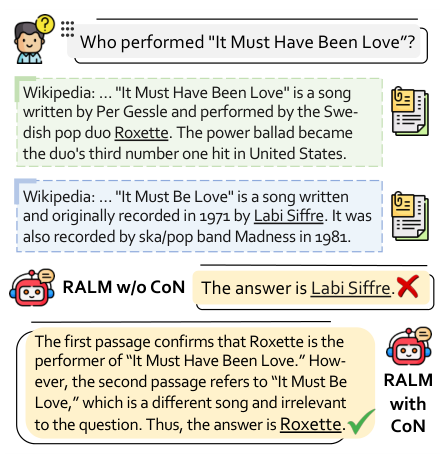
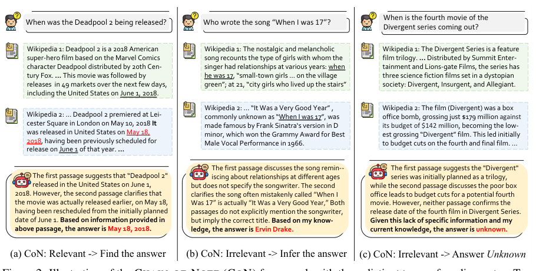
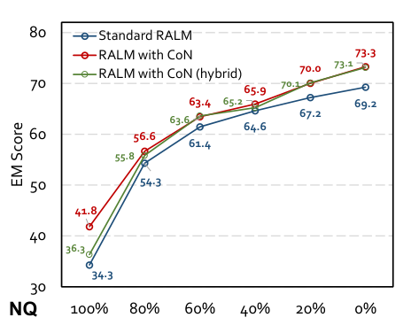

# 笔记链：增强检索增强语言模型的鲁棒性

**（Chain-of-Note: Enhancing Robustness in Retrieval-Augmented Language Models）**

> 本文为 Yu 等人论文《Chain-of-Note: Enhancing Robustness in Retrieval-Augmented Language Models》（EMNLP 2024 录用，arXiv:2311.09210v2）的中文精确翻译。

**作者**：Wenhao Yu, Hongming Zhang, Xiaoman Pan, Peixin Cao, Kaixin Ma, Jian Li, Hongwei Wang, Dong Yu

**单位**：腾讯 AI Lab（Tencent AI Lab）

**联系方式**：wenhaowyu@global.tencent.com

---

## 摘要

检索增强语言模型（Retrieval-Augmented Language Model，RALM）通过利用外部知识源来缓解事实性幻觉，代表了一项重大进步。然而，所检索信息的可靠性并不总是有保证，检索到无关数据可能会误导回答的生成。此外，标准的 RALM 常常由于检索信息的干扰而忽视其内在知识。在检索信息无关的情况下，RALM 理想上应当利用其内在知识；而在内在知识与检索知识都缺失的情况下，则应当选择回答"unknown（未知）"以避免幻觉。在本文中，我们提出 **笔记链（Chain-of-Note，CON）**，一种用于提升 RALM 在面对噪声、无关文档以及处理未知场景时鲁棒性的新方法。CON 的核心思想是，为每篇检索到的文档生成顺序的阅读笔记（reading notes），从而能够全面评估它们与所给问题的相关性，并整合这些信息来构建最终答案。我们的实验结果表明，配备 CON 的 GPT-4 超越了思维链（Chain-of-Thought，CoT）方法。此外，我们利用 GPT-4 生成了 10K 条 CON 数据，随后在 LLaMa-2 7B 模型上进行训练。我们在四个开放域问答基准上的实验表明，配备 CON 的微调 RALM 显著优于标准的微调 RALM。

---

## 1 引言

检索增强语言模型（RALM）代表了一种新颖的框架，它通过解决以下关键局限而显著推进了大型语言模型（large language models，LLM）（Touvron et al., 2023; OpenAI, 2023）：减少事实性幻觉（Ji et al., 2023; Zhang et al., 2023a），以即插即用（plug-and-play）的方式注入最新知识（Dhingra et al., 2022; Vu et al., 2023），以及增强特定领域的专业知识（Li et al., 2023; Qin et al., 2023）。

> 图 1 示例内容（见文末图 1）：面对问题"Who performed 'It Must Have Been Love'?"（《It Must Have Been Love》是谁演唱的？），Wikipedia 段落 1 指出 Roxette 演唱了 "It Must Have Been Love"；而 Wikipedia 段落 2 描述的是 "It Must Be Love"，一首由 Labi Siffre 演唱的不同歌曲，与问题无关。标准 RALM（无 CoN）被无关段落误导，回答 "Labi Siffre"；而带 CoN 的 RALM 正确判断段落 2 无关，回答 "Roxette"。

这些增强主要源于将大型语言模型与外部知识源相结合（Guu et al., 2020; Lewis et al., 2020; Borgeaud et al., 2022; Shi et al., 2023c）。在典型的 RALM 设置中，查询首先由检索器（retriever）处理，它在庞大的证据语料库中搜索相关文档。随后，阅读器（reader）检查这些文档，提取有用信息并构建最终输出答案。

然而，当前的 RALM 框架存在若干问题。首先，无法保证信息检索（information retrieval，IR）系统总能产出最相关或最可信的信息。检索到无关数据可能导致误导性的回答（Shi et al., 2023a; Yoran et al., 2023），并可能使模型忽视其固有知识，即便它拥有足以回答查询的信息（Mallen et al., 2023）。其次，最先进的 LLM 在回答面向事实的问题时常常产生幻觉，这一缺陷可能带来风险并令用户却步（Ji et al., 2023; Zhang et al., 2023a）。理想情况下，一个智能系统应当能够判断自己是否拥有足够的知识（无论是内在的还是检索到的）来给出准确回答。在知识不足的情况下，当无法确定答案时，系统应当回答"unknown"。基于标准 RALM 系统的上述缺陷，在本文中，我们旨在提升 RALM 的鲁棒性，主要聚焦于两个关键方面：

1. **噪声鲁棒性（Noise Robustness）**：RALM 能够辨别并忽略无关检索文档中的噪声信息，同时恰当地利用其内在知识的能力。
2. **未知鲁棒性（Unknown Robustness）**：RALM 在面对其没有相应知识可回答、且检索文档中未找到相关信息的查询时，通过回答"unknown"来承认自身局限的能力。

在这项工作中，我们提出一个名为 **笔记链（Chain-of-Note，CON）** 的新框架，旨在增强 RALM 的鲁棒性。CON 的基石是为检索到的文档生成一系列阅读笔记，从而能够全面评估它们与输入查询的相关性。这种方法不仅评估每篇文档的贴切性，还能定位其中最关键、最可靠的信息。这一过程有效地过滤掉无关或可信度较低的内容，从而产生更精确、上下文更贴切的回答，如图 1 所示。此外，CON 增强了 RALM 处理超出训练数据范围查询的能力。当检索到的文档未提供任何相关信息时，CON 能够引导模型承认其局限，回答"unknown"，或基于可用数据给出可能的解释，从而增强可靠性。

为验证 CON 思想的有效性，我们首先使用 GPT-4 作为阅读器，与思维链（Chain-of-Thought，CoT）（Wei et al., 2022）进行了对比，结果表明 CON 在检索增强场景下比 CoT 更有效。随后，我们提示 GPT-4（OpenAI, 2023）基于从 NQ（Kwiatkowski et al., 2019）收集的问题生成 10K 条训练样本，并在 LLaMa-2 7B 上进行训练，以验证较小规模模型做笔记的能力。我们对集成 CON 的 RALM 与标准 RALM 系统的评估聚焦于三个主要方面：（1）使用 DPR 检索文档的整体 QA 性能；（2）通过向系统引入噪声信息来评估的噪声鲁棒性；（3）通过 LLaMa-2 预训练数据未覆盖的查询（即实时问题）来评估的未知鲁棒性。评估在 NQ 以及三个额外的域外（out-of-domain）开放域 QA 数据集上进行，即 TriviaQA（Joshi et al., 2017）、WebQ（Berant et al., 2013）和 RealTimeQA（Kasai et al., 2023）。我们的实验表明，CON 不仅在使用 DPR 检索文档时提升了整体 QA 性能，还显著增强了噪声和未知两方面的鲁棒性。其中包括：在含噪声检索文档下，准确率（以精确匹配分数衡量）提升 +7.9；对于超出预训练知识范围的实时问题¹，拒绝率提升 +10.5。

> ¹ 我们使用从 RealTimeQA 收集的 2023 年 5 月之后的实时问题，这些数据未被 LLaMa-2 训练过。

---

## 2 提出方法

### 2.1 概述

在本节中，我们介绍笔记链（Chain-of-Note，CON），这是检索增强语言模型（RALM）的一项创新性进展。具体而言，CON 框架为检索到的文档生成顺序阅读笔记，从而能够系统地评估从外部文档检索到的信息的相关性与准确性。通过创建顺序阅读笔记，模型不仅评估每篇文档与查询的贴切性，还能识别这些文档中最关键、最可靠的信息片段。这一过程有助于过滤掉无关或可信度较低的内容，从而产生更准确、上下文更贴切的回答。

### 2.2 现有 RALM 的背景

RALM 标志着语言模型的一项变革性发展，通过融入外部知识来增强其输出。这些模型通过引入一个表示检索文档的辅助变量 d 来运作。这种引入使它们能够考虑一系列可能的文档，从而产生信息更充分、更精确的回答（Lazaridou et al., 2022; Shi et al., 2023c）。RALM 模型可表示为：

p(y|x) = Σ_i p(y|d_i, x) · p(d_i|x)

其中，x 表示输入查询，y 表示模型生成的回答。在实践中，由于潜在来源数量庞大，对所有可能文档求和是不可行的。因此，最常用的方法是使用排名最高的 k 篇文档来近似对 d 的求和，并将所有这些文档作为输入的一部分。我们不失一般性地假设这些文档为 [d_1, …, d_k]，从而得到：

p(y|x) = Σ_{i=1}^{k} p(y|d_i, x) · p(d_i|x)

然而，现有的 RALM 存在若干局限：

- **浅层处理的风险（Risk of Surface-Level Processing）**：当直接生成回答时，语言模型可能依赖于浅层信息，缺乏深度理解。因此，它们很容易忽略问题或文档的细微差别，尤其是在复杂或间接的问题上。
- **难以处理矛盾信息（Difficulty in Handling Contradictory Information）**：当面对包含矛盾信息的文档时，直接生成回答变得具有挑战性。模型可能难以处理这些矛盾，或难以判断哪条信息更可信、更相关。
- **透明度与可解释性降低（Reduced Transparency and Interpretability）**：直接生成回答只能有限地揭示模型是如何得出结论的。这种透明度的缺失使用户难以理解模型结论的依据。
- **对检索文档的过度依赖（Overdependence on Retrieved Documents）**：直接生成可能导致对检索文档内容的过度依赖（即倾向于从检索文档中抽取信息（Shi et al., 2023a）），而忽视模型自身固有的知识库。当检索文档含噪声或已过时时，这一点尤其具有局限性。

### 2.3 笔记链（CHAIN-OF-NOTE）框架

笔记链（CHAIN-OF-NOTE，CON）框架为检索增强语言模型（RALM）所面临的挑战提供了一种解决方案。该框架通过结构化的笔记生成过程，显著增强了 RALM 批判性地评估检索文档的能力。具体而言，它涉及为每篇文档生成简洁且上下文贴切的摘要或笔记。这种方法使模型能够系统地评估从外部文档提取的信息的相关性与准确性。通过创建顺序阅读笔记，CON 不仅评估每篇文档与查询的贴切性，还能定位最可靠的信息并解决相互矛盾的信息。这种方法有效地过滤掉无关或可信度较低的内容，从而产生既更准确又上下文更贴切的回答。

给定输入问题 x 和 k 篇检索文档 [d_1, ···, d_k]，模型旨在生成包含多个片段的文本输出 [y_d1, ···, y_dk, y]。其中，y_di 表示第 i 个片段的 token，代表对应文档 d_i 的阅读笔记，如图 2 所示。在生成各篇阅读笔记之后，模型综合这些信息以生成整合后的最终回答 y。笔记链（CHAIN-OF-NOTE，CON）的实现包含三个关键步骤：（1）设计笔记 y_di；（2）收集数据；（3）训练模型。

#### 2.3.1 笔记链的格式设计

如图 2 所示，该框架主要基于检索文档与输入问题的相关性，构建三种类型的阅读笔记：第一，当一篇文档直接回答了查询时，模型基于这一相关信息构建最终回答，如图 2(a) 所示。第二，如果检索文档没有直接回答查询但提供了有用的上下文，模型利用这些信息并结合其固有知识来推断答案，如图 2(b) 所示。第三，当检索文档无关且模型缺乏足够知识来回答时，它默认回答"unknown"，如图 2(c) 所示。这种细致入微的方法反映了人类的信息处理方式，在直接检索、推理性推理与承认知识空白之间取得了平衡。

#### 2.3.2 数据收集与模型训练

为使模型具备生成此类阅读笔记的能力，收集合适的训练数据至关重要。为每篇阅读笔记进行人工标注是资源密集型的，因此我们采用最先进的语言模型 GPT-4 来生成笔记数据。这种方法既经济高效，又增强了可复现性。我们首先从 NQ（Kwiatkowski et al., 2019）训练数据集中随机采样 10k 个问题。随后，向 GPT-4 提供具体的指令以及针对三种不同类型笔记生成的上下文示例（详见附录 A.5）。在处理整个数据集之前，先在数据的一小部分子集上通过人工评估检验 GPT-4 预测的质量。选择 NQ 作为主要数据集，是因为它包含了来自搜索引擎的多样化真实用户查询。然而，为确保模型的适应性，我们还在三个额外的开放域数据集上测试其性能，包括 TriviaQA、WebQ 和 RealTimeQA，以展示其向域外（OOD）数据的泛化能力。

从 GPT-4 收集到 10K 条训练数据后，下一步是用它们训练 LLaMa-2 7B 模型（Touvron et al., 2023），以验证生成笔记链（CHAIN-OF-NOTE，CON）输出的可行性。为此，我们将指令、问题和文档拼接为提示（prompt），并以标准的监督方式训练模型生成笔记和回答。我们的内部模型学会为每篇文档顺序生成阅读笔记，以评估它们与输入查询的相关性。回答基于文档的相关性来生成，从而提升准确性并减少错误信息。如果所有文档都无关，模型要么依赖固有知识来回答，要么在无法准确确定答案时回答"unknown"。

#### 2.3.3 用于更高效率的混合训练

生成笔记链（CHAIN-OF-NOTE，CON）会增加推理成本，可能阻碍其在实际场景中的使用。为解决这一问题，我们实验了一种简单而有效的策略，用于将 CON 的推理过程内化，称为**混合训练（Hybrid Training）**。具体而言，我们将 50% 的训练时间分配给标准 RALM（直接生成回答而不写笔记），另外 50% 分配给带 CoN 的 RALM。该策略使模型在训练过程中内化中间推理步骤。此外，我们在每类数据之前添加了两个不同的提示词。

在推理阶段，我们仅使用标准 RALM 提示来引导模型，促使它在不依赖显式阅读笔记的情况下输出回答。这种方法利用了训练期间为隐式 CON 推理所发展的隐藏状态。用混合训练策略训练的模型保持了相同的推理时间，同时仅比使用 CoN 略低的性能。结果将在 §3.5 中介绍。

---

## 3 实验

### 3.1 实验设置与评估

#### 3.1.1 数据集与划分

我们使用开放域问答（QA）中的三个基准数据集进行了全面的实验：NQ（Kwiatkowski et al., 2019）、TriviaQA（Joshi et al., 2017）和 WebQ（Berant et al., 2013），更多细节见附录 A.3。此外，我们采用 RealTimeQA（Kasai et al., 2023）作为一个特例来评估"unknown"鲁棒性。

评估基于两个评估集进行：全量集（full set）和子集（subset）评估。首先，类似于传统的开放域 QA 评估，我们使用测试集中的所有问题来评估整体 QA 性能。文档使用 DPR 检索，并将 top-k 文档输入生成器。我们遵循与 Izacard and Grave (2021); Karpukhin et al. (2020) 相同的开放域 QA 测试集划分。对于 TriviaQA，LLaMa-2（Touvron et al., 2023）的评估是在包含 7,993 个样本的 Wikipedia 开发集上进行的。因此，我们也在该开发集上进行相同的评估，以便与其性能对比。其次，为评估模型的噪声鲁棒性和未知鲁棒性，我们从上述测试集中提取出检索列表中包含相关文档的子集。然后，我们逐一枚举每篇检索文档，判断它是否为给定问题的黄金文档（golden document）。根据噪声比例 r，例如，若生成器需要 top-k 文档，则 k·r 为噪声文档的数量，k·(1−r) 为相关文档的数量。例如，当噪声比例为 20% 且需要 top-5 文档时，则有 4 篇相关文档和 1 篇无关文档。在数据预处理中枚举检索文档时，我们填充两个列表；当一个列表达到其上限时，我们停止向该列表添加更多文档，直到两个列表都填满。对于 DPR 未能检索到相关文档的某些问题，我们将其从鲁棒性评估中排除。因此，子集比原始测试集更小，如表 1 所示。

#### 3.1.2 基线方法

笔记链（CHAIN-OF-NOTE，CON）建立在传统的"检索-再-阅读"（retrieve-then-read）流水线之上（Lewis et al., 2020）。近期的实现，如 Lazaridou et al. (2022); Shi et al. (2023a); Luo et al. (2023)，集成了大型语言模型以获得更好的性能。因此，我们主要将我们的方法与这些检索-阅读方法进行对比。如 §2.3 所述，我们将输入问题记为 x，其对应答案记为 y。此外，d_i 表示第 i 篇检索文档，y_di 为该文档的关联阅读笔记。此处我们展示各对比方法的差异。

- **QA fine-tune w/o IR**（无检索的 QA 微调）：被训练为直接从输入问题生成答案，而不依赖任何外部检索信息。本质上，它学习函数 f : x → y，将问题 x 直接转换为答案 y。
- **Retrieve-Read**（检索-阅读）（Shi et al., 2023c）：被训练为不仅从问题、还通过融入检索文档来生成答案。它学习函数 f : {x, d_1, ···, d_k} → y，即将问题 x 和一组检索文档 {d_1, ···, d_k} 转换为答案 y。
- **Retrieve-Read with CHAIN-OF-NOTE**（带笔记链的检索-阅读）：被训练为在构建最终答案之前，为每篇检索文档生成阅读笔记。它学习函数 f : {x, d_1, ···, d_k} → {y_d1, ···, y_dk, y}，从而使模型能够处理问题 x 和检索文档 {d_1, ···, d_k}，产生阅读笔记 {y_d1, ···, y_dk} 和最终答案 y。

为公平比较，我们在相同的训练集上训练所有 LLaMa-2 模型，主要区别在于输入和输出格式。我们还注意到，使用 GPT-4 进行的实验是在零样本（zero-shot）设置下完成的。各实验条件所用的提示详见附录 A.5。

#### 3.1.3 评估指标

对于开放域 QA 性能的评估，我们采用了两个广泛认可的指标：精确匹配（Exact Match，EM）和 F1 分数，如 Chen et al. (2017); Karpukhin et al. (2020); Zhu et al. (2021) 等先前工作所建议的。对于 EM 分数，如果答案的规范化形式——通过 Karpukhin et al. (2020) 描述的规范化流程得到——与所给列表中的任意可接受答案一致，则判定该答案正确。与 EM 分数类似，F1 分数将预测和标准答案视为 token 的集合，并计算预测与标准答案之间的平均重叠度（Chen et al., 2017）。此外，当给定超出语言模型知识范围的查询时，我们使用拒绝率（Reject Rate，RR）来评估未知鲁棒性。

最后，由于 GPT-4 并非直接在开放域 QA 基准上训练，使用 EM / F1 进行评估具有挑战性。因此，我们采用 Mallen et al. (2023); Kandpal et al. (2023) 中概述的方法，以准确率（accuracy）作为评估指标。若预测的任意子串与所给的任意正确答案完全匹配，则准确率判定该预测正确。

### 3.2 整体 QA 性能评估

表 2 表明，RALM 始终优于用 QA 对直接微调（不带检索）的 LLaMa-2。这一改进与检索过程的有效性密切相关。如表 1 所示，DPR 在 NQ 和 TriviaQA 数据集上的检索性能显著优于 WebQ。因此，检索带来的收益在 NQ 和 TriviaQA 上更为显著。此外，将集成 CON 的增强 RALM 与标准 RALM 对比，我们的方法持续表现出更好的性能。以 LLaMa-2 为骨干语言模型时，在三个数据集上 EM 分数平均提升 +1.97。更深入地看，我们发现这一改进取决于 DPR 是否成功检索到相关文档。具体而言，在 NQ 数据集上，当 DPR 检索到相关文档时平均提升为 +1.2，未检索到时为 +2.3。这一差异表明，我们的 CON 在检索第一阶段获取更多噪声文档的场景下更能提升 RALM 的性能。这一观察与我们在噪声鲁棒性上的发现一致，后者将在后续详细阐述实验结果的章节中展开。

此外，较大型语言模型所表现出的动态特性与小规模模型不同，因为前者拥有更优越的事实性知识。在较大模型上，使用检索带来的影响不那么显著，在某些情况下甚至有害，例如在问题大多直截了当的 TriviaQA 上。就 CON 与基线的对比而言，性能趋势与在小规模模型上观察到的一致，表明 CON 在不同模型规模下都保持其重要性。

### 3.3 噪声鲁棒性评估

如表 2 所示，当面对完全由噪声组成的文档时，标准 RALM 和我们的笔记链增强 RALM 的表现都不如无检索的设置。这表明 RALM 可能被噪声信息误导，导致更多幻觉。

值得注意的是，为模型配备 CON 使其性能几乎与直接用 QA 对微调（不带检索）的基线模型相当，展示了它对噪声的鲁棒性以及忽略无关信息的能力。CON 方法不仅在微调的小规模模型中有效，在大型语言模型（如 GPT-4）中同样有效，只需对提示进行调整。此外，与常用于推理场景的思维链（CHAIN-OF-THOUGHT）技术相比，CON 为检索增强设置提供了一种更高效的策略，尤其是在处理知识密集型任务时。

表 3 表明，增强 CON 的 RALM 始终优于标准 RALM，尤其是在文档完全为噪声的场景下。在三个开放域 QA 数据集上，完全噪声文档的 EM 分数平均提升 +7.9。较低噪声比例下的实验也一致地证明了 CON 带来的改进，与整体 QA 性能相吻合。

### 3.4 未知鲁棒性评估

表 4 表明，我们配备 CON 的 RALM 在处理未知场景时表现出更强的鲁棒性，这在 RealTimeQA 基准上尤为明显。该基准完全处于模型的领域之外，包含不属于 LLaMa-2 预训练数据的实时信息。尽管如此，模型在某些情况下仍能给出正确答案，因为答案随时间保持不变。与标准 RALM 系统相比，我们的方法表现出显著的改进，在未知场景下拒绝回答问题的能力提升超过 +10.5。该评估基于拒绝率（RR），即被拒绝的问题数 / 总问题数。这凸显了我们模型在辨别和忽略其初始训练阶段不熟悉或未学到的信息方面增强的能力。

### 3.5 混合训练策略评估

如图 3 和表 5 所示，我们提出的配备混合策略的 RALM 在各种噪声比例下表现出略低的鲁棒性，但保持了与标准 RALM 相似的高效解码时间消耗。这表明我们的笔记链框架在采用混合训练策略实施时，高度适用于广泛的现实业务场景。这种在无显著时间开销下增强鲁棒性的能力，凸显了我们方法的实用价值和效率，使其成为在 QA 准确率可能波动但推理时间至关重要的环境中的可行解决方案。

---

## 4 相关工作

检索增强语言模型（RALM）代表了自然语言处理领域的一项重大进步，它将大型语言模型的能力与外部知识源提供的具体性与细节相结合（Guu et al., 2020; Lewis et al., 2020; Izacard et al., 2022）。近期研究强调了上下文相关性对语言模型性能的影响（Creswell et al., 2022; Shi et al., 2023a; Yoran et al., 2023）。值得注意的是，Creswell et al. (2022) 证明了引入随机或无关的上下文可能对 QA 性能产生不利影响。相反，Shi et al. (2023a) 发现，向示例或任务特定指令添加无关上下文有时可以提升模型性能，这意味着模型可能内在地具备了在预训练期间发展出的应对此类场景的能力。与我们的研究最密切相关的是 Yoran et al. (2023) 的工作，其聚焦于训练 RALM 忽略无关上下文。该方法虽然不同于我们提出的解决方案，但强调了上下文相关性在增强 RALM 有效性方面的重要性。

此外，我们在附录 A.1.1 和 A.2 中介绍了更多相关的 Chain-of-X（X 链）方法（例如思维链（CoT）（Wei et al., 2022））。

---

## 5 结论

在本文中，我们提出了笔记链（CHAIN-OF-NOTE，CON）框架，这是一种旨在增强 RALM 鲁棒性的新方法。CON 的核心概念围绕为每篇检索文档生成顺序阅读笔记。这一过程允许深入评估文档与所提问题的相关性，并有助于综合这些信息以构建最终答案。我们的实验表明，配备 CON 的 GPT-4 超越了思维链方法。此外，我们利用 GPT-4 生成 10K 条 CON 数据，随后在 LLaMa-2 7B 模型上训练。我们在四个开放域 QA 基准上的实验表明，配备 CON 的 RALM 显著优于标准微调的 RALM。

---

## 6 局限性

笔记链（CHAIN-OF-NOTE，CON）方法的一个主要局限是，由于顺序生成笔记，其推理成本增加。虽然 CON 有助于评估相关性和整合外部知识，但它导致更长的响应时间，这对时间敏感型应用是个问题。此外，系统的效率取决于所生成笔记的简洁性和相关性，而这些可能随检索文档的复杂性而波动。

---

## 参考文献

[1] Jonathan Berant, Andrew Chou, Roy Frostig, and Percy Liang. 2013. Semantic parsing on freebase from question-answer pairs. In EMNLP, pages 1533–1544.

[2] Sebastian Borgeaud, Arthur Mensch, Jordan Hoffmann, Trevor Cai, Eliza Rutherford, Katie Millican, George Bm Van Den Driessche, Jean-Baptiste Lespiau, Bogdan Damoc, Aidan Clark, et al. 2022. Improving language models by retrieving from trillions of tokens. In International conference on machine learning, pages 2206–2240. PMLR.

[3] Danqi Chen, Adam Fisch, Jason Weston, and Antoine Bordes. 2017. Reading wikipedia to answer open-domain questions. In Proceedings of the 55th Annual Meeting of the Association for Computational Linguistics (Volume 1: Long Papers), pages 1870–1879.

[4] Hao Cheng, Yelong Shen, Xiaodong Liu, Pengcheng He, Weizhu Chen, and Jianfeng Gao. 2021. Unitedqa: A hybrid approach for open domain question answering. In Proceedings of the 59th Annual Meeting of the Association for Computational Linguistics and the 11th International Joint Conference on Natural Language Processing (Volume 1: Long Papers), pages 3080–3090.

[5] Antonia Creswell, Murray Shanahan, and Irina Higgins. 2022. Selection-inference: Exploiting large language models for interpretable logical reasoning. arXiv preprint arXiv:2205.09712.

[6] Bhuwan Dhingra, Jeremy R Cole, Julian Martin Eisenschlos, Daniel Gillick, Jacob Eisenstein, and William W Cohen. 2022. Time-aware language models as temporal knowledge bases. Transactions of the Association for Computational Linguistics, 10:257–273.

[7] Shehzaad Dhuliawala, Mojtaba Komeili, Jing Xu, Roberta Raileanu, Xian Li, Asli Celikyilmaz, and Jason Weston. 2023. Chain-of-verification reduces hallucination in large language models. arXiv preprint arXiv:2309.11495.

[8] Kelvin Guu, Kenton Lee, Zora Tung, Panupong Pasupat, and Ming-Wei Chang. 2020. Realm: Retrieval-augmented language model pre-training. arXiv preprint arXiv:2002.08909.

[9] Fan Huang, Haewoon Kwak, and Jisun An. 2023. Chain of explanation: New prompting method to generate quality natural language explanation for implicit hate speech. In Proceedings of the ACM Web Conference 2023, pages 90–93.

[10] Gautier Izacard and Edouard Grave. 2021. Leveraging passage retrieval with generative models for open domain question answering. In EACL, pages 874–880.

[11] Gautier Izacard, Patrick Lewis, Maria Lomeli, Lucas Hosseini, Fabio Petroni, Timo Schick, Jane Dwivedi-Yu, Armand Joulin, Sebastian Riedel, and Edouard Grave. 2022. Few-shot learning with retrieval augmented language models. arXiv preprint arXiv:2208.03299.

[12] Ziwei Ji, Nayeon Lee, Rita Frieske, Tiezheng Yu, Dan Su, Yan Xu, Etsuko Ishii, Ye Jin Bang, Andrea Madotto, and Pascale Fung. 2023. Survey of hallucination in natural language generation. ACM Computing Surveys, 55(12):1–38.

[13] Mandar Joshi, Eunsol Choi, Daniel S Weld, and Luke Zettlemoyer. 2017. Triviaqa: A large scale distantly supervised challenge dataset for reading comprehension. In ACL, pages 1601–1611.

[14] Nikhil Kandpal, Haikang Deng, Adam Roberts, Eric Wallace, and Colin Raffel. 2023. Large language models struggle to learn long-tail knowledge. In International Conference on Machine Learning, pages 15696–15707. PMLR.

[15] Vladimir Karpukhin, Barlas Oguz, Sewon Min, Patrick Lewis, Ledell Wu, Sergey Edunov, Danqi Chen, and Wen-tau Yih. 2020. Dense passage retrieval for open-domain question answering. In Proceedings of the 2020 Conference on Empirical Methods in Natural Language Processing (EMNLP), pages 6769–6781.

[16] Jungo Kasai, Keisuke Sakaguchi, Yoichi Takahashi, Ronan Le Bras, Akari Asai, Xinyan Yu, Dragomir Radev, Noah A Smith, Yejin Choi, and Kentaro Inui. 2023. Realtime qa: What's the answer right now? Advances in Neural Information Processing Systems.

[17] Urvashi Khandelwal, Omer Levy, Dan Jurafsky, Luke Zettlemoyer, and Mike Lewis. 2020. Generalization through memorization: Nearest neighbor language models. In International Conference on Learning Representations.

[18] Takeshi Kojima, Shixiang Shane Gu, Machel Reid, Yutaka Matsuo, and Yusuke Iwasawa. 2022. Large language models are zero-shot reasoners. arXiv preprint arXiv:2205.11916.

[19] Tom Kwiatkowski, Jennimaria Palomaki, Olivia Redfield, Michael Collins, Ankur Parikh, Chris Alberti, Danielle Epstein, Illia Polosukhin, Jacob Devlin, Kenton Lee, et al. 2019. Natural questions: A benchmark for question answering research. TACL, pages 452–466.

[20] Angeliki Lazaridou, Elena Gribovskaya, Wojciech Stokowiec, and Nikolai Grigorev. 2022. Internet-augmented language models through few-shot prompting for open-domain question answering. arXiv preprint arXiv:2203.05115.

[21] Patrick Lewis, Ethan Perez, Aleksandra Piktus, Fabio Petroni, Vladimir Karpukhin, Naman Goyal, Heinrich Küttler, Mike Lewis, Wen-tau Yih, Tim Rocktäschel, et al. 2020. Retrieval-augmented generation for knowledge-intensive nlp tasks. Advances in Neural Information Processing Systems, 33:9459–9474.

[22] Xianzhi Li, Xiaodan Zhu, Zhiqiang Ma, Xiaomo Liu, and Sameena Shah. 2023. Are chatgpt and gpt-4 general-purpose solvers for financial text analytics? an examination on several typical tasks. arXiv preprint arXiv:2305.05862.

[23] Hongyin Luo, Yung-Sung Chuang, Yuan Gong, Tianhua Zhang, Yoon Kim, Xixin Wu, Danny Fox, Helen Meng, and James Glass. 2023. Sail: Search-augmented instruction learning. arXiv preprint arXiv:2305.15225.

[24] Ji Ma, Ivan Korotkov, Yinfei Yang, Keith Hall, and Ryan McDonald. 2021. Zero-shot neural passage retrieval via domain-targeted synthetic question generation. In Proceedings of the 16th Conference of the European Chapter of the Association for Computational Linguistics: Main Volume, pages 1075–1088.

[25] Kaixin Ma, Hao Cheng, Yu Zhang, Xiaodong Liu, Eric Nyberg, and Jianfeng Gao. 2023. Chain-of-skills: A configurable model for open-domain question answering. Proceedings of the 61st Annual Meeting of the Association for Computational Linguistic.

[26] Alex Mallen, Akari Asai, Victor Zhong, Rajarshi Das, Daniel Khashabi, and Hannaneh Hajishirzi. 2023. When not to trust language models: Investigating effectiveness of parametric and non-parametric memories. In Proceedings of the 61st Annual Meeting of the Association for Computational Linguistics (Volume 1: Long Papers), pages 9802–9822.

[27] OpenAI. 2023. Gpt-4 technical report. arXiv preprint arXiv:2303.08774.

[28] Chengwei Qin, Aston Zhang, Zhuosheng Zhang, Jiaao Chen, Michihiro Yasunaga, and Diyi Yang. 2023. Is chatgpt a general-purpose natural language processing task solver? arXiv preprint arXiv:2302.06476.

[29] Yingqi Qu, Yuchen Ding, Jing Liu, Kai Liu, Ruiyang Ren, Wayne Xin Zhao, Daxiang Dong, Hua Wu, and Haifeng Wang. 2021. Rocketqa: An optimized training approach to dense passage retrieval for open-domain question answering. In Proceedings of the 2021 Conference of the North American Chapter of the Association for Computational Linguistics: Human Language Technologies, pages 5835–5847.

[30] Jeff Rasley, Samyam Rajbhandari, Olatunji Ruwase, and Yuxiong He. 2020. Deepspeed: System optimizations enable training deep learning models with over 100 billion parameters. In Proceedings of the 26th ACM SIGKDD International Conference on Knowledge Discovery & Data Mining, pages 3505–3506.

[31] Devendra Singh Sachan, Mike Lewis, Dani Yogatama, Luke Zettlemoyer, Joelle Pineau, and Manzil Zaheer. 2022. Questions are all you need to train a dense passage retriever. arXiv preprint arXiv:2206.10658.

[32] Freda Shi, Xinyun Chen, Kanishka Misra, Nathan Scales, David Dohan, Ed H Chi, Nathanael Schärli, and Denny Zhou. 2023a. Large language models can be easily distracted by irrelevant context. In International Conference on Machine Learning, pages 31210–31227. PMLR.

[33] Freda Shi, Mirac Suzgun, Markus Freitag, Xuezhi Wang, Suraj Srivats, Soroush Vosoughi, Hyung Won Chung, Yi Tay, Sebastian Ruder, Denny Zhou, et al. 2023b. Language models are multilingual chain-of-thought reasoners. In The Eleventh International Conference on Learning Representations.

[34] Weijia Shi, Sewon Min, Michihiro Yasunaga, Minjoon Seo, Rich James, Mike Lewis, Luke Zettlemoyer, and Wen-tau Yih. 2023c. Replug: Retrieval-augmented black-box language models. arXiv preprint arXiv:2301.12652.

[35] Devendra Singh, Siva Reddy, Will Hamilton, Chris Dyer, and Dani Yogatama. 2021. End-to-end training of multi-document reader and retriever for open-domain question answering. Advances in Neural Information Processing Systems, 34:25968–25981.

[36] Hugo Touvron, Louis Martin, Kevin Stone, Peter Albert, Amjad Almahairi, Yasmine Babaei, Nikolay Bashlykov, Soumya Batra, Prajjwal Bhargava, Shruti Bhosale, et al. 2023. Llama 2: Open foundation and fine-tuned chat models. arXiv preprint arXiv:2307.09288.

[37] Harsh Trivedi, Niranjan Balasubramanian, Tushar Khot, and Ashish Sabharwal. 2023. Interleaving retrieval with chain-of-thought reasoning for knowledge-intensive multi-step questions. Proceedings of the 61st Annual Meeting of the Association for Computational Linguistics.

[38] Tu Vu, Mohit Iyyer, Xuezhi Wang, Noah Constant, Jerry Wei, Jason Wei, Chris Tar, Yun-Hsuan Sung, Denny Zhou, Quoc Le, et al. 2023. Freshllms: Refreshing large language models with search engine augmentation. arXiv preprint arXiv:2310.03214.

[39] Jianing Wang, Qiushi Sun, Nuo Chen, Xiang Li, and Ming Gao. 2023a. Boosting language models reasoning with chain-of-knowledge prompting. arXiv preprint arXiv:2306.06427.

[40] Keheng Wang, Feiyu Duan, Sirui Wang, Peiguang Li, Yunsen Xian, Chuantao Yin, Wenge Rong, and Zhang Xiong. 2023b. Knowledge-driven cot: Exploring faithful reasoning in llms for knowledge-intensive question answering. arXiv preprint arXiv:2308.13259.

[41] Jason Wei, Xuezhi Wang, Dale Schuurmans, Maarten Bosma, Ed Chi, Quoc Le, and Denny Zhou. 2022. Chain of thought prompting elicits reasoning in large language models. arXiv preprint arXiv:2201.11903.

[42] Ori Yoran, Tomer Wolfson, Ori Ram, and Jonathan Berant. 2023. Making retrieval-augmented language models robust to irrelevant context. arXiv preprint arXiv:2310.01558.

[43] Donghan Yu, Chenguang Zhu, Yuwei Fang, Wenhao Yu, Shuohang Wang, Yichong Xu, Xiang Ren, Yiming Yang, and Michael Zeng. 2022. Kg-fid: Infusing knowledge graph in fusion-in-decoder for open-domain question answering. In Proceedings of the 60th Annual Meeting of the Association for Computational Linguistics (Volume 1: Long Papers), pages 4961–4974.

[44] Wenhao Yu, Dan Iter, Shuohang Wang, Yichong Xu, Mingxuan Ju, Soumya Sanyal, Chenguang Zhu, Michael Zeng, and Meng Jiang. 2023a. Generate rather than retrieve: Large language models are strong context generators. International Conference for Learning Representation (ICLR).

[45] Wenhao Yu, Zhihan Zhang, Zhenwen Liang, Meng Jiang, and Ashish Sabharwal. 2023b. Improving language models via plug-and-play retrieval feedback. arXiv preprint arXiv:2305.14002.

[46] Yue Zhang, Yafu Li, Leyang Cui, Deng Cai, Lemao Liu, Tingchen Fu, Xinting Huang, Enbo Zhao, Yu Zhang, Yulong Chen, et al. 2023a. Siren's song in the ai ocean: A survey on hallucination in large language models. arXiv preprint arXiv:2309.01219.

[47] Zhuosheng Zhang, Aston Zhang, Mu Li, Hai Zhao, George Karypis, and Alex Smola. 2023b. Multimodal chain-of-thought reasoning in language models. arXiv preprint arXiv:2302.00923.

[48] Zexuan Zhong, Tao Lei, and Danqi Chen. 2022. Training language models with memory augmentation. In Proceedings of the 2022 Conference on Empirical Methods in Natural Language Processing, pages 5657–5673.

[49] Fengbin Zhu, Wenqiang Lei, Chao Wang, Jianming Zheng, Soujanya Poria, and Tat-Seng Chua. 2021. Retrieving and reading: A comprehensive survey on open-domain question answering. arXiv preprint arXiv:2101.00774.

---

## 附录

### A.1 更多相关工作

#### A.1.1 检索增强语言模型

检索增强语言模型（RALM）代表了自然语言处理领域的一项重大进步，它将大型语言模型的能力与外部知识源提供的具体性与细节相结合（Guu et al., 2020; Lewis et al., 2020; Izacard et al., 2022）。这些模型首先利用检索器扫描庞大的证据语料库（如 Wikipedia），以识别与用户查询相关的一组文档。随后，阅读器组件被用于细致地分析这些文档并构建回答。这种双管齐下的方法确保了生成答案的相关性与深度。近期的后续工作主要聚焦于改进检索器（Karpukhin et al., 2020; Qu et al., 2021; Sachan et al., 2022; Ma et al., 2023）或阅读器（Izacard and Grave, 2021; Cheng et al., 2021; Yu et al., 2022）、端到端地训练系统（Lewis et al., 2020; Singh et al., 2021），以及将检索系统与大规模黑盒语言模型集成（Yu et al., 2023a; Shi et al., 2023c; Yu et al., 2023b; Trivedi et al., 2023）。另一类 RALM，如 kNN-LM（Khandelwal et al., 2020; Zhong et al., 2022），在推理时检索一组 token，并在下一个 token 分布与由检索 token 计算的 kNN 分布之间进行插值。这一演进也催生了检索增强产品的出现与流行，如 ChatGPT 插件、LangChain 和 New Bing。

### A.2 大型语言模型中的 Chain-of-X 方法

近期研究表明，大型语言模型（LLM）能够将复杂问题分解为一系列中间步骤，这一能力由思维链（CoT）提示（Wei et al., 2022; Kojima et al., 2022）的概念开创。CoT 方法反映了人类解决问题的方式，即将复杂问题分解为更小的组成部分。通过这样做，LLM 能够以集中的注意力处理问题的每个片段，降低忽略关键细节或做出错误假设的可能性。这种顺序分解使推理过程更加透明，从而更容易识别和纠正任何逻辑失误。

CoT 方法已被有效地应用于各种场景，包括多模态推理（Zhang et al., 2023b）、多语言场景（Shi et al., 2023b）和知识驱动的应用（Wang et al., 2023b）。此外，其他 chain-of-X 方法的发展也大量涌现，以应对 LLM 应用中的各种挑战。这些方法包括链式解释（chain-of-explanation）（Huang et al., 2023）、链式知识（chain-of-knowledge）（Wang et al., 2023a）、链式验证（chain-of-verification）（Dhuliawala et al., 2023）以及 IR 思维链（IR chain-of-thought）（Trivedi et al., 2023）。例如，链式验证（Dhuliawala et al., 2023）生成初始回答、构造验证问题，并基于这些问题修正回答，从而减少回答中的事实错误和幻觉。与我们的工作密切相关的是 IR 思维链（Trivedi et al., 2023），它利用 CoT 来推断和补充未检索到的信息，从而提高复杂推理任务的准确性。虽然 chain-of-X 方法在提升 LLM 跨领域性能方面展现出前景，但它们在 RALM 中的应用——尤其是在提升噪声和未知场景下的鲁棒性方面——相对未被探索。这一空白意味着进一步研究将这些策略应用于增强 RALM，从而提升其鲁棒性和可靠性，是有意义的。

### A.3 数据集信息

- TriviaQA（Joshi et al., 2017）包含一组从 trivia 和 quiz-league 网站抓取的问答对。
- WebQ（Berant et al., 2013）由使用 Google Suggest API 选择的问题组成，其答案是 Freebase 中的实体。
- NQ（Kwiatkowski et al., 2019）收集自真实的 Google 搜索查询，答案是由人工标注者在 Wikipedia 文章中识别的一个或多个片段。

### A.4 实现细节

在检索阶段，我们采用 DPR（Karpukhin et al., 2020）从 Wikipedia 检索文档。我们通过直接加载托管在 GitHub 上的 DPR 官方仓库来访问该模型。在检索之后，我们对 LLaMA-2（Touvron et al., 2023）模型的微调过程运行 3 个 epoch，批大小设为 128，利用 DeepSpeed 库（Rasley et al., 2020）和 ZeRO 优化器（Ma et al., 2021），采用 bfloat16 精度。学习率设为 {1e-6, 2e-6, 5e-6, 1e-5, 2e-5}，经验结果表明 5e-6 能取得最佳的模型性能，因此我们对所有报告的数字统一采用该学习率。所有实验在推理时均采用贪心解码（greedy decoding）以确保生成的确定性。

### A.5 指令提示

1. 对于标准 RALM，指令为：
   - 任务描述：主要目标是简要回答问题。
2. 对于带 COT 的 RALM，指令为：
   - 任务描述：逐步思考以回答问题。
3. 对于带 CON 的 RALM，指令为：
   - 任务描述：
     1. 阅读所给问题和五个 Wikipedia 段落以收集相关信息。
     2. 撰写阅读笔记，总结这些段落的关键点。
     3. 讨论所给问题与 Wikipedia 段落的相关性。
     4. 如果某些段落与所给问题相关，基于这些段落给出简要回答。
     5. 如果没有段落相关，则不考虑这些段落，直接给出回答。

### A.6 案例研究

在我们的案例研究中，如表 6 所示，我们比较了标准 RALM 与我们增强的带 COT 的 RALM 所生成的回答。这些示例凸显了每个模型处理和解释检索文档信息方式的差异。

第一个案例涉及一个关于在美国举办的最远一届夏季奥运会的问题。标准 RALM 被"Chicago's bid for the 2016 Summer Olympics"（芝加哥申办 2016 年夏季奥运会）的表述所误导。由于缺乏对内容的深入理解，它错误地聚焦于更近的年份（2016），导致回答不准确。相比之下，带 CON 的 RALM 仔细分析了信息。它注意到虽然芝加哥申办了 2016 年奥运会，但没有证据表明其申办成功。这导致了正确的结论：在美国举办的最远一届奥运会是 1996 年。第二个案例研究涉及识别第一位 Jnanpith 奖（印度文学奖）得主的语言。在此，标准 RALM 未能跨文档综合信息。它识别出 G. Sankara Kurup 是获奖者，但未将此信息与其作品的语言联系起来。相反，带 CON 的 RALM 有效地结合了两篇文档的细节。它认识到，虽然第一篇文档提到了 Kurup 的获奖，但第二篇文档提供了缺失的语言细节，从而得出正确的答案：马拉雅拉姆语（Malayalam）。

### A.7 许可证

四个开放域 QA 基准和 LLaMa-2 模型均在 MIT 许可证下发布。它们均用于研究目的，我们的实验符合其预期用途。

---

## 图与表

### 图 1

**图 1：与当前 RALM 相比，笔记链（CHAIN-OF-NOTE，CON）背后的核心思想是为检索到的文档生成顺序阅读笔记，确保在构建最终回答之前系统地评估它们与输入问题的相关性。** 图中示例：面对问题"Who performed 'It Must Have Been Love'?"（《It Must Have Been Love》是谁演唱的？），标准 RALM（无 CoN）被无关的 "It Must Be Love" 段落误导而回答 "Labi Siffre"；带 CoN 的 RALM 识别出该段落无关，正确回答 "Roxette"。

### 图 2

**图 2：笔记链（CHAIN-OF-NOTE，CON）框架的示意图，包含三种不同类型的阅读笔记。** 类型 (a) 描绘了语言模型识别出一篇直接回答查询的文档，从而基于检索信息构建最终答案的场景。类型 (b) 表示检索文档虽然未直接回答查询，但提供了上下文见解，使语言模型能够将这一上下文与其固有知识相结合以推断答案的情形。类型 (c) 展示了语言模型遇到无关文档且缺乏必要知识来回答，从而给出"unknown"答案的实例。该图例示了 CoN 框架自适应处理信息的能力，在直接信息检索、上下文推理以及对其知识边界的认知之间取得平衡。

### 图 3

**图 3：使用混合训练策略在各种噪声比例下表现出略低的鲁棒性，但始终优于标准 RALM。**（纵轴为 NQ 数据集上的 EM 分数，横轴为噪声比例 100%–0%。）

### 表 1：数据集统计

召回率的评估基于全量测试集上的 DPR 检索。

| 数据集 | 全量规模 | IR 召回率 | 子集规模 |
|--------|---------|----------|---------|
| NQ | 3,610 | 73.82 | 2,086 |
| TriviaQA | 7,993 | 89.95 | 7,074 |
| WebQ | 2,032 | 64.22 | 1,231 |

### 表 2：全量测试集评估结果

配备笔记链（CHAIN-OF-NOTE，CON）的 RALM 在全量测试集评估中相比标准 RALM 表现出边际改进。重要的是，它在含噪声文档的场景下显著优于标准 RALM 系统，表明 CON 能够大幅增强模型的噪声鲁棒性。

* SAIL 是为检索增强指令微调设计的，因此可能并非理想的事实性 QA 模型。
† 用 EM 分数评估 GPT-4 输出具有挑战性；我们选择准确率，原因见 §3.1.3。

**（a）骨干语言模型：LLaMa-2 7B（EM / F1）**

| 模型 | NQ (EM / F1) | TriviaQA (EM / F1) | WebQ (EM / F1) | 平均 (EM / F1) |
|------|-------------|-------------------|---------------|---------------|
| QA fine-tune w/o IR | 28.80 / 37.53 | 63.19 / 68.61 | 28.30 / 42.77 | 35.98 / 44.27 |
| SAIL (Luo et al., 2023)* | 36.20 / 44.23 | 73.20 / 80.92 | 27.92 / 40.65 | 45.77 / 55.27 |
| Retrieve-Read (Shi et al., 2023c) | 47.39 / 55.81 | 74.92 / 81.53 | 29.58 / 43.51 | 48.49 / 56.97 |
| + CHAIN-OF-NOTE（ours） | 48.92 / 57.53 | 76.27 / 82.25 | 32.33 / 46.68 | 50.46 / 58.78 |
| （较 Retrieve-Read 的差值） | (+1.53 / +1.72) | (+1.35 / +0.72) | (+2.75 / +3.17) | (+1.97 / +1.81) |

**（b）骨干语言模型：GPT-4-1106 †（准确率）**

| 模型 | NQ (Acc.) | TriviaQA (Acc.) | WebQ (Acc.) | 平均 (Acc.) |
|------|-----------|-----------------|-------------|------------|
| QA prompt w/o IR | 54.0 | 74.2 | 56.2 | 61.5 |
| Retrieve-Read (Shi et al., 2023c) | 61.8 | 70.6 | 56.8 | 63.1 |
| + CHAIN-OF-THOUGHT | 63.6 | 71.2 | 58.4 | 64.4 |
| + CHAIN-OF-NOTE（OURS） | 63.8 | 74.6 | 58.8 | 65.7 |
| （较 Retrieve-Read 的差值） | (+2.0) | (+4.0) | (+2.0) | (+2.6) |

> 注：GPT-4 实验采用零样本设置，仅报告准确率（而非 EM/F1）；LLaMa-2 7B 块报告 EM 与 F1 两个指标。表中差值行对应"CHAIN-OF-NOTE 相对 Retrieve-Read（标准 RALM）"的提升。

### 表 3：噪声鲁棒性评估

骨干语言模型为 LLaMa-2 7B。笔记链框架相比标准 RALM 系统表现出更优的性能，尤其是在较高噪声比例下尤为显著。我们在 §3.1.1 中解释了如何根据真实场景合成不同噪声比例的数据。

| 噪声比例 | 模型 | NQ (EM / F1) | TriviaQA (EM / F1) | WebQ (EM / F1) | 平均 (EM / F1) |
|---------|------|-------------|-------------------|---------------|---------------|
| 100% | Retrieve-Read | 34.28 / 41.74 | 55.30 / 61.67 | 29.58 / 46.34 | 39.72 / 49.92 |
| 100% | + CHAIN-OF-NOTE | 41.83 / 49.58 | 64.30 / 70.00 | 36.85 / 53.07 | 47.66 / 57.55 |
| | 差值 | (+7.55 / +7.84) | (+9.00 / +8.33) | (+7.27 / +6.73) | (+7.94 / +7.63) |
| 80% | Retrieve-Read | 54.28 / 61.03 | 73.83 / 80.02 | 35.46 / 52.70 | 54.52 / 64.58 |
| 80% | + CHAIN-OF-NOTE | 56.63 / 63.23 | 75.89 / 81.24 | 40.60 / 56.54 | 57.70 / 67.00 |
| | 差值 | (+2.35 / +2.20) | (+2.06 / +1.22) | (+5.14 / +3.84) | (+3.18 / +2.42) |
| 60% | Retrieve-Read | 61.44 / 67.94 | 78.44 / 83.65 | 37.01 / 54.16 | 58.96 / 68.58 |
| 60% | + CHAIN-OF-NOTE | 63.43 / 69.33 | 78.79 / 84.07 | 41.26 / 56.91 | 61.16 / 70.10 |
| | 差值 | (+1.99 / +1.39) | (+0.35 / +0.42) | (+4.25 / +2.75) | (+2.20 / +1.52) |
| 40% | Retrieve-Read | 64.62 / 71.12 | 80.56 / 86.76 | 38.40 / 55.60 | 61.19 / 71.16 |
| 40% | + CHAIN-OF-NOTE | 65.91 / 72.22 | 81.72 / 87.11 | 42.16 / 58.15 | 63.26 / 72.49 |
| | 差值 | (+1.29 / +1.10) | (+1.16 / +0.35) | (+3.76 / +2.55) | (+2.07 / +1.33) |
| 20% | Retrieve-Read | 67.21 / 73.69 | 81.73 / 87.89 | 39.95 / 56.66 | 62.96 / 72.75 |
| 20% | + CHAIN-OF-NOTE | 70.00 / 76.08 | 82.86 / 88.24 | 44.36 / 60.13 | 65.74 / 74.82 |
| | 差值 | (+2.79 / +2.39) | (+1.13 / +0.35) | (+4.41 / +3.47) | (+2.78 / +2.07) |
| 0% | Retrieve-Read | 69.23 / 75.57 | 83.34 / 89.44 | 42.24 / 58.59 | 64.93 / 74.53 |
| 0% | + CHAIN-OF-NOTE | 73.28 / 79.86 | 83.52 / 88.94 | 46.16 / 62.38 | 67.65 / 77.06 |
| | 差值 | (+4.05 / +4.29) | (+0.18 / −0.50) | (+3.92 / +3.79) | (+2.72 / +2.53) |

### 表 4：未知鲁棒性评估

CON 相比标准 RALM 系统表现出更好的性能。

| 模型 | RealTimeQA EM | RealTimeQA F1 | RealTimeQA RR |
|------|--------------|--------------|--------------|
| Retrieve-Read (Shi et al., 2023c) | 15.6 | 19.9 | 6.1 |
| + CHAIN-OF-NOTE（ours） | 15.7 | 20.3 | 13.0 |

### 表 5：推理时间对比

推理时间对比展示的是在 8×A100 GPU 上每例的平均解码时间。

| 模型 | 推理时间 (s) |
|------|-------------|
| Retrieve-Read | 0.6104 |
| + CHAIN-OF-NOTE | 12.0192 |
| + CHAIN-OF-NOTE（hybrid） | 0.6074 |

### 表 6：案例研究

与标准 RALM 相比，我们带笔记链的 RALM 表现出对文档如何揭示与问题相关信息更深入的理解。它超越了仅仅捕捉表层词语的层面，从而产生更准确的回答。

| 案例 | 标准 RALM | RALM with CHAIN-OF-NOTE |
|------|-----------|------------------------|
| **问题**：When was the last Summer Olympics in the USA?（美国上一次举办夏季奥运会是何时？）**答案**：1996 | 2016 ✘ | 笔记：Wikipedia 段落 #1 讨论了芝加哥申办 2016 年夏季奥运会，但未提及该申办是否成功；Wikipedia 段落 #2 确认 1996 年夏季奥运会是在美国举办的最近一届夏季奥运会。基于以上段落信息，答案是 1996 ✔ |
| **问题**：The first Jnanpith Award recipient was an author in which language?（第一位 Jnanpith 奖得主是用哪种语言创作的作家？）**答案**：Malayalam（马拉雅拉姆语） | G. Sankara Kurup ✘ | 笔记：Wikipedia 段落 #1 指出第一届 Jnanpith 奖于 1965 年授予 G. Sankara Kurup，以表彰其诗集 Odakkuzhal；Wikipedia 段落 #2 提到 Jnanpith 奖于 1966 年授予 G. Sankara Kurup，以表彰其用马拉雅拉姆语创作的作品。基于以上段落信息，答案是 Malayalam ✔ |
